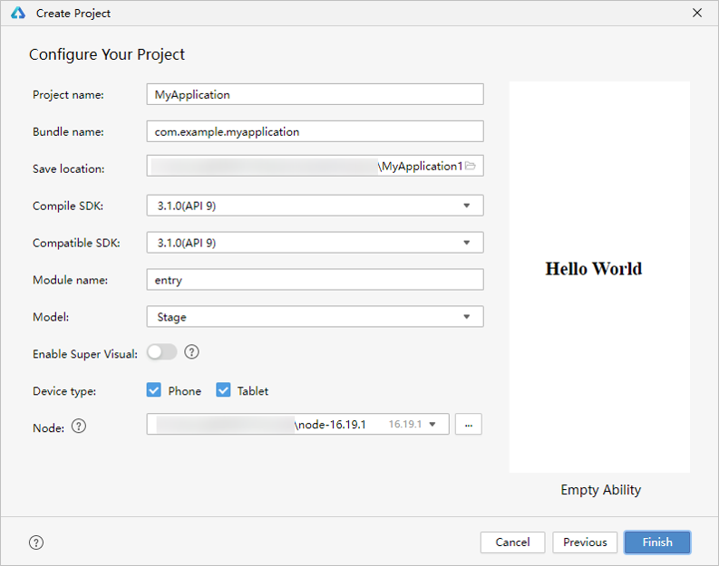
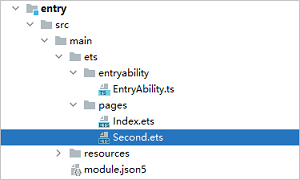
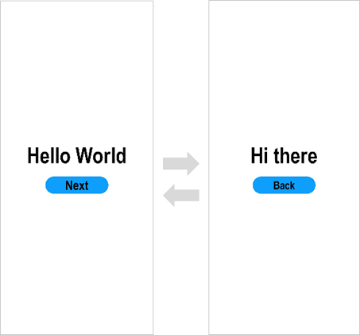
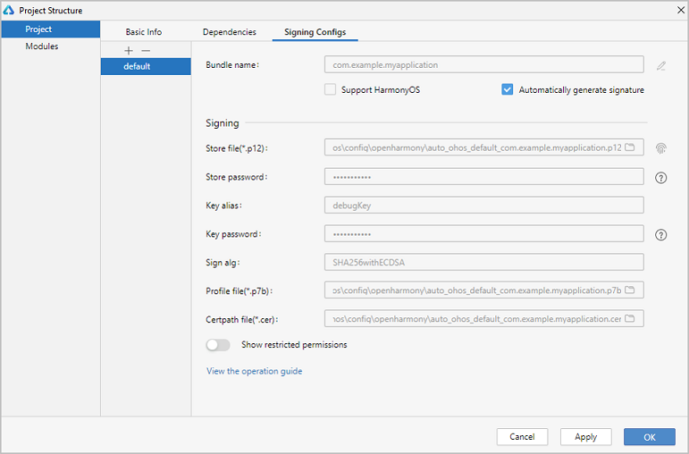

# Building the First ArkTS Application in Stage Model


> **NOTE**
>
> In this document, DevEco Studio 4.1 Beta1 is used.<!--Del--> You can download it [here](../../release-notes/OpenHarmony-v4.1-beta1.md#version-mapping).<!--DelEnd-->

## Creating an ArkTS Project

1. If you are opening DevEco Studio for the first time, click **Create Project**. If a project is already open, choose **File** > **New** > **Create Project** from the menu bar.

2. On the **Choose Your Ability Template** page, select **Application** (or **Atomic Service**, depending on your project), select **[OpenHarmony]Empty Ability** as the template, and click **Next**.

   

3. On the project configuration page, set **Compile SDK** to **11** and retain the default values for other parameters.

   The **Node** parameter sets the Node.js version to use for the project. You can use an existing version or download a new one.

   

4. Click **Finish**. DevEco Studio will automatically generate the sample code and resources that match your project type. Wait until the project is created.


## ArkTS Project Directory Structure (Stage Model)


- **AppScope &gt; app.json5**: application-level configuration information. For details, see [app.json5 Configuration File](app-configuration-file.md).

- **entry**: OpenHarmony project module, which can be built into an ability package (HAP).
  - **src > main > ets**: a collection of ArkTS source code.
  
  - **src > main > ets > entryability**: entry to your application/service.
  
  - **src > main > ets > pages**: pages included in your application/service.
  
  - **src > main > resources**: a collection of resource files used by your application/service, such as graphics, multimedia, character strings, and layout files. For details about resource files, see [Resource Categories and Access](resource-categories-and-access.md#resource-categories).
  
  - **src > main > module.json5**: module configuration file. This file describes the global configuration information of the application/service, the device-specific configuration information, and the configuration information of the HAP file. For details, see [module.json5 Configuration File](module-configuration-file.md).
  
  - **build-profile.json5**: current module information and build configuration options, including **buildOption** and **targets**.
  
  - **hvigorfile.ts**: module-level build script. You can customize related tasks and code implementation in this file.
  - **obfuscation-rules.txt**: obfuscation rule file. When obfuscation is enabled, DevEco Studio compiles, obfuscates, and compresses code during builds in Release mode.
  
- **oh_modules**: third-party library dependency information.

- **build-profile.json5**: application-level configuration information, including the **signingConfigs** and **products** configuration.

- **hvigorfile.ts**: application-level build script.


## Building the First Page

1. Use the **\<Text>** component.

   After the project synchronization is complete, choose **entry** > **src** > **main** > **ets** > **pages** in the **Project** window and open the **Index.ets** file. You can see that the file contains a **\<Text>** component. The sample code in the **Index.ets** file is shown below:
   
   ```ts
   // Index.ets
   @Entry
   @Component
   struct Index {
     @State message: string = 'Hello World';
   
     build() {
       Row() {
         Column() {
           Text(this.message)
             .fontSize(50)
             .fontWeight(FontWeight.Bold)
         }
         .width('100%')
       }
       .height('100%')
     }
   }
   ```

2. Add a **\<Button>** component.

   On the default page, add a **\<Button>** component to respond to user clicks and implement redirection to another page. The sample code in the **Index.ets** file is shown below:
   
   ```ts
   // Index.ets
   @Entry
   @Component
   struct Index {
     @State message: string = 'Hello World';
   
     build() {
       Row() {
         Column() {
           Text(this.message)
             .fontSize(50)
             .fontWeight(FontWeight.Bold)
           // Add a button to respond to user clicks.
           Button() {
             Text('Next')
               .fontSize(30)
               .fontWeight(FontWeight.Bold)
           }
           .type(ButtonType.Capsule)
           .margin({
             top: 20
           })
           .backgroundColor('#0D9FFB')
           .width('40%')
           .height('5%')
         }
         .width('100%')
       }
       .height('100%')
     }
   }
   ```

3. On the toolbar in the upper right corner of the editing window, click **Previewer**. Below is how the first page looks in the Previewer.

   


## Building the Second Page

1. Create the second page.

   - Create the second page file: In the **Project** window, choose **entry** > **src** > **main** > **ets**. Right-click the **pages** folder, choose **New** > **ArkTS File**, name the page **Second**, and click **Finish**. Below is the structure of the **Second** folder.

      

      >  **NOTE**
      >
      > You can also right-click the **pages** folder and choose **New** > **Page** from the shortcut menu. In this scenario, you do not need to manually configure page routes.
   - Configure the route for the second page: In the **Project** window, choose **entry** > **src** > **main** > **resources** > **base** > **profile**. In the **main_pages.json** file, set **pages/Second** under **src**. The sample code is as follows:
     
      ```json
      {
        "src": [
          "pages/Index",
          "pages/Second"
        ]
      }
      ```

2. Add **\<Text>** and **\<Button>** components.

   Add **\<Text>** and **\<Button>** components and set their styles, by referring to the first page. The sample code in the **Second.ets** file is shown below:
   
   ```ts
   // Second.ets
   @Entry
   @Component
   struct Second {
     @State message: string = 'Hi there';
   
     build() {
       Row() {
         Column() {
           Text(this.message)
             .fontSize(50)
             .fontWeight(FontWeight.Bold)
           Button() {
             Text('Back')
               .fontSize(25)
               .fontWeight(FontWeight.Bold)
           }
           .type(ButtonType.Capsule)
           .margin({
             top: 20
           })
           .backgroundColor('#0D9FFB')
           .width('40%')
           .height('5%')
         }
         .width('100%')
       }
       .height('100%')
     }
   }
   ```


## Implementing Page Redirection

You can implement page redirection through the [page router](../reference/apis-arkui/js-apis-router.md), which finds the target page based on the page URL. Import the **router** module and then perform the steps below.

To deliver better transition effects, use [Navigation](../ui/arkts-navigation-navigation.md).

1. Implement redirection from the first page to the second page.

   In the **Index.ets** file of the first page, bind the **onClick** event to the **Next** button so that clicking the button redirects the user to the second page. The sample code in the **Index.ets** file is shown below:
   
   ```ts
   // Index.ets
   // Import the router module.
   import { router } from '@kit.ArkUI';
   import { BusinessError } from '@kit.BasicServicesKit';
   
   @Entry
   @Component
   struct Index {
     @State message: string = 'Hello World';
   
     build() {
       Row() {
         Column() {
           Text(this.message)
             .fontSize(50)
             .fontWeight(FontWeight.Bold)
           // Add a button to respond to user clicks.
           Button() {
             Text('Next')
               .fontSize(30)
               .fontWeight(FontWeight.Bold)
           }
           .type(ButtonType.Capsule)
           .margin({
             top: 20
           })
           .backgroundColor('#0D9FFB')
           .width('40%')
           .height('5%')
           // Bind the onClick event to the Next button so that clicking the button redirects the user to the second page.
           .onClick(() => {
             console.info(`Succeeded in clicking the 'Next' button.`)
            // Go to the second page.
              router.pushUrl({ url: 'pages/Second' }).then(() => {
                console.info('Succeeded in jumping to the second page.')
              }).catch((err: BusinessError) => {
                console.error(`Failed to jump to the second page.Code is ${err.code}, message is ${err.message}`)
              })
           })
         }
         .width('100%')
       }
       .height('100%')
     }
   }
   ```

2. Implement redirection from the second page to the first page.

   In the **Second.ets** file of the second page, bind the **onClick** event to the **Back** button so that clicking the button redirects the user back to the first page. The sample code in the **Second.ets** file is shown below:
   
   ```ts
   // Second.ets
   // Import the router module.
   import { router } from '@kit.ArkUI';
   import { BusinessError } from '@kit.BasicServicesKit';
   
   @Entry
   @Component
   struct Second {
     @State message: string = 'Hi there';
   
     build() {
       Row() {
         Column() {
           Text(this.message)
             .fontSize(50)
             .fontWeight(FontWeight.Bold)
           Button() {
             Text('Back')
               .fontSize(25)
               .fontWeight(FontWeight.Bold)
           }
           .type(ButtonType.Capsule)
           .margin({
             top: 20
           })
           .backgroundColor('#0D9FFB')
           .width('40%')
           .height('5%')
           // Bind the onClick event to the Back button so that clicking the button redirects the user back to the first page.
           .onClick(() => {
             console.info(`Succeeded in clicking the 'Back' button.`)
             try {
               // Return to the first page.
               router.back()
               console.info('Succeeded in returning to the first page.')
             } catch (err) {
                let code = (err as BusinessError).code;
                let message = (err as BusinessError).message;
               console.error(`Failed to return to the first page.Code is ${code}, message is ${message}`)
             }
           })
         }
         .width('100%')
       }
       .height('100%')
     }
   }
   ```

3. Open the **Index.ets** file and click  in the Previewer to refresh the file. The display effect is shown in the figure below.

   


## Running the Application on a Real Device

1. Connect the development board running the OpenHarmony standard system to the computer.

2. Choose **File** > **Project Structure...** > **Project** > **SigningConfigs**, and select **Automatically generate signature**. Wait until the automatic signing is complete, and click **OK**. See the following figure.

   

3. On the toolbar in the upper right corner of the editing window, click . The display effect is shown in the figure below.

   

Congratulations! You have finished developing your OpenHarmony application in ArkTS in the stage model.
