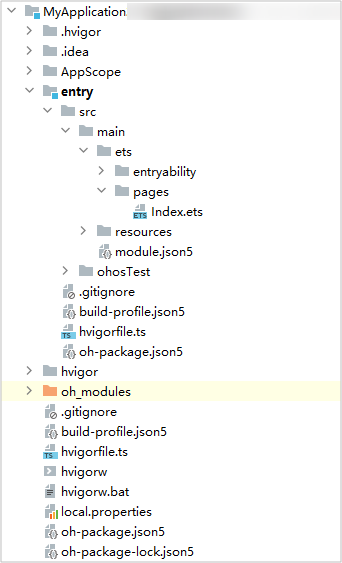
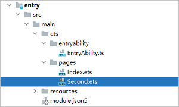
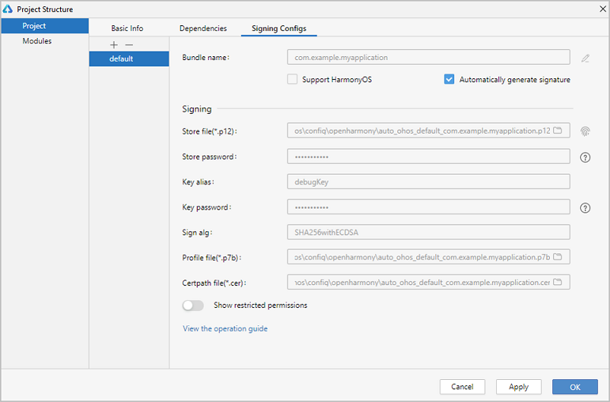

# Building the First ArkTS Application in Stage Model

<!--Kit: Common-->
<!--Subsystem: Common-->
<!--Owner: @ge-yafang-->
<!--Designer: @ge-yafang-->
<!--Tester: @ge-yafang-->
<!--Adviser: @ge-yafang-->
<!-- md-trans-meta sourceCommit=89495e7a36933b261220328f8ea8c98108c58b84 translatedAt=2026-08-13T09:07:42.952Z pushedAt=2026-08-13T14:11:03.642Z -->

<!--Kit: Common-->
<!--Subsystem: Common-->
<!--Owner: @ge-yafang-->
<!--Designer: @ge-yafang-->
<!--Tester: @ge-yafang-->
<!--Adviser: @ge-yafang-->

## Creating an ArkTS Project

> **NOTE**
>
> - Since DevEco Studio 4.1 Beta1, you can only create a HarmonyOS project by default. To create an OpenHarmony project, you should modify some fields in the created HarmonyOS project.
>
> - To ensure optimal results, this guide uses the latest version of [DevEco Studio](https://developer.huawei.com/consumer/en/download/) as an example.

1. If you are opening DevEco Studio for the first time, click **Create Project**. If a project is already open, choose **File** > **New** > **Create Project** from the menu bar.

2. On the **Choose Your Ability Template** page, select **Application** (or **Atomic Service**, depending on your project), select **Empty Ability** as the template, and click **Next**.

   To develop native projects, select the Native C++ template. For details about how to use templates, see [Introduction to Project Templates](https://developer.huawei.com/consumer/en/doc/harmonyos-guides/ide-template).

   

3. On the **Create Project** page, choose **5.0.0(12)** as an example of **Compatible SDK**, which specifies the earliest compatible API version. Retain the default values for other parameters.

   

4. Click **Finish**. DevEco Studio will automatically generate the sample code and resources that match your project type. Wait until the HarmonyOS project is created.

5. After the project is created, perform the following operations to modify related fields in the project-level **build-profile.json5** file (at the same directory level as **entry**):

   1. Add the **compileSdkVersion** field.

   2. Set the value of **compatibleSdkVersion** and **compileSdkVersion** to an integer, such as **10**, **11**, or **12**.

   3. Change the **runtimeOS** field from **HarmonyOS** to **OpenHarmony**.

   ```json
   "products": [
     {
       "name": "default",
       "signingConfig": "default", 
       "compileSdkVersion": 12,    // Version for compiling the OpenHarmony application or atomic service.
       "compatibleSdkVersion": 12, // Minimum version compatible with the OpenHarmony application or atomic service.
       "runtimeOS": "OpenHarmony",
     }
   ],
   ```

6. Click **Sync Now** to start synchronization.

   In the **Sync Check** dialog box, click **Yes** to switch the phone type in the **module.json5/config.json** file to the default type supported by the OpenHarmony, and delete other device types that are not applicable to the OpenHarmony. The OpenHarmony project is created if the synchronization is successful and no other error is reported.

## ArkTS Project Directory Structure (Stage Model)



- **AppScope &gt; app.json5**: application-level configuration information. For details, see [app.json5 Configuration File](app-configuration-file.md).

- **entry**: application/service module, which can be built into a HAP.

  - **src > main > ets**: a collection of ArkTS source code.

  - **src > main > ets > entryability**: entry to your application/service.

  - **src > main > ets > pages**: pages included in your application/service.

  - **src > main > resources**: a collection of resource files used by your application/service, such as graphics, media, strings, and layout files. For details about resource files, see [Resource Categories and Access](resource-categories-and-access.md#resource-categories).

  - **src > main > module.json5**: module configuration file. This file describes the global configuration information of the application/service, the device-specific configuration information, and the configuration information of the HAP file. For details, see [module.json5 Configuration File](module-configuration-file.md).

  - **build-profile.json5**: current module information and build configuration options, including **buildOption** and **targets**.

  - **hvigorfile.ts**: module-level build script. You can customize related tasks and code implementation in this file.

  - **obfuscation-rules.txt**: obfuscation rule file. When obfuscation is enabled, DevEco Studio compiles, obfuscates, and compresses code during builds in Release mode.

- **oh_modules**: third-party library dependency information.

- **build-profile.json5**: project-level configuration, including **signingConfigs** and **products**.

- **hvigorfile.ts**: application-level build script.

## Building the First Page

1. Use the **Text** component.

   After the project synchronization is complete, choose **entry** > **src** > **main** > **ets** > **pages** in the **Project** window and open the **Index.ets** file. You can see that the file contains a **Text** component. The sample code in the **Index.ets** file is shown below:

   ```ts
   // Index.ets
   @Entry
   @Component
   struct Index {
     @State message: string = 'Hello World';
   
     build() {
       Row() {
         Column() {
           Text(this.message)
             .fontSize(50)
             .fontWeight(FontWeight.Bold)
         }
         .width('100%')
       }
       .height('100%')
     }
   }
   ```

2. Add a **Button** component.

   On the default page, add a **Button** component to respond to user clicks and implement redirection to another page. The sample code in the **Index.ets** file is shown below:

   ```ts
   // Index.ets
   @Entry
   @Component
   struct Index {
     @State message: string = 'Hello World';
   
     build() {
       Row() {
         Column() {
           Text(this.message)
             .fontSize(50)
             .fontWeight(FontWeight.Bold)
           // Add a button to respond to user clicks.
           Button() {
             Text('Next')
               .fontSize(30)
               .fontWeight(FontWeight.Bold)
           }
           .type(ButtonType.Capsule)
           .margin({
             top: 20
           })
           .backgroundColor('#0D9FFB')
           .width('40%')
           .height('5%')
         }
         .width('100%')
       }
       .height('100%')
     }
   }
   ```

3. On the toolbar in the upper right corner of the editing window, click **Previewer**. Below is how the first page looks in the Previewer.

   

## Building the Second Page

1. Create the second page.

   - Creating the second page file: In the **Project** window, choose **entry** > **src** > **main** > **ets**. Right-click the **pages** folder, choose **New** > **ArkTS File**, name the page **Second**, and press **Enter**. Below is the structure of the **Second** folder.

      

      >  **NOTE**
      >
      > You can also right-click the **pages** folder, choose **New** > **Page** > **Empty Page** from the shortcut menu, name the page **Second**, and click **Finish**. In this way, there is no need to manually configure the route for the second page (described below).

   - Configuring the route for the second page: In the **Project** window, choose **entry** > **src** > **main** > **resources** > **base** > **profile**. In the **main_pages.json** file, set **pages/Second** under **src**. The sample code is as follows:

      ```json
      {
        "src": [
          "pages/Index",
          "pages/Second"
        ]
      }
      ```

2. Add **Text** and **Button** components.

   Add **Text** and **Button** components and set their styles, by referring to the first page. The sample code in the **Second.ets** file is shown below:

   ```ts
   // Second.ets
   @Entry
   @Component
   struct Second {
     @State message: string = 'Hi there';
   
     build() {
       Row() {
         Column() {
           Text(this.message)
             .fontSize(50)
             .fontWeight(FontWeight.Bold)
           Button() {
             Text('Back')
               .fontSize(25)
               .fontWeight(FontWeight.Bold)
           }
           .type(ButtonType.Capsule)
           .margin({
             top: 20
           })
           .backgroundColor('#0D9FFB')
           .width('40%')
           .height('5%')
         }
         .width('100%')
       }
       .height('100%')
     }
   }
   ```

## Implementing Page Redirection

Navigation between pages can be implemented through the page router [router](../reference/apis-arkui/js-apis-router.md). The page router finds the target page based on the page URL to implement redirection. To use the page router, import the router module.

To deliver better transition effects, use **Navigation**.

1. Implement redirection from the first page to the second page.

   In the **Index.ets** file of the first page, bind the **onClick** event to the **Next** button so that clicking this button redirects the user to the second page. The sample code in the **Index.ets** file is shown below:

   ```ts
   // Index.ets
   // Import the router module.
   import { BusinessError } from '@kit.BasicServicesKit';
   
   @Entry
   @Component
   struct Index {
     @State message: string = 'Hello World';
   
     build() {
       Row() {
         Column() {
           Text(this.message)
             .fontSize(50)
             .fontWeight(FontWeight.Bold)
           // Add a button to respond to user clicks.
           Button() {
             Text('Next')
               .fontSize(30)
               .fontWeight(FontWeight.Bold)
           }
           .type(ButtonType.Capsule)
           .margin({
             top: 20
           })
           .backgroundColor('#0D9FFB')
           .width('40%')
           .height('5%')
           // Bind the onClick event to the Next button so that clicking the button redirects the user to the second page.
           .onClick(() => {
             console.info(`Succeeded in clicking the 'Next' button.`)
             // Obtain UIContext.
             let uiContext : UIContext = this.getUIContext();
             let router = uiContext.getRouter();
            // Go to the second page.
              router.pushUrl({ url: 'pages/Second' }).then(() => {
                console.info('Succeeded in jumping to the second page.')
              }).catch((err: BusinessError) => {
                console.error(`Failed to jump to the second page.Code is ${err.code}, message is ${err.message}`)
              })
           })
         }
         .width('100%')
       }
       .height('100%')
     }
   }
   ```

2. Implement redirection from the second page to the first page.

   In the **Second.ets** file of the second page, bind the **onClick** event to the **Back** button so that clicking this button redirects the user back to the first page. The sample code in the **Second.ets** file is shown below:

   ```ts
   // Second.ets
   // Import the router module.
   import { BusinessError } from '@kit.BasicServicesKit';
   
   @Entry
   @Component
   struct Second {
     @State message: string = 'Hi there';
   
     build() {
       Row() {
         Column() {
           Text(this.message)
             .fontSize(50)
             .fontWeight(FontWeight.Bold)
           Button() {
             Text('Back')
               .fontSize(25)
               .fontWeight(FontWeight.Bold)
           }
           .type(ButtonType.Capsule)
           .margin({
             top: 20
           })
           .backgroundColor('#0D9FFB')
           .width('40%')
           .height('5%')
           // Bind the onClick event to the Back button so that clicking the button redirects the user back to the first page.
           .onClick(() => {
             console.info(`Succeeded in clicking the 'Back' button.`)
             // Obtain UIContext.
             let uiContext : UIContext = this.getUIContext();
             let router = uiContext.getRouter();
             try {
               // Return to the first page.
               router.back()
               console.info('Succeeded in returning to the first page.')
             } catch (err) {
                let code = (err as BusinessError).code;
                let message = (err as BusinessError).message;
               console.error(`Failed to return to the first page.Code is ${code}, message is ${message}`)
             }
           })
         }
         .width('100%')
       }
       .height('100%')
     }
   }
   ```

3. Open the **Index.ets** file and click  in the Previewer to refresh the UI. The display effect is shown in the figure below:

   

## Running the Application on a Real Device

1. Connect the development board running the OpenHarmony standard system to the computer.

2. Choose **File** > **Project Structure...** > **Project** > **SigningConfigs**, and select **Automatically generate signature**. Wait until the automatic signing is complete, and click **OK**. See the following figure.

   

3. On the toolbar in the upper right corner of the editing window, click . The display effect is shown in the figure below:

   

Congratulations! You have successfully built your first OpenHarmony application based on ArkTS. Feel free to explore more HarmonyOS features!