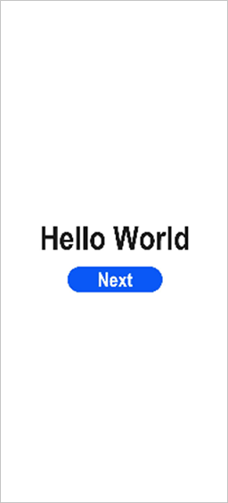
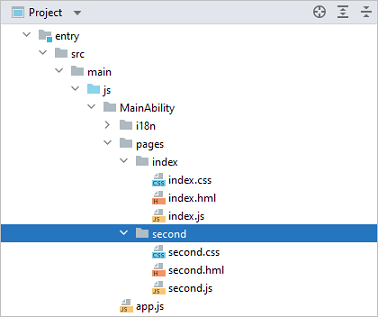
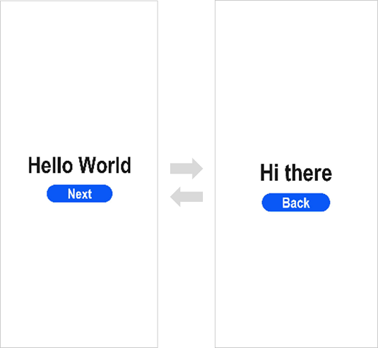

# Getting Started with JavaScript in FA Model


> **NOTE**
>
> For best possible results, use [DevEco Studio V3.0.0.993](https://developer.harmonyos.com/cn/develop/deveco-studio#download) for your development.


## Creating a JavaScript Project

1. If you are opening DevEco Studio for the first time, click **Create Project**. If a project is already open, choose **File** > **New** > **Create Project** from the menu bar. On the **OpenHarmony** tab of the **Choose Your Ability Template** page, select **Empty Ability** and click **Next**.

   

2. In the project configuration page, set **Compile SDK** to **8** or **9** (in the latter case, you also need to set **Model** to **FA**) and **Language** to **JS** and retain the default values for other parameters.

   

   > **NOTE**
   >
   > If you are using DevEco Studio V2.2 Beta1 or later, you can use the [low-code development](https://developer.harmonyos.com/en/docs/documentation/doc-guides/ohos-low-code-development-0000001218440652) mode apart from the traditional coding approach.
   >
   > On the low-code development pages, you can design your application UI in an efficient, intuitive manner, with a wide array of UI editing features.
   >
   > To use the low-code development mode, turn on **Enable Super Visual** on the page shown above.

3. Click **Finish**. DevEco Studio will automatically generate the sample code and resources that match your project type. Wait until the project is created.


## JavaScript Project Directory Structure

- **entry**: OpenHarmony project module, which can be built into an OpenHarmony Ability Package ([HAP](../../glossary.md#hap)).
  - **src > main > js**: a collection of JavaScript source code.
  - **src > main > js > MainAbility**: entry to your application/service.
  - **src > main > js > MainAbility > i18n**: resources in different languages, for example, UI strings and image paths.
  - **src > main > js > MainAbility > pages**: pages contained in **MainAbility**.
  - **src > main > js > MainAbility > app.js**: ability lifecycle file.

  - **src > main > resources**: a collection of resource files used by your application/service, such as graphics, multimedia, character strings, and layout files. For details about resource files, see [Resource Limitations and Access](../ui/js-framework-resource-restriction.md).
  - **src > main > config.json**: module configuration file. This file describes the global configuration information of the application/service, the device-specific configuration information, and the configuration information of the HAP file. For details about the configuration file, see [Application Package Structure Configuration File (FA Model)](package-structure.md).
  - **build-profile.json5**: current module information and build configuration options, including **buildOption** and **targets**.
  - **hvigorfile.js**: module-level compilation and build task script. You can customize related tasks and code implementation.

- **build-profile.json5**: application-level configuration information, including the signature and product configuration.

- **hvigorfile.js**: application-level compilation and build task script.


## Building the First Page

1. Use the **\<Text>** component.

   After the project synchronization is complete, choose **entry** > **src** > **main** > **js** > **MainAbility** > **pages** > **index** in the **Project** window and open the **index.hml** file. You can see that the file contains a **<Text>** component. The sample code in the **index.hml** file is shown below:
   
   ```html
   <!-- index.hml -->
   <div class="container">
       <text class="title">
           Hello World
       </text>
   </div>
   ```

2. Add a button and bind the **onclick** method to this button.

   On the default page, add a **\<Button>** component to respond to user clicks and implement redirection to another page. The sample code in the **index.hml** file is shown below:
   
   ```html
   <!-- index.hml -->
   <div class="container">
       <text class="title">
           Hello World
       </text>
   
   <!-- Add a button, set its value to Next, and bind the onclick method to the button. -->
       <input class="btn" type="button" value="Next" onclick="onclick"></input>
   </div>
   ```

3. Set the page style in the **index.css** file.

   From the **Project** window, choose **entry** > **src** > **main** > **js** > **MainAbility** > **pages** > **index**, open the **index.css** file, and set the page styles, such as the width, height, font size, and spacing. The sample code in the **index.css** file is shown below:
   
   ```css
   /* index.css */
   .container {
       display: flex;
       flex-direction: column;
       justify-content: center;
       align-items: center;
       left: 0px;
       top: 0px;
       width: 100%;
       height: 100%;
   }
   
   .title {
       font-size: 100px;
       font-weight: bold;
       text-align: center;
       width: 100%;
       margin: 10px;
   }
   
   .btn {
       font-size: 60px;
       font-weight: bold;
       text-align: center;
       width: 40%;
       height: 5%;
       margin-top: 20px;
   }
   ```

4. On the toolbar in the upper right corner of the editing window, click **Previewer**. Below is how the first page looks in the Previewer.

   


## Building the Second Page

1. Create the second page.

   In the **Project** window, choose **entry** > **src** > **main** > **js** > **MainAbility**, right-click the **pages** folder, choose **New** > **Page**, name the page **second**, and click **Finish**. Below is the structure of the **second** folder.

   

2. Add **\<Text>** and **\<Button>** components.

   Add **\<Text>** and **\<Button>** components and set their styles, as you do for the first page. The sample code in the **second.hml** file is shown below:
   
   ```html
   <!-- second.hml -->
   <div class="container">
       <text class="title">
           Hi there
       </text>
   
   <!-- Add a button, set the value to Back, and bind the back method to the button.-->
       <input class="btn" type="button" value="Back" onclick="back"></input>
   </div>
   ```

3. Set the page style. The sample code in the **second.css** file is shown below:
   
   ```css
   /* second.css */
   .container {
       display: flex;
       flex-direction: column;
       justify-content: center;
       align-items: center;
       left: 0px;
       top: 0px;
       width: 100%;
       height: 100%;
   }
   
   .title {
       font-size: 100px;
       font-weight: bold;
       text-align: center;
       width: 100%;
       margin: 10px;
   }
   
   .btn {
       font-size: 60px;
       font-weight: bold;
       text-align: center;
       width: 40%;
       height: 5%;
       margin-top: 20px;
   }
   ```


## Implementing Page Redirection

You can implement page redirection through the [page router](../reference/apis/js-apis-router.md#routerpush), which finds the target page based on the page URL. Import the **router** module and then perform the steps below:

1. Implement redirection from the first page to the second page.

   In the **index.js** file of the first page, bind the **onclick** method to the button so that clicking the button redirects the user to the second page. The sample code in the **index.js** file is shown below:
   
   ```js
   // index.js
   import router from '@ohos.router';
   
   export default {
       onclick: function () {
           router.push({
               url: "pages/second/second"
           })
       }
   }
   ```

2. Implement redirection from the second page to the first page.

   In the **second.ets** file of the second page, bind the **back** method to the **Back** button so that clicking the button redirects the user back to the first page. The sample code in the **second.js** file is shown below:
   
   ```js
   // second.js
   import router from '@ohos.router';
   
   export default {
       back: function () {
           router.back()
       }
   }
   ```

3. Open any file in the **index** folder and click  in the Previewer to refresh the file. The display effect is shown in the figure below.

   


## Running the Application on a Real Device

1. Connect the development board running the OpenHarmony standard system to the computer.

2. Choose **File** > **Project Structure...** > **Project** > **Signing Configs**, and select **Automatically generate signature**. Wait until the automatic signing is complete, and click **OK**. See the following figure.

   

3. On the toolbar in the upper right corner of the editing window, click . The display effect is shown in the figure below.

   

Congratulations! You have finished developing your OpenHarmony application in JavaScript in the FA model. To learn more about OpenHarmony application development, see [Application Development Overview](../application-dev-guide.md).
