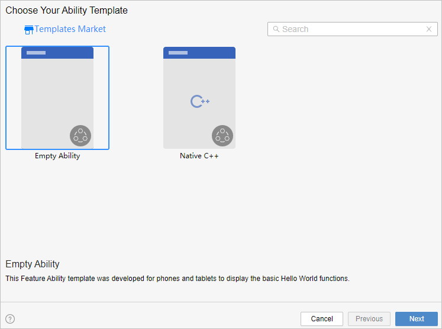
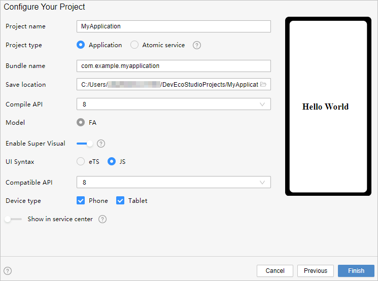
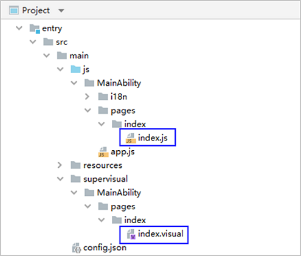
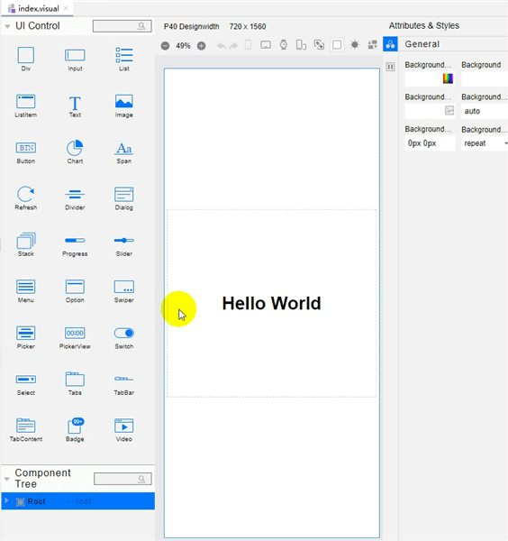
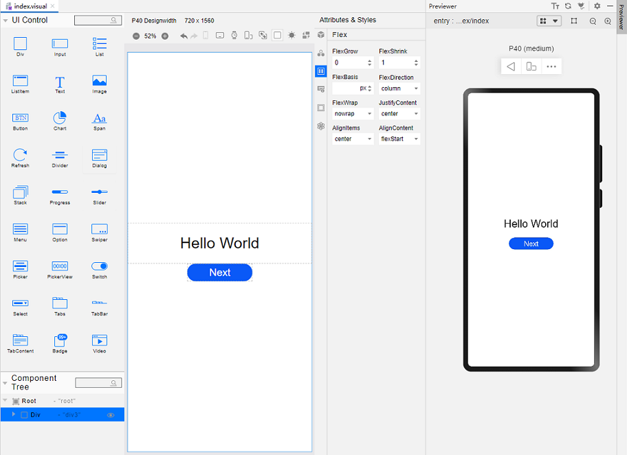
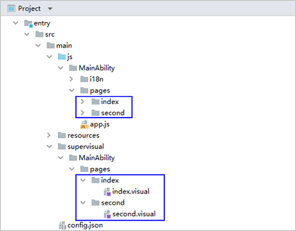
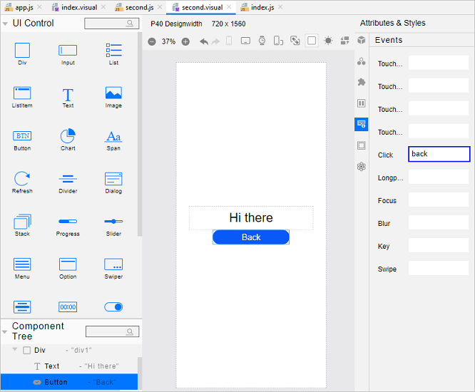
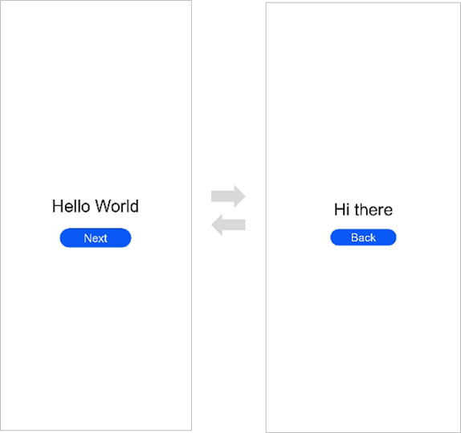

# Getting Started with JavaScript in the Low-Code Approach

>  **NOTE**<br/>This feature will be available in DevEco Studio V2.2 Beta1 and later versions.
>
> For best possible results, use [DevEco Studio V3.0.0.900 Beta3](https://developer.harmonyos.com/cn/develop/deveco-studio#download_beta_openharmony) for your development.


On the OpenHarmony low-code development pages, you can design your app UI in an efficient, intuitive manner, with a wide array of UI editing features.


You can develop applications or services in the low-code approach using either of the following methods:


- Create a project that supports low-code development. This method is used as an example in this topic.

- In an existing project, create a Visual file for development. For details, see [Creating a .visual File That Supports Low-Code Development](#building-the-second-page).


## Creating a Project That Supports Low-Code Development

>  **NOTE**<br/>This feature is available in DevEco Studio 3.0 Beta2 and later versions and works with compileSdkVersion 7 or later.
>

1. In DevEco Studio, if no project is open, click **Create Project**; if a project is already open, choose **File** &gt; **New** &gt; **Create Project**. Then, select **Empty Ability** and click **Next**.

   
2. Go to the project configuration page, select **Enable Super Visual**, set **UI Syntax** to **JS**, and retain the default values for other parameters.

    

3. Click **Finish**. DevEco Studio will automatically generate the sample code and resources that match your project type. Wait until the project is created.


## Low-code Project Files

After the project synchronization is complete, a low-code directory structure is automatically generated in the project, as shown below.



- **entry &gt; src &gt; main &gt; js &gt; MainAbility &gt; pages &gt; index &gt; index.js**: defines logical relationships, such as data and events, used on low-code pages. For details, see [JavaScript](../ui/js-framework-syntax-js.md). If multiple low-code development pages are created, a page folder and the corresponding **.js** file will be created for each of these pages.
  
  >  **NOTE**<br/>To avoid build errors when using the low-code development page, make sure the directory where the corresponding **.js** file is located does not contain **.hml** or **.css** files. For example, in the preceding example, no **.hml** or **.css** file is allowed in **js** &gt; **MainAbility** &gt; **pages** &gt; **index**.
  >
- **entry &gt; src &gt; main &gt; supervisual &gt; MainAbility &gt; pages &gt; index &gt; index.visual**: stores the data model of the low-code development page. You can double-click the file to open the low-code development page. If multiple low-code development pages are created, a page folder and the corresponding **.visual** file will be created for each of these pages.


## Building the First Page

After the project synchronization is complete, the default first page contains the **Div** and **Text** (**Hello World**) components. To better understand low-code development, we'll delete these template components from the canvas and set the page from scratch.

Add **Div**, **Text**, and **Button** components to the first page.

1. Delete the existing template components from the canvas.<a name= delete_origin_content></a>
   

   Open the index.visual file, right-click the existing template components on the canvas, and choose **Delete** from the shortcut menu to delete them. Below is an illustration of the operations.

   

2. Add a **Div** component and set its styles and attributes.<a name = add_container></a>

   Drag the **Div** component from the **UI Control** area to the canvas. In the **Attributes &amp; Styles** area on the right, click **General** and set **Height** to **100%** so that the component fills the entire screen. Click **Flex**, set **FlexDirection** to **column** so that the main axis of the component is vertical, and set both **JustifyContent** and **AlignItems** to **center** so that the child components of the **Div** component are centered along the main axis and cross axis. Below is an illustration of the operations.

   

3. Add a **Text** component.

   Drag the **Text** component from the **UI Control** area to the center area of the **Div** component. In the **Attributes &amp; Styles** area, click **Properties** and set **Content** of the **Text** component to **Hello World**. Click **Feature**, and set **FontSize** to **60px** and **TextAlign** to **center**. Then, select the **Text** component on the canvas and drag its corners to fully display the text. Below is an illustration of the operations.

   

4. Add a **Button** component.

   Drag the **Button** component from the **UI Control** area to a position under the **Text** component on the canvas. In the **Attributes &amp; Styles** area on the right, click **Properties** and set **Value** of the **Button** component to **Next**. Click **Feature** and set **FontSize** to **40px**. Then, select the **Button** component on the canvas and drag its corners to fully display the text. Below is an illustration of the operations.

   

5. On the toolbar in the upper right corner of the editing window, click **Previewer** to open the Previewer. 

   Below is how the first page looks on the Previewer.

   


## Building the Second Page

1. Create the second page.
   
   In the **Project** window, choose **entry** &gt; **src** &gt; **main** &gt; **js** &gt; **MainAbility**, right-click the **pages** folder, choose **New** &gt; **Visual**, name the page **second**, and click **Finish**. Below, you can see the structure of the **pages** folder.

   

2. [Delete the existing template components from the canvas.](#delete_origin_content)

3. [Add a Div component and set its styles and attributes.](#add_container)

4. Add a **Text** component.

   Drag the **Text** component from the **UI Control** area to the center area of the **Div** component. In the **Attributes &amp; Styles** area, click **Properties** and set **Content** of the **Text** component to **Hi there**. Click **Feature**, and set **FontSize** to **60px** and **TextAlign** to **center**. Then, select the **Text** component on the canvas and drag its corners to fully display the text. Below is an illustration of the operations.

   

5. Add a **Button** component.

   Drag the **Button** component from the **UI Control** area to a position under the **Text** component on the canvas. In the **Attributes &amp; Styles** area on the right, click **Properties** and set **Value** of the **Button** component to **Back**. Click **Feature** and set **FontSize** to **40px**. Then, select the **Button** component on the canvas and drag its corners to fully display the text. Below is an illustration of the operations.

   


## Implementing Page Redirection

You can implement page redirection through the [page router](../ui/ui-js-building-ui-routes.md), which finds the target page based on the page URL. Import the **router** module and then perform the steps below:

1. Implement redirection from the first page to the second page.
   
   In the files of the first page, bind the **onclick** method to the button so that clicking the button redirects the user to the second page. This operation needs to be completed in both .js and .visual files.
   
   - In the **index.js** file:
     
     ```js
     import router from '@ohos.router';  
     
     export default {     
         onclick() {         
             router.push({             
                 url:'pages/second/second', // Specify the page to be redirected to.
             })     
         } 
     }
     ```
   
   - In the index.visual file, select the **Button** component on the canvas. In the **Attributes &amp; Styles** area, click **Events** and set **Click** to **onclick**.
   
       
   
2. Implement redirection from the second page to the first page.

   In the files of the second page, bind the **back** method to the **Back** button so that clicking the button redirects the user back to the first page.

   This operation needs to be completed in both .js and .visual files.

   - In the **second.js** file:
     
      ```js
      import router from '@ohos.router';  
      
      export default {     
          back() {         
              router.back()     
          } 
      }
      ```
   - In the **second.visual** file, select the **Button** component on the canvas. In the **Attributes &amp; Styles** area, click **Events** and set **Click** to **back**.

     

3. Open the **index.visual** or **index.js** file and click  in the Previewer to refresh the file. The figure below shows the effect.

   


## Running the Application on a Real Device

1. Connect the development board running the OpenHarmony standard system to the computer.

2. Choose **File** &gt; **Project Structure** &gt; **Project** &gt; **Signing Configs**, select **Automatically generate signing**, wait until the automatic signing is complete, and click **OK**, as shown below.

   

3. On the toolbar in the upper right corner of the editing window, click . The display effect is shown in the figure below.

   

Congratulations! You have finished developing your OpenHarmony app in JavaScript in the low-code approach. To learn more about OpenHarmony, see [OpenHarmony Overview](../application-dev-guide.md)
