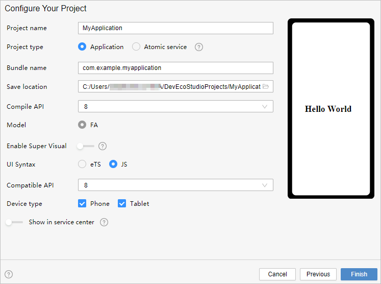
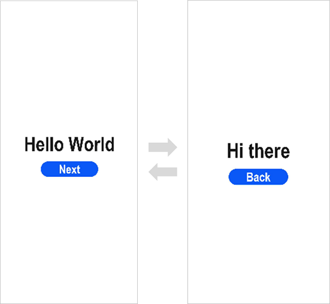

# Getting Started with JavaScript in the Traditional Coding Approach

> **NOTE**<br/>For best possible results, use [DevEco Studio V3.0.0.900 Beta3](https://developer.harmonyos.com/cn/develop/deveco-studio#download_beta_openharmony) for your development.


## Creating a JavaScript Project

1. In DevEco Studio, if no project is open, click **Create Project**; if a project is already open, choose **File** &gt; **New** &gt; **Create Project**. Then, select **Empty Ability** and click **Next**.

   

2. On the project configuration page, set **UI Syntax** to **JS** and retain the default values for other parameters.

   

3. Click **Finish**. DevEco Studio will automatically generate the sample code and resources that match your project type. Wait until the project is created.


## JavaScript Project Files

- **entry**: OpenHarmony project module, which can be built into an ability package ([HAP](../../glossary.md#hap)).
  - **src &gt; main &gt; js**: a collection of JS source code.
  - **src &gt; main &gt; js &gt; MainAbility**: entry to your application/service.
  - **src &gt; main &gt; js &gt; MainAbility &gt; i18n**: resources in different languages, for example, UI strings and image paths.
  - **src &gt; main &gt; js &gt; MainAbility &gt; pages**: pages contained in **MainAbility**.
  - **src &gt; main &gt; js &gt; MainAbility &gt; app.js**: ability lifecycle file.
  - **src &gt; main &gt; resources**: a collection of resource files used by your application/service, such as graphics, multimedia, character strings, and layout files.
  - **src &gt; main &gt; config.json**: module configuration file. This file describes the global configuration information of the application/service, the device-specific configuration information, and the configuration information of the HAP file.
  - **build-profile.json5**: current module information and build configuration options, including **buildOption** and **targets**.
  - **hvigorfile.js**: module-level compilation and build task script. You can customize related tasks and code implementation.
- **build-profile.json5**: application-level configuration information, including the signature and product configuration.
- **hvigorfile.js**: application-level compilation and build task script.


## Building the First Page

1. Use the **Text** component.
   
   After the project synchronization is complete, choose **entry** &gt; **src** &gt; **main** &gt; **js** &gt; **MainAbility** &gt; **pages** &gt; **index** in the **Project** window and open the **index.hml** file. You can see that the file contains a **&lt;Text&gt;** component. The sample code in the **index.hml** file is shown below:


   ```html
   <!--index.hml-->
   <div class="container">
       <text class="title">
           Hello World
       </text>
   </div>
   ```

2. Add a button and bind the **onclick** method to this button.

   On the default page, add an **&lt;input&gt;** component of the button type to respond to user clicks and implement redirection to another page. The sample code in the **index.hml** file is shown below:


   ```html
   <!--index.hml-->
   <div class="container">
       <text class="title">
           Hello World
       </text>
   
   <!-- Add a button, set its value to Next, and bind the onclick method to the button. -->
       <input class="btn" type="button" value="Next" onclick="onclick"></input>
   </div>
   ```

3. Set the page style in the **index.css** file.

   From the **Project** window, choose **entry** &gt; **src** &gt; **main** &gt; **js** &gt; **MainAbility** &gt; **pages** &gt; **index**, open the **index.css** file, and set the page styles, such as the width, height, font size, and spacing. The sample code in the **index.css** file is shown below:


   ```css
   .container {
       display: flex;
       flex-direction: column;
       justify-content: center;
       align-items: center;
       left: 0px;
       top: 0px;
       width: 100%;
       height: 100%;
   }
   
   .title {
       font-size: 100px;
       font-weight: bold;
       text-align: center;
       width: 100%;
       margin: 10px;
   }
   
   .btn {
       font-size: 60px;
       font-weight: bold;
       text-align: center;
       width: 40%;
       height: 5%;
       margin-top: 20px;
   }
   ```

4. On the toolbar in the upper right corner of the editing window, click **Previewer** to open the Previewer. 

   Below is how the first page looks on the Previewer.

   


## Building the Second Page

1. Create the second page.
   
   In the **Project** window, choose **entry** &gt; **src** &gt; **main** &gt; **js** &gt; **MainAbility**, right-click the **pages** folder, choose **New** &gt; **Page**, name the page **second**, and click **Finish**. Below, you can see the structure of the **second** folder.


2. Add **&lt;Text&gt;** and **&lt;Button&gt;** components.

   Add **&lt;Text&gt;** and **&lt;Button&gt;** components and set their styles, as you do for the first page. The sample code in the **second.hml** file is shown below:


   ```html
   <!--second.hml-->
   <div class="container">
       <text class="title">
           Hi there
       </text>
   
   <!-- Add a button, set the value to Back, and bind the back method to the button.-->
       <input class="btn" type="button" value="Back" onclick="back"></input>
   </div>
   ```

3. Set the page style in the **second.css** file. The sample code in the **second.css** file is shown below:

   ```css
   .container {
       display: flex;
       flex-direction: column;
       justify-content: center;
       align-items: center;
       left: 0px;
       top: 0px;
       width: 100%;
       height: 100%;
   }
   
   .title {
       font-size: 100px;
       font-weight: bold;
       text-align: center;
       width: 100%;
       margin: 10px;
   }
   
   .btn {
       font-size: 60px;
       font-weight: bold;
       text-align: center;
       width: 40%;
       height: 5%;
       margin-top: 20px;
   }
   ```


## Implementing Page Redirection

You can implement page redirection through the [page router](../ui/ui-js-building-ui-routes.md), which finds the target page based on the page URL. Import the **router** module and then perform the steps below:

1. Implement redirection from the first page to the second page.
   
   In the **index.js** file of the first page, bind the **onclick** method to the button so that clicking the button redirects the user to the second page. The sample code in the **index.js** file is shown below:


   ```js
   // index.js
   import router from '@ohos.router';
   
   export default {
       onclick: function () {
           router.push({
               url: "pages/second/second"
           })
       }
   }
   ```

2. Implement redirection from the second page to the first page.

   In the **second.ets** file of the second page, bind the **back** method to the **Back** button so that clicking the button redirects the user back to the first page. The sample code in the **second.js** file is shown below:


   ```js
   // second.js
   import router from '@ohos.router';
   
   export default {
       back: function () {
           router.back()
       }
   }
   ```

3. Open any file in the **index** folder and click  in the Previewer to refresh the file. The figure below shows the effect.

   


## Running the Application on a Real Device

1. Connect the development board running the OpenHarmony standard system to the computer.

2. Choose **File** &gt; **Project Structure** &gt; **Project** &gt; **Signing Configs**, select **Automatically generate signing**, wait until the automatic signing is complete, and click **OK**, as shown below.

   

3. On the toolbar in the upper right corner of the editing window, click . The display effect is shown in the figure below.

   

Congratulations! You have finished developing your OpenHarmony application in JavaScript in the traditional coding approach. To learn more about OpenHarmony, see [OpenHarmony Overview](../application-dev-guide.md).
