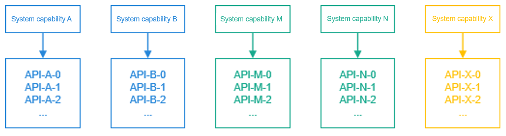
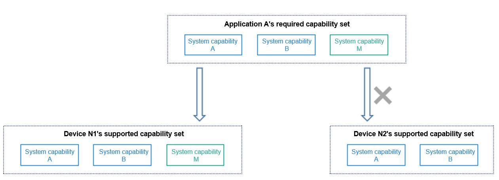
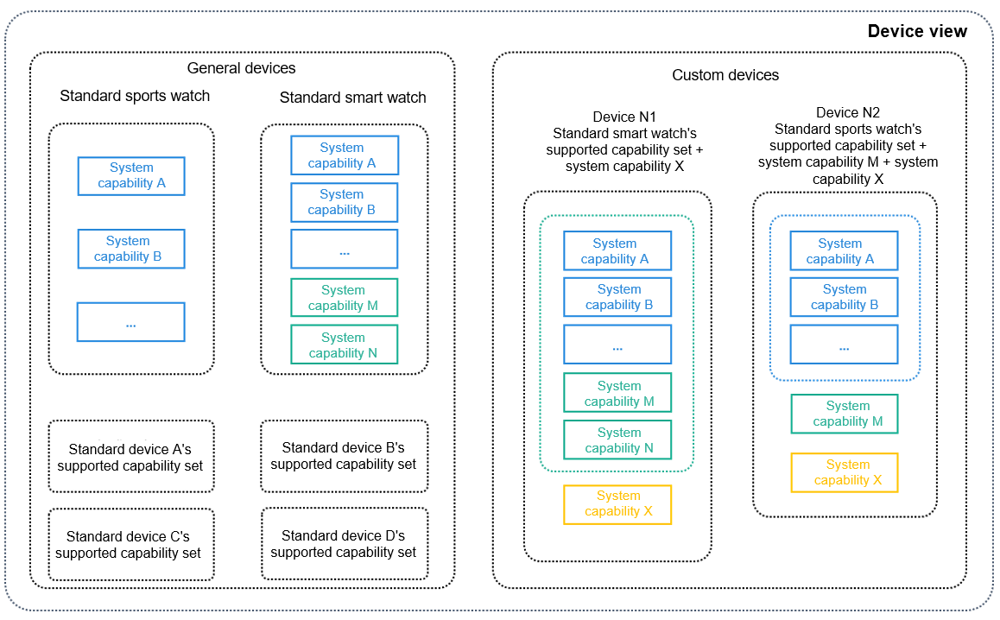
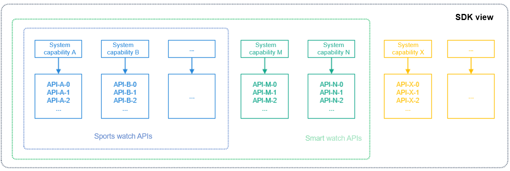
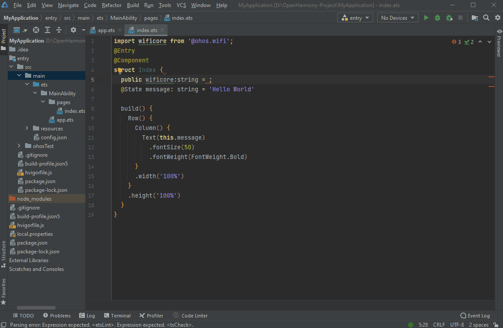
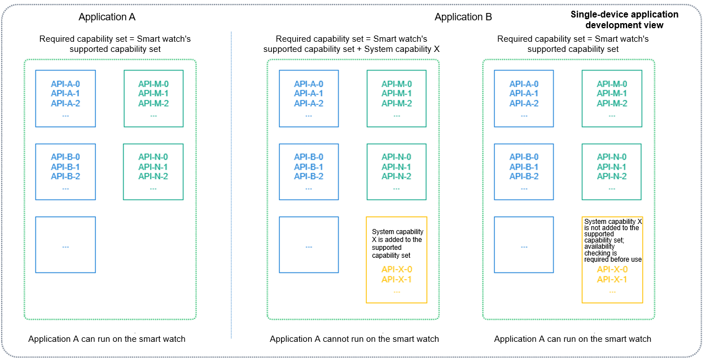
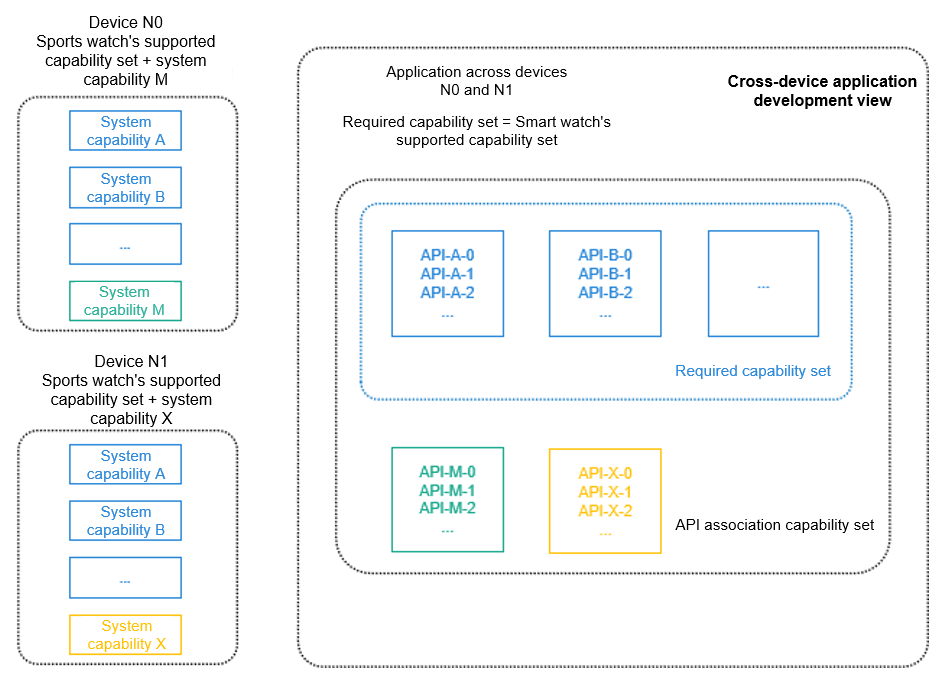
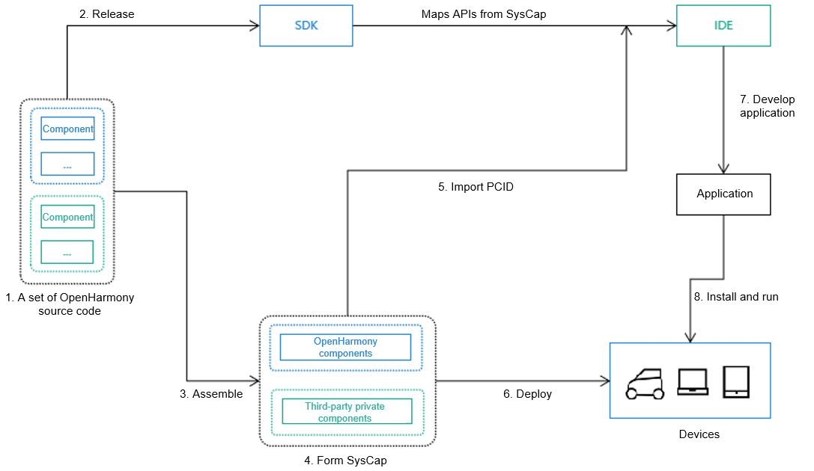

# SysCap Usage Guidelines

## Overview

### System Capabilities and APIs

SysCap is short for System Capability. It refers to each independent feature in the operating system, such as Bluetooth, Wi-Fi, NFC, and camera. Each system capability corresponds to multiple APIs. These APIs are bound together and their availability depends on the support on the target device. They can also be provided together with the IDE for association.




### Supported Capability Set, Association Capability Set, and Required Capability Set

The supported capability set, association capability set, and required capability set are collections of system capabilities.
The supported capability set covers the device capabilities, and the required capability set covers the application capabilities. If the capability set required by application A is a subset of the capability set supported by device N, application A can be distributed to device N for installation and running. Otherwise, application A cannot be distributed.
The association capability set covers the system capabilities of APIs that can be associated by the IDE during application development.




### Devices and Supported Capability Sets

Each device provides a capability set according to its hardware capability.
The SDK classifies devices into general devices and custom devices. The general devices' supported capability set is defined by OpenHarmony, and the custom devices' is defined by device vendors.




### Mapping Between Devices and SDK Capabilities

The SDK provides full APIs for the IDE. The IDE identifies the supported capability set based on the devices supported by the project, filters the APIs contained in the capability set, and provides the supported APIs for association (to autocomplete input).




## How to Develop

### Importing the PCID

DevEco Studio allows PCID imports for projects. After the imported PCID file is decoded, the output SysCap is written into the **syscap.json** file.

Right-click the project directory and choose **Import Product Compatibility ID** from the shortcut menu to upload the PCID file and import it to the **syscap.json** file.




### Configuring the Association Capability Set and Required Capability Set

The IDE automatically configures the association capability set and required capability set based on the settings supported by the created project. You can modify the capability sets when necessary.
For the association capability set, you can use more APIs in the IDE by adding more system capabilities. Note that these APIs may not be supported on the device. Therefore, you need to check whether these APIs are supported before using them.
Exercise caution when modifying the required capability set. Incorrect modifications may cause the application to unable to be distributed to the target device.

```
/* syscap.json */
{
	devices: {
		general: [            /* Each general device corresponds to a SysCap capability set. Multiple general devices can be configured.*/
			"car,
			...
		],
		custom: [             /* Vendor-defined device*/
			{
				"Custom device": [
					"SystemCapability.Communication.SoftBus.Core",
					...
				]
			},
			...
		]
	},
	development: {             /* The SysCap set in addedSysCaps and the SysCap set supported by each device configured in devices form the association capability set.*/
		addedSysCaps: [
			"SystemCapability.Location.Location.Lite",
			...
		]
	},
	production: {              /* Used to generate the RPCID. Exercise caution when adding this parameter. Under incorrect settings, applications may fail to be distributed to target devices.*/
		addedSysCaps: [],      // Intersection of SysCap sets supported by devices configured in devices. It is the required capability set with addedSysCaps set and removedSysCaps set.
		removedSysCaps: []     // When the required capability set is a capability subset of a device, the application can be distributed to the device.
	}
}
```


### Single-Device Application Development

By default, the association capability set and required system capability set of the application are the same as the supported system capability set of the device. Exercise caution when modifying the required capability set.




### Cross-Device Application Development

By default, the association capability set of the application is the union of multiple devices' supported capability sets. The capability sets must be the intersection.




### Checking Whether an API Is Available

To check whether a project supports a specific SysCap, you can use **canIUse**.

```
if (canIUse("SystemCapability.ArkUI.ArkUI.Full")) {
	console.log("The application supports SystemCapability.ArkUI.ArkUI.Full.");
} else {
	Console.log("The application does not support SystemCapability.ArkUI.ArkUI.Full".);
}
```

You can import a module. If the current device does not support the module, the import result is **undefined**. When using an API, you need to check whether the API is available.

```
import geolocation from '@ohos.geolocation';

if (geolocation) {
	geolocation.getCurrentLocation((location) => {
		console.log(location.latitude, location.longitude);
	});
} else {
	Console.log('The device does not support location information.');
}
```


### Checking the Differences Between Devices with the Same Capability

The performance of a system capability may vary by device type. For example, a tablet is superior to a smart wearable device in terms of the camera capability.

```
import userAuth from '@ohos.userIAM.userAuth';

const authenticator = userAuth.getAuthenticator();
const result = authenticator.checkAbility('FACE_ONLY', 'S1');

if (result == authenticator.CheckAvailabilityResult.AUTH_NOT_SUPPORT) {
	Console.log('The device does not support facial recognition.');
}
// If an unsupported API is forcibly called, an error message is returned, but no syntax error occurs.
authenticator.execute('FACE_ONLY', 'S1', (err, result) => {
	if (err) {
		console.log(err.message);
		return;
	}
})
```


### How Are the SysCap Differences Between Devices Generated

The SysCap of devices varies according to the component combination assembled by the product solution vendor. The following figure shows the overall process.



1. A set of OpenHarmony source code consists of optional and mandatory components. Different components have different system capabilities. In other words, different components represent different SysCaps.

2. In a normalized released SDK, the mapping exists between APIs and SysCap.

3. Product solution vendors can assemble components based on hardware capabilities and product requirements.

4. The components configured for a product can be OpenHarmony components or private components developed by a third party. Because there is mapping between components and SysCap, the SysCap set of the product can be obtained after all components are assembled.

5. The SysCap set is encoded to generate the PCID. You can import the PCID to the IDE and decode it into SysCap. During development, compatibility processing is performed on the SysCap differences of devices.

6. System parameters deployed on devices contain the SysCap set. The system provides native interfaces and application interfaces for components and applications in the system to check whether a SysCap set is available.

7. During application development, the SysCap required by the application is encoded into the Required Product Compatibility ID (RPCID) and written into the application installation package. During application installation, the package manager decodes the RPCID to obtain the SysCap required by the application and compares it with the SysCap of the device. If the SysCap required by the application is met, the application is successfully installed.

8. When an application is running, the **canIUse** API can be used to query the SysCap of a device to ensure compatibility on different devices.
