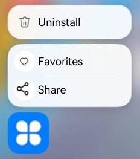

# Creating a Static Shortcut of the Application
<!--Kit: Ability Kit-->
<!--Subsystem: BundleManager-->
<!--Owner: @wanghang904-->
<!--Designer: @hanfeng6-->
<!--Tester: @kongjing2-->
<!--Adviser: @Brilliantry_Rui-->

With applications getting more feature-packed, it becomes tougher for users to find and use specific features. To make things smoother, you can create home screen shortcuts for popular features in your application, allowing for quick application launch and direct access to these features. Typical feature shortcuts include "Quick Photo" in camera applications, "Create Note" in note applications, and frequently used location navigation in map applications. All of these shortcuts enable users to quickly access specific feature pages, greatly improving operation efficiency and making users more reliant on the application. You can also create shortcuts to meet personalized workflow and preference needs.

## When to Use

This topic uses navigation as an example. When using a map application for navigation, users tend to search for a destination and then start navigation. To make this process more efficient and user-friendly, you can add navigation shortcuts for regular destinations like company or home for the map application. With these shortcuts, users can quickly start navigation by long pressing the application. For details, see [Home Screen Shortcuts](https://developer.huawei.com/consumer/en/doc/best-practices/bpta-desktop-shortcuts).

## How to Configure

The following describes how to configure a static shortcut in a project.

1. Add the following content to the **entry/src/main/resources/base/element/string.json** file:
    ```json
    {
      "string": [
        // ···
        {
          "name": "share",
          "value": "Share"
        },
        {
          "name": "add",
          "value": "Favorites"
        }
      ]
    }
    ```


2. Configure the shortcut file.

    In the **/resources/base/profile/** directory of the module, configure the following fields in the [shortcut](module-configuration-file.md#shortcuts) file, for example, **shortcuts_config.json**. Remove comments from the sample code.

    ```json
    {
      "shortcuts": [
       {
          "shortcutId": "id_test1",  // Shortcut ID. If an application has multiple shortcuts, this field can be used as the unique identifier of a shortcut. This field cannot be configured using the resource index (**$string**).
          "label": "$string:add",  // Shortcut name.
          "icon": "$media:add_icon", // Shortcut icon. You need to add an image named add_icon to entry/src/main/resources/base/media.
          "wants": [
            {
              "bundleName": "com.ohos.hello",   // Bundle name of the component to start.
              "moduleName": "entry",    // Module name of the component to start.
              "abilityName": "EntryAbility1",   // Ability name of the component to start.
              "parameters": {
                "testKey": "testValue"   // Custom data of the started shortcut.
              }
            }
          ]
        },
        {
          "shortcutId": "id_test2",  // Shortcut ID. If an application has multiple shortcuts, this field can be used as the unique identifier of a shortcut. This field cannot be configured using the resource index (**$string**).
          "label": "$string:share",  // Shortcut name.
          "icon": "$media:share_icon", // Shortcut icon. You need to add an image named share_icon to entry/src/main/resources/base/media.
          "wants": [
            {
              "bundleName": "com.ohos.hello",   // Bundle name of the component to start.
              "moduleName": "entry",    // Module name of the component to start.
              "abilityName": "EntryAbility",   // Component name of the component to start.
              "parameters": {
                "testKey": "testValue"   // Custom data of the started shortcut.
              }
            }
          ]
        }
      ]
    }
    ```

3. Configure **metadata** in the **module.json5** file of the application, which points to the shortcut file.

    ```json
    {
      "module": {
      // ...
        "abilities": [
          {
            "name": "EntryAbility",
            "srcEntry": "./ets/entryability/EntryAbility.ets",
            // ...
            "metadata": [
              {
                "name": "ohos.ability.shortcuts",  // Configure a shortcut. The value is fixed at ohos.ability.shortcuts.
                "resource": "$profile:shortcuts_config"  // Specify the resources of the shortcuts.
              }
            ]
          }
        ]
      }
    }
    ```

After installing the application, long press the icon on the home screen. The shortcuts (**Favorites** and **Share**) configured by you are displayed above the application icon. Tap a label to start the corresponding component. The following figure shows a static shortcut of an application displayed on the home screen.


