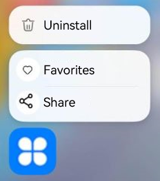

# Creating a Static Shortcut of the Application

<!--Kit: Ability Kit-->
<!--Subsystem: BundleManager-->
<!--Owner: @wanghang904-->
<!--Designer: @hanfeng6-->
<!--Tester: @memghaiyang-->
<!--Adviser: @HelloCrease-->
<!-- md-trans-meta sourceCommit=e614db0ed9ef9e65ff9f340640f4a0fd5317e78d translatedAt=2026-08-13T09:08:03.137Z pushedAt=2026-08-13T14:11:08.855Z -->

With applications getting more feature-packed, it becomes tougher for users to find and use specific features. To make things smoother, you can create home screen shortcuts for popular features in your application, allowing for quick application launch and direct access to these features. Typical feature shortcuts include "Quick Photo" in camera applications, "Create Note" in note applications, and frequently used location navigation in map applications. All of these shortcuts enable users to quickly access specific feature pages, greatly improving operation efficiency and making users more reliant on the application. You can also create shortcuts to meet personalized workflow and preference needs. For details about how to configure shortcuts, see [How to Configure](#how-to-configure). For details about shortcut management, see [shortcutManager Module](../reference/apis-ability-kit/js-apis-shortcutManager.md).

## When to Use

This topic uses navigation as an example. When using a map application for navigation, users tend to search for a destination and then start navigation. To make this process more efficient and user-friendly, you can add navigation shortcuts for regular destinations like company or home for the map application. With these shortcuts, users can quickly start navigation by long pressing the application. For details, see [Home Screen Shortcuts](https://developer.huawei.com/consumer/en/doc/best-practices/bpta-desktop-shortcuts).

<!--RP1--><!--RP1End-->

## How to Configure

The following describes how to configure a static shortcut in a project.

1. Add the following content to the **entry/src/main/resources/base/element/string.json** file:

    ```json
    {
      "string": [
        {
          "name": "share",
          "value": "Share"
        },
        {
          "name": "add",
          "value": "Favorites"
        }
      ]
    }
    ```

2. Configure the shortcut file.

    Add the [shortcut configuration file](module-configuration-file.md#shortcuts), for example, **shortcuts_config.json**, to the **/resources/base/profile/** directory of the module.

    ```json
    {
      "shortcuts": [
       {
          "shortcutId": "id_test1",
          "label": "$string:add",
          "icon": "$media:add_icon",
          "wants": [
            {
              "bundleName": "com.ohos.hello",
              "moduleName": "entry",
              "abilityName": "EntryAbility1",
              "parameters": {
                "testKey": "testValue"
              }
            }
          ]
        },
        {
          "shortcutId": "id_test2",
          "label": "$string:share",
          "icon": "$media:share_icon",
          "wants": [
            {
              "bundleName": "com.ohos.hello",
              "moduleName": "entry",
              "abilityName": "EntryAbility",
              "parameters": {
                "testKey": "testValue"
              }
            }
          ]
        }
      ]
    }
    ```

3. Configure **metadata** in the **module.json5** file of the application, which points to the shortcut file.

    <!-- @[typical_scenario_configuration](https://gitcode.com/openharmony/applications_app_samples/blob/master/code/DocsSample/bmsSample/TypicalScenarioConfiguration/entry/src/main/module.json5) -->

    ``` JSON5
    {
      "module": {
        // ...
        "abilities": [
          {
            "name": "EntryAbility",
            "srcEntry": "./ets/entryability/EntryAbility.ets",
            "metadata": [
              {
                "name": "ohos.ability.shortcuts",  // Configure a shortcut. The value is fixed at ohos.ability.shortcuts.
                "resource": "$profile:shortcuts_config"  // Specify the resources of the shortcuts.
              }
            ],
            // ...
          }
        ],
        // ...
      },
    }
    ```

After installing the application, long press the icon on the home screen. The shortcuts (**Favorites** and **Share**) configured by you are displayed above the application icon. Tap a label to start the corresponding component. The following figure shows a static shortcut of an application displayed on the home screen.



## Hiding Shortcuts

You can use the [setShortcutVisibleForSelf](../reference/apis-ability-kit/js-apis-shortcutManager.md#shortcutmanagersetshortcutvisibleforself) API to hide or display shortcuts.