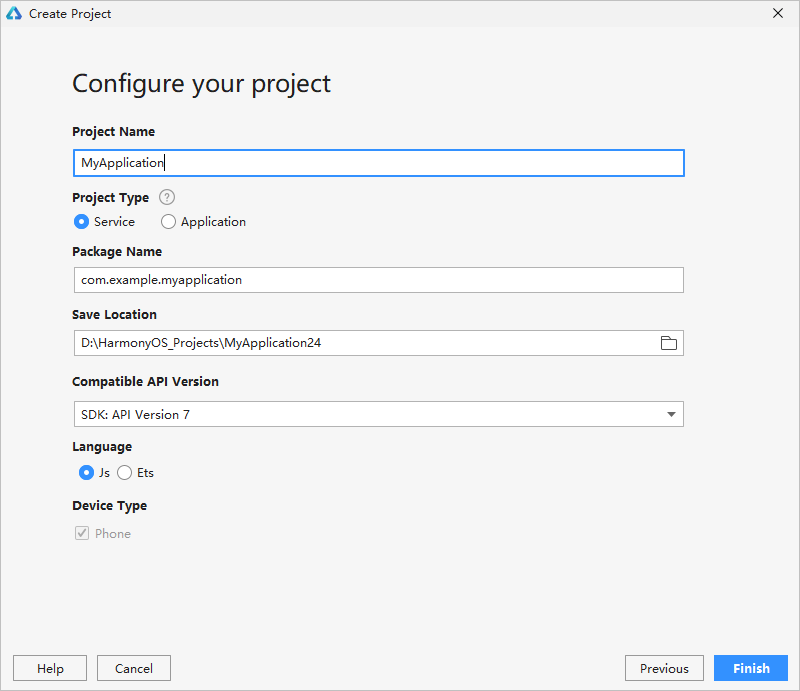

# Using the Project Wizard to Create a Project

If you are using DevEco Studio 2.2 Beta1 or later, you can use the project wizard to create a project. If you are using DevEco Studio 2.1 Release, create a project by following instructions in  [Importing a Sample to Create a Project](import-sample-to-create-project.md).

## Prerequisites

The OpenHarmony SDK has been installed. For details, see  [Configuring the OpenHarmony SDK](configuring-openharmony-sdk.md).

## Procedure

1.  Open the project wizard using either of the following methods:
    -   If no project is open, select  **Create Project**  on the welcome page.
    -   If a project is already open, choose  **File**  \>  **New**  \>  **New Project**  on the menu bar.

2.  Select the  **\[Standard\]Empty Ability**  template and click  **Next**.

    

3.  Click  **Next**  and configure the project.
    -   **Project Name**: customized project name.
    -   **Project Type**: project type , which can be an  [atomic service](https://developer.harmonyos.com/en/docs/documentation/doc-guides/atomic-service-definition-0000001090840664)  or an ordinary app that requires download before use.

        > **NOTE:** 
        >If you're creating an atomic service:
        >-   There is no app icon on the home screen while running or debugging an atomic service. Use the debugging and running functions of DevEco Studio as an alternative.
        >-   Atomic services are installation free. This is done by automatically adding the  **installationFree**  field to the  **config.json**  file, with its value set to  **true**.
        >-   If the value of the  **installationFree**  field of the entry module is set to  **true**, the value of the  **installationFree**  field of all the related HAP modules is  **true**  by default. If the** installationFree field**  of the entry module is set to  **false**, the  **installationFree**  field of all the related HAP modules can be set to  **true**  or  **false**.
        >-   When compiling and building an app, make sure that the size of each HAP package does not exceed 10 MB.

    -   **Package Name**: software package name. By default, this name will also be used as your app ID. Assign a unique package name because your app must have a unique ID to be released.
    -   **Save Location**: local path for storing the project file.
    -   **Compatible API Version**: earliest SDK version compatible with your app.

        > **NOTE:** 
        >If  **compileSdkVersion 7**  or later is configured for the OpenHarmony project, the corresponding module will be compiled using the Ark Compiler by default. To change the compilation mode to non-Ark compilation, add the  **arkEnable false**  field to the  **ohos**  closure in the module-level  **build.gradle**  file.

    -   **Language**: supported programming language.
    -   **Device Type**: device type supported by the project template.

        

4.  Click  **Finish**. DevEco Studio will automatically generate the sample code and resources that match your project type. Wait until the project is created.

