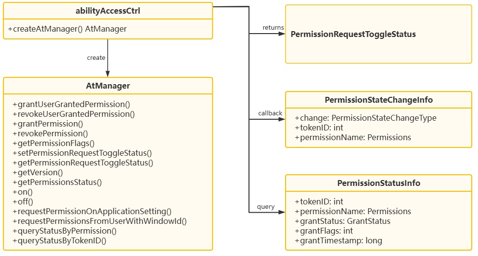

# @ohos.abilityAccessCtrl (Application Access Control) (System API)

<!--Kit: Ability Kit-->
<!--Subsystem: Security-->
<!--Owner: @xia-bubai-->
<!--Designer: @linshuqing; @hehehe-li-->
<!--Tester: @leiyuqian-->
<!--Adviser: @zengyawen-->
<!-- md-trans-meta sourceCommit=7fb5bd7ccfe62b909963659269cc03a975018baf translatedAt=2026-06-17T03:29:25.526Z pushedAt=2026-06-18T08:09:58.016Z -->

## Module Overview

The program access control provides the permission management capabilities of programs, including authentication, authorization, and revocation. Permissions are classified into three types: system_grant (automatically granted by the system), user_grant (requiring manual user authorization), and manual_settings (requiring manual settings authorization). Apps need to declare the required permissions in the configuration file. For details about the permission management mechanism, see [Application Permission Management Overview](../../security/AccessToken/app-permission-mgmt-overview.md).

This module is mainly used in the following scenarios:

- Granting/revoking permissions for a specified app and querying permission authorization status in batches.

- Subscribing to the status changes of specified permissions for a specified app.

- Initiating a user permission request dialog based on a window.

> **NOTE**
>
> - The initial APIs of this module are supported since API version 8. Newly added APIs will be marked with a superscript to indicate their earliest API version.
> - This topic describes only the system APIs provided by the module. For details about its public APIs, see [@ohos.abilityAccessCtrl (Application Access Control)](js-apis-abilityAccessCtrl.md).

## Key Class/Interface Introduction

### Core Enum Types

- **[GrantStatus](js-apis-abilityAccessCtrl.md#grantstatus):** Permission authorization status enum, used to indicate whether a permission has been granted.

- **[PermissionStatus](js-apis-abilityAccessCtrl.md#permissionstatus20):** Permission status enum, used to indicate the current permission status.

- **[PermissionStateChangeType](js-apis-abilityAccessCtrl.md#permissionstatechangetype18):** Permission state change type enum, used to indicate changes such as authorization and revocation.

- **[PermissionRequestToggleStatus](#permissionrequesttogglestatus12):** Permission request toggle status enum, used to indicate the dialog toggle status of a specified permission.

### Core Interface Types

- **[PermissionStatusInfo](#permissionstatusinfo):** Permission status information object, used to return the authorization status, flags, and timestamp of an app permission.

- **[PermissionStateChangeInfo](js-apis-abilityAccessCtrl.md#permissionstatechangeinfo18):** Permission state change event object, used to return the change type, app identity, and permission name.

### Core Class

- **[AtManager](#atmanager):** Program access control management class, providing capabilities such as cross-app permission granting, revocation, querying, listening.



### API Combination Usage Description

Scenario 1: Managing target app permissions.

Scenario description: When a system app needs to actively grant or revoke permissions for a target app, it can first create an [AtManager](#atmanager) instance, obtain the tokenID of the target app, call the grant or revoke API, and then query the permission flags and permission status as needed.

The typical usage process is as follows:

```ts
import { abilityAccessCtrl, Permissions } from '@kit.AbilityKit';

let atManager: abilityAccessCtrl.AtManager = abilityAccessCtrl.createAtManager();
let tokenID: number = 0; // For details about how to obtain the token ID, see the description in the AtManager section.
let permissionName: Permissions = 'ohos.permission.READ_AUDIO';
let permissionFlags: number = 2;

// 1. Grant or revoke permissions for the target app.
await atManager.grantPermission(tokenID, permissionName, permissionFlags);
await atManager.revokePermission(tokenID, permissionName, permissionFlags);

// 2. Query the authorization flag and status details.
await atManager.getPermissionFlags(tokenID, permissionName);
await atManager.getPermissionsStatus(tokenID, [permissionName]);

// 3. Perform batch queries by app or by permission.
await atManager.queryStatusByTokenID([tokenID]);
await atManager.queryStatusByPermission([permissionName]);
```

Scenario 2: Listening for permission status changes of a target app.

Scenario description: When a system app needs to perceive the permission status changes of a specified app, it can use [on](#on9) to register a listener. When it no longer needs to pay attention to the change, it uses [off](#off9) to unregister the listener. The tokenID list, permission list, and callback function used during registration and unregistration must correspond.

The typical usage process is as follows:

```ts
import { abilityAccessCtrl, Permissions, bundleManager } from '@kit.AbilityKit';

let atManager: abilityAccessCtrl.AtManager = abilityAccessCtrl.createAtManager();
let bundleInfo: bundleManager.BundleInfo =
  bundleManager.getBundleInfoForSelfSync(bundleManager.BundleFlag.GET_BUNDLE_INFO_WITH_APPLICATION);
let tokenIDList: Array<number> = [bundleInfo.appInfo.accessTokenId];
let permissionList: Array<Permissions> = ['ohos.permission.DISTRIBUTED_DATASYNC'];
let callback: (data: abilityAccessCtrl.PermissionStateChangeInfo) => void =
  (data: abilityAccessCtrl.PermissionStateChangeInfo): void => {
    console.info('receive permission state change');
    console.info(`data change: ${data.change}, tokenID: ${data.tokenID}, permission name: ${data.permissionName}`);
  };

// 1. Subscribe to the status changes of specified apps and permissions.
atManager.on('permissionStateChange', tokenIDList, permissionList, callback);

// 2. Unsubscribe when it is no longer needed.
atManager.off('permissionStateChange', tokenIDList, permissionList, callback);
```

## Modules to Import

```ts
import { abilityAccessCtrl } from '@kit.AbilityKit';
```

## AtManager

Manages instances of the access control module. As the core management class of this module, it provides capabilities such as cross-app permission granting, revocation, querying, status listening.

Invoking the AtManager API depends on the tokenID. The system application can obtain the tokenID by calling the [bundleManager.getBundleInfoSync](js-apis-bundleManager.md#bundlemanagergetbundleinfosync14) or [bundleManager.getBundleInfoForSelfSync](js-apis-bundleManager.md#bundlemanagergetbundleinfoforselfsync10).

### grantUserGrantedPermission

grantUserGrantedPermission(tokenID: number, permissionName: Permissions, permissionFlags: number): Promise&lt;void&gt;

Grants a user_grant permission to an app. After the call is successful, the app obtains the user_grant permission and can access the corresponding protected resources. This API uses a promise to return the result.

This API only supports granting permissions of the user_grant type. If you need to grant permissions of the user_grant or manual_settings type, you are advised to use [grantPermission](#grantpermission21).

**System API**: This is a system API.

**Required permissions**: ohos.permission.GRANT_SENSITIVE_PERMISSIONS

**System capability**: SystemCapability.Security.AccessToken

**Parameters**

| Name   | Type               | Mandatory| Description                                                        |
| --------- | ------------------- | ---- | ------------------------------------------------------------ |
| tokenID      | number              | Yes   | Identity of the target app. It can be obtained from the accessTokenId field in [ApplicationInfo](js-apis-bundleManager-applicationInfo.md) of the app's [BundleInfo](js-apis-bundleManager-bundleInfo.md). This parameter must be an integer greater than 0. If 0 is passed in, error code 12100001 is returned. |
| permissionName | [Permissions](../../security/AccessToken/app-permissions.md)              | Yes   | Name of the permission to grant. The permission name cannot exceed 256 characters. If the limit is exceeded, error code 12100001 is returned. |
| permissionFlags  | number | Yes   | Authorization options.<br>- 1: If the user denies the permission this time, the permission dialog box can still be displayed next time to request user authorization.<br>- 2: If the user denies the permission this time, the permission dialog box will not be displayed again. The user needs to grant the permission in the permission management page of system settings.<br>- 64: If the user selects to allow only this time, the permission is granted only for this session. The authorization is revoked when the app switches to the background or exits. |

**Return value**

| Type         | Description                               |
| :------------ | :---------------------------------- |
| Promise&lt;void&gt; | Promise that returns no value. |

**Error codes**

For details about the error codes, see [Universal Error Codes](../errorcode-universal.md) and [Access Control Error Codes](errorcode-access-token.md).

| ID| Error Message|
| -------- | -------- |
| 201 | Permission denied. Interface caller does not have permission "ohos.permission.GRANT_SENSITIVE_PERMISSIONS". |
| 202 | Not System App. Interface caller is not a system app. |
| 401 | Parameter error. Possible causes: 1.Mandatory parameters are left unspecified; 2.Incorrect parameter types. |
| 12100001 | Invalid parameter. The tokenID is 0, the permissionName exceeds 256 characters or is not declared in the module.json file, or the flags value is invalid. |
| 12100002 | The specified tokenID does not exist. |
| 12100003 | The specified permission does not exist or is not a user_grant permission. |
| 12100006 | The application specified by the tokenID is not allowed to be granted with the specified permission. Either the application is a sandbox or the tokenID is from a remote device. |
| 12100007 | The service is abnormal. |

**Example**

```ts
import { abilityAccessCtrl } from '@kit.AbilityKit';
import { BusinessError } from '@kit.BasicServicesKit';

let atManager: abilityAccessCtrl.AtManager = abilityAccessCtrl.createAtManager();
let tokenID: number = 0; // For details about how to obtain the tokenID, see the description in the AtManager section.
let permissionFlags: number = 1;
atManager.grantUserGrantedPermission(tokenID, 'ohos.permission.READ_AUDIO', permissionFlags).then(() => {
  console.info('grantUserGrantedPermission success');
}).catch((err: BusinessError): void => {
  console.error(`grantUserGrantedPermission fail, code: ${err.code}, message: ${err.message}`);
});
```

### grantUserGrantedPermission

grantUserGrantedPermission(tokenID: number, permissionName: Permissions, permissionFlags: number, callback: AsyncCallback&lt;void&gt;): void

Grants a user_grant permission to an app. This API uses an asynchronous callback to return the result. After the call is successful, the app obtains the user_grant permission and can access the corresponding protected resources.

**System API**: This is a system API.

**Required permissions**: ohos.permission.GRANT_SENSITIVE_PERMISSIONS

**System capability**: SystemCapability.Security.AccessToken

**Parameters**

| Name   | Type               | Mandatory| Description                         |
| --------- | ------------------- | ---- | ------------------------------------------------------------ |
| tokenID      | number              | Yes   | Identity of the target app. It can be obtained from the accessTokenId field in [ApplicationInfo](js-apis-bundleManager-applicationInfo.md) of the app's [BundleInfo](js-apis-bundleManager-bundleInfo.md). This parameter must be an integer greater than 0. If 0 is passed in, error code 12100001 is returned. |
| permissionName | [Permissions](../../security/AccessToken/app-permissions.md)              | Yes   | Name of the permission to grant. The permission name cannot exceed 256 characters. If the limit is exceeded, error code 12100001 is returned. |
| permissionFlags  | number | Yes   | Authorization options.<br>- 1: If the user denies the permission this time, the permission dialog box can still be displayed next time to request user authorization.<br>- 2: If the user denies the permission this time, the permission dialog box will not be displayed again. The user needs to grant the permission in system settings.<br>- 64: If the user selects to allow only this time, the permission is granted only for this session. The authorization is revoked when the app switches to the background or exits. |
| callback | AsyncCallback&lt;void&gt; | Yes| Callback used to return the result. Grants the user_grant permission to the application. If the permission grant is successful, **err** is **undefined**. Otherwise, **err** is an error object.|

**Error codes**

For details about the error codes, see [Universal Error Codes](../errorcode-universal.md) and [Access Control Error Codes](errorcode-access-token.md).

| ID| Error Message|
| -------- | -------- |
| 201 | Permission denied. Interface caller does not have permission "ohos.permission.GRANT_SENSITIVE_PERMISSIONS". |
| 202 | Not System App. Interface caller is not a system app. |
| 401 | Parameter error. Possible causes: 1.Mandatory parameters are left unspecified; 2.Incorrect parameter types. |
| 12100001 | Invalid parameter. The tokenID is 0, the permissionName exceeds 256 characters or is not declared in the module.json file, or the flags value is invalid. |
| 12100002 | The specified tokenID does not exist. |
| 12100003 | The specified permission does not exist or is not a user_grant permission. |
| 12100006 | The application specified by the tokenID is not allowed to be granted with the specified permission. Either the application is a sandbox or the tokenID is from a remote device. |
| 12100007 | The service is abnormal. |

**Example**

```ts
import { abilityAccessCtrl } from '@kit.AbilityKit';
import { BusinessError } from '@kit.BasicServicesKit';

let atManager: abilityAccessCtrl.AtManager = abilityAccessCtrl.createAtManager();
let tokenID: number = 0; // For details about how to obtain the tokenID, see the description in the AtManager section.
let permissionFlags: number = 1;
atManager.grantUserGrantedPermission(tokenID, 'ohos.permission.READ_AUDIO', permissionFlags, (err: BusinessError, data: void) => {
  if (err) {
    console.error(`grantUserGrantedPermission fail, code: ${err.code}, message: ${err.message}`);
  } else {
    console.info('grantUserGrantedPermission success');
  }
});
```

### revokeUserGrantedPermission

revokeUserGrantedPermission(tokenID: number, permissionName: Permissions, permissionFlags: number): Promise&lt;void&gt;

Revokes a user_grant permission from an app. After the call is successful, the app loses the user_grant permission and cannot access the corresponding protected resources. This API uses a promise to return the result.

This API only supports revoking permissions of the user_grant type and does not support controlling whether to terminate the app process. If you need to revoke permissions of the user_grant or manual_settings type, or need to control whether to terminate the app process after revoking the permission, you are advised to use [revokePermission](#revokepermission21).

When the permission status changes from "authorized" to "unauthorized", the app process will be terminated.

**System API**: This is a system API.

**Required permissions**: ohos.permission.REVOKE_SENSITIVE_PERMISSIONS

**System capability**: SystemCapability.Security.AccessToken

**Parameters**

| Name   | Type               | Mandatory| Description                                                        |
| --------- | ------------------- | ---- | ------------------------------------------------------------ |
| tokenID      | number              | Yes   | Identity of the target app. It can be obtained from the accessTokenId field in [ApplicationInfo](js-apis-bundleManager-applicationInfo.md) of the app's [BundleInfo](js-apis-bundleManager-bundleInfo.md). This parameter must be an integer greater than 0. If 0 is passed in, error code 12100001 is returned. |
| permissionName | [Permissions](../../security/AccessToken/app-permissions.md)              | Yes   | Name of the permission to be revoked. The permission name cannot exceed 256 characters. If the limit is exceeded, error code 12100001 is returned. |
| permissionFlags  | number | Yes   | Authorization options.<br>- 1: If the user denies the permission this time, the permission dialog box can still be displayed next time to request user authorization.<br>- 2: If the user denies the permission this time, the permission dialog box will not be displayed again. The user needs to grant the permission in the permission management page of system settings.<br>- 64: If the user selects to allow only this time, the permission is granted only for this session. The authorization is revoked when the app switches to the background or exits. |

**Return value**

| Type         | Description                               |
| :------------ | :---------------------------------- |
| Promise&lt;void&gt; | Promise that returns no value. |

**Error codes**

For details about the error codes, see [Universal Error Codes](../errorcode-universal.md) and [Access Control Error Codes](errorcode-access-token.md).

| ID| Error Message|
| -------- | -------- |
| 201 | Permission denied. Interface caller does not have permission "ohos.permission.REVOKE_SENSITIVE_PERMISSIONS". |
| 202 | Not System App. Interface caller is not a system app. |
| 401 | Parameter error. Possible causes: 1.Mandatory parameters are left unspecified; 2.Incorrect parameter types. |
| 12100001 | Invalid parameter. The tokenID is 0, the permissionName exceeds 256 characters or is not declared in the module.json file, or the flags value is invalid. |
| 12100002 | The specified tokenID does not exist. |
| 12100003 | The specified permission does not exist or is not a user_grant permission. |
| 12100006 | The application specified by the tokenID is not allowed to be revoked with the specified permission. Either the application is a sandbox or the tokenID is from a remote device. |
| 12100007 | The service is abnormal. |

**Example**

```ts
import { abilityAccessCtrl } from '@kit.AbilityKit';
import { BusinessError } from '@kit.BasicServicesKit';

let atManager: abilityAccessCtrl.AtManager = abilityAccessCtrl.createAtManager();
let tokenID: number = 0; // For details about how to obtain the tokenID, see the description in the AtManager section.
let permissionFlags: number = 1;
atManager.revokeUserGrantedPermission(tokenID, 'ohos.permission.READ_AUDIO', permissionFlags).then(() => {
  console.info('revokeUserGrantedPermission success');
}).catch((err: BusinessError): void => {
  console.error(`revokeUserGrantedPermission fail, code: ${err.code}, message: ${err.message}`);
});
```

### revokeUserGrantedPermission

revokeUserGrantedPermission(tokenID: number, permissionName: Permissions, permissionFlags: number, callback: AsyncCallback&lt;void&gt;): void

Revokes a user_grant permission from an app. This API uses an asynchronous callback to return the result. After the call is successful, the app loses the user_grant permission and cannot access the corresponding protected resources.

**System API**: This is a system API.

**Required permissions**: ohos.permission.REVOKE_SENSITIVE_PERMISSIONS

**System capability**: SystemCapability.Security.AccessToken

**Parameters**

| Name   | Type               | Mandatory| Description                         |
| --------- | ------------------- | ---- | ------------------------------------------------------------ |
| tokenID      | number              | Yes   | Identity of the target app. It can be obtained from the accessTokenId field in [ApplicationInfo](js-apis-bundleManager-applicationInfo.md) of the app's [BundleInfo](js-apis-bundleManager-bundleInfo.md). This parameter must be an integer greater than 0. If 0 is passed in, error code 12100001 is returned. |
| permissionName | [Permissions](../../security/AccessToken/app-permissions.md)              | Yes   | Name of the permission to be revoked. The permission name cannot exceed 256 characters. If the limit is exceeded, error code 12100001 is returned. |
| permissionFlags  | number | Yes   | Authorization options.<br>- 1: If the user denies the permission this time, the permission dialog box can still be displayed the next time to request user authorization.<br>- 2: If the user denies the permission this time, the permission dialog box will not be displayed again. The user needs to grant the permission in the permission management page of system settings.<br>- 64: If the user selects to allow only this time, the permission is granted only for this session. The permission is revoked after the app switches to the background or exits. |
| callback | AsyncCallback&lt;void&gt; | Yes| Callback used to return the result. Revokes the user_grant permission of an application. If the permission revocation is successful, **err** is **undefined**. Otherwise, **err** is an error object.|

**Error codes**

For details about the error codes, see [Universal Error Codes](../errorcode-universal.md) and [Access Control Error Codes](errorcode-access-token.md).

| ID| Error Message|
| -------- | -------- |
| 201 | Permission denied. Interface caller does not have permission "ohos.permission.REVOKE_SENSITIVE_PERMISSIONS". |
| 202 | Not System App. Interface caller is not a system app. |
| 401 | Parameter error. Possible causes: 1.Mandatory parameters are left unspecified; 2.Incorrect parameter types. |
| 12100001 | Invalid parameter. The tokenID is 0, the permissionName exceeds 256 characters or is not declared in the module.json file, or the flags value is invalid. |
| 12100002 | The specified tokenID does not exist. |
| 12100003 | The specified permission does not exist or is not a user_grant permission. |
| 12100006 | The application specified by the tokenID is not allowed to be revoked with the specified permission. Either the application is a sandbox or the tokenID is from a remote device. |
| 12100007 | The service is abnormal. |

**Example**

```ts
import { abilityAccessCtrl } from '@kit.AbilityKit';
import { BusinessError } from '@kit.BasicServicesKit';

let atManager: abilityAccessCtrl.AtManager = abilityAccessCtrl.createAtManager();
let tokenID: number = 0; // For details about how to obtain the tokenID, see the description in the AtManager section.
let permissionFlags: number = 1;
atManager.revokeUserGrantedPermission(tokenID, 'ohos.permission.READ_AUDIO', permissionFlags, (err: BusinessError, data: void) => {
  if (err) {
    console.error(`revokeUserGrantedPermission fail, code: ${err.code}, message: ${err.message}`);
  } else {
    console.info('revokeUserGrantedPermission success');
  }
});
```

### getPermissionFlags

getPermissionFlags(tokenID: number, permissionName: Permissions): Promise&lt;number&gt;

Obtains the flags of a specified permission for a specified app. This API uses a promise to return the result.

**System API**: This is a system API.

**Required permissions**: ohos.permission.GET_SENSITIVE_PERMISSIONS, ohos.permission.GRANT_SENSITIVE_PERMISSIONS, or ohos.permission.REVOKE_SENSITIVE_PERMISSIONS

**System capability**: SystemCapability.Security.AccessToken

**Parameters**

| Name   | Type               | Mandatory| Description                         |
| --------- | ------------------- | ---- | ------------------------------------------------------------ |
| tokenID      | number              | Yes  | Identity of the target app. It can be obtained from the accessTokenId field of [ApplicationInfo](js-apis-bundleManager-applicationInfo.md) in the app's [BundleInfo](js-apis-bundleManager-bundleInfo.md). This parameter must be an integer greater than 0. If 0 is passed in, error code 12100001 is returned. |
| permissionName | [Permissions](../../security/AccessToken/app-permissions.md)              | Yes  | Name of the permission to query. The permission name cannot exceed 256 characters. If the limit is exceeded, error code 12100001 is returned. |

**Return value**

| Type         | Description                               |
| :------------ | :---------------------------------- |
| Promise&lt;number&gt; | Promise used to return the queried permission flag value. For details about the meaning of the flag value, see the description of the grantFlags field in [PermissionStatusInfo](#permissionstatusinfo). |

**Error codes**

For details about the error codes, see [Universal Error Codes](../errorcode-universal.md) and [Access Control Error Codes](errorcode-access-token.md).

| ID| Error Message|
| -------- | -------- |
| 201 | Permission denied. Interface caller does not have permission specified below. |
| 202 | Not System App. Interface caller is not a system app. |
| 401 | Parameter error. Possible causes: 1.Mandatory parameters are left unspecified; 2.Incorrect parameter types. |
| 12100001 | Invalid parameter. The tokenID is 0, or the permissionName exceeds 256 characters. |
| 12100002 | The specified tokenID does not exist. |
| 12100003 | The specified permission does not exist or is not declared in the module.json file. |
| 12100006 | The operation is not allowed. Either the application is a sandbox or the tokenID is from a remote device. |
| 12100007 | The service is abnormal. |

**Example**

```ts
import { abilityAccessCtrl } from '@kit.AbilityKit';
import { BusinessError } from '@kit.BasicServicesKit';

let atManager: abilityAccessCtrl.AtManager = abilityAccessCtrl.createAtManager();
let tokenID: number = 0; // For details about how to obtain the tokenID, see the description in the AtManager section.
atManager.getPermissionFlags(tokenID, 'ohos.permission.GRANT_SENSITIVE_PERMISSIONS').then((data: number) => {
  console.info(`getPermissionFlags success, result: ${data}`);
}).catch((err: BusinessError): void => {
  console.error(`getPermissionFlags fail, code: ${err.code}, message: ${err.message}`);
});
```

### setPermissionRequestToggleStatus<sup>12+</sup>

setPermissionRequestToggleStatus(permissionName: Permissions, status: PermissionRequestToggleStatus): Promise&lt;void&gt;

Sets the dialog toggle status for a specified permission of the current user. After the call is successful, the dialog toggle status of the permission will be set to the specified value. When the status is CLOSED, no permission dialog will pop up when the app requests the permission. When the status is OPEN, the permission dialog will pop up normally when the app requests the permission. This API uses a promise to return the result.

**System API**: This is a system API.

**Required permissions**: ohos.permission.DISABLE_PERMISSION_DIALOG

**System capability**: SystemCapability.Security.AccessToken

**Parameters**

| Name   | Type               | Mandatory| Description                         |
| --------- | ------------------- | ---- | ------------------------------------------------------------ |
| permissionName | [Permissions](../../security/AccessToken/app-permissions.md)              | Yes  | Name of the permission for which the dialog box switch status is to be set. The permission name cannot exceed 256 characters. If the limit is exceeded, error code 12100001 is returned. |
| status | [PermissionRequestToggleStatus](#permissionrequesttogglestatus12)    | Yes  | Toggle state to set.            |

**Return value**

| Type         | Description                               |
| :------------ | :---------------------------------- |
| Promise&lt;void&gt; | Promise that returns no value. |

**Error codes**

For details about the error codes, see [Universal Error Codes](../errorcode-universal.md) and [Access Control Error Codes](errorcode-access-token.md).

| ID| Error Message|
| -------- | -------- |
| 201 | Permission denied. Interface caller does not have permission specified below. |
| 202 | Not System App. Interface caller is not a system app. |
| 401 | Parameter error. Possible causes: 1.Mandatory parameters are left unspecified; 2.Incorrect parameter types. |
| 12100001 | Invalid parameter. The permissionName exceeds 256 characters, the specified permission is not a user_grant permission, or the status value is invalid. |
| 12100003 | The specified permission does not exist. |
| 12100007 | The service is abnormal. |
| 12100009 | Common inner error. A database error occurs. |

**Example**

```ts
import { abilityAccessCtrl, Permissions } from '@kit.AbilityKit';
import { BusinessError } from '@kit.BasicServicesKit';

let atManager: abilityAccessCtrl.AtManager = abilityAccessCtrl.createAtManager();
let permission: Permissions = 'ohos.permission.CAMERA';

atManager.setPermissionRequestToggleStatus(permission, abilityAccessCtrl.PermissionRequestToggleStatus.CLOSED).then(() => {
  console.info('setPermissionRequestToggleStatus: set closed successful');
}).catch((err: BusinessError): void => {
  console.error(`setPermissionRequestToggleStatus fail, code: ${err.code}, message: ${err.message}`);
});
```

### getPermissionRequestToggleStatus<sup>12+</sup>

getPermissionRequestToggleStatus(permissionName: Permissions): Promise&lt;PermissionRequestToggleStatus&gt;

Obtains the toggle state of a permission. This API uses a promise to return the result.

**System API**: This is a system API.

**Required permissions**: ohos.permission.GET_SENSITIVE_PERMISSIONS

**System capability**: SystemCapability.Security.AccessToken

**Parameters**

| Name   | Type               | Mandatory| Description                         |
| --------- | ------------------- | ---- | ------------------------------------------------------------ |
| permissionName | [Permissions](../../security/AccessToken/app-permissions.md)              | Yes  | Name of the permission whose pop-up switch status is to be queried. The permission name cannot exceed 256 characters. If the limit is exceeded, error code 12100001 is returned. |

**Return value**

| Type         | Description                               |
| :------------ | :---------------------------------- |
| Promise&lt;[PermissionRequestToggleStatus](#permissionrequesttogglestatus12)&gt; | Promise used to return the toggle status of the dialog box for the specified permission. |

**Error codes**

For details about the error codes, see [Universal Error Codes](../errorcode-universal.md) and [Access Control Error Codes](errorcode-access-token.md).

| ID| Error Message|
| -------- | -------- |
| 201 | Permission denied. Interface caller does not have permission specified below. |
| 202 | Not System App. Interface caller is not a system app. |
| 401 | Parameter error. Possible causes: 1.Mandatory parameters are left unspecified; 2.Incorrect parameter types. |
| 12100001 | Invalid parameter. The permissionName exceeds 256 characters, or the specified permission is not a user_grant permission. |
| 12100003 | The specified permission does not exist. |
| 12100007 | The service is abnormal. |

**Example**

```ts
import { abilityAccessCtrl, Permissions } from '@kit.AbilityKit';
import { BusinessError } from '@kit.BasicServicesKit';

let atManager: abilityAccessCtrl.AtManager = abilityAccessCtrl.createAtManager();
let permission: Permissions = 'ohos.permission.CAMERA';

atManager.getPermissionRequestToggleStatus(permission).then((res: abilityAccessCtrl.PermissionRequestToggleStatus) => {
  if (res == abilityAccessCtrl.PermissionRequestToggleStatus.CLOSED) {
    console.info('getPermissionRequestToggleStatus: The toggle status is close');
  } else {
    console.info('getPermissionRequestToggleStatus: The toggle status is open');
  }
}).catch((err: BusinessError): void => {
  console.error(`getPermissionRequestToggleStatus fail, code: ${err.code}, message: ${err.message}`);
});
```

### getVersion<sup>9+</sup>

getVersion(): Promise&lt;number&gt;

Obtains the data version number of the current permission management. This API uses a promise to return the result.

**System API**: This is a system API.

**System capability**: SystemCapability.Security.AccessToken

**Return value**

| Type         | Description                               |
| :------------ | :---------------------------------- |
| Promise&lt;number&gt; | Promise used to return the version number queried. |

**Error codes**

For details about the error codes, see [Universal Error Codes](../errorcode-universal.md).

| ID| Error Message|
| -------- | -------- |
| 202 | Not System App. Interface caller is not a system app. |

**Example**

```ts
import { abilityAccessCtrl } from '@kit.AbilityKit';
import { BusinessError } from '@kit.BasicServicesKit';

let atManager: abilityAccessCtrl.AtManager = abilityAccessCtrl.createAtManager();
let promise = atManager.getVersion();
promise.then((data: number) => {
  console.info(`getVersion promise: data->${data}`);
}).catch((err: BusinessError): void => {
  console.error(`getVersion fail, code: ${err.code}, message: ${err.message}`);
});
```

### getPermissionsStatus<sup>12+</sup>

getPermissionsStatus(tokenID: number, permissionList: Array&lt;Permissions&gt;): Promise&lt;Array&lt;PermissionStatus&gt;&gt;

Obtains the status of the specified permissions. This API uses a promise to return the result.

**System API**: This is a system API.

**Required permissions**: ohos.permission.GET_SENSITIVE_PERMISSIONS

**System capability**: SystemCapability.Security.AccessToken

**Parameters**

| Name   | Type               | Mandatory| Description                         |
| --------- | ------------------- | ---- | ------------------------------------------------------------ |
| tokenID      | number              | Yes   | Identity of the target app. It can be obtained from the accessTokenId field in [ApplicationInfo](js-apis-bundleManager-applicationInfo.md) of the app's [BundleInfo](js-apis-bundleManager-bundleInfo.md). This parameter must be an integer greater than 0. If 0 is passed in, error code 12100001 is returned. |
| permissionList | Array&lt;[Permissions](../../security/AccessToken/app-permissions.md)&gt;   | Yes   | List of permission names for which the permission status is to be obtained. The length of a permission name cannot exceed 256 characters. The array cannot be empty, and its length cannot exceed 1024. If the limit is exceeded, error code 12100001 is returned. |

**Return value**

| Type         | Description                               |
| :------------ | :---------------------------------- |
| Promise&lt;Array&lt;[PermissionStatus](js-apis-abilityAccessCtrl.md#permissionstatus20)&gt;&gt; | Promise used to return the list of queried permission statuses. |

**Error codes**

For details about the error codes, see [Universal Error Codes](../errorcode-universal.md) and [Access Control Error Codes](errorcode-access-token.md).

| ID| Error Message|
| -------- | -------- |
| 201 | Permission denied. Interface caller does not have permission "ohos.permission.GET_SENSITIVE_PERMISSIONS". |
| 202 | Not System App. Interface caller is not a system app. |
| 401 | Parameter error. Possible causes: 1.Mandatory parameters are left unspecified; 2.Incorrect parameter types. |
| 12100001 | Invalid parameter. The tokenID is 0 or the permissionList is empty or exceeds the size limit. |
| 12100002 | The specified tokenID does not exist. |
| 12100007 | The service is abnormal. |

**Example**

```ts
import { abilityAccessCtrl } from '@kit.AbilityKit';
import { BusinessError } from '@kit.BasicServicesKit';

let atManager: abilityAccessCtrl.AtManager = abilityAccessCtrl.createAtManager();
let tokenID: number = 0; // For details about how to obtain the tokenID, see the description in the AtManager section.
atManager.getPermissionsStatus(tokenID, ['ohos.permission.CAMERA']).then((data: Array<abilityAccessCtrl.PermissionStatus>) => {
  console.info(`getPermissionsStatus success, result: ${data}`);
}).catch((err: BusinessError): void => {
  console.error(`getPermissionsStatus fail, code: ${err.code}, message: ${err.message}`);
});
```

### on<sup>9+</sup>

on(type: 'permissionStateChange', tokenIDList: Array&lt;number&gt;, permissionList: Array&lt;Permissions&gt;, callback: Callback&lt;PermissionStateChangeInfo&gt;): void

Subscribes to changes in the state of specified permissions for the given applications. This API uses an asynchronous callback to return the result.

Multiple callbacks can be registered for the specified **tokenIDList** and **permissionList**.

If a new subscription overlaps with an existing subscription in terms of the tokenID list and permission list, the same callback cannot be used for subscription.

This API is usually used together with [off](#off9). When listening is no longer needed, off should be called to unsubscribe.

**System API**: This is a system API.

**Required permissions**: ohos.permission.GET_SENSITIVE_PERMISSIONS

**System capability**: SystemCapability.Security.AccessToken

**Parameters**

| Name            | Type                  | Mandatory| Description                                                         |
| ------------------ | --------------------- | ---- | ------------------------------------------------------------ |
| type               | string                | Yes  | Event type. The value is **'permissionStateChange'**, which indicates the permission state changes. |
| tokenIDList        | Array&lt;number&gt;   | Yes   | List of token IDs to subscribe to. If left empty, it subscribes to permission status changes of all apps. The app identity can be obtained from the accessTokenId field of [ApplicationInfo](js-apis-bundleManager-applicationInfo.md#applicationinfo-1) in the app's [BundleInfo](js-apis-bundleManager-bundleInfo.md). Each token ID in the list must be an integer greater than 0. The array length cannot exceed 1024. If the limit is exceeded, error code 12100001 is returned. |
| permissionList | Array&lt;[Permissions](../../security/AccessToken/app-permissions.md)&gt;   | Yes   | List of permission names to subscribe to. If left empty, it subscribes to all permission status changes.<br/>Each permission name in the list must be a valid permission name, and its length cannot exceed 256 characters. If all permission names in the list are invalid, error code 12100001 is returned.<br/>The array length cannot exceed 1024. If the limit is exceeded, error code 12100001 is returned. |
| callback | Callback&lt;[PermissionStateChangeInfo](js-apis-abilityAccessCtrl.md#permissionstatechangeinfo18)&gt; | Yes| Callback used to return the result. Callback for subscribing to the status change events of the specified tokenID and permission name.|

**Error codes**

For details about the error codes, see [Universal Error Codes](../errorcode-universal.md) and [Access Control Error Codes](errorcode-access-token.md).

| ID| Error Message|
| -------- | -------- |
| 201 | Permission denied. Interface caller does not have permission "ohos.permission.GET_SENSITIVE_PERMISSIONS". |
| 202 | Not System App. Interface caller is not a system app. |
| 401 | Parameter error. Possible causes: 1.Mandatory parameters are left unspecified; 2.Incorrect parameter types. |
| 12100001 | Invalid parameter. Possible causes: 1. The tokenIDList or permissionList exceeds the size limit; 2. The tokenIDs or permissionNames in the list are all invalid. |
| 12100005 | The registration time has exceeded the limit. |
| 12100007 | The service is abnormal. |
| 12100008 | Out of memory. |

**Example**

```ts
import { abilityAccessCtrl, Permissions, bundleManager } from '@kit.AbilityKit';
import { BusinessError } from '@kit.BasicServicesKit';

try {
  let atManager: abilityAccessCtrl.AtManager = abilityAccessCtrl.createAtManager();
  let bundleInfo: bundleManager.BundleInfo = bundleManager.getBundleInfoForSelfSync(bundleManager.BundleFlag.GET_BUNDLE_INFO_WITH_APPLICATION);
  let tokenIDList: Array<number> = [bundleInfo.appInfo.accessTokenId];
  let permissionList: Array<Permissions> = ['ohos.permission.DISTRIBUTED_DATASYNC'];

  atManager.on('permissionStateChange', tokenIDList, permissionList, (data: abilityAccessCtrl.PermissionStateChangeInfo) => {
    console.info('receive permission state change');
    console.info(`data change: ${data.change}, tokenID: ${data.tokenID}, permission name: ${data.permissionName}`);
    });
} catch (err) {
  let error = err as BusinessError;
  console.error(`catch errcode: ${error.code}, message: ${error.message}`);
}
```

### off<sup>9+</sup>

off(type: 'permissionStateChange', tokenIDList: Array&lt;number&gt;, permissionList: Array&lt;Permissions&gt;, callback?: Callback&lt;PermissionStateChangeInfo&gt;): void

Unsubscribes from changes in the state of the specified permissions for the token ID list and permission list. This API uses an asynchronous callback to return the result.

When unsubscribing, if no callback is passed in, all listening callbacks that completely match the tokenIDList and permissionList will be unsubscribed in batches.

This API is usually used together with [on](#on9) to cancel the listening relationship created by on.

**System API**: This is a system API.

**Required permissions**: ohos.permission.GET_SENSITIVE_PERMISSIONS

**System capability**: SystemCapability.Security.AccessToken

**Parameters**

| Name            | Type                  | Mandatory| Description                                                         |
| ------------------ | --------------------- | ---- | ------------------------------------------------------------ |
| type               | string         | Yes  | Event type. The value is **'permissionStateChange'**, which indicates the permission state changes. |
| tokenIDList        | Array&lt;number&gt;   | Yes   | List of token IDs to unsubscribe from. If this parameter is left empty, it indicates unsubscribing from permission state changes of all apps. This parameter must be consistent with the input of [on](#on9). The app identity can be obtained from the accessTokenId field of [ApplicationInfo](js-apis-bundleManager-applicationInfo.md#applicationinfo-1) in the app's [BundleInfo](js-apis-bundleManager-bundleInfo.md). The tokenID in the list must be an integer greater than 0. The array length cannot exceed 1024. If the limit is exceeded, error code 12100001 is returned. |
| permissionList | Array&lt;[Permissions](../../security/AccessToken/app-permissions.md)&gt;   | Yes   | List of permission names to unsubscribe from. If this parameter is left empty, it indicates unsubscribing from all permission state changes. This parameter must be consistent with the input of [on](#on9). The permission name length cannot exceed 256 characters. If the limit is exceeded, error code 12100001 is returned. |
| callback | Callback&lt;[PermissionStateChangeInfo](js-apis-abilityAccessCtrl.md#permissionstatechangeinfo18)&gt; | No | Callback used to return the object for unsubscribing from state change events of the specified tokenID and permission name. This callback must be consistent with the callback registered in [on](#on9). If this parameter is not passed, all listener callbacks that exactly match tokenIDList and permissionList will be canceled.|

**Error codes**

For details about the error codes, see [Universal Error Codes](../errorcode-universal.md) and [Access Control Error Codes](errorcode-access-token.md).

| ID| Error Message|
| -------- | -------- |
| 201 | Permission denied. Interface caller does not have permission "ohos.permission.GET_SENSITIVE_PERMISSIONS". |
| 202 | Not System App. Interface caller is not a system app. |
| 401 | Parameter error. Possible causes: 1.Mandatory parameters are left unspecified; 2.Incorrect parameter types. |
| 12100001 | Invalid parameter. The tokenIDList or permissionList is not in the listening list. |
| 12100007 | The service is abnormal. |

**Example**

```ts
import { abilityAccessCtrl, Permissions, bundleManager } from '@kit.AbilityKit';
import { BusinessError } from '@kit.BasicServicesKit';

try {
  let atManager: abilityAccessCtrl.AtManager = abilityAccessCtrl.createAtManager();
  let bundleInfo: bundleManager.BundleInfo = bundleManager.getBundleInfoForSelfSync(bundleManager.BundleFlag.GET_BUNDLE_INFO_WITH_APPLICATION);
  let tokenIDList: Array<number> = [bundleInfo.appInfo.accessTokenId];
  let permissionList: Array<Permissions> = ['ohos.permission.DISTRIBUTED_DATASYNC'];
  atManager.off('permissionStateChange', tokenIDList, permissionList);
} catch (err) {
  let error = err as BusinessError;
  console.error(`catch errcode: ${error.code}, message: ${error.message}`);
}
```

### requestPermissionOnApplicationSetting<sup>18+</sup>

requestPermissionOnApplicationSetting(tokenID: number): Promise&lt;void&gt;

Starts the permission settings page for an application. This API uses a promise to return the result.

**System API**: This is a system API.

**Model restriction**: This API can be used only in the stage model.

**System capability**: SystemCapability.Security.AccessToken

**Parameters**

| Name   | Type               | Mandatory| Description                                                        |
| --------- | ------------------- | ---- | ------------------------------------------------------------ |
| tokenID      | number              | Yes  | Identity identifier of the target app. It can be obtained from the accessTokenId field of [ApplicationInfo](js-apis-bundleManager-applicationInfo.md) in the app's [BundleInfo](js-apis-bundleManager-bundleInfo.md). This parameter must be an integer greater than 0. If 0 is passed in, error code 12100001 is returned. |

**Return value**

| Type         | Description                               |
| :------------ | :---------------------------------- |
| Promise&lt;void&gt; | Promise that returns no value. |

**Error codes**

For details about the error codes, see [Universal Error Codes](../errorcode-universal.md) and [Access Control Error Codes](errorcode-access-token.md).

| ID| Error Message|
| -------- | -------- |
| 202 | Not System App. Interface caller is not a system app. |
| 12100002 | The specified tokenID does not exist. |
| 12100007 | The service is abnormal. |

**Example**

```ts
import { abilityAccessCtrl } from '@kit.AbilityKit';
import { BusinessError } from '@kit.BasicServicesKit';

let atManager: abilityAccessCtrl.AtManager = abilityAccessCtrl.createAtManager();
let tokenID: number = 0; // For details about how to obtain the tokenID, see the description in the AtManager section.
atManager.requestPermissionOnApplicationSetting(tokenID).then(() => {
  console.info('requestPermissionOnApplicationSetting success');
}).catch((err: BusinessError): void => {
  console.error(`requestPermissionOnApplicationSetting fail, code: ${err.code}, message: ${err.message}`);
});
```

### grantPermission<sup>21+</sup>

grantPermission(tokenID: number, permissionName: Permissions, permissionFlags: number): Promise&lt;void&gt;

Grants an app permission. After the call is successful, the specified app obtains the permission and can access the corresponding protected resources. Unlike [grantUserGrantedPermission](#grantusergrantedpermission), which only supports permissions of the user_grant type, this API supports granting permissions of both the user_grant and manual_settings types. This API uses a promise to return the result.

**System API**: This is a system API.

**Required permissions**: ohos.permission.GRANT_SENSITIVE_PERMISSIONS

**System capability**: SystemCapability.Security.AccessToken

**Parameters**

| Name   | Type               | Mandatory| Description                                                        |
| --------- | ------------------- | ---- | ------------------------------------------------------------ |
| tokenID      | number              | Yes   | Identity of the target app. It can be obtained from the accessTokenId field in [ApplicationInfo](js-apis-bundleManager-applicationInfo.md) of the app's [BundleInfo](js-apis-bundleManager-bundleInfo.md). This parameter must be an integer greater than 0. If 0 is passed in, error code 12100001 is returned. |
| permissionName | [Permissions](../../security/AccessToken/app-permissions.md)              | Yes   | Name of the permission to grant. The permission name cannot exceed 256 characters. If the limit is exceeded, error code 12100001 is returned. |
| permissionFlags  | number | Yes   | Authorization options.<br>- 1: If the user denies the permission this time, the permission dialog box can still be displayed next time to request user authorization.<br>- 2: If the user denies the permission this time, the permission dialog box will not be displayed again. The user needs to grant the permission in the permission management page of system settings.<br>- 64: If the user selects to allow only this time, the permission is granted only for this time. The authorization is revoked when the app switches to the background or exits. |

**Return value**

| Type         | Description                               |
| :------------ | :---------------------------------- |
| Promise&lt;void&gt; | Promise that returns no value. |

**Error codes**

For details about the error codes, see [Universal Error Codes](../errorcode-universal.md) and [Access Control Error Codes](errorcode-access-token.md).

| ID| Error Message|
| -------- | -------- |
| 201 | Permission denied. Interface caller does not have permission "ohos.permission.GRANT_SENSITIVE_PERMISSIONS". |
| 202 | Not System App. Interface caller is not a system app. |
| 12100001 | Invalid parameter. The tokenID is 0, the permissionName exceeds 256 characters or is not declared in the module.json file, or the flags value is invalid. |
| 12100002 | The specified tokenID does not exist. |
| 12100003 | The specified permission does not exist. |
| 12100006 | The application specified by the tokenID is not allowed to be granted with the specified permission. Either the application is a sandbox or the tokenID is from a remote device. |
| 12100007 | The service is abnormal. |
| 12100014 | Unexpected permission. The specified permission is not a user_grant or manual_settings permission. |

**Example**

```ts
import { abilityAccessCtrl } from '@kit.AbilityKit';
import { BusinessError } from '@kit.BasicServicesKit';

let atManager: abilityAccessCtrl.AtManager = abilityAccessCtrl.createAtManager();
let tokenID: number = 0; // For details about how to obtain the tokenID, see the description in the AtManager section.
let permissionFlags: number = 2;
atManager.grantPermission(tokenID, 'ohos.permission.READ_AUDIO', permissionFlags).then(() => {
  console.info('grantPermission success');
}).catch((err: BusinessError): void => {
  console.error(`grantPermission fail, code: ${err.code}, message: ${err.message}`);
});
```

### revokePermission<sup>21+</sup>

revokePermission(tokenID: number, permissionName: Permissions, permissionFlags: number, killProcess?: boolean): Promise&lt;void&gt;

Revokes an app permission. After the call is successful, the app loses the permission and cannot access the corresponding protected resources. Whether to terminate the app process is determined by the value of the killProcess parameter. This API uses a promise to return the result.

When the killProcess parameter is true and the permission status changes from "authorized" to "unauthorized", the app process will be terminated.

**System API**: This is a system API.

**Required permissions**: ohos.permission.REVOKE_SENSITIVE_PERMISSIONS

**System capability**: SystemCapability.Security.AccessToken

**Parameters**

| Name   | Type               | Mandatory| Description                                                        |
| --------- | ------------------- | ---- | ------------------------------------------------------------ |
| tokenID      | number              | Yes   | Identity identifier of the target app. It can be obtained through the accessTokenId field of [ApplicationInfo](js-apis-bundleManager-applicationInfo.md) in the app's [BundleInfo](js-apis-bundleManager-bundleInfo.md). This parameter must be an integer greater than 0. If 0 is passed in, error code 12100001 is returned. |
| permissionName | [Permissions](../../security/AccessToken/app-permissions.md)              | Yes   | Name of the permission to be revoked. The permission name cannot exceed 256 characters. If the limit is exceeded, error code 12100001 is returned. |
| permissionFlags  | number | Yes   | Authorization options.<br>- 1: If the user denies the permission this time, the permission dialog box can still be displayed next time to request user authorization.<br>- 2: If the user denies the permission this time, the permission dialog box will not be displayed again. The user needs to grant the permission in the permission management of system settings.<br>- 64: If the user selects to allow only this time, the permission is granted only for this session. The authorization is revoked when the app switches to the background or exits. |
| killProcess | boolean | No | Whether to terminate the app process.<br>- **true**: Terminate the app process.<br>- **false**: Do not terminate the app process.<br>- Default value: **true**.<br>**Since:** 26.0.0 |

**Return value**

| Type         | Description                               |
| :------------ | :---------------------------------- |
| Promise&lt;void&gt; | Promise that returns no value. |

**Error codes**

For details about the error codes, see [Universal Error Codes](../errorcode-universal.md) and [Access Control Error Codes](errorcode-access-token.md).

| ID| Error Message|
| -------- | -------- |
| 201 | Permission denied. The interface invoker does not have permission "ohos.permission.REVOKE_SENSITIVE_PERMISSIONS". |
| 202 | Not a system application. The interface invoker is not a system application. |
| 12100001 | Invalid parameter. The token ID is 0, the permission name exceeds 256 characters or is not declared in the module.json file, or the value of flags is invalid. |
| 12100002 | The specified tokenID does not exist. |
| 12100003 | The specified permission does not exist. |
| 12100006 | The specified permission is not allowed to be revoked from the application specified by the tokenID. Either the application is a sandbox or the tokenID is from a remote device. |
| 12100007 | The service is abnormal. |
| 12100014 | Unexpected permission. The specified permission is not a user_grant or manual_settings permission. |

**Example**

```ts
import { abilityAccessCtrl } from '@kit.AbilityKit';
import { BusinessError } from '@kit.BasicServicesKit';

let atManager: abilityAccessCtrl.AtManager = abilityAccessCtrl.createAtManager();
let tokenID: number = 0; // For details about how to obtain the tokenID, see the description in the AtManager section.
let permissionFlags: number = 2;
// Do not terminate the application process.
atManager.revokePermission(tokenID, 'ohos.permission.READ_AUDIO', permissionFlags, false).then(() => {
  console.info('revokePermission success, process not killed');
}).catch((err: BusinessError): void => {
  console.error(`revokePermission fail, code: ${err.code}, message: ${err.message}`);
});
// Terminate the application process (default behavior).
atManager.revokePermission(tokenID, 'ohos.permission.READ_AUDIO', permissionFlags).then(() => {
  console.info('revokePermission success');
}).catch((err: BusinessError): void => {
  console.error(`revokePermission fail, code: ${err.code}, message: ${err.message}`);
});
```

### requestPermissionsFromUserWithWindowId<sup>23+</sup>

requestPermissionsFromUserWithWindowId(context: Context, windowId: number, permissionList: Array&lt;Permissions&gt;): Promise&lt;PermissionRequestResult&gt;

Pops up a dialog based on the window ID to request user authorization. After the call is successful, the permission request result object is returned. Developers can continue the business process after window-level authorization based on the permission request result. This API uses a promise to return the result.

This is applicable to scenarios where a system app needs to explicitly attach the permission request dialog to a specified window.

If the user denies authorization, the dialog cannot be pulled up again. Permission can be re-obtained in the following ways: 1. Manually authorize in the system settings. 2. Call [requestPermissionOnSetting](js-apis-abilityAccessCtrl.md#requestpermissiononsetting12) to pull up the permission settings dialog to guide the user to authorize.

**System API**: This is a system API.

**Model restriction**: This API can be used only in the stage model.

**System capability**: SystemCapability.Security.AccessToken

**Parameters**

| Name| Type| Mandatory| Description|
| -------- | -------- | -------- | -------- |
| context | [Context](js-apis-inner-application-context.md#context) | Yes | Context of the UIAbility or UIExtensionAbility requesting the permission. If the context of another app, an invalid page, or a non-stage model is passed in, the API may report an error or fail to display the dialog box. |
| windowId | number | Yes | ID of the app window. It can be obtained through [window.findWindow](../apis-arkui/arkts-apis-window-f.md#windowfindwindow9)(window name).[getWindowProperties()](../apis-arkui/arkts-apis-window-Window.md#getwindowproperties9).id. This parameter must correspond to the current valid window. If a destroyed, invisible, or invalid window ID is passed in, 12100001 will be returned. |
| permissionList | Array&lt;[Permissions](../../security/AccessToken/app-permissions.md)&gt; | Yes | List of permission names. The array cannot be empty, and the length of a permission name cannot exceed 256 characters. It is recommended that you pass in only the sensitive permissions that are actually required in the current window scenario.|

**Return value**

| Type| Description|
| -------- | -------- |
| Promise&lt;[PermissionRequestResult](js-apis-permissionrequestresult.md)&gt; | Promise used to return the result of this permission request, including the permission array, grant result, whether to show a dialog box, and failure reason. |

**Error codes**

For details about the error codes, see [Universal Error Codes](../errorcode-universal.md) and [Access Control Error Codes](errorcode-access-token.md).

| ID| Error Message|
| -------- | -------- |
| 12100001 | Invalid parameter. windowId is invalid. |
| 12100009 | Common inner error. An error occurs when creating the popup window or obtaining the user operation result. |

**Example**

For details about how to obtain the context in the example, see [Obtaining the Context of UIAbility](../../application-models/uiability-usage.md#obtaining-the-context-of-uiability).

For details about the process and example of applying for user authorization, see [Requesting User Authorization](../../security/AccessToken/request-user-authorization.md).
<!--code_no_check-->

```ts
import { abilityAccessCtrl, Context, PermissionRequestResult } from '@kit.AbilityKit';
import { BusinessError } from '@kit.BasicServicesKit';
import { window } from '@kit.ArkUI';

let atManager: abilityAccessCtrl.AtManager = abilityAccessCtrl.createAtManager();
// Obtain the context within the component.
let context: Context = this.getUIContext().getHostContext() as Context;
let windowId = 0; // Obtain the window ID: let windowId = window.findWindow(window name).getWindowProperties().id;
// Request user authorization for a specified permission based on the window ID
atManager.requestPermissionsFromUserWithWindowId(context, windowId, ['ohos.permission.CAMERA']).then((data: PermissionRequestResult) => {
  console.info(`requestPermissionsFromUserWithWindowId success, result: ${data}`);
  console.info('requestPermissionsFromUserWithWindowId data permissions:' + data.permissions);
  console.info('requestPermissionsFromUserWithWindowId data authResults:' + data.authResults);
  console.info('requestPermissionsFromUserWithWindowId data dialogShownResults:' + data.dialogShownResults);
  console.info('requestPermissionsFromUserWithWindowId data errorReasons:' + data.errorReasons);
}).catch((err: BusinessError): void => {
  console.error(`requestPermissionsFromUserWithWindowId fail, code: ${err.code}, message: ${err.message}`);
});
```

### queryStatusByPermission

queryStatusByPermission(permissionList: Array&lt;Permissions&gt;): Promise&lt;Array&lt;PermissionStatusInfo&gt;&gt;

Queries all apps that have requested the specified permissions and their permission statuses based on the permission list. This API uses a promise to return the result. When the size of the queried data result exceeds 50000 entries, the API directly returns error code 12100015.

**Start version:** 26.0.0

**System API**: This is a system API.

**Model restriction**: This API can be used only in the stage model.

**Required permissions**: ohos.permission.GET_SENSITIVE_PERMISSIONS

**System capability**: SystemCapability.Security.AccessToken

**Parameters**

| Name   | Type               | Mandatory| Description                                                        |
| --------- | ------------------- | ---- | ------------------------------------------------------------ |
| permissionList | Array&lt;[Permissions](../../security/AccessToken/app-permissions.md)&gt;   | Yes   | List of permission names to query. The length of a permission name cannot exceed 256 characters. The array cannot be empty and its length cannot exceed 1024. If the limit is exceeded, error code 12100001 is returned. |

**Return value**

| Type         | Description                               |
| :------------ | :---------------------------------- |
| Promise&lt;Array&lt;[PermissionStatusInfo](#permissionstatusinfo)&gt;&gt; | Promise used to return the list of queried permission status information. |

**Error codes**

For details about the error codes, see [Universal Error Codes](../errorcode-universal.md) and [Access Control Error Codes](errorcode-access-token.md).

| ID| Error Message|
| -------- | -------- |
| 201 | Permission denied. Interface caller does not have permission "ohos.permission.GET_SENSITIVE_PERMISSIONS". |
| 202 | Not system application. Interface caller is not a system application. |
| 12100001 | Invalid parameter. The permissionList is empty or exceeds the size limit. |
| 12100003 | The specified permission does not exist. |
| 12100007 | The service is abnormal. |
| 12100015 | The queried data exceeds the upper limit. |

**Example**

```ts
import { abilityAccessCtrl, Permissions } from '@kit.AbilityKit';
import { BusinessError } from '@kit.BasicServicesKit';

let atManager: abilityAccessCtrl.AtManager = abilityAccessCtrl.createAtManager();
let permissionList: Array<Permissions> = ['ohos.permission.CAMERA'];
atManager.queryStatusByPermission(permissionList).then((data: Array<abilityAccessCtrl.PermissionStatusInfo>) => {
  console.info('queryStatusByPermission success, data: ' + JSON.stringify(data));
}).catch((err: BusinessError): void => {
  console.error(`queryStatusByPermission fail, code: ${err.code}, message: ${err.message}`);
});
```

### queryStatusByTokenID

queryStatusByTokenID(tokenIDList: Array&lt;number&gt;): Promise&lt;Array&lt;PermissionStatusInfo&gt;&gt;

Queries all permission statuses of an app based on its tokenID list. This API uses a promise to return the result. When the size of the queried data result exceeds 50000 entries, the API directly returns error code 12100015.

**Start version:** 26.0.0

**System API**: This is a system API.

**Model restriction**: This API can be used only in the stage model.

**Required permissions**: ohos.permission.GET_SENSITIVE_PERMISSIONS

**System capability**: SystemCapability.Security.AccessToken

**Parameters**

| Name   | Type               | Mandatory| Description                                                        |
| --------- | ------------------- | ---- | ------------------------------------------------------------ |
| tokenIDList | Array&lt;number&gt;   | Yes   | List of app token IDs to query. The app identity can be obtained from the accessTokenId field in [ApplicationInfo](js-apis-bundleManager-applicationInfo.md) of the app [BundleInfo](js-apis-bundleManager-bundleInfo.md). Each tokenID in the list must be an integer greater than 0. The array cannot be empty, and its length cannot exceed 1024. If the limit is exceeded, error code 12100001 is returned. |

**Return value**

| Type         | Description                               |
| :------------ | :---------------------------------- |
| Promise&lt;Array&lt;[PermissionStatusInfo](#permissionstatusinfo)&gt;&gt; | Promise used to return the list of queried permission status information. |

**Error codes**

For details about the error codes, see [Universal Error Codes](../errorcode-universal.md) and [Access Control Error Codes](errorcode-access-token.md).

| ID| Error Message|
| -------- | -------- |
| 201 | Permission denied. Interface caller does not have permission "ohos.permission.GET_SENSITIVE_PERMISSIONS". |
| 202 | Not system application. Interface caller is not a system application. |
| 12100001 | Invalid parameter. The tokenIDList is empty or exceeds the size limit. |
| 12100002 | The specified tokenID does not exist. |
| 12100007 | The service is abnormal. |
| 12100015 | The queried data exceeds the upper limit. |

**Example:**

```ts
import { abilityAccessCtrl } from '@kit.AbilityKit';
import { BusinessError } from '@kit.BasicServicesKit';

let atManager: abilityAccessCtrl.AtManager = abilityAccessCtrl.createAtManager();
let tokenID: number = 0; // For details about how to obtain the token ID, see the description in the AtManager section.
let tokenIDList: Array<number> = [tokenID];
atManager.queryStatusByTokenID(tokenIDList).then((data: Array<abilityAccessCtrl.PermissionStatusInfo>) => {
  console.info('queryStatusByTokenID success, data: ' + JSON.stringify(data));
}).catch((err: BusinessError): void => {
  console.error(`queryStatusByTokenID fail, code: ${err.code}, message: ${err.message}`);
});
```

## PermissionStatusInfo

Indicates the permission status.

**Start version:** 26.0.0

**System API**: This is a system API.

**Model restriction**: This API can be used only in the stage model.

**System capability**: SystemCapability.Security.AccessToken

| Name          | Type                      | Read-Only| Optional| Description               |
| -------------- | ------------------------- | ---- | ---- | ------------------ |
| tokenID        | number                    | No  | No  | Application ID.|
| permissionName | [Permissions](../../security/AccessToken/app-permissions.md) | No  | No  | Permission name.|
| grantStatus    | [GrantStatus](js-apis-abilityAccessCtrl.md#grantstatus) | No  | No  | Permission authorization status.|
| grantFlags     | number                    | No   | No   | Permission flags. The value range is as follows:<br>- 0: The permission is not set by the user.<br>- 1: The permission is set by the user. If the permission is not granted, a permission dialog box can be displayed again to request authorization.<br>- 2: The permission is set by the user. If the permission is not granted, a permission dialog box cannot be displayed again to request authorization. The user needs to grant the permission in system settings.<br>- 4: The permission is set by the system.<br>- 8: The permission is pre-granted by the system and can be revoked.<br>- 16: The permission is set by a security control.<br>- 32: The permission is fixed by a security policy. The user cannot grant or revoke it.<br>- 64: The permission is allowed only when the app is in the foreground during the current lifecycle.<br>- 128: The permission is fixed by an administrator policy. The user cannot grant or revoke it, but the administrator can unfix it.<br>- 256: The permission is unfixed by an administrator policy. The user can grant or revoke it.<br>- 512: The permission is restricted by a user policy. |
| grantTimestamp     | number                    | No   | Yes   | Timestamp of the authorization status change, in ms. This is an optional field and is returned when the permission status changes.|

## PermissionRequestToggleStatus<sup>12+</sup>

Enumerates the permission toggle states.

**System API**: This is a system API.

**System capability**: SystemCapability.Security.AccessToken

| Name              |    Value| Description       |
| ------------------ | ----- | ----------- |
| CLOSED  | 0    | Indicates that the dialog box for the specified permission is disabled. When an app calls APIs such as [requestPermissionsFromUser](js-apis-abilityAccessCtrl.md#requestpermissionsfromuser9) to request this permission, no permission dialog box will be displayed. |
| OPEN | 1     | Indicates that the dialog box for the specified permission is enabled. When an app calls APIs such as [requestPermissionsFromUser](js-apis-abilityAccessCtrl.md#requestpermissionsfromuser9) to request this permission, a permission dialog box will be displayed normally. |