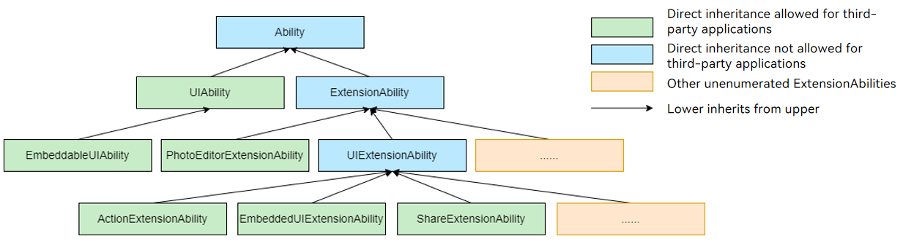

# @ohos.app.ability.Ability (Ability Base Class)

<!--Kit: Ability Kit-->
<!--Subsystem: Ability-->
<!--Owner: @littlejerry1-->
<!--Designer: @ccllee1-->
<!--Tester: @lixueqing513-->
<!--Adviser: @huipeizi-->

The Ability class is the fundamental unit for application lifecycle scheduling. It is the base class of [UIAbility](js-apis-app-ability-uiAbility.md) and [ExtensionAbility](js-apis-app-ability-extensionAbility.md), and provides callbacks for system configuration updates and memory level updates. However, you cannot inherit directly from this base class. You should opt for either [UIAbility](js-apis-app-ability-uiAbility.md) or [ExtensionAbility](js-apis-app-ability-extensionAbility.md) based on your service needs. For details, see [Introduction to Ability Kit](../../application-models/abilitykit-overview.md).

> **NOTE**
> 
> The initial APIs of this module are supported since API version 9. Newly added APIs will be marked with a superscript to indicate their earliest API version.
>
> The APIs of this module can be used only in the stage model.

## Modules to Import

```ts
import { Ability } from '@kit.AbilityKit';
```

## Ability Inheritance Relationship

The following figure shows the inheritance relationship of the Ability base class and its child classes.

> **NOTE**
>
> Some ExtensionAbility components (such as [FormExtensionAbility](../apis-form-kit/js-apis-app-form-formExtensionAbility.md) and [InputMethodExtensionAbility](../apis-ime-kit/js-apis-inputmethod-extension-ability.md)) do not inherit from the ExtensionAbility base class and therefore are not provided in the following figure.



## Ability.onConfigurationUpdate

onConfigurationUpdate(newConfig: Configuration): void

Called when a system environment variable changes. You can override this callback to respond to changes in the system environment variables. For example, when the system language changes, the application can perform customized processing in the callback.

> **NOTE**
>
> There are certain restrictions when this callback is actually triggered. If you set the application language by calling [setLanguage](../apis-ability-kit/js-apis-inner-application-applicationContext.md#applicationcontextsetlanguage11), the system does not trigger the **onConfigurationUpdate** callback even if the system language changes. For details, see [When to Use](../../application-models/subscribe-system-environment-variable-changes.md#when-to-use).

**Atomic service API**: This API can be used in atomic services since API version 11.

**System capability**: SystemCapability.Ability.AbilityRuntime.AbilityCore

**Parameters**

| Name| Type| Mandatory| Description|
| -------- | -------- | -------- | -------- |
| newConfig | [Configuration](js-apis-app-ability-configuration.md) | Yes| New configuration.|

**Example**

```ts
// You are not allowed to inherit from the top-level base class Ability. Therefore, the derived class UIAbility is used as an example.
import { UIAbility, Configuration } from '@kit.AbilityKit';

class MyUIAbility extends UIAbility {
  onConfigurationUpdate(config: Configuration) {
    console.log(`onConfigurationUpdate, config: ${JSON.stringify(config)}`);
  }
}
```

## Ability.onMemoryLevel

onMemoryLevel(level: AbilityConstant.MemoryLevel): void

Called when the available memory of the entire device changes to a specified level. You can override this callback to respond to changes in the memory level, for example, releasing cached data.

**Atomic service API**: This API can be used in atomic services since API version 11.

**System capability**: SystemCapability.Ability.AbilityRuntime.AbilityCore

**Parameters**

| Name| Type| Mandatory| Description|
| -------- | -------- | -------- | -------- |
| level | [AbilityConstant.MemoryLevel](js-apis-app-ability-abilityConstant.md#memorylevel) | Yes| Level of the available memory.<br>**NOTE**<br>The trigger conditions may differ across various devices. For example, on a standard device with 12 GB of memory:<br>- When the available memory of the entire device drops to 1700 MB to 1800 MB, the **onMemoryLevel** callback of the MEMORY_LEVEL_MODERATE type is triggered, indicating that the available memory is moderate.<br>- When the available memory of the entire device drops to 1600 MB to 1700 MB, the **onMemoryLevel** callback of the MEMORY_LEVEL_LOW type is triggered, indicating that the available memory is low.<br>- When the available memory of the entire device drops below 1600 MB, the **onMemoryLevel** callback of the MEMORY_LEVEL_CRITICAL type is triggered, indicating that the available memory is critically low.|

**Example**

```ts
// You are not allowed to inherit from the top-level base class Ability. Therefore, the derived class UIAbility is used as an example.
import { UIAbility, AbilityConstant } from '@kit.AbilityKit';

class MyUIAbility extends UIAbility {
  onMemoryLevel(level: AbilityConstant.MemoryLevel) {
    console.log(`onMemoryLevel, level: ${JSON.stringify(level)}`);
  }
}
```
