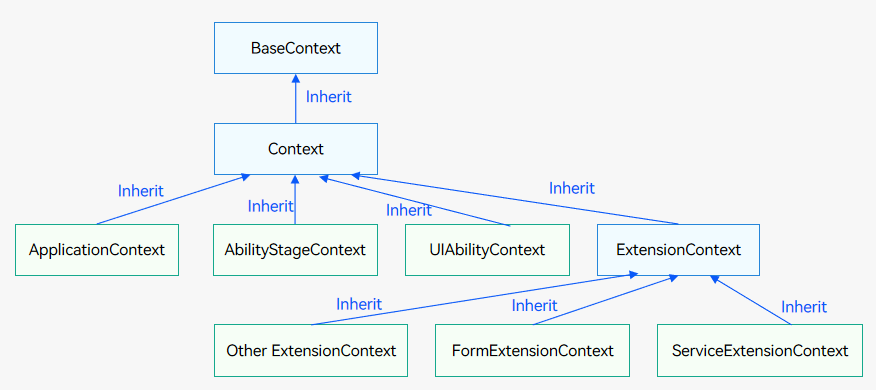
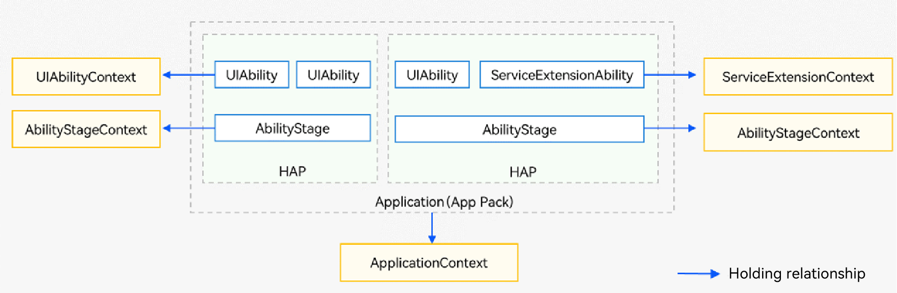

# Context (Context Base Class of the Stage Model)

The Context module inherits from [BaseContext](js-apis-inner-application-baseContext.md). It provides context for abilities or applications, including access to application-specific resources.

> **NOTE**
>
>  - The initial APIs of this module are supported since API version 9. Newly added APIs will be marked with a superscript to indicate their earliest API version.
>  - The APIs of this module can be used only in the stage model.

## Inheritance and Holding Relationships of Different Context Types
- Inheritance relationships among different types of context

  

- Holding relationships among different types of context

  
  
> **NOTE**
>
> [UIContext](../../reference/apis-arkui/js-apis-arkui-UIContext.md) refers to the context of a UI instance, which is used to associate windows with UI pages. It is not directly related to the application context discussed in this topic and does not involve inheritance or holding relationships.

## Modules to Import

```ts
import { common } from '@kit.AbilityKit';
```

## Context

Represents the context for the ability or application. It allows access to application-specific resources.

### Properties

**System capability**: SystemCapability.Ability.AbilityRuntime.Core

| Name                 | Type    | Read-only  | Optional  | Description                                                              |
|---------------------| ------ | ---- | ---- |------------------------------------------------------------------|
| resourceManager     | resmgr.[ResourceManager](../apis-localization-kit/js-apis-resource-manager.md#resourcemanager) | No   | No   | Object for resource management.<br>**Atomic service API**: This API can be used in atomic services since API version 11.|
| applicationInfo     | [ApplicationInfo](js-apis-bundleManager-applicationInfo.md) | No   | No   | Application information.<br>**Atomic service API**: This API can be used in atomic services since API version 11.|
| cacheDir            | string | No   | No   | Cache directory. For details, see [Application Sandbox](../../file-management/app-sandbox-directory.md).<br>**Atomic service API**: This API can be used in atomic services since API version 11.|
| tempDir             | string | No   | No   | Temporary directory. For details, see [Application Sandbox](../../file-management/app-sandbox-directory.md).<br>**Atomic service API**: This API can be used in atomic services since API version 11.|
| resourceDir<sup>11+<sup>         | string | No   | No   | Resource directory.<br>**NOTE**: You are required to manually create the **resfile** directory in **\<module-name>\resource**. The **resfile** directory can be accessed only in read-only mode.<br>**Atomic service API**: This API can be used in atomic services since API version 11.|
| filesDir            | string | No   | No   | File directory. For details, see [Application Sandbox](../../file-management/app-sandbox-directory.md).<br>**Atomic service API**: This API can be used in atomic services since API version 11.|
| databaseDir         | string | No   | No   | Database directory. For details, see [Application Sandbox](../../file-management/app-sandbox-directory.md).<br>**Atomic service API**: This API can be used in atomic services since API version 11.|
| preferencesDir      | string | No   | No   | Preferences directory. For details, see [Application Sandbox](../../file-management/app-sandbox-directory.md).<br>**Atomic service API**: This API can be used in atomic services since API version 11.|
| bundleCodeDir       | string | No   | No   | Bundle code directory. Do not access resource files using concatenated paths. Use [resource manager APIs](../apis-localization-kit/js-apis-resource-manager.md) instead. For details, see [Application Sandbox](../../file-management/app-sandbox-directory.md).<br>**Atomic service API**: This API can be used in atomic services since API version 11.|
| distributedFilesDir | string | No   | No   | Distributed file directory. For details, see [Application Sandbox](../../file-management/app-sandbox-directory.md).<br>**Atomic service API**: This API can be used in atomic services since API version 11.|
| cloudFileDir<sup>12+</sup>        | string | No   | No   | Cloud file directory.<br>**Atomic service API**: This API can be used in atomic services since API version 12.   |
| eventHub            | [EventHub](js-apis-inner-application-eventHub.md) | No   | No   | Event hub that implements event subscription, unsubscription, and triggering.<br>**Atomic service API**: This API can be used in atomic services since API version 11.|
| area                | contextConstant.[AreaMode](js-apis-app-ability-contextConstant.md#areamode) | No   | No   | Information about file partitions, which are divided according to the encryption level specified by [AreaMode](js-apis-app-ability-contextConstant.md#areamode).<br>**Atomic service API**: This API can be used in atomic services since API version 11.|
| processName<sup>18+</sup> | string | No  | No| Process name of the current application.<br>**Atomic service API**: This API can be used in atomic services since API version 18.|

### createModuleContext<sup>(deprecated)</sup>

createModuleContext(moduleName: string): Context

Creates the context based on the module name.

> **NOTE**
>
> - Only the context of other modules in the current application and the context of the intra-application HSP can be obtained. The context of other applications cannot be obtained.
>
> - This API is deprecated since API version 12. You are advised to use [application.createModuleContext](./js-apis-app-ability-application.md#applicationcreatemodulecontext12) instead. Otherwise, resource retrieval may be abnormal.

**Atomic service API**: This API can be used in atomic services since API version 11.

**System capability**: SystemCapability.Ability.AbilityRuntime.Core

**Parameters**

| Name      | Type                    | Mandatory  | Description           |
| -------- | ---------------------- | ---- | ------------- |
| moduleName | string | Yes   | Module name.|

**Return value**

| Type| Description|
| -------- | -------- |
| Context | Context created.|

**Error codes**

For details about the error codes, see [Universal Error Codes](../errorcode-universal.md).

| ID| Error Message|
| ------- | -------------------------------- |
| 401 | Parameter error. Possible causes: 1.Mandatory parameters are left unspecified. 2.Incorrect parameter types. |

**Example**

```ts
import { common, UIAbility } from '@kit.AbilityKit';
import { BusinessError } from '@kit.BasicServicesKit';

export default class EntryAbility extends UIAbility {
  onCreate() {
    console.log('MyAbility onCreate');
    let moduleContext: common.Context;
    try {
      moduleContext = this.context.createModuleContext('entry');
    } catch (error) {
      console.error(`createModuleContext failed, error.code: ${(error as BusinessError).code}, error.message: ${(error as BusinessError).message}`);
    }
  }
}
```

### getApplicationContext

getApplicationContext(): ApplicationContext

Obtains the context of this application.

**Atomic service API**: This API can be used in atomic services since API version 11.

**System capability**: SystemCapability.Ability.AbilityRuntime.Core

**Return value**

| Type| Description|
| -------- | -------- |
| [ApplicationContext](js-apis-inner-application-applicationContext.md) | Application context obtained.|

**Error codes**

For details about the error codes, see [Universal Error Codes](../errorcode-universal.md).

| ID| Error Message|
| ------- | -------------------------------- |
| 401 | Parameter error. Possible causes: 1.Mandatory parameters are left unspecified. 2.Incorrect parameter types. |

**Example**

```ts
import { common, UIAbility } from '@kit.AbilityKit';
import { BusinessError } from '@kit.BasicServicesKit';

export default class EntryAbility extends UIAbility {
  onCreate() {
    console.log('MyAbility onCreate');
    let applicationContext: common.Context;
    try {
      applicationContext = this.context.getApplicationContext();
    } catch (error) {
      console.error(`getApplicationContext failed, error.code: ${(error as BusinessError).code}, error.message: ${(error as BusinessError).message}`);
    }
  }
}
```

### getGroupDir<sup>10+</sup>

getGroupDir(dataGroupID: string): Promise\<string>

Obtains the shared directory based on a group ID. This API uses a promise to return the result.

**Atomic service API**: This API can be used in atomic services since API version 11.

**System capability**: SystemCapability.Ability.AbilityRuntime.Core

**Parameters**

| Name      | Type                    | Mandatory  | Description           |
| -------- | ---------------------- | ---- | ------------- |
| dataGroupID | string | Yes   | Group ID, which is assigned by the system when an atomic service project is created.|

**Return value**

| Type| Description|
| -------- | -------- |
| Promise\<string> | Promise used to return the result. If no shared directory exists, null is returned. Only the encryption level EL2 is supported.|

**Error codes**

For details about the error codes, see [Universal Error Codes](../errorcode-universal.md) and [Ability Error Codes](errorcode-ability.md).

| ID| Error Message|
| ------- | -------------------------------- |
| 401 | Parameter error. Possible causes: 1.Mandatory parameters are left unspecified. 2.Incorrect parameter types. |
| 16000011 | The context does not exist. |

**Example**

```ts
import { common, UIAbility } from '@kit.AbilityKit';
import { BusinessError } from '@kit.BasicServicesKit';

export default class EntryAbility extends UIAbility {
  onCreate() {
    console.log('MyAbility onCreate');
    let groupId = "1";
    let getGroupDirContext: common.Context = this.context;
    try {
      getGroupDirContext.getGroupDir(groupId).then(data => {
        console.log("getGroupDir result:" + data);
      })
    } catch (error) {
      console.error(`getGroupDirContext failed, error.code: ${(error as BusinessError).code}, error.message: ${(error as BusinessError).message}`);
    }
  }
}
```

### getGroupDir<sup>10+</sup>

getGroupDir(dataGroupID: string, callback: AsyncCallback\<string>): void

Obtains the shared directory based on a group ID. This API uses an asynchronous callback to return the result.

**Atomic service API**: This API can be used in atomic services since API version 11.

**System capability**: SystemCapability.Ability.AbilityRuntime.Core

**Parameters**

| Name      | Type                    | Mandatory  | Description           |
| -------- | ---------------------- | ---- | ------------- |
| dataGroupID | string | Yes   | Group ID, which is assigned by the system when an atomic service project is created.|
| callback | AsyncCallback\<string> | Yes   | Callback used to return the result. If no shared directory exists, null is returned. Only the encryption level EL2 is supported.|

**Error codes**

For details about the error codes, see [Universal Error Codes](../errorcode-universal.md) and [Ability Error Codes](errorcode-ability.md).

| ID| Error Message|
| ------- | -------------------------------- |
| 401 | Parameter error. Possible causes: 1.Mandatory parameters are left unspecified. 2.Incorrect parameter types. |
| 16000011 | The context does not exist. |

**Example**

```ts
import { common, UIAbility } from '@kit.AbilityKit';
import { BusinessError } from '@kit.BasicServicesKit';

export default class EntryAbility extends UIAbility {
  onCreate() {
    console.log('MyAbility onCreate');
    let getGroupDirContext: common.Context = this.context;

    getGroupDirContext.getGroupDir("1", (err: BusinessError, data) => {
      if (err) {
        console.error(`getGroupDir faile, err: ${JSON.stringify(err)}`);
      } else {
        console.log(`getGroupDir result is: ${JSON.stringify(data)}`);
      }
    });
  }
}
```

### createAreaModeContext<sup>18+</sup>

createAreaModeContext(areaMode: contextConstant.AreaMode): Context

Creates the context for this application based on a data encryption level. This is required when an application needs to store different types of information in different directories. The application can obtain the corresponding directory.

**Atomic service API**: This API can be used in atomic services since API version 18.

**System capability**: SystemCapability.Ability.AbilityRuntime.Core

**Parameters**

| Name  | Type                                                        | Mandatory| Description                    |
| -------- | ------------------------------------------------------------ | ---- | ------------------------ |
| areaMode | [contextConstant.AreaMode](js-apis-app-ability-contextConstant.md#areamode) | Yes  | Data encryption level.|

**Return value**

| Type   | Description                  |
| ------- | ---------------------- |
| Context | Context created based on the data encryption level.|

**Example**

```ts
import { common, UIAbility, contextConstant } from '@kit.AbilityKit';
import { hilog } from '@kit.PerformanceAnalysisKit';

export default class EntryAbility extends UIAbility {
  onCreate() {
    hilog.info(0x0000, 'testTag', '%{public}s', 'Ability onCreate');
    let areaMode: contextConstant.AreaMode = contextConstant.AreaMode.EL2;
    let areaModeContext: common.Context;
    try {
      areaModeContext = this.context.createAreaModeContext(areaMode);
    } catch (error) {
      hilog.error(0x0000, 'testTag', 'createAreaModeContext error is:%{public}s', JSON.stringify(error));
    }
  }
}
```

### createDisplayContext<sup>15+</sup>

createDisplayContext(displayId: number): Context

Creates the context based on the specified display ID, so as to obtain and use other application contexts with screen information (including [ScreenDensity](../apis-localization-kit/js-apis-resource-manager.md#screendensity) and [Direction](../apis-localization-kit/js-apis-resource-manager.md#direction)).

**Atomic service API**: This API can be used in atomic services since API version 15.

**System capability**: SystemCapability.Ability.AbilityRuntime.Core

**Parameters**

| Name  | Type                                                        | Mandatory| Description                    |
| -------- | ------------------------------------------------------------ | ---- | ------------------------ |
| displayId | number | Yes   | Display ID.|

**Return value**

| Type   | Description                  |
| ------- | ---------------------- |
| [Context](#context) | Context with the specified screen information.|

**Error codes**

For details about the error codes, see [Universal Error Codes](../errorcode-universal.md).

| ID| Error Message                                                    |
| -------- | ------------------------------------------------------------ |
| 401      | Parameter error. Possible causes: 1.Mandatory parameters are left unspecified. 2.Incorrect parameter types. |

**Example**

```ts
import { common, UIAbility } from '@kit.AbilityKit';
import { hilog } from '@kit.PerformanceAnalysisKit';

export default class EntryAbility extends UIAbility {
  onCreate() {
    hilog.info(0x0000, 'testTag', '%{public}s', 'Ability onCreate');
    let displayContext: common.Context;
    try {
      displayContext = this.context.createDisplayContext(0);
    } catch (error) {
      hilog.error(0x0000, 'testTag', 'createDisplayContext error is:%{public}s', JSON.stringify(error));
    }
  }
}
```
