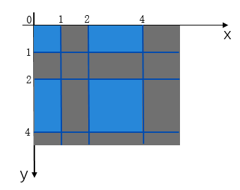

# Class (Lattice)

<!--Kit: ArkGraphics 2D-->
<!--Subsystem: Graphics-->
<!--Owner: @hangmengxin-->
<!--Designer: @wangyanglan-->
<!--Tester: @nobuggers-->
<!--Adviser: @ge-yafang-->

> **NOTE**
>
> - The initial APIs of this module are supported since API version 11. Newly added APIs will be marked with a superscript to indicate their earliest API version.
>
> - The initial APIs of this class are supported since API version 12.
>
> - This module uses the physical pixel unit, px.
>
> - This module operates under a single-threaded model. The caller needs to manage thread safety and context state transitions.

Lattice object. which is used to divide an image by lattice.

## Modules to Import

```ts
import { drawing } from '@kit.ArkGraphics2D';
```

## createImageLattice<sup>12+</sup>

static createImageLattice(xDivs: Array\<number>, yDivs: Array\<number>, fXCount: number, fYCount: number, fBounds?: common2D.Rect | null, fRectTypes?: Array\<RectType> | null, fColors?: Array\<common2D.Color> | null): Lattice

Divides the image into lattices. The lattices on both even columns and even rows are fixed, and they are drawn at their original size if the target is large enough. If the target is too small to hold the fixed lattices, all the fixed lattices are scaled down to fit the target, and the lattices that are not on even columns and even rows are scaled to accommodate the remaining space.

**System capability**: SystemCapability.Graphics.Drawing

**Parameters**

| Name      | Type                                                               | Mandatory| Description                                                                              |
| ------------ | ------------------------------------------------------------------ | ---- | --------------------------------------------------------------------------------- |
| xDivs        | Array\<number>                                                     | Yes  | Array of X coordinates used to divide the image. The value is an integer.                                            |
| yDivs        | Array\<number>                                                     | Yes  | Array of Y coordinates used to divide the image. The value is an integer.                                            |
| fXCount      | number                                                             | Yes  | Size of the array that holds the X coordinates. The value range is [0, 5].                           |
| fYCount      | number                                                             | Yes  | Size of the array that holds the Y coordinates. The value range is [0, 5].                           |
| fBounds      | [common2D.Rect](js-apis-graphics-common2D.md#rect) \| null           | No  | Source bounds to draw. The rectangle parameter must be an integer. The default value is the rectangle size of the original image. If the rectangle parameter is a decimal, the decimal part is discarded and converted into an integer.|
| fRectTypes   | Array\<[RectType](arkts-apis-graphics-drawing-e.md#recttype12)> \| null                              | No  | Array that holds the rectangle types. The default value is null. If this parameter is specified, the array size must be (fXCount + 1) * (fYCount + 1).|
| fColors      | Array\<[common2D.Color](js-apis-graphics-common2D.md#color)> \| null | No  | Array that holds the colors used to fill the lattices. The default value is null. If this parameter is specified, the array size must be (fXCount + 1) * (fYCount + 1).|

**Returns**

| Type                      | Description                               |
| ------------------------- | ----------------------------------- |
| [Lattice](arkts-apis-graphics-drawing-Lattice.md)     | **Lattice** object obtained.             |

**Error codes**

For details about the error codes, see [Universal Error Codes](../errorcode-universal.md).

| ID| Error Message|
| ------- | --------------------------------------------|
| 401 | Parameter error.Possible causes:1.Mandatory parameters are left unspecified;2.Incorrect parameter types;3.Parameter verification failed. |

**Example**

```ts
import { RenderNode } from '@kit.ArkUI';
import { drawing } from '@kit.ArkGraphics2D';

class DrawingRenderNode extends RenderNode {
  draw(context : DrawContext) {
    let xDivs : Array<number> = [1, 2, 4];
    let yDivs : Array<number> = [1, 2, 4];
    let lattice = drawing.Lattice.createImageLattice(xDivs, yDivs, 3, 3); // The image is divided into lattices of (3 + 1) x (3 + 1). The blue rectangles in the figure below are fixed lattices.
  }
}
```


## createImageLattice<sup>18+</sup>

static createImageLattice(xDivs: Array\<number>, yDivs: Array\<number>, fXCount: number, fYCount: number, fBounds?: common2D.Rect | null, fRectTypes?: Array\<RectType> | null, fColors?: Array\<number> | null): Lattice

Divides the image into lattices. The lattices on both even columns and even rows are fixed, and they are drawn at their original size if the target is large enough. If the target is too small to hold the fixed lattices, all the fixed lattices are scaled down to fit the target, and the lattices that are not on even columns and even rows are scaled to accommodate the remaining space.

**System capability**: SystemCapability.Graphics.Drawing

**Parameters**

| Name      | Type                                                               | Mandatory| Description                                                                              |
| ------------ | ------------------------------------------------------------------ | ---- | --------------------------------------------------------------------------------- |
| xDivs        | Array\<number>                                                     | Yes  | Array of X coordinates used to divide the image. The value is an integer.                                            |
| yDivs        | Array\<number>                                                     | Yes  | Array of Y coordinates used to divide the image. The value is an integer.                                            |
| fXCount      | number                                                             | Yes  | Size of the array that holds the X coordinates. The value range is [0, 5].                           |
| fYCount      | number                                                             | Yes  | Size of the array that holds the Y coordinates. The value range is [0, 5].                           |
| fBounds      | [common2D.Rect](js-apis-graphics-common2D.md#rect) \| null           | No  | Source bounds to draw. The rectangle parameter must be an integer. The default value is the rectangle size of the original image. If the rectangle parameter is a decimal, the decimal part is discarded and converted into an integer.|
| fRectTypes   | Array\<[RectType](arkts-apis-graphics-drawing-e.md#recttype12)> \| null                              | No  | Array that holds the rectangle types. The default value is null. If this parameter is specified, the array size must be (fXCount + 1) * (fYCount + 1).|
| fColors      | Array\<number> \| null | No  | Array that holds the colors used to fill the lattices. Each color is represented by a 32-bit unsigned integer in hexadecimal ARGB format. The default value is null. If this parameter is specified, the array size must be (fXCount + 1) * (fYCount + 1).|

**Returns**

| Type                      | Description                               |
| ------------------------- | ----------------------------------- |
| [Lattice](arkts-apis-graphics-drawing-Lattice.md)     | **Lattice** object obtained.             |

**Error codes**

For details about the error codes, see [Universal Error Codes](../errorcode-universal.md).

| ID| Error Message|
| ------- | --------------------------------------------|
| 401 | Parameter error.Possible causes:1.Mandatory parameters are left unspecified;2.Incorrect parameter types;3.Parameter verification failed. |

**Example**

```ts
import { RenderNode } from '@kit.ArkUI';
import { drawing } from '@kit.ArkGraphics2D';

class DrawingRenderNode extends RenderNode {
  draw(context : DrawContext) {
    let xDivs : Array<number> = [1, 2, 4];
    let yDivs : Array<number> = [1, 2, 4];
    let colorArray :Array<number>=[0xffffffff,0x44444444,0x99999999,0xffffffff,0x44444444,0x99999999,0xffffffff,0x44444444,0x99999999,0x44444444,0x99999999,0xffffffff,0x44444444,0x99999999,0xffffffff,0x44444444];
    let lattice = drawing.Lattice.createImageLattice(xDivs, yDivs, 3, 3,null,null,colorArray);
  }
}
```
