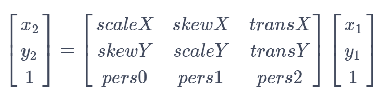
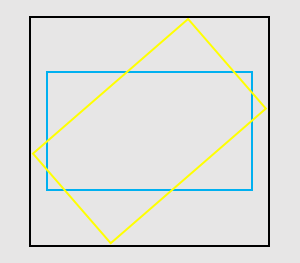

# Class (Matrix)

<!--Kit: ArkGraphics 2D-->
<!--Subsystem: Graphics-->
<!--Owner: @hangmengxin-->
<!--Designer: @wangyanglan-->
<!--Tester: @nobuggers-->
<!--Adviser: @ge-yafang-->

> **NOTE**
>
> - The initial APIs of this module are supported since API version 11. Newly added APIs will be marked with a superscript to indicate their earliest API version.
>
> - The initial APIs of this class are supported since API version 12.
>
> - This module uses the physical pixel unit, px.
>
> - The module operates under a single-threaded model. The caller needs to manage thread safety and context state transitions.

Implements a matrix.

A 3 x 3 matrix is shown as below.


Elements in the matrix from left to right and from top to bottom respectively represent a horizontal scale coefficient, a horizontal skew coefficient, a horizontal translation coefficient, a vertical skew coefficient, a vertical scale coefficient, a vertical translation coefficient, an X-axis perspective coefficient, a Y-axis perspective coefficient, and a perspective scale coefficient.
If (x<sub>1</sub>, y<sub>1</sub>) is the source coordinate point, (x<sub>2</sub>, y<sub>2</sub>) is the coordinate point obtained by transforming the source coordinate point using the matrix, then the relationship between the two coordinate points is as follows:



## Modules to Import

```ts
import { drawing } from '@kit.ArkGraphics2D';
```

## constructor<sup>12+</sup>

constructor()

Creates a **Matrix** object.

**System capability**: SystemCapability.Graphics.Drawing

**Example**

```ts
import { drawing } from '@kit.ArkGraphics2D';

let matrix = new drawing.Matrix();
```

## constructor<sup>20+</sup>

constructor(matrix: Matrix)

Copies a matrix.

**System capability**: SystemCapability.Graphics.Drawing

**Parameters**

| Name        | Type                                      | Mandatory  | Description                 |
| ----------- | ---------------------------------------- | ---- | ------------------- |
| matrix      | [Matrix](arkts-apis-graphics-drawing-Matrix.md)                  | Yes   | Matrix to be copied.|

**Example**

```ts
import { drawing } from '@kit.ArkGraphics2D';

let matrix = new drawing.Matrix();
let matrix2 = new drawing.Matrix(matrix);
```

## isAffine<sup>20+</sup>

isAffine(): boolean

Checks whether the existing matrix is an affine matrix, which includes transformations such as translation, rotation, and scaling.

**System capability**: SystemCapability.Graphics.Drawing

**Returns**

| Type                       | Description                 |
| --------------------------- | -------------------- |
| boolean | Whether the existing matrix is an affine matrix. **true** means yes; **false** otherwise.|

**Example**

```ts
import { drawing } from '@kit.ArkGraphics2D';

let matrix = new drawing.Matrix();
matrix.setMatrix([1, 0.5, 1, 0.5, 1, 1, 1, 1, 1]);
let isAff = matrix.isAffine();
console.info('isAff :', isAff);
```

## rectStaysRect<sup>20+</sup>

rectStaysRect(): boolean

Checks whether a rectangle stays a rectangle after being mapped by a matrix.

**System capability**: SystemCapability.Graphics.Drawing

**Returns**

| Type                       | Description                 |
| --------------------------- | -------------------- |
| boolean | Whether a rectangle stays a rectangle after being mapped by a matrix. **true** means yes; false otherwise.|

**Example**

```ts
import { drawing } from '@kit.ArkGraphics2D';

let matrix = new drawing.Matrix();
matrix.setMatrix([1, 0.5, 1, 0.5, 1, 1, 1, 1, 1]);
let matrix2 = new drawing.Matrix(matrix);
let isRect = matrix2.rectStaysRect();
console.info('isRect :', isRect);
```

## setSkew<sup>20+</sup>

setSkew(kx: number, ky: number, px: number, py: number): void

Sets the skew coefficients of a matrix.

**System capability**: SystemCapability.Graphics.Drawing

**Parameters**

| Name        | Type                                      | Mandatory  | Description                      |
| ----------- | ---------------------------------------- | ---- | -------------------             |
| kx          | number                  | Yes   | Amount of tilt on the X axis. The value is a floating point number. A positive number tilts the drawing rightwards along the positive direction of the Y axis, and a negative number tilts the drawing leftwards along the positive direction of the Y axis.       |
| ky          | number                  | Yes   | Amount of tilt on the Y axis. The value is a floating point number. A positive number tilts the drawing downwards along the positive direction of the X axis, and a negative number tilts the drawing upwards along the positive direction of the X axis.       |
| px          | number                  | Yes   | X coordinate of the shear center. The value is a floating point number. **0** indicates the coordinate origin. A positive value places the center to the right of the coordinate origin, while a negative value places the center to the left.    |
| py          | number                  | Yes   | Y coordinate of the shear center. The value is a floating point number. **0** indicates the coordinate origin. A positive value places the center below the coordinate origin, while a negative value places the center above the coordinate origin.    |

**Example**

```ts
import { drawing } from '@kit.ArkGraphics2D';

let matrix = new drawing.Matrix();
matrix.setMatrix([1, 0.5, 1, 0.5, 1, 1, 1, 1, 1]);
matrix.setSkew(2, 0.5, 0.5, 2);
```

## setSinCos<sup>20+</sup>

setSinCos(sinValue: number, cosValue: number, px: number, py: number): void

Sets the matrix to rotate around the rotation center (px, py) with the specified sine and cosine values.

**System capability**: SystemCapability.Graphics.Drawing

**Parameters**

| Name        | Type                                      | Mandatory  | Description           |
| ----------- | ---------------------------------------- | ---- | ------------------- |
| sinValue          | number                  | Yes   | Sine value of the rotation angle. Only if the sum of the squares of the sine and cosine values is 1, the rotation transformation is performed. Otherwise, the matrix may contain other transformations such as translation and scaling.         |
| cosValue          | number                  | Yes   | Cosine value of the rotation angle. Only if the sum of the squares of the sine and cosine values is 1, the rotation transformation is performed. Otherwise, the matrix may contain other transformations such as translation and scaling.           |
| px          | number                  | Yes   | X coordinate of the rotation center. The value is a floating point number. **0** indicates the coordinate origin. A positive value places the center to the right of the coordinate origin, while a negative value places the center to the left.    |
| py          | number                  | Yes   | Y coordinate of the rotation center. The value is a floating point number. **0** indicates the coordinate origin. A positive value places the center below the coordinate origin, while a negative value places the center above the coordinate origin.   |

**Example**

```ts
import { drawing } from '@kit.ArkGraphics2D';

let matrix = new drawing.Matrix();
matrix.setMatrix([1, 0.5, 1, 0.5, 1, 1, 1, 1, 1]);
matrix.setSinCos(0, 1, 1, 0);
```
## setRotation<sup>12+</sup>

setRotation(degree: number, px: number, py: number): void

Sets this matrix as an identity matrix and rotates it by a given degree around the rotation point (px, py).

**System capability**: SystemCapability.Graphics.Drawing

**Parameters**

| Name        | Type                                      | Mandatory  | Description                 |
| ----------- | ---------------------------------------- | ---- | ------------------- |
| degree      | number                  | Yes   | Angle to rotate, in degrees. A positive number indicates a clockwise rotation, and a negative number indicates a counterclockwise rotation. The value is a floating point number.|
| px          | number                  | Yes   | X coordinate of the rotation point. The value is a floating point number.    |
| py          | number                  | Yes   | Y coordinate of the rotation point. The value is a floating point number.    |

**Error codes**

For details about the error codes, see [Universal Error Codes](../errorcode-universal.md).

| ID| Error Message|
| ------- | --------------------------------------------|
| 401 | Parameter error.Possible causes:1.Mandatory parameters are left unspecified;2.Incorrect parameter types. |

**Example**

```ts
import { drawing } from '@kit.ArkGraphics2D';

let matrix = new drawing.Matrix();
matrix.setRotation(90, 100, 100);
```

## setScale<sup>12+</sup>

setScale(sx: number, sy: number, px: number, py: number): void

Sets this matrix as an identity matrix and scales it with the coefficients (sx, sy) at the scale point (px, py).

**System capability**: SystemCapability.Graphics.Drawing

**Parameters**

| Name        | Type                                      | Mandatory  | Description                 |
| ----------- | ---------------------------------------- | ---- | ------------------- |
| sx          | number                  | Yes   | Scale coefficient along the X axis. If a negative number is passed in, the matrix is mirrored around y = px before being scaled. The value is a floating point number.    |
| sy          | number                  | Yes   | Scale coefficient along the Y axis. If a negative number is passed in, the matrix is mirrored around x = py before being scaled. The value is a floating point number.    |
| px          | number                  | Yes   |  X coordinate of the scale point. The value is a floating point number.     |
| py          | number                  | Yes   |  Y coordinate of the scale point. The value is a floating point number.     |

**Error codes**

For details about the error codes, see [Universal Error Codes](../errorcode-universal.md).

| ID| Error Message|
| ------- | --------------------------------------------|
| 401 | Parameter error.Possible causes:1.Mandatory parameters are left unspecified;2.Incorrect parameter types. |

**Example**

```ts
import { drawing } from '@kit.ArkGraphics2D';

let matrix = new drawing.Matrix();
matrix.setScale(100, 100, 150, 150);
```

## setTranslation<sup>12+</sup>

setTranslation(dx: number, dy: number): void

Sets this matrix as an identity matrix and translates it by a given distance (dx, dy).

**System capability**: SystemCapability.Graphics.Drawing

**Parameters**

| Name        | Type                                      | Mandatory  | Description                 |
| ----------- | ---------------------------------------- | ---- | ------------------- |
| dx          | number                  | Yes   | Horizontal distance to translate. A positive number indicates a translation towards the positive direction of the X axis, and a negative number indicates a translation towards the negative direction of the X axis. The value is a floating point number.    |
| dy          | number                  | Yes   | Vertical distance to translate. A positive number indicates a translation towards the positive direction of the Y axis, and a negative number indicates a translation towards the negative direction of the Y axis. The value is a floating point number.    |

**Error codes**

For details about the error codes, see [Universal Error Codes](../errorcode-universal.md).

| ID| Error Message|
| ------- | --------------------------------------------|
| 401 | Parameter error.Possible causes:1.Mandatory parameters are left unspecified;2.Incorrect parameter types. |

**Example**

```ts
import { drawing } from '@kit.ArkGraphics2D';

let matrix = new drawing.Matrix();
matrix.setTranslation(100, 100);
```

## setMatrix<sup>12+</sup>

setMatrix(values: Array\<number>): void

Sets parameters for this matrix.

**System capability**: SystemCapability.Graphics.Drawing

**Parameters**

| Name| Type                                                | Mandatory| Description            |
| ------ | ---------------------------------------------------- | ---- | ---------------- |
| values  | Array\<number> | Yes  | Floating-point array that holds the parameter values, with the array length set to 9. The values in the array respectively represent a horizontal scale coefficient, a horizontal skew coefficient, a horizontal translation coefficient, a vertical skew coefficient, a vertical scale coefficient, a vertical translation coefficient, an X-axis perspective coefficient, a Y-axis perspective coefficient, and a perspective scale coefficient, in ascending order of indexes.|

**Error codes**

For details about the error codes, see [Universal Error Codes](../errorcode-universal.md).

| ID| Error Message|
| ------- | --------------------------------------------|
| 401 | Parameter error.Possible causes:1.Mandatory parameters are left unspecified;2.Incorrect parameter types; 3. Parameter verification failed. |

**Example**

```ts
import { drawing } from '@kit.ArkGraphics2D';

let matrix = new drawing.Matrix();
let value : Array<number> = [2, 2, 2, 2, 2, 2, 2, 2, 2];
matrix.setMatrix(value);
```

## preConcat<sup>12+</sup>

preConcat(matrix: Matrix): void

Preconcats the existing matrix with the passed-in matrix.

**System capability**: SystemCapability.Graphics.Drawing

**Parameters**

| Name| Type                                                | Mandatory| Description            |
| ------ | ---------------------------------------------------- | ---- | ---------------- |
| matrix  | [Matrix](arkts-apis-graphics-drawing-Matrix.md) | Yes  | **Matrix** object, which is on the right of a multiplication expression.|

**Error codes**

For details about the error codes, see [Universal Error Codes](../errorcode-universal.md).

| ID| Error Message|
| ------- | --------------------------------------------|
| 401 | Parameter error.Possible causes:1.Mandatory parameters are left unspecified;2.Incorrect parameter types. |

**Example**

```ts
import { drawing } from '@kit.ArkGraphics2D';

let matrix1 = new drawing.Matrix();
matrix1.setMatrix([2, 1, 3, 1, 2, 1, 3, 1, 2]);
let matrix2 = new drawing.Matrix();
matrix2.setMatrix([-2, 1, 3, 1, 0, -1, 3, -1, 2]);
matrix1.preConcat(matrix2);
```

## setMatrix<sup>20+</sup>

setMatrix(matrix: Array\<number\> \| Matrix): void

Updates the existing matrix with another matrix.

**System capability**: SystemCapability.Graphics.Drawing

**Parameters**

| Name| Type                                                | Mandatory| Description            |
| ------ | ---------------------------------------------------- | ---- | ---------------- |
| matrix | Array\<number\> \| [Matrix](arkts-apis-graphics-drawing-Matrix.md) | Yes  | Array or matrix for the update.|

**Example**

```ts
import { drawing } from '@kit.ArkGraphics2D';

let matrix1 = new drawing.Matrix();
matrix1.setMatrix([2, 1, 3, 1, 2, 1, 3, 1, 2]);
let matrix2 = new drawing.Matrix();
matrix1.setMatrix(matrix2);
```

## setConcat<sup>20+</sup>

setConcat(matrixA: Matrix, matrixB: Matrix): void

Updates the existing matrix with the product of two matrices.

**System capability**: SystemCapability.Graphics.Drawing

**Parameters**

| Name| Type                                                | Mandatory| Description            |
| ------ | ---------------------------------------------------- | ---- | ---------------- |
| matrixA  | [Matrix](arkts-apis-graphics-drawing-Matrix.md) | Yes  | Matrix A used for calculation.|
| matrixB  | [Matrix](arkts-apis-graphics-drawing-Matrix.md) | Yes  | Matrix B used for calculation.|

**Example**

```ts
import { drawing } from '@kit.ArkGraphics2D';

let matrix1 = new drawing.Matrix();
matrix1.setMatrix([2, 1, 3, 1, 2, 1, 3, 1, 2]);
let matrix2 = new drawing.Matrix();
matrix2.setMatrix([-2, 1, 3, 1, 0, -1, 3, -1, 2]);
matrix1.setConcat(matrix2, matrix1);
```

## postConcat<sup>20+</sup>

postConcat(matrix: Matrix): void

Right-multiply the existing matrix by another matrix.

**System capability**: SystemCapability.Graphics.Drawing

**Parameters**

| Name| Type                                                | Mandatory| Description            |
| ------ | ---------------------------------------------------- | ---- | ---------------- |
| matrix | [Matrix](arkts-apis-graphics-drawing-Matrix.md) | Yes  | Matrix used for calculation.|

**Example**

```ts
import { drawing } from '@kit.ArkGraphics2D';

let matrix = new drawing.Matrix();
if (matrix.isIdentity()) {
  console.info("matrix is identity.");
} else {
  console.info("matrix is not identity.");
}
let matrix1 = new drawing.Matrix();
matrix1.setMatrix([2, 1, 3, 1, 2, 1, 3, 1, 2]);
let matrix2 = new drawing.Matrix();
matrix2.setMatrix([-2, 1, 3, 1, 0, -1, 3, -1, 2]);
matrix1.postConcat(matrix2);
```

## isEqual<sup>12+</sup>

isEqual(matrix: Matrix): Boolean

Checks whether two **OH_Drawing_Matrix** objects are equal.

**System capability**: SystemCapability.Graphics.Drawing

**Parameters**

| Name| Type                                                | Mandatory| Description            |
| ------ | ---------------------------------------------------- | ---- | ---------------- |
| matrix  | [Matrix](arkts-apis-graphics-drawing-Matrix.md) | Yes  | Matrix to compare.|

**Returns**

| Type                       | Description                 |
| --------------------------- | -------------------- |
| Boolean | Comparison result of the two matrices. The value **true** means that the two matrices are equal, and **false** means the opposite.|

**Error codes**

For details about the error codes, see [Universal Error Codes](../errorcode-universal.md).

| ID| Error Message|
| ------- | --------------------------------------------|
| 401 | Parameter error.Possible causes:1.Mandatory parameters are left unspecified;2.Incorrect parameter types. |

**Example**

```ts
import { drawing } from '@kit.ArkGraphics2D';

let matrix1 = new drawing.Matrix();
matrix1.setMatrix([2, 1, 3, 1, 2, 1, 3, 1, 2]);
let matrix2 = new drawing.Matrix();
matrix2.setMatrix([-2, 1, 3, 1, 0, -1, 3, -1, 2]);
if (matrix1.isEqual(matrix2)) {
  console.info("matrix1 and matrix2 are equal.");
} else {
  console.info("matrix1 and matrix2 are not equal.");
}
```

## invert<sup>12+</sup>

invert(matrix: Matrix): Boolean

Inverts this matrix and returns the result.

**System capability**: SystemCapability.Graphics.Drawing

**Parameters**

| Name| Type                                                | Mandatory| Description            |
| ------ | ---------------------------------------------------- | ---- | ---------------- |
| matrix  | [Matrix](arkts-apis-graphics-drawing-Matrix.md) | Yes  | **Matrix** object used to store the inverted matrix.|

**Returns**

| Type                       | Description                 |
| --------------------------- | -------------------- |
| Boolean | Check result. The value **true** means that the matrix is revertible and the **matrix** object is set to its inverse, and **false** means that the matrix is not revertible and the **matrix** object remains unchanged.|

**Error codes**

For details about the error codes, see [Universal Error Codes](../errorcode-universal.md).

| ID| Error Message|
| ------- | --------------------------------------------|
| 401 | Parameter error.Possible causes:1.Mandatory parameters are left unspecified;2.Incorrect parameter types. |

**Example**

```ts
import { drawing } from '@kit.ArkGraphics2D';

let matrix1 = new drawing.Matrix();
matrix1.setMatrix([2, 1, 3, 1, 2, 1, 3, 1, 2]);
let matrix2 = new drawing.Matrix();
matrix2.setMatrix([-2, 1, 3, 1, 0, -1, 3, -1, 2]);
if (matrix1.invert(matrix2)) {
  console.info("matrix1 is invertible and matrix2 is set as an inverse matrix of the matrix1.");
} else {
  console.info("matrix1 is not invertible and matrix2 is not changed.");
}
```

## isIdentity<sup>12+</sup>

isIdentity(): Boolean

Checks whether an **OH_Drawing_Matrix** object is an identity matrix:

**System capability**: SystemCapability.Graphics.Drawing

**Returns**

| Type                       | Description                 |
| --------------------------- | -------------------- |
| Boolean | Check result. The value **true** means that the matrix is an identity matrix, and **false** means the opposite.|

**Example**

```ts
import { drawing } from '@kit.ArkGraphics2D';

let matrix = new drawing.Matrix();
if (matrix.isIdentity()) {
  console.info("matrix is identity.");
} else {
  console.info("matrix is not identity.");
}
```

## getValue<sup>12+</sup>

getValue(index: number): number

Obtains a matrix value of a given index, which ranges from 0 to 8.

**System capability**: SystemCapability.Graphics.Drawing

**Parameters**

| Name         | Type   | Mandatory| Description                                                       |
| --------------- | ------- | ---- | ----------------------------------------------------------- |
| index | number | Yes  | Index. The value is an integer ranging from 0 to 8.|

**Returns**

| Type                 | Description          |
| --------------------- | -------------- |
| number | Value obtained, which is an integer.|

**Error codes**

For details about the error codes, see [Universal Error Codes](../errorcode-universal.md).

| ID| Error Message|
| ------- | --------------------------------------------|
| 401 | Parameter error. Possible causes: 1. Mandatory parameters are left unspecified;2. Incorrect parameter types;3. Parameter verification failed.|

**Example**

```ts
import {drawing} from "@kit.ArkGraphics2D";

let matrix = new drawing.Matrix();
for (let i = 0; i < 9; i++) {
    console.info("matrix "+matrix.getValue(i).toString());
}
```

## postRotate<sup>12+</sup>

postRotate(degree: number, px: number, py: number): void

Post multiplies this matrix by a matrix that is derived from an identity matrix after it has been rotated by a given degree around the rotation point (px, py).

**System capability**: SystemCapability.Graphics.Drawing

**Parameters**

| Name         | Type   | Mandatory| Description                                                       |
| --------------- | ------- | ---- | ----------------------------------------------------------- |
| degree | number | Yes  | Angle to rotate, in degrees. A positive number indicates a clockwise rotation, and a negative number indicates a counterclockwise rotation. The value is a floating point number.|
| px | number | Yes  | X coordinate of the rotation point. The value is a floating point number.|
| py | number | Yes  | Y coordinate of the rotation point. The value is a floating point number.|

**Error codes**

For details about the error codes, see [Universal Error Codes](../errorcode-universal.md).

| ID| Error Message|
| ------- | --------------------------------------------|
| 401 | Parameter error.Possible causes:1.Mandatory parameters are left unspecified;2.Incorrect parameter types. |

**Example**

```ts
import {drawing} from "@kit.ArkGraphics2D";

let matrix = new drawing.Matrix();
let degree: number = 2;
let px: number = 3;
let py: number = 4;
matrix.postRotate(degree, px, py);
console.info("matrix= "+matrix.getAll().toString());
```

## postScale<sup>12+</sup>

postScale(sx: number, sy: number, px: number, py: number): void

Post multiplies this matrix by a matrix that is derived from an identity matrix after it has been scaled with the coefficient (sx, sy) at the scale point (px, py).

**System capability**: SystemCapability.Graphics.Drawing

**Parameters**

| Name         | Type   | Mandatory| Description                                                       |
| --------------- | ------- | ---- | ----------------------------------------------------------- |
| sx | number | Yes  | Scale coefficient along the X axis. If a negative number is passed in, the matrix is mirrored around y = px before being scaled. The value is a floating point number.|
| sy | number | Yes  | Scale coefficient along the Y axis. If a negative number is passed in, the matrix is mirrored around x = py before being scaled. The value is a floating point number.|
| px | number | Yes  | X coordinate of the scale point. The value is a floating point number.|
| py | number | Yes  | Y coordinate of the scale point. The value is a floating point number.|

**Error codes**

For details about the error codes, see [Universal Error Codes](../errorcode-universal.md).

| ID| Error Message|
| ------- | --------------------------------------------|
| 401 | Parameter error.Possible causes:1.Mandatory parameters are left unspecified;2.Incorrect parameter types. |

**Example**

```ts
import {drawing} from "@kit.ArkGraphics2D";

let matrix = new drawing.Matrix();
let sx: number = 2;
let sy: number = 0.5;
let px: number = 1;
let py: number = 1;
matrix.postScale(sx, sy, px, py);
console.info("matrix= "+matrix.getAll().toString());
```

## postTranslate<sup>12+</sup>

postTranslate(dx: number, dy: number): void

Post multiplies this matrix by a matrix that is derived from an identity matrix after it has been translated by a given distance (dx, dy).

**System capability**: SystemCapability.Graphics.Drawing

**Parameters**

| Name         | Type   | Mandatory| Description                                                       |
| --------------- | ------- | ---- | ----------------------------------------------------------- |
| dx | number | Yes  | Horizontal distance to translate. A positive number indicates a translation towards the positive direction of the X axis, and a negative number indicates a translation towards the negative direction of the X axis. The value is a floating point number.|
| dy | number | Yes  | Vertical distance to translate. A positive number indicates a translation towards the positive direction of the Y axis, and a negative number indicates a translation towards the negative direction of the Y axis. The value is a floating point number.|

**Error codes**

For details about the error codes, see [Universal Error Codes](../errorcode-universal.md).

| ID| Error Message|
| ------- | --------------------------------------------|
| 401 | Parameter error.Possible causes:1.Mandatory parameters are left unspecified;2.Incorrect parameter types. |

**Example**

```ts
import {drawing} from "@kit.ArkGraphics2D";

let matrix = new drawing.Matrix();
let dx: number = 3;
let dy: number = 4;
matrix.postTranslate(dx, dy);
console.info("matrix= "+matrix.getAll().toString());
```

## preRotate<sup>12+</sup>

preRotate(degree: number, px: number, py: number): void

Premultiplies this matrix by a matrix that is derived from an identity matrix after it has been rotated by a given degree around the rotation point (px, py).

**System capability**: SystemCapability.Graphics.Drawing

**Parameters**

| Name         | Type   | Mandatory| Description                                                       |
| --------------- | ------- | ---- | ----------------------------------------------------------- |
| degree | number | Yes  | Angle to rotate, in degrees. A positive number indicates a clockwise rotation, and a negative number indicates a counterclockwise rotation. The value is a floating point number.|
| px | number | Yes  | X coordinate of the rotation point. The value is a floating point number.|
| py | number | Yes  | Y coordinate of the rotation point. The value is a floating point number.|

**Error codes**

For details about the error codes, see [Universal Error Codes](../errorcode-universal.md).

| ID| Error Message|
| ------- | --------------------------------------------|
| 401 | Parameter error.Possible causes:1.Mandatory parameters are left unspecified;2.Incorrect parameter types. |

**Example**

```ts
import {drawing} from "@kit.ArkGraphics2D";

let matrix = new drawing.Matrix();
let degree: number = 2;
let px: number = 3;
let py: number = 4;
matrix.preRotate(degree, px, py);
console.info("matrix= "+matrix.getAll().toString());
```

## postSkew<sup>20+</sup>

postSkew(kx: number, ky: number, px: number, py: number): void

Right-multiply the existing matrix by a skew transformation matrix.

**System capability**: SystemCapability.Graphics.Drawing

**Parameters**

| Name        | Type                                      | Mandatory  | Description            |
| ----------- | ---------------------------------------- | ---- | -------------------   |
| kx          | number                  | Yes   | Amount of tilt on the X axis. The value is a floating point number. A positive number tilts the drawing rightwards along the positive direction of the Y axis, and a negative number tilts the drawing leftwards along the positive direction of the Y axis.          |
| ky          | number                  | Yes   | Amount of tilt on the Y axis. The value is a floating point number. A positive number tilts the drawing downwards along the positive direction of the X axis, and a negative number tilts the drawing upwards along the positive direction of the X axis.          |
| px          | number                  | Yes   | X coordinate of the shear center. The value is a floating point number. **0** indicates the coordinate origin. A positive value places the center to the right of the coordinate origin, while a negative value places the center to the left.   |
| py          | number                  | Yes   | Y coordinate of the shear center. The value is a floating point number. **0** indicates the coordinate origin. A positive value places the center below the coordinate origin, while a negative value places the center above the coordinate origin.  |

**Example**

```ts
import {drawing} from "@kit.ArkGraphics2D"
let matrix = new drawing.Matrix();
matrix.postSkew(2.0, 1.0, 2.0, 1.0);
```

## preSkew<sup>20+</sup>

 preSkew(kx: number, ky: number, px: number, py: number): void

Left-multiply the existing matrix by a skew transformation matrix.

**System capability**: SystemCapability.Graphics.Drawing

**Parameters**

| Name        | Type                                      | Mandatory  | Description            |
| ----------- | ---------------------------------------- | ---- | -------------------   |
| kx          | number                  | Yes   | Amount of tilt on the X axis. The value is a floating point number. A positive number tilts the drawing rightwards along the positive direction of the Y axis, and a negative number tilts the drawing leftwards along the positive direction of the Y axis.          |
| ky          | number                  | Yes   | Amount of tilt on the Y axis. The value is a floating point number. A positive number tilts the drawing downwards along the positive direction of the X axis, and a negative number tilts the drawing upwards along the positive direction of the X axis.          |
| px          | number                  | Yes   | X coordinate of the shear center. The value is a floating point number. **0** indicates the coordinate origin. A positive value places the center to the right of the coordinate origin, while a negative value places the center to the left.       |
| py          | number                  | Yes   | Y coordinate of the shear center. The value is a floating point number. **0** indicates the coordinate origin. A positive value places the center below the coordinate origin, while a negative value places the center above the coordinate origin.       |

**Example**

```ts
import {drawing} from "@kit.ArkGraphics2D"
let matrix = new drawing.Matrix();
matrix.preSkew(2.0, 1.0, 2.0, 1.0);
```

## mapRadius<sup>20+</sup>

mapRadius(radius: number): number

Returns the average radius of the ellipse formed after a circle with the specified **radius** is mapped by the existing matrix. The square of the average radius is the product of the major axis length and minor axis length of the ellipse. If the matrix contains perspective transformation, the result is meaningless.

**System capability**: SystemCapability.Graphics.Drawing

**Parameters**

| Name| Type                                                | Mandatory| Description            |
| ------ | ---------------------------------------------------- | ---- | ---------------- |
| radius  | number | Yes  | Radius of the circle used for calculation. The value is a floating point number. The absolute value is used if the number is negative.|

**Returns**

| Type                       | Description                 |
| --------------------------- | -------------------- |
| number | Average radius after transformation.|

**Example**

```ts
import {drawing} from "@kit.ArkGraphics2D"

let matrix = new drawing.Matrix();
matrix.setMatrix([2, 1, 3, 1, 2, 1, 3, 1, 2]);
let radius = matrix.mapRadius(10);
console.info('radius', radius);
```

## preScale<sup>12+</sup>

preScale(sx: number, sy: number, px: number, py: number): void

Premultiplies this matrix by a matrix that is derived from an identity matrix after it has been scaled with the coefficient (sx, sy) at the scale point (px, py).

**System capability**: SystemCapability.Graphics.Drawing

**Parameters**

| Name         | Type   | Mandatory| Description                                                       |
| --------------- | ------- | ---- | ----------------------------------------------------------- |
| sx | number | Yes  | Scale coefficient along the X axis. If a negative number is passed in, the matrix is mirrored around y = px before being scaled. The value is a floating point number.|
| sy | number | Yes  | Scale coefficient along the Y axis. If a negative number is passed in, the matrix is mirrored around x = py before being scaled. The value is a floating point number.|
| px | number | Yes  | X coordinate of the scale point. The value is a floating point number.|
| py | number | Yes  | Y coordinate of the scale point. The value is a floating point number.|

**Error codes**

For details about the error codes, see [Universal Error Codes](../errorcode-universal.md).

| ID| Error Message|
| ------- | --------------------------------------------|
| 401 | Parameter error.Possible causes:1.Mandatory parameters are left unspecified;2.Incorrect parameter types. |

**Example**

```ts
import {drawing} from "@kit.ArkGraphics2D";

let matrix = new drawing.Matrix();
let sx: number = 2;
let sy: number = 0.5;
let px: number = 1;
let py: number = 1;
matrix.preScale(sx, sy, px, py);
console.info("matrix"+matrix.getAll().toString());
```

## preTranslate<sup>12+</sup>

preTranslate(dx: number, dy: number): void

Premultiplies this matrix by a matrix that is derived from an identity matrix after it has been translated by a given distance (dx, dy).

**System capability**: SystemCapability.Graphics.Drawing

**Parameters**

| Name         | Type   | Mandatory| Description                                                       |
| --------------- | ------- | ---- | ----------------------------------------------------------- |
| dx | number | Yes  | Horizontal distance to translate. A positive number indicates a translation towards the positive direction of the X axis, and a negative number indicates a translation towards the negative direction of the X axis. The value is a floating point number.|
| dy | number | Yes  | Vertical distance to translate. A positive number indicates a translation towards the positive direction of the Y axis, and a negative number indicates a translation towards the negative direction of the Y axis. The value is a floating point number.|

**Error codes**

For details about the error codes, see [Universal Error Codes](../errorcode-universal.md).

| ID| Error Message|
| ------- | --------------------------------------------|
| 401 | Parameter error.Possible causes:1.Mandatory parameters are left unspecified;2.Incorrect parameter types. |

**Example**

```ts
import {drawing} from "@kit.ArkGraphics2D";

let matrix = new drawing.Matrix();
let dx: number = 3;
let dy: number = 4;
matrix.preTranslate(dx, dy);
console.info("matrix"+matrix.getAll().toString());
```

## reset<sup>12+</sup>

reset(): void

Resets this matrix to an identity matrix.

**System capability**: SystemCapability.Graphics.Drawing

**Example**

```ts
import {drawing} from "@kit.ArkGraphics2D";

let matrix = new drawing.Matrix();
matrix.postScale(2, 3, 4, 5);
matrix.reset();
console.info("matrix= "+matrix.getAll().toString());
```

## mapPoints<sup>12+</sup>

mapPoints(src: Array\<common2D.Point>): Array\<common2D.Point>

Maps a source point array to a destination point array by means of matrix transformation.

**System capability**: SystemCapability.Graphics.Drawing

**Parameters**

| Name         | Type   | Mandatory| Description                                                       |
| --------------- | ------- | ---- | ----------------------------------------------------------- |
| src | Array\<[common2D.Point](js-apis-graphics-common2D.md#point12)> | Yes  | Array of source points.|

**Returns**

| Type                 | Description          |
| --------------------- | -------------- |
| Array\<[common2D.Point](js-apis-graphics-common2D.md#point12)> | Array of points obtained.|

**Error codes**

For details about the error codes, see [Universal Error Codes](../errorcode-universal.md).

| ID| Error Message|
| ------- | --------------------------------------------|
| 401 | Parameter error.Possible causes:1.Mandatory parameters are left unspecified;2.Incorrect parameter types. |

**Example**

```ts
import {drawing,common2D} from "@kit.ArkGraphics2D";

let src: Array<common2D.Point> = [];
src.push({x: 15, y: 20});
src.push({x: 20, y: 15});
src.push({x: 30, y: 10});
let matrix = new drawing.Matrix();
let dst: Array<common2D.Point> = matrix.mapPoints(src);
console.info("matrix= src: "+JSON.stringify(src));
console.info("matrix= dst: "+JSON.stringify(dst));
```

## getAll<sup>12+</sup>

getAll(): Array\<number>

Obtains all element values of this matrix.

**System capability**: SystemCapability.Graphics.Drawing

**Returns**

| Type                 | Description          |
| --------------------- | -------------- |
| Array\<number> | Array of matrix values obtained. The length is 9. Each value is a floating point number.|

**Example**

```ts
import {drawing} from "@kit.ArkGraphics2D";

let matrix = new drawing.Matrix();
console.info("matrix "+ matrix.getAll());
```

## mapRect<sup>12+</sup>

mapRect(dst: common2D.Rect, src: common2D.Rect): boolean

Sets the destination rectangle to the bounding rectangle of the shape obtained after transforming the source rectangle with a matrix transformation. As shown in the figure below, the blue rectangle represents the source rectangle, and the yellow rectangle is the shape obtained after a matrix transformation is applied to the source rectangle. Since the edges of the yellow rectangle are not aligned with the coordinate axes, it cannot be represented by a rectangle object. To address this issue, a destination rectangle (black rectangle) is defined as the bounding rectangle.



**System capability**: SystemCapability.Graphics.Drawing

**Parameters**

| Name         | Type   | Mandatory| Description                                                       |
| --------------- | ------- | ---- | ----------------------------------------------------------- |
| dst | [common2D.Rect](js-apis-graphics-common2D.md#rect) | Yes  | **Rectangle** object, which is used to store the bounding rectangle.|
| src |[common2D.Rect](js-apis-graphics-common2D.md#rect) | Yes  | Source rectangle.|

**Returns**

| Type                 | Description          |
| --------------------- | -------------- |
| boolean | Check result. The value **true** means that the shape retains a rectangular form, and **false** means the opposite.|

**Error codes**

For details about the error codes, see [Universal Error Codes](../errorcode-universal.md).

| ID| Error Message|
| ------- | --------------------------------------------|
| 401 | Parameter error.Possible causes:1.Mandatory parameters are left unspecified;2.Incorrect parameter types. |

**Example**

```ts
import {drawing,common2D} from "@kit.ArkGraphics2D";

let dst: common2D.Rect = { left: 100, top: 20, right: 130, bottom: 60 };
let src: common2D.Rect = { left: 100, top: 80, right: 130, bottom: 120 };
let matrix = new drawing.Matrix();
if (matrix.mapRect(dst, src)) {
    console.info("matrix= dst "+JSON.stringify(dst));
}
```

## setRectToRect<sup>12+</sup>

setRectToRect(src: common2D.Rect, dst: common2D.Rect, scaleToFit: ScaleToFit): boolean

Sets this matrix to a transformation matrix that maps a source rectangle to a destination rectangle.

**System capability**: SystemCapability.Graphics.Drawing

**Parameters**

| Name         | Type   | Mandatory| Description                                                       |
| --------------- | ------- | ---- | ----------------------------------------------------------- |
| src | [common2D.Rect](js-apis-graphics-common2D.md#rect) | Yes  | Source rectangle.|
| dst | [common2D.Rect](js-apis-graphics-common2D.md#rect) | Yes  | Destination rectangle.|
| scaleToFit | [ScaleToFit](arkts-apis-graphics-drawing-e.md#scaletofit12) | Yes  | Mapping mode from the source rectangle to the target rectangle.|

**Returns**

| Type                 | Description          |
| --------------------- | -------------- |
| boolean | Check result. The value **true** means that the matrix can represent the mapping, and **false** means the opposite. If either the width or the height of the source rectangle is less than or equal to 0, the API returns **false** and sets the matrix to an identity matrix. If either the width or height of the destination rectangle is less than or equal to 0, the API returns **true** and sets the matrix to a matrix with all values 0, except for a perspective scaling coefficient of 1.|

**Error codes**

For details about the error codes, see [Universal Error Codes](../errorcode-universal.md).

| ID| Error Message|
| ------- | --------------------------------------------|
| 401 | Parameter error.Possible causes:1.Mandatory parameters are left unspecified;2.Incorrect parameter types;3.Parameter verification failed. |

**Example**

```ts
import {drawing,common2D} from "@kit.ArkGraphics2D";

let src: common2D.Rect = { left: 100, top: 100, right: 300, bottom: 300 };
let dst: common2D.Rect = { left: 200, top: 200, right: 600, bottom: 600 };
let scaleToFit: drawing.ScaleToFit = drawing.ScaleToFit.FILL_SCALE_TO_FIT
let matrix = new drawing.Matrix();
if (matrix.setRectToRect(src, dst, scaleToFit)) {
    console.info("matrix"+matrix.getAll().toString());
}
```

## setPolyToPoly<sup>12+</sup>

setPolyToPoly(src: Array\<common2D.Point>, dst: Array\<common2D.Point>, count: number): boolean

Sets this matrix to a transformation matrix that maps the source point array to the destination point array. Both the number of source points and that of destination points must be in the range [0, 4].

**System capability**: SystemCapability.Graphics.Drawing

**Parameters**

| Name         | Type   | Mandatory| Description                                                       |
| --------------- | ------- | ---- | ----------------------------------------------------------- |
| src | Array\<[common2D.Point](js-apis-graphics-common2D.md#point12)> | Yes  | Array of source points. The array length must be the same as the value of **count**.|
| dst | Array\<[common2D.Point](js-apis-graphics-common2D.md#point12)> | Yes  | Array of destination points. The array length must be the same as the value of **count**.|
| count | number | Yes  | Number of points in each array. The value is an integer.|

**Returns**

| Type                 | Description          |
| --------------------- | -------------- |
| boolean | Check result. The value **true** means that the setting is successful, and **false** means the opposite.|

**Error codes**

For details about the error codes, see [Universal Error Codes](../errorcode-universal.md).

| ID| Error Message|
| ------- | --------------------------------------------|
| 401 | Parameter error.Possible causes:1.Mandatory parameters are left unspecified;2.Incorrect parameter types. |

**Example**

```ts
import {drawing,common2D} from "@kit.ArkGraphics2D";

let srcPoints: Array<common2D.Point> = [ {x: 10, y: 20}, {x: 200, y: 150} ];
let dstPoints: Array<common2D.Point> = [{ x:0, y: 10 }, { x:300, y: 600 }];
let matrix = new drawing.Matrix();
if (matrix.setPolyToPoly(srcPoints, dstPoints, 2)) {
    console.info("matrix"+matrix.getAll().toString());
}
```
