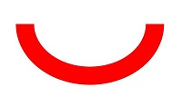
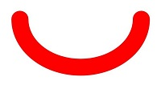

# Enums

<!--Kit: ArkGraphics 2D-->
<!--Subsystem: Graphics-->
<!--Owner: @hangmengxin-->
<!--Designer: @wangyanglan-->
<!--Tester: @nobuggers-->
<!--Adviser: @ge-yafang-->

> **NOTE**
>
> - The initial APIs of this module are supported since API version 11. Newly added APIs will be marked with a superscript to indicate their earliest API version.
>
> - This module uses the physical pixel unit, px.
>
> - The module operates under a single-threaded model. The caller needs to manage thread safety and context state transitions.

## BlendMode

Enumerates the blend modes. A blend mode combines two colors (source color and destination color) in a specific way to create a new color. This is commonly used in graphics operations like overlaying, filtering, and masking. The blending process applies the same logic to the red, green, and blue color channels separately. The alpha channel, however, is handled according to the specific definitions of each blend mode.

For brevity, the following abbreviations are used:

**s**: source. **d**: destination. **sa**: source alpha. **da**: destination alpha.

The following abbreviations are used in the calculation result:

**r**: used when the calculation method is the same for the four channels (alpha, red, green, and blue channels). **ra**: used when only the alpha channel is manipulated. **rc**: used when the other three color channels are manipulated.

The table below shows the effect of each blend mode, where the yellow rectangle is the source and the blue circle is the destination.

**System capability**: SystemCapability.Graphics.Drawing

| Name       | Value  | Description                                                        | Diagram  |
| ----------- | ---- | ------------------------------------------------------------ | -------- |
| CLEAR       | 0    | r = 0, sets the destination pixels to fully transparent.                               | |
| SRC         | 1    | r = s (all channels of the result equal those of the source), replaces the destination pixels with the source pixels.| |
| DST         | 2    | r = d (all channels of the result equal those of the destination), keeps the destination pixels unchanged.| |
| SRC_OVER    | 3    | r = s + (1 - sa) * d, draws the source pixels over the destination pixels, considering the source's transparency.| |
| DST_OVER    | 4    | r = d + (1 - da) * s, draws the destination pixels over the source pixels, considering the destination's transparency.| |
| SRC_IN      | 5    | r = s * da, retains only the intersection of the source pixels with the opaque parts of the destination.| |
| DST_IN      | 6    | r = d * sa, retains only the intersection of the destination pixels with the opaque parts of the source.| |
| SRC_OUT     | 7    | r = s * (1 - da), retains the parts of the source pixels that do not overlap with the destination.| |
| DST_OUT     | 8    | r = d * (1 - sa), retains the parts of the destination pixels that do not overlap with the source.| |
| SRC_ATOP    | 9    | r = s * da + d * (1 - sa), covers the destination pixels with the source pixels, showing the source only in the opaque parts of the destination.| |
| DST_ATOP    | 10   | r = d * sa + s * (1 - da), covers the source pixels with the destination pixels, showing the destination only in the opaque parts of the source.| |
| XOR         | 11   | r = s * (1 - da) + d * (1 - sa), shows only the non-overlapping parts of the source and destination pixels.| |
| PLUS        | 12   | r = min(s + d, 1), adds the color values of the source and destination pixels.                  | |
| MODULATE    | 13   | r = s * d, multiplies the color values of the source and destination pixels.                          | |
| SCREEN      | 14   | r = s + d - s * d, inverts the color values of the source and destination pixels, multiplies them, and then inverts the result, typically producing a brighter outcome.| |
| OVERLAY     | 15   | Selectively applies **MULTIPLY** or **SCREEN** based on the brightness of the destination pixels, enhancing contrast.| |
| DARKEN      | 16   | rc = s + d - max(s * da, d * sa), ra = s + (1 - sa) * d, takes the darker color values between the source and destination pixels.| |
| LIGHTEN     | 17   | rc = s + d - min(s * da, d * sa), ra = s + (1 - sa) * d, takes the lighter color values between the source and destination pixels.| |
| COLOR_DODGE | 18   | Brightens the destination pixels by reducing contrast to reflect the source pixels.          | |
| COLOR_BURN  | 19   | Darkens the destination pixels by increasing contrast to reflect the source pixels.          | |
| HARD_LIGHT  | 20   | Selectively applies **MULTIPLY** or **SCREEN** based on the brightness of the source pixels.   | |
| SOFT_LIGHT  | 21   | Softly brightens or darkens the destination pixels based on the brightness of the source pixels.            | |
| DIFFERENCE  | 22   | rc = s + d - 2 * (min(s * da, d * sa)), ra = s + (1 - sa) * d, calculates the difference between the color values of the source and destination pixels.| |
| EXCLUSION   | 23   | rc = s + d - two(s * d), ra = s + (1 - sa) * d, similar to **DIFFERENCE** but with lower contrast.| |
| MULTIPLY    | 24   | r = s * (1 - da) + d * (1 - sa) + s * d, multiplies the color values of the source and destination pixels, typically resulting in a darker outcome.| |
| HUE         | 25   | Uses the hue of the source pixels and the saturation and brightness of the destination pixels.              | |
| SATURATION  | 26   | Uses the saturation of the source pixels and the hue and brightness of the destination pixels.            | |
| COLOR       | 27   | Uses the hue and saturation of the source pixels and the brightness of the destination pixels.              | |
| LUMINOSITY  | 28   | Uses the brightness of the source pixels and the hue and saturation of the destination pixels.              | |

## PathMeasureMatrixFlags12+

Enumerates the dimensions of matrix information in path measurement. It is often used in animation scenarios where objects move along a path.

**System capability**: SystemCapability.Graphics.Drawing

| Name       | Value  | Description                                                        |
| ----------- | ---- | ------------------------------------------------------------ |
| GET_POSITION_MATRIX        | 0    | Matrix corresponding to the position information.                                           |
| GET_TANGENT_MATRIX          | 1    | Matrix corresponding to the tangent information.|
| GET_POSITION_AND_TANGENT_MATRIX    | 2     | Matrix corresponding to the position and tangent information.|

## SrcRectConstraint12+

Enumerates the constraints on the source rectangle. It is used to specify whether to limit the sampling range within the source rectangle when drawing an image on a canvas.

**System capability**: SystemCapability.Graphics.Drawing

| Name       | Value  | Description                                                        |
| ----------- | ---- | ------------------------------------------------------------ |
| STRICT         | 0    | The sampling range is strictly confined to the source rectangle, resulting in a slow sampling speed.                                           |
| FAST           | 1    | The sampling range is not limited to the source rectangle and can extend beyond it, allowing for a high sampling speed.|

## ShadowFlag12+

Enumerates the shadow drawing behaviors.

**System capability**: SystemCapability.Graphics.Drawing

| Name                        | Value   | Description                |
| -------------------------- | ---- | ------------------ |
| NONE      | 0    | No shadow effect is used.       |
| TRANSPARENT_OCCLUDER | 1    | The occluder is translucent.        |
| GEOMETRIC_ONLY    | 2    | Only the geometric shadow effect is used.       |
| ALL           | 3    | Shadow effects are combined, including the translucent occluder and geometric shadow.|

## PathOp12+

Enumerates the path operation types. It is often used in path combination and clipping scenarios.

**System capability**: SystemCapability.Graphics.Drawing

| Name                  | Value  | Description                          |
| ---------------------- | ---- | ------------------------------ |
| DIFFERENCE     | 0    | Difference operation.|
| INTERSECT    | 1    | Intersection operation.|
| UNION    | 2    | Union operation.|
| XOR     | 3    | XOR operation.|
| REVERSE_DIFFERENCE     | 4    | Reverse difference operation.|

## PathIteratorVerb18+

Enumerates the path operation types contained in an iterator. It is used to read path operation instructions.

**System capability**: SystemCapability.Graphics.Drawing

| Name | Value  | Description                          |
| ----- | ---- | ------------------------------ |
| MOVE  | 0    | Sets the start point.|
| LINE  | 1    | Adds a line segment.|
| QUAD  | 2    | Adds a quadratic Bezier curve for smooth transitions.|
| CONIC | 3    | Adds a conic curve.|
| CUBIC | 4    | Adds a cubic Bezier curve for smooth transitions.|
| CLOSE | 5    | Closes a path.|
| DONE  | CLOSE + 1    | The path setting is complete.|

## TextEncoding

Enumerates the text encoding types.

**System capability**: SystemCapability.Graphics.Drawing

| Name                  | Value  | Description                          |
| ---------------------- | ---- | ------------------------------ |
| TEXT_ENCODING_UTF8     | 0    | One byte is used to indicate UTF-8 or ASCII characters. |
| TEXT_ENCODING_UTF16    | 1    | Two bytes are used to indicate most Unicode characters.|
| TEXT_ENCODING_UTF32    | 2    | Four bytes are used to indicate all Unicode characters.  |
| TEXT_ENCODING_GLYPH_ID | 3    | Two bytes are used to indicate the glyph index.  |

## ClipOp12+

Enumerates the canvas clipping modes.

**System capability**: SystemCapability.Graphics.Drawing

| Name                | Value   | Description          | Diagram  |
| ------------------ | ---- | ---------------- | -------- |
| DIFFERENCE | 0    | Clips a specified area. That is, the difference set is obtained.|  |
| INTERSECT  | 1    | Retains a specified area. That is, the intersection is obtained.| |

> **NOTE**
>
> The diagrams show the result of cropping a circle based on different enumerated values after a rectangle is cropped in INTERSECT mode. The green area is the final area obtained.

## FilterMode12+

Enumerates the filter modes.

**System capability**: SystemCapability.Graphics.Drawing

| Name                 | Value   | Description     |
| ------------------- | ---- | ------- |
| FILTER_MODE_NEAREST | 0    | Nearest filter mode.|
| FILTER_MODE_LINEAR  | 1    | Linear filter mode.|

## PathDirection12+

Enumerates the directions of a closed contour.

**System capability**: SystemCapability.Graphics.Drawing

| Name                 | Value   | Description     |
| ------------------- | ---- | ------- |
| CLOCKWISE   | 0    | Adds a closed contour clockwise.|
| COUNTER_CLOCKWISE  | 1    | Adds a closed contour counterclockwise.|

## PathFillType12+

Enumerates the fill types of a path.

**System capability**: SystemCapability.Graphics.Drawing

| Name                 | Value   | Description     |
| ------------------- | ---- | ------- |
| WINDING   | 0    | Specifies that "inside" is computed by a non-zero sum of signed edge crossings. Specifically, draws a point and emits a ray in any direction. A count is used to record the number of intersection points of the ray and path, and the initial count is 0. When encountering a clockwise intersection point (the path passes from the left to the right of the ray), the count increases by 1. When encountering a counterclockwise intersection point (the path passes from the right to the left of the ray), the count decreases by 1. If the final count is not 0, the point is inside the path and needs to be colored. If the final count is 0, the point is not colored.|
| EVEN_ODD  | 1    | Specifies that "inside" is computed by an odd number of edge crossings. Specifically, draws a point and emits a ray in any direction. If the number of intersection points of the ray and path is an odd number, the point is considered to be inside the path and needs to be colored. If the number is an even number, the point is not colored.|
| INVERSE_WINDING  | 2    | Same as **WINDING**, but draws outside of the path, rather than inside.|
| INVERSE_EVEN_ODD  | 3    | Same as **EVEN_ODD**, but draws outside of the path, rather than inside.|

> **NOTE** 
>  
> As shown in the above figure, the path is a circle, the arrow indicates the path direction, **p** is any point "inside" the path, the blue line is the ray emitted from **p**, and the black arrow indicates the fill result using blue under the corresponding fill type. Under the **WINDING** fill rule, the number of intersection points of the ray and path is 2 (not 0), and therefore **p** is colored. Under the **EVEN_ODD** filling rule, the number of intersection points of the ray and path is 2 (an even number), and therefore **p** is not colored.

## PointMode12+

Enumerates the modes for drawing multiple points in an array.

**System capability**: SystemCapability.Graphics.Drawing

| Name                | Value   | Description           |
| ------------------ | ---- | ------------- |
| POINTS  | 0    | Draws each point separately.     |
| LINES   | 1    | Draws every two points as a line segment.   |
| POLYGON | 2    | Draws an array of points as an open polygon.|

## FontEdging12+

Enumerates the font edging types.

**System capability**: SystemCapability.Graphics.Drawing

| Name                 | Value   | Description     |
| ------------------- | ---- | ------- |
| ALIAS | 0    | No anti-aliasing processing is used.|
| ANTI_ALIAS  | 1    | Uses anti-aliasing to smooth the jagged edges.|
| SUBPIXEL_ANTI_ALIAS  | 2    | Uses sub-pixel anti-aliasing to provide a smoother effect for jagged edges.|

## FontHinting12+

Enumerates the font hinting types.

**System capability**: SystemCapability.Graphics.Drawing

| Name                 | Value   | Description     |
| ------------------- | ---- | ------- |
| NONE    | 0    | No font hinting is used.|
| SLIGHT  | 1    | Slight font hinting is used to improve contrast.|
| NORMAL  | 2    | Normal font hinting is used to improve contrast.|
| FULL    | 3    | Full font hinting is used to improve contrast.|

## FontMetricsFlags12+

Enumerates the font measurement flags, which is used to specify whether a field in the [FontMetrics](arkts-apis-graphics-drawing-i.md#fontmetrics) struct is valid.

**System capability**: SystemCapability.Graphics.Drawing

| Name                         | Value       | Description                          |
| ----------------------------- | --------- | ------------------------------ |
| UNDERLINE_THICKNESS_VALID     | 1 << 0    | The **underlineThickness** field is valid.   |
| UNDERLINE_POSITION_VALID      | 1 << 1    | The **underlinePosition** field is valid. |
| STRIKETHROUGH_THICKNESS_VALID | 1 << 2    | The **strikethroughThickness** field is valid.|
| STRIKETHROUGH_POSITION_VALID  | 1 << 3    | The **strikethroughPosition** field is valid. |
| BOUNDS_INVALID                | 1 << 4    | The boundary measurement values (such as **top**, **bottom**, **xMin**, and **xMax**) are invalid. |

## RectType12+

Enumerates the types of rectangles used to fill the lattices. Used only in [Lattice](arkts-apis-graphics-drawing-Lattice.md).

**System capability**: SystemCapability.Graphics.Drawing

| Name        | Value  | Description                                                            |
| ------------ | ---- | --------------------------------------------------------------- |
| DEFAULT      | 0    | Draws an image into the lattice.                                         |
| TRANSPARENT  | 1    | Sets the lattice to transparent.                                         |
| FIXEDCOLOR   | 2    | Draws the colors in the **fColors** array in [Lattice](arkts-apis-graphics-drawing-Lattice.md) into a lattice.      |

## PathDashStyle18+

Enumerates the drawing styles for path effects.

**System capability**: SystemCapability.Graphics.Drawing

| Name  | Value| Description              |
| ------ | - | ------------------ |
| TRANSLATE | 0 | Translates only, not rotating with the path.|
| ROTATE  | 1 | Rotates with the path.|
| MORPH  | 2 | Rotates with the path and stretches or compresses at turns to enhance smoothness.|

## TileMode12+

Enumerates the tile modes of the shader effect.

**System capability**: SystemCapability.Graphics.Drawing

| Name                  | Value  | Description                          |
| ---------------------- | ---- | ------------------------------ |
| CLAMP     | 0    | Replicates the edge color if the shader effect draws outside of its original boundary.|
| REPEAT    | 1    | Repeats the shader effect in both horizontal and vertical directions.|
| MIRROR    | 2    | Repeats the shader effect in both horizontal and vertical directions, alternating mirror images.|
| DECAL     | 3    | Renders the shader effect only within the original boundary.|

## JoinStyle12+

Enumerates the join styles of a pen. The join style defines the shape of the joints of a polyline segment drawn by the pen.

**System capability**: SystemCapability.Graphics.Drawing

| Name       | Value  | Description                                                        | Diagram  |
| ----------- | ---- | ----------------------------------------------------------- | -------- |
| MITER_JOIN | 0    | Mitered corner. If the angle of a polyline is small, its miter length may be inappropriate. In this case, you need to use the miter limit to limit the miter length.| |
| ROUND_JOIN | 1    | Round corner.| |
| BEVEL_JOIN | 2    | Beveled corner.| |

## CapStyle12+

Enumerates the cap styles of a pen. The cap style defines the style of both ends of a line segment drawn by the pen.

**System capability**: SystemCapability.Graphics.Drawing

| Name       | Value  | Description                                                        | Diagram  |
| ---------- | ---- | ----------------------------------------------------------- | -------- |
| FLAT_CAP   | 0    | There is no cap style. Both ends of the line segment are cut off square.| |
| SQUARE_CAP | 1    | Square cap style. Both ends have a square, the height of which is half of the width of the line segment, with the same width.| |
| ROUND_CAP  | 2    | Round cap style. Both ends have a semicircle centered, the diameter of which is the same as the width of the line segment.| |

## BlurType12+

Enumerates the blur types of a mask filter.

**System capability**: SystemCapability.Graphics.Drawing

| Name  | Value| Description              | Diagram  |
| ------ | - | ------------------ | -------- |
| NORMAL | 0 | Both the outer edges and the inner solid parts are blurred.| |
| SOLID  | 1 | The inner solid part remains unchanged, while only the outer edges are blurred.| |
| OUTER  | 2 | Only the outer edges are blurred, with the inner solid part being fully transparent.| |
| INNER  | 3 | Only the inner solid part is blurred, while the outer edges remain sharp.| |

## ScaleToFit12+

Enumerates the modes of scaling a source rectangle into a destination rectangle.

**System capability**: SystemCapability.Graphics.Drawing

| Name                  | Value  | Description                          |
| ---------------------- | ---- | ------------------------------ |
| FILL_SCALE_TO_FIT     | 0    | Scales the source rectangle to completely fill the destination rectangle, potentially changing the aspect ratio of the source rectangle. |
| START_SCALE_TO_FIT    | 1    | Scales the source rectangle, preserving its aspect ratio, to align it to the upper left corner of the destination rectangle.|
| CENTER_SCALE_TO_FIT    | 2    | Scales the source rectangle, preserving its aspect ratio, to align it to the center of the destination rectangle.  |
| END_SCALE_TO_FIT | 3    | Scales the source rectangle, preserving its aspect ratio, to align it to the lower right corner of the destination rectangle.  |

## RegionOp12+

Enumerates the operations for combining two regions.

**System capability**: SystemCapability.Graphics.Drawing

| Name                  | Value  | Description                          | Diagram  |
| --------------------- | ---- | ------------------------------ | -------- |
| DIFFERENCE         | 0    | Difference operation. | |
| INTERSECT          | 1    | Intersect operation.| |
| UNION              | 2    | Union operation.  | |
| XOR                | 3    | XOR operation.  | |
| REVERSE_DIFFERENCE | 4    | Reverse difference operation.  | |
| REPLACE            | 5    | Replace operation.  | |

> **NOTE**
>
> The schematic diagram shows the result obtained by combining a red region with a blue region at different operation mode. The green region is the region obtained.

## CornerPos12+

Enumerates the corner positions of a rounded rectangle.

**System capability**: SystemCapability.Graphics.Drawing

| Name                  | Value  | Description                          |
| --------------------- | ---- | ------------------------------ | 
| TOP_LEFT_POS          | 0    | Top left corner of the rounded rectangle. |
| TOP_RIGHT_POS         | 1    | Top right corner of the rounded rectangle.|
| BOTTOM_RIGHT_POS      | 2    | Bottom right corner of the rounded rectangle.  |
| BOTTOM_LEFT_POS       | 3    | Bottom left corner of the rounded rectangle.  |
