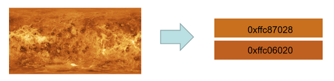
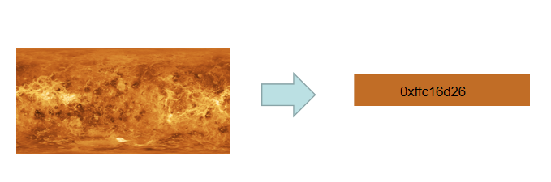
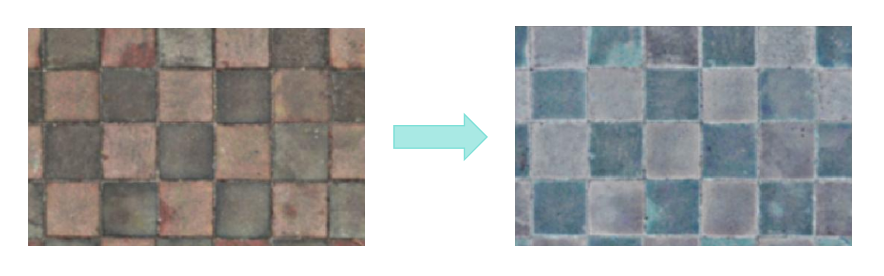
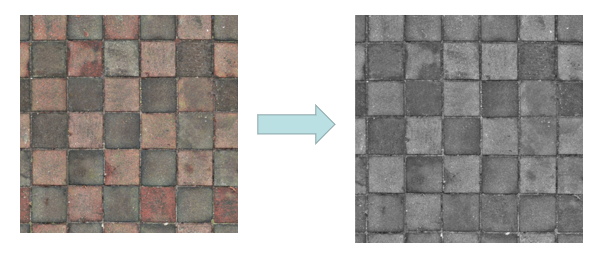

# @ohos.effectKit (Image Effects)

The **EffectKit** module provides basic image processing capabilities, including brightness adjustment, blurring, grayscale adjustment, and color picker.

This module provides the following classes:

- [Filter](#filter): a class that adds a specified effect to the image source.
- [Color](#color): a class used to store the color picked.
- [ColorPicker](#colorpicker): a smart color picker.

> **NOTE**
> 
> The initial APIs of this module are supported since API version 9. Newly added APIs will be marked with a superscript to indicate their earliest API version.

## Modules to Import

```ts
import { effectKit } from "@kit.ArkGraphics2D";
```

## effectKit.createEffect
createEffect(source: image.PixelMap): Filter

Creates a **Filter** instance based on a pixel map.

**Widget capability**: This API can be used in ArkTS widgets since API version 12.

**Atomic service API**: This API can be used in atomic services since API version 12.

**System capability**: SystemCapability.Multimedia.Image.Core

**Parameters**

| Name   | Type              | Mandatory | Description    |
| ------- | ----------------- | ---- | -------- |
| source  | [image.PixelMap](../apis-image-kit/js-apis-image.md#pixelmap7) | Yes  | **PixelMap** instance created by the image module. An instance can be obtained by decoding an image or directly created. For details, see [Image Overview](../../media/image/image-overview.md).  |

**Return value**

| Type                            | Description          |
| -------------------------------- | -------------- |
| [Filter](#filter) | Head node of the filter linked list without any effect. If the operation fails, **null** is returned. |

**Example**

```ts
import { image } from "@kit.ImageKit";
import { effectKit } from "@kit.ArkGraphics2D";

const color = new ArrayBuffer(96);
let opts : image.InitializationOptions = {
  editable: true,
  pixelFormat: 3,
  size: {
    height: 4,
    width: 6
  }
}
image.createPixelMap(color, opts).then((pixelMap) => {
  let headFilter = effectKit.createEffect(pixelMap);
})
```

## effectKit.createColorPicker

createColorPicker(source: image.PixelMap): Promise\<ColorPicker>

Creates a **ColorPicker** instance based on a pixel map. This API uses a promise to return the result.

**Widget capability**: This API can be used in ArkTS widgets since API version 12.

**Atomic service API**: This API can be used in atomic services since API version 12.

**System capability**: SystemCapability.Multimedia.Image.Core

**Parameters**

| Name    | Type        | Mandatory | Description                      |
| -------- | ----------- | ---- | -------------------------- |
| source   | [image.PixelMap](../apis-image-kit/js-apis-image.md#pixelmap7) | Yes  |  **PixelMap** instance created by the image module. An instance can be obtained by decoding an image or directly created. For details, see [Image Overview](../../media/image/image-overview.md). |

**Return value**

| Type                  | Description          |
| ---------------------- | -------------- |
| Promise\<[ColorPicker](#colorpicker)>  | Promise used to return the **ColorPicker** instance created. |

**Error codes**

For details about the error codes, see [Universal Error Codes](../errorcode-universal.md).

| ID | Error Message                       |
| -------- | ------------------------------ |
| 401      | Input parameter error.             |

**Example**

```ts
import { image } from "@kit.ImageKit";
import { effectKit } from "@kit.ArkGraphics2D";
import { BusinessError } from "@kit.BasicServicesKit";

const color = new ArrayBuffer(96);
let opts : image.InitializationOptions = {
  editable: true,
  pixelFormat: 3,
  size: {
    height: 4,
    width: 6
  }
}

image.createPixelMap(color, opts).then((pixelMap) => {
  effectKit.createColorPicker(pixelMap).then(colorPicker => {
    console.info("color picker=" + colorPicker);
  }).catch( (reason : BusinessError) => {
    console.error("error=" + reason.message);
  })
})
```

## effectKit.createColorPicker<sup>10+</sup>

createColorPicker(source: image.PixelMap, region: Array\<number>): Promise\<ColorPicker>

Creates a **ColorPicker** instance for the selected region based on a pixel map. This API uses a promise to return the result.

**Widget capability**: This API can be used in ArkTS widgets since API version 12.

**Atomic service API**: This API can be used in atomic services since API version 12.

**System capability**: SystemCapability.Multimedia.Image.Core

**Parameters**

| Name    | Type        | Mandatory | Description                      |
| -------- | ----------- | ---- | -------------------------- |
| source   | [image.PixelMap](../apis-image-kit/js-apis-image.md#pixelmap7) | Yes  |  **PixelMap** instance created by the image module. An instance can be obtained by decoding an image or directly created. For details, see [Image Overview](../../media/image/image-overview.md). |
| region   | Array\<number> | Yes  |  Region of the image from which the color is picked.<br>The array consists of four elements, representing the left, top, right, and bottom positions of the image, respectively. The value of each element must be in the range [0, 1]. The leftmost and topmost positions of the image correspond to 0, and the rightmost and bottom positions correspond to 1. In the array, the third element must be greater than the first element, and the fourth element must be greater than the second element.|

**Return value**

| Type                  | Description          |
| ---------------------- | -------------- |
| Promise\<[ColorPicker](#colorpicker)>  | Promise used to return the **ColorPicker** instance created. |

**Error codes**

For details about the error codes, see [Universal Error Codes](../errorcode-universal.md).

| ID | Error Message                       |
| -------- | ------------------------------ |
| 401      | Input parameter error.             |

**Example**

```ts
import { image } from "@kit.ImageKit";
import { effectKit } from "@kit.ArkGraphics2D";
import { BusinessError } from "@kit.BasicServicesKit";

const color = new ArrayBuffer(96);
let opts : image.InitializationOptions = {
  editable: true,
  pixelFormat: 3,
  size: {
    height: 4,
    width: 6
  }
}

image.createPixelMap(color, opts).then((pixelMap) => {
  effectKit.createColorPicker(pixelMap, [0, 0, 1, 1]).then(colorPicker => {
    console.info("color picker=" + colorPicker);
  }).catch( (reason : BusinessError) => {
    console.error("error=" + reason.message);
  })
})
```

## effectKit.createColorPicker

createColorPicker(source: image.PixelMap, callback: AsyncCallback\<ColorPicker>): void

Creates a **ColorPicker** instance based on a pixel map. This API uses an asynchronous callback to return the result.

**Widget capability**: This API can be used in ArkTS widgets since API version 12.

**Atomic service API**: This API can be used in atomic services since API version 12.

**System capability**: SystemCapability.Multimedia.Image.Core

**Parameters**

| Name    | Type               | Mandatory | Description                      |
| -------- | ------------------ | ---- | -------------------------- |
| source   | [image.PixelMap](../apis-image-kit/js-apis-image.md#pixelmap7) | Yes |**PixelMap** instance created by the image module. An instance can be obtained by decoding an image or directly created. For details, see [Image Overview](../../media/image/image-overview.md). |
| callback | AsyncCallback\<[ColorPicker](#colorpicker)> | Yes | Callback used to return the **ColorPicker** instance created. |

**Error codes**

For details about the error codes, see [Universal Error Codes](../errorcode-universal.md).

| ID | Error Message                       |
| -------- | ------------------------------ |
| 401      | Input parameter error.             |

**Example**

```ts
import { image } from "@kit.ImageKit";
import { effectKit } from "@kit.ArkGraphics2D";

const color = new ArrayBuffer(96);
let opts : image.InitializationOptions = {
  editable: true,
  pixelFormat: 3,
  size: {
    height: 4,
    width: 6
  }
}
image.createPixelMap(color, opts).then((pixelMap) => {
  effectKit.createColorPicker(pixelMap, (error, colorPicker) => {
    if (error) {
      console.error('Failed to create color picker.');
    } else {
      console.info('Succeeded in creating color picker.');
    }
  })
})
```

## effectKit.createColorPicker<sup>10+</sup>

createColorPicker(source: image.PixelMap, region:Array\<number>, callback: AsyncCallback\<ColorPicker>): void

Creates a **ColorPicker** instance for the selected region based on a pixel map. This API uses an asynchronous callback to return the result.

**Widget capability**: This API can be used in ArkTS widgets since API version 12.

**Atomic service API**: This API can be used in atomic services since API version 12.

**System capability**: SystemCapability.Multimedia.Image.Core

**Parameters**

| Name    | Type               | Mandatory | Description                      |
| -------- | ------------------ | ---- | -------------------------- |
| source   | [image.PixelMap](../apis-image-kit/js-apis-image.md#pixelmap7) | Yes |**PixelMap** instance created by the image module. An instance can be obtained by decoding an image or directly created. For details, see [Image Overview](../../media/image/image-overview.md). |
| region   | Array\<number> | Yes  |  Region of the image from which the color is picked.<br>The array consists of four elements, representing the left, top, right, and bottom positions of the image, respectively. The value of each element must be in the range [0, 1]. The leftmost and topmost positions of the image correspond to 0, and the rightmost and bottom positions correspond to 1. In the array, the third element must be greater than the first element, and the fourth element must be greater than the second element.|
| callback | AsyncCallback\<[ColorPicker](#colorpicker)> | Yes | Callback used to return the **ColorPicker** instance created. |

**Error codes**

For details about the error codes, see [Universal Error Codes](../errorcode-universal.md).

| ID | Error Message                       |
| -------- | ------------------------------ |
| 401      | Input parameter error.             |

**Example**

```ts
import { image } from "@kit.ImageKit";
import { effectKit } from "@kit.ArkGraphics2D";

const color = new ArrayBuffer(96);
let opts : image.InitializationOptions = {
  editable: true,
  pixelFormat: 3,
  size: {
    height: 4,
    width: 6
  }
}
image.createPixelMap(color, opts).then((pixelMap) => {
  effectKit.createColorPicker(pixelMap, [0, 0, 1, 1], (error, colorPicker) => {
    if (error) {
      console.error('Failed to create color picker.');
    } else {
      console.info('Succeeded in creating color picker.');
    }
  })
})
```

## Color

A class that stores the color picked.

**Widget capability**: This API can be used in ArkTS widgets since API version 12.

**Atomic service API**: This API can be used in atomic services since API version 12.

**System capability**: SystemCapability.Multimedia.Image.Core

| Name  | Type  | Readable | Writable | Description             |
| ------ | ----- | ---- | ---- | ---------------- |
| red   | number | Yes  | No  | Value of the red component. The value range is [0x0, 0xFF].          |
| green | number | Yes  | No  | Value of the green component. The value range is [0x0, 0xFF].          |
| blue  | number | Yes  | No  | Value of the blue component. The value range is [0x0, 0xFF].          |
| alpha | number | Yes  | No  | Value of the alpha component. The value range is [0x0, 0xFF].      |

## ColorPicker

A class used to obtain the color from an image. Before calling any method of **ColorPicker**, use [createColorPicker](#effectkitcreatecolorpicker) to create a **ColorPicker** instance.

### getMainColor

getMainColor(): Promise\<Color>

Obtains the main color from the image and writes the result to a [Color](#color) instance. This API uses a promise to return the result.

**Widget capability**: This API can be used in ArkTS widgets since API version 12.

**Atomic service API**: This API can be used in atomic services since API version 12.

**System capability**: SystemCapability.Multimedia.Image.Core

**Return value**

| Type          | Description                                           |
| :------------- | :---------------------------------------------- |
| Promise\<[Color](#color)> | Promise used to return the color value of the main color. If the operation fails, an error message is returned. |

**Example**

```ts
import { image } from "@kit.ImageKit";
import { effectKit } from "@kit.ArkGraphics2D";

const color = new ArrayBuffer(96);
let opts: image.InitializationOptions = {
  editable: true,
  pixelFormat: 3,
  size: {
    height: 4,
    width: 6
  }
}
image.createPixelMap(color, opts).then((pixelMap) => {
  effectKit.createColorPicker(pixelMap, (error, colorPicker) => {
    if (error) {
      console.error('Failed to create color picker.');
     } else {
       console.info('Succeeded in creating color picker.');
       colorPicker.getMainColor().then(color => {
        console.info('Succeeded in getting main color.');
         console.info(`color[ARGB]=${color.alpha},${color.red},${color.green},${color.blue}`);
      })
    }
  })
})
```

### getMainColorSync

getMainColorSync(): Color

Obtains the main color from the image and writes the result to a [Color](#color) instance. This API returns the result synchronously.

**Widget capability**: This API can be used in ArkTS widgets since API version 12.

**Atomic service API**: This API can be used in atomic services since API version 12.

**System capability**: SystemCapability.Multimedia.Image.Core

**Return value**

| Type    | Description                                 |
| :------- | :----------------------------------- |
| [Color](#color)    | Color value of the main color. If the operation fails, **null** is returned. |

**Example**

```ts
import { image } from "@kit.ImageKit";
import { effectKit } from "@kit.ArkGraphics2D";

const color = new ArrayBuffer(96);
let opts : image.InitializationOptions = {
  editable: true,
  pixelFormat: 3,
  size: {
    height: 4,
    width: 6
  }
}
image.createPixelMap(color, opts).then((pixelMap) => {
  effectKit.createColorPicker(pixelMap, (error, colorPicker) => {
    if (error) {
      console.error('Failed to create color picker.');
    } else {
      console.info('Succeeded in creating color picker.');
      let color = colorPicker.getMainColorSync();
      console.info('get main color =' + color);
    }
  })
})
```


### getLargestProportionColor<sup>10+</sup>

getLargestProportionColor(): Color

Obtains the color with the largest proportion from the image and writes the result to a [Color](#color) instance. This API returns the result synchronously.

**Widget capability**: This API can be used in ArkTS widgets since API version 12.

**Atomic service API**: This API can be used in atomic services since API version 12.

**System capability**: SystemCapability.Multimedia.Image.Core

**Return value**

| Type          | Description                                           |
| :------------- | :---------------------------------------------- |
| [Color](#color)       | Color value of the color with the largest proportion. If the operation fails, **null** is returned. |

**Example**

```ts
import { image } from "@kit.ImageKit";
import { effectKit } from "@kit.ArkGraphics2D";

const color = new ArrayBuffer(96);
let opts : image.InitializationOptions = {
  editable: true,
  pixelFormat: 3,
  size: {
    height: 4,
    width: 6
  }
}
image.createPixelMap(color, opts).then((pixelMap) => {
  effectKit.createColorPicker(pixelMap, (error, colorPicker) => {
    if (error) {
      console.error('Failed to create color picker.');
    } else {
      console.info('Succeeded in creating color picker.');
      let color = colorPicker.getLargestProportionColor();
      console.info('get largest proportion color =' + color);
    }
  })
})
```


### getTopProportionColors<sup>12+</sup>

getTopProportionColors(colorCount: number): Array<Color | null>

Obtains a given number of colors with the top proportions in the image. This API returns the result synchronously.

**Widget capability**: This API can be used in ArkTS widgets since API version 12.

**Atomic service API**: This API can be used in atomic services since API version 12.

**System capability**: SystemCapability.Multimedia.Image.Core

**Parameters**
| Name     | Type  | Mandatory | Description             |
| ---------- | ------ | ---- | ------------------------------------------- |
| colorCount | number | Yes  | Number of colors to obtain. The value range is [1, 10]. If a non-integer is passed in, the value will be rounded down.  |

**Return value**

| Type                                    | Description                                           |
| :--------------------------------------- | :---------------------------------------------- |
| Array<[Color](#color) \| null> | Array of colors, sorted by proportion.<br>- If the number of colors obtained is less than the value of **colorCount**, the array size is the actual number obtained.<br>- If the color fails to be obtained, an empty array is returned.<br>- If the value of **colorCount** is less than 1, **[null]** is returned.<br>- If the value of **colorCount** is greater than 10, an array holding the first 10 colors with the top proportions is returned. |

**Example**

```js
import { image } from "@kit.ImageKit";
import { effectKit } from "@kit.ArkGraphics2D";

const color = new ArrayBuffer(96);
let opts : image.InitializationOptions = {
  editable: true,
  pixelFormat: 3,
  size: {
    height: 4,
    width: 6
  }
}
image.createPixelMap(color, opts).then((pixelMap) => {
  effectKit.createColorPicker(pixelMap, (error, colorPicker) => {
    if (error) {
      console.error('Failed to create color picker.');
    } else {
      console.info('Succeeded in creating color picker.');
      let colors = colorPicker.getTopProportionColors(2);
      for(let index = 0; index < colors.length; index++) {
        if (colors[index]) {
          console.info('get top proportion colors: index ' + index + ', color ' + colors[index]);
        }
      }
    }
  })
})
```


### getHighestSaturationColor<sup>10+</sup>

getHighestSaturationColor(): Color

Obtains the color with the highest saturation from the image and writes the result to a [Color](#color) instance. This API returns the result synchronously.

**Widget capability**: This API can be used in ArkTS widgets since API version 12.

**Atomic service API**: This API can be used in atomic services since API version 12.

**System capability**: SystemCapability.Multimedia.Image.Core

**Return value**

| Type          | Description                                           |
| :------------- | :---------------------------------------------- |
| [Color](#color)       | Color value of the color with the highest saturation. If the operation fails, **null** is returned. |

**Example**

```ts
import { image } from "@kit.ImageKit";
import { effectKit } from "@kit.ArkGraphics2D";

const color = new ArrayBuffer(96);
let opts: image.InitializationOptions = {
  editable: true,
  pixelFormat: 3,
  size: {
    height: 4,
    width: 6
  }
}
image.createPixelMap(color, opts).then((pixelMap) => {
  effectKit.createColorPicker(pixelMap, (error, colorPicker) => {
    if (error) {
      console.error('Failed to create color picker.');
    } else {
      console.info('Succeeded in creating color picker.');
      let color = colorPicker.getHighestSaturationColor();
      console.info('get highest saturation color =' + color);
    }
  })
})
```


### getAverageColor<sup>10+</sup>

getAverageColor(): Color

Obtains the average color from the image and writes the result to a [Color](#color) instance. This API returns the result synchronously.

**Widget capability**: This API can be used in ArkTS widgets since API version 12.

**Atomic service API**: This API can be used in atomic services since API version 12.

**System capability**: SystemCapability.Multimedia.Image.Core

**Return value**

| Type          | Description                                           |
| :------------- | :---------------------------------------------- |
| [Color](#color)       | Average color value. If the operation fails, **null** is returned. |

**Example**

```ts
import { image } from "@kit.ImageKit";
import { effectKit } from "@kit.ArkGraphics2D";

const color = new ArrayBuffer(96);
let opts: image.InitializationOptions = {
  editable: true,
  pixelFormat: 3,
  size: {
    height: 4,
    width: 6
  }
}
image.createPixelMap(color, opts).then((pixelMap) => {
  effectKit.createColorPicker(pixelMap, (error, colorPicker) => {
    if (error) {
      console.error('Failed to create color picker.');
    } else {
      console.info('Succeeded in creating color picker.');
      let color = colorPicker.getAverageColor();
      console.info('get average color =' + color);
    }
  })
})
```


### isBlackOrWhiteOrGrayColor<sup>10+</sup>

isBlackOrWhiteOrGrayColor(color: number): boolean

Checks whether a color is black, white, and gray.

**Widget capability**: This API can be used in ArkTS widgets since API version 12.

**Atomic service API**: This API can be used in atomic services since API version 12.

**System capability**: SystemCapability.Multimedia.Image.Core

**Parameters**

| Name    | Type        | Mandatory | Description                      |
| -------- | ----------- | ---- | -------------------------- |
| color| number | Yes  |  Color to check. The value range is [0x0, 0xFFFFFFFF]. |

**Return value**

| Type          | Description                                           |
| :------------- | :---------------------------------------------- |
| boolean              | Returns **true** if the image is black, white, and gray; returns **false** otherwise. |

**Example**

```ts
import { image } from "@kit.ImageKit";
import { effectKit } from "@kit.ArkGraphics2D";

const color = new ArrayBuffer(96);
let opts: image.InitializationOptions = {
  editable: true,
  pixelFormat: 3,
  size: {
    height: 4,
    width: 6
  }
}
image.createPixelMap(color, opts).then((pixelMap) => {
  effectKit.createColorPicker(pixelMap, (error, colorPicker) => {
    if (error) {
      console.error('Failed to create color picker.');
    } else {
      console.info('Succeeded in creating color picker.');
      let bJudge = colorPicker.isBlackOrWhiteOrGrayColor(0xFFFFFFFF);
      console.info('is black or white or gray color[bool](white) =' + bJudge);
    }
  })
})
```

## Filter

A class used to add a specified effect to an image. Before calling any method of **Filter**, use [createEffect](#effectkitcreateeffect) to create a **Filter** instance.

### blur

blur(radius: number): Filter

Adds the blur effect to the filter linked list, and returns the head node of the linked list.

>  **NOTE**
>
>  This API provides the blur effect for static images. To provide the real-time blur effect for components, use [dynamic blur](../../ui/arkts-blur-effect.md).

**Widget capability**: This API can be used in ArkTS widgets since API version 12.

**Atomic service API**: This API can be used in atomic services since API version 12.

**System capability**: SystemCapability.Multimedia.Image.Core

**Parameters**

| Name | Type       | Mandatory | Description                                                        |
| ------ | ----------- | ---- | ------------------------------------------------------------ |
|  radius   | number | Yes  | Blur radius, in pixels. The blur effect is proportional to the configured value. A larger value indicates a more obvious effect. |

**Return value**

| Type          | Description                                           |
| :------------- | :---------------------------------------------- |
| [Filter](#filter) | Final image effect. |

**Example**

```ts
import { image } from "@kit.ImageKit";
import { effectKit } from "@kit.ArkGraphics2D";

const color = new ArrayBuffer(96);
let opts : image.InitializationOptions = {
  editable: true,
  pixelFormat: 3,
  size: {
    height: 4,
    width: 6
  }
};
image.createPixelMap(color, opts).then((pixelMap) => {
  let radius = 5;
  let headFilter = effectKit.createEffect(pixelMap);
  if (headFilter != null) {
    headFilter.blur(radius);
  }
})
```


### invert<sup>12+</sup>

invert(): Filter

Adds the inversion effect to the filter linked list, and returns the head node of the linked list.

**System capability**: SystemCapability.Multimedia.Image.Core

**Return value**

| Type          | Description                                           |
| :------------- | :---------------------------------------------- |
| [Filter](#filter) | Final image effect. |

**Example**

```ts
import { image } from "@kit.ImageKit";
import { effectKit } from "@kit.ArkGraphics2D";

const color = new ArrayBuffer(96);
let opts : image.InitializationOptions = {
  editable: true,
  pixelFormat: 3,
  size: {
    height: 4,
    width: 6
  }
};
image.createPixelMap(color, opts).then((pixelMap) => {
  let headFilter = effectKit.createEffect(pixelMap);
  if (headFilter != null) {
    headFilter.invert();
  }
})
```


### setColorMatrix<sup>12+</sup>

setColorMatrix(colorMatrix: Array\<number>): Filter

Adds a custom effect to the filter linked list, and returns the head node of the linked list.

**System capability**: SystemCapability.Multimedia.Image.Core

**Parameters**

| Name | Type       | Mandatory | Description                                                        |
| ------ | ----------- | ---- | ------------------------------------------------------------ |
|  colorMatrix  |   Array\<number> | Yes  | Custom color matrix.<br>A 5 x 4 matrix can be created. The value range of the matrix element is [0, 1], where **0** indicates that the color channel is not involved in the calculation, and **1** indicates that the color channel is involved in the calculation and retains the original weight. |

**Return value**

| Type          | Description                                           |
| :------------- | :---------------------------------------------- |
| [Filter](#filter) | Final image effect. |

**Error codes**

For details about the error codes, see [Universal Error Codes](../errorcode-universal.md).

| ID | Error Message                       |
| -------- | ------------------------------ |
| 401      | Input parameter error.             |

**Example**

```ts
import { image } from "@kit.ImageKit";
import { effectKit } from "@kit.ArkGraphics2D";

const color = new ArrayBuffer(96);
let opts : image.InitializationOptions = {
  editable: true,
  pixelFormat: 3,
  size: {
    height: 4,
    width: 6
  }
};
image.createPixelMap(color, opts).then((pixelMap) => {
  let colorMatrix:Array<number> = [
    0.2126,0.7152,0.0722,0,0,
    0.2126,0.7152,0.0722,0,0,
    0.2126,0.7152,0.0722,0,0,
    0,0,0,1,0
  ];
  let headFilter = effectKit.createEffect(pixelMap);
  if (headFilter != null) {
    headFilter.setColorMatrix(colorMatrix);
  }
})
```

### brightness

brightness(bright: number): Filter

Adds the brightness effect to the filter linked list, and returns the head node of the linked list.

**Widget capability**: This API can be used in ArkTS widgets since API version 12.

**Atomic service API**: This API can be used in atomic services since API version 12.

**System capability**: SystemCapability.Multimedia.Image.Core

**Parameters**

| Name | Type       | Mandatory | Description                                                        |
| ------ | ----------- | ---- | ------------------------------------------------------------ |
|  bright   | number | Yes  | Brightness value, ranging from 0 to 1. When the value is **0**, the image brightness remains unchanged. |

**Return value**

| Type          | Description                                           |
| :------------- | :---------------------------------------------- |
| [Filter](#filter) | Final image effect. |

**Example**

```ts
import { image } from "@kit.ImageKit";
import { effectKit } from "@kit.ArkGraphics2D";

const color = new ArrayBuffer(96);
let opts : image.InitializationOptions = {
  editable: true,
  pixelFormat: 3,
  size: {
    height: 4,
    width: 6
  }
};
image.createPixelMap(color, opts).then((pixelMap) => {
  let bright = 0.5;
  let headFilter = effectKit.createEffect(pixelMap);
  if (headFilter != null) {
    headFilter.brightness(bright);
  }
})
```


### grayscale

grayscale(): Filter

Adds the grayscale effect to the filter linked list, and returns the head node of the linked list.

**Widget capability**: This API can be used in ArkTS widgets since API version 12.

**Atomic service API**: This API can be used in atomic services since API version 12.

**System capability**: SystemCapability.Multimedia.Image.Core

**Return value**

| Type          | Description                                           |
| :------------- | :---------------------------------------------- |
| [Filter](#filter) | Final image effect. |

**Example**

```ts
import { image } from "@kit.ImageKit";
import { effectKit } from "@kit.ArkGraphics2D";

const color = new ArrayBuffer(96);
let opts : image.InitializationOptions = {
  editable: true,
  pixelFormat: 3,
  size: {
    height: 4,
    width: 6
  }
};
image.createPixelMap(color, opts).then((pixelMap) => {
  let headFilter = effectKit.createEffect(pixelMap);
  if (headFilter != null) {
    headFilter.grayscale();
  }
})
```


### getEffectPixelMap<sup>11+</sup>

getEffectPixelMap(): Promise<image.PixelMap>

Obtains **image.PixelMap** of the source image to which the filter linked list is added. This API uses a promise to return the result.

**Widget capability**: This API can be used in ArkTS widgets since API version 12.

**Atomic service API**: This API can be used in atomic services since API version 12.

**System capability**: SystemCapability.Multimedia.Image.Core

**Return value**

| Type                  | Description          |
| ---------------------- | -------------- |
| Promise\<image.PixelMap>  | Promise used to return **image.PixelMap** of the source image. |


**Example**

```ts
import { image } from "@kit.ImageKit";
import { effectKit } from "@kit.ArkGraphics2D";

const color = new ArrayBuffer(96);
let opts : image.InitializationOptions = {
  editable: true,
  pixelFormat: 3,
  size: {
    height: 4,
    width: 6
  }
};
image.createPixelMap(color, opts).then((pixelMap) => {
  effectKit.createEffect(pixelMap).grayscale().getEffectPixelMap().then(data => {
    console.info('getPixelBytesNumber = ', data.getPixelBytesNumber());
  })
})
```

### getPixelMap<sup>(deprecated)</sup>

getPixelMap(): image.PixelMap

Obtains **image.PixelMap** of the source image to which the filter linked list is added.

> **NOTE**
>
> This API is supported since API version 9 and deprecated since API version 11. You are advised to use [getEffectPixelMap](#geteffectpixelmap11) instead.

**System capability**: SystemCapability.Multimedia.Image.Core

**Return value**

| Type          | Description                                           |
| :------------- | :---------------------------------------------- |
| [image.PixelMap](../apis-image-kit/js-apis-image.md#pixelmap7) | **image.PixelMap** of the source image. |

**Example**

```ts
import { image } from "@kit.ImageKit";
import { effectKit } from "@kit.ArkGraphics2D";

const color = new ArrayBuffer(96);
let opts : image.InitializationOptions = {
  editable: true,
  pixelFormat: 3,
  size: {
    height: 4,
    width: 6
  }
};
image.createPixelMap(color, opts).then((pixelMap) => {
  let pixel = effectKit.createEffect(pixelMap).grayscale().getPixelMap();
  console.info('getPixelBytesNumber = ', pixel.getPixelBytesNumber());
})
```
