# @ohos.graphics.drawing (Drawing)

The Drawing module provides basic drawing capabilities, such as drawing rectangles, circles, points, straight lines, custom paths, and fonts.

> **NOTE**
>
> - The initial APIs of this module are supported since API version 11. Newly added APIs will be marked with a superscript to indicate their earliest API version.
>
> - This module uses the physical pixel unit, px.

## Modules to Import

```ts
import { drawing } from '@kit.ArkGraphics2D';
```

## BlendMode

Enumerates the blend modes. In blend mode, each operation generates a new color from two colors (source color and target color). These operations are the same on the four channels (red, green, blue, and alpha). The operations for the alpha channel are used as examples.

For brevity, the following abbreviations are used:

**s**: source. **d**: destination. **sa**: source alpha. **da**: destination alpha.

The following abbreviations are used in the calculation result:

**r**: The calculation methods of the four channels are the same. **ra**: Only the alpha channel is manipulated. **rc**: The other three color channels are manipulated.

The table below shows the effect of each blend mode, where the yellow rectangle is the source and the blue circle is the destination.

**System capability**: SystemCapability.Graphics.Drawing

| Name       | Value  | Description                                                        | Diagram  |
| ----------- | ---- | ------------------------------------------------------------ | -------- |
| CLEAR       | 0    | Clear mode. r = 0.                                           | 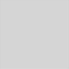 |
| SRC         | 1    | r = s (The four channels of **result** are equal to the four channels of **source**, that is, the result is equal to the source.)|  |
| DST         | 2    | r = d (The four channels of **result** are equal to the four channels of **destination**, that is, the result is equal to the destination.)| 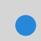 |
| SRC_OVER    | 3    | r = s + (1 - sa) * d                                         |  |
| DST_OVER    | 4    | r = d + (1 - da) * s                                         |  |
| SRC_IN      | 5    | r = s * da                                                   |  |
| DST_IN      | 6    | r = d * sa                                                   |  |
| SRC_OUT     | 7    | r = s * (1 - da)                                             |  |
| DST_OUT     | 8    | r = d * (1 - sa)                                             |  |
| SRC_ATOP    | 9    | r = s * da + d * (1 - sa)                                    | 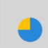 |
| DST_ATOP    | 10   | r = d * sa + s * (1 - da)                                    |  |
| XOR         | 11   | r = s * (1 - da) + d * (1 - sa)                              |  |
| PLUS        | 12   | r = min(s + d, 1)                                            |  |
| MODULATE    | 13   | r = s * d                                                    |  |
| SCREEN      | 14   | Screen mode. r = s + d - s * d                                  | 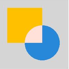 |
| OVERLAY     | 15   | Overlay mode.                                                    |  |
| DARKEN      | 16   | Darken mode. rc = s + d - max(s * da, d * sa), ra = s + (1 - sa) * d | 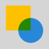 |
| LIGHTEN     | 17   | Lighten mode. rc = rc = s + d - min(s * da, d * sa), ra = s + (1 - sa) * d | 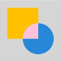 |
| COLOR_DODGE | 18   | Color dodge mode.                                                | 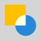 |
| COLOR_BURN  | 19   | Color burn mode.                                                | 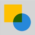 |
| HARD_LIGHT  | 20   | Hard light mode.                                                    |  |
| SOFT_LIGHT  | 21   | Soft light mode.                                                    |  |
| DIFFERENCE  | 22   | Difference mode. rc = s + d - 2 * (min(s * da, d * sa)), ra = s + (1 - sa) * d | 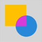 |
| EXCLUSION   | 23   | Exclusion mode. rc = s + d - two(s * d), ra = s + (1 - sa) * d     | 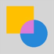 |
| MULTIPLY    | 24   | Multiply mode. r = s * (1 - da) + d * (1 - sa) + s * d            | 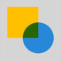 |
| HUE         | 25   | Hue mode.                                                    | 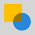 |
| SATURATION  | 26   | Saturation mode.                                                  |  |
| COLOR       | 27   | Color mode.                                                    |  |
| LUMINOSITY  | 28   | Luminosity mode.                                                    | 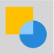 |

## PathMeasureMatrixFlags<sup>12+</sup>

Enumerates the types of matrix information obtained during path measurement.

**System capability**: SystemCapability.Graphics.Drawing

| Name       | Value  | Description                                                        |
| ----------- | ---- | ------------------------------------------------------------ |
| GET_POSITION_MATRIX        | 0    | Matrix corresponding to the position information.                                           |
| GET_TANGENT_MATRIX          | 1    | Matrix corresponding to the tangent information.|
| GET_POSITION_AND_TANGENT_MATRIX    | 2     | Matrix corresponding to the position and tangent information.|

## SrcRectConstraint<sup>12+</sup>

Enumerates the constraint types of the source rectangle.

**System capability**: SystemCapability.Graphics.Drawing

| Name       | Value  | Description                                                        |
| ----------- | ---- | ------------------------------------------------------------ |
| STRICT         | 0    | The sampling range is strictly confined to the source rectangle, resulting in a slow sampling speed.                                           |
| FAST           | 1    | The sampling range is not limited to the source rectangle and can extend beyond it, allowing for a high sampling speed.|

## ShadowFlag<sup>12+</sup>

Enumerates the flags used to control shadow drawing to create various shadow effects.

**System capability**: SystemCapability.Graphics.Drawing

| Name                        | Value   | Description                |
| -------------------------- | ---- | ------------------ |
| NONE      | 0    | None of the flags are enabled.       |
| TRANSPARENT_OCCLUDER | 1    | The occluder is transparent.        |
| GEOMETRIC_ONLY    | 2    | Only the geometric shadow effect is used.       |
| ALL           | 3    | All the flags are enabled.|

## PathOp<sup>12+</sup>

Enumerates the operation modes available for a path.

**System capability**: SystemCapability.Graphics.Drawing

| Name                  | Value  | Description                          |
| ---------------------- | ---- | ------------------------------ |
| DIFFERENCE     | 0    | Difference operation.|
| INTERSECT    | 1    | Intersection operation.|
| UNION    | 2    | Union operation.|
| XOR     | 3    | XOR operation.|
| REVERSE_DIFFERENCE     | 4    | Reverse difference operation.|

## Path

A compound geometric path consisting of line segments, arcs, quadratic Bezier curves, and cubic Bezier curves.

### constructor<sup>12+</sup>

constructor()

Constructs a path.

**System capability**: SystemCapability.Graphics.Drawing

**Example**

```ts
import { drawing } from '@kit.ArkGraphics2D';
let path: drawing.Path = new drawing.Path();
```

### constructor<sup>12+</sup>

constructor(path: Path)

Constructs a copy of an existing path.

**System capability**: SystemCapability.Graphics.Drawing

**Parameters**

| Name  | Type                                        | Mandatory| Description                           |
| -------- | -------------------------------------------- | ---- | ------------------------------- |
| path | [Path](#path) | Yes  | Path to copy.                |

**Example**

```ts
import { drawing } from '@kit.ArkGraphics2D';
let path: drawing.Path = new drawing.Path();
path.moveTo(0, 0);
path.lineTo(0, 700);
path.lineTo(700, 0);
path.close();
let path1: drawing.Path =  new drawing.Path(path);
```

### moveTo

moveTo(x: number, y: number) : void

Sets the start point of this path.

**System capability**: SystemCapability.Graphics.Drawing

**Parameters**

| Name| Type  | Mandatory| Description                   |
| ------ | ------ | ---- | ----------------------- |
| x      | number | Yes  | X coordinate of the start point. The value is a floating point number.|
| y      | number | Yes  | Y coordinate of the start point. The value is a floating point number.|

**Error codes**

For details about the error codes, see [Universal Error Codes](../errorcode-universal.md).

| ID| Error Message|
| ------- | --------------------------------------------|
| 401 | Parameter error.Possible causes:1.Mandatory parameters are left unspecified;2.Incorrect parameter types. |

**Example**

```ts
import { drawing } from '@kit.ArkGraphics2D';
let path = new drawing.Path();
path.moveTo(10,10);
```

### lineTo

lineTo(x: number, y: number) : void

Draws a line segment from the last point of this path to the target point.

**System capability**: SystemCapability.Graphics.Drawing

**Parameters**

| Name| Type  | Mandatory| Description                   |
| ------ | ------ | ---- | ----------------------- |
| x      | number | Yes  | X coordinate of the target point. The value is a floating point number.|
| y      | number | Yes  | Y coordinate of the target point. The value is a floating point number.|

**Error codes**

For details about the error codes, see [Universal Error Codes](../errorcode-universal.md).

| ID| Error Message|
| ------- | --------------------------------------------|
| 401 | Parameter error.Possible causes:1.Mandatory parameters are left unspecified;2.Incorrect parameter types. |

**Example**

```ts
import { drawing } from '@kit.ArkGraphics2D';
let path = new drawing.Path();
path.moveTo(10,10);
path.lineTo(10, 15);
```

### arcTo

arcTo(x1: number, y1: number, x2: number, y2: number, startDeg: number, sweepDeg: number): void

Draws an arc to this path. This is done by using angle arc mode. In this mode, a rectangle that encloses an ellipse is specified first, and then a start angle and a sweep angle are specified. The arc is a portion of the ellipse defined by the start angle and the sweep angle. By default, a line segment from the last point of the path to the start point of the arc is also added.

**System capability**: SystemCapability.Graphics.Drawing

**Parameters**

| Name  | Type  | Mandatory| Description                      |
| -------- | ------ | ---- | -------------------------- |
| x1       | number | Yes  | X coordinate of the upper left corner of the rectangle. The value is a floating point number.|
| y1       | number | Yes  | Y coordinate of the upper left corner of the rectangle. The value is a floating point number.|
| x2       | number | Yes  | X coordinate of the lower right corner of the rectangle. The value is a floating point number.|
| y2       | number | Yes  | Y coordinate of the lower right corner of the rectangle. The value is a floating point number.|
| startDeg | number | Yes  | Start angle, in degrees. The value is a floating point number.|
| sweepDeg | number | Yes  | Sweep degree. The value is a floating point number.|

**Error codes**

For details about the error codes, see [Universal Error Codes](../errorcode-universal.md).

| ID| Error Message|
| ------- | --------------------------------------------|
| 401 | Parameter error.Possible causes:1.Mandatory parameters are left unspecified;2.Incorrect parameter types. |

**Example**

```ts
import { drawing } from '@kit.ArkGraphics2D';
let path = new drawing.Path();
path.moveTo(10,10);
path.arcTo(10, 15, 10, 10, 10, 10);
```

### quadTo

quadTo(ctrlX: number, ctrlY: number, endX: number, endY: number): void

Draws a quadratic Bezier curve from the last point of this path to the target point.

**System capability**: SystemCapability.Graphics.Drawing

**Parameters**

| Name| Type  | Mandatory| Description                 |
| ------ | ------ | ---- | --------------------- |
| ctrlX  | number | Yes  | X coordinate of the control point. The value is a floating point number.|
| ctrlY  | number | Yes  | Y coordinate of the control point. The value is a floating point number.|
| endX   | number | Yes  | X coordinate of the target point. The value is a floating point number.|
| endY   | number | Yes  | Y coordinate of the target point. The value is a floating point number.|

**Error codes**

For details about the error codes, see [Universal Error Codes](../errorcode-universal.md).

| ID| Error Message|
| ------- | --------------------------------------------|
| 401 | Parameter error.Possible causes:1.Mandatory parameters are left unspecified;2.Incorrect parameter types. |

**Example**

```ts
import { drawing } from '@kit.ArkGraphics2D';
let path = new drawing.Path();
path.moveTo(10,10);
path.quadTo(10, 15, 10, 10);
```

### conicTo<sup>12+</sup>

conicTo(ctrlX: number, ctrlY: number, endX: number, endY: number, weight: number): void

Draws a conic curve from the last point of this path to the target point. If the path is empty, the start point (0, 0) is used.

**System capability**: SystemCapability.Graphics.Drawing

**Parameters**

| Name| Type  | Mandatory| Description                 |
| ------ | ------ | ---- | --------------------- |
| ctrlX  | number | Yes  | X coordinate of the control point. The value is a floating point number.|
| ctrlY  | number | Yes  | Y coordinate of the control point. The value is a floating point number.|
| endX   | number | Yes  | X coordinate of the target point. The value is a floating point number.|
| endY   | number | Yes  | Y coordinate of the target point. The value is a floating point number.|
| weight | number | Yes  | Weight of the curve, which determines its shape. The larger the value, the closer of the curve to the control point. If the value is less than or equal to 0, this API is equivalent to [lineTo](#lineto), that is, adding a line segment from the last point of the path to the target point. If the value is 1, this API is equivalent to [quadTo](#quadto). The value is a floating point number.|

**Error codes**

For details about the error codes, see [Universal Error Codes](../errorcode-universal.md).

| ID| Error Message|
| ------- | --------------------------------------------|
| 401 | Parameter error.Possible causes:1.Mandatory parameters are left unspecified;2.Incorrect parameter types. |

**Example**

```ts
import { drawing } from '@kit.ArkGraphics2D';

const path = new drawing.Path();
path.conicTo(200, 400, 100, 200, 0);
```

### cubicTo

cubicTo(ctrlX1: number, ctrlY1: number, ctrlX2: number, ctrlY2: number, endX: number, endY: number): void

Draws a cubic Bezier curve from the last point of this path to the target point.

**System capability**: SystemCapability.Graphics.Drawing

**Parameters**

| Name| Type  | Mandatory| Description                       |
| ------ | ------ | ---- | --------------------------- |
| ctrlX1 | number | Yes  | X coordinate of the first control point. The value is a floating point number.|
| ctrlY1 | number | Yes  | Y coordinate of the first control point. The value is a floating point number.|
| ctrlX2 | number | Yes  | X coordinate of the second control point. The value is a floating point number.|
| ctrlY2 | number | Yes  | Y coordinate of the second control point. The value is a floating point number.|
| endX   | number | Yes  | X coordinate of the target point. The value is a floating point number.|
| endY   | number | Yes  | Y coordinate of the target point. The value is a floating point number.|

**Error codes**

For details about the error codes, see [Universal Error Codes](../errorcode-universal.md).

| ID| Error Message|
| ------- | --------------------------------------------|
| 401 | Parameter error.Possible causes:1.Mandatory parameters are left unspecified;2.Incorrect parameter types. |

**Example**

```ts
import { drawing } from '@kit.ArkGraphics2D';
let path = new drawing.Path();
path.moveTo(10,10);
path.cubicTo(10, 10, 10, 10, 15, 15);
```

### rMoveTo<sup>12+</sup>

rMoveTo(dx : number, dy : number): void

Sets the start point relative to the last point of this path.

**System capability**: SystemCapability.Graphics.Drawing

**Parameters**

| Name| Type  | Mandatory| Description                   |
| ------ | ------ | ---- | ----------------------- |
| dx     | number | Yes  | X offset of the start point relative to the last point. A positive number indicates a rightward shift from the last point, and a negative number indicates a leftward shift from the last point. The value is a floating point number.|
| dy     | number | Yes  | Y offset of the start point relative to the last point. A positive number indicates an upward shift from the last point, and a negative number indicates a downward shift from the last point. The value is a floating point number.|

**Error codes**

For details about the error codes, see [Universal Error Codes](../errorcode-universal.md).

| ID| Error Message|
| ------- | --------------------------------------------|
| 401 | Parameter error.Possible causes:1.Mandatory parameters are left unspecified;2.Incorrect parameter types. |

**Example**

```ts
import { drawing } from '@kit.ArkGraphics2D';

const path = new drawing.Path();
path.rMoveTo(10, 10);
```

### rLineTo<sup>12+</sup>

rLineTo(dx : number, dy : number): void

Draws a line segment from the last point of this path to a point relative to the last point.

**System capability**: SystemCapability.Graphics.Drawing

**Parameters**

| Name| Type  | Mandatory| Description                   |
| ------ | ------ | ---- | ----------------------- |
| dx     | number | Yes  | X offset of the target point relative to the last point. A positive number indicates a rightward shift from the last point, and a negative number indicates a leftward shift from the last point. The value is a floating point number.|
| dy     | number | Yes  | Y offset of the target point relative to the last point. A positive number indicates an upward shift from the last point, and a negative number indicates a downward shift from the last point. The value is a floating point number.|

**Error codes**

For details about the error codes, see [Universal Error Codes](../errorcode-universal.md).

| ID| Error Message|
| ------- | --------------------------------------------|
| 401 | Parameter error.Possible causes:1.Mandatory parameters are left unspecified;2.Incorrect parameter types. |

**Example**

```ts
import { drawing } from '@kit.ArkGraphics2D';

const path = new drawing.Path();
path.rLineTo(400, 200);
```

### rQuadTo<sup>12+</sup>

rQuadTo(dx1: number, dy1: number, dx2: number, dy2: number): void

Draws a quadratic Bezier curve from the last point of this path to a point relative to the last point.

**System capability**: SystemCapability.Graphics.Drawing

**Parameters**

| Name| Type  | Mandatory| Description                 |
| ------ | ------ | ---- | --------------------- |
| dx1  | number | Yes  | X offset of the control point relative to the last point. A positive number indicates a rightward shift from the last point, and a negative number indicates a leftward shift from the last point. The value is a floating point number.|
| dy1  | number | Yes  | Y offset of the control point relative to the last point. A positive number indicates an upward shift from the last point, and a negative number indicates a downward shift from the last point. The value is a floating point number.|
| dx2   | number | Yes  | X offset of the target point relative to the last point. A positive number indicates a rightward shift from the last point, and a negative number indicates a leftward shift from the last point. The value is a floating point number.|
| dy2   | number | Yes  | Y offset of the target point relative to the last point. A positive number indicates an upward shift from the last point, and a negative number indicates a downward shift from the last point. The value is a floating point number.|

**Error codes**

For details about the error codes, see [Universal Error Codes](../errorcode-universal.md).

| ID| Error Message|
| ------- | --------------------------------------------|
| 401 | Parameter error.Possible causes:1.Mandatory parameters are left unspecified;2.Incorrect parameter types. |

**Example**

```ts
import { drawing } from '@kit.ArkGraphics2D';

const path = new drawing.Path();
path.rQuadTo(100, 0, 0, 200);
```

### rConicTo<sup>12+</sup>

rConicTo(ctrlX: number, ctrlY: number, endX: number, endY: number, weight: number): void

Draws a conic curve from the last point of this path to a point relative to the last point.

**System capability**: SystemCapability.Graphics.Drawing

**Parameters**

| Name| Type  | Mandatory| Description                 |
| ------ | ------ | ---- | --------------------- |
| ctrlX  | number | Yes  | X offset of the control point relative to the last point. A positive number indicates a rightward shift from the last point, and a negative number indicates a leftward shift from the last point. The value is a floating point number.|
| ctrlY  | number | Yes  | Y offset of the control point relative to the last point. A positive number indicates an upward shift from the last point, and a negative number indicates a downward shift from the last point. The value is a floating point number.|
| endX   | number | Yes  | X offset of the target point relative to the last point. A positive number indicates a rightward shift from the last point, and a negative number indicates a leftward shift from the last point. The value is a floating point number.|
| endY   | number | Yes  | Y offset of the target point relative to the last point. A positive number indicates an upward shift from the last point, and a negative number indicates a downward shift from the last point. The value is a floating point number.|
| weight | number | Yes  | Weight of the curve, which determines its shape. The larger the value, the closer of the curve to the control point. If the value is less than or equal to 0, this API is equivalent to [lineTo](#lineto), that is, adding a line segment from the last point of the path to the target point. If the value is 1, this API is equivalent to [quadTo](#quadto). The value is a floating point number.|

**Error codes**

For details about the error codes, see [Universal Error Codes](../errorcode-universal.md).

| ID| Error Message|
| ------- | --------------------------------------------|
| 401 | Parameter error.Possible causes:1.Mandatory parameters are left unspecified;2.Incorrect parameter types. |

**Example**

```ts
import { drawing } from '@kit.ArkGraphics2D';

const path = new drawing.Path();
path.rConicTo(200, 400, 100, 200, 0);
```

### rCubicTo<sup>12+</sup>

rCubicTo(ctrlX1: number, ctrlY1: number, ctrlX2: number, ctrlY2: number, endX: number, endY: number): void

Draws a cubic Bezier curve from the last point of this path to a point relative to the last point.

**System capability**: SystemCapability.Graphics.Drawing

**Parameters**

| Name| Type  | Mandatory| Description                       |
| ------ | ------ | ---- | --------------------------- |
| ctrlX1 | number | Yes  | X offset of the first control point relative to the last point. A positive number indicates a rightward shift from the last point, and a negative number indicates a leftward shift from the last point. The value is a floating point number.|
| ctrlY1 | number | Yes  | Y offset of the first control point relative to the last point. A positive number indicates an upward shift from the last point, and a negative number indicates a downward shift from the last point. The value is a floating point number.|
| ctrlX2 | number | Yes  | X offset of the second control point relative to the last point. A positive number indicates a rightward shift from the last point, and a negative number indicates a leftward shift from the last point. The value is a floating point number.|
| ctrlY2 | number | Yes  | Y offset of the second control point relative to the last point. A positive number indicates an upward shift from the last point, and a negative number indicates a downward shift from the last point. The value is a floating point number.|
| endX   | number | Yes  | X offset of the target point relative to the last point. A positive number indicates a rightward shift from the last point, and a negative number indicates a leftward shift from the last point. The value is a floating point number.|
| endY   | number | Yes  | Y offset of the target point relative to the last point. A positive number indicates an upward shift from the last point, and a negative number indicates a downward shift from the last point. The value is a floating point number.|

**Error codes**

For details about the error codes, see [Universal Error Codes](../errorcode-universal.md).

| ID| Error Message|
| ------- | --------------------------------------------|
| 401 | Parameter error.Possible causes:1.Mandatory parameters are left unspecified;2.Incorrect parameter types. |

**Example**

```ts
import { drawing } from '@kit.ArkGraphics2D';

const path = new drawing.Path();
path.rCubicTo(200, 0, 0, 200, -20, 0);
```

### addArc<sup>12+</sup>

addArc(rect: common2D.Rect, startAngle: number, sweepAngle: number): void

Adds an arc to this path.
When **startAngle** and **sweepAngle** meet the following conditions, an oval instead of an arc is added:
1. The result of **startAngle** modulo 90 is close to 0.
2. The value of **sweepAngle** is not in the range of (-360, 360).
In other cases, this API adds an arc by applying the result of **sweepAngle** modulo 360 to the path.

**System capability**: SystemCapability.Graphics.Drawing

**Parameters**

| Name        | Type                                      | Mandatory  | Description                 |
| ----------- | ---------------------------------------- | ---- | ------------------- |
| rect        | [common2D.Rect](js-apis-graphics-common2D.md#rect) | Yes   | Rectangular boundary that encapsulates the oval including the arc.     |
| startAngle   | number | Yes  | Start angle of the arc, in degrees. The value 0 indicates the positive direction of the X axis. The value is a floating point number.|
| sweepAngle   | number | Yes  | Angle to sweep, in degrees. A positive number indicates a clockwise sweep, and a negative number indicates a counterclockwise sweep. The value is a floating point number.|

**Error codes**

For details about the error codes, see [Universal Error Codes](../errorcode-universal.md).

| ID| Error Message|
| ------- | --------------------------------------------|
| 401 | Parameter error.Possible causes:1.Mandatory parameters are left unspecified;2.Incorrect parameter types. |

**Example**

```ts
import { common2D, drawing } from '@kit.ArkGraphics2D';

let path = new drawing.Path();
const rect: common2D.Rect = {left:100, top:100, right:500, bottom:500};
path.addArc(rect, 90, 180);
```

### addCircle<sup>12+</sup>

addCircle(x: number, y: number, radius: number, pathDirection?: PathDirection): void

Adds a circle to this path in the specified direction. The start point of the circle is (x + radius, y).

**System capability**: SystemCapability.Graphics.Drawing

**Parameters**

| Name        | Type                                      | Mandatory  | Description                 |
| ----------- | ---------------------------------------- | ---- | ------------------- |
| x   | number | Yes  | X coordinate of the center of the circle. The value is a floating point number.|
| y   | number | Yes  | Y coordinate of the center of the circle. The value is a floating point number.|
| radius   | number | Yes  | Radius of the circle. The value is a floating point number. If the value is less than or equal to 0, there is no effect.|
| pathDirection   | [PathDirection](#pathdirection12)  | No  | Direction of the path. The default direction is clockwise.|

**Error codes**

For details about the error codes, see [Universal Error Codes](../errorcode-universal.md).

| ID| Error Message|
| ------- | --------------------------------------------|
| 401 | Parameter error. Possible causes: 1. Mandatory parameters are left unspecified;2. Incorrect parameter types; 3. Parameter verification failed. |

**Example**

```ts

import { drawing } from '@kit.ArkGraphics2D';

let path = new drawing.Path();
path.addCircle(100, 200, 50, drawing.PathDirection.CLOCKWISE);
```

### addOval<sup>12+</sup>

addOval(rect: common2D.Rect, start: number, pathDirection?: PathDirection): void

Adds an oval to this path in the specified direction, where the **common2D.Rect** object specifies the outer tangent rectangle of the oval.

**System capability**: SystemCapability.Graphics.Drawing

**Parameters**

| Name        | Type                                      | Mandatory  | Description                 |
| ----------- | ---------------------------------------- | ---- | ------------------- |
| rect        | [common2D.Rect](js-apis-graphics-common2D.md#rect) | Yes   | Rectangular boundary of the oval.     |
| start   | number | Yes  | Start point of the oval, where 0, 1, 2, and 3 correspond to the upper, right, lower, and left points, respectively. The value is an integer greater than or equal to 0. If the value is greater than or equal to 4, the remainder of 4 is used.|
| pathDirection   | [PathDirection](#pathdirection12)  | No  | Direction of the path. The default direction is clockwise.|

**Error codes**

For details about the error codes, see [Universal Error Codes](../errorcode-universal.md).

| ID| Error Message|
| ------- | --------------------------------------------|
| 401 | Parameter error. Possible causes: 1. Mandatory parameters are left unspecified;2. Incorrect parameter types; 3. Parameter verification failed.|

**Example**

```ts
import { common2D, drawing } from '@kit.ArkGraphics2D';

let path = new drawing.Path();
const rect: common2D.Rect = {left:100, top:100, right:500, bottom:500};
path.addOval(rect, 5, drawing.PathDirection.CLOCKWISE);
```

### addRect<sup>12+</sup>

addRect(rect: common2D.Rect, pathDirection?: PathDirection): void

Adds a rectangle to this path in the specified direction. The start point is the upper left corner of the rectangle.

**System capability**: SystemCapability.Graphics.Drawing

**Parameters**

| Name        | Type                                      | Mandatory  | Description                 |
| ----------- | ---------------------------------------- | ---- | ------------------- |
| rect        | [common2D.Rect](js-apis-graphics-common2D.md#rect) | Yes   | Rectangle.     |
| pathDirection   | [PathDirection](#pathdirection12)  | No  | Direction of the path. The default direction is clockwise.|

**Error codes**

For details about the error codes, see [Universal Error Codes](../errorcode-universal.md).

| ID| Error Message|
| ------- | --------------------------------------------|
| 401 | Parameter error. Possible causes: 1. Mandatory parameters are left unspecified;2. Incorrect parameter types; 3. Parameter verification failed.|

**Example**

```ts
import { common2D, drawing } from '@kit.ArkGraphics2D';

let path = new drawing.Path();
const rect: common2D.Rect = {left:100, top:100, right:500, bottom:500};
path.addRect(rect, drawing.PathDirection.CLOCKWISE);
```

### addRoundRect<sup>12+</sup>

addRoundRect(roundRect: RoundRect, pathDirection?: PathDirection): void

Adds a rounded rectangle to this path in the specified direction. When the path direction is clockwise, the start point is at the intersection of the rounded rectangle's left boundary and its lower left corner. When the path direction is counterclockwise, the start point is at the intersection point between the left boundary and the upper left corner.

**System capability**: SystemCapability.Graphics.Drawing

**Parameters**

| Name        | Type                                      | Mandatory  | Description                 |
| ----------- | ---------------------------------------- | ---- | ------------------- |
| roundRect        | [RoundRect](#roundrect12) | Yes   | Rounded rectangle.     |
| pathDirection   | [PathDirection](#pathdirection12)  | No  | Direction of the path. The default direction is clockwise.|

**Error codes**

For details about the error codes, see [Universal Error Codes](../errorcode-universal.md).

| ID| Error Message|
| ------- | --------------------------------------------|
| 401 | Parameter error. Possible causes: 1. Mandatory parameters are left unspecified;2. Incorrect parameter types; 3. Parameter verification failed.|

**Example**

```ts
import { common2D, drawing } from '@kit.ArkGraphics2D';

let path = new drawing.Path();
const rect: common2D.Rect = {left:100, top:100, right:500, bottom:500};
let roundRect = new drawing.RoundRect(rect, 50, 50);
path.addRoundRect(roundRect, drawing.PathDirection.CLOCKWISE);
```

### addPath<sup>12+</sup>

addPath(path: Path, matrix?: Matrix | null): void

Transforms the points in a path by a matrix and stores the resulting path in the current **Path** object.

**System capability**: SystemCapability.Graphics.Drawing

**Parameters**

| Name        | Type                                      | Mandatory  | Description                 |
| ----------- | ---------------------------------------- | ---- | ------------------- |
| path        | [Path](#path) | Yes   | Source **Path** object.     |
| matrix   | [Matrix](#matrix12)\|null  | No  | **Matrix** object. The default value is an identity matrix.|

**Error codes**

For details about the error codes, see [Universal Error Codes](../errorcode-universal.md).

| ID| Error Message|
| ------- | --------------------------------------------|
| 401 | Parameter error.Possible causes:1.Mandatory parameters are left unspecified;2.Incorrect parameter types. |

**Example**

```ts
import { common2D, drawing } from '@kit.ArkGraphics2D';

let path = new drawing.Path();
let matrix = new drawing.Matrix();
const rect: common2D.Rect = {left:100, top:100, right:500, bottom:500};
let roundRect = new drawing.RoundRect(rect, 50, 50);
path.addRoundRect(roundRect, drawing.PathDirection.CLOCKWISE);
let dstPath = new drawing.Path();
dstPath.addPath(path, matrix);
```

### transform<sup>12+</sup>

transform(matrix: Matrix): void

Transforms the points in this path by a matrix.

**System capability**: SystemCapability.Graphics.Drawing

**Parameters**

| Name        | Type                                      | Mandatory  | Description                 |
| ----------- | ---------------------------------------- | ---- | ------------------- |
| matrix   | [Matrix](#matrix12)  | Yes  | **Matrix** object.|

**Error codes**

For details about the error codes, see [Universal Error Codes](../errorcode-universal.md).

| ID| Error Message|
| ------- | --------------------------------------------|
| 401 | Parameter error.Possible causes:1.Mandatory parameters are left unspecified;2.Incorrect parameter types. |

**Example**

```ts
import { common2D, drawing } from '@kit.ArkGraphics2D';

let path = new drawing.Path();
let matrix = new drawing.Matrix();
matrix.setScale(1.5, 1.5, 10, 10);
const rect: common2D.Rect = {left:100, top:100, right:500, bottom:500};
let roundRect = new drawing.RoundRect(rect, 50, 50);
path.addRoundRect(roundRect, drawing.PathDirection.CLOCKWISE);
path.transform(matrix);
```

### contains<sup>12+</sup>

contains(x: number, y: number): boolean

Checks whether a coordinate point is included in this path. For details, see [PathFillType](#pathfilltype12).

**System capability**: SystemCapability.Graphics.Drawing

**Parameters**

| Name| Type  | Mandatory| Description                   |
| ------ | ------ | ---- | ----------------------- |
| x      | number | Yes  | X coordinate. The value is a floating point number.|
| y      | number | Yes  | Y coordinate. The value is a floating point number.|

**Return value**

| Type   | Description          |
| ------- | -------------- |
| boolean | Result indicating whether the coordinate point is included in the path. The value **true** means that the coordinate point is included in the path, and **false** means the opposite.|

**Error codes**

For details about the error codes, see [Universal Error Codes](../errorcode-universal.md).

| ID| Error Message|
| ------- | --------------------------------------------|
| 401 | Parameter error.Possible causes:1.Mandatory parameters are left unspecified;2.Incorrect parameter types. |

**Example**

```ts
import { common2D, drawing } from '@kit.ArkGraphics2D';

const path = new drawing.Path();
let rect : common2D.Rect = {left: 50, top: 50, right: 250, bottom: 250};
path.addRect(rect, drawing.PathDirection.CLOCKWISE);
console.info("test contains: " + path.contains(0, 0));
console.info("test contains: " + path.contains(60, 60));
```

### setFillType<sup>12+</sup>

setFillType(pathFillType: PathFillType): void

Sets the fill type of this path. The fill type determines how "inside" of the path is drawn. For example, when the fill type **Winding** is used, "inside" of the path is determined by a non-zero sum of signed edge crossings. When **EvenOdd** is used, "inside" of the path is determined by an odd number of edge crossings.

**System capability**: SystemCapability.Graphics.Drawing

**Parameters**

| Name        | Type                                      | Mandatory  | Description                 |
| ----------- | ---------------------------------------- | ---- | ------------------- |
| pathFillType   | [PathFillType](#pathfilltype12)  | Yes  | Fill type of the path.|

**Error codes**

For details about the error codes, see [Universal Error Codes](../errorcode-universal.md).

| ID| Error Message|
| ------- | --------------------------------------------|
| 401 | Parameter error. Possible causes: 1. Mandatory parameters are left unspecified;2. Incorrect parameter types; 3. Parameter verification failed.|

**Example**

```ts
import { drawing } from '@kit.ArkGraphics2D';

const path = new drawing.Path();
path.setFillType(drawing.PathFillType.WINDING);
```

### getBounds<sup>12+</sup>

getBounds(): common2D.Rect

Obtains the minimum bounding rectangle that encloses this path.

**System capability**: SystemCapability.Graphics.Drawing

**Return value**

| Type                                              | Description                  |
| -------------------------------------------------- | ---------------------- |
| [common2D.Rect](js-apis-graphics-common2D.md#rect) | Minimum bounding rectangle.|

**Example**

```ts
import { common2D, drawing } from '@kit.ArkGraphics2D';

const path = new drawing.Path();
path.lineTo(50, 40)
let rect : common2D.Rect = {left: 0, top: 0, right: 0, bottom: 0};
rect = path.getBounds();
console.info("test rect.left: " + rect.left);
console.info("test rect.top: " + rect.top);
console.info("test rect.right: " + rect.right);
console.info("test rect.bottom: " + rect.bottom);
```

### addPolygon<sup>12+</sup>

addPolygon(points: Array\<common2D.Point>, close: boolean): void

Adds a polygon to this path.

**System capability**: SystemCapability.Graphics.Drawing

**Parameters**

| Name| Type  | Mandatory| Description                   |
| ------ | ------ | ---- | ----------------------- |
| points | [Array\<common2D.Point>](js-apis-graphics-common2D.md#point)   | Yes  | Array that holds the vertex coordinates of the polygon.|
| close  | boolean                                                        | Yes  | Whether to close the path, that is, whether to add a line segment from the start point to the end point of the path. The value **true** means to close the path, and **false** means the opposite.|

**Error codes**

For details about the error codes, see [Universal Error Codes](../errorcode-universal.md).

| ID| Error Message|
| ------- | --------------------------------------------|
| 401 | Parameter error.Possible causes:1.Mandatory parameters are left unspecified;2.Incorrect parameter types. |

**Example**

```ts
import { common2D, drawing } from '@kit.ArkGraphics2D';

let pointsArray = new Array<common2D.Point>();
const point1: common2D.Point = { x: 200, y: 200 };
const point2: common2D.Point = { x: 400, y: 200 };
const point3: common2D.Point = { x: 100, y: 400 };
const point4: common2D.Point = { x: 300, y: 400 };
pointsArray.push(point1);
pointsArray.push(point2);
pointsArray.push(point3);
pointsArray.push(point4);
const path = new drawing.Path();
path.addPolygon(pointsArray, false);
```

### offset<sup>12+</sup>

offset(dx: number, dy: number): Path

Offsets this path by specified distances along the X axis and Y axis and stores the resulting path in the **Path** object returned.

**System capability**: SystemCapability.Graphics.Drawing

**Parameters**

| Name| Type  | Mandatory| Description                   |
| ------ | ------ | ---- | ----------------------- |
| dx     | number        | Yes  | X offset. A positive number indicates an offset towards the positive direction of the X axis, and a negative number indicates an offset towards the negative direction of the X axis. The value is a floating point number.|
| dy     | number        | Yes  | Y offset. A positive number indicates an offset towards the positive direction of the Y axis, and a negative number indicates an offset towards the negative direction of the Y axis. The value is a floating point number.|

**Return value**

| Type  | Description               |
| ------ | ------------------ |
| [Path](#path) | New path generated.|

**Error codes**

For details about the error codes, see [Universal Error Codes](../errorcode-universal.md).

| ID| Error Message|
| ------- | --------------------------------------------|
| 401 | Parameter error.Possible causes:1.Mandatory parameters are left unspecified;2.Incorrect parameter types. |

**Example**

```ts
import { drawing } from '@kit.ArkGraphics2D';

const path = new drawing.Path();
path.moveTo(200, 200);
path.lineTo(300, 300);
const dst = path.offset(200, 200);
```

### op<sup>12+</sup>

op(path: Path, pathOp: PathOp): boolean

Combines this path with the passed-in path based on the specified operation mode.

**System capability**: SystemCapability.Graphics.Drawing

**Parameters**

| Name| Type  | Mandatory| Description                   |
| ------ | ------ | ---- | ----------------------- |
| path    | [Path](#path) | Yes  | Path object, which will be combined with the current path.|
| pathOp  | [PathOp](#pathop12)   | Yes   | Operation mode.   |

**Return value**

| Type  | Description               |
| ------ | ------------------ |
| boolean | Result of the path combination result. The value **true** means that the path combination is successful, and **false** means the opposite.|

**Error codes**

For details about the error codes, see [Universal Error Codes](../errorcode-universal.md).

| ID| Error Message|
| ------- | --------------------------------------------|
| 401 | Parameter error.Possible causes:1.Mandatory parameters are left unspecified;2.Incorrect parameter types;3.Parameter verification failed. |

**Example**

```ts
import { drawing } from '@kit.ArkGraphics2D';

const path = new drawing.Path();
const path2 = new drawing.Path();
path.addCircle(100, 200, 100, drawing.PathDirection.CLOCKWISE);
console.info("get pathOp: ", path2.op(path, drawing.PathOp.DIFFERENCE));
```

### close

close(): void

Draws a line segment from the current point to the start point of this path.

**System capability**: SystemCapability.Graphics.Drawing

**Example**

```ts
import { drawing } from '@kit.ArkGraphics2D';
let path = new drawing.Path();
path.moveTo(10,10);
path.cubicTo(10, 10, 10, 10, 15, 15);
path.close();
```

### reset

reset(): void

Resets the path data.

**System capability**: SystemCapability.Graphics.Drawing

**Example**

```ts
import { drawing } from '@kit.ArkGraphics2D';
let path = new drawing.Path();
path.moveTo(10,10);
path.cubicTo(10, 10, 10, 10, 15, 15);
path.reset();
```

### getLength<sup>12+</sup>

getLength(forceClosed: boolean): number

Obtains the path length.

**System capability**: SystemCapability.Graphics.Drawing

**Parameters**

| Name| Type | Mandatory| Description    |
| ----- | ------ | ---- | --------- |
| forceClosed  | boolean | Yes | Whether the path is measured as a closed path. The value **true** means that the path is considered closed during measurement, and **false** means that the path is measured based on the actual closed status.|

**Return value**

| Type | Description|
| ------ | ---- |
| number | Path length.|

**Example**

```ts
import { drawing } from '@kit.ArkGraphics2D'
let path = new drawing.Path();
path.arcTo(20, 20, 180, 180, 180, 90);
let len = path.getLength(false);
console.info("path length = " + len);
```

### getPositionAndTangent<sup>12+</sup>

getPositionAndTangent(forceClosed: boolean, distance: number, position: common2D.Point, tangent: common2D.Point): boolean

Obtains the coordinates and tangent at a distance from the start point of this path.

**System capability**: SystemCapability.Graphics.Drawing

**Parameters**

| Name  | Type                                        | Mandatory| Description                           |
| -------- | -------------------------------------------- | ---- | ------------------------------- |
| forceClosed | boolean | Yes  | Whether the path is measured as a closed path. The value **true** means that the path is considered closed during measurement, and **false** means that the path is measured based on the actual closed status.                |
| distance | number | Yes  | Distance from the start point. If a negative number is passed in, the value **0** is used. If a value greater than the path length is passed in, the path length is used. The value is a floating point number.              |
| position | [common2D.Point](js-apis-graphics-common2D.md#point) | Yes  | Coordinates obtained.                 |
| tangent | [common2D.Point](js-apis-graphics-common2D.md#point) | Yes  | Tangent obtained, where **tangent.x** and **tangent.y** represent the cosine and sine of the tangent of the point, respectively.                |

**Return value**

| Type                 | Description          |
| --------------------- | -------------- |
| boolean |Result indicating whether the coordinates and tangent of the point are obtained. The value **true** means that they are obtained, and **false** means the opposite. The values of **position** and **tangent** are not changed.|

**Error codes**

For details about the error codes, see [Universal Error Codes](../errorcode-universal.md).

| ID| Error Message|
| ------- | --------------------------------------------|
| 401 | Parameter error.Possible causes:1.Mandatory parameters are left unspecified;2.Incorrect parameter types. |

**Example**

```ts
import { common2D, drawing } from '@kit.ArkGraphics2D';
let path: drawing.Path = new drawing.Path();
path.moveTo(0, 0);
path.lineTo(0, 700);
path.lineTo(700, 0);
let position: common2D.Point = { x: 0.0, y: 0.0 };
let tangent: common2D.Point = { x: 0.0, y: 0.0 };
if (path.getPositionAndTangent(false, 0.1, position, tangent)) {
  console.info("getPositionAndTangent-----position:  "+ position.x);
  console.info("getPositionAndTangent-----position:  "+ position.y);
  console.info("getPositionAndTangent-----tangent:  "+ tangent.x);
  console.info("getPositionAndTangent-----tangent:  "+ tangent.y);
}
```

### isClosed<sup>12+</sup>

isClosed(): boolean

Checks whether a path is closed.

**System capability**: SystemCapability.Graphics.Drawing

**Return value**

| Type                 | Description          |
| --------------------- | -------------- |
| boolean | Result indicating whether the path is closed. The value **true** means that the path is closed, and **false** means the opposite.|

**Example**

```ts
import { drawing } from '@kit.ArkGraphics2D';
let path: drawing.Path = new drawing.Path();
path.moveTo(0, 0);
path.lineTo(0, 700);
if (path.isClosed()) {
  console.info("path is closed.");
} else {
  console.info("path is not closed.");
}
```

### getMatrix<sup>12+</sup>

getMatrix(forceClosed: boolean, distance: number, matrix: Matrix, flags: PathMeasureMatrixFlags): boolean

Obtains a transformation matrix at a distance from the start point of this path.

**System capability**: SystemCapability.Graphics.Drawing

**Parameters**

| Name  | Type                                        | Mandatory| Description                           |
| -------- | -------------------------------------------- | ---- | ------------------------------- |
| forceClosed | boolean | Yes  | Whether the path is measured as a closed path. The value **true** means that the path is considered closed during measurement, and **false** means that the path is measured based on the actual closed status.                 |
| distance | number | Yes  | Distance from the start point. If a negative number is passed in, the value **0** is used. If a value greater than the path length is passed in, the path length is used. The value is a floating point number.                 |
| matrix | [Matrix](#matrix12) | Yes  | **Matrix** object used to store the matrix obtained.                 |
| flags | [PathMeasureMatrixFlags](#pathmeasurematrixflags12) | Yes  | Type of the matrix information obtained.                 |

**Return value**

| Type                 | Description          |
| --------------------- | -------------- |
| boolean | Result indicating whether a transformation matrix is obtained. The value **true** means that a transformation matrix is obtained, and **false** means the opposite.|

**Error codes**

For details about the error codes, see [Universal Error Codes](../errorcode-universal.md).

| ID| Error Message|
| ------- | --------------------------------------------|
| 401 | Parameter error. Possible causes: Mandatory parameters are left unspecified. |

**Example**

```ts
import { drawing } from '@kit.ArkGraphics2D';
let path: drawing.Path = new drawing.Path();
let matrix = new drawing.Matrix();
if(path.getMatrix(false, 10, matrix, drawing.PathMeasureMatrixFlags.GET_TANGENT_MATRIX)) {
  console.info("path.getMatrix return true");
} else {
  console.info("path.getMatrix return false");
}
```

### buildFromSvgString<sup>12+</sup>

buildFromSvgString(str: string): boolean

Parses the path represented by an SVG string.

**System capability**: SystemCapability.Graphics.Drawing

**Parameters**

| Name  | Type                                        | Mandatory| Description                           |
| -------- | -------------------------------------------- | ---- | ------------------------------- |
| str | string | Yes  | String in SVG format, which is used to describe the path.                |

**Return value**

| Type                 | Description          |
| --------------------- | -------------- |
| boolean | Result indicating whether the SVG string is parsed. The value **true** means that the parsing is successful, and **false** means the opposite.|

**Error codes**

For details about the error codes, see [Universal Error Codes](../errorcode-universal.md).

| ID| Error Message|
| ------- | --------------------------------------------|
| 401 | Parameter error. Possible causes: Mandatory parameters are left unspecified. |

**Example**

```ts
import { drawing } from '@kit.ArkGraphics2D';
let path: drawing.Path = new drawing.Path();
let svgStr: string =  "M150 100 L75 300 L225 300 Z";
if(path.buildFromSvgString(svgStr)) {
  console.info("buildFromSvgString return true");
} else {
  console.info("buildFromSvgString return false");
}
```

## Canvas

A carrier that carries the drawn content and drawing status.

> **NOTE**
>
> By default, the canvas has a black brush with anti-aliasing enabled but no any other style. This default brush takes effect only when no brush or pen is proactively set in the canvas.

### constructor

constructor(pixelmap: image.PixelMap)

A constructor used to create a **Canvas** object.

**System capability**: SystemCapability.Graphics.Drawing

**Parameters**

| Name  | Type                                        | Mandatory| Description          |
| -------- | -------------------------------------------- | ---- | -------------- |
| pixelmap | [image.PixelMap](../apis-image-kit/js-apis-image.md#pixelmap7) | Yes  | Pixel map used to create the object.|

**Error codes**

For details about the error codes, see [Universal Error Codes](../errorcode-universal.md).

| ID| Error Message|
| ------- | --------------------------------------------|
| 401 | Parameter error.Possible causes:1.Mandatory parameters are left unspecified;2.Incorrect parameter types. |

**Example**

```ts
import { drawing } from '@kit.ArkGraphics2D';
import { image } from '@kit.ImageKit';
const color = new ArrayBuffer(96);
let opts : image.InitializationOptions = {
  editable: true,
  pixelFormat: 3,
  size: {
    height: 4,
    width: 6
  }
}
image.createPixelMap(color, opts).then((pixelMap) => {
  const canvas = new drawing.Canvas(pixelMap);
})
```

### drawRect

drawRect(rect: common2D.Rect): void

Draws a rectangle. By default, black is used for filling.

**System capability**: SystemCapability.Graphics.Drawing

**Parameters**

| Name| Type                                              | Mandatory| Description          |
| ------ | -------------------------------------------------- | ---- | -------------- |
| rect   | [common2D.Rect](js-apis-graphics-common2D.md#rect) | Yes  | Rectangle to draw.|

**Error codes**

For details about the error codes, see [Universal Error Codes](../errorcode-universal.md).

| ID| Error Message|
| ------- | --------------------------------------------|
| 401 | Parameter error.Possible causes:1.Mandatory parameters are left unspecified;2.Incorrect parameter types. |

**Example**

```ts
import { RenderNode } from '@kit.ArkUI';
import { common2D, drawing } from '@kit.ArkGraphics2D';
class DrawingRenderNode extends RenderNode {
  draw(context : DrawContext) {
    const canvas = context.canvas;
    const pen = new drawing.Pen();
    pen.setStrokeWidth(5);
    pen.setColor({alpha: 255, red: 255, green: 0, blue: 0});
    canvas.attachPen(pen);
    canvas.drawRect({ left : 0, right : 10, top : 0, bottom : 10 });
    canvas.detachPen();
  }
}
```

### drawRect<sup>12+</sup>

drawRect(left: number, top: number, right: number, bottom: number): void

Draws a rectangle. By default, black is used for filling. This API provides better performance than [drawRect](#drawrect) and is recommended.

**System capability**: SystemCapability.Graphics.Drawing

**Parameters**

| Name| Type   | Mandatory| Description          |
| ------ | ------ | ---- | -------------- |
| left   | number | Yes  | X coordinate of the upper left corner of the rectangle. The value is a floating point number.|
| top    | number | Yes  | Y coordinate of the upper left corner of the rectangle. The value is a floating point number.|
| right  | number | Yes  | X coordinate of the lower right corner of the rectangle. The value is a floating point number.|
| bottom | number | Yes  | Y coordinate of the lower right corner of the rectangle. The value is a floating point number.|

**Error codes**

For details about the error codes, see [Universal Error Codes](../errorcode-universal.md).

| ID| Error Message|
| ------- | --------------------------------------------|
| 401 | Parameter error.Possible causes:1.Mandatory parameters are left unspecified;2.Incorrect parameter types. |

**Example**

```ts
import { RenderNode } from '@kit.ArkUI';
import { drawing } from '@kit.ArkGraphics2D';
class DrawingRenderNode extends RenderNode {

  draw(context : DrawContext) {
    const canvas = context.canvas;
    const pen = new drawing.Pen();
    pen.setStrokeWidth(5);
    pen.setColor({alpha: 255, red: 255, green: 0, blue: 0});
    canvas.attachPen(pen);
    canvas.drawRect(0, 0, 10, 10);
    canvas.detachPen();
  }
}
```

### drawRoundRect<sup>12+</sup>

drawRoundRect(roundRect: RoundRect): void

Draws a rounded rectangle.

**System capability**: SystemCapability.Graphics.Drawing

**Parameters**

| Name    | Type                   | Mandatory| Description      |
| ---------- | ----------------------- | ---- | ------------ |
| roundRect  | [RoundRect](#roundrect12) | Yes  | Rounded rectangle.|

**Error codes**

For details about the error codes, see [Universal Error Codes](../errorcode-universal.md).

| ID| Error Message|
| ------- | --------------------------------------------|
| 401 | Parameter error.Possible causes:1.Mandatory parameters are left unspecified;2.Incorrect parameter types. |

**Example**

```ts
import { RenderNode } from '@kit.ArkUI';
import { common2D, drawing } from '@kit.ArkGraphics2D';
class DrawingRenderNode extends RenderNode {
  draw(context : DrawContext) {
    const canvas = context.canvas;
    let rect: common2D.Rect = { left : 100, top : 100, right : 400, bottom : 500 };
    let roundRect = new drawing.RoundRect(rect, 10, 10);
    canvas.drawRoundRect(roundRect);
  }
}
```

### drawNestedRoundRect<sup>12+</sup>

drawNestedRoundRect(outer: RoundRect, inner: RoundRect): void

Draws two nested rounded rectangles. The outer rectangle boundary must contain the inner rectangle boundary. Otherwise, there is no drawing effect.

**System capability**: SystemCapability.Graphics.Drawing

**Parameters**

| Name | Type                   | Mandatory| Description      |
| ------ | ----------------------- | ---- | ------------ |
| outer  | [RoundRect](#roundrect12) | Yes  | Outer rounded rectangle.|
| inner  | [RoundRect](#roundrect12) | Yes  | Inner rounded rectangle.|

**Error codes**

For details about the error codes, see [Universal Error Codes](../errorcode-universal.md).

| ID| Error Message|
| ------- | --------------------------------------------|
| 401 | Parameter error.Possible causes:1.Mandatory parameters are left unspecified;2.Incorrect parameter types. |

**Example**

```ts
import { RenderNode } from '@kit.ArkUI';
import { common2D, drawing } from '@kit.ArkGraphics2D';
class DrawingRenderNode extends RenderNode {
  draw(context : DrawContext) {
    const canvas = context.canvas;
    let inRect: common2D.Rect = { left : 200, top : 200, right : 400, bottom : 500 };
    let outRect: common2D.Rect = { left : 100, top : 100, right : 400, bottom : 500 };
    let outRoundRect = new drawing.RoundRect(outRect, 10, 10);
    let inRoundRect = new drawing.RoundRect(inRect, 10, 10);
    canvas.drawNestedRoundRect(outRoundRect, inRoundRect);
    canvas.drawRoundRect(outRoundRect);
  }
}
```

### drawBackground<sup>12+</sup>

drawBackground(brush: Brush): void

Uses a brush to fill the drawable area of the canvas.

**System capability**: SystemCapability.Graphics.Drawing

**Parameters**

| Name| Type           | Mandatory| Description      |
| ------ | --------------- | ---- | ---------- |
| brush  | [Brush](#brush) | Yes  | **Brush** object.|

**Error codes**

For details about the error codes, see [Universal Error Codes](../errorcode-universal.md).

| ID| Error Message|
| ------- | --------------------------------------------|
| 401 | Parameter error.Possible causes:1.Mandatory parameters are left unspecified;2.Incorrect parameter types. |

**Example**

```ts
import { RenderNode } from '@kit.ArkUI';
import { common2D, drawing } from '@kit.ArkGraphics2D';
class DrawingRenderNode extends RenderNode {
  draw(context : DrawContext) {
    const canvas = context.canvas;
    const brush = new drawing.Brush();
    const color : common2D.Color = { alpha: 255, red: 255, green: 0, blue: 0 };
    brush.setColor(color);
    canvas.drawBackground(brush);
  }
}
```

### drawShadow<sup>12+</sup>

drawShadow(path: Path, planeParams: common2D.Point3d, devLightPos: common2D.Point3d, lightRadius: number, ambientColor: common2D.Color, spotColor: common2D.Color, flag: ShadowFlag) : void

Draws a spot shadow and uses a given path to outline the ambient shadow.

**System capability**: SystemCapability.Graphics.Drawing

**Parameters**

| Name         | Type                                      | Mandatory  | Description        |
| ------------ | ---------------------------------------- | ---- | ---------- |
| path | [Path](#path)                | Yes   | **Path** object, which is used to outline the shadow.|
| planeParams  | [common2D.Point3d](js-apis-graphics-common2D.md#point3d12) | Yes   | 3D vector, which is used to calculate the offset in the Z axis.|
| devLightPos  | [common2D.Point3d](js-apis-graphics-common2D.md#point3d12) | Yes   | Position of the light relative to the canvas.|
| lightRadius   | number           | Yes   | Radius of the light. The value is a floating point number.     |
| ambientColor  | [common2D.Color](js-apis-graphics-common2D.md#color) | Yes   | Color of the ambient shadow.|
| spotColor  | [common2D.Color](js-apis-graphics-common2D.md#color) | Yes   | Color of the spot shadow.|
| flag         | [ShadowFlag](#shadowflag12)                  | Yes   | Shadow flag.   |

**Error codes**

For details about the error codes, see [Universal Error Codes](../errorcode-universal.md).

| ID| Error Message|
| ------- | --------------------------------------------|
| 401 | Parameter error.Possible causes:1.Mandatory parameters are left unspecified;2.Incorrect parameter types;3.Parameter verification failed. |

**Example**

```ts
import { RenderNode } from '@kit.ArkUI';
import { common2D, drawing } from '@kit.ArkGraphics2D';
class DrawingRenderNode extends RenderNode {
  draw(context : DrawContext) {
    const canvas = context.canvas;
    const path = new drawing.Path();
    path.addCircle(100, 200, 100, drawing.PathDirection.CLOCKWISE);
    let pen = new drawing.Pen();
    pen.setAntiAlias(true);
    let pen_color : common2D.Color = { alpha: 0xFF, red: 0xFF, green: 0x00, blue: 0x00 };
    pen.setColor(pen_color);
    pen.setStrokeWidth(10.0);
    canvas.attachPen(pen);
    let brush = new drawing.Brush();
    let brush_color : common2D.Color = { alpha: 0xFF, red: 0x00, green: 0xFF, blue: 0x00 };
    brush.setColor(brush_color);
    canvas.attachBrush(brush);
    let point1 : common2D.Point3d = {x: 100, y: 80, z:80};
    let point2 : common2D.Point3d = {x: 200, y: 10, z:40};
    let color1 : common2D.Color = {alpha: 0xFF, red:0, green:0, blue:0xFF};
    let color2 : common2D.Color = {alpha: 0xFF, red:0xFF, green:0, blue:0};
    let shadowFlag : drawing.ShadowFlag = drawing.ShadowFlag.ALL;
    canvas.drawShadow(path, point1, point2, 30, color1, color2, shadowFlag);
  }
}
```

### drawShadow<sup>13+</sup>

drawShadow(path: Path, planeParams: common2D.Point3d, devLightPos: common2D.Point3d, lightRadius: number, ambientColor: number, spotColor: number, flag: ShadowFlag) : void

Draws a spot shadow and uses a given path to outline the ambient shadow.

**System capability**: SystemCapability.Graphics.Drawing

**Parameters**

| Name         | Type                                      | Mandatory  | Description        |
| ------------ | ---------------------------------------- | ---- | ---------- |
| path | [Path](#path)                | Yes   | **Path** object, which can generate the shadow.|
| planeParams  | [common2D.Point3d](js-apis-graphics-common2D.md#point3d12) | Yes   | 3D vector, which is used to calculate the offset in the Z axis.|
| devLightPos  | [common2D.Point3d](js-apis-graphics-common2D.md#point3d12) | Yes   | Position of the light relative to the canvas.|
| lightRadius   | number           | Yes   | Radius of the light. The value is a floating point number.     |
| ambientColor  |number | Yes   | Ambient shadow color, represented by a 32-bit unsigned integer in hexadecimal ARGB format.|
| spotColor  |number | Yes   | Spot shadow color, represented by a 32-bit unsigned integer in hexadecimal ARGB format.|
| flag         | [ShadowFlag](#shadowflag12)                  | Yes   | Shadow flag.   |

**Error codes**

For details about the error codes, see [Universal Error Codes](../errorcode-universal.md).

| ID| Error Message|
| ------- | --------------------------------------------|
| 401 | Parameter error.Possible causes:1.Mandatory parameters are left unspecified;2.Incorrect parameter types;3.Parameter verification failed. |

**Example**

```ts
import { RenderNode } from '@kit.ArkUI';
import { common2D, drawing } from '@kit.ArkGraphics2D';
class DrawingRenderNode extends RenderNode {
  draw(context : DrawContext) {
    const canvas = context.canvas;
    const path = new drawing.Path();
    path.addCircle(300, 600, 100, drawing.PathDirection.CLOCKWISE);
    let point1 : common2D.Point3d = {x: 100, y: 80, z:80};
    let point2 : common2D.Point3d = {x: 200, y: 10, z:40};
    let shadowFlag : drawing.ShadowFlag = drawing.ShadowFlag.ALL;
    canvas.drawShadow(path, point1, point2, 30, 0xFF0000FF, 0xFFFF0000, shadowFlag);
  }
}
```

### getLocalClipBounds<sup>12+</sup>

getLocalClipBounds(): common2D.Rect

Obtains the bounds of the cropping region of the canvas.

**System capability**: SystemCapability.Graphics.Drawing

**Return value**

| Type                                      | Description      |
| ---------------------------------------- | -------- |
| [common2D.Rect](js-apis-graphics-common2D.md#rect) | Bounds of the cropping region.|

**Example**

```ts
import { RenderNode } from '@kit.ArkUI';
import { common2D, drawing } from '@kit.ArkGraphics2D';
class DrawingRenderNode extends RenderNode {
  draw(context : DrawContext) {
    const canvas = context.canvas;
    let clipRect: common2D.Rect = {
      left : 150, top : 150, right : 300, bottom : 400
    };
    canvas.clipRect(clipRect,drawing.ClipOp.DIFFERENCE, true);
    console.info("test rect.left: " + clipRect.left);
    console.info("test rect.top: " + clipRect.top);
    console.info("test rect.right: " + clipRect.right);
    console.info("test rect.bottom: " + clipRect.bottom);
    canvas.getLocalClipBounds();
  }
}
```

### getTotalMatrix<sup>12+</sup>

getTotalMatrix(): Matrix

Obtains the canvas matrix.

**System capability**: SystemCapability.Graphics.Drawing

**Return value**

| Type               | Description      |
| ----------------- | -------- |
| [Matrix](#matrix12) |Canvas matrix.|

**Example**

```ts
import { RenderNode } from '@kit.ArkUI';
import { drawing } from '@kit.ArkGraphics2D';
class DrawingRenderNode extends RenderNode {
  draw(context : DrawContext) {
    const canvas = context.canvas;
    let matrix = new drawing.Matrix();
    matrix.setMatrix([5, 0, 0, 0, 1, 1, 0, 0, 1]);
    canvas.setMatrix(matrix);
    let matrixResult =canvas.getTotalMatrix();
  }
}
```

### drawCircle

drawCircle(x: number, y: number, radius: number): void

Draws a circle. If the radius is less than or equal to zero, nothing is drawn. By default, black is used for filling.

**System capability**: SystemCapability.Graphics.Drawing

**Parameters**

| Name| Type  | Mandatory| Description               |
| ------ | ------ | ---- | ------------------- |
| x      | number | Yes  | X coordinate of the center of the circle. The value is a floating point number.|
| y      | number | Yes  | Y coordinate of the center of the circle. The value is a floating point number.|
| radius | number | Yes  | Radius of the circle. The value is a floating point number greater than 0.|

**Error codes**

For details about the error codes, see [Universal Error Codes](../errorcode-universal.md).

| ID| Error Message|
| ------- | --------------------------------------------|
| 401 | Parameter error.Possible causes:1.Mandatory parameters are left unspecified;2.Incorrect parameter types;3.Parameter verification failed. |

**Example**

```ts
import { RenderNode } from '@kit.ArkUI';
import { drawing } from '@kit.ArkGraphics2D';
class DrawingRenderNode extends RenderNode {
  draw(context : DrawContext) {
    const canvas = context.canvas;
    const pen = new drawing.Pen();
    pen.setStrokeWidth(5);
    pen.setColor({alpha: 255, red: 255, green: 0, blue: 0});
    canvas.attachPen(pen);
    canvas.drawCircle(10, 10, 2);
    canvas.detachPen();
  }
}
```

### drawImage

drawImage(pixelmap: image.PixelMap, left: number, top: number, samplingOptions?: SamplingOptions): void

Draws an image. The coordinates of the upper left corner of the image are (left, top).

**System capability**: SystemCapability.Graphics.Drawing

**Parameters**

| Name  | Type                                        | Mandatory| Description                           |
| -------- | -------------------------------------------- | ---- | ------------------------------- |
| pixelmap | [image.PixelMap](../apis-image-kit/js-apis-image.md#pixelmap7) | Yes  | Pixel map of the image.                 |
| left     | number                                       | Yes  | X coordinate of the upper left corner of the image. The value is a floating point number.|
| top      | number                                       | Yes  | Y coordinate of the upper left corner of the image. The value is a floating point number.|
| samplingOptions<sup>12+</sup>  | [SamplingOptions](#samplingoptions12)  | No | Sampling options. By default, the **SamplingOptions** object created using the no-argument constructor is used.|

**Error codes**

For details about the error codes, see [Universal Error Codes](../errorcode-universal.md).

| ID| Error Message|
| ------- | --------------------------------------------|
| 401 | Parameter error.Possible causes:1.Mandatory parameters are left unspecified;2.Incorrect parameter types. |

**Example**

```ts
import { RenderNode } from '@kit.ArkUI';
import { image } from '@kit.ImageKit';
import { drawing } from '@kit.ArkGraphics2D';
class DrawingRenderNode extends RenderNode {
  pixelMap: image.PixelMap | null = null;

  async draw(context : DrawContext) {
    const canvas = context.canvas;
    let options = new drawing.SamplingOptions(drawing.FilterMode.FILTER_MODE_NEAREST);
    if (this.pixelMap != null) {
      canvas.drawImage(this.pixelMap, 0, 0, options);
    }
  }
}
```

### drawImageRect<sup>12+</sup>

drawImageRect(pixelmap: image.PixelMap, dstRect: common2D.Rect, samplingOptions?: SamplingOptions): void

Draws an image onto a specified area of the canvas.

**System capability**: SystemCapability.Graphics.Drawing

**Parameters**

| Name  | Type                                        | Mandatory| Description                           |
| -------- | -------------------------------------------- | ---- | ------------------------------- |
| pixelmap | [image.PixelMap](../apis-image-kit/js-apis-image.md#pixelmap7) | Yes  | Pixel map of the image.                |
| dstRect     | [common2D.Rect](js-apis-graphics-common2D.md#rect)                               | Yes  | **Rectangle** object, which specifies the area of the canvas onto which the image will be drawn.|
| samplingOptions     | [SamplingOptions](#samplingoptions12)                           | No  | Sampling options. By default, the **SamplingOptions** object created using the no-argument constructor is used.|

**Error codes**

For details about the error codes, see [Universal Error Codes](../errorcode-universal.md).

| ID| Error Message|
| ------- | --------------------------------------------|
| 401 | Parameter error.Possible causes:1.Mandatory parameters are left unspecified;2.Incorrect parameter types. |

**Example**

```ts
import { RenderNode } from '@kit.ArkUI';
import { image } from '@kit.ImageKit';
import { common2D, drawing } from '@kit.ArkGraphics2D';
class DrawingRenderNode extends RenderNode {
pixelMap: image.PixelMap | null = null;
  draw(context : DrawContext) {
    const canvas = context.canvas;
    let pen = new drawing.Pen();
    canvas.attachPen(pen);
    let rect: common2D.Rect = { left: 0, top: 0, right: 200, bottom: 200 };
    canvas.drawImageRect(this.pixelMap, rect);
    canvas.detachPen();
  }
}
```

### drawImageRectWithSrc<sup>12+</sup>

drawImageRectWithSrc(pixelmap: image.PixelMap, srcRect: common2D.Rect, dstRect: common2D.Rect, samplingOptions?: SamplingOptions, constraint?: SrcRectConstraint): void

Draws a portion of an image onto a specified area of the canvas.

**System capability**: SystemCapability.Graphics.Drawing

**Parameters**

| Name  | Type                                        | Mandatory| Description                           |
| -------- | -------------------------------------------- | ---- | ------------------------------- |
| pixelmap | [image.PixelMap](../apis-image-kit/js-apis-image.md#pixelmap7) | Yes  | Pixel map of the image.                |
| srcRect     | [common2D.Rect](js-apis-graphics-common2D.md#rect)                               | Yes  | **Rectangle** object, which specifies the portion of the image to draw.|
| dstRect     | [common2D.Rect](js-apis-graphics-common2D.md#rect)                               | Yes  | **Rectangle** object, which specifies the area of the canvas onto which the image will be drawn.|
| samplingOptions     | [SamplingOptions](#samplingoptions12)                           | No  | Sampling options. By default, the **SamplingOptions** object created using the no-argument constructor is used.|
| constraint     | [SrcRectConstraint](#srcrectconstraint12)                        | No  | Constraint type of the source rectangle. The default value is **STRICT**.|

**Error codes**

For details about the error codes, see [Universal Error Codes](../errorcode-universal.md).

| ID| Error Message|
| ------- | --------------------------------------------|
| 401 | Parameter error.Possible causes:1.Mandatory parameters are left unspecified;2.Incorrect parameter types. |

**Example**

```ts
import { RenderNode } from '@kit.ArkUI';
import { image } from '@kit.ImageKit';
import { common2D, drawing } from '@kit.ArkGraphics2D';
class DrawingRenderNode extends RenderNode {
pixelMap: image.PixelMap | null = null;
  draw(context : DrawContext) {
    const canvas = context.canvas;
    let pen = new drawing.Pen();
    canvas.attachPen(pen);
    let srcRect: common2D.Rect = { left: 0, top: 0, right: 100, bottom: 100 };
    let dstRect: common2D.Rect = { left: 100, top: 100, right: 200, bottom: 200 };
    canvas.drawImageRectWithSrc(this.pixelMap, srcRect, dstRect);
    canvas.detachPen();
  }
}
```

### drawColor

drawColor(color: common2D.Color, blendMode?: BlendMode): void

Draws the background color.

**System capability**: SystemCapability.Graphics.Drawing

**Parameters**

| Name   | Type                                                | Mandatory| Description                            |
| --------- | ---------------------------------------------------- | ---- | -------------------------------- |
| color     | [common2D.Color](js-apis-graphics-common2D.md#color) | Yes  | Color in ARGB format. Each color channel is an integer ranging from 0 to 255.                  |
| blendMode | [BlendMode](#blendmode)                              | No  | Blend mode. The default mode is **SRC_OVER**.|

**Error codes**

For details about the error codes, see [Universal Error Codes](../errorcode-universal.md).

| ID| Error Message|
| ------- | --------------------------------------------|
| 401 | Parameter error.Possible causes:1.Mandatory parameters are left unspecified;2.Incorrect parameter types;3.Parameter verification failed. |

**Example**

```ts
import { RenderNode } from '@kit.ArkUI';
import { common2D, drawing } from '@kit.ArkGraphics2D';
class DrawingRenderNode extends RenderNode {
  draw(context : DrawContext) {
    const canvas = context.canvas;
    let color: common2D.Color = {
      alpha : 255,
      red: 0,
      green: 10,
      blue: 10
    }
    canvas.drawColor(color, drawing.BlendMode.CLEAR);
  }
}
```

### drawColor<sup>12+</sup>

drawColor(alpha: number, red: number, green: number, blue: number, blendMode?: BlendMode): void

Draws the background color. This API provides better performance than [drawColor](#drawcolor) and is recommended.

**System capability**: SystemCapability.Graphics.Drawing

**Parameters**

| Name    | Type                   | Mandatory| Description                                              |
| --------- | ----------------------- | ---- | ------------------------------------------------- |
| alpha     | number                  | Yes  | Alpha channel value of the color in ARGB format. The value is an integer ranging from 0 to 255. Any passed-in floating point number is rounded down.|
| red       | number                  | Yes  | Red channel value of the color in ARGB format. The value is an integer ranging from 0 to 255. Any passed-in floating point number is rounded down.  |
| green     | number                  | Yes  | Green channel value of the color in ARGB format. The value is an integer ranging from 0 to 255. Any passed-in floating point number is rounded down.  |
| blue      | number                  | Yes  | Blue channel value of the color in ARGB format. The value is an integer ranging from 0 to 255. Any passed-in floating point number is rounded down.  |
| blendMode | [BlendMode](#blendmode) | No  | Blend mode. The default mode is **SRC_OVER**.                  |

**Error codes**

For details about the error codes, see [Universal Error Codes](../errorcode-universal.md).

| ID| Error Message|
| ------- | --------------------------------------------|
| 401 | Parameter error.Possible causes:1.Mandatory parameters are left unspecified;2.Incorrect parameter types;3.Parameter verification failed. |

**Example**

```ts
import { RenderNode } from '@kit.ArkUI';
import { drawing } from '@kit.ArkGraphics2D';
class DrawingRenderNode extends RenderNode {
  draw(context : DrawContext) {
    const canvas = context.canvas;
    canvas.drawColor(255, 0, 10, 10, drawing.BlendMode.CLEAR);
  }
}
```

### drawPixelMapMesh<sup>12+</sup>

drawPixelMapMesh(pixelmap: image.PixelMap, meshWidth: number, meshHeight: number, vertices: Array\<number>, vertOffset: number, colors: Array\<number>, colorOffset: number): void

Draws a pixel map based on a mesh, where mesh vertices are evenly distributed across the pixel map.

**System capability**: SystemCapability.Graphics.Drawing

**Parameters**

| Name     | Type           | Mandatory| Description                           |
| ----------- | -------------  | ---- | ------------------------------- |
| pixelmap    | [image.PixelMap](../apis-image-kit/js-apis-image.md#pixelmap7) | Yes  | Pixel map to draw.|
| meshWidth   | number         | Yes  | Number of columns in the mesh. The value is an integer greater than 0.|
| meshHeight  | number         | Yes  | Number of rows in the mesh. The value is an integer greater than 0.|
| vertices    | Array\<number> | Yes  | Array of vertices, which specify the position to draw. The value is a floating-point array and the size must be ((meshWidth+1) * (meshHeight+1) + vertOffset) * 2.|
| vertOffset  | number         | Yes  | Number of vert elements to skip before drawing. The value is an integer greater than or equal to 0.|
| colors      | Array\<number> | Yes  | Array of colors, which specify the color at each vertex. The value is an integer array and can be null. The size must be (meshWidth+1) * (meshHeight+1) + colorOffset.|
| colorOffset | number         | Yes  | Number of color elements to skip before drawing. The value is an integer greater than or equal to 0.|

**Error codes**

For details about the error codes, see [Universal Error Codes](../errorcode-universal.md).

| ID| Error Message|
| ------- | --------------------------------------------|
| 401 | Parameter error.Possible causes:1.Mandatory parameters are left unspecified;2.Incorrect parameter types. |

**Example**

```ts
import { RenderNode } from '@kit.ArkUI';
import { image } from '@kit.ImageKit';
import { drawing } from '@kit.ArkGraphics2D';
class DrawingRenderNode extends RenderNode {
  pixelMap: image.PixelMap | null = null;

  async draw(context : DrawContext) {
    const canvas = context.canvas;
    if (this.pixelMap != null) {
      const brush = new drawing.Brush(); // Only brush is supported. There is no drawing effect when pen is used.
      canvas.attachBrush(brush);
      let verts : Array<number> = [0, 0, 50, 0, 410, 0, 0, 180, 50, 180, 410, 180, 0, 360, 50, 360, 410, 360]; // 18
      canvas.drawPixelMapMesh(this.pixelMap, 2, 2, verts, 0, null, 0);
      canvas.detachBrush();
    }
  }
}
```

### clear<sup>12+</sup>

clear(color: common2D.Color): void

Clears the canvas with a given color.

**System capability**: SystemCapability.Graphics.Drawing

**Parameters**

| Name   | Type                                                | Mandatory| Description                            |
| --------- | ---------------------------------------------------- | ---- | -------------------------------- |
| color     | [common2D.Color](js-apis-graphics-common2D.md#color) | Yes  | Color in ARGB format. Each color channel is an integer ranging from 0 to 255.     |

**Error codes**

For details about the error codes, see [Universal Error Codes](../errorcode-universal.md).

| ID| Error Message|
| ------- | --------------------------------------------|
| 401 | Parameter error.Possible causes:1.Mandatory parameters are left unspecified;2.Incorrect parameter types. |

**Example**

```ts
import { RenderNode } from '@kit.ArkUI';
import { common2D, drawing } from '@kit.ArkGraphics2D';
class DrawingRenderNode extends RenderNode {
  draw(context : DrawContext) {
    const canvas = context.canvas;
    let color: common2D.Color = {alpha: 255, red: 255, green: 0, blue: 0};
    canvas.clear(color);
  }
}
```

### clear<sup>13+</sup>

clear(number): void

Clears the canvas with a given color.

**System capability**: SystemCapability.Graphics.Drawing

**Parameters**

| Name   | Type                                                | Mandatory| Description                            |
| --------- | ---------------------------------------------------- | ---- | -------------------------------- |
| color     | number| Yes  | Color, represented by a 32-bit unsigned integer in hexadecimal ARGB format. |

**Error codes**

For details about the error codes, see [Universal Error Codes](../errorcode-universal.md).

| ID| Error Message|
| ------- | --------------------------------------------|
| 401 | Parameter error.Possible causes:1.Mandatory parameters are left unspecified;2.Incorrect parameter types. |

**Example**

```ts
import { RenderNode } from '@kit.ArkUI';
import { drawing } from '@kit.ArkGraphics2D';
class DrawingRenderNode extends RenderNode {
  draw(context : DrawContext) {
    const canvas = context.canvas;
    let color: number = 0xffff0000;
    canvas.clear(color);
  }
}
```

### getWidth<sup>12+</sup>

getWidth(): number

Obtains the canvas width.

**System capability**: SystemCapability.Graphics.Drawing

**Return value**

| Type  | Mandatory| Description          |
| ------ | ---- | -------------- |
| number | Yes  | Canvas width. The value is a floating point number.|

**Example**

```ts
import { RenderNode } from '@kit.ArkUI';
import { drawing } from '@kit.ArkGraphics2D';
class DrawingRenderNode extends RenderNode {
  draw(context : DrawContext) {
    const canvas = context.canvas;
    let width = canvas.getWidth();
    console.info('get canvas width:' + width);
  }
}
```

### getHeight<sup>12+</sup>

getHeight(): number

Obtains the canvas height.

**System capability**: SystemCapability.Graphics.Drawing

**Return value**

| Type  | Mandatory| Description          |
| ------ | ---- | -------------- |
| number | Yes  | Canvas height. The value is a floating point number.|

**Example**

```ts
import { RenderNode } from '@kit.ArkUI';
import { drawing } from '@kit.ArkGraphics2D';
class DrawingRenderNode extends RenderNode {
  draw(context : DrawContext) {
    const canvas = context.canvas;
    let height = canvas.getHeight();
    console.log('get canvas height:' + height);
  }
}
```

### drawOval<sup>12+</sup>

drawOval(oval: common2D.Rect): void

Draws an oval on the canvas. The shape and position of the oval are defined by the rectangle parameters that specify the oval boundary.

**System capability**: SystemCapability.Graphics.Drawing

**Parameters**

| Name| Type                                              | Mandatory| Description          |
| ------ | -------------------------------------------------- | ---- | -------------- |
| oval   | [common2D.Rect](js-apis-graphics-common2D.md#rect) | Yes  | Rectangle. The oval inscribed within the rectangle is the oval to draw.|

**Error codes**

For details about the error codes, see [Universal Error Codes](../errorcode-universal.md).

| ID| Error Message|
| ------- | --------------------------------------------|
| 401 | Parameter error.Possible causes:1.Mandatory parameters are left unspecified;2.Incorrect parameter types. |

**Example**

```ts
import { RenderNode } from '@kit.ArkUI';
import { common2D, drawing } from '@kit.ArkGraphics2D';
class DrawingRenderNode extends RenderNode {
  draw(context : DrawContext) {
    const canvas = context.canvas;
    const pen = new drawing.Pen();
    pen.setStrokeWidth(5);
    const color : common2D.Color = { alpha: 255, red: 255, green: 0, blue: 0 };
    pen.setColor(color);
    canvas.attachPen(pen);
    const rect: common2D.Rect = {left:100, top:50, right:400, bottom:500};
    canvas.drawOval(rect);
    canvas.detachPen();
  }
}
```

### drawArc<sup>12+</sup>

drawArc(arc: common2D.Rect, startAngle: number, sweepAngle: number): void

Draws an arc on the canvas, with the start angle and sweep angle specified.

**System capability**: SystemCapability.Graphics.Drawing

**Parameters**

| Name| Type                                              | Mandatory| Description          |
| ------ | -------------------------------------------------- | ---- | -------------- |
| arc   | [common2D.Rect](js-apis-graphics-common2D.md#rect) | Yes  | Rectangular boundary that encapsulates the oval including the arc.|
| startAngle      | number | Yes  | Start angle, in degrees. The value is a floating point number. When the degree is 0, the start point is located at the right end of the oval. A positive number indicates that the start point is placed clockwise, and a negative number indicates that the start point is placed counterclockwise.|
| sweepAngle      | number | Yes  | Angle to sweep, in degrees. The value is a floating point number. A positive number indicates a clockwise sweep, and a negative value indicates a counterclockwise swipe.|

**Error codes**

For details about the error codes, see [Universal Error Codes](../errorcode-universal.md).

| ID| Error Message|
| ------- | --------------------------------------------|
| 401 | Parameter error.Possible causes:1.Mandatory parameters are left unspecified;2.Incorrect parameter types. |

**Example**

```ts
import { RenderNode } from '@kit.ArkUI';
import { common2D, drawing } from '@kit.ArkGraphics2D';
class DrawingRenderNode extends RenderNode {
  draw(context : DrawContext) {
    const canvas = context.canvas;
    const pen = new drawing.Pen();
    pen.setStrokeWidth(5);
    const color : common2D.Color = { alpha: 255, red: 255, green: 0, blue: 0 };
    pen.setColor(color);
    canvas.attachPen(pen);
    const rect: common2D.Rect = {left:100, top:50, right:400, bottom:200};
    canvas.drawArc(rect, 90, 180);
    canvas.detachPen();
  }
}
```

### drawPoint

drawPoint(x: number, y: number): void

Draws a point.

**System capability**: SystemCapability.Graphics.Drawing

**Parameters**

| Name| Type  | Mandatory| Description               |
| ------ | ------ | ---- | ------------------- |
| x      | number | Yes  | X coordinate of the point. The value is a floating point number.|
| y      | number | Yes  | Y coordinate of the point. The value is a floating point number.|

**Error codes**

For details about the error codes, see [Universal Error Codes](../errorcode-universal.md).

| ID| Error Message|
| ------- | --------------------------------------------|
| 401 | Parameter error.Possible causes:1.Mandatory parameters are left unspecified;2.Incorrect parameter types. |

**Example**

```ts
import { RenderNode } from '@kit.ArkUI';
import { drawing } from '@kit.ArkGraphics2D';
class DrawingRenderNode extends RenderNode {
  draw(context : DrawContext) {
    const canvas = context.canvas;
    const pen = new drawing.Pen();
    pen.setStrokeWidth(5);
    pen.setColor({alpha: 255, red: 255, green: 0, blue: 0});
    canvas.attachPen(pen);
    canvas.drawPoint(10, 10);
    canvas.detachPen();
  }
}
```

### drawPoints<sup>12+</sup>

drawPoints(points: Array\<common2D.Point>, mode?: PointMode): void

Draws a group of points, line segments, or polygons on the canvas, with the specified drawing mode. An array is used to hold these points.

**System capability**: SystemCapability.Graphics.Drawing

**Parameters**

| Name | Type                                      | Mandatory  | Description       |
| ---- | ---------------------------------------- | ---- | --------- |
| points  | Array\<[common2D.Point](js-apis-graphics-common2D.md#point)> | Yes   | Array that holds the points to draw. The length cannot be 0.  |
| mode | [PointMode](#pointmode12)                  | No   | Mode in which the points are drawn. The default value is **drawing.PointMode.POINTS**.|

**Error codes**

For details about the error codes, see [Universal Error Codes](../errorcode-universal.md).

| ID| Error Message|
| ------- | --------------------------------------------|
| 401 | Parameter error. Possible causes: 1. Mandatory parameters are left unspecified;2. Incorrect parameter types; 3. Parameter verification failed.|

**Example**

```ts
import { RenderNode } from '@kit.ArkUI';
import { common2D, drawing } from '@kit.ArkGraphics2D';
class DrawingRenderNode extends RenderNode {
  draw(context : DrawContext) {
    const canvas = context.canvas;
    const pen = new drawing.Pen();
    pen.setStrokeWidth(30);
    const color : common2D.Color = { alpha: 255, red: 255, green: 0, blue: 0 };
    pen.setColor(color);
    canvas.attachPen(pen);
    canvas.drawPoints([{x: 100, y: 200}, {x: 150, y: 230}, {x: 200, y: 300}], drawing.PointMode.POINTS);
    canvas.detachPen();
  }
}
```

### drawPath

drawPath(path: Path): void

Draws a custom path, which contains a set of path outlines. Each path outline can be open or closed.

**System capability**: SystemCapability.Graphics.Drawing

**Parameters**

| Name| Type         | Mandatory| Description              |
| ------ | ------------- | ---- | ------------------ |
| path   | [Path](#path) | Yes  | **Path** object to draw.|

**Error codes**

For details about the error codes, see [Universal Error Codes](../errorcode-universal.md).

| ID| Error Message|
| ------- | --------------------------------------------|
| 401 | Parameter error.Possible causes:1.Mandatory parameters are left unspecified;2.Incorrect parameter types. |

**Example**

```ts
import { RenderNode } from '@kit.ArkUI';
import { drawing } from '@kit.ArkGraphics2D';
class DrawingRenderNode extends RenderNode {
  draw(context : DrawContext) {
    const canvas = context.canvas;
    const pen = new drawing.Pen();
    pen.setStrokeWidth(5);
    pen.setColor({alpha: 255, red: 255, green: 0, blue: 0});
    let path = new drawing.Path();
    path.moveTo(10,10);
    path.cubicTo(10, 10, 10, 10, 15, 15);
    path.close();
    canvas.attachPen(pen);
    canvas.drawPath(path);
    canvas.detachPen();
  }
}
```

### drawLine

drawLine(x0: number, y0: number, x1: number, y1: number): void

Draws a line segment from the start point to the end point. If the coordinates of the start point are the same as those of the end point, nothing is drawn.

**System capability**: SystemCapability.Graphics.Drawing

**Parameters**

| Name| Type  | Mandatory| Description                   |
| ------ | ------ | ---- | ----------------------- |
| x0     | number | Yes  | X coordinate of the start point of the line segment. The value is a floating point number.|
| y0     | number | Yes  | Y coordinate of the start point of the line segment. The value is a floating point number.|
| x1     | number | Yes  | X coordinate of the end point of the line segment. The value is a floating point number.|
| y1     | number | Yes  | Y coordinate of the end point of the line segment. The value is a floating point number.|

**Error codes**

For details about the error codes, see [Universal Error Codes](../errorcode-universal.md).

| ID| Error Message|
| ------- | --------------------------------------------|
| 401 | Parameter error.Possible causes:1.Mandatory parameters are left unspecified;2.Incorrect parameter types. |

**Example**

```ts
import { RenderNode } from '@kit.ArkUI';
import { drawing } from '@kit.ArkGraphics2D';
class DrawingRenderNode extends RenderNode {
  draw(context : DrawContext) {
    const canvas = context.canvas;
    const pen = new drawing.Pen();
    pen.setStrokeWidth(5);
    pen.setColor({alpha: 255, red: 255, green: 0, blue: 0});
    canvas.attachPen(pen);
    canvas.drawLine(0, 0, 20, 20);
    canvas.detachPen();
  }
}
```

### drawTextBlob

drawTextBlob(blob: TextBlob, x: number, y: number): void

Draws a text blob. If the typeface used to construct **blob** does not support a character, that character will not be drawn.

**System capability**: SystemCapability.Graphics.Drawing

**Parameters**

| Name| Type                 | Mandatory| Description                                      |
| ------ | --------------------- | ---- | ------------------------------------------ |
| blob   | [TextBlob](#textblob) | Yes  | **TextBlob** object.                            |
| x      | number                | Yes  | X coordinate of the left point (red point in the figure below) of the text baseline (blue line in the figure below). The value is a floating point number.|
| y      | number                | Yes  | Y coordinate of the left point (red point in the figure below) of the text baseline (blue line in the figure below). The value is a floating point number.|

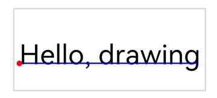

**Error codes**

For details about the error codes, see [Universal Error Codes](../errorcode-universal.md).

| ID| Error Message|
| ------- | --------------------------------------------|
| 401 | Parameter error.Possible causes:1.Mandatory parameters are left unspecified;2.Incorrect parameter types. |

**Example**

```ts
import { RenderNode } from '@kit.ArkUI';
import { drawing } from '@kit.ArkGraphics2D';
class DrawingRenderNode extends RenderNode {
  draw(context : DrawContext) {
    const canvas = context.canvas;
    const brush = new drawing.Brush();
    brush.setColor({alpha: 255, red: 255, green: 0, blue: 0});
    const font = new drawing.Font();
    font.setSize(20);
    const textBlob = drawing.TextBlob.makeFromString("Hello, drawing", font, drawing.TextEncoding.TEXT_ENCODING_UTF8);
    canvas.attachBrush(brush);
    canvas.drawTextBlob(textBlob, 20, 20);
    canvas.detachBrush();
  }
}
```

### drawSingleCharacter<sup>12+</sup>

drawSingleCharacter(text: string, font: Font, x: number, y: number): void

Draws a single character. If the typeface of the current font does not support the character to draw, the system typeface is used to draw the character.

**System capability**: SystemCapability.Graphics.Drawing

**Parameters**

| Name| Type               | Mandatory| Description       |
| ------ | ------------------- | ---- | ----------- |
| text   | string | Yes  | Single character to draw. The length of the string must be 1. |
| font   | [Font](#font) | Yes  | **Font** object. |
| x      | number | Yes  | X coordinate of the left point (red point in the figure below) of the character baseline (blue line in the figure below). The value is a floating point number.|
| y      | number | Yes  | Y coordinate of the left point (red point in the figure below) of the character baseline (blue line in the figure below). The value is a floating point number.|


**Error codes**

For details about the error codes, see [Universal Error Codes](../errorcode-universal.md).

| ID| Error Message|
| ------- | --------------------------------------------|
| 401 | Parameter error.Possible causes:1.Mandatory parameters are left unspecified;2.Incorrect parameter types;3.Parameter verification failed. |

**Example**

```ts
import { RenderNode } from '@kit.ArkUI';
import { drawing } from '@kit.ArkGraphics2D';

class DrawingRenderNode extends RenderNode {
  draw(context : DrawContext) {
    const canvas = context.canvas;
    const brush = new drawing.Brush();
    brush.setColor({alpha: 255, red: 255, green: 0, blue: 0});
    const font = new drawing.Font();
    font.setSize(20);
    canvas.attachBrush(brush);
    canvas.drawSingleCharacter ("Hello", font, 100, 100);
    canvas.drawSingleCharacter ("drawing", font, 120, 100);
    canvas.detachBrush();
  }
}
```

### drawRegion<sup>12+</sup>

drawRegion(region: Region): void

Draws a region.

**System capability**: SystemCapability.Graphics.Drawing

**Parameters**

| Name| Type               | Mandatory| Description       |
| ------ | ------------------- | ---- | ----------- |
| region   | [Region](#region12) | Yes  | Region to draw. |

**Error codes**

For details about the error codes, see [Universal Error Codes](../errorcode-universal.md).

| ID| Error Message|
| ------- | --------------------------------------------|
| 401 | Parameter error.Possible causes:1.Mandatory parameters are left unspecified;2.Incorrect parameter types. |

**Example**

```ts
import { RenderNode } from '@kit.ArkUI';
class DrawingRenderNode extends RenderNode {
  draw(context : DrawContext) {
    const canvas = context.canvas;
    const pen = new drawing.Pen();
    let region = new drawing.Region();
    pen.setStrokeWidth(10);
    pen.setColor({ alpha: 255, red: 255, green: 0, blue: 0 });
    canvas.attachPen(pen);
    region.setRect(100, 100, 400, 400);
    canvas.drawRegion(region);
    canvas.detachPen();
  }
}
```

### attachPen

attachPen(pen: Pen): void

Attaches a pen to a canvas so that the canvas can use the style and color of the pen to outline a shape.

> **NOTE**
>
> If the pen effect changes after this API is called, you must call the API again if you want to use the new effect in the subsequent drawing.

**System capability**: SystemCapability.Graphics.Drawing

**Parameters**

| Name| Type       | Mandatory| Description      |
| ------ | ----------- | ---- | ---------- |
| pen    | [Pen](#pen) | Yes  | **Pen** object.|

**Error codes**

For details about the error codes, see [Universal Error Codes](../errorcode-universal.md).

| ID| Error Message|
| ------- | --------------------------------------------|
| 401 | Parameter error.Possible causes:1.Mandatory parameters are left unspecified;2.Incorrect parameter types. |

**Example**

```ts
import { RenderNode } from '@kit.ArkUI';
import { drawing } from '@kit.ArkGraphics2D';
class DrawingRenderNode extends RenderNode {
  draw(context : DrawContext) {
    const canvas = context.canvas;
    const pen = new drawing.Pen();
    pen.setStrokeWidth(5);
    pen.setColor({alpha: 255, red: 255, green: 0, blue: 0});
    canvas.attachPen(pen);
    canvas.drawRect({ left : 0, right : 10, top : 0, bottom : 10 });
    canvas.detachPen();
  }
}
```

### attachBrush

attachBrush(brush: Brush): void

Attaches a brush to a canvas so that the canvas can use the style and color of the brush to fill in a shape.

> **NOTE**
>
> If the brush effect changes after this API is called, you must call the API again if you want to use the new effect in the subsequent drawing.

**System capability**: SystemCapability.Graphics.Drawing

**Parameters**

| Name| Type           | Mandatory| Description      |
| ------ | --------------- | ---- | ---------- |
| brush  | [Brush](#brush) | Yes  | **Brush** object.|

**Error codes**

For details about the error codes, see [Universal Error Codes](../errorcode-universal.md).

| ID| Error Message|
| ------- | --------------------------------------------|
| 401 | Parameter error.Possible causes:1.Mandatory parameters are left unspecified;2.Incorrect parameter types. |

**Example**

```ts
import { RenderNode } from '@kit.ArkUI';
import { drawing } from '@kit.ArkGraphics2D';
class DrawingRenderNode extends RenderNode {
  draw(context : DrawContext) {
    const canvas = context.canvas;
    const brush = new drawing.Brush();
    brush.setColor({alpha: 255, red: 255, green: 0, blue: 0});
    canvas.attachBrush(brush);
    canvas.drawRect({ left : 0, right : 10, top : 0, bottom : 10 });
    canvas.detachBrush();
  }
}
```

### detachPen

detachPen(): void

Detaches the pen from a canvas so that the canvas can no longer use the style and color of the pen to outline a shape.

**System capability**: SystemCapability.Graphics.Drawing

**Example**

```ts
import { RenderNode } from '@kit.ArkUI';
import { drawing } from '@kit.ArkGraphics2D';
class DrawingRenderNode extends RenderNode {
  draw(context : DrawContext) {
    const canvas = context.canvas;
    const pen = new drawing.Pen();
    pen.setStrokeWidth(5);
    pen.setColor({alpha: 255, red: 255, green: 0, blue: 0});
    canvas.attachPen(pen);
    canvas.drawRect({ left : 0, right : 10, top : 0, bottom : 10 });
    canvas.detachPen();
  }
}
```

### detachBrush

detachBrush(): void

Detaches the brush from a canvas so that the canvas can no longer use the style and color of the brush to fill in a shape.

**System capability**: SystemCapability.Graphics.Drawing

**Example**

```ts
import { RenderNode } from '@kit.ArkUI';
import { drawing } from '@kit.ArkGraphics2D';
class DrawingRenderNode extends RenderNode {
  draw(context : DrawContext) {
    const canvas = context.canvas;
    const brush = new drawing.Brush();
    brush.setColor({alpha: 255, red: 255, green: 0, blue: 0});
    canvas.attachBrush(brush);
    canvas.drawRect({ left : 0, right : 10, top : 0, bottom : 10 });
    canvas.detachBrush();
  }
}
```

### clipPath<sup>12+</sup>

clipPath(path: Path, clipOp?: ClipOp, doAntiAlias?: boolean): void

Clips a path.

**System capability**: SystemCapability.Graphics.Drawing

**Parameters**

| Name      | Type              | Mandatory| Description                               |
| ------------ | ----------------- | ---- | ------------------------------------|
| path         | [Path](#path)     | Yes  | **Path** object.                                                |
| clipOp       | [ClipOp](#clipop12) | No  | Clip mode. The default value is **INTERSECT**.                                    |
| doAntiAlias  | boolean           | No  | Whether to enable anti-aliasing. The value **true** means to enable anti-aliasing, and **false** means the opposite. The default value is **false**.|

**Error codes**

For details about the error codes, see [Universal Error Codes](../errorcode-universal.md).

| ID| Error Message|
| ------- | --------------------------------------------|
| 401 | Parameter error.Possible causes:1.Mandatory parameters are left unspecified;2.Incorrect parameter types. |

**Example**

```ts
import { RenderNode } from '@kit.ArkUI';
import { common2D, drawing } from '@kit.ArkGraphics2D';
class DrawingRenderNode extends RenderNode {
  draw(context : DrawContext) {
    const canvas = context.canvas;
    const pen = new drawing.Pen();
    pen.setStrokeWidth(5);
    pen.setColor({alpha: 255, red: 255, green: 0, blue: 0});
    let path = new drawing.Path();
    path.moveTo(10, 10);
    path.cubicTo(10, 10, 10, 10, 15, 15);
    path.close();
    canvas.attachPen(pen);
    canvas.clipPath(path, drawing.ClipOp.DIFFERENCE, true);
    canvas.detachPen();
  }
}
```

### clipRect<sup>12+</sup>

clipRect(rect: common2D.Rect, clipOp?: ClipOp, doAntiAlias?: boolean): void

Clips a rectangle.

**System capability**: SystemCapability.Graphics.Drawing

**Parameters**

| Name        | Type                                      | Mandatory  | Description                 |
| ----------- | ---------------------------------------- | ---- | ------------------- |
| rect        | [common2D.Rect](js-apis-graphics-common2D.md#rect) | Yes   | Rectangle.     |
| clipOp      | [ClipOp](#clipop12)                  | No   | Clip mode. The default value is **INTERSECT**.    |
| doAntiAlias | boolean           | No  | Whether to enable anti-aliasing. The value **true** means to enable anti-aliasing, and **false** means the opposite. The default value is **false**.|

**Error codes**

For details about the error codes, see [Universal Error Codes](../errorcode-universal.md).

| ID| Error Message|
| ------- | --------------------------------------------|
| 401 | Parameter error.Possible causes:1.Mandatory parameters are left unspecified;2.Incorrect parameter types. |

**Example**

```ts
import { RenderNode } from '@kit.ArkUI';
import { common2D, drawing } from '@kit.ArkGraphics2D';
class DrawingRenderNode extends RenderNode {
  draw(context : DrawContext) {
    const canvas = context.canvas;
    const pen = new drawing.Pen();
    pen.setStrokeWidth(5);
    pen.setColor({alpha: 255, red: 255, green: 0, blue: 0});
    canvas.attachPen(pen);
    canvas.clipRect({left : 10, right : 500, top : 300, bottom : 900}, drawing.ClipOp.DIFFERENCE, true);
    canvas.detachPen();
  }
}
```

### save<sup>12+</sup>

save(): number

Saves the current canvas status (canvas matrix) to the top of the stack.

**System capability**: SystemCapability.Graphics.Drawing

**Return value**

| Type  | Description               |
| ------ | ------------------ |
| number | Number of canvas statuses. The value is a positive integer.|

**Example**

```ts
import { RenderNode } from '@kit.ArkUI';
import { common2D, drawing } from '@kit.ArkGraphics2D';
class DrawingRenderNode extends RenderNode {
  draw(context : DrawContext) {
    const canvas = context.canvas;
    let rect: common2D.Rect = {left: 10, right: 200, top: 100, bottom: 300};
    canvas.drawRect(rect);
    let saveCount = canvas.save();
  }
}
```

### saveLayer<sup>12+</sup>

saveLayer(rect?: common2D.Rect | null, brush?: Brush | null): number

Saves the matrix and cropping region of the canvas, and allocates a bitmap for subsequent drawing. If you call [restore](#restore12), the changes made to the matrix and clipping region are discarded, and the bitmap is drawn.

**System capability**: SystemCapability.Graphics.Drawing

**Parameters**

| Name | Type    | Mandatory  | Description        |
| ---- | ------ | ---- | ----------------- |
| rect   | [common2D.Rect](js-apis-graphics-common2D.md#rect)\|null | No  | **Rect** object, which is used to limit the size of the graphics layer. The default value is the current canvas size.|
| brush  | [Brush](#brush)\|null | No  | **Brush** object. The alpha value, filter effect, and blend mode of the brush are applied when the bitmap is drawn. If null is passed in, no effect is applied.|

**Return value**

| Type  | Description               |
| ------ | ------------------ |
| number | Number of canvas statuses that have been saved. The value is a positive integer.|

**Error codes**

For details about the error codes, see [Universal Error Codes](../errorcode-universal.md).

| ID| Error Message|
| ------- | --------------------------------------------|
| 401 | Parameter error. Possible causes: Mandatory parameters are left unspecified. |

**Example**

```ts
import { RenderNode } from '@kit.ArkUI';
import { common2D, drawing } from '@kit.ArkGraphics2D';
class DrawingRenderNode extends RenderNode {
  draw(context : DrawContext) {
    const canvas = context.canvas;
    canvas.saveLayer(null, null);
    const brushRect = new drawing.Brush();
    const colorRect: common2D.Color = {alpha: 255, red: 255, green: 255, blue: 0};
    brushRect.setColor(colorRect);
    canvas.attachBrush(brushRect);
    const rect: common2D.Rect = {left:100, top:100, right:500, bottom:500};
    canvas.drawRect(rect);

    const brush = new drawing.Brush();
    brush.setBlendMode(drawing.BlendMode.DST_OUT);
    canvas.saveLayer(rect, brush);

    const brushCircle = new drawing.Brush();
    const colorCircle: common2D.Color = {alpha: 255, red: 0, green: 0, blue: 255};
    brushCircle.setColor(colorCircle);
    canvas.attachBrush(brushCircle);
    canvas.drawCircle(500, 500, 200);
    canvas.restore();
    canvas.restore();
    canvas.detachBrush();
  }
}
```

### scale<sup>12+</sup>

scale(sx: number, sy: number): void

Scales the canvas.

**System capability**: SystemCapability.Graphics.Drawing

**Parameters**

| Name | Type    | Mandatory  | Description        |
| ---- | ------ | ---- | ----------------- |
| sx   | number | Yes  | Scale ratio on the X axis. The value is a floating point number.|
| sy   | number | Yes  | Scale ratio on the Y axis. The value is a floating point number.|

**Error codes**

For details about the error codes, see [Universal Error Codes](../errorcode-universal.md).

| ID| Error Message|
| ------- | --------------------------------------------|
| 401 | Parameter error.Possible causes:1.Mandatory parameters are left unspecified;2.Incorrect parameter types. |

**Example**

```ts
import { RenderNode } from '@kit.ArkUI';
import { common2D, drawing } from '@kit.ArkGraphics2D';
class DrawingRenderNode extends RenderNode {
  draw(context : DrawContext) {
    const canvas = context.canvas;
    const pen = new drawing.Pen();
    pen.setStrokeWidth(5);
    pen.setColor({alpha: 255, red: 255, green: 0, blue: 0});
    canvas.attachPen(pen);
    canvas.scale(2, 0.5);
    canvas.drawRect({left : 10, right : 500, top : 300, bottom : 900});
    canvas.detachPen();
  }
}
```

### skew<sup>12+</sup>

skew(sx: number, sy: number) : void

Skews the canvas in both the horizontal and vertical directions.

**System capability**: SystemCapability.Graphics.Drawing

**Parameters**

| Name | Type    | Mandatory  | Description        |
| ---- | ------ | ---- | ----------------- |
| sx   | number | Yes  | Amount of tilt on the X axis. The value is a floating point number.   |
| sy   | number | Yes  | Amount of tilt on the Y axis. The value is a floating point number.   |

**Error codes**

For details about the error codes, see [Universal Error Codes](../errorcode-universal.md).

| ID| Error Message|
| ------- | --------------------------------------------|
| 401 | Parameter error.Possible causes:1.Mandatory parameters are left unspecified;2.Incorrect parameter types. |

**Example**

```ts
import { RenderNode } from '@kit.ArkUI';
import { common2D, drawing } from '@kit.ArkGraphics2D';
class DrawingRenderNode extends RenderNode {
  draw(context : DrawContext) {
    const canvas = context.canvas;
    const pen = new drawing.Pen();
    pen.setStrokeWidth(5);
    pen.setColor({alpha: 255, red: 255, green: 0, blue: 0});
    canvas.attachPen(pen);
    canvas.skew(0.1, 0.1);
    canvas.drawRect({left : 10, right : 500, top : 300, bottom : 900});
    canvas.detachPen();
  }
}
```

### rotate<sup>12+</sup>

rotate(degrees: number, sx: number, sy: number) : void

Rotates the canvas by a certain angle.

**System capability**: SystemCapability.Graphics.Drawing

**Parameters**

| Name | Type    | Mandatory  | Description        |
| ---- | ------ | ------ | ------------------------ |
| degrees       | number | Yes   | Angle to rotate, in degrees. The value is a floating point number. A positive value indicates a clockwise rotation, and a negative value indicates a counterclockwise rotation. |
| sx            | number | Yes   | X coordinate of the rotation center. The value is a floating point number.|
| sy            | number | Yes   | Y coordinate of the rotation center. The value is a floating point number.|

**Error codes**

For details about the error codes, see [Universal Error Codes](../errorcode-universal.md).

| ID| Error Message|
| ------- | --------------------------------------------|
| 401 | Parameter error.Possible causes:1.Mandatory parameters are left unspecified;2.Incorrect parameter types. |

**Example**

```ts
import { RenderNode } from '@kit.ArkUI';
import { common2D, drawing } from '@kit.ArkGraphics2D';
class DrawingRenderNode extends RenderNode {
  draw(context : DrawContext) {
    const canvas = context.canvas;
    const pen = new drawing.Pen();
    pen.setStrokeWidth(5);
    pen.setColor({alpha: 255, red: 255, green: 0, blue: 0});
    canvas.attachPen(pen);
    canvas.rotate(30, 100, 100);
    canvas.drawRect({left : 10, right : 500, top : 300, bottom : 900});
    canvas.detachPen();
  }
}
```

### translate<sup>12+</sup>

translate(dx: number, dy: number): void

Translates the canvas by a given distance.

**System capability**: SystemCapability.Graphics.Drawing

**Parameters**

| Name| Type  | Mandatory| Description               |
| ----- | ------ | ---- | ------------------- |
| dx    | number | Yes  | Distance to translate on the X axis. The value is a floating point number.  |
| dy    | number | Yes  | Distance to translate on the Y axis. The value is a floating point number.  |

**Error codes**

For details about the error codes, see [Universal Error Codes](../errorcode-universal.md).

| ID| Error Message|
| ------- | --------------------------------------------|
| 401 | Parameter error.Possible causes:1.Mandatory parameters are left unspecified;2.Incorrect parameter types. |

**Example**

```ts
import { RenderNode } from '@kit.ArkUI';
import { common2D, drawing } from '@kit.ArkGraphics2D';
class DrawingRenderNode extends RenderNode {
  draw(context : DrawContext) {
    const canvas = context.canvas;
    const pen = new drawing.Pen();
    pen.setStrokeWidth(5);
    pen.setColor({alpha: 255, red: 255, green: 0, blue: 0});
    canvas.attachPen(pen);
    canvas.translate(10, 10);
    canvas.drawRect({left : 10, right : 500, top : 300, bottom : 900});
    canvas.detachPen();
  }
}
```

### getSaveCount<sup>12+</sup>

getSaveCount(): number

Obtains the number of canvas statuses (canvas matrices) saved in the stack.

**System capability**: SystemCapability.Graphics.Drawing

**Return value**

| Type   | Description                                |
| ------ | ------------------------------------ |
| number | Number of canvas statuses that have been saved. The value is a positive integer.|

**Example**

```ts
import { RenderNode } from '@kit.ArkUI';
import { common2D, drawing } from '@kit.ArkGraphics2D';
class DrawingRenderNode extends RenderNode {
  draw(context : DrawContext) {
    const canvas = context.canvas;
    const pen = new drawing.Pen();
    pen.setStrokeWidth(5);
    pen.setColor({alpha: 255, red: 255, green: 0, blue: 0});
    canvas.attachPen(pen);
    canvas.drawRect({left: 10, right: 200, top: 100, bottom: 300});
    canvas.save();
    canvas.drawRect({left : 10, right : 500, top : 300, bottom : 900});
    canvas.getSaveCount();
    canvas.detachPen();
  }
}
```

### restoreToCount<sup>12+</sup>

restoreToCount(count: number): void

Restores to a given number of canvas statuses (canvas matrices).

**System capability**: SystemCapability.Graphics.Drawing

**Parameters**

| Name  | Type    | Mandatory  | Description                   |
| ----- | ------ | ---- | ----------------------------- |
| count | number | Yes  | Depth of the canvas statuses to restore. The value is an integer. If the value is less than or equal to 1, the canvas is restored to the initial state. If the value is greater than the number of canvas statuses that have been saved, no operation is performed.|

**Error codes**

For details about the error codes, see [Universal Error Codes](../errorcode-universal.md).

| ID| Error Message|
| ------- | --------------------------------------------|
| 401 | Parameter error.Possible causes:1.Mandatory parameters are left unspecified;2.Incorrect parameter types. |

**Example**

```ts
import { RenderNode } from '@kit.ArkUI';
import { common2D, drawing } from '@kit.ArkGraphics2D';
class DrawingRenderNode extends RenderNode {
  draw(context : DrawContext) {
    const canvas = context.canvas;
    const pen = new drawing.Pen();
    pen.setStrokeWidth(5);
    pen.setColor({alpha: 255, red: 255, green: 0, blue: 0});
    canvas.attachPen(pen);
    canvas.drawRect({left: 10, right: 200, top: 100, bottom: 300});
    canvas.save();
    canvas.drawRect({left: 10, right: 200, top: 100, bottom: 500});
    canvas.save();
    canvas.drawRect({left: 100, right: 300, top: 100, bottom: 500});
    canvas.save();
    canvas.restoreToCount(2);
    canvas.drawRect({left : 10, right : 500, top : 300, bottom : 900});
    canvas.detachPen();
  }
}
```

### restore<sup>12+</sup>

restore(): void

Restores the canvas status (canvas matrix) saved on the top of the stack.

**System capability**: SystemCapability.Graphics.Drawing

**Example**

```ts
import { RenderNode } from '@kit.ArkUI';
import { common2D, drawing } from '@kit.ArkGraphics2D';
class DrawingRenderNode extends RenderNode {
  draw(context : DrawContext) {
    const canvas = context.canvas;
    const pen = new drawing.Pen();
    pen.setStrokeWidth(5);
    pen.setColor({alpha: 255, red: 255, green: 0, blue: 0});
    canvas.attachPen(pen);
    canvas.restore();
    canvas.detachPen();
  }
}
```

### concatMatrix<sup>12+</sup>

concatMatrix(matrix: Matrix): void

Preconcats the existing matrix of the canvas with the passed-in matrix. The drawing operation triggered before this API is called is not affected.

**System capability**: SystemCapability.Graphics.Drawing

**Parameters**

| Name   | Type               | Mandatory  | Description   |
| ------ | ----------------- | ---- | ----- |
| matrix | [Matrix](#matrix12) | Yes   | **Matrix** object.|

**Error codes**

For details about the error codes, see [Universal Error Codes](../errorcode-universal.md).

| ID| Error Message|
| ------- | --------------------------------------------|
| 401 | Parameter error.Possible causes:1.Mandatory parameters are left unspecified;2.Incorrect parameter types. |

**Example**

```ts
import { RenderNode } from '@kit.ArkUI';
import { drawing } from '@kit.ArkGraphics2D';
class DrawingRenderNode extends RenderNode {
  draw(context : DrawContext) {
    const canvas = context.canvas;
    let matrix = new drawing.Matrix();
    matrix.setMatrix([5, 0, 0, 0, 1, 2, 0, 0, 1]);
    canvas.concatMatrix(matrix);
  }
}
```

### setMatrix<sup>12+</sup>

setMatrix(matrix: Matrix): void

Sets a matrix for the canvas.

**System capability**: SystemCapability.Graphics.Drawing

**Parameters**

| Name   | Type               | Mandatory  | Description   |
| ------ | ----------------- | ---- | ----- |
| matrix | [Matrix](#matrix12) | Yes   | **Matrix** object.|

**Error codes**

For details about the error codes, see [Universal Error Codes](../errorcode-universal.md).

| ID| Error Message|
| ------- | --------------------------------------------|
| 401 | Parameter error.Possible causes:1.Mandatory parameters are left unspecified;2.Incorrect parameter types. |

**Example**

```ts
import { RenderNode } from '@kit.ArkUI';
import { drawing } from '@kit.ArkGraphics2D';
class DrawingRenderNode extends RenderNode {
  draw(context : DrawContext) {
    const canvas = context.canvas;
    let matrix = new drawing.Matrix()
    matrix.setMatrix([5, 0, 0, 0, 1, 1, 0, 0, 1]);
    canvas.setMatrix(matrix);
  }
}
```

### isClipEmpty<sup>12+</sup>

isClipEmpty(): boolean

Checks whether the region that can be drawn is empty after clipping.

**System capability**: SystemCapability.Graphics.Drawing

**Return value**

| Type                 | Description          |
| --------------------- | -------------- |
| boolean | Chek result. The value **true** means that the region is empty, and **false** means the opposite.|

**Example**

```ts
import { RenderNode } from '@kit.ArkUI';
import { drawing } from '@kit.ArkGraphics2D';
class DrawingRenderNode extends RenderNode {
  draw(context : DrawContext) {
    const canvas = context.canvas;
    if (canvas.isClipEmpty()) {
      console.info("canvas.isClipEmpty() returned true");
    } else {
      console.info("canvas.isClipEmpty() returned false");
    }
  }
}
```

### clipRegion<sup>12+</sup>

clipRegion(region: Region, clipOp?: ClipOp): void

Clips a region on the canvas.

**System capability**: SystemCapability.Graphics.Drawing

**Parameters**

| Name         | Type   | Mandatory| Description                                                       |
| --------------- | ------- | ---- | ----------------------------------------------------------- |
| region | [Region](#region12) | Yes  | **Region** object, which indicates the range to clip.|
| clipOp | [ClipOp](#clipop12)   | No  | Clipping mode. The default value is **INTERSECT**.|

**Error codes**

For details about the error codes, see [Universal Error Codes](../errorcode-universal.md).

| ID| Error Message|
| ------- | --------------------------------------------|
| 401 | Parameter error.Possible causes:1.Mandatory parameters are left unspecified;2.Incorrect parameter types. |

**Example**

```ts
import { RenderNode } from '@kit.ArkUI';
import { drawing } from '@kit.ArkGraphics2D';
class DrawingRenderNode extends RenderNode {
  draw(context : DrawContext) {
    const canvas = context.canvas;
    let region : drawing.Region = new drawing.Region();
    region.setRect(0, 0, 500, 500);
    canvas.clipRegion(region);
  }
}
```

### clipRoundRect<sup>12+</sup>

clipRoundRect(roundRect: RoundRect, clipOp?: ClipOp, doAntiAlias?: boolean): void

Clips a rounded rectangle on the canvas.

**System capability**: SystemCapability.Graphics.Drawing

**Parameters**

| Name         | Type   | Mandatory| Description                                                       |
| --------------- | ------- | ---- | ----------------------------------------------------------- |
| roundRect | [RoundRect](#roundrect12) | Yes  | **RoundRect** object, which indicates the range to clip.|
| clipOp | [ClipOp](#clipop12)   | No  | Clipping mode. The default value is **INTERSECT**.|
| doAntiAlias | boolean | No  | Whether to enable anti-aliasing. The value **true** means to enable anti-aliasing, and **false** means the opposite. The default value is **false**.|

**Error codes**

For details about the error codes, see [Universal Error Codes](../errorcode-universal.md).

| ID| Error Message|
| ------- | --------------------------------------------|
| 401 | Parameter error.Possible causes:1.Mandatory parameters are left unspecified;2.Incorrect parameter types. |

**Example**

```ts
import { RenderNode } from '@kit.ArkUI';
import { common2D, drawing } from '@kit.ArkGraphics2D';
class DrawingRenderNode extends RenderNode {
  draw(context : DrawContext) {
    const canvas = context.canvas;
    let rect: common2D.Rect = { left: 10, top: 100, right: 200, bottom: 300 };
    let roundRect = new drawing.RoundRect(rect, 10, 10);
    canvas.clipRoundRect(roundRect);
  }
}
```

### resetMatrix<sup>12+</sup>

resetMatrix(): void

Resets the matrix of this canvas to an identity matrix.

**System capability**: SystemCapability.Graphics.Drawing

**Example**

```ts
import { RenderNode } from '@kit.ArkUI';
import { drawing } from '@kit.ArkGraphics2D';
class DrawingRenderNode extends RenderNode {
  draw(context : DrawContext) {
    const canvas = context.canvas;
    canvas.scale(4, 6);
    canvas.resetMatrix();
  }
}
```

## ImageFilter<sup>12+</sup>

Implements an image filter.

### createBlurImageFilter<sup>12+</sup>

static createBlurImageFilter(sigmaX: number, sigmaY: number, tileMode: TileMode, imageFilter?: ImageFilter | null ): ImageFilter

Creates an image filter with a given blur effect.

**System capability**: SystemCapability.Graphics.Drawing

**Parameters**

| Name         | Type   | Mandatory| Description                                                       |
| --------------- | ------- | ---- | ----------------------------------------------------------- |
| sigmaX | number | Yes  | Standard deviation of the Gaussian blur along the X axis. The value must be a floating point number greater than 0.|
| sigmaY | number | Yes  | Standard deviation of the Gaussian blur along the Y axis. The value must be a floating point number greater than 0.|
| tileMode | [TileMode](#tilemode12)| Yes  | Tile mode to apply to the edges.|
| imageFilter | [ImageFilter](#imagefilter12) \| null | No  | Filter to which the image filter will be applied. The default value is null, indicating that the image filter is directly applied to the original image.|

**Return value**

| Type                 | Description          |
| --------------------- | -------------- |
| [ImageFilter](#imagefilter12) | Image filter created.|

**Error codes**

For details about the error codes, see [Universal Error Codes](../errorcode-universal.md).

| ID| Error Message|
| ------- | --------------------------------------------|
| 401 | Parameter error.Possible causes:1.Mandatory parameters are left unspecified;2.Incorrect parameter types;3.Parameter verification failed. |

**Example**

```ts
import { drawing } from '@kit.ArkGraphics2D';
let imgFilter = drawing.ImageFilter.createBlurImageFilter(5, 10, drawing.TileMode.CLAMP);
```

### createFromColorFilter<sup>12+</sup>

static createFromColorFilter(colorFilter: ColorFilter, imageFilter?: ImageFilter | null): ImageFilter

Creates an image filter object with a given color filter effect.

**System capability**: SystemCapability.Graphics.Drawing

**Parameters**

| Name         | Type   | Mandatory| Description                                                       |
| --------------- | ------- | ---- | ----------------------------------------------------------- |
| colorFilter | [ColorFilter](#colorfilter) | Yes  | Color filter.|
| imageFilter | [ImageFilter](#imagefilter12) \| null | No  | Filter to which the image filter will be applied. The default value is null, indicating that the image filter is directly applied to the original image.|

**Return value**

| Type                 | Description          |
| --------------------- | -------------- |
| [ImageFilter](#imagefilter12) | Image filter created.|

**Error codes**

For details about the error codes, see [Universal Error Codes](../errorcode-universal.md).

| ID| Error Message|
| ------- | --------------------------------------------|
| 401 | Parameter error.Possible causes:1.Mandatory parameters are left unspecified;2.Incorrect parameter types. |

**Example**

```ts
import { drawing } from '@kit.ArkGraphics2D';
let imgFilter = drawing.ImageFilter.createBlurImageFilter(5, 10, drawing.TileMode.CLAMP);
let clolorfilter = drawing.ColorFilter.createSRGBGammaToLinear();
let imgFilter1 = drawing.ImageFilter.createFromColorFilter(clolorfilter, imgFilter);
```

## TextBlobRunBuffer

Describes a series of consecutive glyphs with the same attributes in a text blob.

**System capability**: SystemCapability.Graphics.Drawing

| Name     | Type  | Readable| Writable| Description                     |
| --------- | ------ | ---- | ---- | ------------------------- |
| glyph     | number | Yes  | Yes  | Index of the glyph. The value is an integer. If a floating point number is passed in, the value is rounded down.|
| positionX | number | Yes  | Yes  | X coordinate of the start point of the text blob. The value is a floating point number.|
| positionY | number | Yes  | Yes  | Y coordinate of the start point of the text blob. The value is a floating point number.|

## TextEncoding

Enumerates the text encoding types.

**System capability**: SystemCapability.Graphics.Drawing

| Name                  | Value  | Description                          |
| ---------------------- | ---- | ------------------------------ |
| TEXT_ENCODING_UTF8     | 0    | One byte is used to indicate UTF-8 or ASCII characters. |
| TEXT_ENCODING_UTF16    | 1    | Two bytes are used to indicate most Unicode characters.|
| TEXT_ENCODING_UTF32    | 2    | Four bytes are used to indicate all Unicode characters.  |
| TEXT_ENCODING_GLYPH_ID | 3    | Two bytes are used to indicate the glyph index.  |

## ClipOp<sup>12+</sup>
Enumerates the canvas clipping modes.


**System capability**: SystemCapability.Graphics.Drawing

| Name                | Value   | Description          | Diagram  |
| ------------------ | ---- | ---------------- | -------- |
| DIFFERENCE | 0    | Clips a specified area. That is, the difference set is obtained.| 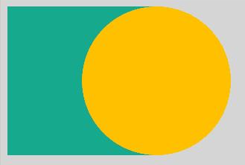 |
| INTERSECT  | 1    | Retains a specified area. That is, the intersection is obtained.|  |

> **NOTE**
>
> The diagrams show the result of cropping a circle based on different enumerated values after a rectangle is cropped in INTERSECT mode. The green area is the final area obtained.

## FilterMode<sup>12+</sup>

Enumerates the filter modes.

**System capability**: SystemCapability.Graphics.Drawing

| Name                 | Value   | Description     |
| ------------------- | ---- | ------- |
| FILTER_MODE_NEAREST | 0    | Nearest filter mode.|
| FILTER_MODE_LINEAR  | 1    | Linear filter mode.|

## PathDirection<sup>12+</sup>

Enumerates the directions of a closed contour.

**System capability**: SystemCapability.Graphics.Drawing

| Name                 | Value   | Description     |
| ------------------- | ---- | ------- |
| CLOCKWISE   | 0    | Adds a closed contour clockwise.|
| COUNTER_CLOCKWISE  | 1    | Adds a closed contour counterclockwise.|

## PathFillType<sup>12+</sup>

Enumerates the fill types of a path.

**System capability**: SystemCapability.Graphics.Drawing

| Name                 | Value   | Description     |
| ------------------- | ---- | ------- |
| WINDING   | 0    | Specifies that "inside" is computed by a non-zero sum of signed edge crossings. Specifically, draws a point and emits a ray in any direction. A count is used to record the number of intersection points of the ray and path, and the initial count is 0. When encountering a clockwise intersection point (the path passes from the left to the right of the ray), the count increases by 1. When encountering a counterclockwise intersection point (the path passes from the right to the left of the ray), the count decreases by 1. If the final count is not 0, the point is inside the path and needs to be colored. If the final count is 0, the point is not colored.|
| EVEN_ODD  | 1    | Specifies that "inside" is computed by an odd number of edge crossings. Specifically, draws a point and emits a ray in any direction. If the number of intersection points of the ray and path is an odd number, the point is considered to be inside the path and needs to be colored. If the number is an even number, the point is not colored.|
| INVERSE_WINDING  | 2    | Same as **WINDING**, but draws outside of the path, rather than inside.|
| INVERSE_EVEN_ODD  | 3    | Same as **EVEN_ODD**, but draws outside of the path, rather than inside.|

> **NOTE**
> 
> As shown in the above figure, the path is a circle, the arrow indicates the path direction, **p** is any point "inside" the path, the blue line is the ray emitted from **p**, and the black arrow indicates the fill result using blue under the corresponding fill type. Under the **WINDING** fill rule, the number of intersection points of the ray and path is 2 (not 0), and therefore **p** is colored. Under the **EVEN_ODD** filling rule, the number of intersection points of the ray and path is 2 (an even number), and therefore **p** is not colored.

## PointMode<sup>12+</sup>

Enumerates the modes for drawing multiple points in an array.

**System capability**: SystemCapability.Graphics.Drawing

| Name                | Value   | Description           |
| ------------------ | ---- | ------------- |
| POINTS  | 0    | Draws each point separately.     |
| LINES   | 1    | Draws every two points as a line segment.   |
| POLYGON | 2    | Draws an array of points as an open polygon.|

## FontEdging<sup>12+</sup>

Enumerates the font edging types.

**System capability**: SystemCapability.Graphics.Drawing

| Name                 | Value   | Description     |
| ------------------- | ---- | ------- |
| ALIAS | 0    | No anti-aliasing processing is used.|
| ANTI_ALIAS  | 1    | Uses anti-aliasing to smooth the jagged edges.|
| SUBPIXEL_ANTI_ALIAS  | 2    | Uses sub-pixel anti-aliasing to provide a smoother effect for jagged edges.|

## FontHinting<sup>12+</sup>

Enumerates the font hinting types.

**System capability**: SystemCapability.Graphics.Drawing

| Name                 | Value   | Description     |
| ------------------- | ---- | ------- |
| NONE    | 0    | No font hinting is used.|
| SLIGHT  | 1    | Slight font hinting is used to improve contrast.|
| NORMAL  | 2    | Normal font hinting is used to improve contrast.|
| FULL    | 3    | Full font hinting is used to improve contrast.|

## TextBlob

Defines a block consisting of one or more characters with the same font.

### makeFromPosText<sup>12+</sup>

static makeFromPosText(text: string, len: number, points: common2D.Point[], font: Font): TextBlob

Creates a **TextBlob** object from the text. The coordinates of each font in the **TextBlob** object are determined by the coordinate information in the **points** array.

**System capability**: SystemCapability.Graphics.Drawing

**Parameters**

| Name  | Type                         | Mandatory| Description                                  |
| -------- | ----------------------------- | ---- | -------------------------------------- |
| text     | string             | Yes  | Content to be used for drawing the text blob.                  |
| len      | number             | Yes  | Number of fonts. The value is an integer and is obtained from [countText](#counttext12).|
| points   |[common2D.Point[]](js-apis-graphics-common2D.md#point)      | Yes  |Array of points, which are used to specify the coordinates of each font. The array length must be the same as the value of **len**.|
| font     | [Font](#font)      | Yes  | **Font** object.|

**Return value**

| Type                 | Description          |
| --------------------- | -------------- |
| [TextBlob](#textblob) | **TextBlob** object.|


**Error codes**

For details about the error codes, see [Universal Error Codes](../errorcode-universal.md).

| ID| Error Message|
| ------- | --------------------------------------------|
| 401 | Parameter error. Possible causes: 1. Mandatory parameters are left unspecified;2. Incorrect parameter types. |

**Example**

```ts
import { RenderNode } from '@kit.ArkUI';
import { drawing,common2D} from '@kit.ArkGraphics2D';

class DrawingRenderNode extends RenderNode {
  draw(context : DrawContext) {
    const canvas = context.canvas;
    let text : string = 'makeFromPosText';
    let font : drawing.Font = new drawing.Font();
    font.setSize(100);
    let length = font.countText(text);
    let points : common2D.Point[] = [];
    for (let i = 0; i !== length; ++i) {
      points.push({ x: i * 35, y: i * 35 });
    }
    let textblob : drawing.TextBlob =drawing.TextBlob.makeFromPosText(text, points.length, points, font);
    canvas.drawTextBlob(textblob, 100, 100);
  }
}
```

### uniqueID<sup>12+</sup>

uniqueID(): number

Obtains the unique identifier of a text blob. The identifier is a non-zero value.

**System capability**: SystemCapability.Graphics.Drawing

**Return value**

| Type                 | Description          |
| --------------------- | -------------- |
| number | Unique identifier of the text blob.|

**Example**

```ts
import {drawing} from "@kit.ArkGraphics2D"
let text : string = 'TextBlobUniqueId';
let font : drawing.Font = new drawing.Font();
font.setSize(100);
let textBlob = drawing.TextBlob.makeFromString(text, font, 0);
let id = textBlob.uniqueID();
console.info("uniqueID---------------" +id);
```

### makeFromString

static makeFromString(text: string, font: Font, encoding?: TextEncoding): TextBlob

Converts a value of the string type into a **TextBlob** object.

**System capability**: SystemCapability.Graphics.Drawing

**Parameters**

| Name  | Type                         | Mandatory| Description                                  |
| -------- | ----------------------------- | ---- | -------------------------------------- |
| text     | string                        | Yes  | Content to be used for drawing the text blob.                  |
| font     | [Font](#font)                 | Yes  | **Font** object.          |
| encoding | [TextEncoding](#textencoding) | No  | Encoding type. The default value is **TEXT_ENCODING_UTF8**.|

**Return value**

| Type                 | Description          |
| --------------------- | -------------- |
| [TextBlob](#textblob) | **TextBlob** object.|

**Error codes**

For details about the error codes, see [Universal Error Codes](../errorcode-universal.md).

| ID| Error Message|
| ------- | --------------------------------------------|
| 401 | Parameter error.Possible causes:1.Mandatory parameters are left unspecified;2.Incorrect parameter types. |

**Example**

```ts
import { RenderNode } from '@kit.ArkUI';
import { drawing } from '@kit.ArkGraphics2D';
class DrawingRenderNode extends RenderNode {
  draw(context : DrawContext) {
    const canvas = context.canvas;
    const brush = new drawing.Brush();
    brush.setColor({alpha: 255, red: 255, green: 0, blue: 0});
    const font = new drawing.Font();
    font.setSize(20);
    const textBlob = drawing.TextBlob.makeFromString("drawing", font, drawing.TextEncoding.TEXT_ENCODING_UTF8);
    canvas.attachBrush(brush);
    canvas.drawTextBlob(textBlob, 20, 20);
    canvas.detachBrush();
  }
}
```

### makeFromRunBuffer

static makeFromRunBuffer(pos: Array\<TextBlobRunBuffer>, font: Font, bounds?: common2D.Rect): TextBlob

Creates a **Textblob** object based on the RunBuffer information.

**System capability**: SystemCapability.Graphics.Drawing

**Parameters**

| Name| Type                                              | Mandatory| Description                          |
| ------ | -------------------------------------------------- | ---- | ------------------------------ |
| pos    | Array\<[TextBlobRunBuffer](#textblobrunbuffer)>    | Yes  | **TextBlobRunBuffer** array.       |
| font   | [Font](#font)                                      | Yes  | **Font** object.  |
| bounds | [common2D.Rect](js-apis-graphics-common2D.md#rect) | No  | Bounding box. If this parameter is not set, there is no bounding box.|

**Return value**

| Type                 | Description          |
| --------------------- | -------------- |
| [TextBlob](#textblob) | **TextBlob** object.|

**Error codes**

For details about the error codes, see [Universal Error Codes](../errorcode-universal.md).

| ID| Error Message|
| ------- | --------------------------------------------|
| 401 | Parameter error.Possible causes:1.Mandatory parameters are left unspecified;2.Incorrect parameter types. |

**Example**

```ts
import { RenderNode } from '@kit.ArkUI';
import { common2D, drawing } from '@kit.ArkGraphics2D';
class DrawingRenderNode extends RenderNode {
  draw(context : DrawContext) {
    const canvas = context.canvas;
    const font = new drawing.Font();
    font.setSize(20);
    let runBuffer : Array<drawing.TextBlobRunBuffer> = [
      { glyph: 65, positionX: 0, positionY: 0 },
      { glyph: 227, positionX: 14.9, positionY: 0 },
      { glyph: 283, positionX: 25.84, positionY: 0 },
      { glyph: 283, positionX: 30.62, positionY: 0 },
      { glyph: 299, positionX: 35.4, positionY: 0}
    ];
    const textBlob = drawing.TextBlob.makeFromRunBuffer(runBuffer, font, null);
    const brush = new drawing.Brush();
    brush.setColor({alpha: 255, red: 255, green: 0, blue: 0});
    canvas.attachBrush(brush);
    canvas.drawTextBlob(textBlob, 20, 20);
    canvas.detachBrush();
  }
}
```

### bounds

bounds(): common2D.Rect

Obtains the rectangular bounding box of the text blob.

**System capability**: SystemCapability.Graphics.Drawing

**Return value**

| Type                                              | Description                  |
| -------------------------------------------------- | ---------------------- |
| [common2D.Rect](js-apis-graphics-common2D.md#rect) | Rectangular bounding box.|

**Example**

```ts
import { common2D, drawing } from '@kit.ArkGraphics2D';
const font = new drawing.Font();
font.setSize(20);
const textBlob = drawing.TextBlob.makeFromString("drawing", font, drawing.TextEncoding.TEXT_ENCODING_UTF8);
let bounds = textBlob.bounds();
```

## Typeface

Describes the typeface such as SimSun and Kaiti.

### getFamilyName

getFamilyName(): string

Obtains the name of the typeface, that is, the name of the font family.

**System capability**: SystemCapability.Graphics.Drawing

**Return value**

| Type  | Description                |
| ------ | -------------------- |
| string | Typeface name.|

**Example**

```ts
import { drawing } from '@kit.ArkGraphics2D';
const font = new drawing.Font();
let typeface = font.getTypeface();
let familyName = typeface.getFamilyName();
```

### makeFromFile<sup>12+</sup>

static makeFromFile(filePath: string): Typeface

Constructs a typeface from a file.

**System capability**: SystemCapability.Graphics.Drawing

**Parameters**

| Name        | Type                                      | Mandatory  | Description                 |
| ----------- | ---------------------------------------- | ---- | ------------------- |
| filePath | string           | Yes  | Path of the file.|

**Return value**

| Type  | Description                |
| ------ | -------------------- |
| [Typeface](#typeface) | **Typeface** object.|

**Error codes**

For details about the error codes, see [Universal Error Codes](../errorcode-universal.md).

| ID| Error Message|
| ------- | --------------------------------------------|
| 401 | Parameter error.Possible causes:1.Mandatory parameters are left unspecified;2.Incorrect parameter types. |

**Example**

```ts
import { RenderNode } from '@kit.ArkUI';
import { drawing } from '@kit.ArkGraphics2D';
class TextRenderNode extends RenderNode {
  async draw(context: DrawContext) {
    const canvas = context.canvas;
    let font = new drawing.Font();
    let str = "/system/fonts/HarmonyOS_Sans_Italic.ttf";
    const mytypeface = drawing.Typeface.makeFromFile(str);
    font.setTypeface(mytypeface);
    const textBlob = drawing.TextBlob.makeFromString("Hello World", font, drawing.TextEncoding.TEXT_ENCODING_UTF8);
    canvas.drawTextBlob(textBlob, 60, 100);
  }
}
```

## Font

Describes the attributes, such as the size, used for drawing text.

### isSubpixel<sup>12+</sup>

isSubpixel(): boolean

Checks whether sub-pixel rendering is used for this font.

**System capability**: SystemCapability.Graphics.Drawing

**Return value**

| Type  | Description                |
| ------ | -------------------- |
| boolean | Check result. The value **true** means that sub-pixel rendering is used, and **false** means the opposite.|

**Example**

```ts
import {drawing} from '@kit.ArkGraphics2D';
let font: drawing.Font = new drawing.Font();
font.enableSubpixel(true)
console.info("values=" + font.isSubpixel());
```

### isLinearMetrics<sup>12+</sup>

isLinearMetrics(): boolean

Checks whether linear scaling is used for this font.

**System capability**: SystemCapability.Graphics.Drawing

**Return value**

| Type  | Description                |
| ------ | -------------------- |
| boolean | Check result. The value **true** means that linear scaling is used, and **false** means the opposite.|

**Example**

```ts
import {drawing} from '@kit.ArkGraphics2D';
let font: drawing.Font = new drawing.Font();
font.enableLinearMetrics(true)
console.info("values=" + font.isLinearMetrics());
```

### getSkewX<sup>12+</sup>

getSkewX(): number

Obtains the horizontal skew factor of this font.

**System capability**: SystemCapability.Graphics.Drawing

**Return value**

| Type  | Description                |
| ------ | -------------------- |
| number | Horizontal skew factor.|

**Example**

```ts
import {drawing} from '@kit.ArkGraphics2D';
let font: drawing.Font = new drawing.Font();
font.setSkewX(-1)
console.info("values=" + font.getSkewX());
```

### isEmbolden<sup>12+</sup>

isEmbolden(): boolean

Checks whether the bold effect is set for this font.

**System capability**: SystemCapability.Graphics.Drawing

**Return value**

| Type  | Description                |
| ------ | -------------------- |
| boolean  | Check result. The value **true** means that the bold effect is set, and **false** means the opposite.|

**Example**

```ts
import {drawing} from '@kit.ArkGraphics2D';
let font: drawing.Font = new drawing.Font();
font.enableEmbolden(true);
console.info("values=" + font.isEmbolden());
```

### getScaleX<sup>12+</sup>

getScaleX(): number

Obtains the horizontal scale ratio of this font.

**System capability**: SystemCapability.Graphics.Drawing

**Return value**

| Type  | Description                |
| ------ | -------------------- |
| number  | Horizontal scale ratio.|

**Example**

```ts
import {drawing} from '@kit.ArkGraphics2D';
let font: drawing.Font = new drawing.Font();
font.setScaleX(2);
console.info("values=" + font.getScaleX());
```

### getHinting<sup>12+</sup>

getHinting(): FontHinting

Obtains the font hinting effect.

**System capability**: SystemCapability.Graphics.Drawing

**Return value**

| Type  | Description                |
| ------ | -------------------- |
| [FontHinting](#fonthinting12)  | Font hinting effect.|

**Example**

```ts
import {drawing} from '@kit.ArkGraphics2D';
let font: drawing.Font = new drawing.Font();
console.info("values=" + font.getHinting());
```

### getEdging<sup>12+</sup>

getEdging(): FontEdging

Obtains the font edging effect.

**System capability**: SystemCapability.Graphics.Drawing

**Return value**

| Type  | Description                |
| ------ | -------------------- |
| [FontEdging](#fontedging12)  | Font edging effect.|

**Example**

```ts
import {drawing} from '@kit.ArkGraphics2D';
let font: drawing.Font = new drawing.Font();
console.info("values=" + font.getEdging());
```

### enableSubpixel

enableSubpixel(isSubpixel: boolean): void

Enables subpixel font rendering.

**System capability**: SystemCapability.Graphics.Drawing

**Parameters**

| Name    | Type   | Mandatory| Description                                                        |
| ---------- | ------- | ---- | ------------------------------------------------------------ |
| isSubpixel | boolean | Yes  | Whether to enable subpixel font rendering. The value **true** means to enable subpixel font rendering, and **false** means the opposite.|

**Error codes**

For details about the error codes, see [Universal Error Codes](../errorcode-universal.md).

| ID| Error Message|
| ------- | --------------------------------------------|
| 401 | Parameter error.Possible causes:1.Mandatory parameters are left unspecified;2.Incorrect parameter types. |

**Example**

```ts
import { drawing } from '@kit.ArkGraphics2D';
let font = new drawing.Font();
font.enableSubpixel(true);
```

### enableEmbolden

enableEmbolden(isEmbolden: boolean): void

Enables emboldened fonts.

**System capability**: SystemCapability.Graphics.Drawing

**Parameters**

| Name    | Type   | Mandatory| Description                                                 |
| ---------- | ------- | ---- | ----------------------------------------------------- |
| isEmbolden | boolean | Yes  | Whether to enable emboldened fonts. The value **true** means to enable emboldened fonts, and **false** means the opposite.|

**Error codes**

For details about the error codes, see [Universal Error Codes](../errorcode-universal.md).

| ID| Error Message|
| ------- | --------------------------------------------|
| 401 | Parameter error.Possible causes:1.Mandatory parameters are left unspecified;2.Incorrect parameter types. |

**Example**

```ts
import { drawing } from '@kit.ArkGraphics2D';
let font = new drawing.Font();
font.enableEmbolden(true);
```

### enableLinearMetrics

enableLinearMetrics(isLinearMetrics: boolean): void

Enables linear font scaling.

**System capability**: SystemCapability.Graphics.Drawing

**Parameters**

| Name         | Type   | Mandatory| Description                                                       |
| --------------- | ------- | ---- | ----------------------------------------------------------- |
| isLinearMetrics | boolean | Yes  | Whether to enable linear font scaling. The value **true** means to enable linear font scaling, and **false** means the opposite.|

**Error codes**

For details about the error codes, see [Universal Error Codes](../errorcode-universal.md).

| ID| Error Message|
| ------- | --------------------------------------------|
| 401 | Parameter error.Possible causes:1.Mandatory parameters are left unspecified;2.Incorrect parameter types. |

**Example**

```ts
import { drawing } from '@kit.ArkGraphics2D';
let font = new drawing.Font();
font.enableLinearMetrics(true);
```

### setSize

setSize(textSize: number): void

Sets the text size.

**System capability**: SystemCapability.Graphics.Drawing

**Parameters**

| Name  | Type  | Mandatory| Description            |
| -------- | ------ | ---- | ---------------- |
| textSize | number | Yes  | Text size. The value is a floating point number. If a negative number is passed in, the size is set to 0. If the size is 0, the text drawn will not be displayed.|

**Error codes**

For details about the error codes, see [Universal Error Codes](../errorcode-universal.md).

| ID| Error Message|
| ------- | --------------------------------------------|
| 401 | Parameter error.Possible causes:1.Mandatory parameters are left unspecified;2.Incorrect parameter types;3.Parameter verification failed. |

**Example**

```ts
import { drawing } from '@kit.ArkGraphics2D';
let font = new drawing.Font();
font.setSize(5);
```

### getSize

getSize(): number

Obtains the text size.

**System capability**: SystemCapability.Graphics.Drawing

**Return value**

| Type  | Description            |
| ------ | ---------------- |
| number | Text size. The value is a floating point number.|

**Example**

```ts
import { drawing } from '@kit.ArkGraphics2D';
let font = new drawing.Font();
font.setSize(5);
let fontSize = font.getSize();
```

### setTypeface

setTypeface(typeface: Typeface): void

Sets the typeface.

**System capability**: SystemCapability.Graphics.Drawing

**Parameters**

| Name  | Type                 | Mandatory| Description  |
| -------- | --------------------- | ---- | ------ |
| typeface | [Typeface](#typeface) | Yes  | **Typeface** object.|

**Error codes**

For details about the error codes, see [Universal Error Codes](../errorcode-universal.md).

| ID| Error Message|
| ------- | --------------------------------------------|
| 401 | Parameter error.Possible causes:1.Mandatory parameters are left unspecified;2.Incorrect parameter types. |

**Example**

```ts
import { drawing } from '@kit.ArkGraphics2D';
let font = new drawing.Font();
font.setTypeface(new drawing.Typeface());
```

### getTypeface

getTypeface(): Typeface

Obtains the typeface.

**System capability**: SystemCapability.Graphics.Drawing

**Return value**

| Type                 | Description  |
| --------------------- | ------ |
| [Typeface](#typeface) | **Typeface** object.|

**Example**

```ts
import { drawing } from '@kit.ArkGraphics2D';
let font = new drawing.Font();
let typeface = font.getTypeface();
```

### getMetrics

getMetrics(): FontMetrics

Obtains the font metrics of the typeface.

**System capability**: SystemCapability.Graphics.Drawing

**Return value**

| Type                       | Description             |
| --------------------------- | ----------------- |
| [FontMetrics](#fontmetrics) | Font metrics.|

**Example**

```ts
import { drawing } from '@kit.ArkGraphics2D';
let font = new drawing.Font();
let metrics = font.getMetrics();
```

### measureText

measureText(text: string, encoding: TextEncoding): number

Measures the text width.

> **NOTE**
>
> This API is used to measure the text width of the original string. To measure the text width after typesetting, call [measure.measureText](../apis-arkui/js-apis-measure.md#measuretextmeasuretext).

**System capability**: SystemCapability.Graphics.Drawing

**Parameters**

| Name  | Type                         | Mandatory| Description      |
| -------- | ----------------------------- | ---- | ---------- |
| text     | string                        | Yes  | Text content.|
| encoding | [TextEncoding](#textencoding) | Yes  | Encoding format.|

**Return value**

| Type  | Description            |
| ------ | ---------------- |
| number | Width of the text. The value is a floating point number.|

**Error codes**

For details about the error codes, see [Universal Error Codes](../errorcode-universal.md).

| ID| Error Message|
| ------- | --------------------------------------------|
| 401 | Parameter error.Possible causes:1.Mandatory parameters are left unspecified;2.Incorrect parameter types. |

**Example**

```ts
import { drawing } from '@kit.ArkGraphics2D';
let font = new drawing.Font();
font.measureText("drawing", drawing.TextEncoding.TEXT_ENCODING_UTF8);
```

### measureSingleCharacter<sup>12+</sup>

measureSingleCharacter(text: string): number

Measures the width of a single character. If the typeface of the current font does not support the character to measure, the system typeface is used to measure the character width.

**System capability**: SystemCapability.Graphics.Drawing

**Parameters**

| Name| Type               | Mandatory| Description       |
| ------ | ------------------- | ---- | ----------- |
| text   | string | Yes  | Single character to measure. The length of the string must be 1. |

**Return value**

| Type  | Description            |
| ------ | ---------------- |
| number | Width of the character. The value is a floating point number.|

**Error codes**

For details about the error codes, see [Universal Error Codes](../errorcode-universal.md).

| ID| Error Message|
| ------- | --------------------------------------------|
| 401 | Parameter error.Possible causes:1.Mandatory parameters are left unspecified;2.Incorrect parameter types;3.Parameter verification failed. |

**Example**

```ts
import { RenderNode } from '@kit.ArkUI';
import { drawing } from '@kit.ArkGraphics2D';

class DrawingRenderNode extends RenderNode {
  draw(context : DrawContext) {
    const canvas = context.canvas;
    const font = new drawing.Font();
    font.setSize(20);
    let width = font.measureSingleCharacter ("Hello");
  }
}
```

### setScaleX<sup>12+</sup>

setScaleX(scaleX: number): void

Sets a horizontal scale factor for this font.

**System capability**: SystemCapability.Graphics.Drawing

**Parameters**

| Name  | Type                         | Mandatory| Description      |
| -------- | ----------------------------- | ---- | ---------- |
| scaleX     | number                      | Yes  | Horizontal scale factor. The value is a floating point number.|

**Error codes**

For details about the error codes, see [Universal Error Codes](../errorcode-universal.md).

| ID| Error Message|
| ------- | --------------------------------------------|
| 401 | Parameter error.Possible causes:1.Mandatory parameters are left unspecified;2.Incorrect parameter types. |

**Example**

```ts
import { RenderNode } from '@kit.ArkUI';
import { common2D, drawing } from '@kit.ArkGraphics2D';
class DrawingRenderNode extends RenderNode {
  draw(context : DrawContext) {
    const canvas = context.canvas;
    const pen = new drawing.Pen();
    pen.setStrokeWidth(5);
    pen.setColor({alpha: 255, red: 255, green: 0, blue: 0});
    canvas.attachPen(pen);
    let font = new drawing.Font();
    font.setSize(100);
    font.setScaleX(2);
    const textBlob = drawing.TextBlob.makeFromString("hello", font, drawing.TextEncoding.TEXT_ENCODING_UTF8);
    canvas.drawTextBlob(textBlob, 200, 200);
  }
}
```

### setSkewX<sup>12+</sup>

setSkewX(skewX: number): void

Sets a horizontal skew factor for this font.

**System capability**: SystemCapability.Graphics.Drawing

**Parameters**

| Name  | Type                         | Mandatory| Description      |
| -------- | ----------------------------- | ---- | ---------- |
| skewX     | number                      | Yes  | Horizontal skew factor. A positive number means a skew to the left, and a negative number means a skew to the right. The value is a floating point number.|

**Error codes**

For details about the error codes, see [Universal Error Codes](../errorcode-universal.md).

| ID| Error Message|
| ------- | --------------------------------------------|
| 401 | Parameter error.Possible causes:1.Mandatory parameters are left unspecified;2.Incorrect parameter types. |

**Example**

```ts
import { RenderNode } from '@kit.ArkUI';
import { common2D, drawing } from '@kit.ArkGraphics2D';
class DrawingRenderNode extends RenderNode {
  draw(context : DrawContext) {
    const canvas = context.canvas;
    const pen = new drawing.Pen();
    pen.setStrokeWidth(5);
    pen.setColor({alpha: 255, red: 255, green: 0, blue: 0});
    canvas.attachPen(pen);
    let font = new drawing.Font();
    font.setSize(100);
    font.setSkewX(1);
    const textBlob = drawing.TextBlob.makeFromString("hello", font, drawing.TextEncoding.TEXT_ENCODING_UTF8);
    canvas.drawTextBlob(textBlob, 200, 200);
  }
}
```

### setEdging<sup>12+</sup>

setEdging(edging: FontEdging): void

Sets a font edging effect.

**System capability**: SystemCapability.Graphics.Drawing

**Parameters**

| Name  | Type                         | Mandatory| Description      |
| -------- | ----------------------------- | ---- | ---------- |
| edging | [FontEdging](#fontedging12) | Yes  | Font edging effect.|

**Error codes**

For details about the error codes, see [Universal Error Codes](../errorcode-universal.md).

| ID| Error Message|
| ------- | --------------------------------------------|
| 401 | Parameter error. Possible causes: 1. Mandatory parameters are left unspecified;2. Incorrect parameter types; 3. Parameter verification failed. |

**Example**

```ts
import { drawing } from '@kit.ArkGraphics2D';

let font = new drawing.Font();
font.setEdging(drawing.FontEdging.SUBPIXEL_ANTI_ALIAS);
```

### setHinting<sup>12+</sup>

setHinting(hinting: FontHinting): void

Sets a font hinting effect.

**System capability**: SystemCapability.Graphics.Drawing

**Parameters**

| Name  | Type                         | Mandatory| Description      |
| -------- | ----------------------------- | ---- | ---------- |
| hinting | [FontHinting](#fonthinting12) | Yes  | Font hinting effect.|

**Error codes**

For details about the error codes, see [Universal Error Codes](../errorcode-universal.md).

| ID| Error Message|
| ------- | --------------------------------------------|
| 401 | Parameter error. Possible causes: 1. Mandatory parameters are left unspecified;2. Incorrect parameter types; 3. Parameter verification failed. |

**Example**

```ts
import { drawing } from '@kit.ArkGraphics2D';

let font = new drawing.Font();
font.setHinting(drawing.FontHinting.FULL);
```

### countText<sup>12+</sup>

countText(text: string): number

Obtains the number of glyphs represented by text.

**System capability**: SystemCapability.Graphics.Drawing

**Parameters**

| Name  | Type                         | Mandatory| Description      |
| -------- | ----------------------------- | ---- | ---------- |
| text     | string                        | Yes  | Text content.|

**Return value**

| Type  | Description            |
| ------ | ---------------- |
| number | Number of glyphs represented by the text. The value is an integer.|

**Error codes**

For details about the error codes, see [Universal Error Codes](../errorcode-universal.md).

| ID| Error Message|
| ------- | --------------------------------------------|
| 401 | Parameter error.Possible causes:1.Mandatory parameters are left unspecified;2.Incorrect parameter types. |

**Example**

```ts
import { drawing } from '@kit.ArkGraphics2D';

let font = new drawing.Font();
let resultNumber: number = font.countText('ABCDE');
console.info("count text number: " + resultNumber);
```

### setBaselineSnap<sup>12+</sup>

setBaselineSnap(isBaselineSnap: boolean): void

Sets whether to request that baselines be snapped to pixels when the current canvas matrix is axis aligned.

**System capability**: SystemCapability.Graphics.Drawing

**Parameters**

| Name         | Type   | Mandatory| Description                                      |
| --------------- | ------- | ---- | ---------------------------------------- |
| isBaselineSnap | boolean | Yes  | Whether to request that baselines be snapped to pixels. The value **true** means to request that baselines be snapped to pixels, and **false** means the opposite.|

**Error codes**

For details about the error codes, see [Universal Error Codes](../errorcode-universal.md).

| ID| Error Message|
| ------- | --------------------------------------------|
| 401 | Parameter error.Possible causes:1.Mandatory parameters are left unspecified;2.Incorrect parameter types. |

**Example**

```ts
import { drawing } from '@kit.ArkGraphics2D';

let font : drawing.Font = new drawing.Font();
font.setBaselineSnap(true);
console.info("drawing font isBaselineSnap: " + font.isBaselineSnap());
```

### isBaselineSnap()<sup>12+</sup>

isBaselineSnap(): boolean

Checks whether baselines are requested to be snapped to pixels when the current canvas matrix is axis aligned.

**System capability**: SystemCapability.Graphics.Drawing

**Return value**

| Type  | Description            |
| ------ | ---------------- |
| boolean | Result indicating whether the baselines are requested to be snapped to pixels when the current canvas matrix is axis aligned. The value **true** means that the baselines are requested to be snapped to pixels, and **false** means the opposite.|

**Example**

```ts
import { drawing } from '@kit.ArkGraphics2D';

let font : drawing.Font = new drawing.Font();
font.setTypeface(new drawing.Typeface());
font.setBaselineSnap(true);
console.info("drawing font isBaselineSnap: " + font.isBaselineSnap());
```

### setEmbeddedBitmaps<sup>12+</sup>

setEmbeddedBitmaps(isEmbeddedBitmaps: boolean): void

Sets whether to use bitmaps in this font.

**System capability**: SystemCapability.Graphics.Drawing

**Parameters**

| Name  | Type  | Mandatory| Description            |
| -------- | ------ | ---- | ---------------- |
| isEmbeddedBitmaps | boolean | Yes  | Whether to use bitmaps in the font. The value **true** means to use bitmaps in the font, and **false** means the opposite.|

**Error codes**

For details about the error codes, see [Universal Error Codes](../errorcode-universal.md).

| ID| Error Message|
| ------- | --------------------------------------------|
| 401 | Parameter error.Possible causes:1.Mandatory parameters are left unspecified;2.Incorrect parameter types. |

**Example**

```ts
import { drawing } from '@kit.ArkGraphics2D';

let font : drawing.Font = new drawing.Font();
font.setTypeface(new drawing.Typeface());
font.setEmbeddedBitmaps(false);
console.info("draw isEmbeddedBitmaps: " + font.isEmbeddedBitmaps());
```

### isEmbeddedBitmaps()<sup>12+</sup>

isEmbeddedBitmaps(): boolean

Checks whether bitmaps are used in this font.

**System capability**: SystemCapability.Graphics.Drawing

**Return value**

| Type  | Description            |
| ------ | ---------------- |
| boolean | Result indicating whether the bitmaps are used in the font. The value **true** means that the bitmaps are used, and **false** means the opposite.|

**Example**

```ts
import { drawing } from '@kit.ArkGraphics2D';

let font : drawing.Font = new drawing.Font();
font.setTypeface(new drawing.Typeface());
font.setEmbeddedBitmaps(true);
console.info("draw isEmbeddedBitmaps: " + font.isEmbeddedBitmaps());
```

### setForceAutoHinting<sup>12+</sup>

setForceAutoHinting(isForceAutoHinting: boolean): void

Sets whether to forcibly use auto hinting, that is, whether to always hint glyphs.

**System capability**: SystemCapability.Graphics.Drawing

**Parameters**

| Name  | Type  | Mandatory| Description            |
| -------- | ------ | ---- | ---------------- |
| isForceAutoHinting | boolean | Yes  | Whether to forcibly use auto hinting. The value **true** means to forcibly use auto hinting, and **false** means the opposite.|

**Error codes**

For details about the error codes, see [Universal Error Codes](../errorcode-universal.md).

| ID| Error Message|
| ------- | --------------------------------------------|
| 401 | Parameter error.Possible causes:1.Mandatory parameters are left unspecified;2.Incorrect parameter types. |

**Example**

```ts
import { drawing } from '@kit.ArkGraphics2D';

let font : drawing.Font = new drawing.Font();
font.setTypeface(new drawing.Typeface());
font.setForceAutoHinting(false);
console.info("drawing isForceAutoHinting:  " + font.isForceAutoHinting());
```

### isForceAutoHinting<sup>12+</sup>

isForceAutoHinting(): boolean

Checks whether auto hinting is forcibly used.

**System capability**: SystemCapability.Graphics.Drawing

**Return value**

| Type  | Description            |
| ------ | ---------------- |
| boolean | Result indicating whether auto hinting is forcibly used. The value **true** means that auto hinting is forcibly used, and **false** means the opposite.|

**Example**

```ts
import { drawing } from '@kit.ArkGraphics2D';

let font : drawing.Font = new drawing.Font();
font.setTypeface(new drawing.Typeface());
font.setForceAutoHinting(false);
console.info("drawing isForceAutoHinting:  " + font.isForceAutoHinting());
```

### getWidths<sup>12+</sup>

getWidths(glyphs: Array\<number>): Array\<number>

Obtains the width of each glyph in an array.

**System capability**: SystemCapability.Graphics.Drawing

**Parameters**

| Name  | Type                 | Mandatory| Description  |
| -------- | --------------------- | ---- | ------ |
| glyphs | Array\<number> | Yes  | Glyph array, which can be generated by [textToGlyphs](#texttoglyphs12).|

**Return value**

| Type  | Description            |
| ------ | ---------------- |
| Array\<number> | Array that holds the obtained glyph widths.|

**Error codes**

For details about the error codes, see [Universal Error Codes](../errorcode-universal.md).

| ID| Error Message|
| ------- | --------------------------------------------|
| 401 | Parameter error.Possible causes:1.Mandatory parameters are left unspecified;2.Incorrect parameter types. |

**Example**

```ts
import { drawing } from '@kit.ArkGraphics2D';

let font: drawing.Font = new drawing.Font();
let text: string = 'hello world';
let glyphs: number[] = font.textToGlyphs(text);
let fontWidths: Array<number> = font.getWidths(glyphs);
for (let index = 0; index < fontWidths.length; index++) {
  console.info("get fontWidths[", index, "]:", fontWidths[index]);
}
```

### textToGlyphs<sup>12+</sup>

textToGlyphs(text: string, glyphCount?: number): Array\<number>

Converts text into glyph indexes.

**System capability**: SystemCapability.Graphics.Drawing

**Parameters**

| Name  | Type                         | Mandatory| Description      |
| -------- | ----------------------------- | ---- | ---------- |
| text     | string                        | Yes  | Text string.|
| glyphCount | number | No  | Number of glyphs represented by the text. The value must be the same as the value obtained from [countText](#counttext12). The default value is the number of characters in the text string. The value is an integer.|

**Return value**

| Type  | Description            |
| ------ | ---------------- |
| Array\<number> | Array that holds the glyph indexes.|

**Error codes**

For details about the error codes, see [Universal Error Codes](../errorcode-universal.md).

| ID| Error Message|
| ------- | --------------------------------------------|
| 401 | Parameter error.Possible causes:1.Mandatory parameters are left unspecified;2.Incorrect parameter types. |

**Example**

```ts
import { drawing } from '@kit.ArkGraphics2D';

let font : drawing.Font = new drawing.Font();
let text : string = 'hello world';
let glyphs : number[] = font.textToGlyphs(text);
console.info("drawing text toglyphs OnTestFunction num =  " + glyphs.length );
```

## FontMetricsFlags<sup>12+</sup>

Enumerates the font measurement flags, which is used to specify whether a field in the font measurement information is valid.

**System capability**: SystemCapability.Graphics.Drawing

| Name                         | Value       | Description                          |
| ----------------------------- | --------- | ------------------------------ |
| UNDERLINE_THICKNESS_VALID     | 1 << 0    | The **underlineThickness** field in the [FontMetrics](#fontmetrics) struct is valid.   |
| UNDERLINE_POSITION_VALID      | 1 << 1    | The **underlinePosition** field in the [FontMetrics](#fontmetrics) struct is valid. |
| STRIKETHROUGH_THICKNESS_VALID | 1 << 2    | The **strikethroughThickness** field in the [FontMetrics](#fontmetrics) struct is valid.|
| STRIKETHROUGH_POSITION_VALID  | 1 << 3    | The **strikethroughPosition** field in the [FontMetrics](#fontmetrics) struct is valid. |
| BOUNDS_INVALID                | 1 << 4    | The boundary metrics (such as **top**, **bottom**, **xMin**, and **xMax**) in the [FontMetrics](#fontmetrics) struct are invalid. |

## FontMetrics

Describes the attributes that describe the font size and layout. A typeface has similar font metrics.

**System capability**: SystemCapability.Graphics.Drawing

| Name   | Type  | Read Only| Optional| Description                                                        |
| ------- | ------ | ---- | ---- | ------------------------------------------------------------ |
| flags<sup>12+</sup>   | [FontMetricsFlags](#fontmetricsflags12) | Yes  | Yes  | Font measurement flags that are valid.       |
| top     | number | Yes  | No  | Maximum distance from the baseline to the highest coordinate of the text. The value is a floating point number.                        |
| ascent  | number | Yes  | No  | Distance from the baseline to the highest coordinate of the text. The value is a floating point number.                            |
| descent | number | Yes  | No  | Distance from the baseline to the lowest coordinate of the text. The value is a floating point number.                            |
| bottom  | number | Yes  | No  | Maximum distance from the baseline to the lowest coordinate of the text. The value is a floating point number.                        |
| leading | number | Yes  | No  | Interline spacing, that is, the distance from the descent of one line of text to the ascent of the next line. The value is a floating point number.|
| avgCharWidth<sup>12+</sup> | number | Yes  | Yes  | Average character width.                            |
| maxCharWidth<sup>12+</sup> | number | Yes  | Yes  | Maximum character width.                            |
| xMin<sup>12+</sup> | number | Yes   | Yes  | Horizontal distance from the leftmost edge of any glyph bounding box to the origin. This value is usually less than 0, indicating the minimum horizontal coordinate across all glyph bounding boxes.               |
| xMax<sup>12+</sup> | number | Yes  | Yes  | Horizontal distance from the rightmost edge of any glyph bounding box to the origin. The value is a positive number, indicating the maximum horizontal coordinate across all glyph bounding boxes.       |
| xHeight<sup>12+</sup> | number | Yes  | Yes  | Height of the lowercase letter x. The value is usually a negative value.                    |
| capHeight<sup>12+</sup> | number | Yes  | Yes  | Height of a capital letter. The value is usually a negative value.                     |
| underlineThickness<sup>12+</sup> | number | Yes  | Yes  | Thickness of the underline.                                         |
| underlinePosition<sup>12+</sup>  | number | Yes  | Yes  | Vertical distance from the baseline to the top of the underline. The value is usually a positive number.            |
| strikethroughThickness<sup>12+</sup>  | number | Yes  | Yes  | Thickness of the strikethrough.   |
| strikethroughPosition<sup>12+</sup>  | number | Yes  | Yes  | Vertical distance from the baseline to the bottom of the strikethrough. The value is usually a negative value.        |

## ColorFilter

Defines a color filter.

### createBlendModeColorFilter

createBlendModeColorFilter(color: common2D.Color, mode: BlendMode) : ColorFilter

Creates a **ColorFilter** object with a given color and blend mode.

**System capability**: SystemCapability.Graphics.Drawing

**Parameters**

| Name| Type                                                | Mandatory| Description            |
| ------ | ---------------------------------------------------- | ---- | ---------------- |
| color  | [common2D.Color](js-apis-graphics-common2D.md#color) | Yes  | Color in ARGB format. Each color channel is an integer ranging from 0 to 255.|
| mode   | [BlendMode](#blendmode)                              | Yes  | Blend mode.|

**Return value**

| Type                       | Description              |
| --------------------------- | ------------------ |
| [ColorFilter](#colorfilter) | **ColorFilter** object created.|

**Error codes**

For details about the error codes, see [Universal Error Codes](../errorcode-universal.md).

| ID| Error Message|
| ------- | --------------------------------------------|
| 401 | Parameter error.Possible causes:1.Mandatory parameters are left unspecified;2.Incorrect parameter types;3.Parameter verification failed. |

**Example**

```ts
import { common2D, drawing } from '@kit.ArkGraphics2D';
const color : common2D.Color = { alpha: 255, red: 255, green: 0, blue: 0 };
let colorFilter = drawing.ColorFilter.createBlendModeColorFilter(color, drawing.BlendMode.SRC);
```

### createComposeColorFilter

createComposeColorFilter(outer: ColorFilter, inner: ColorFilter) : ColorFilter

Creates a **ColorFilter** object by combining another two color filters.

**System capability**: SystemCapability.Graphics.Drawing

**Parameters**

| Name| Type                       | Mandatory| Description                            |
| ------ | --------------------------- | ---- | -------------------------------- |
| outer  | [ColorFilter](#colorfilter) | Yes  | Color filter that takes effect later in the new filter.|
| inner  | [ColorFilter](#colorfilter) | Yes  | Color filter that takes effect first in the new filter.|

**Return value**

| Type                       | Description              |
| --------------------------- | ------------------ |
| [ColorFilter](#colorfilter) | **ColorFilter** object created.|

**Error codes**

For details about the error codes, see [Universal Error Codes](../errorcode-universal.md).

| ID| Error Message|
| ------- | --------------------------------------------|
| 401 | Parameter error.Possible causes:1.Mandatory parameters are left unspecified;2.Incorrect parameter types. |

**Example**

```ts
import { common2D, drawing } from '@kit.ArkGraphics2D';
const color : common2D.Color = { alpha: 255, red: 255, green: 0, blue: 0 };
let colorFilter1 = drawing.ColorFilter.createBlendModeColorFilter(color, drawing.BlendMode.SRC);
let colorFilter2 = drawing.ColorFilter.createBlendModeColorFilter(color, drawing.BlendMode.DST);
let colorFilter = drawing.ColorFilter.createComposeColorFilter(colorFilter1, colorFilter2);
```

### createLinearToSRGBGamma

createLinearToSRGBGamma() : ColorFilter

Creates a **ColorFilter** object that applies the sRGB gamma curve to the RGB channels.

**System capability**: SystemCapability.Graphics.Drawing

**Return value**

| Type                       | Description              |
| --------------------------- | ------------------ |
| [ColorFilter](#colorfilter) | **ColorFilter** object created.|

**Example**

```ts
import { drawing } from '@kit.ArkGraphics2D';
let colorFilter = drawing.ColorFilter.createLinearToSRGBGamma();
```

### createSRGBGammaToLinear

createSRGBGammaToLinear() : ColorFilter

Creates a **ColorFilter** object that applies the RGB channels to the sRGB gamma curve.

**System capability**: SystemCapability.Graphics.Drawing

**Return value**

| Type                       | Description              |
| --------------------------- | ------------------ |
| [ColorFilter](#colorfilter) | **ColorFilter** object created.|

**Example**

```ts
import { drawing } from '@kit.ArkGraphics2D';
let colorFilter = drawing.ColorFilter.createSRGBGammaToLinear();
```

### createLumaColorFilter

createLumaColorFilter() : ColorFilter

Creates a **ColorFilter** object that multiplies the luma into the alpha channel.

**System capability**: SystemCapability.Graphics.Drawing

**Return value**

| Type                       | Description              |
| --------------------------- | ------------------ |
| [ColorFilter](#colorfilter) | **ColorFilter** object created.|

**Example**

```ts
import { drawing } from '@kit.ArkGraphics2D';
let colorFilter = drawing.ColorFilter.createLumaColorFilter();
```

### createMatrixColorFilter<sup>12+</sup>

static createMatrixColorFilter(matrix: Array\<number>): ColorFilter

Creates a color filter object with a 4*5 color matrix.

**System capability**: SystemCapability.Graphics.Drawing

**Parameters**

| Name  | Type                                        | Mandatory| Description                           |
| -------- | -------------------------------------------- | ---- | ------------------------------- |
| matrix | Array\<number> | Yes  | An array of 20 numbers, indicating the 4*5 matrix.                |

**Return value**

| Type                       | Description              |
| --------------------------- | ------------------ |
| [ColorFilter](#colorfilter) | Color filter created.|

**Error codes**

For details about the error codes, see [Universal Error Codes](../errorcode-universal.md).

| ID| Error Message|
| ------- | --------------------------------------------|
| 401 | Parameter error.Possible causes:1.Mandatory parameters are left unspecified;2.Incorrect parameter types;3.Parameter verification failed. |

**Example**

```ts
import { drawing } from '@kit.ArkGraphics2D';
let matrix: Array<number> = [
  1, 0, 0, 0, 0,
  0, 1, 0, 0, 0,
  0, 0, 100, 0, 0,
  0, 0, 0, 1, 0
];
let colorFilter = drawing.ColorFilter.createMatrixColorFilter(matrix);
```

## JoinStyle<sup>12+</sup>

Enumerates the join styles of a pen. The join style defines the shape of the joints of a polyline segment drawn by the pen.

**System capability**: SystemCapability.Graphics.Drawing

| Name       | Value  | Description                                                        | Diagram  |
| ----------- | ---- | ----------------------------------------------------------- | -------- |
| MITER_JOIN | 0    | Mitered corner. If the angle of a polyline is small, its miter length may be inappropriate. In this case, you need to use the miter limit to limit the miter length.|  |
| ROUND_JOIN | 1    | Round corner.|  |
| BEVEL_JOIN | 2    | Beveled corner.| 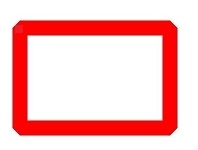 |

## CapStyle<sup>12+</sup>

Enumerates the cap styles of a pen. The cap style defines the style of both ends of a line segment drawn by the pen.

**System capability**: SystemCapability.Graphics.Drawing

| Name       | Value  | Description                                                        | Diagram  |
| ---------- | ---- | ----------------------------------------------------------- | -------- |
| FLAT_CAP   | 0    | There is no cap style. Both ends of the line segment are cut off square.| 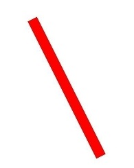 |
| SQUARE_CAP | 1    | Square cap style. Both ends have a square, the height of which is half of the width of the line segment, with the same width.| 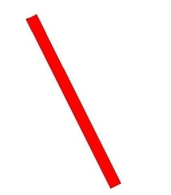 |
| ROUND_CAP  | 2    | Round cap style. Both ends have a semicircle centered, the diameter of which is the same as the width of the line segment.|  |

## BlurType<sup>12+</sup>

Enumerates the blur types of a mask filter.

**System capability**: SystemCapability.Graphics.Drawing

| Name  | Value| Description              | Diagram  |
| ------ | - | ------------------ | -------- |
| NORMAL | 0 | Blurs both inside and outside the original border.         |  |
| SOLID  | 1 | Draws solid inside the border, and blurs outside.|  |
| OUTER  | 2 | Draws nothing inside the border, and blurs outside.| 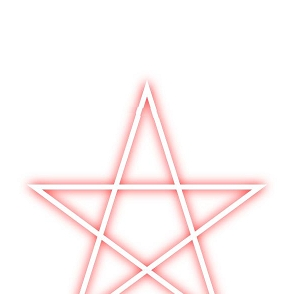 |
| INNER  | 3 | Blurs inside the border, and draws nothing outside.|  |

## SamplingOptions<sup>12+</sup>

Implements sampling options.

### constructor<sup>12+</sup>

constructor()

Creates a **SamplingOptions** object.

**System capability**: SystemCapability.Graphics.Drawing

**Example**

```ts
import { RenderNode } from '@kit.ArkUI';
import { common2D, drawing } from '@kit.ArkGraphics2D';
class DrawingRenderNode extends RenderNode {
  draw(context : DrawContext) {
    const canvas = context.canvas;
    const pen = new drawing.Pen();
    let samplingOptions = new drawing.SamplingOptions();
  }
}
```

### constructor<sup>12+</sup>

constructor(filterMode: FilterMode)

Creates a **SamplingOptions** object.

**System capability**: SystemCapability.Graphics.Drawing

**Parameters**

| Name    | Type                  | Mandatory| Description                                |
| ---------- | --------------------- | ---- | ----------------------------------- |
| filterMode | [FilterMode](#filtermode12)    | Yes  | Filter mode.                   |

**Error codes**

For details about the error codes, see [Universal Error Codes](../errorcode-universal.md).

| ID| Error Message|
| ------- | --------------------------------------------|
| 401 | Parameter error.Possible causes:1.Mandatory parameters are left unspecified;2.Incorrect parameter types. |

**Example**

```ts
import { RenderNode } from '@kit.ArkUI';
import { common2D, drawing } from '@kit.ArkGraphics2D';
class DrawingRenderNode extends RenderNode {
  draw(context : DrawContext) {
    const canvas = context.canvas;
    let samplingOptions = new drawing.SamplingOptions(drawing.FilterMode.FILTER_MODE_NEAREST);
  }
}
```

## Lattice<sup>12+</sup>

Implements a lattice object, which is used to divide an image by lattice.

### createImageLattice<sup>12+</sup>

static createImageLattice(xDivs: Array\<number>, yDivs: Array\<number>, fXCount: number, fYCount: number, fBounds?: common2D.Rect | null, fRectTypes?: Array\<RectType> | null, fColors?: Array\<common2D.Color> | null): Lattice

Divides the image into lattices. The lattices on both even columns and even rows are fixed, and they are drawn at their original size if the target is large enough. If the target is too small to hold the fixed lattices, all the fixed lattices are scaled down to fit the target, and the lattices that are not on even columns and even rows are scaled to accommodate the remaining space.

**System capability**: SystemCapability.Graphics.Drawing

**Parameters**

| Name      | Type                                                               | Mandatory| Description                                                                              |
| ------------ | ------------------------------------------------------------------ | ---- | --------------------------------------------------------------------------------- |
| xDivs        | Array\<number>                                                     | Yes  | Array of X coordinates used to divide the image. The value is an integer.                                            |
| yDivs        | Array\<number>                                                     | Yes  | Array of Y coordinates used to divide the image. The value is an integer.                                            |
| fXCount      | number                                                             | Yes  | Size of the array that holds the X coordinates. The value range is [0, 5].                           |
| fYCount      | number                                                             | Yes  | Size of the array that holds the Y coordinates. The value range is [0, 5].                           |
| fBounds      | [common2D.Rect](js-apis-graphics-common2D.md#rect)\|null           | No  | Source bounds to draw. The rectangle parameter must be an integer. The default value is the rectangle size of the original image. If the rectangle parameter is a decimal, the decimal part is discarded and converted into an integer.|
| fRectTypes   | Array\<[RectType](#recttype12)>\|null                              | No  | Array that holds the rectangle types. The default value is null. If this parameter is specified, the array size must be (fXCount + 1) * (fYCount + 1).|
| fColors      | Array\<[common2D.Color](js-apis-graphics-common2D.md#color)>\|null | No  | Array that holds the colors used to fill the lattices. The default value is null. If this parameter is specified, the array size must be (fXCount + 1) * (fYCount + 1).|

**Return value**

| Type                      | Description                               |
| ------------------------- | ----------------------------------- |
| [Lattice](#lattice12)     | **Lattice** object obtained.             |

**Error codes**

For details about the error codes, see [Universal Error Codes](../errorcode-universal.md).

| ID| Error Message|
| ------- | --------------------------------------------|
| 401 | Parameter error.Possible causes:1.Mandatory parameters are left unspecified;2.Incorrect parameter types;3.Parameter verification failed. |

**Example**

```ts
import { RenderNode } from '@kit.ArkUI';
import { drawing } from '@kit.ArkGraphics2D';
class DrawingRenderNode extends RenderNode {
  draw(context : DrawContext) {
    let xDivs : Array<number> = [1, 2, 4];
    let yDivs : Array<number> = [1, 2, 4];
    let lattice = drawing.Lattice.createImageLattice(xDivs, yDivs, 3, 3); // The image is divided into lattices of (3 + 1) x (3 + 1). The blue rectangles in the figure below are fixed lattices.
  }
}
```


### createImageLattice<sup>13+</sup>

static createImageLattice(xDivs: Array\<number>, yDivs: Array\<number>, fXCount: number, fYCount: number, fBounds?: common2D.Rect | null, fRectTypes?: Array\<RectType> | null, fColors?: Array\<number> | null): Lattice

Divides the image into lattices. The lattices on both even columns and even rows are fixed, and they are drawn at their original size if the target is large enough. If the target is too small to hold the fixed lattices, all the fixed lattices are scaled down to fit the target, and the lattices that are not on even columns and even rows are scaled to accommodate the remaining space.

**System capability**: SystemCapability.Graphics.Drawing

**Parameters**

| Name      | Type                                                               | Mandatory| Description                                                                              |
| ------------ | ------------------------------------------------------------------ | ---- | --------------------------------------------------------------------------------- |
| xDivs        | Array\<number>                                                     | Yes  | Array of X coordinates used to divide the image. The value is an integer.                                            |
| yDivs        | Array\<number>                                                     | Yes  | Array of Y coordinates used to divide the image. The value is an integer.                                            |
| fXCount      | number                                                             | Yes  | Size of the array that holds the X coordinates. The value range is [0, 5].                           |
| fYCount      | number                                                             | Yes  | Size of the array that holds the Y coordinates. The value range is [0, 5].                           |
| fBounds      | [common2D.Rect](js-apis-graphics-common2D.md#rect)\|null           | No  | Source bounds to draw. The rectangle parameter must be an integer. The default value is the rectangle size of the original image. If the rectangle parameter is a decimal, the decimal part is discarded and converted into an integer.|
| fRectTypes   | Array\<[RectType](#recttype12)>\|null                              | No  | Array that holds the rectangle types. The default value is null. If this parameter is specified, the array size must be (fXCount + 1) * (fYCount + 1).|
| fColors      | Array\<number>\|null | No  | Array that holds the colors used to fill the lattices. Each color is represented by a 32-bit unsigned integer in hexadecimal ARGB format. The default value is null. If this parameter is specified, the array size must be (fXCount + 1) * (fYCount + 1).|

**Return value**

| Type                      | Description                               |
| ------------------------- | ----------------------------------- |
| [Lattice](#lattice12)     | **Lattice** object obtained.             |

**Error codes**

For details about the error codes, see [Universal Error Codes](../errorcode-universal.md).

| ID| Error Message|
| ------- | --------------------------------------------|
| 401 | Parameter error.Possible causes:1.Mandatory parameters are left unspecified;2.Incorrect parameter types;3.Parameter verification failed. |

**Example**

```ts
import { RenderNode } from '@kit.ArkUI';
import { drawing } from '@kit.ArkGraphics2D';
class DrawingRenderNode extends RenderNode {
  draw(context : DrawContext) {
    let xDivs : Array<number> = [1, 2, 4];
    let yDivs : Array<number> = [1, 2, 4];
    let colorArray :Array<number>=[0xffffff,0x444444,0x999999,0xffffff,0x444444,0x999999,0xffffff,0x444444,0x999999,0x444444,0x999999,0xffffff,0x444444,0x999999,0xffffff,0x444444];
    let lattice = drawing.Lattice.createImageLattice(xDivs, yDivs, 3, 3,null,null,colorArray);
  }
}
```

## RectType<sup>12+</sup>

Enumerates the types of rectangles used to fill the lattices. This enum is used only in [Lattice](#lattice12).

**System capability**: SystemCapability.Graphics.Drawing

| Name        | Value  | Description                                                            |
| ------------ | ---- | --------------------------------------------------------------- |
| DEFAULT      | 0    | Draws an image into the lattice.                                         |
| TRANSPARENT  | 1    | Sets the lattice to transparent.                                         |
| FIXEDCOLOR   | 2    | Draws the colors in the **fColors** array in [Lattice](#lattice12) into the lattice.      |

## MaskFilter<sup>12+</sup>

Implements a mask filter.

### createBlurMaskFilter<sup>12+</sup>

static createBlurMaskFilter(blurType: BlurType, sigma: number): MaskFilter

Creates a mask filter with a blur effect.

**System capability**: SystemCapability.Graphics.Drawing

**Parameters**

| Name    | Type                  | Mandatory| Description                                |
| ---------- | --------------------- | ---- | ----------------------------------- |
| blurType   | [BlurType](#blurtype12) | Yes  | Blur type.                          |
| sigma      | number                | Yes  | Standard deviation of the Gaussian blur to apply. The value must be a floating point number greater than 0.|

**Return value**

| Type                     | Description               |
| ------------------------- | ------------------ |
| [MaskFilter](#maskfilter12) | **MaskFilter** object created.|

**Error codes**

For details about the error codes, see [Universal Error Codes](../errorcode-universal.md).

| ID| Error Message|
| ------- | --------------------------------------------|
| 401 | Parameter error.Possible causes:1.Mandatory parameters are left unspecified;2.Incorrect parameter types;3.Parameter verification failed. |

**Example**

```ts
import { RenderNode } from '@kit.ArkUI';
import { common2D, drawing } from '@kit.ArkGraphics2D';
class DrawingRenderNode extends RenderNode {
  draw(context : DrawContext) {
    const canvas = context.canvas;
    let maskFilter = drawing.MaskFilter.createBlurMaskFilter(drawing.BlurType.OUTER, 10);
  }
}
```

## PathEffect<sup>12+</sup>

Implements a path effect.

### createDashPathEffect<sup>12+</sup>

static createDashPathEffect(intervals:  Array\<number>, phase: number): PathEffect

Creates a **PathEffect** object that converts a path into a dotted line.

**System capability**: SystemCapability.Graphics.Drawing

**Parameters**

| Name    | Type          | Mandatory   | Description                                              |
| ---------- | ------------- | ------- | -------------------------------------------------- |
| intervals  | Array\<number> | Yes     | Array of ON and OFF lengths of dotted lines. The number of arrays must be an even number and be greater than or equal to 2.|
| phase      | number         | Yes     | Offset used during drawing. The value is a floating point number.                                    |

**Return value**

| Type                     | Description                  |
| ------------------------- | --------------------- |
| [PathEffect](#patheffect12) | **PathEffect** object created.|

**Error codes**

For details about the error codes, see [Universal Error Codes](../errorcode-universal.md).

| ID| Error Message|
| ------- | --------------------------------------------|
| 401 | Parameter error.Possible causes:1.Mandatory parameters are left unspecified;2.Incorrect parameter types;3.Parameter verification failed. |

**Example**

```ts
import { RenderNode } from '@kit.ArkUI';
import { common2D, drawing } from '@kit.ArkGraphics2D';
class DrawingRenderNode extends RenderNode {
  draw(context : DrawContext) {
    const canvas = context.canvas;
    let intervals = [10, 5];
    let effect = drawing.PathEffect.createDashPathEffect(intervals, 5);
  }
}
```

### createCornerPathEffect<sup>12+</sup>

static createCornerPathEffect(radius: number): PathEffect

Creates a path effect that transforms the sharp angle between line segments into a rounded corner with the specified radius.

**System capability**: SystemCapability.Graphics.Drawing

**Parameters**

| Name    | Type          | Mandatory   | Description                                              |
| ---------- | ------------- | ------- | -------------------------------------------------- |
| radius     | number        | Yes     | Radius of the rounded corner. The value must be greater than 0. The value is a floating point number.               |

**Return value**

| Type                     | Description                  |
| ------------------------- | --------------------- |
| [PathEffect](#patheffect12) | **PathEffect** object created.|

**Error codes**

For details about the error codes, see [Universal Error Codes](../errorcode-universal.md).

| ID| Error Message|
| ------- | --------------------------------------------|
| 401 | Parameter error.Possible causes:1.Mandatory parameters are left unspecified;2.Incorrect parameter types;3.Parameter verification failed. |

**Example**

```ts
import { RenderNode } from '@kit.ArkUI';
import { drawing } from '@kit.ArkGraphics2D';
class DrawingRenderNode extends RenderNode {
  draw(context : DrawContext) {
    const canvas = context.canvas;
    let effect = drawing.PathEffect.createCornerPathEffect(30);
  }
}
```

## ShadowLayer<sup>12+</sup>

Implements a shadow layer.

### create<sup>12+</sup>

static create(blurRadius: number, x: number, y: number, color: common2D.Color): ShadowLayer

Creates a **ShadowLayer** object.

**System capability**: SystemCapability.Graphics.Drawing

**Parameters**

| Name    | Type     | Mandatory| Description                                |
| ---------- | -------- | ---- | ----------------------------------- |
| blurRadius  | number   | Yes  | Radius of the shadow layer. The value must be a floating point number greater than 0.    |
| x           | number   | Yes  | Offset on the X axis. The value is a floating point number.       |
| y           | number   | Yes  | Offset on the Y axis. The value is a floating point number.       |
| color       | [common2D.Color](js-apis-graphics-common2D.md#color) | Yes  | Color in ARGB format. Each color channel is an integer ranging from 0 to 255.|

**Return value**

| Type                       | Description                 |
| --------------------------- | -------------------- |
| [ShadowLayer](#shadowlayer12) | **ShadowLayer** object created.|

**Error codes**

For details about the error codes, see [Universal Error Codes](../errorcode-universal.md).

| ID| Error Message|
| ------- | --------------------------------------------|
| 401 | Parameter error.Possible causes:1.Mandatory parameters are left unspecified;2.Incorrect parameter types;3.Parameter verification failed. |

**Example**

```ts
import { RenderNode } from '@kit.ArkUI';
import { common2D, drawing } from '@kit.ArkGraphics2D';
class DrawingRenderNode extends RenderNode {
  draw(context : DrawContext) {
    const canvas = context.canvas;
    let color : common2D.Color = {alpha: 0xFF, red: 0x00, green: 0xFF, blue: 0x00};
    let shadowLayer = drawing.ShadowLayer.create(3, -3, 3, color);
  }
}
```

## Pen

Defines a pen, which is used to describe the style and color to outline a shape.

### constructor<sup>12+</sup>

constructor()

A constructor used to create a **Pen** object.

**System capability**: SystemCapability.Graphics.Drawing

**Example**

```ts
import { drawing } from '@kit.ArkGraphics2D';

const pen = new drawing.Pen();
```

### constructor<sup>12+</sup>

constructor(pen: Pen)

Copies a **Pen** object to create a new one.

**System capability**: SystemCapability.Graphics.Drawing

**Parameters**

| Name| Type       | Mandatory| Description             |
| ------| ----------- | ---- | ---------------- |
| pen     | [Pen](#pen) | Yes  | **Pen** object to copy.|

**Error codes**

For details about the error codes, see [Universal Error Codes](../errorcode-universal.md).

| ID| Error Message|
| ------- | --------------------------------------------|
| 401 | Parameter error.Possible causes:1.Mandatory parameters are left unspecified;2.Incorrect parameter types. |

**Example**

```ts
import { common2D, drawing } from '@kit.ArkGraphics2D';

const pen = new drawing.Pen();
const penColor: common2D.Color = { alpha: 255, red: 0, green: 255, blue: 0 };
pen.setColor(penColor);
pen.setStrokeWidth(10);
const newPen = new drawing.Pen(pen);
```

### setMiterLimit<sup>12+</sup>

setMiterLimit(miter: number): void

Sets the maximum ratio allowed between the sharp corner length of a polyline and its line width. When drawing a polyline with the pen, if [JoinStyle](#joinstyle12) is set to **MITER_JOIN** and this maximum ratio is exceeded, the corner will be displayed as beveled instead of mitered.

**System capability**: SystemCapability.Graphics.Drawing

**Parameters**

| Name| Type   | Mandatory| Description             |
| ------ | ------ | ---- | ---------------- |
| miter  | number | Yes  | Maximum ratio of the sharp corner length of the polyline to the line width. A negative number is processed as 4.0 during drawing. Non-negative numbers take effect normally. The value is a floating point number.|

**Error codes**

For details about the error codes, see [Universal Error Codes](../errorcode-universal.md).

| ID| Error Message|
| ------- | --------------------------------------------|
| 401 | Parameter error.Possible causes:1.Mandatory parameters are left unspecified;2.Incorrect parameter types. |

**Example**

```ts
import { drawing } from '@kit.ArkGraphics2D';

const pen = new drawing.Pen();
pen.setMiterLimit(5);
```

### getMiterLimit<sup>12+</sup>

getMiterLimit(): number

Obtains the maximum ratio allowed between the sharp corner length of a polyline and its line width.

**System capability**: SystemCapability.Graphics.Drawing

**Return value**

| Type  | Description                |
| -------| -------------------- |
| number | Maximum ratio obtained.|

**Example**

```ts
import { drawing } from '@kit.ArkGraphics2D';

const pen = new drawing.Pen();
let miter = pen.getMiterLimit();
```

### setImageFilter<sup>12+</sup>

setImageFilter(filter: ImageFilter | null): void

Sets an image filter for this pen.

**System capability**: SystemCapability.Graphics.Drawing

**Parameters**

| Name| Type  | Mandatory| Description                   |
| ------ | ------ | ---- | ----------------------- |
| filter    | [ImageFilter](#imagefilter12) \| null | Yes  |  Image filter. If null is passed in, the image filter effect of the pen will be cleared.|

**Error codes**

For details about the error codes, see [Universal Error Codes](../errorcode-universal.md).

| ID| Error Message|
| ------- | --------------------------------------------|
| 401 | Parameter error. Possible causes: 1. Mandatory parameters are left unspecified;2. Incorrect parameter types. |

**Example**

```ts
import {drawing} from '@kit.ArkGraphics2D';
let colorfilter = drawing.ColorFilter.createSRGBGammaToLinear();
let imgFilter = drawing.ImageFilter.createFromColorFilter(colorfilter);
let pen = new drawing.Pen();
pen.setImageFilter(imgFilter);
pen.setImageFilter(null);
```

### getColorFilter<sup>12+</sup>

getColorFilter(): ColorFilter

Obtains the color filter of this pen.

**System capability**: SystemCapability.Graphics.Drawing

**Return value**

| Type                       | Description              |
| --------------------------- | ------------------ |
| [ColorFilter](#colorfilter) | Color filter.|

**Example**

```ts 
import {drawing} from '@kit.ArkGraphics2D';
let pen = new drawing.Pen();
let colorfilter = drawing.ColorFilter.createLumaColorFilter();
pen.setColorFilter(colorfilter);
let filter = pen.getColorFilter();
```

### setColor

setColor(color: common2D.Color) : void

Sets a color for this pen.

**System capability**: SystemCapability.Graphics.Drawing

**Parameters**

| Name| Type                                                | Mandatory| Description            |
| ------ | ---------------------------------------------------- | ---- | ---------------- |
| color  | [common2D.Color](js-apis-graphics-common2D.md#color) | Yes  | Color in ARGB format. Each color channel is an integer ranging from 0 to 255.|

**Error codes**

For details about the error codes, see [Universal Error Codes](../errorcode-universal.md).

| ID| Error Message|
| ------- | --------------------------------------------|
| 401 | Parameter error.Possible causes:1.Mandatory parameters are left unspecified;2.Incorrect parameter types;3.Parameter verification failed. |

**Example**

```ts
import { common2D, drawing } from '@kit.ArkGraphics2D';
const color : common2D.Color = { alpha: 255, red: 255, green: 0, blue: 0 };
const pen = new drawing.Pen();
pen.setColor(color);
```

### setColor<sup>12+</sup>

setColor(alpha: number, red: number, green: number, blue: number): void

Sets a color for this pen. This API provides better performance than [setColor](#setcolor) and is recommended.

**System capability**: SystemCapability.Graphics.Drawing

**Parameters**

| Name| Type   | Mandatory| Description                                               |
| ------ | ------ | ---- | -------------------------------------------------- |
| alpha  | number | Yes  | Alpha channel value of the color in ARGB format. The value is an integer ranging from 0 to 255. Any passed-in floating point number is rounded down.|
| red    | number | Yes  | Red channel value of the color in ARGB format. The value is an integer ranging from 0 to 255. Any passed-in floating point number is rounded down.  |
| green  | number | Yes  | Green channel value of the color in ARGB format. The value is an integer ranging from 0 to 255. Any passed-in floating point number is rounded down.  |
| blue   | number | Yes  | Blue channel value of the color in ARGB format. The value is an integer ranging from 0 to 255. Any passed-in floating point number is rounded down.  |

**Error codes**

For details about the error codes, see [Universal Error Codes](../errorcode-universal.md).

| ID| Error Message|
| ------- | --------------------------------------------|
| 401 | Parameter error.Possible causes:1.Mandatory parameters are left unspecified;2.Incorrect parameter types. |

**Example**

```ts
import { drawing } from '@kit.ArkGraphics2D';
const pen = new drawing.Pen();
pen.setColor(255, 255, 0, 0);
```

### getColor<sup>12+</sup>

getColor(): common2D.Color

Obtains the color of this pen.

**System capability**: SystemCapability.Graphics.Drawing

**Return value**

| Type          | Description           |
| -------------- | -------------- |
| common2D.Color | Color of the pen.|

**Example**

```ts
import { common2D, drawing } from '@kit.ArkGraphics2D';

const color : common2D.Color = { alpha: 255, red: 255, green: 0, blue: 0 };
const pen = new drawing.Pen();
pen.setColor(color);
let colorGet = pen.getColor();
```

### getHexColor<sup>13+</sup>

getHexColor(): number

Obtains the color of this pen.

**System capability**: SystemCapability.Graphics.Drawing

**Return value**

| Type          | Description           |
| -------------- | -------------- |
| number | Color, represented as a 32-bit unsigned integer in hexadecimal ARGB format.|

**Example**

```ts
import { common2D, drawing } from '@kit.ArkGraphics2D';

let color : common2D.Color = { alpha: 255, red: 255, green: 0, blue: 0 };
let pen = new drawing.Pen();
pen.setColor(color);
let hex_color: number = pen.getHexColor();
console.info('getHexColor: ', hex_color.toString(16));
```

### setStrokeWidth

setStrokeWidth(width: number) : void

Sets the stroke width for this pen. The value **0** is treated as an unusually thin width. During drawing, the width of 0 is always drawn as 1 pixel wide, regardless of any scaling applied to the canvas. Negative values are also regarded as the value **0** during the drawing process.

**System capability**: SystemCapability.Graphics.Drawing

**Parameters**

| Name| Type  | Mandatory| Description            |
| ------ | ------ | ---- | ---------------- |
| width  | number | Yes  | Stroke width. The value is a floating point number.|

**Error codes**

For details about the error codes, see [Universal Error Codes](../errorcode-universal.md).

| ID| Error Message|
| ------- | --------------------------------------------|
| 401 | Parameter error.Possible causes:1.Mandatory parameters are left unspecified;2.Incorrect parameter types. |

**Example**

```ts
import { drawing } from '@kit.ArkGraphics2D';
const pen = new drawing.Pen();
pen.setStrokeWidth(5);
```

### getWidth<sup>12+</sup>

getWidth(): number

Obtains the stroke width of this pen. The width describes the thickness of the outline of a shape.

**System capability**: SystemCapability.Graphics.Drawing

**Return value**

| Type  | Description           |
| ------ | -------------- |
| number | Stroke width of the pen.|

**Example**

```ts
import { drawing } from '@kit.ArkGraphics2D';

const pen = new drawing.Pen();
let width = pen.getWidth();
```

### setAntiAlias

setAntiAlias(aa: boolean) : void

Enables anti-aliasing for this pen. Anti-aliasing makes the edges of the content smoother.

**System capability**: SystemCapability.Graphics.Drawing

**Parameters**

| Name| Type   | Mandatory| Description                                             |
| ------ | ------- | ---- | ------------------------------------------------- |
| aa     | boolean | Yes  | Whether to enable anti-aliasing. The value **true** means to enable anti-aliasing, and **false** means the opposite.|

**Error codes**

For details about the error codes, see [Universal Error Codes](../errorcode-universal.md).

| ID| Error Message|
| ------- | --------------------------------------------|
| 401 | Parameter error.Possible causes:1.Mandatory parameters are left unspecified;2.Incorrect parameter types. |

**Example**

```ts
import { drawing } from '@kit.ArkGraphics2D';
const pen = new drawing.Pen();
pen.setAntiAlias(true);
```

### isAntiAlias<sup>12+</sup>

isAntiAlias(): boolean

Checks whether anti-aliasing is enabled for this pen.

**System capability**: SystemCapability.Graphics.Drawing

**Return value**

| Type   | Description                      |
| ------- | ------------------------- |
| boolean | Result indicating whether anti-aliasing is enabled. The value **true** means that anti-aliasing is enabled, and **false** means the opposite.|

**Example**

```ts
import { drawing } from '@kit.ArkGraphics2D';

const pen = new drawing.Pen();
let isAntiAlias = pen.isAntiAlias();
```

### setAlpha

setAlpha(alpha: number) : void

Sets an alpha value for this pen.

**System capability**: SystemCapability.Graphics.Drawing

**Parameters**

| Name| Type  | Mandatory| Description                                    |
| ------ | ------ | ---- | ---------------------------------------- |
| alpha  | number | Yes  | Alpha value. The value is an integer in the range [0, 255]. If a floating point number is passed in, the value is rounded down.|

**Error codes**

For details about the error codes, see [Universal Error Codes](../errorcode-universal.md).

| ID| Error Message|
| ------- | --------------------------------------------|
| 401 | Parameter error.Possible causes:1.Mandatory parameters are left unspecified;2.Incorrect parameter types;3.Parameter verification failed. |

**Example**

```ts
import { drawing } from '@kit.ArkGraphics2D';
const pen = new drawing.Pen();
pen.setAlpha(128);
```

### getAlpha<sup>12+</sup>

getAlpha(): number

Obtains the alpha value of this pen.

**System capability**: SystemCapability.Graphics.Drawing

**Return value**

| Type  | Description             |
| ------ | ---------------- |
| number | Alpha value of the pen. The return value is an integer ranging from 0 to 255.|

**Example**

```ts
import { drawing } from '@kit.ArkGraphics2D';

const pen = new drawing.Pen();
let alpha = pen.getAlpha();
```

### setColorFilter

setColorFilter(filter: ColorFilter) : void

Sets a color filter for this pen.

**System capability**: SystemCapability.Graphics.Drawing

**Parameters**

| Name| Type                       | Mandatory| Description        |
| ------ | --------------------------- | ---- | ------------ |
| filter | [ColorFilter](#colorfilter) | Yes  | Color filter. If null is passed in, the color filter is cleared.|

**Error codes**

For details about the error codes, see [Universal Error Codes](../errorcode-universal.md).

| ID| Error Message|
| ------- | --------------------------------------------|
| 401 | Parameter error.Possible causes:1.Mandatory parameters are left unspecified;2.Incorrect parameter types. |

**Example**

```ts
import { drawing } from '@kit.ArkGraphics2D';
const pen = new drawing.Pen();
let colorFilter = drawing.ColorFilter.createLinearToSRGBGamma();
pen.setColorFilter(colorFilter);
```

### setMaskFilter<sup>12+</sup>

setMaskFilter(filter: MaskFilter): void

Adds a mask filter for this pen.

**System capability**: SystemCapability.Graphics.Drawing

**Parameters**

| Name| Type                      | Mandatory| Description     |
| ------ | ------------------------- | ---- | --------- |
| filter | [MaskFilter](#maskfilter12) | Yes  | Mask filter. If null is passed in, the mask filter is cleared.|

**Error codes**

For details about the error codes, see [Universal Error Codes](../errorcode-universal.md).

| ID| Error Message|
| ------- | --------------------------------------------|
| 401 | Parameter error.Possible causes:1.Mandatory parameters are left unspecified;2.Incorrect parameter types. |

**Example**

```ts
import { RenderNode } from '@kit.ArkUI';
import { common2D, drawing } from '@kit.ArkGraphics2D';
class DrawingRenderNode extends RenderNode {
  draw(context : DrawContext) {
    const canvas = context.canvas;
    const pen = new drawing.Pen();
    pen.setStrokeWidth(5);
    pen.setColor({alpha: 255, red: 255, green: 0, blue: 0});
    let maskFilter = drawing.MaskFilter.createBlurMaskFilter(drawing.BlurType.OUTER, 10);
    pen.setMaskFilter(maskFilter);
  }
}
```

### setPathEffect<sup>12+</sup>

setPathEffect(effect: PathEffect): void

Sets the path effect for this pen.

**System capability**: SystemCapability.Graphics.Drawing

**Parameters**

| Name | Type                      | Mandatory| Description        |
| ------- | ------------------------- | ---- | ------------ |
| effect  | [PathEffect](#patheffect12) | Yes  | Path effect. If null is passed in, the path filter is cleared.|

**Error codes**

For details about the error codes, see [Universal Error Codes](../errorcode-universal.md).

| ID| Error Message|
| ------- | --------------------------------------------|
| 401 | Parameter error.Possible causes:1.Mandatory parameters are left unspecified;2.Incorrect parameter types. |

**Example**

```ts
import { RenderNode } from '@kit.ArkUI';
import { common2D, drawing } from '@kit.ArkGraphics2D';
class DrawingRenderNode extends RenderNode {
  draw(context : DrawContext) {
    const canvas = context.canvas;
    const pen = new drawing.Pen();
    pen.setStrokeWidth(5);
    pen.setColor({alpha: 255, red: 255, green: 0, blue: 0});
    let pathEffect = drawing.PathEffect.createDashPathEffect([30, 10], 0);
    pen.setPathEffect(pathEffect);
  }
}
```

### setShaderEffect<sup>12+</sup>

setShaderEffect(shaderEffect: ShaderEffect): void

Sets the shader effect for this pen.

**System capability**: SystemCapability.Graphics.Drawing

**Parameters**

| Name | Type                      | Mandatory| Description        |
| ------- | ------------------------- | ---- | ------------ |
| shaderEffect  | [ShaderEffect](#shadereffect12) | Yes  | **ShaderEffect** object. If null is passed in, the shader effect will be cleared.|

**Error codes**

For details about the error codes, see [Universal Error Codes](../errorcode-universal.md).

| ID| Error Message|
| ------- | --------------------------------------------|
| 401 | Parameter error.Possible causes:1.Mandatory parameters are left unspecified;2.Incorrect parameter types. |

**Example**

```ts
import { drawing } from '@kit.ArkGraphics2D';

const pen = new drawing.Pen();
let shaderEffect = drawing.ShaderEffect.createLinearGradient({x: 100, y: 100}, {x: 300, y: 300}, [0xFF00FF00, 0xFFFF0000], drawing.TileMode.REPEAT);
pen.setShaderEffect(shaderEffect);
```

### setShadowLayer<sup>12+</sup>

setShadowLayer(shadowLayer: ShadowLayer): void

Sets a shadow layer for this pen. The shadow layer effect takes effect only when text is drawn.

**System capability**: SystemCapability.Graphics.Drawing

**Parameters**

| Name | Type                      | Mandatory| Description     |
| ------- | ------------------------- | ---- | --------- |
| shadowLayer  | [ShadowLayer](#shadowlayer12) | Yes  | Shadow layer. If null is passed in, the shadow layer is cleared.|

**Error codes**

For details about the error codes, see [Universal Error Codes](../errorcode-universal.md).

| ID| Error Message|
| ------- | --------------------------------------------|
| 401 | Parameter error.Possible causes:1.Mandatory parameters are left unspecified;2.Incorrect parameter types. |

**Example**

```ts
import { RenderNode } from '@kit.ArkUI';
import { common2D, drawing } from '@kit.ArkGraphics2D';
class DrawingRenderNode extends RenderNode {
  draw(context : DrawContext) {
    const canvas = context.canvas;
    let font = new drawing.Font();
    font.setSize(60);
    let textBlob = drawing.TextBlob.makeFromString("hello", font, drawing.TextEncoding.TEXT_ENCODING_UTF8);
    let pen = new drawing.Pen();
    pen.setStrokeWidth(2.0);
    let pen_color : common2D.Color = {alpha: 0xFF, red: 0xFF, green: 0x00, blue: 0x00};
    pen.setColor(pen_color);
    canvas.attachPen(pen);
    canvas.drawTextBlob(textBlob, 100, 100);
    canvas.detachPen();
    let color : common2D.Color = {alpha: 0xFF, red: 0x00, green: 0xFF, blue: 0x00};
    let shadowLayer = drawing.ShadowLayer.create(3, -3, 3, color);
    pen.setShadowLayer(shadowLayer);
    canvas.attachPen(pen);
    canvas.drawTextBlob(textBlob, 100, 200);
    canvas.detachPen();
  }
}
```

### setBlendMode

setBlendMode(mode: BlendMode) : void

Sets a blend mode for this pen.

**System capability**: SystemCapability.Graphics.Drawing

**Parameters**

| Name| Type                   | Mandatory| Description            |
| ------ | ----------------------- | ---- | ---------------- |
| mode   | [BlendMode](#blendmode) | Yes  | Blend mode.|

**Error codes**

For details about the error codes, see [Universal Error Codes](../errorcode-universal.md).

| ID| Error Message|
| ------- | --------------------------------------------|
| 401 | Parameter error.Possible causes:1.Mandatory parameters are left unspecified;2.Incorrect parameter types;3.Parameter verification failed. |

**Example**

```ts
import { drawing } from '@kit.ArkGraphics2D';
const pen = new drawing.Pen();
pen.setBlendMode(drawing.BlendMode.SRC);
```

### setJoinStyle<sup>12+</sup>

setJoinStyle(style: JoinStyle): void

Sets the join style for this pen.

**System capability**: SystemCapability.Graphics.Drawing

**Parameters**

| Name| Type                    | Mandatory| Description            |
| ------ | ----------------------- | ---- | --------------- |
| style  | [JoinStyle](#joinstyle12) | Yes  | Join style.    |

**Error codes**

For details about the error codes, see [Universal Error Codes](../errorcode-universal.md).

| ID| Error Message|
| ------- | --------------------------------------------|
| 401 | Parameter error.Possible causes:1.Mandatory parameters are left unspecified;2.Incorrect parameter types;3.Parameter verification failed. |

**Example**

```ts
import { RenderNode } from '@kit.ArkUI';
import { common2D, drawing } from '@kit.ArkGraphics2D';
class DrawingRenderNode extends RenderNode {
  draw(context : DrawContext) {
    const canvas = context.canvas;
    const pen = new drawing.Pen();
    pen.setStrokeWidth(5);
    pen.setColor({alpha: 255, red: 255, green: 0, blue: 0});
    pen.setJoinStyle(drawing.JoinStyle.ROUND_JOIN);
  }
}
```

### getJoinStyle<sup>12+</sup>

getJoinStyle(): JoinStyle

Obtains the join style of this pen.

**System capability**: SystemCapability.Graphics.Drawing

**Return value**

| Type         | Description                   |
| ------------- | ---------------------- |
| JoinStyle | Join style.        |

**Example**

```ts
import { RenderNode } from '@kit.ArkUI';
import { common2D, drawing } from '@kit.ArkGraphics2D';
class DrawingRenderNode extends RenderNode {
  draw(context : DrawContext) {
    const canvas = context.canvas;
    const pen = new drawing.Pen();
    pen.setStrokeWidth(5);
    pen.setColor({alpha: 255, red: 255, green: 0, blue: 0});
    pen.setJoinStyle(drawing.JoinStyle.ROUND_JOIN);
    let joinStyle = pen.getJoinStyle();
  }
}
```

### setCapStyle<sup>12+</sup>

setCapStyle(style: CapStyle): void

Sets the cap style for this pen.

**System capability**: SystemCapability.Graphics.Drawing

**Parameters**

| Name| Type                    | Mandatory| Description                  |
| ------ | ----------------------- | ---- | --------------------- |
| style  | [CapStyle](#capstyle12)   | Yes  | A variable that describes the cap style.   |

**Error codes**

For details about the error codes, see [Universal Error Codes](../errorcode-universal.md).

| ID| Error Message|
| ------- | --------------------------------------------|
| 401 | Parameter error.Possible causes:1.Mandatory parameters are left unspecified;2.Incorrect parameter types;3.Parameter verification failed. |

**Example**

```ts
import { RenderNode } from '@kit.ArkUI';
import { common2D, drawing } from '@kit.ArkGraphics2D';
class DrawingRenderNode extends RenderNode {
  draw(context : DrawContext) {
    const canvas = context.canvas;
    const pen = new drawing.Pen();
    pen.setStrokeWidth(5);
    pen.setColor({alpha: 255, red: 255, green: 0, blue: 0});
    pen.setCapStyle(drawing.CapStyle.SQUARE_CAP);
  }
}
```

### getCapStyle<sup>12+</sup>

getCapStyle(): CapStyle

Obtains the cap style of this pen.

**System capability**: SystemCapability.Graphics.Drawing

**Return value**

| Type        | Description               |
| ------------ | ------------------ |
| CapStyle     | Cap style.|

**Example**

```ts
import { RenderNode } from '@kit.ArkUI';
import { common2D, drawing } from '@kit.ArkGraphics2D';
class DrawingRenderNode extends RenderNode {
  draw(context : DrawContext) {
    const canvas = context.canvas;
    const pen = new drawing.Pen();
    pen.setStrokeWidth(5);
    pen.setColor({alpha: 255, red: 255, green: 0, blue: 0});
    pen.setCapStyle(drawing.CapStyle.SQUARE_CAP);
    let capStyle = pen.getCapStyle();
  }
}
```

### setDither

setDither(dither: boolean) : void

Enables dithering for this pen. Dithering make the drawn color more realistic.

**System capability**: SystemCapability.Graphics.Drawing

**Parameters**

| Name| Type   | Mandatory| Description                                                     |
| ------ | ------- | ---- | --------------------------------------------------------- |
| dither | boolean | Yes  | Whether to enable dithering. The value **true** means to enable dithering, and **false** means the opposite.|

**Error codes**

For details about the error codes, see [Universal Error Codes](../errorcode-universal.md).

| ID| Error Message|
| ------- | --------------------------------------------|
| 401 | Parameter error.Possible causes:1.Mandatory parameters are left unspecified;2.Incorrect parameter types. |

**Example**

```ts
import { drawing } from '@kit.ArkGraphics2D';
const pen = new drawing.Pen();
pen.setDither(true);
```

### getFillPath<sup>12+</sup>

getFillPath(src: Path, dst: Path): boolean

Obtains the source path outline drawn using this pen and represents it using a destination path.

**System capability**: SystemCapability.Graphics.Drawing

**Parameters**

| Name  | Type                                        | Mandatory| Description                           |
| -------- | -------------------------------------------- | ---- | ------------------------------- |
| src | [Path](#path) | Yes  | Source path.                |
| dst     | [Path](#path)                | Yes  | Destination path.|

**Return value**

| Type                 | Description          |
| --------------------- | -------------- |
| boolean | Result indicating whether the source path outline is obtained. The value **true** means that the source path outline is obtained, and **false** means the opposite.|

**Error codes**

For details about the error codes, see [Universal Error Codes](../errorcode-universal.md).

| ID| Error Message|
| ------- | --------------------------------------------|
| 401 | Parameter error.Possible causes:1.Mandatory parameters are left unspecified;2.Incorrect parameter types. |

**Example**

```ts
import { drawing } from '@kit.ArkGraphics2D';
let pen = new drawing.Pen();
let pathSrc: drawing.Path = new drawing.Path();
let pathDst: drawing.Path = new drawing.Path();
pathSrc.moveTo(0, 0);
pathSrc.lineTo(700, 700);
let value = pen.getFillPath(pathSrc, pathDst);
```

### reset<sup>12+</sup>

reset(): void

Resets this pen to the initial state.

**System capability**: SystemCapability.Graphics.Drawing

**Example**

```ts
import { drawing } from '@kit.ArkGraphics2D';

const pen = new drawing.Pen();
pen.reset();
```

## Brush

Defines a brush, which is used to describe the style and color to fill in a shape.

### constructor<sup>12+</sup>

constructor()

A constructor used to create a **Brush** object.

**System capability**: SystemCapability.Graphics.Drawing

**Example**

```ts
import { drawing } from '@kit.ArkGraphics2D';

const brush = new drawing.Brush();
```

### constructor<sup>12+</sup>

constructor(brush: Brush)

Copies a **Brush** object to create a new one.

**System capability**: SystemCapability.Graphics.Drawing

**Parameters**

| Name| Type       | Mandatory| Description             |
| ------| ----------- | ---- | ---------------- |
| brush     | [Brush](#brush) | Yes  | **Brush** object to copy.|

**Error codes**

For details about the error codes, see [Universal Error Codes](../errorcode-universal.md).

| ID| Error Message|
| ------- | --------------------------------------------|
| 401 | Parameter error.Possible causes:1.Mandatory parameters are left unspecified;2.Incorrect parameter types. |

**Example**

```ts
import { common2D, drawing } from '@kit.ArkGraphics2D';

const brush = new drawing.Brush();
const brushColor: common2D.Color = { alpha: 255, red: 0, green: 255, blue: 0 };
brush.setColor(brushColor);
const newBrush = new drawing.Brush(brush);
```

### setColor

setColor(color: common2D.Color) : void

Sets a color for this brush.

**System capability**: SystemCapability.Graphics.Drawing

**Parameters**

| Name| Type                                                | Mandatory| Description            |
| ------ | ---------------------------------------------------- | ---- | ---------------- |
| color  | [common2D.Color](js-apis-graphics-common2D.md#color) | Yes  | Color in ARGB format. Each color channel is an integer ranging from 0 to 255.|

**Error codes**

For details about the error codes, see [Universal Error Codes](../errorcode-universal.md).

| ID| Error Message|
| ------- | --------------------------------------------|
| 401 | Parameter error.Possible causes:1.Mandatory parameters are left unspecified;2.Incorrect parameter types;3.Parameter verification failed. |

**Example**

```ts
import { common2D, drawing } from '@kit.ArkGraphics2D';
const color : common2D.Color = { alpha: 255, red: 255, green: 0, blue: 0 };
const brush = new drawing.Brush();
brush.setColor(color);
```

### setColor<sup>12+</sup>

setColor(alpha: number, red: number, green: number, blue: number): void

Sets a color for this brush. This API provides better performance than [setColor](#setcolor-1) and is recommended.

**System capability**: SystemCapability.Graphics.Drawing
 
**Parameters**

| Name| Type   | Mandatory| Description                                              |
| ------ | ------ | ---- | -------------------------------------------------- |
| alpha  | number | Yes  | Alpha channel value of the color in ARGB format. The value is an integer ranging from 0 to 255. Any passed-in floating point number is rounded down.|
| red    | number | Yes  | Red channel value of the color in ARGB format. The value is an integer ranging from 0 to 255. Any passed-in floating point number is rounded down.  |
| green  | number | Yes  | Green channel value of the color in ARGB format. The value is an integer ranging from 0 to 255. Any passed-in floating point number is rounded down.  |
| blue   | number | Yes  | Blue channel value of the color in ARGB format. The value is an integer ranging from 0 to 255. Any passed-in floating point number is rounded down.  |

**Error codes**

For details about the error codes, see [Universal Error Codes](../errorcode-universal.md).

| ID| Error Message|
| ------- | --------------------------------------------|
| 401 | Parameter error.Possible causes:1.Mandatory parameters are left unspecified;2.Incorrect parameter types;3.Parameter verification failed. |

**Example**

```ts
import { drawing } from '@kit.ArkGraphics2D';
const brush = new drawing.Brush();
brush.setColor(255, 255, 0, 0);
```

### getColor<sup>12+</sup>

getColor(): common2D.Color

Obtains the color of this brush.

**System capability**: SystemCapability.Graphics.Drawing

**Return value**

| Type          | Description           |
| -------------- | -------------- |
| common2D.Color | Color of the brush.|

**Example**

```ts
import { common2D, drawing } from '@kit.ArkGraphics2D';

const color : common2D.Color = { alpha: 255, red: 255, green: 0, blue: 0 };
const brush = new drawing.Brush();
brush.setColor(color);
let colorGet = brush.getColor();
```

### getHexColor<sup>13+</sup>

Obtains the color of this brush.

**System capability**: SystemCapability.Graphics.Drawing

**Return value**

| Type          | Description           |
| -------------- | -------------- |
| number | Color, represented as a 32-bit unsigned integer in hexadecimal ARGB format.|

**Example**

```ts
import { common2D, drawing } from '@kit.ArkGraphics2D';

let color : common2D.Color = { alpha: 255, red: 255, green: 0, blue: 0 };
let brush = new drawing.Brush();
brush.setColor(color);
let hex_color: number = brush.getHexColor();
console.info('getHexColor: ', hex_color.toString(16));
```

### setAntiAlias

setAntiAlias(aa: boolean) : void

Enables anti-aliasing for this brush. Anti-aliasing makes the edges of the content smoother.

**System capability**: SystemCapability.Graphics.Drawing

**Parameters**

| Name| Type   | Mandatory| Description                                             |
| ------ | ------- | ---- | ------------------------------------------------- |
| aa     | boolean | Yes  | Whether to enable anti-aliasing. The value **true** means to enable anti-aliasing, and **false** means the opposite.|

**Error codes**

For details about the error codes, see [Universal Error Codes](../errorcode-universal.md).

| ID| Error Message|
| ------- | --------------------------------------------|
| 401 | Parameter error.Possible causes:1.Mandatory parameters are left unspecified;2.Incorrect parameter types. |

**Example**

```ts
import { drawing } from '@kit.ArkGraphics2D';
const brush = new drawing.Brush();
brush.setAntiAlias(true);
```

### isAntiAlias<sup>12+</sup>

isAntiAlias(): boolean

Checks whether anti-aliasing is enabled for this brush.

**System capability**: SystemCapability.Graphics.Drawing

**Return value**

| Type   | Description                      |
| ------- | ------------------------- |
| boolean | Result indicating whether anti-aliasing is enabled. The value **true** means that anti-aliasing is enabled, and **false** means the opposite.|

**Example**

```ts
import { drawing } from '@kit.ArkGraphics2D';

const brush = new drawing.Brush();
let isAntiAlias = brush.isAntiAlias();
```

### setAlpha

setAlpha(alpha: number) : void

Sets an alpha value for this brush.

**System capability**: SystemCapability.Graphics.Drawing

**Parameters**

| Name| Type  | Mandatory| Description                                    |
| ------ | ------ | ---- | ---------------------------------------- |
| alpha  | number | Yes  | Alpha value. The value is an integer in the range [0, 255]. If a floating point number is passed in, the value is rounded down.|

**Error codes**

For details about the error codes, see [Universal Error Codes](../errorcode-universal.md).

| ID| Error Message|
| ------- | --------------------------------------------|
| 401 | Parameter error.Possible causes:1.Mandatory parameters are left unspecified;2.Incorrect parameter types;3.Parameter verification failed. |

**Example**

```ts
import { drawing } from '@kit.ArkGraphics2D';
const brush = new drawing.Brush();
brush.setAlpha(128);
```

### getAlpha<sup>12+</sup>

getAlpha(): number

Obtains the alpha value of this brush.

**System capability**: SystemCapability.Graphics.Drawing

**Return value**

| Type  | Description             |
| ------ | ---------------- |
| number | Alpha value of the brush. The return value is an integer ranging from 0 to 255.|

**Example**

```ts
import { drawing } from '@kit.ArkGraphics2D';

const brush = new drawing.Brush();
let alpha = brush.getAlpha();
```

### setColorFilter

setColorFilter(filter: ColorFilter) : void

Sets a color filter for this brush.

**System capability**: SystemCapability.Graphics.Drawing

**Parameters**

| Name| Type                       | Mandatory| Description        |
| ------ | --------------------------- | ---- | ------------ |
| filter | [ColorFilter](#colorfilter) | Yes  | Color filter. If null is passed in, the color filter is cleared.|

**Error codes**

For details about the error codes, see [Universal Error Codes](../errorcode-universal.md).

| ID| Error Message|
| ------- | --------------------------------------------|
| 401 | Parameter error.Possible causes:1.Mandatory parameters are left unspecified;2.Incorrect parameter types. |

**Example**

```ts
import { drawing } from '@kit.ArkGraphics2D';
const brush = new drawing.Brush();
let colorFilter = drawing.ColorFilter.createLinearToSRGBGamma();
brush.setColorFilter(colorFilter);
```

### setMaskFilter<sup>12+</sup>

setMaskFilter(filter: MaskFilter): void

Adds a mask filter for this brush.

**System capability**: SystemCapability.Graphics.Drawing

**Parameters**

| Name| Type                      | Mandatory| Description     |
| ------ | ------------------------- | ---- | --------- |
| filter | [MaskFilter](#maskfilter12) | Yes  | Mask filter. If null is passed in, the mask filter is cleared.|

**Error codes**

For details about the error codes, see [Universal Error Codes](../errorcode-universal.md).

| ID| Error Message|
| ------- | --------------------------------------------|
| 401 | Parameter error.Possible causes:1.Mandatory parameters are left unspecified;2.Incorrect parameter types. |

**Example**

```ts
import { RenderNode } from '@kit.ArkUI';
import { common2D, drawing } from '@kit.ArkGraphics2D';
class DrawingRenderNode extends RenderNode {
  draw(context : DrawContext) {
    const canvas = context.canvas;
    const brush = new drawing.Brush();
    let maskFilter = drawing.MaskFilter.createBlurMaskFilter(drawing.BlurType.OUTER, 10);
    brush.setMaskFilter(maskFilter);
  }
}
```

### setShaderEffect<sup>12+</sup>

setShaderEffect(shaderEffect: ShaderEffect): void

Sets the shader effect for this brush.

**System capability**: SystemCapability.Graphics.Drawing

**Parameters**

| Name | Type                      | Mandatory| Description        |
| ------- | ------------------------- | ---- | ------------ |
| shaderEffect  | [ShaderEffect](#shadereffect12) | Yes  | **ShaderEffect** object. If null is passed in, the shader effect will be cleared.|

**Error codes**

For details about the error codes, see [Universal Error Codes](../errorcode-universal.md).

| ID| Error Message|
| ------- | --------------------------------------------|
| 401 | Parameter error.Possible causes:1.Mandatory parameters are left unspecified;2.Incorrect parameter types. |

**Example**

```ts
import { drawing } from '@kit.ArkGraphics2D';

const brush = new drawing.Brush();
let shaderEffect = drawing.ShaderEffect.createLinearGradient({x: 100, y: 100}, {x: 300, y: 300}, [0xFF00FF00, 0xFFFF0000], drawing.TileMode.REPEAT);
brush.setShaderEffect(shaderEffect);
```

### setShadowLayer<sup>12+</sup>

setShadowLayer(shadowLayer: ShadowLayer): void

Sets a shadow layer for this brush. The shadow layer effect takes effect only when text is drawn.

**System capability**: SystemCapability.Graphics.Drawing

**Parameters**

| Name | Type                      | Mandatory| Description     |
| ------- | ------------------------- | ---- | --------- |
| shadowLayer  | [ShadowLayer](#shadowlayer12) | Yes  | Shadow layer. If null is passed in, the shadow layer is cleared.|

**Error codes**

For details about the error codes, see [Universal Error Codes](../errorcode-universal.md).

| ID| Error Message|
| ------- | --------------------------------------------|
| 401 | Parameter error.Possible causes:1.Mandatory parameters are left unspecified;2.Incorrect parameter types. |

**Example**

```ts
import { RenderNode } from '@kit.ArkUI';
import { common2D, drawing } from '@kit.ArkGraphics2D';
class DrawingRenderNode extends RenderNode {
  draw(context : DrawContext) {
    const canvas = context.canvas;
    let font = new drawing.Font();
    font.setSize(60);

    let textBlob = drawing.TextBlob.makeFromString("hello", font, drawing.TextEncoding.TEXT_ENCODING_UTF8);
    let pen = new drawing.Pen();
    pen.setStrokeWidth(2.0);

    let pen_color : common2D.Color = {alpha: 0xFF, red: 0xFF, green: 0x00, blue: 0x00};
    pen.setColor(pen_color);
    canvas.attachPen(pen);
    canvas.drawTextBlob(textBlob, 100, 100);
    canvas.detachPen();

    let color : common2D.Color = {alpha: 0xFF, red: 0x00, green: 0xFF, blue: 0x00};
    let shadowLayer = drawing.ShadowLayer.create(3, -3, 3, color);
    pen.setShadowLayer(shadowLayer);
    canvas.attachPen(pen);
    canvas.drawTextBlob(textBlob, 100, 200);
    canvas.detachPen();

    let brush = new drawing.Brush();
    let brush_color : common2D.Color = {alpha: 0xFF, red: 0xFF, green: 0x00, blue: 0x00};
    brush.setColor(brush_color);
    canvas.attachBrush(brush);
    canvas.drawTextBlob(textBlob, 300, 100);
    canvas.detachBrush();

    brush.setShadowLayer(shadowLayer);
    canvas.attachBrush(brush);
    canvas.drawTextBlob(textBlob, 300, 200);
    canvas.detachBrush();
  }
}
```

### setBlendMode

setBlendMode(mode: BlendMode) : void

Sets a blend mode for this brush.

**System capability**: SystemCapability.Graphics.Drawing

**Parameters**

| Name| Type                   | Mandatory| Description            |
| ------ | ----------------------- | ---- | ---------------- |
| mode   | [BlendMode](#blendmode) | Yes  | Blend mode.|

**Error codes**

For details about the error codes, see [Universal Error Codes](../errorcode-universal.md).

| ID| Error Message|
| ------- | --------------------------------------------|
| 401 | Parameter error.Possible causes:1.Mandatory parameters are left unspecified;2.Incorrect parameter types;3.Parameter verification failed. |

**Example**

```ts
import { drawing } from '@kit.ArkGraphics2D';
const brush = new drawing.Brush();
brush.setBlendMode(drawing.BlendMode.SRC);
```

### setImageFilter<sup>12+</sup>

setImageFilter(filter: ImageFilter | null): void

Sets an image filter for this brush.

**System capability**: SystemCapability.Graphics.Drawing

**Parameters**

| Name| Type  | Mandatory| Description                   |
| ------ | ------ | ---- | ----------------------- |
| filter    | [ImageFilter](#imagefilter12) \| null | Yes  | Image filter. If null is passed in, the image filter effect of the brush will be cleared.|

**Error codes**

For details about the error codes, see [Universal Error Codes](../errorcode-universal.md).

| ID| Error Message|
| ------- | --------------------------------------------|
| 401 | Parameter error. Possible causes: 1. Mandatory parameters are left unspecified;2. Incorrect parameter types. | 

**Example**

```ts
import {drawing} from '@kit.ArkGraphics2D';
let brush = new drawing.Brush();
let imgFilter = drawing.ImageFilter.createBlurImageFilter(5, 10, drawing.TileMode.DECAL);
brush.setImageFilter(imgFilter);
brush.setImageFilter(null);
```

### getColorFilter<sup>12+</sup>

getColorFilter(): ColorFilter

Obtains the color filter of this brush.

**System capability**: SystemCapability.Graphics.Drawing

**Return value**

| Type                       | Description              |
| --------------------------- | ------------------ |
| [ColorFilter](#colorfilter) | Color filter.|

**Example**

```ts 
import {drawing} from '@kit.ArkGraphics2D';
let brush = new drawing.Brush();
let setColorFilter = drawing.ColorFilter.createSRGBGammaToLinear();
brush.setColorFilter(setColorFilter);
let filter = brush.getColorFilter();   
```

### reset<sup>12+</sup>

reset(): void

Resets this brush to the initial state.

**System capability**: SystemCapability.Graphics.Drawing

**Example**

```ts
import { drawing } from '@kit.ArkGraphics2D';

const brush = new drawing.Brush();
brush.reset();
```

## ScaleToFit<sup>12+</sup>

Enumerates the modes of scaling a source rectangle into a destination rectangle.

**System capability**: SystemCapability.Graphics.Drawing

| Name                  | Value  | Description                          |
| ---------------------- | ---- | ------------------------------ |
| FILL_SCALE_TO_FIT     | 0    | Scales the source rectangle to completely fill the destination rectangle, potentially changing the aspect ratio of the source rectangle. |
| START_SCALE_TO_FIT    | 1    | Scales the source rectangle, preserving its aspect ratio, to align it to the upper left corner of the destination rectangle.|
| CENTER_SCALE_TO_FIT    | 2    | Scales the source rectangle, preserving its aspect ratio, to align it to the center of the destination rectangle.  |
| END_SCALE_TO_FIT | 3    | Scales the source rectangle, preserving its aspect ratio, to align it to the lower right corner of the destination rectangle.  |

## Matrix<sup>12+</sup>

Implements a matrix.

$$
Expressed as \begin{bmatrix}
    scaleX & skewX & transX \\
    skewY & scaleY & transY \\
    pers0 & pers1 & pers2
\end{bmatrix} 3*3 matrix.
$$
Elements in the matrix from left to right and from top to bottom respectively represent a horizontal scale coefficient, a horizontal skew coefficient, a horizontal translation coefficient, a vertical skew coefficient, a vertical scale coefficient, a vertical translation coefficient, an X-axis perspective coefficient, a Y-axis perspective coefficient, and a perspective scale coefficient.
If (x<sub>1</sub>, y<sub>1</sub>) is the source coordinate point, (x<sub>2</sub>, y<sub>2</sub>) is the coordinate point obtained by transforming the source coordinate point using the matrix, then the relationship between the two coordinate points is as follows:
$$\left[ \begin{matrix}
   x_2 \\
   y_2 \\
   1
  \end{matrix}
  \right] = \left[
 \begin{matrix}
  scaleX & skewX & transX \\
  skewY & scaleY & transY \\
  pers0 & pers1 & pers2
  \end{matrix}
  \right] \left[
 \begin{matrix}
   x_1 \\
   y_1 \\
   1
  \end{matrix}
  \right]$$

### constructor<sup>12+</sup>

constructor()

Creates a **Matrix** object.

**System capability**: SystemCapability.Graphics.Drawing

**Example**

```ts
import { drawing } from '@kit.ArkGraphics2D';

let matrix = new drawing.Matrix();
```

### setRotation<sup>12+</sup>

setRotation(degree: number, px: number, py: number): void

Sets this matrix as an identity matrix and rotates it by a given degree around the rotation point (px, py).

**System capability**: SystemCapability.Graphics.Drawing

**Parameters**

| Name        | Type                                      | Mandatory  | Description                 |
| ----------- | ---------------------------------------- | ---- | ------------------- |
| degree      | number                  | Yes   | Angle to rotate, in degrees. A positive number indicates a clockwise rotation, and a negative number indicates a counterclockwise rotation. The value is a floating point number.|
| px          | number                  | Yes   | X coordinate of the rotation point. The value is a floating point number.    |
| py          | number                  | Yes   | Y coordinate of the rotation point. The value is a floating point number.    |

**Error codes**

For details about the error codes, see [Universal Error Codes](../errorcode-universal.md).

| ID| Error Message|
| ------- | --------------------------------------------|
| 401 | Parameter error.Possible causes:1.Mandatory parameters are left unspecified;2.Incorrect parameter types. |

**Example**

```ts
import { drawing } from '@kit.ArkGraphics2D';

let matrix = new drawing.Matrix();
matrix.setRotation(90, 100, 100);
```

### setScale<sup>12+</sup>

setScale(sx: number, sy: number, px: number, py: number): void

Sets this matrix as an identity matrix and scales it with the coefficients (sx, sy) at the rotation point (px, py).

**System capability**: SystemCapability.Graphics.Drawing

**Parameters**

| Name        | Type                                      | Mandatory  | Description                 |
| ----------- | ---------------------------------------- | ---- | ------------------- |
| sx          | number                  | Yes   | Scale coefficient along the X axis. If a negative number is passed in, the matrix is mirrored around y = px before being scaled. The value is a floating point number.    |
| sy          | number                  | Yes   | Scale coefficient along the Y axis. If a negative number is passed in, the matrix is mirrored around x = py before being scaled. The value is a floating point number.    |
| px          | number                  | Yes   |  X coordinate of the rotation point. The value is a floating point number.     |
| py          | number                  | Yes   |  Y coordinate of the rotation point. The value is a floating point number.     |

**Error codes**

For details about the error codes, see [Universal Error Codes](../errorcode-universal.md).

| ID| Error Message|
| ------- | --------------------------------------------|
| 401 | Parameter error.Possible causes:1.Mandatory parameters are left unspecified;2.Incorrect parameter types. |

**Example**

```ts
import { drawing } from '@kit.ArkGraphics2D';

let matrix = new drawing.Matrix();
matrix.setScale(100, 100, 150, 150);
```

### setTranslation<sup>12+</sup>

setTranslation(dx: number, dy: number): void

Sets this matrix as an identity matrix and translates it by a given distance (dx, dy).

**System capability**: SystemCapability.Graphics.Drawing

**Parameters**

| Name        | Type                                      | Mandatory  | Description                 |
| ----------- | ---------------------------------------- | ---- | ------------------- |
| dx          | number                  | Yes   | Horizontal distance to translate. A positive number indicates a translation towards the positive direction of the X axis, and a negative number indicates a translation towards the negative direction of the X axis. The value is a floating point number.    |
| dy          | number                  | Yes   | Vertical distance to translate. A positive number indicates a translation towards the positive direction of the Y axis, and a negative number indicates a translation towards the negative direction of the Y axis. The value is a floating point number.    |

**Error codes**

For details about the error codes, see [Universal Error Codes](../errorcode-universal.md).

| ID| Error Message|
| ------- | --------------------------------------------|
| 401 | Parameter error.Possible causes:1.Mandatory parameters are left unspecified;2.Incorrect parameter types. |

**Example**

```ts
import { drawing } from '@kit.ArkGraphics2D';

let matrix = new drawing.Matrix();
matrix.setTranslation(100, 100);
```

### setMatrix<sup>12+</sup>

setMatrix(values: Array\<number>): void

Sets parameters for this matrix.

**System capability**: SystemCapability.Graphics.Drawing

**Parameters**

| Name| Type                                                | Mandatory| Description            |
| ------ | ---------------------------------------------------- | ---- | ---------------- |
| values  | Array\<number> | Yes  | Floating-point array that holds the parameter values, with the array length set to 9. The values in the array respectively represent a horizontal scale coefficient, a horizontal skew coefficient, a horizontal translation coefficient, a vertical skew coefficient, a vertical scale coefficient, a vertical translation coefficient, an X-axis perspective coefficient, a Y-axis perspective coefficient, and a perspective scale coefficient, in ascending order of indexes.|

**Error codes**

For details about the error codes, see [Universal Error Codes](../errorcode-universal.md).

| ID| Error Message|
| ------- | --------------------------------------------|
| 401 | Parameter error.Possible causes:1.Mandatory parameters are left unspecified;2.Incorrect parameter types; 3. Parameter verification failed. |

**Example**

```ts
import { drawing } from '@kit.ArkGraphics2D';

let matrix = new drawing.Matrix();
let value : Array<number> = [2, 2, 2, 2, 2, 2, 2, 2, 2];
matrix.setMatrix(value);
```

### preConcat<sup>12+</sup>

preConcat(matrix: Matrix): void

Preconcats the existing matrix with the passed-in matrix.

**System capability**: SystemCapability.Graphics.Drawing

**Parameters**

| Name| Type                                                | Mandatory| Description            |
| ------ | ---------------------------------------------------- | ---- | ---------------- |
| matrix  | [Matrix](#matrix12) | Yes  | **Matrix** object, which is on the right of a multiplication expression.|

**Error codes**

For details about the error codes, see [Universal Error Codes](../errorcode-universal.md).

| ID| Error Message|
| ------- | --------------------------------------------|
| 401 | Parameter error.Possible causes:1.Mandatory parameters are left unspecified;2.Incorrect parameter types. |

**Example**

```ts
import { drawing } from '@kit.ArkGraphics2D';

let matrix1 = new drawing.Matrix();
matrix1.setMatrix([2, 1, 3, 1, 2, 1, 3, 1, 2]);
let matrix2 = new drawing.Matrix();
matrix2.setMatrix([-2, 1, 3, 1, 0, -1, 3, -1, 2]);
matrix1.preConcat(matrix2);
```

### isEqual<sup>12+</sup>

isEqual(matrix: Matrix): Boolean

Checks whether this matrix is equal to another matrix.

**System capability**: SystemCapability.Graphics.Drawing

**Parameters**

| Name| Type                                                | Mandatory| Description            |
| ------ | ---------------------------------------------------- | ---- | ---------------- |
| matrix  | [Matrix](#matrix12) | Yes  | Matrix to compare.|

**Return value**

| Type                       | Description                 |
| --------------------------- | -------------------- |
| Boolean | Comparison result of the two matrices. The value **true** means that the two matrices are equal, and **false** means the opposite.|

**Error codes**

For details about the error codes, see [Universal Error Codes](../errorcode-universal.md).

| ID| Error Message|
| ------- | --------------------------------------------|
| 401 | Parameter error.Possible causes:1.Mandatory parameters are left unspecified;2.Incorrect parameter types. |

**Example**

```ts
import { drawing } from '@kit.ArkGraphics2D';

let matrix1 = new drawing.Matrix();
matrix1.setMatrix([2, 1, 3, 1, 2, 1, 3, 1, 2]);
let matrix2 = new drawing.Matrix();
matrix2.setMatrix([-2, 1, 3, 1, 0, -1, 3, -1, 2]);
if (matrix1.isEqual(matrix2)) {
  console.info("matrix1 and matrix2 are equal.");
} else {
  console.info("matrix1 and matrix2 are not equal.");
}
```

### invert<sup>12+</sup>

invert(matrix: Matrix): Boolean

Inverts this matrix and returns the result.

**System capability**: SystemCapability.Graphics.Drawing

**Parameters**

| Name| Type                                                | Mandatory| Description            |
| ------ | ---------------------------------------------------- | ---- | ---------------- |
| matrix  | [Matrix](#matrix12) | Yes  | **Matrix** object used to store the inverted matrix.|

**Return value**

| Type                       | Description                 |
| --------------------------- | -------------------- |
| Boolean | Result indicating whether the matrix is revertible. The value **true** means that the matrix is revertible and the **matrix** object is filled with the inverted matrix, and **false** means that the matrix is not revertible and the **matrix** object is filled with the current matrix (not changed).|

**Error codes**

For details about the error codes, see [Universal Error Codes](../errorcode-universal.md).

| ID| Error Message|
| ------- | --------------------------------------------|
| 401 | Parameter error.Possible causes:1.Mandatory parameters are left unspecified;2.Incorrect parameter types. |

**Example**

```ts
import { drawing } from '@kit.ArkGraphics2D';

let matrix1 = new drawing.Matrix();
matrix1.setMatrix([2, 1, 3, 1, 2, 1, 3, 1, 2]);
let matrix2 = new drawing.Matrix();
matrix2.setMatrix([-2, 1, 3, 1, 0, -1, 3, -1, 2]);
if (matrix1.invert(matrix2)) {
  console.info("matrix1 is invertible and matrix2 is set as an inverse matrix of the matrix1.");
} else {
  console.info("matrix1 is not invertible and matrix2 is not changed.");
}
```

### isIdentity<sup>12+</sup>

isIdentity(): Boolean

Checks whether this matrix is an identity matrix.

**System capability**: SystemCapability.Graphics.Drawing

**Return value**

| Type                       | Description                 |
| --------------------------- | -------------------- |
| Boolean | Result indicating whether the matrix is an identity matrix. The value **true** means that the matrix is an identity matrix, and **false** means the opposite.|

**Example**

```ts
import { drawing } from '@kit.ArkGraphics2D';

let matrix = new drawing.Matrix();
if (matrix.isIdentity()) {
  console.info("matrix is identity.");
} else {
  console.info("matrix is not identity.");
}
```

### getValue<sup>12+</sup>

getValue(index: number): number

Obtains the value of a given index in this matrix. The index ranges from 0 to 8.

**System capability**: SystemCapability.Graphics.Drawing

**Parameters**

| Name         | Type   | Mandatory| Description                                                       |
| --------------- | ------- | ---- | ----------------------------------------------------------- |
| index | number | Yes  | Index. The value is an integer ranging from 0 to 8.|

**Return value**

| Type                 | Description          |
| --------------------- | -------------- |
| number | Value obtained, which is an integer.|

**Error codes**

For details about the error codes, see [Universal Error Codes](../errorcode-universal.md).

| ID| Error Message|
| ------- | --------------------------------------------|
| 401 | Parameter error. Possible causes: 1. Mandatory parameters are left unspecified;2. Incorrect parameter types;3. Parameter verification failed.|

**Example**

```ts
import {drawing} from "@kit.ArkGraphics2D"
let matrix = new drawing.Matrix();
for (let i = 0; i < 9; i++) {
    console.info("matrix "+matrix.getValue(i).toString());
}
```

### postRotate<sup>12+</sup>

postRotate(degree: number, px: number, py: number): void

Post multiplies this matrix by a matrix that is derived from an identity matrix after it has been rotated by a given degree around the rotation point (px, py).

**System capability**: SystemCapability.Graphics.Drawing

**Parameters**

| Name         | Type   | Mandatory| Description                                                       |
| --------------- | ------- | ---- | ----------------------------------------------------------- |
| degree | number | Yes  | Angle to rotate, in degrees. A positive number indicates a clockwise rotation, and a negative number indicates a counterclockwise rotation. The value is a floating point number.|
| px | number | Yes  | X coordinate of the rotation point. The value is a floating point number.|
| py | number | Yes  | Y coordinate of the rotation point. The value is a floating point number.|

**Error codes**

For details about the error codes, see [Universal Error Codes](../errorcode-universal.md).

| ID| Error Message|
| ------- | --------------------------------------------|
| 401 | Parameter error.Possible causes:1.Mandatory parameters are left unspecified;2.Incorrect parameter types. |

**Example**

```ts
import {drawing} from "@kit.ArkGraphics2D"
let matrix = new drawing.Matrix();
let degree: number = 2;
let px: number = 3;
let py: number = 4;
matrix.postRotate(degree, px, py);
console.info("matrix= "+matrix.getAll().toString());
```

### postScale<sup>12+</sup>

postScale(sx: number, sy: number, px: number, py: number): void

Post multiplies this matrix by a matrix that is derived from an identity matrix after it has been scaled with the coefficient (sx, sy) at the scale point (px, py).

**System capability**: SystemCapability.Graphics.Drawing

**Parameters**

| Name         | Type   | Mandatory| Description                                                       |
| --------------- | ------- | ---- | ----------------------------------------------------------- |
| sx | number | Yes  | Scale coefficient along the X axis. If a negative number is passed in, the matrix is mirrored around y = px before being scaled. The value is a floating point number.|
| sy | number | Yes  | Scale coefficient along the Y axis. If a negative number is passed in, the matrix is mirrored around x = py before being scaled. The value is a floating point number.|
| px | number | Yes  | X coordinate of the scale point. The value is a floating point number.|
| py | number | Yes  | Y coordinate of the scale point. The value is a floating point number.|

**Error codes**

For details about the error codes, see [Universal Error Codes](../errorcode-universal.md).

| ID| Error Message|
| ------- | --------------------------------------------|
| 401 | Parameter error.Possible causes:1.Mandatory parameters are left unspecified;2.Incorrect parameter types. |

**Example**

```ts
import {drawing} from "@kit.ArkGraphics2D"
let matrix = new drawing.Matrix();
let sx: number = 2;
let sy: number = 0.5;
let px: number = 1;
let py: number = 1;
matrix.postScale(sx, sy, px, py);
console.info("matrix= "+matrix.getAll().toString());
```

### postTranslate<sup>12+</sup>

postTranslate(dx: number, dy: number): void

Post multiplies this matrix by a matrix that is derived from an identity matrix after it has been translated by a given distance (dx, dy).

**System capability**: SystemCapability.Graphics.Drawing

**Parameters**

| Name         | Type   | Mandatory| Description                                                       |
| --------------- | ------- | ---- | ----------------------------------------------------------- |
| dx | number | Yes  | Horizontal distance to translate. A positive number indicates a translation towards the positive direction of the X axis, and a negative number indicates a translation towards the negative direction of the X axis. The value is a floating point number.|
| dy | number | Yes  | Vertical distance to translate. A positive number indicates a translation towards the positive direction of the Y axis, and a negative number indicates a translation towards the negative direction of the Y axis. The value is a floating point number.|

**Error codes**

For details about the error codes, see [Universal Error Codes](../errorcode-universal.md).

| ID| Error Message|
| ------- | --------------------------------------------|
| 401 | Parameter error.Possible causes:1.Mandatory parameters are left unspecified;2.Incorrect parameter types. |

**Example**

```ts
import {drawing} from "@kit.ArkGraphics2D"
let matrix = new drawing.Matrix();
let dx: number = 3;
let dy: number = 4;
matrix.postTranslate(dx, dy);
console.info("matrix= "+matrix.getAll().toString());
```

### preRotate<sup>12+</sup>

preRotate(degree: number, px: number, py: number): void

Premultiplies this matrix by a matrix that is derived from an identity matrix after it has been rotated by a given degree around the rotation point (px, py).

**System capability**: SystemCapability.Graphics.Drawing

**Parameters**

| Name         | Type   | Mandatory| Description                                                       |
| --------------- | ------- | ---- | ----------------------------------------------------------- |
| degree | number | Yes  | Angle to rotate, in degrees. A positive number indicates a clockwise rotation, and a negative number indicates a counterclockwise rotation. The value is a floating point number.|
| px | number | Yes  | X coordinate of the rotation point. The value is a floating point number.|
| py | number | Yes  | Y coordinate of the rotation point. The value is a floating point number.|

**Error codes**

For details about the error codes, see [Universal Error Codes](../errorcode-universal.md).

| ID| Error Message|
| ------- | --------------------------------------------|
| 401 | Parameter error.Possible causes:1.Mandatory parameters are left unspecified;2.Incorrect parameter types. |

**Example**

```ts
import {drawing} from "@kit.ArkGraphics2D"
let matrix = new drawing.Matrix();
let degree: number = 2;
let px: number = 3;
let py: number = 4;
matrix.preRotate(degree, px, py);
console.info("matrix= "+matrix.getAll().toString());
```

### preScale<sup>12+</sup>

preScale(sx: number, sy: number, px: number, py: number): void

Premultiplies this matrix by a matrix that is derived from an identity matrix after it has been scaled with the coefficient (sx, sy) at the scale point (px, py).

**System capability**: SystemCapability.Graphics.Drawing

**Parameters**

| Name         | Type   | Mandatory| Description                                                       |
| --------------- | ------- | ---- | ----------------------------------------------------------- |
| sx | number | Yes  | Scale coefficient along the X axis. If a negative number is passed in, the matrix is mirrored around y = px before being scaled. The value is a floating point number.|
| sy | number | Yes  | Scale coefficient along the Y axis. If a negative number is passed in, the matrix is mirrored around x = py before being scaled. The value is a floating point number.|
| px | number | Yes  | X coordinate of the scale point. The value is a floating point number.|
| py | number | Yes  | Y coordinate of the scale point. The value is a floating point number.|

**Error codes**

For details about the error codes, see [Universal Error Codes](../errorcode-universal.md).

| ID| Error Message|
| ------- | --------------------------------------------|
| 401 | Parameter error.Possible causes:1.Mandatory parameters are left unspecified;2.Incorrect parameter types. |

**Example**

```ts
import {drawing} from "@kit.ArkGraphics2D"
let matrix = new drawing.Matrix();
let sx: number = 2;
let sy: number = 0.5;
let px: number = 1;
let py: number = 1;
matrix.preScale(sx, sy, px, py);
console.info("matrix"+matrix.getAll().toString());
```

### preTranslate<sup>12+</sup>

preTranslate(dx: number, dy: number): void

Premultiplies a matrix by a matrix that is derived from an identity matrix after it has been translated by a given distance (dx, dy).

**System capability**: SystemCapability.Graphics.Drawing

**Parameters**

| Name         | Type   | Mandatory| Description                                                       |
| --------------- | ------- | ---- | ----------------------------------------------------------- |
| dx | number | Yes  | Horizontal distance to translate. A positive number indicates a translation towards the positive direction of the X axis, and a negative number indicates a translation towards the negative direction of the X axis. The value is a floating point number.|
| dy | number | Yes  | Vertical distance to translate. A positive number indicates a translation towards the positive direction of the Y axis, and a negative number indicates a translation towards the negative direction of the Y axis. The value is a floating point number.|

**Error codes**

For details about the error codes, see [Universal Error Codes](../errorcode-universal.md).

| ID| Error Message|
| ------- | --------------------------------------------|
| 401 | Parameter error.Possible causes:1.Mandatory parameters are left unspecified;2.Incorrect parameter types. |

**Example**

```ts
import {drawing} from "@kit.ArkGraphics2D"
let matrix = new drawing.Matrix();
let dx: number = 3;
let dy: number = 4;
matrix.preTranslate(dx, dy);
console.info("matrix"+matrix.getAll().toString());
```

### reset<sup>12+</sup>

reset(): void

Resets this matrix to an identity matrix.

**System capability**: SystemCapability.Graphics.Drawing

**Example**

```ts
import {drawing} from "@kit.ArkGraphics2D"
let matrix = new drawing.Matrix();
matrix.postScale(2, 3, 4, 5);
matrix.reset();
console.info("matrix= "+matrix.getAll().toString());
```

### mapPoints<sup>12+</sup>

mapPoints(src: Array\<common2D.Point>): Array\<common2D.Point>

Maps a source point array to a destination point array by means of matrix transformation.

**System capability**: SystemCapability.Graphics.Drawing

**Parameters**

| Name         | Type   | Mandatory| Description                                                       |
| --------------- | ------- | ---- | ----------------------------------------------------------- |
| src | [Array\<common2D.Point>](js-apis-graphics-common2D.md#point) | Yes  | Array of source points.|

**Return value**

| Type                 | Description          |
| --------------------- | -------------- |
| [Array\<common2D.Point>](js-apis-graphics-common2D.md#point) | Array of points obtained.|

**Error codes**

For details about the error codes, see [Universal Error Codes](../errorcode-universal.md).

| ID| Error Message|
| ------- | --------------------------------------------|
| 401 | Parameter error.Possible causes:1.Mandatory parameters are left unspecified;2.Incorrect parameter types. |

**Example**

```ts
import {drawing,common2D} from "@kit.ArkGraphics2D"
let src: Array<common2D.Point> = [];
src.push({x: 15, y: 20});
src.push({x: 20, y: 15});
src.push({x: 30, y: 10});
let matrix = new drawing.Matrix();
let dst: Array<common2D.Point> = matrix.mapPoints(src);
console.info("matrix= src: "+JSON.stringify(src));
console.info("matrix= dst: "+JSON.stringify(dst));
```

### getAll<sup>12+</sup>

getAll(): Array\<number>

Obtains all element values of this matrix.

**System capability**: SystemCapability.Graphics.Drawing

**Return value**

| Type                 | Description          |
| --------------------- | -------------- |
| Array\<number> | Array of matrix values obtained. The length is 9. Each value is a floating point number.|

**Example**

```ts
import {drawing} from "@kit.ArkGraphics2D"
let matrix = new drawing.Matrix();
console.info("matrix "+ matrix.getAll());
```

### mapRect<sup>12+</sup>

mapRect(dst: common2D.Rect, src: common2D.Rect): boolean

Sets the destination rectangle to the bounding rectangle of the shape obtained after transforming the source rectangle with a matrix transformation. As shown in the figure below, the blue rectangle represents the source rectangle, and the yellow rectangle is the shape obtained after a matrix transformation is applied to the source rectangle. Since the edges of the yellow rectangle are not aligned with the coordinate axes, it cannot be represented by a rectangle object. To address this issue, a destination rectangle (black rectangle) is defined as the bounding rectangle.


**System capability**: SystemCapability.Graphics.Drawing

**Parameters**

| Name         | Type   | Mandatory| Description                                                       |
| --------------- | ------- | ---- | ----------------------------------------------------------- |
| dst | [common2D.Rect](js-apis-graphics-common2D.md#rect) | Yes  | **Rectangle** object, which is used to store the bounding rectangle.|
| src |[common2D.Rect](js-apis-graphics-common2D.md#rect) | Yes  | Source rectangle.|

**Return value**

| Type                 | Description          |
| --------------------- | -------------- |
| boolean | Result indicating whether the shape, transformed from the source rectangle via a matrix transformation, retains a rectangular form. The value **true** means that the shape retains a rectangular form, and **false** means the opposite.|

**Error codes**

For details about the error codes, see [Universal Error Codes](../errorcode-universal.md).

| ID| Error Message|
| ------- | --------------------------------------------|
| 401 | Parameter error.Possible causes:1.Mandatory parameters are left unspecified;2.Incorrect parameter types. |

**Example**

```ts
import {drawing,common2D} from "@kit.ArkGraphics2D"
let dst: common2D.Rect = { left: 100, top: 20, right: 130, bottom: 60 };
let src: common2D.Rect = { left: 100, top: 80, right: 130, bottom: 120 };
let matrix = new drawing.Matrix();
if (matrix.mapRect(dst, src)) {
    console.info("matrix= dst "+JSON.stringify(dst));
}
```

### setRectToRect<sup>12+</sup>

setRectToRect(src: common2D.Rect, dst: common2D.Rect, scaleToFit: ScaleToFit): boolean

Sets this matrix to a transformation matrix that maps a source rectangle to a destination rectangle.

**System capability**: SystemCapability.Graphics.Drawing

**Parameters**

| Name         | Type   | Mandatory| Description                                                       |
| --------------- | ------- | ---- | ----------------------------------------------------------- |
| src | [common2D.Rect](js-apis-graphics-common2D.md#rect) | Yes  | Source rectangle.|
| dst | [common2D.Rect](js-apis-graphics-common2D.md#rect) | Yes  | Destination rectangle.|
| scaleToFit | [ScaleToFit](#scaletofit12) | Yes  | Mapping mode from the source rectangle to the target rectangle.|

**Return value**

| Type                 | Description          |
| --------------------- | -------------- |
| boolean | Result indicating whether the matrix can represent the mapping between rectangles. The value **true** means that the matrix can represent the mapping, and **false** means the opposite. In particular, if either the width or the height of the source rectangle is less than or equal to 0, the API returns **false** and sets the matrix to an identity matrix. If either the width or height of the destination rectangle is less than or equal to 0, the API returns **true** and sets the matrix to a matrix with all values 0, except for a perspective scaling coefficient of 1.|

**Error codes**

For details about the error codes, see [Universal Error Codes](../errorcode-universal.md).

| ID| Error Message|
| ------- | --------------------------------------------|
| 401 | Parameter error.Possible causes:1.Mandatory parameters are left unspecified;2.Incorrect parameter types;3.Parameter verification failed. |

**Example**

```ts
import {drawing,common2D} from "@kit.ArkGraphics2D"
let src: common2D.Rect = { left: 100, top: 100, right: 300, bottom: 300 };
let dst: common2D.Rect = { left: 200, top: 200, right: 600, bottom: 600 };
let scaleToFit: drawing.ScaleToFit = drawing.ScaleToFit.FILL_SCALE_TO_FIT
let matrix = new drawing.Matrix();
if (matrix.setRectToRect(src, dst, scaleToFit)) {
    console.info("matrix"+matrix.getAll().toString());
}
```

### setPolyToPoly<sup>12+</sup>

setPolyToPoly(src: Array\<common2D.Point>, dst: Array\<common2D.Point>, count: number): boolean

Sets this matrix to a transformation matrix that maps the source point array to the destination point array.

**System capability**: SystemCapability.Graphics.Drawing

**Parameters**

| Name         | Type   | Mandatory| Description                                                       |
| --------------- | ------- | ---- | ----------------------------------------------------------- |
| src | [Array\<common2D.Point>](js-apis-graphics-common2D.md#point) | Yes  | Array of source points. The array length must be the same as the value of **count**.|
| dst | [Array\<common2D.Point>](js-apis-graphics-common2D.md#point) | Yes  | Array of destination points. The array length must be the same as the value of **count**.|
| count | number | Yes  | Number of points in each array. The value is an integer.|

**Return value**

| Type                 | Description          |
| --------------------- | -------------- |
| boolean | Result indicating whether the setting is successful. The value **true** means that the setting is successful, and **false** means the opposite.|

**Error codes**

For details about the error codes, see [Universal Error Codes](../errorcode-universal.md).

| ID| Error Message|
| ------- | --------------------------------------------|
| 401 | Parameter error.Possible causes:1.Mandatory parameters are left unspecified;2.Incorrect parameter types. |

**Example**

```ts
import {drawing,common2D} from "@kit.ArkGraphics2D"
let srcPoints: Array<common2D.Point> = [ {x: 10, y: 20}, {x: 200, y: 150} ];
let dstPoints: Array<common2D.Point> = [{ x:0, y: 10 }, { x:300, y: 600 }];
let matrix = new drawing.Matrix();
if (matrix.setPolyToPoly(srcPoints, dstPoints, 2)) {
    console.info("matrix"+matrix.getAll().toString());
}
```

## RoundRect<sup>12+</sup>

Implements a rounded rectangle.

### constructor<sup>12+</sup>

constructor(rect: common2D.Rect, xRadii: number, yRadii: number)

A constructor used to create a **RoundRect** object. A rounded rectangle is created when both **xRadii** and **yRadii** are greater than 0. Otherwise, only a rectangle is created.

**System capability**: SystemCapability.Graphics.Drawing

**Parameters**

| Name        | Type                                      | Mandatory  | Description                 |
| ----------- | ---------------------------------------- | ---- | ------------------- |
| rect        | [common2D.Rect](js-apis-graphics-common2D.md#rect) | Yes   | Rectangle that encloses the rounded rectangle to create.     |
| xRadii        | number                  | Yes   | Radius of the rounded corner on the X axis. The value is a floating point number. A negative number is invalid.    |
| yRadii        | number                  | Yes   | Radius of the rounded corner on the Y axis. The value is a floating point number. A negative number is invalid.    |

**Error codes**

For details about the error codes, see [Universal Error Codes](../errorcode-universal.md).

| ID| Error Message|
| ------- | --------------------------------------------|
| 401 | Parameter error.Possible causes:1.Mandatory parameters are left unspecified;2.Incorrect parameter types. |

**Example**

```ts
import { common2D, drawing } from '@kit.ArkGraphics2D';

let rect: common2D.Rect = {left : 100, top : 100, right : 500, bottom : 300};
let roundRect = new drawing.RoundRect(rect, 50, 50);
```
### setCorner<sup>12+</sup>

setCorner(pos: CornerPos, x: number, y: number): void

Sets the radii of the specified rounded corner in this rounded rectangle.

**System capability**: SystemCapability.Graphics.Drawing

**Parameters**

| Name  | Type                                        | Mandatory| Description                           |
| -------- | -------------------------------------------- | ---- | ------------------------------- |
| pos | [CornerPos](#cornerpos12) | Yes  | Position of the rounded corner.                |
| x     | number                 | Yes  | Radius of the rounded corner on the X axis. The value is a floating point number.|
| y     | number      | Yes  | Radius of the rounded corner on the Y axis. The value is a floating point number.|

**Error codes**

For details about the error codes, see [Universal Error Codes](../errorcode-universal.md).

| ID| Error Message|
| ------- | --------------------------------------------|
| 401 | Parameter error.Possible causes:1.Mandatory parameters are left unspecified;2.Incorrect parameter types;3.Parameter verification failed. |

**Example**

```ts
import { drawing } from '@kit.ArkGraphics2D';
let roundRect : drawing.RoundRect = new drawing.RoundRect({left: 0, top: 0, right: 300, bottom: 300}, 50, 50);
roundRect.setCorner(drawing.CornerPos.TOP_LEFT_POS, 150, 150);
```

### getCorner<sup>12+</sup>

getCorner(pos: CornerPos): common2D.Point

Obtains the radii of the specified rounded corner in this rounded rectangle.

**System capability**: SystemCapability.Graphics.Drawing

**Parameters**

| Name  | Type                                        | Mandatory| Description                           |
| -------- | -------------------------------------------- | ---- | ------------------------------- |
| pos | [CornerPos](#cornerpos12) | Yes  | Position of the rounded corner.                |

**Return value**

| Type                 | Description          |
| --------------------- | -------------- |
| [common2D.Point](js-apis-graphics-common2D.md#point)  | Point. The horizontal coordinate indicates the radius of the rounded corner on the X axis, and the vertical coordinate indicates the radius on the Y axis.|

**Error codes**

For details about the error codes, see [Universal Error Codes](../errorcode-universal.md).

| ID| Error Message|
| ------- | --------------------------------------------|
| 401 | Parameter error.Possible causes:1.Mandatory parameters are left unspecified;2.Incorrect parameter types;3.Parameter verification failed. |

**Example**

```ts
import { drawing } from '@kit.ArkGraphics2D';
let roundRect : drawing.RoundRect = new drawing.RoundRect({left: 0, top: 0, right: 300, bottom: 300}, 50, 50);
let cornerRadius = roundRect.getCorner(drawing.CornerPos.BOTTOM_LEFT_POS);
console.info("getCorner---"+cornerRadius.x)
console.info("getCorner---"+cornerRadius.y)
```

### offset<sup>12+</sup>

offset(dx: number, dy: number): void

Translates this rounded rectangle by an offset along the X axis and Y axis.

**System capability**: SystemCapability.Graphics.Drawing

**Parameters**

| Name  | Type                                        | Mandatory| Description                           |
| -------- | -------------------------------------------- | ---- | ------------------------------- |
| dx | number | Yes  | Horizontal distance to translate. A positive number indicates a translation towards the positive direction of the X axis, and a negative number indicates a translation towards the negative direction of the X axis. The value is a floating point number.                |
| dy | number | Yes  | Vertical distance to translate. A positive number indicates a translation towards the positive direction of the Y axis, and a negative number indicates a translation towards the negative direction of the Y axis. The value is a floating point number.                |

**Error codes**

For details about the error codes, see [Universal Error Codes](../errorcode-universal.md).

| ID| Error Message|
| ------- | --------------------------------------------|
| 401 | Parameter error.Possible causes:1.Mandatory parameters are left unspecified;2.Incorrect parameter types. |

**Example**

```ts
import { drawing } from '@kit.ArkGraphics2D';
let roundRect : drawing.RoundRect = new drawing.RoundRect({left: 0, top: 0, right: 300, bottom: 300}, 50, 50);
roundRect.offset(100, 100);
```

## Region<sup>12+</sup>

Describes a region, which is used to describe the region where the shape can be drawn.

### isPointContained<sup>12+</sup>

isPointContained(x: number, y: number) : boolean

Checks whether a point is contained in this region.

**System capability**: SystemCapability.Graphics.Drawing

**Parameters**

| Name| Type  | Mandatory| Description                   |
| ------ | ------ | ---- | ----------------------- |
| x      | number | Yes  | X coordinate of the point. The value must be an integer. If a decimal is passed in, the decimal part is rounded off.|
| y      | number | Yes  | Y coordinate of the point. The value must be an integer. If a decimal is passed in, the decimal part is rounded off.|

**Return value**

| Type   | Description          |
| ------- | -------------- |
| boolean | Result indicating whether the point is contained in the region. The value **true** means that the point is contained, and **false** means the opposite.|

**Error codes**

For details about the error codes, see [Universal Error Codes](../errorcode-universal.md).

| ID| Error Message|
| ------- | --------------------------------------------|
| 401 | Parameter error.Possible causes:1.Mandatory parameters are left unspecified;2.Incorrect parameter types. |

**Example**

```ts
import { RenderNode } from '@kit.ArkUI';
class DrawingRenderNode extends RenderNode {
  draw(context : DrawContext) {
    const canvas = context.canvas;
    const pen = new drawing.Pen();
    pen.setColor({ alpha: 255, red: 255, green: 0, blue: 0 });
    pen.setStrokeWidth(10);
    canvas.attachPen(pen);
    let region = new drawing.Region();
    region.setRect(100, 100, 400, 400);
    let flag: boolean = false;
    flag = region.isPointContained(200,200);
    console.info("region isPointContained : " + flag);
    canvas.drawPoint(200,200);
    canvas.drawRegion(region);
    canvas.detachPen();
  }
}
```

### isRegionContained<sup>12+</sup>

isRegionContained(other: Region) : boolean

Checks whether another region is contained in this region.

**System capability**: SystemCapability.Graphics.Drawing

**Parameters**

| Name| Type  | Mandatory| Description                   |
| ------ | ------ | ---- | ----------------------- |
| other      | [Region](#region12) | Yes  | **Region** object.|

**Return value**

| Type   | Description          |
| ------- | -------------- |
| boolean | Result indicating whether the other region is contained in the current region. The value **true** means that the other region is contained, and **false** means the opposite.|

**Error codes**

For details about the error codes, see [Universal Error Codes](../errorcode-universal.md).

| ID| Error Message|
| ------- | --------------------------------------------|
| 401 | Parameter error.Possible causes:1.Mandatory parameters are left unspecified;2.Incorrect parameter types. |

**Example**

```ts
import { RenderNode } from '@kit.ArkUI';
class DrawingRenderNode extends RenderNode {
  draw(context : DrawContext) {
    const canvas = context.canvas;
    const pen = new drawing.Pen();
    pen.setColor({ alpha: 255, red: 255, green: 0, blue: 0 });
    pen.setStrokeWidth(10);
    canvas.attachPen(pen);
    let region = new drawing.Region();
    let other = new drawing.Region();
    region.setRect(100, 100, 400, 400);
    other.setRect(150, 150, 250 ,250);
    let flag: boolean = false;
    flag = region.isRegionContained(other);
    console.info("region isRegionContained : " + flag);
    canvas.drawRegion(region);
    canvas.drawRegion(other);
    canvas.detachPen();
  }
}
```

### op<sup>12+</sup>

op(region: Region, regionOp: RegionOp) : boolean

Performs an operation on this region and another region, and stores the resulting region in this **Region** object.

**System capability**: SystemCapability.Graphics.Drawing

**Parameters**

| Name| Type  | Mandatory| Description                   |
| ------ | ------ | ---- | ----------------------- |
| region      | [Region](#region12) | Yes  | **Region** object.|
| regionOp      | [RegionOp](#regionop12) | Yes  | Operation mode of the region.|

**Return value**

| Type   | Description          |
| ------- | -------------- |
| boolean | Result indicating whether the resulting region is stored in the current **Region** object. The value **true** means that the resulting region is stored in the current **Region** object, and **false** means the opposite.|

**Error codes**

For details about the error codes, see [Universal Error Codes](../errorcode-universal.md).

| ID| Error Message|
| ------- | --------------------------------------------|
| 401 | Parameter error.Possible causes:1.Mandatory parameters are left unspecified;2.Incorrect parameter types. |

**Example**

```ts
import { RenderNode } from '@kit.ArkUI';
class DrawingRenderNode extends RenderNode {
  draw(context : DrawContext) {
    const canvas = context.canvas;
    const pen = new drawing.Pen();
    pen.setColor({ alpha: 255, red: 255, green: 0, blue: 0 });
    pen.setStrokeWidth(10);
    canvas.attachPen(pen);
    let region = new drawing.Region();
    region.setRect(200, 200, 400, 400);
    let othregion = new drawing.Region();
    othregion.setRect(110, 110, 240, 240);
    let flag: boolean = false;
    flag = region.op(othregion,drawing.RegionOp.REPLACE);
    console.info("region op : " + flag);
    canvas.drawRegion(region);
    canvas.detachPen();
  }
}
```

### quickReject<sup>12+</sup>

quickReject(left: number, top: number, right: number, bottom: number) : boolean

Checks whether a rectangle do not intersect with this region. Actually, this API determines whether the rectangle does not intersect with the bounding rectangle of the region, and therefore the result may not be accurate.

**System capability**: SystemCapability.Graphics.Drawing

**Parameters**

| Name| Type  | Mandatory| Description                   |
| ------ | ------ | ---- | ----------------------- |
| left   | number | Yes  | Left position of the rectangle. The value must be an integer. If a decimal is passed in, the decimal part is rounded off.|
| top    | number | Yes  | Top position of the rectangle. The value must be an integer. If a decimal is passed in, the decimal part is rounded off.|
| right  | number | Yes  | Right position of the rectangle. The value must be an integer. If a decimal is passed in, the decimal part is rounded off.|
| bottom | number | Yes  | Bottom position of the rectangle. The value must be an integer. If a decimal is passed in, the decimal part is rounded off.|

**Return value**

| Type   | Description          |
| ------- | -------------- |
| boolean | Check result. The value **true** means that the two do not intersect, and **false** means the opposite.|

**Error codes**

For details about the error codes, see [Universal Error Codes](../errorcode-universal.md).

| ID| Error Message|
| ------- | --------------------------------------------|
| 401 | Parameter error.Possible causes:1.Mandatory parameters are left unspecified;2.Incorrect parameter types. |

**Example**

```ts
import { RenderNode } from '@kit.ArkUI';
class DrawingRenderNode extends RenderNode {
  draw(context : DrawContext) {
    const canvas = context.canvas;
    const pen = new drawing.Pen();
    pen.setColor({ alpha: 255, red: 255, green: 0, blue: 0 });
    pen.setStrokeWidth(10);
    canvas.attachPen(pen);
    let region = new drawing.Region();
    region.setRect(100, 100, 400, 400);
    let flag: boolean = false;
    flag = region.quickReject(50, 50, 70, 70);
    console.info("region quickReject : " + flag);
    canvas.drawRegion(region);
    canvas.detachPen();
  }
}
```

### setPath<sup>12+</sup>

setPath(path: Path, clip: Region) : boolean

Sets a region that matches the outline of a path within the cropping area.

**System capability**: SystemCapability.Graphics.Drawing

**Parameters**

| Name| Type  | Mandatory| Description                   |
| ------ | ------ | ---- | ----------------------- |
| path      | [Path](#path) | Yes  | **Path** object.|
| clip      | [Region](#region12) | Yes  | **Region** object.|

**Return value**

| Type   | Description          |
| ------- | -------------- |
| boolean | Result of the setting operation. The value **true** means that the setting is successful, and **false** means the opposite.|

**Error codes**

For details about the error codes, see [Universal Error Codes](../errorcode-universal.md).

| ID| Error Message|
| ------- | --------------------------------------------|
| 401 | Parameter error.Possible causes:1.Mandatory parameters are left unspecified;2.Incorrect parameter types. |

**Example**

```ts
import { RenderNode } from '@kit.ArkUI';
class DrawingRenderNode extends RenderNode {
  draw(context : DrawContext) {
    const canvas = context.canvas;
    const pen = new drawing.Pen();
    pen.setColor({ alpha: 255, red: 255, green: 0, blue: 0 });
    pen.setStrokeWidth(10);
    canvas.attachPen(pen);
    let region = new drawing.Region();
    let path = new drawing.Path();
    region.setRect(100, 100, 400, 400);
    path.arcTo(50, 50, 300, 300, 0, 359);
    let flag: boolean = false;
    flag = region.setPath(path,region);
    console.info("region setPath : " + flag);
    canvas.drawRegion(region);
    canvas.detachPen();
  }
}
```

### setRect<sup>12+</sup>

setRect(left: number, top: number, right: number, bottom: number) : boolean

Sets a rectangle.

**System capability**: SystemCapability.Graphics.Drawing

**Parameters**

| Name| Type  | Mandatory| Description                   |
| ------ | ------ | ---- | ----------------------- |
| left   | number | Yes  | Left position of the rectangle. The value must be an integer. If a decimal is passed in, the decimal part is rounded off.|
| top    | number | Yes  | Top position of the rectangle. The value must be an integer. If a decimal is passed in, the decimal part is rounded off.|
| right  | number | Yes  | Right position of the rectangle. The value must be an integer. If a decimal is passed in, the decimal part is rounded off.|
| bottom | number | Yes  | Bottom position of the rectangle. The value must be an integer. If a decimal is passed in, the decimal part is rounded off.|

**Return value**

| Type   | Description          |
| ------- | -------------- |
| boolean | Result of the setting operation. The value **true** means that the setting is successful, and **false** means the opposite.|

**Error codes**

For details about the error codes, see [Universal Error Codes](../errorcode-universal.md).

| ID| Error Message|
| ------- | --------------------------------------------|
| 401 | Parameter error.Possible causes:1.Mandatory parameters are left unspecified;2.Incorrect parameter types. |

**Example**

```ts
import { RenderNode } from '@kit.ArkUI';
class DrawingRenderNode extends RenderNode {
  draw(context : DrawContext) {
    const canvas = context.canvas;
    const pen = new drawing.Pen();
    pen.setColor({ alpha: 255, red: 255, green: 0, blue: 0 });
    pen.setStrokeWidth(10);
    canvas.attachPen(pen);
    let region = new drawing.Region();
    let flag: boolean = false;
    flag = region.setRect(50, 50, 300, 300);
    console.info("region setRect : " + flag);
    canvas.drawRegion(region);
    canvas.detachPen();
  }
}
```

## TileMode<sup>12+</sup>

Enumerates the tile modes of the shader effect.

**System capability**: SystemCapability.Graphics.Drawing

| Name                  | Value  | Description                          |
| ---------------------- | ---- | ------------------------------ |
| CLAMP     | 0    | Replicates the edge color if the shader effect draws outside of its original boundary.|
| REPEAT    | 1    | Repeats the shader effect in both horizontal and vertical directions.|
| MIRROR    | 2    | Repeats the shader effect in both horizontal and vertical directions, alternating mirror images.|
| DECAL     | 3    | Renders the shader effect only within the original boundary.|

## ShaderEffect<sup>12+</sup>

Implements the shader effect. After a shader effect is set for a pen or brush, the shader effect instead of the color attribute is used for drawing. In this case, the alpha value set for the pen or brush still takes effect.

### createColorShader<sup>12+</sup>

static createColorShader(color: number): ShaderEffect

Creates a **ShaderEffect** object with a single color.

**System capability**: SystemCapability.Graphics.Drawing

**Parameters**

| Name| Type                                              | Mandatory| Description          |
| ------ | -------------------------------------------------- | ---- | -------------- |
| color   | number | Yes  | Color in the ARGB format. The value is a 32-bit unsigned integer.|

**Return value**

| Type   | Description                      |
| ------- | ------------------------- |
| [ShaderEffect](#shadereffect12) | **ShaderEffect** object with a single color.|

**Error codes**

For details about the error codes, see [Universal Error Codes](../errorcode-universal.md).

| ID| Error Message|
| ------- | --------------------------------------------|
| 401 | Parameter error.Possible causes:1.Mandatory parameters are left unspecified;2.Incorrect parameter types. |

**Example**

```ts
import { drawing } from '@kit.ArkGraphics2D';

let shaderEffect = drawing.ShaderEffect.createColorShader(0xFFFF0000);
```

### createLinearGradient<sup>12+</sup>

static createLinearGradient(startPt: common2D.Point, endPt: common2D.Point, colors: Array
\<number>, mode: TileMode, pos?: Array\<number> | null, matrix?: Matrix | null): ShaderEffect

Creates a **ShaderEffect** object that generates a linear gradient between two points.

**System capability**: SystemCapability.Graphics.Drawing

**Parameters**

| Name| Type                                              | Mandatory| Description          |
| ------ | -------------------------------------------------- | ---- | -------------- |
| startPt  | [common2D.Point](js-apis-graphics-common2D.md#point)  | Yes  | Start point.|
| endPt   | [common2D.Point](js-apis-graphics-common2D.md#point)  | Yes  | End point.|
| colors | Array\<number> | Yes  | Array of colors to distribute between the two points. The values in the array are 32-bit (ARGB) unsigned integers.|
| mode  | [TileMode](#tilemode12) | Yes  | Tile mode of the shader effect.|
| pos | Array\<number> \|null| No  | Relative position of each color in the color array. The array length must be the same as that of **colors**. The first element in the array must be 0.0, the last element must be 1.0, and the middle elements must be between 0.0 and 1.0 and increase by index. The default value is null, indicating that colors are evenly distributed between the two points.|
| matrix | [Matrix](#matrix12) \| null | No  | **Matrix** object used to perform matrix transformation on the shader effect. The default value is null, indicating the identity matrix.|

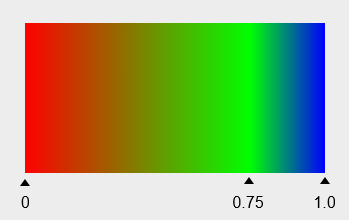

The preceding figure shows the display effect when the **colors** array is set to red, green, and blue and the **pos** array is set to 0.0, 0.75, and 1.0. The triangle subscript is the relative position of a color between the start point and end point. Gradient colors are used between them.

**Return value**

| Type   | Description                      |
| ------- | ------------------------- |
| [ShaderEffect](#shadereffect12) | **ShaderEffect** object created.|

**Error codes**

For details about the error codes, see [Universal Error Codes](../errorcode-universal.md).

| ID| Error Message|
| ------- | --------------------------------------------|
| 401 | Parameter error.Possible causes:1.Mandatory parameters are left unspecified;2.Incorrect parameter types; 3. Parameter verification failed. |

**Example**

```ts
import { common2D,drawing } from '@kit.ArkGraphics2D';

let startPt: common2D.Point = { x: 100, y: 100 };
let endPt: common2D.Point = { x: 300, y: 300 };
let shaderEffect =drawing.ShaderEffect.createLinearGradient(startPt, endPt, [0xFF00FF00, 0xFFFF0000], drawing.TileMode.REPEAT);
```

### createRadialGradient<sup>12+</sup>

static createRadialGradient(centerPt: common2D.Point, radius: number, colors: Array\<number>, mode: TileMode, pos?: Array\<number> | null, matrix?: Matrix | null): ShaderEffect;

Creates a **ShaderEffect** object that generates a radial gradient based on the center and radius of a circle. The radial gradient transitions colors from the center to the ending shape in a radial manner.

**System capability**: SystemCapability.Graphics.Drawing

**Parameters**

| Name| Type                                              | Mandatory| Description          |
| ------ | -------------------------------------------------- | ---- | -------------- |
| centerPt  | [common2D.Point](js-apis-graphics-common2D.md#point)  | Yes  | Center of the circle.|
| radius   | number  | Yes  | Radius of the gradient. A negative number is invalid. The value is a floating point number.|
| colors | Array\<number> | Yes  | Array of colors to distribute between the center and ending shape of the circle. The values in the array are 32-bit (ARGB) unsigned integers.|
| mode  | [TileMode](#tilemode12) | Yes  | Tile mode of the shader effect.|
| pos | Array\<number> \| null | No  | Relative position of each color in the color array. The array length must be the same as that of **colors**. The first element in the array must be 0.0, the last element must be 1.0, and the middle elements must be between 0.0 and 1.0 and increase by index. The default value is null, indicating that colors are evenly distributed between the center and ending shape of the circle.|
| matrix | [Matrix](#matrix12) \| null | No  | **Matrix** object used to perform matrix transformation on the shader effect. The default value is null, indicating the identity matrix.|


The preceding figure shows the display effect when the **colors** array is set to red, green, and blue and the **pos** array is set to 0.0, 0.75, and 1.0. The triangle subscript is the relative position of the color between the center and ending shape of the circle. Gradient colors are used between them.

**Return value**

| Type   | Description                      |
| ------- | ------------------------- |
| [ShaderEffect](#shadereffect12) | **ShaderEffect** object created.|

**Error codes**

For details about the error codes, see [Universal Error Codes](../errorcode-universal.md).

| ID| Error Message|
| ------- | --------------------------------------------|
| 401 | Parameter error.Possible causes:1.Mandatory parameters are left unspecified;2.Incorrect parameter types; 3. Parameter verification failed. |

**Example**

```ts
import { common2D,drawing } from '@kit.ArkGraphics2D';

let centerPt: common2D.Point = { x: 100, y: 100 };
let shaderEffect = drawing.ShaderEffect.createRadialGradient(centerPt, 100, [0xFF00FF00, 0xFFFF0000], drawing.TileMode.REPEAT);
```

### createSweepGradient<sup>12+</sup>

static createSweepGradient(centerPt: common2D.Point, colors: Array\<number>,
  mode: TileMode, startAngle: number, endAngle: number, pos?: Array\<number> | null,
  matrix?: Matrix | null): ShaderEffect;

Creates a **ShaderEffect** object that generates a sweep gradient based on the center. A sweep gradient paints a gradient of colors in a clockwise or counterclockwise direction based on a given circle center.

**System capability**: SystemCapability.Graphics.Drawing

**Parameters**

| Name| Type                                              | Mandatory| Description          |
| ------ | -------------------------------------------------- | ---- | -------------- |
| centerPt  | [common2D.Point](js-apis-graphics-common2D.md#point)  | Yes  | Center of the circle.|
| colors | Array\<number> | Yes  | Array of colors to distribute between the start angle and end angle. The values in the array are 32-bit (ARGB) unsigned integers.|
| mode  | [TileMode](#tilemode12) | Yes  | Tile mode of the shader effect.|
| startAngle | number | Yes  | Start angle of the sweep gradient, in degrees. The value 0 indicates the positive direction of the X axis. A positive number indicates an offset towards the positive direction, and a negative number indicates an offset towards the negative direction. The value is a floating point number.|
| endAngle | number | Yes  | End angle of the sweep gradient, in degrees. The value 0 indicates the positive direction of the X axis. A positive number indicates an offset towards the positive direction, and a negative number indicates an offset towards the negative direction. A value less than the start angle is invalid. The value is a floating point number.|
| pos | Array\<number> \| null | No  | Relative position of each color in the color array. The array length must be the same as that of **colors**. The first element in the array must be 0.0, the last element must be 1.0, and the middle elements must be between 0.0 and 1.0 and increase by index. The default value is null, indicating that the colors are evenly distributed between the start angle and end angle.|
| matrix | [Matrix](#matrix12) \| null | No  |**Matrix** object used to perform matrix transformation on the shader effect. The default value is null, indicating the identity matrix.|

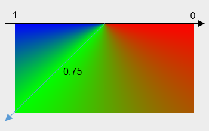

The preceding figure shows the display effect when the **colors** array is set to red, green, and blue, the **pos** array is set to 0.0, 0.75, and 1.0, **startAngle** is set to 0 degrees, and **endAngle** is set to 180 degrees. In the figure, **0.0** corresponds to the position of 0 degrees, **0.75** corresponds to the position of 135 degrees, and **1.0** corresponds to the position of 180 degrees. Gradient colors are used between them.

**Return value**

| Type   | Description                      |
| ------- | ------------------------- |
| [ShaderEffect](#shadereffect12) | **ShaderEffect** object created.|

**Error codes**

For details about the error codes, see [Universal Error Codes](../errorcode-universal.md).

| ID| Error Message|
| ------- | --------------------------------------------|
| 401 | Parameter error.Possible causes:1.Mandatory parameters are left unspecified;2.Incorrect parameter types; 3. Parameter verification failed. |

**Example**

```ts
import { common2D,drawing } from '@kit.ArkGraphics2D';

let centerPt: common2D.Point = { x: 100, y: 100 };
let shaderEffect = drawing.ShaderEffect.createSweepGradient(centerPt, [0xFF00FF00, 0xFFFF0000], drawing.TileMode.REPEAT, 100, 200);
```

### createConicalGradient<sup>12+</sup>

static createConicalGradient(startPt: common2D.Point, startRadius: number, endPt: common2D.Point, endRadius: number, colors: Array\<number>, mode: TileMode, 
pos?: Array\<number> | null, matrix?: Matrix | null): ShaderEffect;

Creates a **ShaderEffect** object that generates a conical gradient between two given circles.

**System capability**: SystemCapability.Graphics.Drawing

**Parameters**

| Name| Type                                              | Mandatory| Description          |
| ------ | -------------------------------------------------- | ---- | -------------- |
| startPt  | [common2D.Point](js-apis-graphics-common2D.md#point)  | Yes  |Center of the start circle of the gradient.|
| startRadius | number | Yes  | Radius of the start circle of the gradient. A negative number is invalid. The value is a floating point number.|
| endPt  | [common2D.Point](js-apis-graphics-common2D.md#point)  | Yes  | Center of the end circle of the gradient.|
| endRadius | number | Yes  | Radius of the end circle of the gradient. A negative value is invalid. The value is a floating point number.|
| colors | Array\<number> | Yes  | Array of colors to distribute between the start circle and end circle. The values in the array are 32-bit (ARGB) unsigned integers.|
| mode  | [TileMode](#tilemode12) | Yes  | Tile mode of the shader effect.|
| pos | Array\<number> \| null | No  | Relative position of each color in the color array. The array length must be the same as that of **colors**. The first element in the array must be 0.0, the last element must be 1.0, and the middle elements must be between 0.0 and 1.0 and increase by index. The default value is null, indicating that colors are evenly distributed between the two circles.|
| matrix | [Matrix](#matrix12) \| null | No  | **Matrix** object used to perform matrix transformation on the shader effect. The default value is null, indicating the identity matrix.|

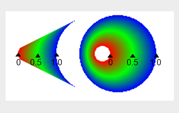

The preceding figure shows the display effect when the **colors** array is set to red, green, and blue and the **pos** array is set to 0.0, 0.5, and 1.0. The left part shows the drawing result when the start circle is not in the end circle, and the right part shows the drawing result when the start circle is in the end circle.

**Return value**

| Type   | Description                      |
| ------- | ------------------------- |
| [ShaderEffect](#shadereffect12) | **ShaderEffect** object created.|

**Error codes**

For details about the error codes, see [Universal Error Codes](../errorcode-universal.md).

| ID| Error Message|
| ------- | --------------------------------------------|
| 401 | Parameter error.Possible causes:1.Mandatory parameters are left unspecified;2.Incorrect parameter types; 3. Parameter verification failed. |

**Example**

```ts
import { common2D,drawing } from '@kit.ArkGraphics2D';

let startPt: common2D.Point = { x: 100, y: 100 };
let endPt: common2D.Point = {x: 200, y: 200};
let shaderEffect = drawing.ShaderEffect.createConicalGradient(startPt, 100, endPt, 50, [0xFF00FF00, 0xFFFF0000], drawing.TileMode.REPEAT);
```

## RegionOp<sup>12+</sup>

Enumerates the operations for combining two regions.

**System capability**: SystemCapability.Graphics.Drawing

| Name                  | Value  | Description                          | Diagram  |
| --------------------- | ---- | ------------------------------ | -------- |
| DIFFERENCE         | 0    | Difference operation. | |
| INTERSECT          | 1    | Intersect operation.| 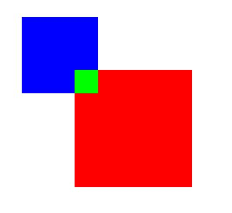|
| UNION              | 2    | Union operation.  | |
| XOR                | 3    | XOR operation.  | |
| REVERSE_DIFFERENCE | 4    | Reverse difference operation.  | 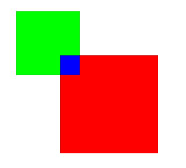|
| REPLACE            | 5    | Replace operation.  | |

> **NOTE**
>
> The schematic diagram shows the result obtained by combining a red region with a blue region at different operation mode. The green region is the region obtained.

## CornerPos<sup>12+</sup>

Enumerates the corner positions of a rounded rectangle.

**System capability**: SystemCapability.Graphics.Drawing

| Name                  | Value  | Description                          |
| --------------------- | ---- | ------------------------------ | 
| TOP_LEFT_POS          | 0    | Top left corner of the rounded rectangle. |
| TOP_RIGHT_POS         | 1    | Top right corner of the rounded rectangle.|
| BOTTOM_RIGHT_POS      | 2    | Bottom right corner of the rounded rectangle.  |
| BOTTOM_LEFT_POS       | 3    | Bottom left corner of the rounded rectangle.  |
