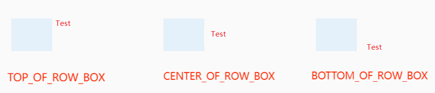
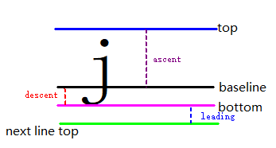
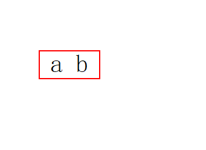
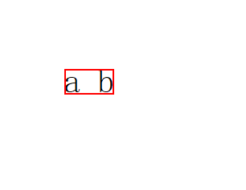
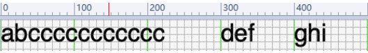
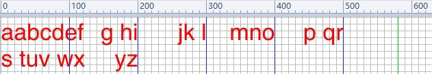

# @ohos.graphics.text (Text)

The Text module provides a set of APIs for text layout and font management. It aims to deliver high-quality typesetting through features like character-to-glyph conversion, kerning, line breaking, alignment, and text measurement. Additionally, it provides font management capabilities, including font registration, font descriptors, and font collection management.

This module provides the following classes for creating complex text paragraphs:

- [TextStyle](#textstyle): defines the font type, size, spacing, and other text properties.
- [FontCollection](#fontcollection): manages a collection of different fonts.
- [FontDescriptor](#fontdescriptor14): provides information about font descriptors.
- [ParagraphStyle](#paragraphstyle): controls line break and word break strategies for the entire paragraph.
- [ParagraphBuilder](#paragraphbuilder): used to create different paragraph objects.
- [Paragraph](#paragraph): created by calling [build()](#build) of the **ParagraphBuilder** class.
- [LineTypeset](#linetypeset18): created by calling [buildLineTypeset()](#buildlinetypeset18) of the **ParagraphBuilder** class.
- [TextLine](#textline): paragraph text on a line-by-line basis, obtained by calling [getTextLines()](#gettextlines) of the **Paragraph** class.
- [Run](#run): text typesetting unit, obtained by calling [getGlyphRuns()](#getglyphruns) of the **TextLine** class.

> **NOTE**
>
> The initial APIs of this module are supported since API version 12. Newly added APIs will be marked with a superscript to indicate their earliest API version.

## Modules to Import

```ts
import { text } from '@kit.ArkGraphics2D';
```

## text.matchFontDescriptors<sup>18+</sup>

matchFontDescriptors(desc: FontDescriptor): Promise&lt;Array&lt;FontDescriptor&gt;&gt;

Obtains all system font descriptors that match the provided font descriptor. This API uses a promise to return the result.

**System capability**: SystemCapability.Graphics.Drawing

**Parameters**

| Name| Type| Mandatory| Description|
| - | - | - | - |
| desc | [FontDescriptor](#fontdescriptor14) | Yes| Font descriptor to match against. If this parameter is left unspecified, all system font descriptors are returned. If a specific value is provided, the matching is performed based on the value provided. If the matching fails, an empty array is returned.|

**Return value**

| Type| Description|
| - | - |
| Promise&lt;Array&lt;[FontDescriptor](#fontdescriptor14)&gt;&gt; | Promise used to return all matched system font descriptors.|

**Error codes**

For details about the error codes, see [Universal Error Codes](../errorcode-universal.md).

| ID| Error Message|
| ------- | --------------------------------------------|
| 401 | Parameter error. Possible causes: 1. Mandatory parameters are left unspecified;2. Incorrect parameter types;3. Parameter verification failed. |

**Example**

```ts
import { text } from "@kit.ArkGraphics2D"
import { BusinessError } from '@kit.BasicServicesKit';

@Entry
@Component
struct Index {
  build() {
    Row() {
      Column() {
        Button("font descriptor")
          .fontSize(30)
          .fontWeight(FontWeight.Bold)
          .width(300)
          .height(80)
          .onClick(() => {
            console.info(`Get font descriptor start`)
            let promise = text.matchFontDescriptors({
              weight: text.FontWeight.W400,
            })
            promise.then((data) => {
              console.info(`Font descriptor array size: ${data.length}`);
              console.info(`Font descriptor result: ${JSON.stringify(data)}`)
            }).catch((error: BusinessError) => {
              console.error(`Failed to match the font descriptor, error: ${JSON.stringify(error)}`);
            });
          })
      }
      .width('100%')
    }
    .height('100%')
  }
}
```

## text.getSystemFontFullNamesByType<sup>14+</sup>

getSystemFontFullNamesByType(fontType: SystemFontType): Promise&lt;Array&lt;string&gt;&gt;

Obtains the full names of all fonts of the specified type. This API uses a promise to return the result.

**System capability**: SystemCapability.Graphics.Drawing

**Parameters**

| Name| Type| Mandatory| Description|
| - | - | - | - |
| fontType | [SystemFontType](#systemfonttype14) | Yes| Font type.|

**Return value**

| Type| Description|
| - | - |
| Promise&lt;Array&lt;string&gt;&gt; | Promise used to return the full names of all fonts of the specified type.|

**Error codes**

For details about the error codes, see [Universal Error Codes](../errorcode-universal.md).

| ID| Error Message|
| ------- | --------------------------------------------|
| 401 | Parameter error. Possible causes: 1. Mandatory parameters are left unspecified;2. Incorrect parameter types; 3. Parameter verification failed. |

**Example**

```ts
import { text } from "@kit.ArkGraphics2D"
import { BusinessError } from '@kit.BasicServicesKit';

@Entry
@Component
struct Index {
  build() {
    Row() {
      Column() {
        Button("get font list")
          .fontSize(30)
          .fontWeight(FontWeight.Bold)
          .width(300)
          .height(80)
          .onClick(() => {
            let fontType:text.SystemFontType = text.SystemFontType.GENERIC
            let promise = text.getSystemFontFullNamesByType(fontType)
            promise.then((data) => {
              console.info(`then font list size: ${data.length}`)
              data.forEach((fontItem) => {
                console.info(fontItem)
              })
            }).catch((error: BusinessError) => {
              console.error(`Failed to get font fullNames by type, error: ${JSON.stringify(error)}`);
            });
          })
      }
      .width('100%')
    }
    .height('100%')
  }
}
```

## text.getFontDescriptorByFullName<sup>14+</sup>

getFontDescriptorByFullName(fullName: string, fontType: SystemFontType): Promise&lt;FontDescriptor&gt;

Obtains the font descriptor based on the font name and type. This API uses a promise to return the result.

A font descriptor is a data structure that describes font features. It contains details of the font appearance and properties.

**System capability**: SystemCapability.Graphics.Drawing

**Parameters**

| Name| Type| Mandatory| Description|
| - | - | - | - |
| fullName | string | Yes| Font name, corresponding to the value of **fullName** in the **name** table of the corresponding font file. It is obtained by calling [getSystemFontFullNamesByType](#textgetsystemfontfullnamesbytype14).|
| fontType | [SystemFontType](#systemfonttype14) | Yes| Font type.|

**Return value**

| Type| Description|
| - | - |
| Promise&lt;[FontDescriptor](#fontdescriptor14)&gt; | Promise used to return the font descriptor.|

**Error codes**

For details about the error codes, see [Universal Error Codes](../errorcode-universal.md).

| ID| Error Message|
| ------- | --------------------------------------------|
| 401 | Parameter error.Possible causes:1.Mandatory parameters are left unspecified;2.Incorrect parameter types. |

**Example**

```ts
import { text } from "@kit.ArkGraphics2D"
import { BusinessError } from '@kit.BasicServicesKit';

@Entry
@Component
struct Index {
  build() {
    Row() {
      Column() {
        Button("get fontDesciptor")
          .fontSize(30)
          .fontWeight(FontWeight.Bold)
          .width(300)
          .height(80)
          .onClick(() => {
            let fontType:text.SystemFontType = text.SystemFontType.GENERIC
            let promise = text.getFontDescriptorByFullName("HarmonyOS Sans", fontType)
            promise.then((fontdecriptor) => {
              console.info(`desc: ${JSON.stringify(fontdecriptor)}`)
            }).catch((error: BusinessError) => {
              console.error(`Failed to get fontDescriptor by fullName, error: ${JSON.stringify(error)}`);
            });
          })
      }
      .width('100%')
    }
    .height('100%')
  }
}
```

## TextAlign

Enumerates the text alignment modes.

**System capability**: SystemCapability.Graphics.Drawing

| Name       | Value  | Description                                         |
| --------- | ---- | ---------------------------------------------- |
| LEFT      | 0    | Left-aligned.                                 |
| RIGHT     | 1    | Right-aligned.                                 |
| CENTER    | 2    | Center-aligned.                                 |
| JUSTIFY   | 3    | Justified, which means that each line (except the last line) is stretched so that every line has equal width, and the left and right margins are straight.                   |
| START     | 4    | Aligned with the start position, which depends on [TextDirection](#textdirection).|
| END       | 5    | Aligned with the end position, which depends on [TextDirection](#textdirection).|

## TextDirection

Enumerates the text directions.

**System capability**: SystemCapability.Graphics.Drawing

| Name    | Value  | Description             |
| -------- | ---- | ---------------- |
| RTL      | 0    | Right to left (RTL).|
| LTR      | 1    | Left to right (LTR).|

## BreakStrategy

Enumerates the text break strategies.

**System capability**: SystemCapability.Graphics.Drawing

| Name         | Value  | Description                                           |
| ------------- | ---- | ---------------------------------------------- |
| GREEDY        | 0    | Fills the current line as much as possible without adding hyphens.          |
| HIGH_QUALITY  | 1    | Optimizes layout and may add hyphens when necessary.               |
| BALANCED      | 2    | Ensures consistent line width in a paragraph, adding hyphens if needed.|

## WordBreak

Enumerates the word break types.

**System capability**: SystemCapability.Graphics.Drawing

| Name                         | Value  | Description                                                                                                                 |
|-----------------------------| ---- | -------------------------------------------------------------------------------------------------------------------- |
| NORMAL                      | 0    | Default mode that break words based on language-specific conventions.                                                                 |
| BREAK_ALL                   | 1    | Allows breaks within any character in non-CJK text. (CJK means Chinese, Japanese, and Korean.) This value is suitable for Asian text that contains some non-Asian text. For example, it can be used to break consecutive English characters.|
| BREAK_WORD                  | 2    | Allows breaks between any two characters in non-CJK text. It prioritizes breaking at whitespace or other natural breakpoints to keep words intact. If no breakpoints are found, it breaks between any two characters. For CJK text, this behaves like **NORMAL**.|
| BREAK_HYPHEN<sup>18+</sup>  | 3    | Attempts to break words at the end of a line using a hyphen. If a hyphen cannot be added, it behaves like **BREAK_WORD**.                       |

## Decoration

Describes a text decoration.

**System capability**: SystemCapability.Graphics.Drawing

| Name                     | Type                                                 | Read Only| Optional| Description                                        |
| ------------------------- | --------------------------------------------------- | ---- | ---- | -------------------------------------------- |
| textDecoration            | [TextDecorationType](#textdecorationtype)           | Yes  | Yes  | Type of the decoration. The default value is **NONE**.                      |
| color                     | [common2D.Color](js-apis-graphics-common2D.md#color)| Yes  | Yes  | Color of the decoration. The default value is transparent.                      |
| decorationStyle           | [TextDecorationStyle](#textdecorationstyle)         | Yes  | Yes  | Style of the decoration. The default value is **SOLID**.                     |
| decorationThicknessScale  | number                                              | Yes  | Yes  | Scale factor for the thickness of the decoration line. The value is a floating point number. The default value is **1.0**.|

## TextDecorationType

Enumerates the text decoration types.

**System capability**: SystemCapability.Graphics.Drawing

| Name          | Value| Description       |
| -------------- | - | ----------- |
| NONE           | 0 | No decoration is used.|
| UNDERLINE      | 1 | An underline is used for decoration.     |
| OVERLINE       | 2 | An overline is used for decoration.    |
| LINE_THROUGH   | 4 | A strikethrough is used for decoration.     |

## TextDecorationStyle

Enumerates the text decoration styles.

**System capability**: SystemCapability.Graphics.Drawing

| Name  | Value| Description  |
| ------ | - | ------ |
| SOLID  | 0 | Solid style. |
| DOUBLE | 1 | Double style.|
| DOTTED | 2 | Dotted style.|
| DASHED | 3 | Dashed style. |
| WAVY   | 4 | Wavy style.|

## FontWeight

Enumerates the font weights.

**System capability**: SystemCapability.Graphics.Drawing

| Name | Value| Description  |
| ----- | - | ------- |
| W100  | 0 | Font weight W100.|
| W200  | 1 | Font weight W200.|
| W300  | 2 | Font weight W300.|
| W400  | 3 | Font weight W400.|
| W500  | 4 | Font weight W500.|
| W600  | 5 | Font weight W600.|
| W700  | 6 | Font weight W700.|
| W800  | 7 | Font weight W800.|
| W900  | 8 | Font weight W900.|

## FontWidth

Enumerates the font widths.

**System capability**: SystemCapability.Graphics.Drawing

| Name            | Value| Description      |
| ---------------- | - | ---------- |
| ULTRA_CONDENSED  | 1 | Ultra condensed. |
| EXTRA_CONDENSED  | 2 | Extra condensed. |
| CONDENSED        | 3 | Condensed. |
| SEMI_CONDENSED   | 4 | Semi condensed. |
| NORMAL           | 5 | Normal. |
| SEMI_EXPANDED    | 6 | Semi expanded. |
| EXPANDED         | 7 | Expanded. |
| EXTRA_EXPANDED   | 8 | Extra expanded. |
| ULTRA_EXPANDED   | 9 | Ultra expanded.|

## FontStyle

Enumerates the font styles.

**System capability**: SystemCapability.Graphics.Drawing

| Name   | Value| Description                                                |
| ------- | - | ---------------------------------------------------- |
| NORMAL  | 0 | Normal.                                           |
| ITALIC  | 1 | Italic. If no italic version is available for the current font, the oblique version will be used instead. |
| OBLIQUE | 2 | Oblique. If no oblique version is available for the current font, the italic version will be used instead.|

## TextHeightBehavior

Enumerates the text height modifier patterns.

**System capability**: SystemCapability.Graphics.Drawing

| Name                 |  Value| Description                                                 |
| --------------------- | --- | ---------------------------------------------------- |
| ALL                   | 0x0 | Allows the first line of the paragraph to rise and the last line to drop.           |
| DISABLE_FIRST_ASCENT  | 0x1 | Prevents the first line of a paragraph from rising.                  |
| DISABLE_LAST_ASCENT   | 0x2 | Prevents the last line of a paragraph from dropping.                |
| DISABLE_ALL           | 0x1 \| 0x2 | Combines the effects of disabling the first line from rising and the last line from dropping.         |

## TextBaseline

Enumerates the text baseline types.

**System capability**: SystemCapability.Graphics.Drawing

| Name       | Value| Description|
| ----------- | - | ---- |
| ALPHABETIC  | 0 | Alphabetic baseline, where the letters in Latin alphabets sit on.|
| IDEOGRAPHIC | 1 | Ideographic baseline, where the baseline is at the bottom of the text area. It is usually used for CJK text.|

## EllipsisMode

Enumerates the ellipsis styles.

**EllipsisMode.START** and **EllipsisMode.MIDDLE** take effect only when text overflows in a single line.

**System capability**: SystemCapability.Graphics.Drawing

| Name  | Value| Description     |
| ------ | - | --------- |
| START  | 0 | Places the ellipsis in the text header. It is valid only when **maxLines** is set to **1** in [ParagraphStyle](#paragraphstyle).|
| MIDDLE | 1 | Places the ellipsis in the middle of the text. It is valid only when **maxLines** is set to **1** in [ParagraphStyle](#paragraphstyle).|
| END    | 2 | Places the ellipsis at the end of the text.|

## TextShadow

Describes the text shadow.

**System capability**: SystemCapability.Graphics.Drawing

| Name         | Type                                                | Read Only| Optional| Description                              |
| ------------- | ---------------------------------------------------- | --  | ---  | --------------------------------- |
| color         | [common2D.Color](js-apis-graphics-common2D.md#color) | Yes |  Yes  | Color of the text shadow. The default value is black (255, 0, 0, 0).       |
| point         | [common2D.Point](js-apis-graphics-common2D.md#point12) | Yes |  Yes  | Position of the text shadow relative to the text. The horizontal and vertical coordinates must be greater than or equal to 0.   |
| blurRadius    | number                                               | Yes |  Yes  | Blur radius. The value is a floating point number. The default value is **0.0px**.      |

## RectStyle

Describes the style of a rectangle.

**System capability**: SystemCapability.Graphics.Drawing

| Name              | Type                                                | Read Only| Optional| Description                                     |
| -----------------  | ---------------------------------------------------- | --  | ---  | ---------------------------------------- |
| color              | [common2D.Color](js-apis-graphics-common2D.md#color) | Yes |  No  | Color of the rectangle.                |
| leftTopRadius      | number                                               | Yes |  No  | Left top radius of the rectangle.      |
| rightTopRadius     | number                                               | Yes |  No  | Right top radius of the rectangle.      |
| rightBottomRadius  | number                                               | Yes |  No  | Right bottom radius of the rectangle.      |
| leftBottomRadius   | number                                               | Yes |  No  | Left bottom radius of the rectangle.      |

## FontFeature

Describes a font feature.

**System capability**: SystemCapability.Graphics.Drawing

| Name     | Type                                                | Read Only| Optional| Description                                      |
| --------- | ---------------------------------------------------- | --  | ---  | ----------------------------------------- |
| name      | string                                               | Yes |  No  | String identified by the keyword in the font feature key-value pair.      |
| value     | number                                               | Yes |  No  | Value in the font feature key-value pair.                       |

## FontVariation

Describes a font variation.

**System capability**: SystemCapability.Graphics.Drawing

| Name     | Type                                                | Read Only| Optional| Description                                      |
| --------- | ---------------------------------------------------- | --  | ---  | ----------------------------------------- |
| axis      | string                                               | Yes |  No  | String identified by the keyword in the font variation key-value pair.      |
| value     | number                                               | Yes |  No  | Value in the font variation key-value pair.                       |

## TextStyle

Describes a text style.

**System capability**: SystemCapability.Graphics.Drawing

| Name                     | Type                                    | Read Only| Optional| Description                                                  |
| ------------- | ---------------------------------------------------- | -- | -- | --------------------------------------------------------- |
| decoration    | [Decoration](#decoration)                            | Yes| Yes| Text decoration. By default, no decoration is used.            |
| color         | [common2D.Color](js-apis-graphics-common2D.md#color) | Yes| Yes| Text color. The default color is white.                        |
| fontWeight    | [FontWeight](#fontweight)                            | Yes| Yes| Font weight. The default value is **W400**. Currently, only the default system font supports font weight adjustment. For other fonts, if the weight is less than semi-bold (W600), there is no variation in stroke thickness. If the weight is greater than or equal to semi-bold, it might result in a fake bold effect.                        |
| fontStyle     | [FontStyle](#fontstyle)                              | Yes| Yes| Font style. The default value is **NORMAL**.                         |
| baseline      | [TextBaseline](#textbaseline)                        | Yes| Yes| Text baseline type. The default value is **ALPHABETIC**.              |
| fontFamilies  | Array\<string>                                       | Yes| Yes| Array of font families. By default, the array is empty, indicating that all system fonts are matched.                   |
| fontSize      | number                                               | Yes| Yes| Font size, in units of px. The value is a floating point number. The default value is **14.0**.  |
| letterSpacing | number                                               | Yes| Yes| Letter spacing, in units of px. The value is a floating point number. The default value is **0.0**. A positive value causes characters to spread farther apart, and a negative value bring characters closer together.|
| wordSpacing   | number                                               | Yes| Yes| Word spacing, in units of px. The value is a floating point number. The default value is **0.0**.                |
| heightScale   | number                                               | Yes| Yes| Scale factor of the line height. The value is a floating point number. The default value is **1.0**. This parameter is valid only when **heightOnly** is set to** true**.              |
| heightOnly    | boolean                                              | Yes| Yes| How the height of the text box is set. The value **true** means that the height of the text box is set based on the font size and the value of **heightScale**, and **false** means that the height is set based on the line height and line spacing. The default value is **false**.|
| halfLeading   | boolean                                              | Yes| Yes| Whether half leading is enabled. Half leading is the leading split in half and applied equally to the top and bottom edges. The value **true** means that half leading is enabled, and **false** means the opposite. The default value is **false**.|
| ellipsis      | string                                               | Yes| Yes| Ellipsis content, which will be used to replace the extra content.      |
| ellipsisMode  | [EllipsisMode](#ellipsismode)                        | Yes| Yes| Ellipsis type. The default value is **END**, indicating that the ellipsis is at the end of a line.                      |
| locale        | string                                               | Yes| Yes| Locale. For example, **'en'** indicates English, **'zh-Hans'** indicates Simplified Chinese, and **'zh-Hant'** indicates Traditional Chinese. For details, see ISO 639-1. The default value is an empty string.|
| baselineShift | number                                               | Yes| Yes| Shift of the baseline. The value is a floating point number. The default value is **0.0px**.                |
| fontFeatures  | Array\<[FontFeature](#fontfeature)>                  | Yes| Yes| Array of font features.|
| fontVariations| Array\<[FontVariation](#fontvariation)>              | Yes| Yes| Array of font variations.|
| textShadows   | Array\<[TextShadow](#textshadow)>                    | Yes| Yes| Array of shadows.|
| backgroundRect| [RectStyle](#rectstyle)                              | Yes| Yes| Rectangle style.|

## StrutStyle

Describes the strut style, which determines the line spacing, baseline alignment mode, and other properties related to the line height when drawing texts. The strut style is disabled by default.

**System capability**: SystemCapability.Graphics.Drawing

| Name                     | Type                                      | Read Only| Optional| Description                                                                |
| -------------  | ---------------------------------------------------- | ---- | -- | --------------------------------------------------------------------- |
| fontFamilies   | Array\<string>                                       | Yes  | Yes| List of font families. By default, the list corresponds to the system's default fonts.                                              |
| fontStyle      | [FontStyle](#fontstyle)                              | Yes  | Yes| Font style. The default value is **NORMAL**.                                              |
| fontWidth      | [FontWidth](#fontwidth)                              | Yes  | Yes| Font width. The default value is **NORMAL**.                                               |
| fontWeight     | [FontWeight](#fontweight)                            | Yes  | Yes| Font weight. The default value is **W400**. The default system font supports font weight adjustment. For other fonts, if the weight is less than W600, there is no variation in stroke thickness. If the weight is greater than or equal to W600, it might result in a fake bold effect.                            |
| fontSize       | number                                               | Yes  | Yes| Font size, in units of px. The value is a floating point number. The default value is **14.0**.                             |
| height         | number                                               | Yes  | Yes| Scale factor of the line height. The value is a floating point number. The default value is **1.0**.                                        |
| leading        | number                                               | Yes  | Yes| Custom leading to be applied to the strut. The value is a floating point number. The default value is **-1.0**.                         |
| forceHeight    | boolean                                              | Yes  | Yes| Whether to forcibly use the strut height for all lines. The value **true** means to forcibly use the strut height for all lines, and **false** means the opposite. The default value is **false**.    |
| enabled        | boolean                                              | Yes  | Yes| Whether to enable the strut style. The value **true** means to enable the strut style, and **false** means the opposite. The default value is **false**.             |
| heightOverride | boolean                                              | Yes  | Yes| Whether to override the height. The value **true** means to override the height, and **false** means the opposite. The default value is **false**.                 |
| halfLeading    | boolean                                              | Yes  | Yes| Whether half leading is enabled. Half leading is the leading split in half and applied equally to the top and bottom edges. The value **true** means that half leading is enabled, and **false** means the opposite. The default value is **false**.          |

## FontDescriptor<sup>14+</sup>

Describes the font descriptor information.

**System capability**: SystemCapability.Graphics.Drawing

| Name| Type| Read Only| Optional| Description|
| - | - | -  | - | - |
| path | string | No| Yes| Absolute path of the font. Any string is acceptable, but the value must adhere to the system's path constraints. The default value is an empty string.|
| postScriptName | string | No| Yes| Unique name of the font. Any string is acceptable. The default value is an empty string.|
| fullName | string | No| Yes| Font name. Any string is acceptable. The default value is an empty string.|
| fontFamily | string | No| Yes| Family name of the font. Any string is acceptable. The default value is an empty string.|
| fontSubfamily | string | No| Yes| Subfamily name of the font. Any string is acceptable. The default value is an empty string.|
| weight | [FontWeight](#fontweight) | No| Yes| Font weight. The default value is **0**.|
| width | number | No| Yes| Font width. The value is an integer ranging from 1 to 9. The default value is **0**.|
| italic | number | No| Yes| Whether the font is italic. The value **0** means that the font is not italic, and **1** means the opposite. The default value is **0**.|
| monoSpace | boolean | No| Yes| Whether the font is monospaced. The value **true** means that the font is monospaced, and **false** means the opposite. The default value is **false**.|
| symbolic | boolean | No| Yes| Whether the font is symbolic. The value **true** means that the font is symbolic, and **false** means the opposite.|

## FontCollection

Implements a collection of fonts.

### getGlobalInstance

static getGlobalInstance(): FontCollection

Obtains a global **FontCollection** instance.

**System capability**: SystemCapability.Graphics.Drawing

**Return value**

| Type  | Description               |
| ------ | ------------------ |
| [FontCollection](#fontcollection) | **FontCollection** instance.|

**Example**

```ts
import { text } from "@kit.ArkGraphics2D"

function textFunc() {
  let fontCollection = text.FontCollection.getGlobalInstance();
}

@Entry
@Component
struct Index {
  fun: Function = textFunc;
  build() {
    Column() {
      Button().onClick(() => {
        this.fun();
      })
    }
  }
}
```

### loadFontSync

loadFontSync(name: string, path: string | Resource): void

Loads a custom font. This API returns the result synchronously. In this API, **name** specifies the alias of the font, and the custom font effect can be displayed only when the value of **name** is set in **fontFamilies** in **[TextStyle](#textstyle)**. The supported font file formats are .ttf and .otf.

**System capability**: SystemCapability.Graphics.Drawing

**Parameters**

| Name| Type              | Mandatory| Description                             |
| ----- | ------------------ | ---- | --------------------------------------------------------------------------------- |
| name  | string             | Yes  | Name of the font.                                               |
| path  | string \| [Resource](../apis-arkui/arkui-ts/ts-types.md#resource) | Yes  | Path of the font file to import. The value must be **file://***absolute path of the font file* or **rawfile/***directory or file name*.|

**Example**

```ts
import { text } from "@kit.ArkGraphics2D"

let fontCollection: text.FontCollection = new text.FontCollection();

@Entry
@Component
struct RenderTest {
  LoadFontSyncTest() {
    fontCollection.loadFontSync('Clock_01', 'file:///system/fonts/HarmonyClock_01.ttf')
    let fontFamilies: Array<string> = ["Clock_01"]
    let myTextStyle: text.TextStyle = {
      fontFamilies: fontFamilies
    };
    let myParagraphStyle: text.ParagraphStyle = {
      textStyle: myTextStyle,
    }
    let paragraphBuilder: text.ParagraphBuilder = new text.ParagraphBuilder(myParagraphStyle, fontCollection);

    let textData = "Test loadFontSync to load the font HarmonyClock_01.ttf."
    paragraphBuilder.addText(textData);
    let paragraph: text.Paragraph = paragraphBuilder.build();
    paragraph.layoutSync(600);
  }

  aboutToAppear() {
    this.LoadFontSyncTest();
  }

  build() {
  }
}
```

### loadFont<sup>18+</sup>

loadFont(name: string, path: string | Resource): Promise\<void>

Loads a custom font. This API uses a promise to return the result. In this API, **name** specifies the alias of the font, and the custom font effect can be displayed only when the value of **name** is set in **fontFamilies** in **[TextStyle](#textstyle)**. The supported font file formats are ttf and otf.

**System capability**: SystemCapability.Graphics.Drawing

**Parameters**

|   Name| Type              | Mandatory| Description                             |
|   -----  | ------------------ | ---- | --------------------------------------------------------------------------------- |
|   name   | string             | Yes  | Name of the font. Any string is acceptable.|
|   path   | string \| [Resource](../apis-arkui/arkui-ts/ts-types.md#resource) | Yes  | Path of the font file to load. The value must be **file://***absolute path of the font file* or **rawfile/***directory or file name*.|

**Return value**

| Type          | Description                         |
| -------------- | ----------------------------- |
| Promise\<void> | Promise that returns no value.|

**Error codes**

For details about the error codes, see [Universal Error Codes](../errorcode-universal.md).

| ID| Error Message|
| ------- | --------------------------------------------|
| 401 | Parameter error. Possible causes: 1. Mandatory parameters are left unspecified;2. Incorrect parameter types; 3. Parameter verification failed.|

**Example**

```ts
import { text } from "@kit.ArkGraphics2D"

let fontCollection: text.FontCollection = new text.FontCollection();

@Entry
@Component
struct RenderTest {
  async loadFontPromise() {
    fontCollection.loadFont('testName', 'file:///system/fonts/a.ttf').then((data) => {
      console.info(`Succeeded in doing loadFont ${JSON.stringify(data)} `);
    }).catch((error: Error) => {
      console.error(`Failed to do loadFont, error: ${JSON.stringify(error)} message: ${error.message}`);
    });
  }

  aboutToAppear() {
    this.loadFontPromise();
  }

  build() {
  }
}
```

### clearCaches

clearCaches(): void

Clears the font cache.

The font cache has a memory limit and a clearing mechanism. It occupies limited memory. You are not advised to clear it unless otherwise required.

**System capability**: SystemCapability.Graphics.Drawing

**Example**

```ts
import { text } from "@kit.ArkGraphics2D"

@Entry
@Component
struct Index {
  build() {
    Column() {
      Button().onClick(() => {
        text.FontCollection.getGlobalInstance().clearCaches();
      })
    }
  }
}
```

## ParagraphStyle

Describes a paragraph style.

**System capability**: SystemCapability.Graphics.Drawing

| Name                | Type                                       | Read Only| Optional| Description                                         |
| -------------------- | ------------------------------------------ | ---- | ---- | -------------------------------------------- |
| textStyle            | [TextStyle](#textstyle)                    | Yes  | Yes  | Text style applied to the paragraph. The default value is the initial text style.|
| textDirection        | [TextDirection](#textdirection)            | Yes  | Yes  | Text direction. The default value is **LTR**.                         |
| align                | [TextAlign](#textalign)                    | Yes  | Yes  | Text alignment mode. The default value is **START**. This parameter is invalid when the **tab** parameter is configured.|
| wordBreak            | [WordBreak](#wordbreak)                    | Yes  | Yes  | Word break type. The default value is **BREAK_WORD**.                   |
| maxLines             | number                                     | Yes  | Yes  | Maximum number of lines. The value is an integer. The default value is **1e9**.                 |
| breakStrategy        | [BreakStrategy](#breakstrategy)            | Yes  | Yes  | Text break strategy. The default value is **GREEDY**.                       |
| strutStyle           | [StrutStyle](#strutstyle)                  | Yes  | Yes  | Strut style. The default value is the initial **StrutStyle** object.              |
| textHeightBehavior   | [TextHeightBehavior](#textheightbehavior)  | Yes  | Yes  | Text height modifier pattern. The default value is **ALL**.                             |
| tab<sup>18+</sup>   | [TextTab](#texttab18)  | Yes  | Yes  | Alignment mode and position of the text after the tab character in a paragraph. By default, the tab character is replaced with a space. This parameter is invalid when it is used together with the **align** parameter or the **ellipsis** parameter in [TextStyle](#textstyle).|


## PlaceholderAlignment

Enumerates the vertical alignment modes of a placeholder relative to the surrounding text.

**System capability**: SystemCapability.Graphics.Drawing

| Name               | Value| Description                  |
| ------------------- | - | ---------------------- |
| OFFSET_AT_BASELINE  | 0 | Aligns the baseline of the placeholder to the baseline of the text.    |
| ABOVE_BASELINE      | 1 | Aligns the bottom edge of the placeholder to the baseline of the text.  |
| BELOW_BASELINE      | 2 | Aligns the top edge of the placeholder to the baseline of the text.  |
| TOP_OF_ROW_BOX      | 3 | Aligns the top edge of the placeholder to the bottom edge of the text.  |
| BOTTOM_OF_ROW_BOX   | 4 | Aligns the bottom edge of the placeholder to the bottom edge of the text.  |
| CENTER_OF_ROW_BOX   | 5 | Center-aligned.|



> **NOTE**
>
> The preceding figure shows only the last three alignment modes. The first three alignment modes are similar. The only difference is that the comparison position changes to the text baseline, which is the green line shown below.
>
>

## PlaceholderSpan

Describes the placeholder style.

**System capability**: SystemCapability.Graphics.Drawing

| Name          | Type                                          | Read Only| Optional| Description                        |
| -------------- | --------------------------------------------- | ---- | --- | --------------------------- |
| width          | number                                        | Yes  | No  | Width of the placeholder, in units of px. The value is a floating point number.|
| height         | number                                        | Yes  | No  | Height of the placeholder, in units of px. The value is a floating point number.|
| align          | [PlaceholderAlignment](#placeholderalignment) | Yes  | No  | Vertical alignment of the placeholder relative to the surrounding text.|
| baseline       | [TextBaseline](#textbaseline)                 | Yes  | No  | Type of the text baseline.                  |
| baselineOffset | number                                        | Yes  | No  | Offset to the text baseline, in units of px. The value is a floating point number. |

## Range

Describes a left-closed and right-open interval.

**System capability**: SystemCapability.Graphics.Drawing

| Name  | Type  | Read Only| Optional| Description           |
| ----- | ------ | ---- | --- | --------------- |
| start | number | Yes  | No  | Index of the leftmost point of the interval. The value is an integer.|
| end   | number | Yes  | No  | Index of the rightmost point of the interval. The value is an integer.|

## Paragraph

Implements a carrier that stores the text content and style. You can perform operations such as layout and drawing.

Before calling any of the following APIs, you must use [build()](#build) of the [ParagraphBuilder](#paragraphbuilder) class to create a **Paragraph** object.

### layoutSync

layoutSync(width: number): void

Performs layout and calculates the positions of all glyphs.

**System capability**: SystemCapability.Graphics.Drawing

**Parameters**

| Name| Type  | Mandatory| Description          |
| ----- | ------ | ---- | -------------- |
| width | number | Yes  | Maximum width of a single line, in units of px. The value is a floating point number.|

**Example**

```ts
paragraph.layoutSync(100);
```

### layout<sup>18+</sup>

layout(width: number): Promise\<void>

Performs layout and calculates the positions of all glyphs. This API uses a promise to return the result.

**System capability**: SystemCapability.Graphics.Drawing

**Parameters**

|   Name  |    Type              | Mandatory| Description                                   |
|   -----   |   ------------------  | ---- | --------------------------------------- |
|   width   | number                | Yes  | Maximum width of a single line, in units of px. The value is a floating point number.   |

**Return value**

| Type          | Description                         |
| -------------- | ----------------------------- |
| Promise\<void> | Promise that returns no value.|

**Error codes**

For details about the error codes, see [Universal Error Codes](../errorcode-universal.md).

| ID| Error Message|
| ------- | --------------------------------------------|
| 401 | Parameter error. Possible causes: 1. Mandatory parameters are left unspecified;2. Incorrect parameter types;3. Parameter verification failed. |

**Example**

```ts
import { drawing, text } from '@kit.ArkGraphics2D'
import { image } from '@kit.ImageKit';

let textStyle: text.TextStyle = {
  color: {
    alpha: 255,
    red: 255,
    green: 0,
    blue: 0
  },
  fontSize: 30,
};
let paragraphStyle: text.ParagraphStyle = {
  textStyle: textStyle,
};
let fontCollection: text.FontCollection = new text.FontCollection();
let paragraphBuilder = new text.ParagraphBuilder(paragraphStyle, fontCollection);
// Add a text string.
paragraphBuilder.addText("test");
// Create a paragraph object.
let paragraph = paragraphBuilder.build();

function textFunc(pixelmap: PixelMap) {
  // Construct a canvas using an image object.
  let canvas = new drawing.Canvas(pixelmap);
  // Draw a text string.
  paragraph.paint(canvas, 100, 10);
}

@Entry
@Component
struct Index {
  @State pixelmap?: PixelMap = undefined;
  fun: Function = textFunc;

  async prepareLayoutPromise() {
    // Calculate the layout of the paragraph object.
    paragraph.layout(200).then((data) => {
      console.info(`Succeeded in doing layout,  ${JSON.stringify(data)}`);
    }).catch((error: Error) => {
      console.error(`Failed to do layout, error: ${JSON.stringify(error)} message: ${error.message}`);
    });
  }

  aboutToAppear() {
    this.prepareLayoutPromise();
  }

  build() {
    Column() {
      Image(this.pixelmap).width(200).height(200);
      Button("layout")
        .width(100)
        .height(50)
        .onClick(() => {
          const color: ArrayBuffer = new ArrayBuffer(160000);
          let opts: image.InitializationOptions = { editable: true, pixelFormat: 3, size: { height: 200, width: 200 } }
          if (this.pixelmap == undefined) {
            // Construct an image object.
            this.pixelmap = image.createPixelMapSync(color, opts);
          }
          // Draw the text.
          this.fun(this.pixelmap);
        })
    }
  }
}
```

>**NOTE**
>
>The following figure shows the running result of the sample code of the **layout** API after the button is tapped.
>
>

### paint

paint(canvas: drawing.Canvas, x: number, y: number): void

Paints the text on the canvas with the coordinate point (x, y) as the upper left corner.

**System capability**: SystemCapability.Graphics.Drawing

**Parameters**

| Name| Type                                                 | Mandatory| Description                   |
| ------ | ---------------------------------------------------- | ---- | ---------------------- |
| canvas | [drawing.Canvas](js-apis-graphics-drawing.md#canvas) | Yes  | Target canvas.        |
|    x   | number                                               | Yes  | X coordinate of the upper left corner. The value is a floating point number.|
|    y   | number                                               | Yes  | Y coordinate of the upper left corner. The value is a floating point number.|

**Example**

```ts
const color: ArrayBuffer = new ArrayBuffer(160000);
let opts: image.InitializationOptions = { editable: true, pixelFormat: 3, size: { height: 200, width: 200 } }
let pixelMap: image.PixelMap = image.createPixelMapSync(color, opts);
let canvas = new drawing.Canvas(pixelMap);
paragraph.paint(canvas, 0, 0);
```

### paintOnPath

paintOnPath(canvas: drawing.Canvas, path: drawing.Path, hOffset: number, vOffset: number): void

Draws text along a path on the canvas.

**System capability**: SystemCapability.Graphics.Drawing

**Parameters**

| Name| Type                                                 | Mandatory| Description                   |
| ------ | ---------------------------------------------------- | ---- | ---------------------- |
| canvas | [drawing.Canvas](js-apis-graphics-drawing.md#canvas) | Yes  | Target canvas.        |
| path | [drawing.Path](js-apis-graphics-drawing.md#path) | Yes  | Path along which the text is drawn.        |
|    hOffset   | number                                               | Yes  | Horizontal offset along the path direction. A positive number indicates a position that is ahead along the path from its start point, and a negative number indicates a position that is behind from the start point.|
|    vOffset   | number                                               | Yes  | Vertical offset along the path direction. A positive number indicates a position on the left side of the path, and a negative number indicates a position on the right side of the path.|

**Example**

```ts
const color: ArrayBuffer = new ArrayBuffer(160000);
let opts: image.InitializationOptions = { editable: true, pixelFormat: 3, size: { height: 200, width: 200 } }
let pixelMap: image.PixelMap = image.createPixelMapSync(color, opts);
let canvas = new drawing.Canvas(pixelMap);
let path = new drawing.Path();
path.arcTo(20, 20, 180, 180, 180, 90);
paragraph.paintOnPath(canvas, path, 0, 0);
```

### getMaxWidth

getMaxWidth(): number

Obtains the maximum width of the line in the text.

**System capability**: SystemCapability.Graphics.Drawing

**Return value**

| Type  | Description      |
| ------ | --------- |
| number | Maximum line width, in units of px. The value is a floating point number.|

**Example**

```ts
let maxWidth = paragraph.getMaxWidth();
```

### getHeight

getHeight(): number

Obtains the total height of the text.

**System capability**: SystemCapability.Graphics.Drawing

**Return value**

| Type  | Description  |
| ------ | ----- |
| number | Total height, in units of px. The value is a floating point number.|

**Example**

```ts
let height = paragraph.getHeight();
```

### getLongestLine

getLongestLine(): number

Obtains the longest line in the text.

**System capability**: SystemCapability.Graphics.Drawing

**Return value**

| Type  | Description          |
| ------ | ------------- |
| number | Longest line, in units of px. The value is a floating point number.|

**Example**

```ts
let longestLine = paragraph.getLongestLine();
```

### getLongestLineWithIndent<sup>13+</sup>

getLongestLineWithIndent(): number

Obtains the width of the longest line, including its indentation, in the text. You are advised to round up the return value. If the text content is empty, **0** is returned.

**System capability**: SystemCapability.Graphics.Drawing

**Return value**

| Type  | Description          |
| ------ | ------------- |
| number | Width of the longest line, including its indentation. The value is a floating point number, in px.|

**Example**

```ts
let longestLineWithIndent = paragraph.getLongestLineWithIndent();
```

### getMinIntrinsicWidth

getMinIntrinsicWidth(): number

Obtains the minimum intrinsic width of the paragraph.

**System capability**: SystemCapability.Graphics.Drawing

**Return value**

| Type  | Description                          |
| ------ | ----------------------------- |
| number | Minimum intrinsic width, in units of px. The value is a floating point number.|

**Example**

```ts
let minIntrinsicWidth = paragraph.getMinIntrinsicWidth();
```

### getMaxIntrinsicWidth

getMaxIntrinsicWidth(): number

Obtains the maximum intrinsic width of the paragraph.

**System capability**: SystemCapability.Graphics.Drawing

**Return value**

| Type  | Description                          |
| ------ | ----------------------------- |
| number | Maximum intrinsic width, in units of px. The value is a floating point number.|

**Example**

```ts
let maxIntrinsicWidth = paragraph.getMaxIntrinsicWidth();
```

### getAlphabeticBaseline

getAlphabeticBaseline(): number

Obtains the alphabetic baseline.

**System capability**: SystemCapability.Graphics.Drawing

**Return value**

| Type  | Description               |
| ------ | ------------------ |
| number | Alphabetic baseline, in units of px. The value is a floating point number.|

**Example**

```ts
let alphabeticBaseline = paragraph.getAlphabeticBaseline();
```

### getIdeographicBaseline

getIdeographicBaseline(): number

Obtains the ideographic baseline.

**System capability**: SystemCapability.Graphics.Drawing

**Return value**

| Type  | Description                 |
| ------ | -------------------- |
| number | Ideographic baseline, in units of px. The value is a floating point number.|

**Example**

```ts
let ideographicBaseline = paragraph.getIdeographicBaseline();
```

### getRectsForRange

getRectsForRange(range: Range, widthStyle: RectWidthStyle, heightStyle: RectHeightStyle): Array\<TextBox>

Obtains the rectangles occupied by the characters in the range of the text under the given rectangle width and height.

**System capability**: SystemCapability.Graphics.Drawing

**Parameters**

| Name     | Type                                | Mandatory| Description                    |
| ----------- | ----------------------------------- | ---- | ------------------------ |
| range       | [Range](#range)                     | Yes  | Range of the text. |
| widthStyle  | [RectWidthStyle](#rectwidthstyle)   | Yes  | Width of the rectangle.|
| heightStyle | [RectHeightStyle](#rectheightstyle) | Yes  | Height of the rectangle.|

**Return value**

| Type                        | Description       |
| --------------------------- | ----------- |
| Array\<[TextBox](#textbox)> | Array holding the rectangles obtained.|

**Example**

```ts
let range: text.Range = { start: 0, end: 1};
let rects = paragraph.getRectsForRange(range, text.RectWidthStyle.TIGHT, text.RectHeightStyle.TIGHT);
```

### getRectsForPlaceholders

getRectsForPlaceholders(): Array\<TextBox>

Obtains the rectangles occupied by all placeholders in the text.

**System capability**: SystemCapability.Graphics.Drawing

**Return value**

| Type                        | Description       |
| --------------------------- | ----------- |
| Array\<[TextBox](#textbox)> | Array holding the rectangles obtained.|

**Example**

```ts
let placeholderRects = paragraph.getRectsForPlaceholders();
```

### getGlyphPositionAtCoordinate

getGlyphPositionAtCoordinate(x: number, y: number): PositionWithAffinity

Obtains the position of a glyph closest to the given coordinates.

**System capability**: SystemCapability.Graphics.Drawing

**Parameters**

| Name| Type  | Mandatory| Description  |
| ----- | ------ | ---- | ------ |
| x     | number | Yes  | X coordinate. The value is a floating point number.|
| y     | number | Yes  | Y coordinate. The value is a floating point number.|

**Return value**

| Type                                         | Description       |
| --------------------------------------------- | ----------- |
| [PositionWithAffinity](#positionwithaffinity) | Position of the glyph.|

**Example**

```ts
let positionWithAffinity = paragraph.getGlyphPositionAtCoordinate(0, 0);
```

### getWordBoundary

getWordBoundary(offset: number): Range

Obtains the range of the word where the glyph with a given offset is located.

**System capability**: SystemCapability.Graphics.Drawing

**Parameters**

| Name| Type   | Mandatory| Description       |
| ------ | ------ | ---- | ----------- |
| offset | number | Yes  | Offset of the glyph. The value is an integer.|

**Return value**

| Type           | Description           |
| --------------- | -------------- |
| [Range](#range) | Range of the word.|

**Example**

```ts
let wordRange = paragraph.getWordBoundary(0);
```

### getLineCount

getLineCount(): number

Obtains the number of text lines.

**System capability**: SystemCapability.Graphics.Drawing

**Return value**

| Type  | Description      |
| ------ | --------- |
| number | Number of text lines. The value is an integer.|

**Example**

```ts
let lineCount = paragraph.getLineCount();
```

### getLineHeight

getLineHeight(line: number): number

Obtains the height of a given line.

**System capability**: SystemCapability.Graphics.Drawing

**Parameters**

| Name| Type  | Mandatory| Description     |
| ----- | ------ | ---- | --------- |
| line  | number | Yes  | Index of the line. The value is an integer ranging from 0 to getLineCount() – 1.|

**Return value**

| Type  | Description |
| ------ | ---- |
| number | Line height.|

**Example**

```ts
let lineHeight = paragraph.getLineHeight(0);
```

### getLineWidth

getLineWidth(line: number): number

Obtains the width of a given line.

**System capability**: SystemCapability.Graphics.Drawing

**Parameters**

| Name| Type  | Mandatory| Description     |
| ----- | ------ | ---- | --------- |
| line  | number | Yes  | Index of the line. The value is an integer ranging from 0 to getLineCount() – 1.|

**Return value**

| Type  | Description |
| ------ | ---- |
| number | Line width.|

**Example**

```ts
let lineWidth = paragraph.getLineWidth(0);
```

### didExceedMaxLines

didExceedMaxLines(): boolean

Checks whether the number of lines in the paragraph exceeds the maximum.

**System capability**: SystemCapability.Graphics.Drawing

**Return value**

| Type   | Description                                                     |
| ------- | -------------------------------------------------------- |
| boolean | Check result. The value **true** means that the number of lines exceeds the maximum, and **false** means the opposite.|

**Example**

```ts
let didExceed = paragraph.didExceedMaxLines();
```

### getTextLines

getTextLines(): Array\<TextLine>

Obtains all the text lines.

**System capability**: SystemCapability.Graphics.Drawing

**Return value**

| Type                         | Description         |
| ----------------------------- | ------------- |
| Array\<[TextLine](#textline)> | Array of text lines.|

**Example**

```ts
let lines = paragraph.getTextLines();
```

### getActualTextRange

getActualTextRange(lineNumber: number, includeSpaces: boolean): Range

Obtains the actually visible text range in the specified line, excluding any overflow ellipsis.

**System capability**: SystemCapability.Graphics.Drawing

**Parameters**

| Name| Type  | Mandatory| Description     |
| ----- | ------ | ---- | --------- |
| lineNumber  | number | Yes  | Line number of the text range, starting from 0. This API can only be used to obtain the bounds of existing lines. That is, the line number must start from 0, and the maximum line number is [getLineCount](#getlinecount) - 1.|
| includeSpaces  | boolean | Yes  | Whether spaces are included. The value **true** means that spaces are contained, and **false** means the opposite.|

**Return value**

| Type            | Description                                             |
| ---------------- | ------------------------------------------------ |
| [Range](#range)  | Text range obtained. If the line index is invalid, **start** and **end** are both 0.|

**Example**

```ts
let rang = paragraph.getActualTextRange(0, true);
```


### getLineMetrics

getLineMetrics(): Array\<LineMetrics>

Obtains an array of line measurement information.

**System capability**: SystemCapability.Graphics.Drawing

**Return value**

| Type                         | Description         |
| ----------------------------- | ------------- |
| Array\<[LineMetrics](#linemetrics)> | Array of line measurement information.|

**Example**

```ts
let arrLineMetrc =  paragraph.getLineMetrics();
```

### getLineMetrics

getLineMetrics(lineNumber: number): LineMetrics | undefined

Obtains the line measurement information of a line.

**System capability**: SystemCapability.Graphics.Drawing

**Parameters**

| Name| Type  | Mandatory| Description     |
| ----- | ------ | ---- | --------- |
| lineNumber  | number | Yes  | Line number, starting from 0.|

**Return value**

| Type            | Description                                             |
| ---------------- | ------------------------------------------------ |
| [LineMetrics](#linemetrics) | **LineMetrics** object containing the measurement information if the specified line number is valid and the measurement information exists. If the line number is invalid or the measurement information cannot be obtained, **undefined** is returned.                 |

**Example**

```ts
let lineMetrics =  paragraph.getLineMetrics(0);
```

## LineTypeset<sup>18+</sup>

Implements a carrier that stores the text content and style. It can be used to compute layout details for individual lines of text.

Before calling any of the following APIs, you must use [buildLineTypeset()](#buildlinetypeset18) in the [ParagraphBuilder](#paragraphbuilder) class to create a **LineTypeset** object.

### getLineBreak<sup>18+</sup>

getLineBreak(startIndex: number, width: number): number

Obtains the number of characters that can fit in the layout from the specified position within a limited width.

**System capability**: SystemCapability.Graphics.Drawing

**Parameters**

| Name| Type  | Mandatory| Description          |
| ----- | ------ | ---- | -------------- |
| startIndex | number | Yes| Start position (inclusive) for calculation. The value is an integer in the range [0, total number of text characters). If the parameter is invalid, an exception is thrown.|
| width | number | Yes  | Layout width. The value is a floating point number greater than 0, in px.|

**Return value**

| Type        | Description                        |
| ------------ | --------------------------- |
| number | Number of characters.|

**Error codes**

For details about the error codes, see [Universal Error Codes](../errorcode-universal.md).

| ID| Error Message|
| ------- | --------------------------------------------|
| 401 | Parameter error.Possible causes:1.Mandatory parameters are left unspecified;2.Incorrect parameter types;3. Parameter verification failed. |

**Example**

```ts
let startIndex = 0;
let width = 100.0;
let count = lineTypeset.getLineBreak(startIndex, width);
```

### createLine<sup>18+</sup>

createLine(startIndex: number, count: number): TextLine

Generates a text line object based on the specified layout range.

**System capability**: SystemCapability.Graphics.Drawing

**Parameters**

| Name| Type  | Mandatory| Description          |
| ----- | ------ | ---- | -------------- |
| startIndex | number | Yes| Start position for layout calculation. The value is an integer in the range [0, total number of text characters).|
| count | number | Yes  | Number of characters from the specified start position. The value is an integer in the range [0, total number of text characters). The sum of **startIndex** and **count** cannot be greater than the total number of text characters. When **count** is **0**, the range is [startIndex, end of the text]. You can use [getLineBreak](#getlinebreak18) to obtain the number of characters that can fit in the layout.|

**Return value**

| Type        | Description                        |
| ------------ | --------------------------- |
| [TextLine](#textline) | **TextLine** object generated based on the characters in the text range.|

**Error codes**

For details about the error codes, see [Universal Error Codes](../errorcode-universal.md).

| ID| Error Message|
| ------- | --------------------------------------------|
| 401 | Parameter error.Possible causes:1.Mandatory parameters are left unspecified;2.Incorrect parameter types;3. Parameter verification failed. |

**Example**

```ts
let startIndex = 0;
let width = 100.0;
let count = lineTypeset.getLineBreak(startIndex, width);
let line : text.TextLine = lineTypeset.createLine(startIndex, count);
```

## RunMetrics

Describes the layout information and measurement information of a run of text in a text line.

**System capability**: SystemCapability.Graphics.Drawing

| Name     | Type                                               | Read Only| Optional| Description       |
| --------- | -------------------------------------------------- | ---- | ---- | ----------- |
| textStyle | [TextStyle](#textstyle)                             | Yes  | No  | Text style.|
| fontMetrics | [drawing.FontMetrics](js-apis-graphics-drawing.md#fontmetrics)| Yes  | No  | Font measurement information.   |

## LineMetrics

Describes the measurement information of a single line of text in the text layout.

**System capability**: SystemCapability.Graphics.Drawing

| Name     | Type                                               | Read Only| Optional| Description       |
| --------- | -------------------------------------------------- | ---- | ---- | ----------- |
| startIndex | number                                            | Yes  | No  | Start index of the line in the text buffer.|
| endIndex   | number                                            | Yes  | No  | End index of the line in the text buffer.|
| ascent     | number                                            | Yes  | No  | Ascent, that is, the distance from the baseline to the top of the character.|
| descent    | number                                            | Yes  | No  | Descent, that is, the distance from the baseline to the bottom of the character.|
| height     | number                                            | Yes  | No  | Height of the line, which is Math.round(ascent + descent).|
| width      | number                                            | Yes  | No  | Width of the line.                     |
| left       | number                        | Yes  | No  | Left edge of the line. The right edge is the value of **left** plus the value of **width**.|
| baseline   | number                        | Yes  | No  | Y coordinate of the baseline in the line relative to the top of the paragraph.|
| lineNumber   | number                        | Yes  | No  | Line number, starting from 0.|
| topHeight   | number                        | Yes  | No  | Height from the top to the current line.|
| runMetrics   | Map<number, [RunMetrics](#runmetrics)>                        | Yes  | No  | Mapping between the text index range and the associated font measurement information.|

## TextBox

Describes the rectangle that holds the text.

**System capability**: SystemCapability.Graphics.Drawing

| Name     | Type                                               | Read Only| Optional| Description       |
| --------- | -------------------------------------------------- | ---- | ---- | ----------- |
| rect      | [common2D.Rect](js-apis-graphics-common2D.md#rect) | Yes  | No  | Information about the rectangle.|
| direction | [TextDirection](#textdirection)                    | Yes  | No  | Text direction.   |

## PositionWithAffinity

Describes the position and affinity of a glyph.

**System capability**: SystemCapability.Graphics.Drawing

| Name     | Type                  | Read Only| Optional| Description                     |
| --------- | --------------------- | ---- | ---- | ------------------------ |
| position  | number                | Yes  | No  | Index of the glyph relative to the paragraph. The value is an integer. |
| affinity  | [Affinity](#affinity) | Yes  | No  | Affinity of the position.              |

## RectWidthStyle

Enumerates the rectangle width styles.

**System capability**: SystemCapability.Graphics.Drawing

| Name | Value| Description                                  |
| ----- | - | -------------------------------------- |
| TIGHT | 0 | If **letterSpacing** is not set, the rectangle conforms tightly to the text it contains. However, if **letterSpacing** is set, a gap is introduced between the rectangle and text.|
| MAX   | 1 | The rectangle's width is extended to align with the widest rectangle across all lines.  |

## RectHeightStyle

Enumerates the rectangle height styles.

**System capability**: SystemCapability.Graphics.Drawing

| Name                     | Value| Description                                          |
| ------------------------- | - | ---------------------------------------------- |
| TIGHT                     | 0 | Tight style.                                   |
| MAX                       | 1 | Extends the height to match the highest rectangle in all lines.          |
| INCLUDE_LINE_SPACE_MIDDLE | 2 | Includes half of the line spacing to both the top and bottom of the rectangle.|
| INCLUDE_LINE_SPACE_TOP    | 3 | Includes the line spacing to the top of the rectangle.                     |
| INCLUDE_LINE_SPACE_BOTTOM | 4 | Includes the line spacing to the bottom of the rectangle.                     |
| STRUT                     | 5 | Sets the height according to the strut style.                         |

## Affinity

Enumerates the affinity modes.

**System capability**: SystemCapability.Graphics.Drawing

| Name      | Value| Description                         |
| ---------- | - | ----------------------------- |
| UPSTREAM   | 0 | The position has affinity for the upstream side of the text position.|
| DOWNSTREAM | 1 | The position has affinity for the downstream side of the text position.|

## ParagraphBuilder

Implements a paragraph builder.

### constructor

constructor(paragraphStyle: ParagraphStyle, fontCollection: FontCollection)

A constructor used to create a **ParagraphBuilder** object.

**System capability**: SystemCapability.Graphics.Drawing

**Parameters**

| Name        | Type                              | Mandatory| Description       |
| -------------- | --------------------------------- | ---- | ----------- |
| paragraphStyle | [ParagraphStyle](#paragraphstyle) | Yes  | Paragraph style.  |
| fontCollection | [FontCollection](#fontcollection) | Yes  | Font collection.|

**Example**

```ts
import { text } from "@kit.ArkGraphics2D";

function textFunc() {
  let myTextStyle: text.TextStyle = {
    color: { alpha: 255, red: 255, green: 0, blue: 0 },
    fontSize: 33,
  };
  let myParagraphStyle: text.ParagraphStyle = {
    textStyle: myTextStyle,
    align: text.TextAlign.END,
  };
  let fontCollection = new text.FontCollection();
  let paragraphBuilder = new text.ParagraphBuilder(myParagraphStyle, fontCollection);
}

@Entry
@Component
struct Index {
  fun: Function = textFunc;
  build() {
    Column() {
      Button().onClick(() => {
        this.fun();
      })
    }
  }
}
```

### pushStyle

 pushStyle(textStyle: TextStyle): void

Applies a new style to the current text blob.

> **NOTE**
>
> When you update the style of the current text blob, all text added afterward will use this new style.

**System capability**: SystemCapability.Graphics.Drawing

**Parameters**

| Name   | Type      | Mandatory| Description                                                                                                  |
| --------- | --------- | ---- | ------------------------------------------------------------------------------------------------------ |
| textStyle | [TextStyle](#textstyle) | Yes  | Text style, which describes various visual attributes of text, such as font, font size, color, font weight, word spacing, line spacing, decoration (such as underline and strikethrough), and text shadow.|

**Example**

```ts
import { drawing } from '@kit.ArkGraphics2D'
import { text } from "@kit.ArkGraphics2D"
import { common2D } from "@kit.ArkGraphics2D"
import { image } from '@kit.ImageKit';

function textFunc() {
  let myTextStyle: text.TextStyle = {
    color: { alpha: 255, red: 255, green: 0, blue: 0 },
    fontSize: 33,
  };
  let myParagraphStyle: text.ParagraphStyle = {
    textStyle: myTextStyle,
    align: text.TextAlign.CENTER,
  };
  let fontCollection = new text.FontCollection();
  let paragraphBuilder = new text.ParagraphBuilder(myParagraphStyle, fontCollection);
  paragraphBuilder.pushStyle(myTextStyle);
}

@Entry
@Component
struct Index {
  fun: Function = textFunc;
  build() {
    Column() {
      Button().onClick(() => {
        this.fun();
      })
    }
  }
}
```

### popStyle

popStyle(): void

Restores the previous text style.

**System capability**: SystemCapability.Graphics.Drawing

**Example**

```ts
import { drawing } from '@kit.ArkGraphics2D'
import { text } from "@kit.ArkGraphics2D"
import { common2D } from "@kit.ArkGraphics2D"
import { image } from '@kit.ImageKit';

function textFunc() {
  let myTextStyle: text.TextStyle = {
    color: { alpha: 255, red: 255, green: 0, blue: 0 },
    fontSize: 33,
  };
  let myParagraphStyle: text.ParagraphStyle = {
    textStyle: myTextStyle,
    align: text.TextAlign.END,
  };
  let fontCollection = new text.FontCollection();
  let paragraphBuilder = new text.ParagraphBuilder(myParagraphStyle, fontCollection);
  paragraphBuilder.pushStyle(myTextStyle);
  paragraphBuilder.popStyle();
}

@Entry
@Component
struct Index {
  fun: Function = textFunc;
  build() {
    Column() {
      Button().onClick(() => {
        this.fun();
      })
    }
  }
}
```

### addText

addText(text: string): void

Inserts a text string into the paragraph being built.

**System capability**: SystemCapability.Graphics.Drawing

**Parameters**

| Name  | Type   | Mandatory| Description                      |
| ------- | ------- | ---- | -------------------------- |
| text    | string  | Yes  | Exact text string inserted into the paragraph. If an invalid Unicode character is provided, it is displayed as �.|

**Example**

```ts
import { drawing } from '@kit.ArkGraphics2D'
import { text } from "@kit.ArkGraphics2D"
import { common2D } from "@kit.ArkGraphics2D"
import { image } from '@kit.ImageKit';

function textFunc() {
  let myTextStyle: text.TextStyle = {
    color: { alpha: 255, red: 255, green: 0, blue: 0 },
    fontSize: 33,
  };
  let myParagraphStyle: text.ParagraphStyle = {
    textStyle: myTextStyle,
    align: text.TextAlign.END,
  };
  let fontCollection = new text.FontCollection();
  let paragraphBuilder = new text.ParagraphBuilder(myParagraphStyle, fontCollection);
  paragraphBuilder.addText("123666");
}

@Entry
@Component
struct Index {
  fun: Function = textFunc;
  build() {
    Column() {
      Button().onClick(() => {
        this.fun();
      })
    }
  }
}
```

### addPlaceholder

addPlaceholder(placeholderSpan: PlaceholderSpan): void

Inserts a placeholder into the paragraph being built.

**System capability**: SystemCapability.Graphics.Drawing

**Parameters**

| Name         | Type                                | Mandatory| Description                                               |
| --------------- | ----------------------------------- | ---- | --------------------------------------------------- |
| placeholderSpan | [PlaceholderSpan](#placeholderspan) | Yes  | Placeholder span, which describes the size, alignment, baseline type, and baseline offset of the placeholder. |

**Example**

```ts
import { drawing } from '@kit.ArkGraphics2D'
import { text } from "@kit.ArkGraphics2D"
import { common2D } from "@kit.ArkGraphics2D"
import { image } from '@kit.ImageKit';

function textFunc() {
  let myParagraphStyle: text.ParagraphStyle = {
    align: text.TextAlign.END,
  };
  let myPlaceholderSpan: text.PlaceholderSpan = {
    width: 10000,
    height: 10000000,
    align: text.PlaceholderAlignment.ABOVE_BASELINE,
    baseline: text.TextBaseline.ALPHABETIC,
    baselineOffset: 100000
  };
  let fontCollection = new text.FontCollection();
  let paragraphBuilder = new text.ParagraphBuilder(myParagraphStyle, fontCollection);
  paragraphBuilder.addPlaceholder(myPlaceholderSpan);
}

@Entry
@Component
struct Index {
  fun: Function = textFunc;
  build() {
    Column() {
      Button().onClick(() => {
        this.fun();
      })
    }
  }
}
```

### build

build(): Paragraph

Creates a paragraph object that can be used for subsequent layout and rendering.

**System capability**: SystemCapability.Graphics.Drawing

**Return value**

| Type                    | Description                          |
| ------------------------ | ------------------------------ |
| [Paragraph](#paragraph)  | **Paragraph** object that can be used for subsequent rendering.|

**Example**

```ts
import { drawing, text, common2D } from '@kit.ArkGraphics2D'
import { image } from '@kit.ImageKit';

function textFunc() {
  let myTextStyle: text.TextStyle = {
    color : {alpha: 255, red: 255, green: 0, blue: 0},
    fontSize : 20,
  };
  let myParagraphStyle: text.ParagraphStyle = {
    textStyle : myTextStyle,
  };
  let fontCollection = new text.FontCollection();
  let paragraphBuilder = new text.ParagraphBuilder(myParagraphStyle, fontCollection);
  paragraphBuilder.addText("123456789");
  let paragraph = paragraphBuilder.build();
  paragraph.layoutSync(200);
}

@Entry
@Component
struct Index {
  fun: Function = textFunc;
  build() {
    Column() {
      Button().onClick(() => {
        this.fun();
      })
    }
  }
}
```

### buildLineTypeset<sup>18+</sup>

buildLineTypeset(): LineTypeset

Builds a line typesetter.

**System capability**: SystemCapability.Graphics.Drawing

**Return value**

| Type                    | Description                          |
| ------------------------ | ------------------------------ |
| [LineTypeset](#linetypeset18)  | **LineTypeset** object that can be used for subsequent rendering.|

**Example**

```ts
import { text } from '@kit.ArkGraphics2D'

function test() {
  let myParagraphStyle: text.ParagraphStyle = {
    align: text.TextAlign.JUSTIFY,
  };
  let fontCollection = new text.FontCollection();
  let paragraphBuilder = new text.ParagraphBuilder(myParagraphStyle, fontCollection);
  paragraphBuilder.addText("123456789");
  let lineTypeset = paragraphBuilder.buildLineTypeset();
}

@Entry
@Component
struct Index {
  fun: Function = test;
  build() {
    Column() {
      Button().onClick(() => {
        this.fun();
      })
    }
  }
}
```

### addSymbol

addSymbol(symbolId: number): void

Inserts a symbol into the paragraph being built.

**System capability**: SystemCapability.Graphics.Drawing

**Parameters**

| Name   | Type   | Mandatory| Description                                                       |
| -------- | ------- | ---- | ----------------------------------------------------------- |
| symbolId | number  | Yes  | Symbol code to insert. The value is a hexadecimal number in the range 0xF0000-0xF0C97. For details about the configurable symbol codes (unicode values in the list view), see [HarmonyOS Symbol](https://developer.huawei.com/consumer/cn/design/harmonyos-symbol/).|

**Example**

```ts
import { text } from "@kit.ArkGraphics2D";

function textFunc() {
  let myTextStyle: text.TextStyle = {
    color: { alpha: 255, red: 255, green: 0, blue: 0 },
    fontSize: 33,
  };
  let myParagraphStyle: text.ParagraphStyle = {
    textStyle: myTextStyle,
    align: text.TextAlign.END,
  };
  let fontCollection = new text.FontCollection();
  let paragraphBuilder = new text.ParagraphBuilder(myParagraphStyle, fontCollection);
  paragraphBuilder.addSymbol(0xF0000);
  let paragraph = paragraphBuilder.build();
}

@Entry
@Component
struct Index {
  fun: Function = textFunc;
  build() {
    Column() {
      Button().onClick(() => {
        this.fun();
      })
    }
  }
}
```

## TypographicBounds<sup>18+</sup>

Describes the typographic boundaries of a text line. These boundaries depend on the typographic font and font size, not on the characters themselves. For example, for the string " a b " (which has a space before "a" and a space after "b"), the typographic boundaries include the spaces at the beginning and end of the line. Similarly, the strings "j" and "E" have identical typographic boundaries, which are independent of the characters themselves.

**System capability**: SystemCapability.Graphics.Drawing

| Name| Type| Read Only| Optional| Description|
| - | - | - | - | - |
| ascent | number | Yes| No| Ascent of a text line. The value is a floating point number.|
| descent | number | Yes| No| Descent of a text line. The value is a floating point number.|
| leading | number | Yes| No| Leading of a text line. The value is a floating point number.|
| width | number | Yes| No| Width of the typographic boundaries. The value is a floating point number.|

>**NOTE**
>
> The following figure shows the meanings of ascent, descent, leading, top, baseline, bottom and next line top, where **width** is the width of the text line, including the left and right spaces; **ascent** is the highest point that the text line reaches upward; **descent** is the lowest point that the text line reaches downward; **leading** is the space between lines of text; **top** is the very highest point of the text line; **baseline** is where the characters sit; **bottom** is the lowest point of the text line; **next line top** is the highest point of the next text line.
>
>
>
> The following figure shows the typographic boundaries of the string " a b ".
>
>
>
> The following figure shows the typographic boundaries of the strings "j" and "E".
>
>

## CaretOffsetsCallback<sup>18+</sup>

type CaretOffsetsCallback = (offset: number, index: number, leadingEdge: boolean) => boolean

Defines the callback used to receive the offset and index of each character in a text line object as its parameters.

**System capability**: SystemCapability.Graphics.Drawing

**Parameters**
| Name| Type| Mandatory| Description|
| - | - | - | - |
| offset | number | Yes| Offset of each character in a text line. The value is a floating point number.|
| index | number | Yes| Index of each character in a text line. The value is an integer.|
| leadingEdge | boolean | Yes| Whether the cursor is located at the front of the character. The value **true** means that the cursor is located at the front of the character, that is, the offset does not contain the character width. The value **false** means that the cursor is located at the rear of the character, that is, the offset contains the character width.|

**Return value**

| Type| Description|
| - | - |
| boolean | Whether to stop calling the callback. The value **true** means to stop calling the callback, and **false** means to continue calling the callback.|

## TextLine

Implements a carrier that describes the basic text line structure of a paragraph.

Before calling any of the following APIs, you must use [getTextLines()](#gettextlines) of the [Paragraph](#paragraph) class or [createLine()](#createline18) of the [LineTypeset](#linetypeset18) class to create a **TextLine** object.
### getGlyphCount

getGlyphCount(): number

Obtains the number of glyphs in this text line.

**System capability**: SystemCapability.Graphics.Drawing

**Return value**

| Type   | Description              |
| ------- | ------------------ |
| number  | Number of glyphs. The value is an integer.|

**Example**

```ts
let glyphCount = lines[0].getGlyphCount();
```

### getTextRange

getTextRange(): Range

Obtains the range of the text in this text line in the entire paragraph.

**System capability**: SystemCapability.Graphics.Drawing

**Return value**

| Type            | Description                                             |
| ---------------- | ------------------------------------------------ |
| [Range](#range)  | Range of the text in this text line in the entire paragraph.|

**Example**

```ts
let textRange = lines[0].getTextRange();
```

### getGlyphRuns

getGlyphRuns(): Array\<Run>

Obtains the array of glyph runs in the text line.

**System capability**: SystemCapability.Graphics.Drawing

**Return value**

| Type        | Description                        |
| ------------ | --------------------------- |
| Array\<[Run](#run)>  | Array of the runs obtained.|

**Example**

```ts
let runs = lines[0].getGlyphRuns();
```

### paint

paint(canvas: drawing.Canvas, x: number, y: number): void

Paints this text line on the canvas with the coordinate point (x, y) as the upper left corner.

**System capability**: SystemCapability.Graphics.Drawing

**Parameters**

| Name| Type                                                 | Mandatory| Description                   |
| ------ | ---------------------------------------------------- | ---- | ---------------------- |
| canvas | [drawing.Canvas](js-apis-graphics-drawing.md#canvas) | Yes  | Target canvas.     |
|    x   | number                                               | Yes  | X coordinate of the upper left corner. The value is a floating point number.|
|    y   | number                                               | Yes  | Y coordinate of the upper left corner. The value is a floating point number.|

**Example**

<!--code_no_check-->
```ts
import { drawing } from '@kit.ArkGraphics2D'
import { text } from "@kit.ArkGraphics2D"
import { common2D } from "@kit.ArkGraphics2D"
import { image } from '@kit.ImageKit';

function textFunc(pixelmap: PixelMap) {
  let canvas = new drawing.Canvas(pixelmap);
  lines[0].paint(canvas, 0, 0);
}

@Entry
@Component
struct Index {
  @State pixelmap?: PixelMap = undefined;
  fun: Function = textFunc;
  build() {
    Column() {
      Image(this.pixelmap).width(200).height(200);
      Button().onClick(() => {
        if (this.pixelmap == undefined) {
          const color: ArrayBuffer = new ArrayBuffer(160000);
          let opts: image.InitializationOptions = { editable: true, pixelFormat: 3, size: { height: 200, width: 200 } }
          this.pixelmap = image.createPixelMapSync(color, opts);
        }
        this.fun(this.pixelmap);
      })
    }
  }
}
```

### createTruncatedLine<sup>18+</sup>

createTruncatedLine(width: number, ellipsisMode: EllipsisMode, ellipsis: string): TextLine

Creates a truncated text line object.

**System capability**: SystemCapability.Graphics.Drawing

**Parameters**

| Name| Type| Mandatory| Description                           |
| -| - | - |-------------------------------|
| width | number | Yes| Width of the line after truncation. The value is a floating point number.                 |
| ellipsisMode | [EllipsisMode](#ellipsismode) | Yes| Ellipsis mode. Currently, only **START** and **END** are supported.|
| ellipsis | string | Yes| String used to mark a truncation.                    |

**Return value**

| Type        | Description                        |
| ------------ | --------------------------- |
| [TextLine](#textline)  | Truncated text line object.|

**Example**

<!--code_no_check-->
```ts
import { drawing, text, common2D } from '@kit.ArkGraphics2D'
import { image } from '@kit.ImageKit';

function textFunc(pixelmap: PixelMap) {
  let canvas = new drawing.Canvas(pixelmap);
  let truncatedTextLine = lines[0].createTruncatedLine(100, text.EllipsisMode.START, "...");
  truncatedTextLine.paint(canvas, 0, 100);
}

@Entry
@Component
struct Index {
  @State pixelmap?: PixelMap = undefined;
  fun: Function = textFunc;
  build() {
    Column() {
      Image(this.pixelmap).width(200).height(200);
      Button().onClick(() => {
        if (this.pixelmap == undefined) {
          const color: ArrayBuffer = new ArrayBuffer(160000);
          let opts: image.InitializationOptions = { editable: true, pixelFormat: 3, size: { height: 200, width: 200 } }
          this.pixelmap = image.createPixelMapSync(color, opts);
        }
        this.fun(this.pixelmap);
      })
    }
  }
}
```

### getTypographicBounds<sup>18+</sup>

getTypographicBounds(): TypographicBounds

Obtains the typographic boundaries of this text line. These boundaries depend on the typographic font and font size, but not on the characters themselves. For example, for the string " a b " (which has a space before "a" and a space after "b"), the typographic boundaries include the spaces at the beginning and end of the line. Similarly, the strings "j" and "E" have identical typographic boundaries, which are independent of the characters themselves.

>**NOTE**
>
> The following figure shows the typographic boundaries of the string " a b ".
>
>
>
> The following figure shows the typographic boundaries of the strings "j" and "E".
>
>

**System capability**: SystemCapability.Graphics.Drawing

**Return value**

| Type| Description |
| -| - |
| [TypographicBounds](#typographicbounds18) | Typographic boundaries of the text line.|

**Example**

```ts
let bounds = lines[0].getTypographicBounds();
console.info('textLine ascent:' + bounds.ascent + ', descent:' + bounds.descent + ', leading:' + bounds.leading + ', width:' + bounds.width);
```

### getImageBounds<sup>18+</sup>

getImageBounds(): common2D.Rect

Obtains the image boundaries of this text line. The image boundaries, equivalent to visual boundaries, depend on the font, font size, and characters. For example, for the string " a b " (which has a space before "a" and a space after "b"), only "a b" are visible to users, and therefore the image boundaries do not include these spaces at the beginning and end of the line. For the strings "j" and "E", their image boundaries are different. Specifically, the width of the boundary for "j" is narrower than that for "E", and the height of the boundary for "j" is taller than that for "E".

>**NOTE**
>
> The following figure shows the image boundaries of the string " a b ".
>
>
>
> The following figure shows the image boundaries of the strings "j" and "E".
>
>


**System capability**: SystemCapability.Graphics.Drawing

**Return value**

| Type        | Description                        |
| ------------ | --------------------------- |
| [common2D.Rect](js-apis-graphics-common2D.md#rect)  | Image boundary of the text line.|

**Example**

```ts
let imageBounds = lines[0].getImageBounds();
```

### getTrailingSpaceWidth<sup>18+</sup>

getTrailingSpaceWidth(): number

Obtains the width of the spaces at the end of this text line.

**System capability**: SystemCapability.Graphics.Drawing

**Return value**

| Type        | Description                        |
| ------------ | --------------------------- |
| number | Number of spaces at the end of the text line. The value is a floating point number.|

**Example**

```ts
let trailingSpaceWidth = lines[0].getTrailingSpaceWidth();
```

### getStringIndexForPosition<sup>18+</sup>

getStringIndexForPosition(point: common2D.Point): number

Obtains the index of a character at the specified position in the original string.

**System capability**: SystemCapability.Graphics.Drawing

**Parameters**

| Name| Type| Mandatory| Description|
| -| - | - | - |
| point | [common2D.Point](js-apis-graphics-common2D.md#point12) | Yes| Position of the character.|

**Return value**

| Type        | Description                        |
| ------------ | --------------------------- |
| number | Index of the character in the text line. The value is an integer.|

**Example**

```ts
let point : common2D.Point = { x: 15.0, y: 2.0 };
let index = lines[0].getStringIndexForPosition(point);
```

### getOffsetForStringIndex<sup>18+</sup>

getOffsetForStringIndex(index: number): number

Obtains the offset of a character with the specified index in this text line.

**System capability**: SystemCapability.Graphics.Drawing

**Parameters**

| Name| Type| Mandatory| Description|
| -| - | - | - |
| index | number | Yes| Index of the character. The value is an integer.|

**Return value**

| Type        | Description                        |
| ------------ | --------------------------- |
| number | Offset of the character with the specified index. The value is a floating point number.|

**Example**

```ts
let offset = lines[0].getOffsetForStringIndex(3);
```

### enumerateCaretOffsets<sup>18+</sup>

enumerateCaretOffsets(callback: CaretOffsetsCallback): void

Enumerates the offset and index of each character in a text line.

**System capability**: SystemCapability.Graphics.Drawing

**Parameters**

| Name| Type| Mandatory| Description|
| -| - | - | - |
| callback | [CaretOffsetsCallback](#caretoffsetscallback18) | Yes| Custom function, which contains the offset and index of each character in the text line.|

**Example**

```ts
function callback(offset: number, index: number, leadingEdge: boolean): boolean {
  console.info('textLine: offset: ' + offset + ', index: ' + index + ', leadingEdge: ' + leadingEdge);
  return index > 50;
}
lines[0].enumerateCaretOffsets(callback);
```

### getAlignmentOffset<sup>18+</sup>

getAlignmentOffset(alignmentFactor: number, alignmentWidth: number): number

Obtains the offset of this text line after alignment based on the alignment factor and alignment width.

**System capability**: SystemCapability.Graphics.Drawing

**Parameters**

| Name| Type| Mandatory| Description|
| -| - | - | - |
| alignmentFactor | number | Yes| Alignment factor, which determines how text is aligned. The value is a floating point number. A value less than or equal to 0.0 means that the text is left-aligned; a value between 0.0 and 0.5 means that the text is slightly left-aligned; the value 0.5 means that is text is centered; a value between 0.5 and 1 means that the text is slightly right-aligned; a value greater than or equal to 1.0 means that the text is right-aligned.|
| alignmentWidth | number | Yes| Alignment width, that is, the width of the text line. The value is a floating point number. If the width is less than the actual width of the text line, **0** is returned.|

**Return value**

| Type        | Description                        |
| ------------ | --------------------------- |
| number | Offset required for alignment. The value is a floating point number.|

**Example**

```ts
let alignmentOffset = lines[0].getAlignmentOffset(0.5, 500);
```

## Run

Implements a unit for text layout.

Before calling any of the following APIs, you must use [getGlyphRuns()](#getglyphruns) of the [TextLine](#textline) class to create a **Run** object.

### getGlyphCount

getGlyphCount(): number

Obtains the number of glyphs in this run.

**System capability**: SystemCapability.Graphics.Drawing

**Return value**

| Type    | Description               |
| ------- | -------------------- |
| number  | Number of glyphs. The value is an integer.|

**Example**

```ts
let glyphs = runs[0].getGlyphCount();
```

### getGlyphs

getGlyphs(): Array\<number>

Obtains the index of each glyph in this run.

**System capability**: SystemCapability.Graphics.Drawing

**Return value**

| Type           | Description                            |
| --------------- | -------------------------------- |
| Array\<number>  | Array holding the index of each glyph in the run.|

**Example**

```ts
let glyph = runs[0].getGlyphs();
```

### getGlyphs<sup>18+</sup>

getGlyphs(range: Range): Array\<number>

Obtains the index of each glyph in the specified range of this run.

**System capability**: SystemCapability.Graphics.Drawing

**Parameters**

| Name   | Type   | Mandatory| Description                      |
| -------- | ------- | ---- | -------------------------- |
| range    | [Range](#range)   | Yes  | Range of the glyphs, where **range.start** indicates the start position of the range, and **range.end** indicates the length of the range. If the length is 0, the range is from **range.start** to the end of the run. If **range.end** or **range.start** is set to a negative value, **null**, or **undefined**, **undefined** is returned.|

**Return value**

| Type           | Description                            |
| --------------- | -------------------------------- |
| Array\<number>  | Array holding the index of each glyph in the run.|

**Example**

<!--code_no_check-->
```ts
import { text } from "@kit.ArkGraphics2D"

function textFunc() {
  let glyphs = runs[0].getGlyphs(); // Obtain the index of all glyphs of the run.
  let glyphsRange = runs[0].getGlyphs ({start:1, end:2}); // Obtain the indices of glyphs in the range starting from position 1, with a length of 2.
  glyphsRange = runs[0].getGlyphs({start:-1, end:2}); // -1 is an invalid value, and undefined is returned.
  glyphsRange = runs[0].getGlyphs({start:0, end:-10}); // -10 is an invalid value, and undefined is returned.
  let glyphsNull = runs[0].getGlyphs(null); // null is an invalid value, and undefined is returned.
  let glyphsUndefined = runs[0].getGlyphs(undefined); // undefined is an invalid value, and undefined is returned.
}

@Entry
@Component
struct Index {
  fun: Function = textFunc;
  build() {
    Column() {
      Button().onClick(() => {
        this.fun();
      })
    }
  }
}
```

### getPositions

getPositions(): Array<common2D.Point>

Obtains the position of each glyph relative to the respective line in this run.

**System capability**: SystemCapability.Graphics.Drawing

**Return value**

| Type                  | Description                                  |
| ---------------------- | ------------------------------------- |
| Array<[common2D.Point](js-apis-graphics-common2D.md#point12)>  | Array holding the position of each glyph relative to the respective line in the run.|

**Example**

```ts
let positions = runs[0].getPositions();
```
### getPositions<sup>18+</sup>

getPositions(range: Range): Array<common2D.Point>

Obtains the position array of each glyph relative to the respective line within the specified range of this run.

**System capability**: SystemCapability.Graphics.Drawing

**Parameters**

| Name   | Type   | Mandatory| Description                      |
| -------- | ------- | ---- | -------------------------- |
| range    | [Range](#range)   | Yes  | Range of the glyphs, where **range.start** indicates the start position of the range, and **range.end** indicates the length of the range. If the length is 0, the range is from **range.start** to the end of the run. If **range.end** or **range.start** is set to a negative value, **null**, or **undefined**, **undefined** is returned.|

**Return value**

| Type                  | Description                                  |
| ---------------------- | ------------------------------------- |
| Array<[common2D.Point](js-apis-graphics-common2D.md#point12)>  | Array holding the position of each glyph relative to the respective line in the run.|

**Example**

<!--code_no_check-->
```ts
import { text } from "@kit.ArkGraphics2D";

function textFunc() {
  let positions = runs[0].getPositions(); // Obtain the positions of all glyphs in the run.
  let positionsRange = runs[0].getPositions({start:1, end:2}); // Obtain the positions of glyphs in the range starting from position 1, with a length of 2.
  positionsRange = runs[0].getPositions({start:-1, end:2}); // -1 is an invalid value, and undefined is returned.
  positionsRange = runs[0].getPositions({start:0, end:-10}); // -10 is an invalid value, and undefined is returned.
  let positionsNull = runs[0].getPositions(null); // null is an invalid value, and undefined is returned.
  let positionsUndefined = runs[0].getPositions(undefined); // undefined is an invalid value, and undefined is returned.
}

@Entry
@Component
struct Index {
  fun: Function = textFunc;
  build() {
    Column() {
      Button().onClick(() => {
        this.fun();
      })
    }
  }
}
```

### getOffsets

getOffsets(): Array<common2D.Point>

Obtains the offset of each glyph in this run relative to its index.

**System capability**: SystemCapability.Graphics.Drawing

**Return value**

| Type                  | Description          |
| ---------------------- | -------------- |
| Array<[common2D.Point](js-apis-graphics-common2D.md#point12)>  | Array holding the offset of each glyph in the run relative to its index.|

**Example**

```ts
let offsets = runs[0].getOffsets();
```

### getFont

getFont(): drawing.Font

Obtains the **Font** object of this run.

**System capability**: SystemCapability.Graphics.Drawing

**Return value**

| Type                  | Description          |
| ------------------------------------------------- | -------------------------- |
| [drawing.Font](js-apis-graphics-drawing.md#font)  | **Font** object of this run.|

**Example**

```ts
let font = runs[0].getFont();
```

### paint

paint(canvas: drawing.Canvas, x: number, y: number): void

Paints this run on the canvas with the coordinate point (x, y) as the upper left corner.

**System capability**: SystemCapability.Graphics.Drawing

**Parameters**

| Name| Type                                                 | Mandatory| Description                   |
| ------ | ---------------------------------------------------- | ---- | ---------------------- |
| canvas | [drawing.Canvas](js-apis-graphics-drawing.md#canvas) | Yes  | Target canvas.     |
|    x   | number                                               | Yes  | X coordinate of the upper left corner. The value is a floating point number.|
|    y   | number                                               | Yes  | Y coordinate of the upper left corner. The value is a floating point number.|

**Example**

<!--code_no_check-->
```ts
import { drawing } from '@kit.ArkGraphics2D'
import { text } from "@kit.ArkGraphics2D"
import { common2D } from "@kit.ArkGraphics2D"
import { image } from '@kit.ImageKit';

function textFunc(pixelmap: PixelMap) {
  let canvas = new drawing.Canvas(pixelmap);
  runs[0].paint(canvas, 0, 0);
}

@Entry
@Component
struct Index {
  @State pixelmap?: PixelMap = undefined;
  fun: Function = textFunc;
  build() {
    Column() {
      Image(this.pixelmap).width(200).height(200);
      Button().onClick(() => {
        if (this.pixelmap == undefined) {
          const color: ArrayBuffer = new ArrayBuffer(160000);
          let opts: image.InitializationOptions = { editable: true, pixelFormat: 3, size: { height: 200, width: 200 } }
          this.pixelmap = image.createPixelMapSync(color, opts);
        }
        this.fun(this.pixelmap);
      })
    }
  }
}
```

### getStringRange<sup>18+</sup>

getStringRange(): Range

Obtains the range of glyphs generated by this run.

**System capability**: SystemCapability.Graphics.Drawing

**Return value**

| Type                  | Description          |
| ---------------------- | -------------- |
| [Range](#range) | Range of the glyphs, where **start** indicates the start position of the range, which is the index relative to the entire paragraph, and **end** indicates the length of the range.|


**Example**

```ts
let runStringRange = runs[0].getStringRange();
let location = runStringRange.start;
let length = runStringRange.end;
```

### getStringIndices<sup>18+</sup>

getStringIndices(range?: Range): Array\<number>

Obtains an array of character indices for glyphs within a specified range of this run, where the indices are offsets relative to the entire paragraph.

**System capability**: SystemCapability.Graphics.Drawing

**Parameters**

| Name   | Type   | Mandatory| Description                      |
| -------- | ------- | ---- | -------------------------- |
| range    | [Range](#range)   | No  | Range of the glyphs, where **range.start** indicates the start position of the range, and **range.end** indicates the length of the range. If the length is 0, the range is from **range.start** to the end of the run. If **range.end** or **range.start** is set to a negative value, **null**, or **undefined**, **undefined** is returned. If this parameter is not passed, the entire run is obtained.|

**Return value**

| Type                  | Description          |
| ---------------------- | -------------- |
| Array\<number>  | Array of character indices.|

**Example**

<!--code_no_check-->
```ts
import { text } from "@kit.ArkGraphics2D";

function textFunc() {
  let indices = runs[0].getStringIndices(); // Obtain the indices of all characters in the run.
  let indicesRange = runs[0].getStringIndices({start:1, end:2}); // Obtain the indices of characters in the range starting from position 1, with a length of 2.
  indicesRange = runs[0].getStringIndices({start:-1, end:2}); // -1 is an invalid value, and undefined is returned.
  indicesRange = runs[0].getStringIndices({start:0, end:-10}); // -10 is an invalid value, and undefined is returned.
  let indicesNull = runs[0].getStringIndices(null); // null is an invalid value, and undefined is returned.
  let indicesUndefined = runs[0].getStringIndices(undefined); // undefined is an invalid value, and undefined is returned.
}

@Entry
@Component
struct Index {
  fun: Function = textFunc;
  build() {
    Column() {
      Button().onClick(() => {
        this.fun();
      })
    }
  }
}
```

### getImageBounds<sup>18+</sup>

getImageBounds(): common2D.Rect

Obtains the image boundary of this run. The image boundary, equivalent to a visual boundary, is related to the font, font size, and characters. For example, for the string " a b " (which has a space before "a" and a space after "b"), only "a b" are visible to users, and therefore the image boundary does not include these spaces at the beginning and end.

>**NOTE**
>
>The following figure shows the image boundaries of the string " a b ".
>
>
>
>The following figure shows the image boundaries of the strings "j" and "E".
>
>

**System capability**: SystemCapability.Graphics.Drawing

**Return value**

| Type                  | Description          |
| ---------------------- | -------------- |
|   [common2D.Rect](js-apis-graphics-common2D.md#rect)  | Image boundary of the run.|

**Example**

```ts
let bounds = runs[0].getImageBounds();
```

### getTypographicBounds<sup>18+</sup>

getTypographicBounds(): TypographicBounds

Obtain the typographic boundaries of this run. These boundaries depend on the typographic font and font size, but not on the characters themselves. For example, for the string " a b " (which has a space before "a" and a space after "b"), the typographic boundaries include the spaces at the beginning and end of the line.

>**NOTE**
>
> The following figure shows the typographic boundaries of the string " a b ".
>
>
>
> The following figure shows the typographic boundaries of the strings "j" and "E".
>
>

**System capability**: SystemCapability.Graphics.Drawing

**Return value**

| Type                  | Description          |
| ---------------------- | -------------- |
|  [TypographicBounds](#typographicbounds18)  | Typographic boundaries of the run.|

**Example**

```ts
let typographicBounds = runs[0].getTypographicBounds();
```

## TextTab<sup>18+</sup>

Implements a paragraph-style text tab, which stores the alignment mode and position.

**System capability**: SystemCapability.Graphics.Drawing

| Name              | Type                   | Read Only| Optional| Description                                              |
| -----------------  | ----------------------- | ---- | ---  | -------------------------------------------------- |
| alignment          | [TextAlign](#textalign) | Yes  |  No | Alignment mode of the text following the tab character in a paragraph. It can be set to **LEFT**, **RIGHT**, and **CENTER** defined in [TextAlign](#textalign). Other enumerated values have the effect of left alignment. The default value is left alignment.|
| location           | number                  | Yes  |  No | Alignment position of the text following the tab character. The value is a floating point number, in px. The minimum value is 1.0. When the value is less than 1.0, the tab character is replaced with a space.|

**Example**

**alignment** is **CENTER**, **location** is **200**, and the text is "12/t345".


**alignment** is **LEFT**, **location** is **100**, and the text is "abccccccccc/tdef".



**alignment** is **RIGHT**, **location** is **100**, and the text is "aabcdef/tg hi/tjkl/tmno/tp qr".



## SystemFontType<sup>14+</sup>

Enumerates the font types, which can be combined through bitwise OR operations.

**System capability**: SystemCapability.Graphics.Drawing

| Name| Value| Description|
| - | - | - |
| ALL | 1 << 0 | All font types, including the system font type, style font type, and user-installed font type.|
| GENERIC  | 1 << 1 | System font type.|
| STYLISH  | 1 << 2 | Style font type. The style font type is designed for 2-in-1 devices.|
| INSTALLED  | 1 << 3 | Font type that has been installed.|
| CUSTOMIZED<sup>18+</sup>  | 1 << 4 | Custom font type.|
