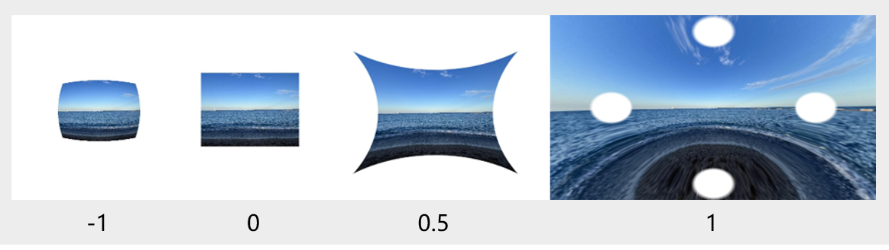

# @ohos.graphics.uiEffect (Cascading Effect) (System API)

The uiEffect module provides basic capabilities to apply an effect, for example, blur, pixel stretch, and brightness, to a component. Effects are classified into filters and visual effects. Effects of the same category can be cascaded in an effect instance of the corresponding category. In actual development, the blur effect can be used for background blurring, and the brightness effect can be used for screen-on display.

- [Filter](#filter): applies a filter to a component.
- [VisualEffect](#visualeffect): applies a visual effect to a component.

> **NOTE**
>
> - The initial APIs of this module are supported since API version 12. Newly added APIs will be marked with a superscript to indicate their earliest API version.
> - This topic describes only system APIs provided by the module. For details about its public APIs, see [ohos.graphics.uiEffect (Cascading Effect)](js-apis-uiEffect.md).

## Modules to Import

```ts
import { uiEffect } from "@kit.ArkGraphics2D";
```
## uiEffect.createBrightnessBlender
createBrightnessBlender(param: BrightnessBlenderParam): BrightnessBlender

Creates a **BrightnessBlender** instance, which can be used to apply the brightness effect to a component.

**System capability**: SystemCapability.Graphics.Drawing

**System API**: This is a system API.

**Parameters**
| Name | Type                                             | Mandatory| Description                       |
| ------ | ------------------------------------------------- | ---- | --------------------------- |
| param  | [BrightnessBlenderParam](#brightnessblenderparam) | Yes  | Parameters that implement the brightness effect.|

**Return value**

| Type                                    | Description                    |
| ---------------------------------------- | ----------------------- |
| [BrightnessBlender ](#brightnessblender) | **BrightnessBlender** instance with the brightness effect.|

**Example**

```ts
let blender : uiEffect.BrightnessBlender =
  uiEffect.createBrightnessBlender({cubicRate:1.0, quadraticRate:1.0, linearRate:1.0, degree:1.0, saturation:1.0,
    positiveCoefficient:[2.3, 4.5, 2.0], negativeCoefficient:[0.5, 2.0, 0.5], fraction:0.0})
```

## Filter
A class that can apply a filter to a component. Before calling any API in **Filter**, you must use [createFilter](js-apis-uiEffect.md#uieffectcreatefilter) to create a **Filter** instance.

### pixelStretch
pixelStretch(stretchSizes: Array\<number\>, tileMode: TileMode): Filter

Applies the pixel stretch effect onto the component.

**System capability**: SystemCapability.Graphics.Drawing

**System API**: This is a system API.

**Parameters**
| Name        | Type                 | Mandatory| Description                      |
| ------------- | --------------------- | ---- | ------------------------- |
| stretchSizes  | Array\<number\>         | Yes  | Ratio based on which the pixels grow towards the top, bottom, left, and right edges. The value range is [-1, 1].<br>A positive value indicates outward stretching, and the upper, lower, left, and right edges are filled with edge pixels of the specified original image ratio. A negative value indicates inward stretching, but the image size remains unchanged:<br>The values for the four directions must be all positive or all negative.|
| tileMode      | [TileMode](#tilemode) | Yes  | Pixel tiling mode for pixel stretch.|


**Return value**

| Type             | Description                              |
| ----------------- | --------------------------------- |
| [Filter](#filter) | **Filter** instance with the pixel stretch effect.|

**Example**

```ts
filter.pixelStretch([0.2, 0.2, 0.2, 0.2], uiEffect.TileMode.CLAMP)
```

### waterRipple
waterRipple(progress: number, waveCount: number, x: number, y: number, rippleMode: WaterRippleMode): Filter

Applies the ripple effect onto the component.

**System capability**: SystemCapability.Graphics.Drawing

**System API**: This is a system API.

**Parameters**
| Name        | Type                 | Mandatory| Description                      |
| ------------- | --------------------- | ---- | ------------------------- |
| progress  | number         | Yes  | Progress of the ripple. The value range is [0, 1].<br>The closer the value is to 1, the more fully the ripple effect is displayed.<br>If a value outside this range is provided, no ripple effect will be displayed.|
| waveCount      | number | Yes  | Number of ripples that form when the ripple effect. The value range is [1, 3].<br>The value must be an integer. Ripples will not be displayed if a floating point number or a value outside this range is provided.|
| x      | number | Yes  | X coordinate on the screen that marks the center of the ripple when the ripple effect is initially triggered.<br>The ripples are normalized across the screen, with the coordinates of the upper left corner set to (0, 0) and the upper right corner set to (1, 0).<br>A negative number indicates that the center of the ripple is located to the left of the screen's center.|
| y      | number | Yes  | Y coordinate on the screen that marks the center of the ripple when the ripple effect is initially triggered.<br>The ripples are normalized across the screen, with the coordinates of the upper left corner set to (0, 0) and the lower left corner set to (0, 1).<br>A negative number indicates that the center of the ripple is located above the screen's center.|
| rippleMode      | [WaterRippleMode](#waterripplemode) | Yes  | Scene mode of the ripple effect.|


**Return value**

| Type             | Description                              |
| ----------------- | --------------------------------- |
| [Filter](#filter) | **Filter** instance with the ripple effect.|

**Error codes**

For details about the error codes, see [Universal Error Codes](../errorcode-universal.md).

| ID| Error Message|
| ------- | -------------------------------- |
| 202  | Permission verification failed. A non-system application calls a system API. |

**Example**

```ts
filter.waterRipple(0.5, 2, 0.5, 0.5, uiEffect.WaterRippleMode.SMALL2SMALL)
```

### flyInFlyOutEffect
flyInFlyOutEffect(degree: number, flyMode: FlyMode): Filter

Applies fly-in and fly-out animations onto the component.

**System capability**: SystemCapability.Graphics.Drawing

**System API**: This is a system API.

**Parameters**
| Name        | Type                 | Mandatory| Description                      |
| ------------- | --------------------- | ---- | ------------------------- |
| degree  | number         | Yes  | Degree of control over deformation of the fly-in and fly-out animations. The value range is [0, 1].<br>A value closer to 1 results in more obvious deformation.<br>If a value outside this range is provided, no fly-in and fly-out animations will be displayed.|
| flyMode      | [FlyMode](#flymode) | Yes  | Scene mode of the fly-in and fly-out animations.<br>**BOTTOM** means that the fly-in and fly-out animations occur from the bottom of the screen,<br>and **TOP** means that the fly-in and fly-out animations occur from the top of the screen.|


**Return value**

| Type             | Description                              |
| ----------------- | --------------------------------- |
| [Filter](#filter) | **Filter** instance with the fly-in and fly-out animations.|

**Error codes**

For details about the error codes, see [Universal Error Codes](../errorcode-universal.md).

| ID| Error Message|
| ------- | -------------------------------- |
| 202  | Permission verification failed. A non-system application calls a system API. |

**Example**

```ts
filter.flyInFlyOutEffect(0.5, uiEffect.FlyMode.TOP)
```

### distort<sup>13+</sup>
distort(distortionK: number): Filter

Applies the lens distortion effect onto the component.

**System capability**: SystemCapability.Graphics.Drawing

**System API**: This is a system API.

**Parameters**
| Name        | Type                 | Mandatory| Description                      |
| ------------- | --------------------- | ---- | ------------------------- |
| distortionK  | number         | Yes  | Distortion coefficient, indicating the degree of lens distortion. The value range is [-1, 1]. A value less than -1 evaluates to the value **-1**. A value greater than 1 evaluates to the value **1**.|



The preceding figure shows the rendering results when different distortion coefficients (-1, 0, 0.5, and 1) are applied onto an **Image** component. A negative distortion value results in a barrel distortion, whereas a positive value results in a pincushion distortion. As the distortion value approaches 0, the intensity of the distortion decreases, and at exactly 0, there is no distortion effect.

**Return value**

| Type             | Description                              |
| ----------------- | --------------------------------- |
| [Filter](#filter) | **Filter** instance with lens distortion effect.|

**Error codes**

For details about the error codes, see [Universal Error Codes](../errorcode-universal.md).

| ID| Error Message|
| ------- | --------------------------------------------|
| 202 | Permission verification failed. A non-system application calls a system API. |

**Example**

```ts
filter.distort(-0.5)
```

## TileMode
Enumerates the pixel tiling modes.

**System capability**: SystemCapability.Graphics.Drawing

**System API**: This is a system API.

| Name  | Value| Description|
| ------ | - | ---- |
| CLAMP  | 0 | Clamp.|
| REPEAT | 1 | Repeat.|
| MIRROR | 2 | Mirror.|
| DECAL  | 3 | Decal.|

## WaterRippleMode
Enumerates the scene modes of the ripple effect.

**System capability**: SystemCapability.Graphics.Drawing

**System API**: This is a system API.

| Name  | Value| Description|
| ------ | - | ---- |
| SMALL2MEDIUM_RECV  | 0 | A phone taps against a 2-in-1 device (receiver).|
| SMALL2MEDIUM_SEND  | 1 | A phone taps against a 2-in-1 device (sender).|
| SMALL2SMALL | 2 | A phone taps against another phone.|

## FlyMode
Enumerates the scene modes of fly-in and fly-out animations.

**System capability**: SystemCapability.Graphics.Drawing

**System API**: This is a system API.

| Name  | Value| Description|
| ------ | - | ---- |
| BOTTOM  | 0 | Fly-in and fly-out animations occur from the bottom of the screen.|
| TOP  | 1 | Fly-in and fly-out animations occur from the top of the screen.|

## VisualEffect
A class that can apply a visual effect to a component. Before calling any API in **VisualEffect**, you must use [createEffect](js-apis-uiEffect.md#uieffectcreateeffect) to create a **VisualEffect** instance.

### backgroundColorBlender
backgroundColorBlender(blender: BrightnessBlender): VisualEffect

Applies a blender to the component to change the background color of the component. The change effect is determined by the input. Currently, only the brightness blender is supported.

**System capability**: SystemCapability.Graphics.Drawing

**System API**: This is a system API.

**Parameters**
| Name | Type                                     | Mandatory| Description                      |
| ------- | ---------------------------------------- | ---- | ------------------------- |
| blender | [BrightnessBlender](#brightnessblender) | Yes  | Blender used to change the background color.|

**Return value**

| Type                         | Description                                              |
| ----------------------------- | ------------------------------------------------- |
| [VisualEffect](#visualeffect) | **VisualEffect** instance with the background color change effect.|

**Example**

```ts
let blender : uiEffect.BrightnessBlender =
  uiEffect.createBrightnessBlender({cubicRate:1.0, quadraticRate:1.0, linearRate:1.0, degree:1.0, saturation:1.0,
    positiveCoefficient:[2.3, 4.5, 2.0], negativeCoefficient:[0.5, 2.0, 0.5], fraction:0.0})
visualEffect.backgroundColorBlender(blender)
```

## Blender<sup>13+</sup>

type Blender = BrightnessBlender

Defines the blender type, which is used to describe blending effects.

**System capability**: SystemCapability.Graphics.Drawing

**System API**: This is a system API.

| Type                         | Description                                              |
| ----------------------------- | ------------------------------------------------- |
| [BrightnessBlender](#brightnessblender) | Blender with a brightening effect.|

## BrightnessBlender
A blender that can apply the brightness effect to a component. Before calling any API in **BrightnessBlender**, you must use [createBrightnessBlender](#uieffectcreatebrightnessblender) to create a **BrightnessBlender** instance.

**System capability**: SystemCapability.Graphics.Drawing

**System API**: This is a system API.

| Name               | Type                       | Read Only| Optional| Description                                                             |
| ------------------- | -------------------------- | ---- | ---- | ---------------------------------------------------------------- |
| cubicRate           | number                     | No  | No  | Third-order coefficient for grayscale adjustment.<br>The value range is [-20, 20].                       |
| quadraticRate       | number                     | No  | No  | Second-order coefficient for grayscale adjustment.<br>The value range is [-20, 20].                       |
| linearRate          | number                     | No  | No  | Linear coefficient for grayscale adjustment.<br>The value range is [-20, 20].                       |
| degree              | number                     | No  | No  | Grayscale adjustment ratio.<br>The value range is [-20, 20].                           |
| saturation          | number                     | No  | No  | Reference saturation for the brightness effect.<br>The value range is [0, 20].                           |
| positiveCoefficient | [number, number, number]   | No  | No  | RGB positive adjustment parameter based on the reference saturation.<br>The value range of each number is [-20, 20].|
| negativeCoefficient | [number, number, number]   | No  | No  | RGB negative adjustment parameter based on the reference saturation.<br>The value range of each number is [-20, 20].|
| fraction            | number                     | No  | No  | Blending ratio of the brightness effect.<br>The value range is [0, 1]. A value beyond the boundary will be automatically truncated during implementation. |

## BrightnessBlenderParam
Describes the parameters used for the brightness blender.

**System capability**: SystemCapability.Graphics.Drawing

**System API**: This is a system API.

| Name               | Type                       | Read Only| Optional| Description                                                             |
| ------------------- | -------------------------- | ---- | ---- | ---------------------------------------------------------------- |
| cubicRate           | number                     | No  | No  | Third-order coefficient for grayscale adjustment.<br>The value range is [-20, 20].                       |
| quadraticRate       | number                     | No  | No  | Second-order coefficient for grayscale adjustment.<br>The value range is [-20, 20].                       |
| linearRate          | number                     | No  | No  | Linear coefficient for grayscale adjustment.<br>The value range is [-20, 20].                       |
| degree              | number                     | No  | No  | Grayscale adjustment ratio.<br>The value range is [-20, 20].                           |
| saturation          | number                     | No  | No  | Reference saturation for the brightness effect.<br>The value range is [0, 20].                           |
| positiveCoefficient | [number, number, number]   | No  | No  | RGB positive adjustment parameter based on the reference saturation.<br>The value range of each number is [-20, 20].|
| negativeCoefficient | [number, number, number]   | No  | No  | RGB negative adjustment parameter based on the reference saturation.<br>The value range of each number is [-20, 20].|
| fraction            | number                     | No  | No  | Blending ratio of the brightness effect.<br>The value range is [0, 1]. A value beyond the boundary will be automatically truncated during implementation. |
