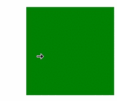

# Class (CursorController)

Provides the capability to set cursor styles.

> **NOTE**
>
> - The initial APIs of this module are supported since API version 10. Updates will be marked with a superscript to indicate their earliest API version.
>
> - The initial APIs of this class are supported since API version 12.
>
> - In the following API examples, you must first use [getCursorController()](arkts-apis-uicontext-uicontext.md#getcursorcontroller12) in **UIContext** to obtain a **CursorController** instance, and then call the APIs using the obtained instance.

## restoreDefault<sup>12+</sup>

restoreDefault(): void

Restores the default cursor style.

**Atomic service API**: This API can be used in atomic services since API version 12.

**System capability**: SystemCapability.ArkUI.ArkUI.Full

**Example**

In this example, the **restoreDefault** API of **CursorController** is used to restore the cursor style when the cursor moves out of the green frame.

```ts
import { pointer } from '@kit.InputKit';
import { UIContext, CursorController } from '@kit.ArkUI';

@Entry
@Component
struct CursorControlExample {
  @State text: string = '';
  cursorCustom: CursorController = this.getUIContext().getCursorController();

  build() {
    Column() {
      Row().height(200).width(200).backgroundColor(Color.Green).position({x: 150 ,y:70})
        .onHover((flag) => {
          if (flag) {
            this.cursorCustom.setCursor(pointer.PointerStyle.EAST);
          } else {
            console.info("restoreDefault");
            this.cursorCustom.restoreDefault();
          }
        })
    }.width('100%')
  }
}
```


## setCursor<sup>12+</sup>

setCursor(value: PointerStyle): void

Sets the cursor style.

**Atomic service API**: This API can be used in atomic services since API version 12.

**System capability**: SystemCapability.ArkUI.ArkUI.Full

**Parameters**

| Name    | Type                                      | Mandatory  | Description     |
| ------- | ---------------------------------------- | ---- | ------- |
| value | [PointerStyle](arkts-apis-uicontext-t.md#pointerstyle12) | Yes   | Pointer style.|

**Example**

In this example, the **setCursor** API of **CursorController** is used to set the cursor style to **PointerStyle.WEST** when the cursor moves into the blue frame.

```ts
import { pointer } from '@kit.InputKit';
import { UIContext, CursorController } from '@kit.ArkUI';

@Entry
@Component
struct CursorControlExample {
  @State text: string = '';
  cursorCustom: CursorController = this.getUIContext().getCursorController();

  build() {
    Column() {
      Row().height(200).width(200).backgroundColor(Color.Blue).position({x: 100 ,y:70})
        .onHover((flag) => {
          if (flag) {
            this.cursorCustom.setCursor(pointer.PointerStyle.WEST);
          } else {
            this.cursorCustom.restoreDefault();
          }
        })
    }.width('100%')
  }
}
```

