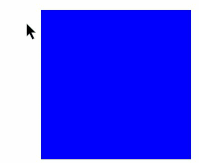
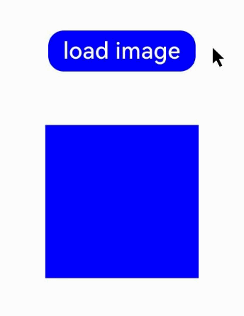

# Class (CursorController)
<!--Kit: ArkUI-->
<!--Subsystem: ArkUI-->
<!--Owner: @yihao-lin-->
<!--Designer: @piggyguy-->
<!--Tester: @songyanhong-->
<!--Adviser: @Brilliantry_Rui-->

This class provides the capability to set mouse cursor styles, including restoring the default mouse cursor style, setting system mouse cursor styles, and setting custom mouse cursor styles. This is suitable for scenarios where the mouse cursor display needs to be dynamically adjusted based on interface interaction states, helping to improve the clarity of interactive feedback.

> **NOTE**
>
> - The initial APIs of this module are supported since API version 10. Newly added APIs will be marked with a superscript to indicate their earliest API version.
>
> - The initial APIs of this class are supported since API version 12.
>
> - The APIs of this module can be used only in the stage model.
>
> - In the following API examples, you must first use [getCursorController()](arkts-apis-uicontext-uicontext.md#getcursorcontroller12) in **UIContext** to obtain a **CursorController** instance, and then call the APIs using the obtained instance.

## restoreDefault<sup>12+</sup>

restoreDefault(): void

Restores the default cursor style.

**Model restriction**: This API can be used only in the stage model.

**Atomic service API**: This API can be used in atomic services since API version 12.

**System capability**: SystemCapability.ArkUI.ArkUI.Full

**Example**

In this example, the **restoreDefault** API of **CursorController** is used to restore the cursor style when the cursor moves out of the green frame.

```ts
import { pointer } from '@kit.InputKit';
import { CursorController } from '@kit.ArkUI';

@Entry
@Component
struct CursorControlExample {
  cursorController: CursorController = this.getUIContext().getCursorController();

  build() {
    Column() {
      Row().height(200).width(200).backgroundColor(Color.Green).position({x: 150, y:70})
        .onHover((flag) => {
          if (flag) {
            this.cursorController.setCursor(pointer.PointerStyle.EAST);
          } else {
            console.info('restoreDefault');
            this.cursorController.restoreDefault();
          }
        })
    }.width('100%')
  }
}
```


## setCursor<sup>12+</sup>

setCursor(value: PointerStyle): void

Sets the cursor style.

**Model restriction**: This API can be used only in the stage model.

> **NOTE**
>
> This API does not take effect immediately. The cursor style will be updated in the next rendering frame.

**Atomic service API**: This API can be used in atomic services since API version 12.

**System capability**: SystemCapability.ArkUI.ArkUI.Full

**Parameters**

| Name    | Type                                      | Mandatory  | Description     |
| ------- | ---------------------------------------- | ---- | ------- |
| value | [PointerStyle](arkts-apis-uicontext-t.md#pointerstyle) | Yes   | Mouse cursor style, specifying the system-defined cursor type to set (such as arrow, hand pointer, and crosshair). For the meaning of each style, see the PointerStyle enumeration description.|

**Example**

In this example, the **setCursor** API of **CursorController** is used to set the cursor style to **PointerStyle.WEST** when the cursor moves into the blue frame.

```ts
import { pointer } from '@kit.InputKit';
import { CursorController } from '@kit.ArkUI';

@Entry
@Component
struct CursorControlExample {
  @State text: string = '';
  cursorCustom: CursorController = this.getUIContext().getCursorController();

  build() {
    Column() {
      Row().height(200).width(200).backgroundColor(Color.Blue).position({x: 100, y:70})
        .onHover((flag) => {
          if (flag) {
            this.cursorCustom.setCursor(pointer.PointerStyle.WEST);
          } else {
            this.cursorCustom.restoreDefault();
          }
        })
    }.width('100%')
  }
}
```


## setCustomCursor

setCustomCursor(value: image.PixelMap, focusX?: number, focusY?: number): void

Sets the custom cursor style.

> **NOTE**
>
> - This API does not take effect immediately. The cursor style will be updated in the next rendering frame.
> - Only static images are supported. Dynamic images are not supported.

**Since**: 26.0.0

**Atomic service API**: This API can be used in atomic services since API version 26.0.0.

**System capability**: SystemCapability.ArkUI.ArkUI.Full

**Model restriction**: This API can be used only in the stage model.

**Parameters**

| Name   | Type                             | Mandatory  | Description                                    |
| ------- | ------------------------------- | ---- | -------------------------------------- |
| value | [image.PixelMap](../apis-image-kit/arkts-apis-image-PixelMap.md) | Yes| Pixel map of the custom mouse cursor style. Only static images are supported. Dynamic images are not supported. The maximum size is 256 × 256 px. If the image exceeds this size, the setting will not take effect, and the mouse cursor will remain unchanged.|
| focusX | number | No| X coordinate of the custom cursor focus point. The origin is the upper-left corner of the cursor image, with the positive direction to the right. This focus point is aligned with the system mouse pointer's screen coordinates when displayed, and operations such as clicking and dragging are based on this point.<br>Default value: **0**<br>Unit: px<br>Value range: [0, image width]. If the value is out of the range, the default value is used.|
| focusY | number | No| Y coordinate of the custom cursor focus point. The origin is the upper-left corner of the cursor image, with the positive direction downward. Together with **focusX**, it determines the point within the image that represents the actual interaction position.<br>Default value: **0**<br>Unit: px<br>Value range: [0, image height]. If the value is out of the range, the default value is used.|

**Example**

When the cursor enters the blue box and the custom cursor image has been loaded, call the [setCustomCursor](#setcustomcursor) API to set the custom mouse cursor style.

```ts
import { image } from '@kit.ImageKit';
import { CursorController } from '@kit.ArkUI';
import { BusinessError } from '@kit.BasicServicesKit';

@Entry
@Component
struct CustomCursorExample {
  cursorController: CursorController = this.getUIContext().getCursorController();
  @State pixelMap: image.PixelMap | undefined = undefined;

  async loadPixelMapFromRawFile(): Promise<void> {
    try {
      // 1. Obtain the resource manager and add null value check.
      const uiContext = this.getUIContext();
      if (!uiContext) {
        console.error('UIContext is undefined');
        return;
      }
      const context = uiContext.getHostContext();
      if (!context) {
        console.error('HostContext is undefined');
        return;
      }
      const resourceManager = context.resourceManager;
      if (!resourceManager) {
        console.error('ResourceManager is undefined');
        return;
      }
      // 2. Read the image file in rawfile.
      const fileData: Uint8Array = await resourceManager.getRawFileContent('cursor.png');
      const buffer = fileData.buffer.slice(0);
      // 3. Create an ImageSource object.
      const imageSource = image.createImageSource(buffer);
      // 4. Create a PixelMap object (you can specify the expected dimensions).
      const pixelMap = await imageSource.createPixelMap({
        desiredSize: { width: 32, height: 32 }
      });
      this.pixelMap = pixelMap;
      console.info('Custom cursor loaded successfully');
    } catch (error) {
      let err = error as BusinessError;
      console.error(`Failed to load cursor. Code: ${err.code}, message: ${err.message}`);
    }
  }

  build() {
    Column() {
      Button('load image')
        .width('40%')
        .height('7%')
        .fontSize('30vp')
        .margin(70)
        .backgroundColor(Color.Blue)
        .onClick(() => {
          // Tap the button to load the PixelMap.
          this.loadPixelMapFromRawFile();
        })
      Row()
        .height(200)
        .width(200)
        .backgroundColor(Color.Blue)
        .onHover((isHover: boolean) => {
          if (isHover && this.pixelMap != undefined) {
            // Set a custom mouse cursor style with the focus point at (16, 16), which is the center of the cursor.
            this.cursorController.setCustomCursor(this.pixelMap, 16, 16);
          } else {
            this.cursorController.restoreDefault();
          }
        })
    }
    .justifyContent(FlexAlign.Center)
    .alignItems(HorizontalAlign.Center)
    .width('100%')
    .height('100%')
  }

  aboutToDisappear(): void {
    // Release the PixelMap resource.
    if (this.pixelMap) {
      this.pixelMap.release();
      this.pixelMap = undefined;
    }
    this.cursorController.restoreDefault();
  }
}
```


