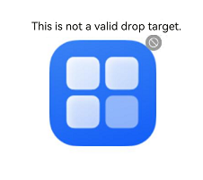

# Class (DragController)
<!--Kit: ArkUI-->
<!--Subsystem: ArkUI-->
<!--Owner: @jiangtao92-->
<!--Designer: @piggyguy-->
<!--Tester: @songyanhong-->
<!--Adviser: @HelloCrease-->

Provides APIs for initiating drag actions. When receiving a gesture event, such as a touch or long-press event, an application can initiate a drag action and carry drag information therein.

> **NOTE**
>
> - The initial APIs of this module are supported since API version 10. Updates will be marked with a superscript to indicate their earliest API version.
>
> - The initial APIs of this class are supported since API version 11.
>
> - In the following API examples, you must first use [getDragController()](arkts-apis-uicontext-uicontext.md#getdragcontroller11) in **UIContext** to obtain a **DragController** instance, and then call the APIs using the obtained instance.

## executeDrag<sup>11+</sup>

executeDrag(custom: CustomBuilder | DragItemInfo, dragInfo: dragController.DragInfo, callback: AsyncCallback&lt;dragController.DragEventParam&gt;): void

Initiates a drag action, with the object to be dragged and the drag information passed in. This API uses a callback to return the drag event result.

**Atomic service API**: This API can be used in atomic services since API version 12.

**System capability**: SystemCapability.ArkUI.ArkUI.Full

**Parameters**

| Name  | Type                                                        | Mandatory| Description                                                        |
| -------- | ------------------------------------------------------------ | ---- | ------------------------------------------------------------ |
| custom   | [CustomBuilder](arkui-ts/ts-types.md#custombuilder8) \| [DragItemInfo](arkui-ts/ts-universal-events-drag-drop.md#dragiteminfo) | Yes  | Object to be dragged.<br> **NOTE**<br>The global builder is not supported. If the [Image](arkui-ts/ts-basic-components-image.md) component is used in the builder, enable synchronous loading, that is, set the [syncLoad](arkui-ts/ts-basic-components-image.md#syncload8) attribute of the component to **true**. The builder is used only to generate the image displayed during the current dragging. If the root component of the builder has zero width or height, it will cause failure in drag image generation, which in turn breaks the entire drag operation. Changes to the builder, if any, apply to the next dragging, but not to the current dragging.|
| dragInfo | [dragController.DragInfo](js-apis-arkui-dragController.md#draginfo) | Yes  | Drag information.                                                  |
| callback | [AsyncCallback](../apis-basic-services-kit/js-apis-base.md#asynccallback)&lt;[dragController.DragEventParam](js-apis-arkui-dragController.md#drageventparam12)&gt; | Yes  | Callback used to return the result.<br>- **event**: drag event information that includes only the drag result.<br>- **extraParams**: extra information about the drag event.|

**Error codes**

For details about the error codes, see [Universal Error Codes](../errorcode-universal.md).

| ID| Error Message     |
| -------- | ------------- |
| 401      | Parameter error. Possible causes: 1. Mandatory parameters are left unspecified; 2.Incorrect parameters types; 3. Parameter verification failed. |
| 100001   | Internal handling failed. |

**Example**

```ts
import { dragController } from '@kit.ArkUI';
import { unifiedDataChannel } from '@kit.ArkData';

@Entry
@Component
struct DragControllerPage {
  @Builder DraggingBuilder() {
    Column() {
      Text("DraggingBuilder")
    }
    .width(100)
    .height(100)
    .backgroundColor(Color.Blue)
  }

  build() {
    Column() {
      Button('touch to execute drag')
        .onTouch((event?: TouchEvent) => {
          if (event) {
            if (event.type == TouchType.Down) {
              let text = new unifiedDataChannel.Text();
              let unifiedData = new unifiedDataChannel.UnifiedData(text);

              let dragInfo: dragController.DragInfo = {
                pointerId: 0,
                data: unifiedData,
                extraParams: ''
              };
              class tmp {
                event: DragEvent | undefined = undefined;
                extraParams: string = '';
              }
              let eve: tmp = new tmp();
              this.getUIContext().getDragController().executeDrag(() => { this.DraggingBuilder() }, dragInfo, (err, eve) => {
                if (eve.event) {
                  if (eve.event.getResult() == DragResult.DRAG_SUCCESSFUL) {
                    // ...
                  } else if (eve.event.getResult() == DragResult.DRAG_FAILED) {
                    // ...
                  }
                }
              })
            }
          }
        })
    }
  }
}
```

## executeDrag<sup>11+</sup>

executeDrag(custom: CustomBuilder | DragItemInfo, dragInfo: dragController.DragInfo): Promise&lt;dragController.DragEventParam&gt;

Initiates a drag action, with the object to be dragged and the drag information passed in. This API uses a promise to return the drag event result.

**Atomic service API**: This API can be used in atomic services since API version 12.

**System capability**: SystemCapability.ArkUI.ArkUI.Full

**Parameters**

| Name  | Type                                                        | Mandatory| Description                            |
| -------- | ------------------------------------------------------------ | ---- | -------------------------------- |
| custom   | [CustomBuilder](arkui-ts/ts-types.md#custombuilder8) \| [DragItemInfo](arkui-ts/ts-universal-events-drag-drop.md#dragiteminfo) | Yes  | Object to be dragged.|
| dragInfo | [dragController.DragInfo](js-apis-arkui-dragController.md#draginfo)                                        | Yes  | Drag information.                      |

**Return value**

| Type                                                        | Description                                                        |
| ------------------------------------------------------------ | ------------------------------------------------------------ |
| Promise&lt;[dragController.DragEventParam](js-apis-arkui-dragController.md#drageventparam12)&gt; | Promise used to return the result.<br>- **event**: drag event information that includes only the drag result.<br>- **extraParams**: extra information about the drag event.|

**Error codes**

For details about the error codes, see [Universal Error Codes](../errorcode-universal.md).

| ID| Error Message     |
| -------- | ------------- |
| 401      | Parameter error. Possible causes: 1. Mandatory parameters are left unspecified; 2.Incorrect parameters types; 3. Parameter verification failed. |
| 100001   | Internal handling failed. |

**Example**

```ts
import { dragController } from '@kit.ArkUI';
import { image } from '@kit.ImageKit';
import { unifiedDataChannel } from '@kit.ArkData';

@Entry
@Component
struct DragControllerPage {
  @State pixmap: image.PixelMap | null = null;

  @Builder DraggingBuilder() {
    Column() {
      Text("DraggingBuilder")
    }
    .width(100)
    .height(100)
    .backgroundColor(Color.Blue)
  }

  @Builder PixmapBuilder() {
    Column() {
      Text("PixmapBuilder")
    }
    .width(100)
    .height(100)
    .backgroundColor(Color.Blue)
  }

  build() {
    Column() {
      Button('touch to execute drag')
        .onTouch((event?: TouchEvent) => {
          if (event) {
            if (event.type == TouchType.Down) {
              let text = new unifiedDataChannel.Text();
              let unifiedData = new unifiedDataChannel.UnifiedData(text);

              let dragInfo: dragController.DragInfo = {
                pointerId: 0,
                data: unifiedData,
                extraParams: ''
              };
              let pb: CustomBuilder = (): void => { this.PixmapBuilder() };
              this.getUIContext().getComponentSnapshot().createFromBuilder(pb).then((pix: image.PixelMap) => {
                this.pixmap = pix;
                let dragItemInfo: DragItemInfo = {
                  pixelMap: this.pixmap,
                  builder: () => { this.DraggingBuilder() },
                  extraInfo: "DragItemInfoTest"
                };

                class tmp {
                  event: DragResult | undefined = undefined;
                  extraParams: string = '';
                }
                let eve: tmp = new tmp();
                this.getUIContext().getDragController().executeDrag(dragItemInfo, dragInfo)
                  .then((eve) => {
                    if (eve.event.getResult() == DragResult.DRAG_SUCCESSFUL) {
                      // ...
                    } else if (eve.event.getResult() == DragResult.DRAG_FAILED) {
                      // ...
                    }
                  })
                  .catch((err: Error) => {
                  })
              })
            }
          }
        })
    }
    .width('100%')
    .height('100%')
  }
}
```

## createDragAction<sup>11+</sup>

createDragAction(customArray: Array&lt;CustomBuilder \| DragItemInfo&gt;, dragInfo: dragController.DragInfo): dragController.DragAction

Creates a drag action object for initiating drag and drop operations. You need to explicitly specify one or more drag previews, the drag data, and the drag handle point. If a drag operation initiated by an existing drag action object is not completed, no new object can be created, and calling the API will throw an exception. After the lifecycle of the drag action object ends, the callback functions registered on this object become invalid. Therefore, it is necessary to hold this object within a longer scope and replace the old value with a new object returned by **createDragAction** before each drag initiation.

Note: You are advised to control the number of drag previews. If too many previews are passed in, the drag efficiency may be affected.

**Atomic service API**: This API can be used in atomic services since API version 12.

**System capability**: SystemCapability.ArkUI.ArkUI.Full

**Parameters**

| Name  | Type                                                        | Mandatory| Description                            |
| --------      | ------------------------------------------------------------ | ---- | -------------------------------- |
| customArray  | Array&lt;[CustomBuilder](arkui-ts/ts-types.md#custombuilder8) \| [DragItemInfo](arkui-ts/ts-universal-events-drag-drop.md#dragiteminfo)&gt; | Yes  | Object to be dragged.|
| dragInfo | [dragController.DragInfo](js-apis-arkui-dragController.md#draginfo)                                | Yes  | Drag information.                      |

**Return value**

| Type                                                  | Description              |
| ------------------------------------------------------ | ------------------ |
| [dragController.DragAction](js-apis-arkui-dragController.md#dragaction11)| **DragAction** object, which is used to subscribe to drag state changes and start the drag service.|

**Error codes**

For details about the error codes, see [Universal Error Codes](../errorcode-universal.md).

| ID| Error Message     |
| -------- | ------------- |
| 401      | Parameter error. Possible causes: 1. Mandatory parameters are left unspecified; 2.Incorrect parameters types; 3. Parameter verification failed. |
| 100001   | Internal handling failed. |

**Example**

1. In the **EntryAbility.ets** file, obtain the UI context and save it to LocalStorage.

```ts
import { AbilityConstant, UIAbility, Want } from '@kit.AbilityKit';
import { hilog } from '@kit.PerformanceAnalysisKit';
import { window, UIContext } from '@kit.ArkUI';

let uiContext: UIContext;
let localStorage: LocalStorage = new LocalStorage('uiContext');

export default class EntryAbility extends UIAbility {
  storage: LocalStorage = localStorage;
  onCreate(want: Want, launchParam: AbilityConstant.LaunchParam): void {
    hilog.info(0x0000, 'testTag', '%{public}s', 'Ability onCreate');
  }

  onDestroy(): void {
    hilog.info(0x0000, 'testTag', '%{public}s', 'Ability onDestroy');
  }

  onWindowStageCreate(windowStage: window.WindowStage): void {
    // Main window is created, set main page for this ability
    hilog.info(0x0000, 'testTag', '%{public}s', 'Ability onWindowStageCreate');

    windowStage.loadContent('pages/Index', this.storage, (err, data) => {
      if (err.code) {
        hilog.error(0x0000, 'testTag', 'Failed to load the content. Cause: %{public}s', JSON.stringify(err) ?? '');
        return;
      }
      hilog.info(0x0000, 'testTag', 'Succeeded in loading the content. Data: %{public}s', JSON.stringify(data) ?? '');
      windowStage.getMainWindow((err, data) =>
      {
        if (err.code) {
          console.error('Failed to abtain the main window. Cause:' + err.message);
          return;
        }
        let windowClass: window.Window = data;
        uiContext = windowClass.getUIContext();
        this.storage.setOrCreate<UIContext>('uiContext', uiContext);
        // Obtain a UIContext instance.
      });
    });
  }

  onWindowStageDestroy(): void {
    // Main window is destroyed, release UI related resources
    hilog.info(0x0000, 'testTag', '%{public}s', 'Ability onWindowStageDestroy');
  }

  onForeground(): void {
    // Ability has brought to foreground
    hilog.info(0x0000, 'testTag', '%{public}s', 'Ability onForeground');
  }

  onBackground(): void {
    // Ability has back to background
    hilog.info(0x0000, 'testTag', '%{public}s', 'Ability onBackground');
  }
}
```
2. Call **this.getUIContext().getSharedLocalStorage()** to obtain the UI context and then use the **DragController** object obtained to perform subsequent operations.
```ts
import { dragController, componentSnapshot, UIContext, DragController } from '@kit.ArkUI';
import { image } from '@kit.ImageKit';
import { unifiedDataChannel } from '@kit.ArkData';

@Entry()
@Component
struct DragControllerPage {
  @State pixmap: image.PixelMap | null = null;
  private dragAction: dragController.DragAction | null = null;
  customBuilders: Array<CustomBuilder | DragItemInfo> = new Array<CustomBuilder | DragItemInfo>();
  storages = this.getUIContext().getSharedLocalStorage();

  @Builder DraggingBuilder() {
    Column() {
      Text("DraggingBuilder")
    }
    .width(100)
    .height(100)
    .backgroundColor(Color.Blue)
  }

  build() {
    Column() {

      Column() {
        Text("Test")
      }
      .width(100)
      .height(100)
      .backgroundColor(Color.Red)

      Button('Drag Multiple Objects').onTouch((event?: TouchEvent) => {
        if (event) {
          if (event.type == TouchType.Down) {
            console.info("muti drag Down by listener");
            this.customBuilders.push(() => { this.DraggingBuilder() });
            this.customBuilders.push(() => { this.DraggingBuilder() });
            this.customBuilders.push(() => { this.DraggingBuilder() });
            let text = new unifiedDataChannel.Text();
            let unifiedData = new unifiedDataChannel.UnifiedData(text);
            let dragInfo: dragController.DragInfo = {
              pointerId: 0,
              data: unifiedData,
              extraParams: ''
            };
            try{
              let uiContext: UIContext = this.storages?.get<UIContext>('uiContext') as UIContext;
              this.dragAction = uiContext.getDragController().createDragAction(this.customBuilders, dragInfo);
              if (!this.dragAction) {
                console.info("listener dragAction is null");
                return;
              }
              this.dragAction.on('statusChange', (dragAndDropInfo) => {
                if (dragAndDropInfo.status == dragController.DragStatus.STARTED) {
                  console.info("drag has start");
                } else if (dragAndDropInfo.status == dragController.DragStatus.ENDED) {
                  console.info("drag has end");
                  if (!this.dragAction) {
                    return;
                  }
                  this.customBuilders.splice(0, this.customBuilders.length);
                  this.dragAction.off('statusChange');
                }
              })
              this.dragAction.startDrag().then(() => {}).catch((err: Error) => {
                console.error("start drag Error:" + err.message);
              })
            } catch(err) {
              console.error("create dragAction Error:" + err.message);
            }
          }
        }
      }).margin({ top: 20 })
    }
  }
}
```

## getDragPreview<sup>11+</sup>

getDragPreview(): dragController.DragPreview

Obtains the **DragPreview** object, which represents the preview displayed during a drag operation.

**Atomic service API**: This API can be used in atomic services since API version 12.

**System capability**: SystemCapability.ArkUI.ArkUI.Full

**Return value**

| Type                                                        | Description                                                        |
| ------------------------------------------------------------ | ------------------------------------------------------------ |
| [dragController.DragPreview](js-apis-arkui-dragController.md#dragpreview11) | **DragPreview** object. It provides the API for setting the preview style. It does not work in the **OnDrop** and **OnDragEnd** callbacks.|

**Error codes**: For details about universal error codes, see [Universal Error Codes](../errorcode-universal.md).

**Example**

See the example for [animate](js-apis-arkui-dragController.md#animate11).

## setDragEventStrictReportingEnabled<sup>12+</sup>

setDragEventStrictReportingEnabled(enable: boolean): void

Sets whether the **onDragLeave** callback of the parent component is triggered when an item is dragged from the parent to the child component.

**Atomic service API**: This API can be used in atomic services since API version 12.

**System capability**: SystemCapability.ArkUI.ArkUI.Full

**Parameters**

| Name| Type   | Mandatory| Description                                                        |
| ------ | ------- | ---- | ------------------------------------------------------------ |
| enable | boolean | Yes  | Whether the **onDragLeave** callback of the parent component is triggered when an item is dragged from the parent to the child component. The value **true** means the **onDragLeave** callback of the parent component is triggered, and **false** means the opposite.|

**Example**

```ts
import { UIAbility } from '@kit.AbilityKit';
import { window, UIContext } from '@kit.ArkUI';

 export default class EntryAbility extends UIAbility {
   onWindowStageCreate(windowStage: window.WindowStage): void {
       windowStage.loadContent('pages/Index', (err, data) => {
         if (err.code) {
         return;
       }
       windowStage.getMainWindow((err, data) => {
         if (err.code) {
           return;
         }
         let windowClass: window.Window = data;
         let uiContext: UIContext = windowClass.getUIContext();
         uiContext.getDragController().setDragEventStrictReportingEnabled(true);
     });
   });
 }
}
```

## cancelDataLoading<sup>15+</sup>

cancelDataLoading(key: string): void

Cancels the data loading initiated by the [startDataLoading](arkui-ts/ts-universal-events-drag-drop.md#dragevent7) API.

**Atomic service API**: This API can be used in atomic services since API version 15.

**System capability**: SystemCapability.ArkUI.ArkUI.Full

**Parameters**

| Name| Type   | Mandatory| Description                                                        |
| ------ | ------- | ---- | ------------------------------------------------------------ |
| key | string | Yes  | Identifier for the drag data. It is used to distinguish between different drag operations. The key can be obtained through the **startDataLoading** API.|

**Error codes**

For details about the error codes, see [Universal Error Codes](../errorcode-universal.md) and [Drag Event Error Codes](./errorcode-drag-event.md).

| ID| Error Message                                                    |
| -------- | ------------------------------------------------------------ |
| 401      | Parameter error. |
| 190004      | Operation failed. |

## notifyDragStartRequest<sup>18+</sup>

notifyDragStartRequest(requestStatus: dragController.DragStartRequestStatus): void

Controls whether the application can initiate a drag operation.

**Atomic service API**: This API can be used in atomic services since API version 18.

**System capability**: SystemCapability.ArkUI.ArkUI.Full

**Parameters**

| Name| Type  | Mandatory| Description                                                       |
| ------ | ------- | ---- | ------------------------------------------------------------ |
| requestStatus  | [dragController.DragStartRequestStatus](js-apis-arkui-dragController.md#dragstartrequeststatus18)    | Yes |Whether the application can initiate a drag operation.|

**Example**

```ts
import { unifiedDataChannel } from '@kit.ArkData';
import { image } from '@kit.ImageKit';
import { dragController } from '@kit.ArkUI';

// xxx.ets
@Entry
@Component
struct NormalEts {
  @State finished: boolean = false;
  @State timeout1: number = 1;
  @State pixmap: image.PixelMap | undefined = undefined;
  @State unifiedData1: unifiedDataChannel.UnifiedData | undefined = undefined;
  @State previewData: DragItemInfo | undefined = undefined;

  loadData() {
    let timeout = setTimeout(() => {
      this.getUIContext().getComponentSnapshot().get("image1", (error: Error, pixmap: image.PixelMap) => {
        this.pixmap = pixmap;
        this.previewData = {
          pixelMap: this.pixmap
        };
      });

      let data: unifiedDataChannel.Image = new unifiedDataChannel.Image();
      data.imageUri = "app.media.startIcon";
      let unifiedData = new unifiedDataChannel.UnifiedData(data);
      this.unifiedData1 = unifiedData;

      this.getUIContext().getDragController().notifyDragStartRequest(dragController.DragStartRequestStatus.READY);
    }, 4000);
    this.timeout1 = timeout;
  }


    build() {
      Column({space: 20}) {
        Image($r("app.media.startIcon"))
          .width(300)
          .height(200)
          .id("image1")
          .draggable(true)
          .dragPreview(this.previewData)
          .onPreDrag((status: PreDragStatus) => {
            if (status == PreDragStatus.PREPARING_FOR_DRAG_DETECTION) {
              this.loadData();
            } else {
              clearTimeout(this.timeout1);
            }
          })
          .onDragStart((event: DragEvent) => {
            if (this.finished == false) {
              this.getUIContext().getDragController().notifyDragStartRequest(dragController.DragStartRequestStatus.WAITING);
            } else {
              event.setData(this.unifiedData1);
            }
          })
          .onDragEnd(() => {
            this.finished = false;
          })
      }
      .height(400)
      .backgroundColor(Color.Pink)
    }
}
```
## enableDropDisallowedBadge<sup>20+</sup>

enableDropDisallowedBadge(enabled: boolean): void

Specifies whether to enable the display of a disallowed badge when dragged content is incompatible with a component's configured [allowDrop](../apis-arkui/arkui-ts/ts-universal-attributes-drag-drop.md#allowdrop) types. With the display enabled, the system automatically shows a disallowed badge during drag operations when the dragged data types have no intersection with the target component's allowed drop types. This API currently does not support [UIExtension](../apis-arkui/js-apis-arkui-uiExtension.md).

**Atomic service API**: This API can be used in atomic services since API version 20.

**System capability**: SystemCapability.ArkUI.ArkUI.Full

**Parameters**

| Name| Type   | Mandatory| Description                                                        |
| ------ | ------- | ---- | ------------------------------------------------------------ |
| enabled | boolean | Yes  | Whether to enable the display of a disallowed badge when dragged content is incompatible with a component's configured [allowDrop](../apis-arkui/arkui-ts/ts-universal-attributes-drag-drop.md#allowdrop) types. The value **true** means to enable the display of a disallowed badge, and **false** means the opposite. The default value is **false**.|

**Example**

This example demonstrates how to use the **enableDropDisallowedBadge** API to enable the display of a disallowed badge when dragged content is incompatible with the target component's allowed drop types.

```ts
import { UIAbility } from '@kit.AbilityKit';
import { window, UIContext } from '@kit.ArkUI';

 export default class EntryAbility extends UIAbility {
   onWindowStageCreate(windowStage: window.WindowStage): void {
       windowStage.loadContent('pages/Index', (err, data) => {
         if (err.code) {
         return;
       }
       windowStage.getMainWindow((err, data) => {
         if (err.code) {
           return;
         }
         let windowClass: window.Window = data;
         let uiContext: UIContext = windowClass.getUIContext();
         uiContext.getDragController().enableDropDisallowedBadge(true);
     });
   });
 }
}
```

