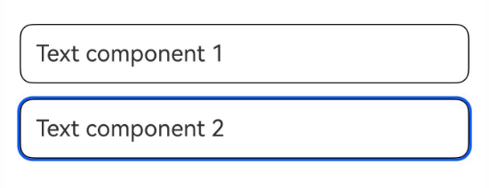

# Class (SelectActionProposal)

<!--Kit: ArkUI-->
<!--Subsystem: ArkUI-->
<!--Owner: @yihao-lin-->
<!--Designer: @piggyguy-->
<!--Tester: @songyanhong-->
<!--Adviser: @Brilliantry_Rui-->
<!-- md-trans-meta sourceCommit=1679aa2b39603a323ce91f1907155d8cbd2b330b translatedAt=2026-08-11T01:53:23.798Z pushedAt=2026-08-11T06:05:02.131Z -->

Smart gesture selection action handling. When dynamically customizing smart gesture behavior through the [registerMonitor](./arkts-apis-uicontext-smartgesturecontroller.md#registermonitor) API, setting **selectedProposal** of the return value [Class (GestureHandlingResolution)](./arkts-apis-uicontext-gesturehandlingresolution.md) to an object of this type selects the target component.

**Since**: 26.0.0

## constructor

constructor(node: FrameNode)

Constructor for smart gesture selection action handling.

**Since**: 26.0.0

**Model restriction**: This API can be used only in the stage model.

**Atomic service API**: This API can be used in atomic services since API version 26.0.0.

**System capability:** SystemCapability.ArkUI.ArkUI.Full

**Parameters**

| Name | Type | Mandatory | Description |
| ---- | ---- | ---- | ---- |
| node | [FrameNode](js-apis-arkui-frameNode.md#framenode-1) | Yes | Target node that responds to the selection action. |

**Example**

This example implements custom smart gesture action handling as smart gesture selection action handling in the smart gesture listening callback. For the complete example, see [Example 1 (Enabling Smart Gestures and Customizing Action Handling)](./arkts-apis-uicontext-smartgesturecontroller.md#example-1-enabling-smart-gestures-and-customizing-action-handling).

```ts
import {
  BaseGestureHandlingProposal,
  GestureHandlingResolution,
  SelectActionProposal,
} from '@kit.ArkUI';

@Entry
@Component
struct SmartGestureControllerExample {
  private controller = this.getUIContext().getSmartGestureController();
  private smartGestureMonitor = (proposal: BaseGestureHandlingProposal) => {
    let result = new GestureHandlingResolution(true);
    let node = this.getUIContext().getFrameNodeById('target_text2');
    if (node) {
      let selectProposal = new SelectActionProposal(node);
      result.selectedProposal = selectProposal;
    }
    return result;
  };

  aboutToAppear(): void {
    this.controller.enableSmartTapAndSlideGestures(true);
    this.controller.registerMonitor(this.smartGestureMonitor);
  }

  aboutToDisappear(): void {
    this.controller.clearMonitors();
    this.controller.enableSmartTapAndSlideGestures(false);
  }

  build() {
    Scroll() {
      Column({ space: 12 }) {
        Text('Text component 1')
          .id('target_text1')
          .fontSize(18)
          .width('100%')
          .padding(12)
          .borderRadius(10)
          .borderWidth(1)
          .smartGestureShortcut({ action: GestureShortcut.PRIMARY, enabled: true, selectable: true })
          .onClick(() => {
            console.info('smartGesture click is triggered');
          })
        Text('Text component 2')
          .id('target_text2')
          .fontSize(18)
          .width('100%')
          .padding(12)
          .borderRadius(10)
          .borderWidth(1)
          .smartGestureShortcut({ action: GestureShortcut.PRIMARY, enabled: true, selectable: true })
          .onClick(() => {
            console.info('smartGesture click is triggered');
          })
      }.width('100%')
    }
    .layoutWeight(1)
    .width('100%')
    .height('100%')
    .padding(12)
  }
}
```

