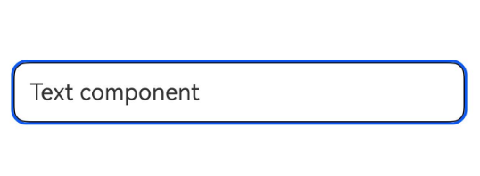
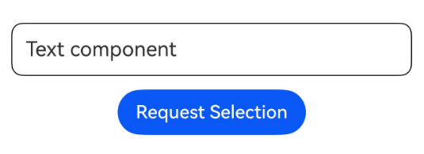
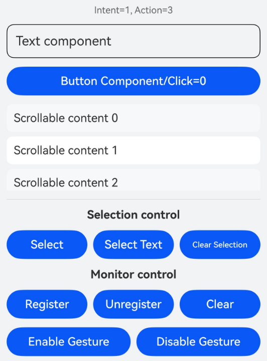

# Class (SmartGestureController)

<!--Kit: ArkUI-->
<!--Subsystem: ArkUI-->
<!--Owner: @yihao-lin-->
<!--Designer: @piggyguy-->
<!--Tester: @songyanhong-->
<!--Adviser: @Brilliantry_Rui-->
<!-- md-trans-meta sourceCommit=1679aa2b39603a323ce91f1907155d8cbd2b330b translatedAt=2026-08-11T01:54:14.191Z pushedAt=2026-08-11T06:05:03.590Z -->

Provides the capabilities of smart gestures enabling, listening, selected state control, and dynamic smart gesture behaviors decision. It is suitable for scenarios where an app integrates smart gestures, listens for the system's default gesture handling intent, and customizes gesture response behaviors, helping the app flexibly control the smart gesture interaction process.

> **NOTE**
>
> To use the following APIs, you need to obtain a **SmartGestureController** instance using [getSmartGestureController()](./arkts-apis-uicontext-uicontext.md#getsmartgesturecontroller) in **UIContext**.

**Since**: 26.0.0

## enableSmartTapAndSlideGestures

enableSmartTapAndSlideGestures(enabled: boolean): void

Sets whether to enable tap and slide gestures in smart gestures.

> **NOTE**
>
> - This API affects only tap and slide gestures in smart gestures, but does not affect a wrist rotation gesture.
> - After disabled, the [smartGestureShortcut](arkui-ts/ts-universal-attributes-smart-gesture-shortcut.md#smartgestureshortcut) configuration on the component side will be retained, but tap and slide gestures in smart gestures will not be responded.

**Since**: 26.0.0

**Model restriction**: This API can be used only in the stage model.

**Atomic service API**: This API can be used in atomic services since API version 26.0.0.

**System capability**: SystemCapability.ArkUI.ArkUI.Full

**Parameters**

| Name| Type| Mandatory| Description|
| ---- | ---- | ---- | ---- |
| enabled | boolean | Mandatory | Whether to enable tap and slide gestures in smart gestures. The value **true** indicates yes, and **false** indicates no. |

**Example**

This example shows how to enable and disable smart gestures using the **enableSmartTapAndSlideGestures** API. For details, see [Example 1: Enabling Smart Gestures and Customizing Action Handling](#example-1-enabling-smart-gestures-and-customizing-action-handling).

```ts
@Entry
@Component
struct SmartGestureControllerExample {
  private controller = this.getUIContext().getSmartGestureController();
  aboutToAppear(): void {
    this.controller.enableSmartTapAndSlideGestures(true);
  }

  aboutToDisappear(): void {
    this.controller.enableSmartTapAndSlideGestures(false);
  }

  build() {
    Scroll() {
      Column({ space: 12 }) {
        Text('Text component')
          .id('target_text')
          .fontSize(18)
          .width('100%')
          .padding(12)
          .borderRadius(10)
          .borderWidth(1)
          .smartGestureShortcut({ action: GestureShortcut.PRIMARY, enabled: true, selectable: true })
          .onClick(() => {
            console.info('smartGesture click is triggered');
          })
      }.width('100%')
    }
    .layoutWeight(1)
    .width('100%')
    .height('100%')
    .padding(12)
  }
}
```



## registerMonitor

registerMonitor(monitorCallback: Callback\<BaseGestureHandlingProposal, GestureHandlingResolution\>): void

Registers a callback for listening to smart gestures. Before the system handles the current smart gesture, an application can receive the default action handling of the current gesture and perform custom intervention. This API uses an asynchronous callback to return the result.

> **NOTE**
>
> - This API allows an app to receive the processing intent of the current smart gesture event before the system handles it, and perform custom intervention.
> - An app can use this callback to customize the behavior decision for the current smart gesture.
> - An app can register multiple listener callbacks, which are triggered in last-registered-first-executed order. When a listener callback consumes the smart gesture event, that is, when the return value [Class (GestureHandlingResolution)](./arkts-apis-uicontext-gesturehandlingresolution.md).isConsumed is **true**, subsequent listener callbacks will not be executed.
> - When an app registers the same callback repeatedly, only the first registered callback is retained, and duplicate registrations do not take effect.
> - The callback return value must be a valid [Class (GestureHandlingResolution)](./arkts-apis-uicontext-gesturehandlingresolution.md) instance; otherwise, the current override does not take effect.

**Since**: 26.0.0

**Model restriction**: This API can be used only in the stage model.

**Atomic service API**: This API can be used in atomic services since API version 26.0.0.

**System capability**: SystemCapability.ArkUI.ArkUI.Full

**Parameters**

| Name| Type| Mandatory| Description|
| ---- | ---- | ---- | ---- |
| monitorCallback | [Callback](arkui-ts/ts-types.md#callback12)&lt;[BaseGestureHandlingProposal](./arkts-apis-uicontext-basegesturehandlingproposal.md), [GestureHandlingResolution](./arkts-apis-uicontext-gesturehandlingresolution.md)&gt; | Yes | Smart gesture listener callback. The callback parameter is the default action handling provided by the system, and the return value declares whether to consume the current smart gesture and whether to replace the default action handling. |

**Example**

This example shows how to register a callback for listening to smart gestures using the **registerMonitor** API. For details, see [Example 1: Enabling Smart Gestures and Customizing Action Handling](#example-1-enabling-smart-gestures-and-customizing-action-handling).

```ts
import {
  BaseGestureHandlingProposal,
  GestureHandlingResolution,
} from '@kit.ArkUI';

@Entry
@Component
struct SmartGestureControllerExample {
  private controller = this.getUIContext().getSmartGestureController();
  private smartGestureMonitor = (proposal: BaseGestureHandlingProposal) => {
    // Consume the current smart gesture and follow the system default action handling.
    return new GestureHandlingResolution(true);
  };

  aboutToAppear(): void {
    this.controller.enableSmartTapAndSlideGestures(true);
    this.controller.registerMonitor(this.smartGestureMonitor);
  }

  aboutToDisappear(): void {
    this.controller.unregisterMonitor(this.smartGestureMonitor);
    this.controller.enableSmartTapAndSlideGestures(false);
  }

  build() {
    Scroll() {
      Column({ space: 12 }) {
        Text('Text component')
          .id('target_text')
          .fontSize(18)
          .width('100%')
          .padding(12)
          .borderRadius(10)
          .borderWidth(1)
          .smartGestureShortcut({ action: GestureShortcut.PRIMARY, enabled: true, selectable: true })
          .onClick(() => {
            console.info('smartGesture click is triggered');
          })
      }.width('100%')
    }
    .layoutWeight(1)
    .width('100%')
    .height('100%')
    .padding(12)
  }
}
```


## unregisterMonitor

unregisterMonitor(monitorCallback: Callback\<BaseGestureHandlingProposal, GestureHandlingResolution\>): void

Unregisters a callback for listening to smart gestures.

**Since**: 26.0.0

**Model restriction**: This API can be used only in the stage model.

**Atomic service API**: This API can be used in atomic services since API version 26.0.0.

**System capability**: SystemCapability.ArkUI.ArkUI.Full

**Parameters**

| Name| Type| Mandatory| Description|
| ---- | ---- | ---- | ---- |
| monitorCallback | [Callback](arkui-ts/ts-types.md#callback12)&lt;[BaseGestureHandlingProposal](./arkts-apis-uicontext-basegesturehandlingproposal.md), [GestureHandlingResolution](./arkts-apis-uicontext-gesturehandlingresolution.md)&gt; | Yes | Smart gesture listener callback to unregister. |

**Example**

This example shows how to unregister a callback for listening to smart gestures using the **unregisterMonitor** API. For details, see [Example 1: Enabling Smart Gestures and Customizing Action Handling](#example-1-enabling-smart-gestures-and-customizing-action-handling).

```ts
import {
  BaseGestureHandlingProposal,
  GestureHandlingResolution,
} from '@kit.ArkUI';

@Entry
@Component
struct SmartGestureControllerExample {
  private controller = this.getUIContext().getSmartGestureController();
  private smartGestureMonitor = (proposal: BaseGestureHandlingProposal) => {
    return new GestureHandlingResolution(true);
  };

  aboutToAppear(): void {
    this.controller.enableSmartTapAndSlideGestures(true);
    this.controller.registerMonitor(this.smartGestureMonitor);
  }

  aboutToDisappear(): void {
    this.controller.unregisterMonitor(this.smartGestureMonitor);
    this.controller.enableSmartTapAndSlideGestures(false);
  }

  build() {
    Scroll() {
      Column({ space: 12 }) {
        Text('Text component')
          .id('target_text')
          .fontSize(18)
          .width('100%')
          .padding(12)
          .borderRadius(10)
          .borderWidth(1)
          .smartGestureShortcut({ action: GestureShortcut.PRIMARY, enabled: true, selectable: true })
          .onClick(() => {
            console.info('smartGesture click is triggered');
          })
      }.width('100%')
    }
    .layoutWeight(1)
    .width('100%')
    .height('100%')
    .padding(12)
  }
}
```


## clearMonitors

clearMonitors(): void

Clears all callbacks for listening to smart gestures, which are registered in the current UI context.

**Since**: 26.0.0

**Model restriction**: This API can be used only in the stage model.

**Atomic service API**: This API can be used in atomic services since API version 26.0.0.

**System capability**: SystemCapability.ArkUI.ArkUI.Full

**Example**

This example shows how to clear all callbacks for listening to smart gestures using the **clearMonitors** API. For details, see [Example 1: Enabling Smart Gestures and Customizing Action Handling](#example-1-enabling-smart-gestures-and-customizing-action-handling).

```ts
import {
  BaseGestureHandlingProposal,
  GestureHandlingResolution,
} from '@kit.ArkUI';

@Entry
@Component
struct SmartGestureControllerExample {
  private controller = this.getUIContext().getSmartGestureController();
  private smartGestureMonitor = (proposal: BaseGestureHandlingProposal) => {
    return new GestureHandlingResolution(true);
  };

  aboutToAppear(): void {
    this.controller.enableSmartTapAndSlideGestures(true);
    this.controller.registerMonitor(this.smartGestureMonitor);
  }

  aboutToDisappear(): void {
    this.controller.clearMonitors();
    this.controller.enableSmartTapAndSlideGestures(false);
  }

  build() {
    Scroll() {
      Column({ space: 12 }) {
        Text('Text component')
          .id('target_text')
          .fontSize(18)
          .width('100%')
          .padding(12)
          .borderRadius(10)
          .borderWidth(1)
          .smartGestureShortcut({ action: GestureShortcut.PRIMARY, enabled: true, selectable: true })
          .onClick(() => {
            console.info('smartGesture click is triggered');
          })
      }.width('100%')
    }
    .layoutWeight(1)
    .width('100%')
    .height('100%')
    .padding(12)
  }
}
```


## requestSelected

requestSelected(id: string): void

Requests to set a specified component as the node selected by the current smart gesture. After the selection is successful, a selection dialog box is displayed. The style of the selection dialog box varies depending on the device.

> **NOTE**
>
> - The request takes effect only when the target component meets all of the following conditions: the component can respond to smart gestures, the component is visible on the screen, and the component is bound with [onClick](./arkui-ts/ts-universal-events-click.md#onclick) or a tap gesture [TapGesture](./arkui-ts/ts-basic-gestures-tapgesture.md#apis).
> - Whether a component can respond to smart gestures is determined by the **enabled** property in [smartGestureShortcut](arkui-ts/ts-universal-attributes-smart-gesture-shortcut.md#smartgestureshortcut).

**Since**: 26.0.0

**Model restriction**: This API can be used only in the stage model.

**Atomic service API**: This API can be used in atomic services since API version 26.0.0.

**System capability**: SystemCapability.ArkUI.ArkUI.Full

**Parameters**

| Name| Type| Mandatory| Description|
| ---- | ---- | ---- | ---- |
| id | string | Yes | Component [id](./arkui-ts/ts-universal-attributes-component-id.md#id). The target component corresponding to this ID must meet the following requirements: it can respond to smart gestures, is visible on the screen, and is bound with [onClick](./arkui-ts/ts-universal-events-click.md#onclick) or [TapGesture](./arkui-ts/ts-basic-gestures-tapgesture.md#apis). |

**Example**

This example shows how to request the component to be selected and the selected state to be automatically cleared in 5,000 ms using the **requestSelected** and **clearSelected** APIs. For details, see [Example 1: Enabling Smart Gestures and Customizing Action Handling](#example-1-enabling-smart-gestures-and-customizing-action-handling).

```ts
@Entry
@Component
struct SmartGestureControllerExample {
  private controller = this.getUIContext().getSmartGestureController();

  aboutToAppear(): void {
    this.controller.enableSmartTapAndSlideGestures(true);
  }

  aboutToDisappear(): void {
    this.controller.enableSmartTapAndSlideGestures(false);
  }

  build() {
    Scroll() {
      Column({ space: 12 }) {
        Text('Text component')
          .id('target_text')
          .fontSize(18)
          .width('100%')
          .padding(12)
          .borderRadius(10)
          .borderWidth(1)
          .smartGestureShortcut({ action: GestureShortcut.PRIMARY, enabled: true, selectable: true })
          .onClick(() => {
            console.info('smartGesture click is triggered');
          })
        Button('Request Selection')
          .onClick(() => {
            this.controller.requestSelected('target_text');
            setTimeout(() => {
              this.controller.clearSelected();
              console.info('smartGesture selected is clear');
            }, 5000);
          })
      }.width('100%')
    }
    .layoutWeight(1)
    .width('100%')
    .height('100%')
    .padding(12)
  }
}
```



## clearSelected

clearSelected(): void

Clears the node selected by the current smart gesture.

**Since**: 26.0.0

**Model restriction**: This API can be used only in the stage model.

**Atomic service API**: This API can be used in atomic services since API version 26.0.0.

**System capability**: SystemCapability.ArkUI.ArkUI.Full

**Example**

This example shows how to request the component to be selected and the selected state to be automatically cleared in 5,000 ms using the **requestSelected** and **clearSelected** APIs. For details, see [Example 1: Enabling Smart Gestures and Customizing Action Handling](#example-1-enabling-smart-gestures-and-customizing-action-handling).

```ts
@Entry
@Component
struct SmartGestureControllerExample {
  private controller = this.getUIContext().getSmartGestureController();

  aboutToAppear(): void {
    this.controller.enableSmartTapAndSlideGestures(true);
  }

  aboutToDisappear(): void {
    this.controller.enableSmartTapAndSlideGestures(false);
  }

  build() {
    Scroll() {
      Column({ space: 12 }) {
        Text('Text component')
          .id('target_text')
          .fontSize(18)
          .width('100%')
          .padding(12)
          .borderRadius(10)
          .borderWidth(1)
          .smartGestureShortcut({ action: GestureShortcut.PRIMARY, enabled: true, selectable: true })
          .onClick(() => {
            console.info('smartGesture click is triggered');
          })
        Button('Request Selection')
          .onClick(() => {
            this.controller.requestSelected('target_text');
            setTimeout(() => {
              this.controller.clearSelected();
              console.info('smartGesture selected is clear');
            }, 5000);
          })
      }.width('100%')
    }
    .layoutWeight(1)
    .width('100%')
    .height('100%')
    .padding(12)
  }
}
```


## Example

### Example 1: Enabling Smart Gestures and Customizing Action Handling

The following example uses the [enableSmartTapAndSlideGestures](#enablesmarttapandslidegestures) API to enable and disable smart gestures, uses the [registerMonitor](#registermonitor), [unregisterMonitor](#unregistermonitor), and [clearMonitors](#clearmonitors) APIs to register, unregister, or clear listener callbacks for custom action handling, and uses [requestSelected](#requestselected) to select a component.

Since API version 26.0.0, **enableSmartTapAndSlideGestures**, **registerMonitor**, **unregisterMonitor**, **clearMonitors**, **requestSelected**, and **clearSelected** are added.

```ts
import {
  BackPressActionProposal,
  BaseGestureHandlingProposal,
  ClickActionProposal,
  GestureHandlingResolution,
  NoneActionProposal,
  PageSwitchActionProposal,
  ScrollActionProposal,
  SelectActionProposal
} from '@kit.ArkUI';

@Entry
@Component
struct SmartGestureControllerExample {
  private controller = this.getUIContext().getSmartGestureController();
  @State clickCount: number = 0;
  @State hint: string = '';
  // Customize a callback function.
  private callback = (proposal: BaseGestureHandlingProposal): GestureHandlingResolution => {
    // proposal.operateIntention indicates the underlying operation intent. The value can be TAP, SLIDE_FORWARD, or BACK_PRESS.
    // proposal.action indicates the final action to be executed. The value can be NONE, SELECT, CLICK, PAGE_FORWARD, SCROLL_FORWARD, or BACK_PRESS.
    this.hint = `Intent=${proposal.operateIntention}, Action=${proposal.action}`;

    // Consume the current smart gesture, and then rewrite the default action handling based on proposal.action.
    const resolution = new GestureHandlingResolution(true);

    // Override the action to click.
    if (proposal.action === SmartGestureAction.CLICK) {
      const node = this.getUIContext().getFrameNodeById('target_button');
      if (node) {
        resolution.selectedProposal = new ClickActionProposal(node);
      }
    } else if (proposal.action === SmartGestureAction.SELECT) { // Override as the select action.
      const node = this.getUIContext().getFrameNodeById('target_text');
      if (node) {
        resolution.selectedProposal = new SelectActionProposal(node);
      }
    } else if (proposal.action === SmartGestureAction.PAGE_FORWARD) { // Override as the page turning action.
      const node = this.getUIContext().getFrameNodeById('scroll_area');
      if (node) {
        // pageCount: The value range is [0, +∞), in pages.
        resolution.selectedProposal = new PageSwitchActionProposal(node, 1);
      }
    } else if (proposal.action === SmartGestureAction.SCROLL_FORWARD) { // Override as the scroll action.
      const node = this.getUIContext().getFrameNodeById('scroll_area');
      if (node) {
        // distance: The value range is [0, +∞), in vp.
        resolution.selectedProposal = new ScrollActionProposal(node, 180);
      }
    } else if (proposal.action === SmartGestureAction.NONE) { // Override as the empty action (no operation is performed).
      resolution.selectedProposal = new NoneActionProposal();
    } else if (proposal.action === SmartGestureAction.BACK_PRESS) { // Override as the back action.
      resolution.selectedProposal = new BackPressActionProposal();
    }

    return resolution;
  };

  build() {
    Scroll() {
      Column({ space: 12 }) {
        // Operation intent prompt.
        Text(this.hint).fontSize(13).fontColor('#666')

        // Target node: text
        Text('Text component')
          .id('target_text')
          .fontSize(18)
          .width('100%')
          .padding(12)
          .borderRadius(10)
          .borderWidth(1)
          .smartGestureShortcut({ action: GestureShortcut.PRIMARY, enabled: true, selectable: true })
          .onClick(() => {
            console.info('smartGesture click is triggered');
          })

        // Target node: button
        Button(`Button Component/Click=${this.clickCount}`)
          .id('target_button').width('100%')
          .smartGestureShortcut({ action: GestureShortcut.PRIMARY, enabled: true, selectable: true })
          .onClick(() => {
            this.clickCount += 1;
          })

        // Target node: scrollable area
        Scroll() {
          Column({ space: 6 }) {
            ForEach([0, 1, 2, 3], (item: number) => {
              Text(`Scrollable content ${item}`).width('100%').padding(10).borderRadius(8)
                .backgroundColor(item % 2 === 0 ? '#f6f8fa' : '#ffffff')
            })
          }.width('100%')
        }
        .id('scroll_area').height(120)

        Divider()

        // requestSelected/clearSelected
        Text('Selection control').fontWeight(FontWeight.Bold).fontSize(16)
        Row({ space: 8 }) {
          Button('Select').layoutWeight(1)
            .onClick(() => this.controller.requestSelected('target_button'))
          Button('Select Text').layoutWeight(1)
            .onClick(() => this.controller.requestSelected('target_text'))
          Button('Clear Selection').layoutWeight(1)
            .onClick(() => this.controller.clearSelected())
        }.width('100%')

        // registerMonitor/unregisterMonitor/clearMonitors
        Text('Monitor control').fontWeight(FontWeight.Bold).fontSize(16)
        Row({ space: 8 }) {
          Button('Register').layoutWeight(1)
            .onClick(() => this.controller.registerMonitor(this.callback))
          Button('Unregister').layoutWeight(1)
            .onClick(() => this.controller.unregisterMonitor(this.callback))
          Button('Clear').layoutWeight(1)
            .onClick(() => this.controller.clearMonitors())
        }.width('100%')

        // enableSmartTapAndSlideGestures
        Row({ space: 8 }) {
          Button('Enable Gesture').layoutWeight(1)
            .onClick(() => this.controller.enableSmartTapAndSlideGestures(true))
          Button('Disable Gesture').layoutWeight(1)
            .onClick(() => this.controller.enableSmartTapAndSlideGestures(false))
        }.width('100%')
      }.width('100%')
    }
    .layoutWeight(1)
    .onAppear(() => {
      this.controller.enableSmartTapAndSlideGestures(true);
      this.controller.registerMonitor(this.callback);
    })
    .width('100%')
    .height('100%')
    .padding(12)
    .backgroundColor('#f1f3f5')
  }
}
```


<!--no_check-->