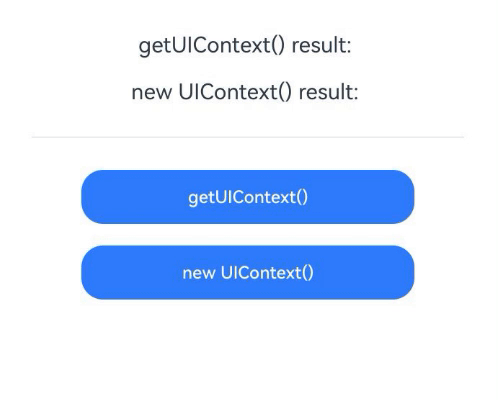
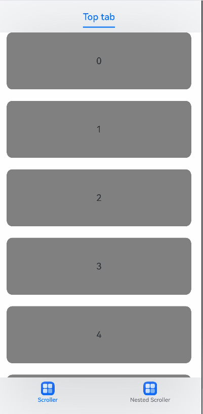

# Class (UIContext)
<!--Kit: ArkUI-->
<!--Subsystem: ArkUI-->
<!--Owner: @xiang-shouxing-->
<!--Designer: @xiang-shouxing-->
<!--Tester: @sally__-->
<!--Adviser: @HelloCrease-->

Implements a **UIContext** instance.

> **NOTE**
>
> - The initial APIs of this module are supported since API version 10. Newly added APIs will be marked with a superscript to indicate their earliest API version.
>
> - You can preview how this component looks on a real device, but not in DevEco Studio Previewer.
>
> - In the following API examples, you must first use [getUIContext()](arkts-apis-window-Window.md#getuicontext10) in **@ohos.window** to obtain a **UIContext** instance, and then call the APIs using the obtained instance. Alternatively, you can obtain a **UIContext** instance through the built-in method [getUIContext()](arkui-ts/ts-custom-component-api.md#getuicontext) of the custom component. In this document, the **UIContext** instance is represented by **uiContext**.

**Example**

The following example demonstrates two methods to obtain a **UIContext** instance.

```ts
// Both approaches return identical UIContext instances.
//index.ets
import { UIContext } from '@kit.ArkUI';

@Entry
@Component
struct Index {
  build() {
    Column() {
      Button("Button")
          .onClick(()=>{
            // Approach 1: using the built-in component method
            this.getUIContext()
            // Additional logic
          })
    }  
  }
}

//EntryAbility.ets
import { AbilityConstant, ConfigurationConstant, UIAbility, Want } from '@kit.AbilityKit';
import { hilog } from '@kit.PerformanceAnalysisKit';
import { window } from '@kit.ArkUI';

const DOMAIN = 0x0000;

export default class EntryAbility extends UIAbility {
  onWindowStageCreate(windowStage: window.WindowStage): void {
    // Approach 2: using ohos.window
    windowStage.getMainWindowSync().getUIContext()
    // Additional logic
  }
}
```

## isAvailable<sup>20+</sup>

isAvailable(): boolean

Checks whether the UI instance corresponding to this **UIContext** object is valid. The **UIContext** object can be obtained using the [getUIContext](arkts-apis-window-Window.md#getuicontext10) API. A UI instance is considered valid when the backend UI instance exists. UIContext objects created using **new UIContext()** have no corresponding UI instance. After multiple [loadContent](arkts-apis-window-Window.md#loadcontent9) operations, old UI instances become invalid. In multi-window scenarios, when a window is closed, its UI instance becomes invalid. In summary, a UIContext object is invalid when it has no corresponding backend UI instance.

**Atomic service API**: This API can be used in atomic services since API version 20.

**System capability**: SystemCapability.ArkUI.ArkUI.Full

**Return value**

| Type           | Description         |
| ------------- | ----------- |
| boolean | Whether the UI instance corresponding to the current **UIContext** object is valid. The value **true** means that the UI instance is valid, and **false** means the opposite.|

**Example**

```ts
import { UIContext } from '@kit.ArkUI'

@Entry
@Component
struct UIContextCompare {
  @State result1: string = ""
  @State result2: string = ""

  build() {
    Column() {
      Text("getUIContext() result: " + this.result1)
        .fontSize(20)
        .margin(10)

      Text("new UIContext() result: " + this.result2)
        .fontSize(20)
        .margin(10)

      Divider().margin(20)

      Button("getUIContext()")
        .width("70%")
        .height(50)
        .margin(10)
        .onClick(() => {
          try {
            const ctx: UIContext = this.getUIContext();
            const available: boolean = ctx.isAvailable();
            this.result1 = `Status: ${available} (Valid UI instance)`;
            console.info("getUIContext test:", available);
          } catch (e) {
            this.result1 = "Error: " + (e instanceof Error ? e.message : String(e));
          }
        })

      Button("new UIContext()")
        .width("70%")
        .height(50)
        .margin(10)
        .onClick(() => {
          try {
            const ctx: UIContext = new UIContext();
            const available: boolean = ctx.isAvailable();
            this.result2 = `Status: ${available} (Invalid UI instance)`;
            console.info("new UIContext test:", available);
          } catch (e) {
            this.result2 = "Error: " + (e instanceof Error ? e.message : String(e));
          }
        })
    }
    .width("100%")
    .height("100%")
    .padding(20)
  }
}
```

## getFont

getFont(): Font

Obtains a **Font** object.

**Atomic service API**: This API can be used in atomic services since API version 11.

**System capability**: SystemCapability.ArkUI.ArkUI.Full

**Return value**

| Type           | Description         |
| ------------- | ----------- |
| [Font](./arkts-apis-uicontext-font.md) | **Font** object.|

**Example**

See the example for [Font](arkts-apis-uicontext-font.md).

## getComponentUtils

getComponentUtils(): ComponentUtils

Obtains the **ComponentUtils** object.

**Atomic service API**: This API can be used in atomic services since API version 11.

**System capability**: SystemCapability.ArkUI.ArkUI.Full

**Return value**

| Type                               | Description                   |
| --------------------------------- | --------------------- |
| [ComponentUtils](arkts-apis-uicontext-componentutils.md) | **ComponentUtils** object.|

**Example**

See the example for [getComponentUtils](js-apis-arkui-componentUtils.md).

## getUIInspector

getUIInspector(): UIInspector

Obtains the **UIInspector** object.

**Atomic service API**: This API can be used in atomic services since API version 11.

**System capability**: SystemCapability.ArkUI.ArkUI.Full

**Return value**

| Type                         | Description                |
| --------------------------- | ------------------ |
| [UIInspector](./arkts-apis-uicontext-uiinspector.md) | **UIInspector** object.|

**Example**

See the example for [UIInspector](./arkts-apis-uicontext-uiinspector.md).

## getUIObserver<sup>11+</sup>

getUIObserver(): UIObserver

Obtains the **UIObserver** object.

**Atomic service API**: This API can be used in atomic services since API version 12.

**System capability**: SystemCapability.ArkUI.ArkUI.Full

**Return value**

| Type                         | Description                |
| --------------------------- | ------------------ |
| [UIObserver](./arkts-apis-uicontext-uiobserver.md) | **UIObserver** object.|

**Example**

```ts
@Component
struct PageOne {
  build() {
    NavDestination() {
      Text("pageOne")
    }.title("pageOne")
  }
}

@Entry
@Component
struct Index {
  private stack: NavPathStack = new NavPathStack();

  @Builder
  PageBuilder(name: string) {
    PageOne()
  }

  aboutToAppear() {
    this.getUIContext().getUIObserver().on('navDestinationUpdate', (info) => {
      console.info('NavDestination state update', JSON.stringify(info));
    });
  }

  aboutToDisappear() {
    this.getUIContext().getUIObserver().off('navDestinationUpdate');
  }

  build() {
    Column() {
      Navigation(this.stack) {
        Button("push").onClick(() => {
          this.stack.pushPath({ name: "pageOne" });
        })
      }
      .title("Navigation")
      .navDestination(this.PageBuilder)
    }
    .width('100%')
    .height('100%')
  }
}
```

## getMediaQuery

getMediaQuery(): MediaQuery

Obtains a **MediaQuery** object.

**Atomic service API**: This API can be used in atomic services since API version 11.

**System capability**: SystemCapability.ArkUI.ArkUI.Full

**Return value**

| Type                       | Description               |
| ------------------------- | ----------------- |
| [MediaQuery](arkts-apis-uicontext-mediaquery.md) | **MediaQuery** object.|

**Example**

See the [mediaquery Example](js-apis-mediaquery.md#example).

## getRouter

getRouter(): Router

Obtains a **Router** object.

**Atomic service API**: This API can be used in atomic services since API version 11.

**System capability**: SystemCapability.ArkUI.ArkUI.Full

**Return value**

| Type               | Description           |
| ----------------- | ------------- |
| [Router](arkts-apis-uicontext-router.md) | **Router** object.|

**Example**

See the example for [pushUrl](arkts-apis-uicontext-router.md#pushurl).

## getPromptAction

getPromptAction(): PromptAction

Obtains a **PromptAction** object.

**Atomic service API**: This API can be used in atomic services since API version 11.

**System capability**: SystemCapability.ArkUI.ArkUI.Full

**Return value**

| Type                           | Description                 |
| ----------------------------- | ------------------- |
| [PromptAction](arkts-apis-uicontext-promptaction.md) | **PromptAction** object.|

**Example**

See the example for [PromptAction](arkts-apis-uicontext-promptaction.md).

## getOverlayManager<sup>12+</sup>

getOverlayManager(): OverlayManager

Obtains the **OverlayManager** object.

**Atomic service API**: This API can be used in atomic services since API version 12.

**System capability**: SystemCapability.ArkUI.ArkUI.Full

**Return value**

| Type                          | Description                |
| ----------------------------- | ------------------- |
| [OverlayManager](arkts-apis-uicontext-overlaymanager.md) | **OverlayManager** instance obtained.|

**Example**

See the example for [OverlayManager](arkts-apis-uicontext-overlaymanager.md).

## setOverlayManagerOptions<sup>15+</sup>

setOverlayManagerOptions(options: OverlayManagerOptions): boolean

Sets the parameters for [OverlayManager](arkts-apis-uicontext-overlaymanager.md). This API initializes the parameters of the **OverlayManager** before using its capabilities, including properties such as whether to render the overlay root node. It must be called before **getOverlayManager** and takes effect only once.

**Atomic service API**: This API can be used in atomic services since API version 15.

**System capability**: SystemCapability.ArkUI.ArkUI.Full

**Parameters**

| Name  | Type                                      | Mandatory  | Description                                   |
| ----- | ---------------------------------------- | ---- | ------------------------------------- |
| options | [OverlayManagerOptions](arkts-apis-uicontext-i.md#overlaymanageroptions15) | Yes| Parameters for **OverlayManager**.|

**Return value**

| Type   | Description          |
| ------- | -------------- |
| boolean | Whether the setting is successful.<br>Returns **true** if the setting is successful; returns **false** otherwise.|

**Example**

See the example for [OverlayManager](arkts-apis-uicontext-overlaymanager.md).

## getOverlayManagerOptions<sup>15+</sup>

getOverlayManagerOptions(): OverlayManagerOptions

Obtains the current parameters of [OverlayManagerOptions](arkts-apis-uicontext-i.md#overlaymanageroptions15).

**Atomic service API**: This API can be used in atomic services since API version 15.

**System capability**: SystemCapability.ArkUI.ArkUI.Full

**Return value**

| Type                          | Description                |
| ----------------------------- | ------------------- |
| [OverlayManagerOptions](arkts-apis-uicontext-i.md#overlaymanageroptions15) | Current parameters of **OverlayManager**.|

**Example**

See the example for [OverlayManager](arkts-apis-uicontext-overlaymanager.md).

## animateTo

animateTo(value: AnimateParam, event: () => void): void

Applies a transition animation for state changes.

**Atomic service API**: This API can be used in atomic services since API version 11.

**System capability**: SystemCapability.ArkUI.ArkUI.Full

**Parameters**

| Name  | Type                                      | Mandatory  | Description                                   |
| ----- | ---------------------------------------- | ---- | ------------------------------------- |
| value | [AnimateParam](arkui-ts/ts-explicit-animation.md#animateparam) | Yes   | Animation settings.                          |
| event | () => void                               | Yes   | Closure function that displays the animation. The system automatically inserts the transition animation if the state changes in the closure function.|

**Example**

```ts
// xxx.ets
@Entry
@Component
struct AnimateToExample {
  @State widthSize: number = 250;
  @State heightSize: number = 100;
  @State rotateAngle: number = 0;
  private flag: boolean = true;
  uiContext: UIContext | undefined = undefined;

  aboutToAppear() {
    this.uiContext = this.getUIContext();
    if (!this.uiContext) {
      console.warn("no uiContext");
      return;
    }
  }

  build() {
    Column() {
      Button('change size')
        .width(this.widthSize)
        .height(this.heightSize)
        .margin(30)
        .onClick(() => {
          if (this.flag) {
            this.uiContext?.animateTo({
              duration: 2000,
              curve: Curve.EaseOut,
              iterations: 3,
              playMode: PlayMode.Normal,
              onFinish: () => {
                console.info('play end');
              }
            }, () => {
              this.widthSize = 150;
              this.heightSize = 60;
            });
          } else {
            this.uiContext?.animateTo({}, () => {
              this.widthSize = 250;
              this.heightSize = 100;
            });
          }
          this.flag = !this.flag;
        })
      Button('stop rotating')
        .margin(50)
        .rotate({ x: 0, y: 0, z: 1, angle: this.rotateAngle })
        .onAppear(() => {
          // The animation starts when the component appears.
          this.uiContext?.animateTo({
            duration: 1200,
            curve: Curve.Friction,
            delay: 500,
            iterations: -1, // The value -1 indicates that the animation is played for an unlimited number of times.
            playMode: PlayMode.Alternate,
            expectedFrameRateRange: {
              min: 10,
              max: 120,
              expected: 60,
            }
          }, () => {
            this.rotateAngle = 90
          });
        })
        .onClick(() => {
          this.uiContext?.animateTo({ duration: 0 }, () => {
            // The value of this.rotateAngle is 90 before the animation. In an animation with a duration of 0, changing the property stops any previous animations for that property and applies the new value immediately.
            this.rotateAngle = 0;
          });
        })
    }.width('100%').margin({ top: 5 })
  }
}
```

## getSharedLocalStorage<sup>12+</sup>

getSharedLocalStorage(): LocalStorage | undefined

Obtains the **LocalStorage** instance shared by this stage.

**Atomic service API**: This API can be used in atomic services since API version 12.

**System capability**: SystemCapability.ArkUI.ArkUI.Full

**Model restriction**: This API can be used only in the stage model.

**Return value**

| Type                            | Description               |
| ------------------------------ | ----------------- |
| [LocalStorage](arkui-ts/ts-state-management.md#localstorage9) \| undefined | **LocalStorage** instance if it exists; **undefined** if it does not exist.|

**Example**

```ts
// EntryAbility.ets
import { UIAbility } from '@kit.AbilityKit';
import { window } from '@kit.ArkUI';

export default class EntryAbility extends UIAbility {
  storage: LocalStorage = new LocalStorage();

  onWindowStageCreate(windowStage: window.WindowStage) {
    windowStage.loadContent('pages/Index', this.storage);
  }
}
```

```ts
// Index.ets

@Entry
@Component
struct SharedLocalStorage {
  localStorage = this.getUIContext().getSharedLocalStorage();

  build() {
    Row() {
      Column() {
        Button("Change Local Storage to 47")
          .onClick(() => {
            this.localStorage?.setOrCreate("propA", 47);
          })
        Button("Get Local Storage")
          .onClick(() => {
            console.info(`localStorage: ${this.localStorage?.get("propA")}`);
          })
      }
      .width('100%')
    }
    .height('100%')
  }
}
```

## getHostContext<sup>12+</sup>

getHostContext(): Context | undefined

Obtains the context of this ability.

**Atomic service API**: This API can be used in atomic services since API version 12.

**System capability**: SystemCapability.ArkUI.ArkUI.Full

**Model restriction**: This API can be used only in the stage model.

**Return value**

| Type| Description                            |
| ------ | ------------------------------- |
| [Context](arkts-apis-uicontext-t.md#context12) \| undefined | Context of the ability. The context type depends on the ability type. For example, if this API is called in a page within a UIAbility window, the returned context type is [UIAbilityContext](../apis-ability-kit/js-apis-inner-application-uiAbilityContext.md#uiabilitycontext-1). If this API is called in a page within an ExtensionAbility window, the returned context type is [ExtensionContext](../apis-ability-kit/js-apis-inner-application-extensionContext.md). If the ability context does not exist, **undefined** is returned.|

**Example**

```ts
@Entry
@Component
struct Index {
  uiContext = this.getUIContext();

  build() {
    Row() {
      Column() {
        Text("cacheDir='"+this.uiContext?.getHostContext()?.cacheDir+"'")
          .fontSize(25)
          .border({ color:Color.Red, width:2 })
          .padding(50)
        Text("bundleCodeDir='"+this.uiContext?.getHostContext()?.bundleCodeDir+"'")
          .fontSize(25)
          .border({ color:Color.Red, width:2 })
          .padding(50)
      }
      .width('100%')
    }
    .height('100%')
  }
}
```

## getFrameNodeById<sup>12+</sup>

getFrameNodeById(id: string): FrameNode | null

Obtains a FrameNode on the component tree based on the component ID.

**Atomic service API**: This API can be used in atomic services since API version 12.

**System capability**: SystemCapability.ArkUI.ArkUI.Full

**Parameters**

| Name  | Type                                      | Mandatory  | Description                                   |
| ----- | ---------------------------------------- | ---- | ------------------------------------- |
| id | string | Yes   | [Component ID](arkui-ts/ts-universal-attributes-component-id.md) of the target node.      |

**Return value**

| Type                                      | Description           |
| ---------------------------------------- | ------------- |
| [FrameNode](js-apis-arkui-frameNode.md)  \| null | FrameNode of the component or **null** if no matching component is found.|

> **NOTE**
>
> The **getFrameNodeById** API searches for a node with a specific ID by traversing the tree, which can lead to poor performance. To deliver better performance, use the [getAttachedFrameNodeById](#getattachedframenodebyid12) API.


## getAttachedFrameNodeById<sup>12+</sup>

getAttachedFrameNodeById(id: string): FrameNode | null

Obtains the FrameNode attached to the current window based on its component ID.

**Atomic service API**: This API can be used in atomic services since API version 12.

**System capability**: SystemCapability.ArkUI.ArkUI.Full

**Parameters**

| Name  | Type                                      | Mandatory  | Description                                   |
| ----- | ---------------------------------------- | ---- | ------------------------------------- |
| id | string | Yes   | [Component ID](arkui-ts/ts-universal-attributes-component-id.md) of the target node.                         |

**Return value**

| Type                                      | Description           |
| ---------------------------------------- | ------------- |
| [FrameNode](js-apis-arkui-frameNode.md)  \| null | FrameNode of the component or **null** if no matching component is found.|

> **NOTE**
>
> **getAttachedFrameNodeById** can only obtain nodes that are currently rendered on the screen.

**Example**

```ts
@Entry
@Component
struct MyComponent {
  @State message: string = 'Hello World';

  build() {
    RelativeContainer() {
      Text(this.message)
        .id('HelloWorld')
        .fontSize($r('app.float.page_text_font_size'))
        .fontWeight(FontWeight.Bold)
        .alignRules({
          center: { anchor: '__container__', align: VerticalAlign.Center },
          middle: { anchor: '__container__', align: HorizontalAlign.Center }
        })
        .onClick(() => {
          let node = this.getUIContext().getAttachedFrameNodeById("HelloWorld");
          console.log(`Find HelloWorld Tag:${node!.getNodeType()} id:${node!.getUniqueId()}`);
        })
    }
    .height('100%')
    .width('100%')
  }
}
```

## getFrameNodeByUniqueId<sup>12+</sup>

getFrameNodeByUniqueId(id: number): FrameNode | null

Obtains the FrameNode of a component on the component tree using its **uniqueId**. The return value depends on the type of component associated with the **uniqueId**.
1. If the **uniqueId** corresponds to a built-in component, the associated FrameNode is returned.
2. If the **uniqueId** corresponds to a custom component: If the component has rendered content, its root node is returned, with the type __Common__; if the component has no rendered content, the FrameNode of its first child component is returned.
3. If the **uniqueId** does not correspond to any component, **null** is returned.

**Atomic service API**: This API can be used in atomic services since API version 12.

**System capability**: SystemCapability.ArkUI.ArkUI.Full

**Parameters**

| Name  | Type                                      | Mandatory  | Description                                   |
| ----- | ---------------------------------------- | ---- | ------------------------------------- |
| id | number | Yes   | Unique ID of the target node.                         |

**Return value**

| Type                                      | Description           |
| ---------------------------------------- | ------------- |
| [FrameNode](js-apis-arkui-frameNode.md)  \| null | FrameNode of the component or **null** if no matching component is found.|

**Example**

```ts
import { UIContext, FrameNode } from '@kit.ArkUI';

@Entry
@Component
struct MyComponent {
  aboutToAppear() {
    let uniqueId: number = this.getUniqueId();
    let uiContext: UIContext = this.getUIContext();
    if (uiContext) {
      let node: FrameNode | null = uiContext.getFrameNodeByUniqueId(uniqueId);
    }
  }

  build() {
    // ...
  }
}
```

## getPageInfoByUniqueId<sup>12+</sup>

getPageInfoByUniqueId(id: number): PageInfo

Obtains the router or navigation destination page information corresponding to the node that matches the specified **uniqueId**.
1. If the node that matches the specified **uniqueId** is in a page, the router information (**routerPageInfo**) is returned.
2. If the node that matches the specified **uniqueId** is in a **NavDestination** component, the navigation destination page information (**navDestinationInfo**) is returned.
3. If the node that matches the specified **uniqueId** does not have the corresponding router or navigation destination page information, **undefined** is returned.
4. Modal dialog boxes are not contained within any pages. If the node that matches the specified **uniqueId** is in a modal dialog box, for example, on a modal page constructed by [CustomDialog](./arkui-ts/ts-methods-custom-dialog-box.md), [bindSheet](./arkui-ts/ts-universal-attributes-sheet-transition.md#bindsheet), or [bindContentCover](./arkui-ts/ts-universal-attributes-modal-transition.md#bindcontentcover), **undefined** is returned for **routerPageInfo**.

**Atomic service API**: This API can be used in atomic services since API version 12.

**System capability**: SystemCapability.ArkUI.ArkUI.Full

**Parameters**

| Name  | Type                                      | Mandatory  | Description                                   |
| ----- | ---------------------------------------- | ---- | ------------------------------------- |
| id | number | Yes   | Unique ID of the target node.                         |

**Return value**

| Type                                      | Description           |
| ---------------------------------------- | ------------- |
| [PageInfo](arkts-apis-uicontext-i.md#pageinfo12) | Router or navigation destination page information corresponding to the specified node.|

**Example**

```ts
import { UIContext, PageInfo } from '@kit.ArkUI';

@Entry
@Component
struct PageInfoExample {
  @Provide('pageInfos') pageInfos: NavPathStack = new NavPathStack();

  build() {
    Column() {
      Navigation(this.pageInfos) {
        NavDestination() {
          MyComponent()
        }
      }.id('navigation')
    }
  }
}

@Component
struct MyComponent {
  @State content: string = '';

  build() {
    Column() {
      Text('PageInfoExample')
      Button('click').onClick(() => {
        const uiContext: UIContext = this.getUIContext();
        const uniqueId: number = this.getUniqueId();
        const pageInfo: PageInfo = uiContext.getPageInfoByUniqueId(uniqueId);
        console.info('pageInfo: ' + JSON.stringify(pageInfo));
        console.info('navigationInfo: ' + JSON.stringify(uiContext.getNavigationInfoByUniqueId(uniqueId)));
      })
      TextArea({
        text: this.content
      })
      .width('100%')
      .height(100)
    }
    .width('100%')
    .alignItems(HorizontalAlign.Center)
  }
}
```

## getNavigationInfoByUniqueId<sup>12+</sup>

getNavigationInfoByUniqueId(id: number): observer.NavigationInfo | undefined

Obtains the navigation information corresponding to the node that matches the specified **uniqueId**.
1. If the node that matches the specified **uniqueId** is in a **Navigation** component, the navigation information is returned.
2. If the node that matches the specified **uniqueId** does not have the corresponding navigation information, **undefined** is returned.

**Atomic service API**: This API can be used in atomic services since API version 12.

**System capability**: SystemCapability.ArkUI.ArkUI.Full

**Parameters**

| Name  | Type                                      | Mandatory  | Description                                   |
| ----- | ---------------------------------------- | ---- | ------------------------------------- |
| id | number | Yes   | Unique ID of the target node.                         |

**Return value**

| Type                                      | Description           |
| ---------------------------------------- | ------------- |
| observer.[NavigationInfo](js-apis-arkui-observer.md#navigationinfo12) \| undefined | Navigation information corresponding to the specified node.|

**Example**

See the example of [getPageInfoByUniqueId](#getpageinfobyuniqueid12).

## showAlertDialog

showAlertDialog(options: AlertDialogParamWithConfirm | AlertDialogParamWithButtons | AlertDialogParamWithOptions): void

Shows an alert dialog box.

**Atomic service API**: This API can be used in atomic services since API version 11.

**System capability**: SystemCapability.ArkUI.ArkUI.Full

**Parameters**

| Name    | Type                                      | Mandatory  | Description                 |
| ------- | ---------------------------------------- | ---- | ------------------- |
| options | [AlertDialogParamWithConfirm](arkui-ts/ts-methods-alert-dialog-box.md#alertdialogparamwithconfirm) \| [AlertDialogParamWithButtons](arkui-ts/ts-methods-alert-dialog-box.md#alertdialogparamwithbuttons) \| [AlertDialogParamWithOptions](arkui-ts/ts-methods-alert-dialog-box.md#alertdialogparamwithoptions10) | Yes   | Shows an **AlertDialog** component in the given settings.|


**Example**

```ts
@Entry
@Component
struct Index {
  uiContext: UIContext = this.getUIContext()

  build() {
    Column() {
      Button('showAlertDialog')
        .onClick(() => {
          this.uiContext.showAlertDialog(
            {
              title: 'title',
              message: 'text',
              autoCancel: true,
              alignment: DialogAlignment.Bottom,
              offset: { dx: 0, dy: -20 },
              gridCount: 3,
              confirm: {
                value: 'button',
                action: () => {
                  console.info('Button-clicking callback');
                }
              },
              cancel: () => {
                console.info('Closed callbacks');
              }
            }
          );
        })
    }.height('100%').width('100%').justifyContent(FlexAlign.Center)
  }
}
```

## showActionSheet

showActionSheet(value: ActionSheetOptions): void

Shows an action sheet in the given settings.

**Atomic service API**: This API can be used in atomic services since API version 11.

**System capability**: SystemCapability.ArkUI.ArkUI.Full

**Parameters**

| Name| Type                                                        | Mandatory| Description                |
| ------ | ------------------------------------------------------------ | ---- | -------------------- |
| value  | [ActionSheetOptions](arkui-ts/ts-methods-action-sheet.md#actionsheetoptions) | Yes  | Parameters of the action sheet.|

**Example**

```ts
@Entry
@Component
struct Index {
  uiContext: UIContext = this.getUIContext()

  build() {
    Column() {
      Button('showActionSheet')
        .onClick(() => {
          this.uiContext.showActionSheet({
            title: 'ActionSheet title',
            message: 'message',
            autoCancel: true,
            confirm: {
              value: 'Confirm button',
              action: () => {
                console.info('Get ActionSheet handled');
              }
            },
            cancel: () => {
              console.info('ActionSheet canceled');
            },
            alignment: DialogAlignment.Bottom,
            offset: { dx: 0, dy: -10 },
            sheets: [
              {
                title: 'apples',
                action: () => {
                  console.info('apples');
                }
              },
              {
                title: 'bananas',
                action: () => {
                  console.info('bananas');
                }
              },
              {
                title: 'pears',
                action: () => {
                  console.info('pears');
                }
              }
            ]
          });
        })
    }.height('100%').width('100%').justifyContent(FlexAlign.Center)
  }
}
```

## showDatePickerDialog

showDatePickerDialog(options: DatePickerDialogOptions): void

Shows a date picker dialog box in the given settings.

**Atomic service API**: This API can be used in atomic services since API version 11.

**System capability**: SystemCapability.ArkUI.ArkUI.Full

**Device behavior differences**: On wearables, calling this API results in a runtime exception indicating that the API is undefined. On other devices, the API works correctly.

**Parameters**

| Name | Type                                                        | Mandatory| Description                          |
| ------- | ------------------------------------------------------------ | ---- | ------------------------------ |
| options | [DatePickerDialogOptions](arkui-ts/ts-methods-datepicker-dialog.md#datepickerdialogoptions) | Yes  | Parameters of the date picker dialog box.|

**Example**

```ts
// xxx.ets
@Entry
@Component
struct DatePickerDialogExample {
  selectedDate: Date = new Date("2010-1-1");

  build() {
    Column() {
      Button("DatePickerDialog")
        .margin(20)
        .onClick(() => {
          this.getUIContext().showDatePickerDialog({
            start: new Date("2000-1-1"),
            end: new Date("2100-12-31"),
            selected: this.selectedDate,
            showTime: true,
            useMilitaryTime: false,
            dateTimeOptions: { hour: "numeric", minute: "2-digit" },
            onDateAccept: (value: Date) => {
              // Use the setFullYear method to set the date when the OK button is touched. In this way, when the date picker dialog box is displayed again, the selected date is the date last confirmed.
              this.selectedDate = value;
              console.info("DatePickerDialog:onDateAccept()" + value.toString());
            },
            onCancel: () => {
              console.info("DatePickerDialog:onCancel()");
            },
            onDateChange: (value: Date) => {
              console.info("DatePickerDialog:onDateChange()" + value.toString());
            },
            onDidAppear: () => {
              console.info("DatePickerDialog:onDidAppear()");
            },
            onDidDisappear: () => {
              console.info("DatePickerDialog:onDidDisappear()");
            },
            onWillAppear: () => {
              console.info("DatePickerDialog:onWillAppear()");
            },
            onWillDisappear: () => {
              console.info("DatePickerDialog:onWillDisappear()");
            }
          })
        })
    }.width('100%')
  }
}
```

## showTimePickerDialog

showTimePickerDialog(options: TimePickerDialogOptions): void

Shows a time picker dialog box in the given settings.

**Atomic service API**: This API can be used in atomic services since API version 11.

**System capability**: SystemCapability.ArkUI.ArkUI.Full

**Device behavior differences**: On wearables, calling this API results in a runtime exception indicating that the API is undefined. On other devices, the API works correctly.

**Parameters**

| Name | Type                                                        | Mandatory| Description                          |
| ------- | ------------------------------------------------------------ | ---- | ------------------------------ |
| options | [TimePickerDialogOptions](arkui-ts/ts-methods-timepicker-dialog.md#timepickerdialogoptions) | Yes  | Parameters of the time picker dialog box.|

**Example**

```ts
// xxx.ets

class SelectTime{
  selectTime: Date = new Date('2020-12-25T08:30:00');
  hours(h:number,m:number){
    this.selectTime.setHours(h, m);
  }
}

@Entry
@Component
struct TimePickerDialogExample {
  @State selectTime: Date = new Date('2023-12-25T08:30:00');

  build() {
    Column() {
      Button('showTimePickerDialog')
        .margin(30)
        .onClick(() => {
          this.getUIContext().showTimePickerDialog({
            selected: this.selectTime,
            onAccept: (value: TimePickerResult) => {
              // Set selectTime to the time when the OK button is clicked. In this way, when the dialog box is displayed again, the selected time is the time when the operation was confirmed last time.
              let time = new SelectTime();
              if(value.hour && value.minute){
                time.hours(value.hour, value.minute);
              }
              console.info("TimePickerDialog:onAccept()" + JSON.stringify(value));
            },
            onCancel: () => {
              console.info("TimePickerDialog:onCancel()");
            },
            onChange: (value: TimePickerResult) => {
              console.info("TimePickerDialog:onChange()" + JSON.stringify(value));
            }
          });
        })
    }.width('100%').margin({ top: 5 })
  }
}
```

## showTextPickerDialog

showTextPickerDialog(options: TextPickerDialogOptions): void

Shows a text picker dialog box in the given settings.

**Atomic service API**: This API can be used in atomic services since API version 11.

**System capability**: SystemCapability.ArkUI.ArkUI.Full

**Device behavior differences**: On wearables, calling this API results in a runtime exception indicating that the API is undefined. On other devices, the API works correctly.

**Parameters**

| Name | Type                                                        | Mandatory| Description                          |
| ------- | ------------------------------------------------------------ | ---- | ------------------------------ |
| options | [TextPickerDialogOptions](arkui-ts/ts-methods-textpicker-dialog.md#textpickerdialogoptions) | Yes  | Parameters of the text picker dialog box.|

**Example**

```ts
// xxx.ets

class SelectedValue{
  select: number = 2;
  set(val: number){
    this.select = val;
  }
}
class SelectedArray{
  select: number[] = [];
  set(val: number[]){
    this.select = val;
  }
}
@Entry
@Component
struct TextPickerDialogExample {
  @State selectTime: Date = new Date('2023-12-25T08:30:00');
  private fruits: string[] = ['apple1', 'orange2', 'peach3', 'grape4', 'banana5'];
  private select: number  = 0;
  build() {
    Column() {
      Button('showTextPickerDialog')
        .margin(30)
        .onClick(() => {
          this.getUIContext().showTextPickerDialog({
            range: this.fruits,
            selected: this.select,
            onAccept: (value: TextPickerResult) => {
              // Set select to the index of the item selected when the OK button is touched. In this way, when the text picker dialog box is displayed again, the selected item is the one last confirmed.
              let selectedVal = new SelectedValue();
              let selectedArr = new SelectedArray();
              if (value.index){
                value.index instanceof Array?selectedArr.set(value.index) : selectedVal.set(value.index);
              }
              console.info("TextPickerDialog:onAccept()" + JSON.stringify(value));
            },
            onCancel: () => {
              console.info("TextPickerDialog:onCancel()");
            },
            onChange: (value: TextPickerResult) => {
              console.info("TextPickerDialog:onChange()" + JSON.stringify(value));
            }
          });
        })
    }.width('100%').margin({ top: 5 })
  }
}
```

## showTextPickerDialog<sup>20+</sup>

showTextPickerDialog(style: TextPickerDialogOptions\|TextPickerDialogOptionsExt): void

Shows a text picker dialog box in the given settings. This API extends **showTextPickerDialog** by adding support for the **TextPickerDialogOptionsExt** parameter.

**Atomic service API**: This API can be used in atomic services since API version 20.

**System capability**: SystemCapability.ArkUI.ArkUI.Full

**Device behavior differences**: On wearables, calling this API results in a runtime exception indicating that the API is undefined. On other devices, the API works correctly.

**Parameters**

| Name | Type                                                        | Mandatory| Description                          |
| ------- | ------------------------------------------------------------ | ---- | ------------------------------ |
| style | [TextPickerDialogOptions](arkui-ts/ts-methods-textpicker-dialog.md#textpickerdialogoptions)\| [TextPickerDialogOptionsExt](arkui-ts/ts-methods-textpicker-dialog.md#textpickerdialogoptionsext20) | Yes  | Parameters of the text picker dialog box.|

## createAnimator

createAnimator(options: AnimatorOptions): AnimatorResult

Creates an **Animator** object.

**Atomic service API**: This API can be used in atomic services since API version 11.

**System capability**: SystemCapability.ArkUI.ArkUI.Full

**Parameters**

| Name    | Type                                      | Mandatory  | Description     |
| ------- | ---------------------------------------- | ---- | ------- |
| options | [AnimatorOptions](js-apis-animator.md#animatoroptions) | Yes   | Animator options.|

**Return value**

| Type                                      | Description           |
| ---------------------------------------- | ------------- |
| [AnimatorResult](js-apis-animator.md#animatorresult) | Animator result.|


**Error codes**

For details about the error codes, see [Universal Error Codes](../errorcode-universal.md).

| ID| Error Message|
| ------- | -------- |
| 401      | Parameter error. Possible causes: 1. Mandatory parameters are left unspecified; 2.Incorrect parameters types; 3. Parameter verification failed.   |

**Example**

```ts
// EntryAbility.ets
import { AbilityConstant, Configuration, ConfigurationConstant, UIAbility, Want } from '@kit.AbilityKit';
import { AnimatorOptions, window } from '@kit.ArkUI';
import { hilog } from '@kit.PerformanceAnalysisKit';

export default class EntryAbility extends UIAbility {
  onWindowStageCreate(windowStage: window.WindowStage) {
    // Create the main window and set the home page for this ability.
    hilog.info(0x0000, 'testTag', '%{public}s', 'Ability onWindowStageCreate');
    windowStage.loadContent('pages/Index', (err, data) => {
      if (err.code) {
        hilog.error(0x0000, 'testTag', 'Failed to load the content. Cause: %{public}s', JSON.stringify(err) ?? '');
        return;
      }
      hilog.info(0x0000, 'testTag', 'Succeeded in loading the content. Data: %{public}s', JSON.stringify(data) ?? '');
      let uiContext = windowStage.getMainWindowSync().getUIContext();
      let options:AnimatorOptions = {
        duration: 1500,
        easing: "friction",
        delay: 0,
        fill: "forwards",
        direction: "normal",
        iterations: 3,
        begin: 200.0,
        end: 400.0
      };
      uiContext.createAnimator(options);
    });
  }
}
```

## createAnimator<sup>18+</sup>

createAnimator(options: AnimatorOptions | SimpleAnimatorOptions): AnimatorResult

Creates an **AnimatorResult** object for animations. Compared to the previous [createAnimator](#createanimator) API, this API adds support for the [SimpleAnimatorOptions](js-apis-animator.md#simpleanimatoroptions18) type.

**Atomic service API**: This API can be used in atomic services since API version 18.

**System capability**: SystemCapability.ArkUI.ArkUI.Full

**Parameters**

| Name    | Type                                      | Mandatory  | Description     |
| ------- | ---------------------------------------- | ---- | ------- |
| options | [AnimatorOptions](js-apis-animator.md#animatoroptions) \| [SimpleAnimatorOptions](js-apis-animator.md#simpleanimatoroptions18) | Yes   | Animator options.|

**Return value**

| Type                                      | Description           |
| ---------------------------------------- | ------------- |
| [AnimatorResult](js-apis-animator.md#animatorresult) | Animator result.|

**Error codes**

For details about the error codes, see [Universal Error Codes](../errorcode-universal.md).

| ID| Error Message|
| ------- | -------- |
| 401      | Parameter error. Possible causes: 1. Mandatory parameters are left unspecified; 2.Incorrect parameters types; 3. Parameter verification failed.   |

**Example**

```ts
// EntryAbility.ets
import { AbilityConstant, Configuration, ConfigurationConstant, UIAbility, Want } from '@kit.AbilityKit';
import { SimpleAnimatorOptions, window } from '@kit.ArkUI';
import { hilog } from '@kit.PerformanceAnalysisKit';

export default class EntryAbility extends UIAbility {
  onWindowStageCreate(windowStage: window.WindowStage) {
    // Create the main window and set the home page for this ability.
    hilog.info(0x0000, 'testTag', '%{public}s', 'Ability onWindowStageCreate');
    windowStage.loadContent('pages/Index', (err, data) => {
      if (err.code) {
        hilog.error(0x0000, 'testTag', 'Failed to load the content. Cause: %{public}s', JSON.stringify(err) ?? '');
        return;
      }
      hilog.info(0x0000, 'testTag', 'Succeeded in loading the content. Data: %{public}s', JSON.stringify(data) ?? '');
      let uiContext = windowStage.getMainWindowSync().getUIContext();
      let options: SimpleAnimatorOptions = new SimpleAnimatorOptions(100, 200).duration(2000);
      uiContext.createAnimator(options);
    });
  }
}
```

## runScopedTask

runScopedTask(callback: () => void): void

Executes the specified callback in this UI context.

**Atomic service API**: This API can be used in atomic services since API version 11.

**System capability**: SystemCapability.ArkUI.ArkUI.Full

**Parameters**

| Name     | Type        | Mandatory  | Description  |
| -------- | ---------- | ---- | ---- |
| callback | () => void | Yes   | Callback used to return the result.|

**Example**

```ts
@Entry
@Component
struct Index {
  uiContext = this.getUIContext();

  build() {
    Row() {
      Column() {
        Button("run task").onClick(()=>{
          this.uiContext.runScopedTask(()=>{
            // do something
          })
        })
      }
      .width('100%')
    }
    .height('100%')
  }
}
```

## setKeyboardAvoidMode<sup>11+</sup>

setKeyboardAvoidMode(value: KeyboardAvoidMode): void

Sets the avoidance mode for the virtual keyboard.

**Atomic service API**: This API can be used in atomic services since API version 11.

**System capability**: SystemCapability.ArkUI.ArkUI.Full

**Parameters**

| Name     | Type        | Mandatory  | Description  |
| -------- | ---------- | ---- | ---- |
| value | [KeyboardAvoidMode](arkts-apis-uicontext-e.md#keyboardavoidmode11)| Yes   | Avoidance mode for the virtual keyboard.<br>Default value: **KeyboardAvoidMode.OFFSET**|

>  **NOTE**
>
>  With **KeyboardAvoidMode.RESIZE**, the page is resized to prevent the virtual keyboard from obstructing the view. Regarding components on the page, those whose width and height are set in percentage are resized with the page, and those whose width and height are set to specific values are laid out according to their settings. With **KeyboardAvoidMode.RESIZE**, **expandSafeArea([SafeAreaType.KEYBOARD],[SafeAreaEdge.BOTTOM])** does not take effect.
>
>  With **KeyboardAvoidMode.NONE**, keyboard avoidance is disabled, and the page will be covered by the displayed keyboard.
>
>  **setKeyboardAvoidMode** only affects page layouts. It does not apply to popup components, including the following: **Dialog**, **Popup**, **Menu**, **BindSheet**, **BindContentCover**, **Toast**, **OverlayManager**. For details about the avoidance mode of popup components, see [CustomDialogControllerOptions](./arkui-ts/ts-methods-custom-dialog-box.md#customdialogcontrolleroptions).

**Example**

See [Example 4: Setting the Keyboard Avoidance Mode to Resize](./arkui-ts/ts-universal-attributes-expand-safe-area.md#example-4-setting-the-keyboard-avoidance-mode-to-resize), [Example 5: Setting Keyboard Avoidance Mode to Offset](./arkui-ts/ts-universal-attributes-expand-safe-area.md#example-5-setting-keyboard-avoidance-mode-to-offset), and [Example 6: Switching Avoidance Modes](./arkui-ts/ts-universal-attributes-expand-safe-area.md#example-6-switching-avoidance-modes).

<!--code_no_check-->
```ts
// EntryAbility.ets
import { KeyboardAvoidMode, UIContext } from '@kit.ArkUI';
import { hilog } from '@kit.PerformanceAnalysisKit';

export default class EntryAbility extends UIAbility{
  onWindowStageCreate(windowStage: window.WindowStage) {
      // Main window is created, set main page for this ability
      hilog.info(0x0000, 'testTag', '%{public}s', 'Ability onWindowStageCreate');

      windowStage.loadContent('pages/Index', (err, data) => {
        let uiContext: UIContext = windowStage.getMainWindowSync().getUIContext();
        uiContext.setKeyboardAvoidMode(KeyboardAvoidMode.RESIZE);
        if (err.code) {
          hilog.error(0x0000, 'testTag', 'Failed to load the content. Cause: %{public}s', JSON.stringify(err) ?? '');
          return;
        }
        hilog.info(0x0000, 'testTag', 'Succeeded in loading the content. Data: %{public}s', JSON.stringify(data) ?? '');
      });
    }
}
```

## getKeyboardAvoidMode<sup>11+</sup>

getKeyboardAvoidMode(): KeyboardAvoidMode

Obtains the avoidance mode for the virtual keyboard.

**Atomic service API**: This API can be used in atomic services since API version 11.

**System capability**: SystemCapability.ArkUI.ArkUI.Full

**Return value**

| Type        | Description  |
| ---------- | ---- |
| [KeyboardAvoidMode](arkts-apis-uicontext-e.md#keyboardavoidmode11)| Avoidance mode for the virtual keyboard.|

**Example**

See [Example 4: Setting the Keyboard Avoidance Mode to Resize](./arkui-ts/ts-universal-attributes-expand-safe-area.md#example-4-setting-the-keyboard-avoidance-mode-to-resize), [Example 5: Setting Keyboard Avoidance Mode to Offset](./arkui-ts/ts-universal-attributes-expand-safe-area.md#example-5-setting-keyboard-avoidance-mode-to-offset), and [Example 6: Switching Avoidance Modes](./arkui-ts/ts-universal-attributes-expand-safe-area.md#example-6-switching-avoidance-modes).

<!--code_no_check-->
```ts
// EntryAbility.ets
import { KeyboardAvoidMode, UIContext } from '@kit.ArkUI';
import { hilog } from '@kit.PerformanceAnalysisKit';

export default class EntryAbility extends UIAbility{
  onWindowStageCreate(windowStage: window.WindowStage) {
      // Main window is created, set main page for this ability
      hilog.info(0x0000, 'testTag', '%{public}s', 'Ability onWindowStageCreate');

      windowStage.loadContent('pages/Index', (err, data) => {
        let uiContext: UIContext = windowStage.getMainWindowSync().getUIContext();
        let KeyboardAvoidMode = uiContext.getKeyboardAvoidMode();
        hilog.info(0x0000, "KeyboardAvoidMode:", JSON.stringify(KeyboardAvoidMode));
        if (err.code) {
          hilog.error(0x0000, 'testTag', 'Failed to load the content. Cause: %{public}s', JSON.stringify(err) ?? '');
          return;
        }
        hilog.info(0x0000, 'testTag', 'Succeeded in loading the content. Data: %{public}s', JSON.stringify(data) ?? '');
      });
    }
}
```

## getAtomicServiceBar<sup>11+</sup>

getAtomicServiceBar(): Nullable\<AtomicServiceBar>

Obtains an **AtomicServiceBar** object, which can be used to set the properties of the atomic service menu bar.

**Atomic service API**: This API can be used in atomic services since API version 11.

**System capability**: SystemCapability.ArkUI.ArkUI.Full

**Return value**

| Type                                             | Description                                                        |
| ------------------------------------------------- | ------------------------------------------------------------ |
| Nullable<[AtomicServiceBar](arkts-apis-uicontext-atomicservicebar.md)> | Returns the **AtomicServerBar** type if the service is an atomic service; returns **undefined** type otherwise.|

**Example**

```ts
// EntryAbility.ets
import { UIAbility } from '@kit.AbilityKit';
import { UIContext, AtomicServiceBar, window } from '@kit.ArkUI';

export default class EntryAbility extends UIAbility {
  onWindowStageCreate(windowStage: window.WindowStage) {
    // Main window is created, set main page for this ability
    console.info('Ability onWindowStageCreate');
    windowStage.loadContent('pages/Index', (err, data) => {
      let uiContext: UIContext = windowStage.getMainWindowSync().getUIContext();
      let atomicServiceBar: Nullable<AtomicServiceBar> = uiContext.getAtomicServiceBar();
      if (atomicServiceBar != undefined) {
        console.info('Get AtomServiceBar Successfully.');
      } else {
        console.error('Get AtomicServiceBar failed.');
      }
    });
  }
}
```
## getDragController<sup>11+</sup>

getDragController(): DragController

Obtains the **DragController** object, which can be used to create and initiate dragging.

**Atomic service API**: This API can be used in atomic services since API version 12.

**System capability**: SystemCapability.ArkUI.ArkUI.Full

**Return value**

|Type|Description|
|----|----|
|[DragController](js-apis-arkui-dragController.md)| **DragController** object.|

**Example**

See the example for [DragController](./arkts-apis-uicontext-dragcontroller.md).

## keyframeAnimateTo<sup>11+</sup>

keyframeAnimateTo(param: KeyframeAnimateParam, keyframes: Array&lt;KeyframeState&gt;): void

Generates a key frame animation. For details about how to use this API, see [keyframeAnimateTo](arkui-ts/ts-keyframeAnimateTo.md).

**Atomic service API**: This API can be used in atomic services since API version 12.

**System capability**: SystemCapability.ArkUI.ArkUI.Full

**Parameters**

| Name| Type                                             | Mandatory| Description                     |
| ------------ | ---------------------------------------------------- | ------- | ---------------------------- |
| param        | [KeyframeAnimateParam](arkui-ts/ts-keyframeAnimateTo.md#keyframeanimateparam) | Yes     | Overall animation parameter of the keyframe animation.    |
| keyframes    | Array&lt;[KeyframeState](arkui-ts/ts-keyframeAnimateTo.md#keyframestate)&gt;  | Yes     | List of all keyframe states.           |

**Example**

```ts
// xxx.ets
import { UIContext } from '@kit.ArkUI';

@Entry
@Component
struct KeyframeDemo {
  @State myScale: number = 1.0;
  uiContext: UIContext | undefined = undefined;

  aboutToAppear() {
    this.uiContext = this.getUIContext();
  }

  build() {
    Column() {
      Circle()
        .width(100)
        .height(100)
        .fill("#46B1E3")
        .margin(100)
        .scale({ x: this.myScale, y: this.myScale })
        .onClick(() => {
          if (!this.uiContext) {
            console.error("no uiContext, keyframe failed");
            return;
          }
          this.myScale = 1;
          // Configure the keyframe animation to play three times.
          this.uiContext.keyframeAnimateTo({
              iterations: 3,
              expectedFrameRateRange: {
                min: 10,
                max: 120,
                expected: 60,
              }
            }, [
            {
              // The first keyframe animation lasts for 800 ms, during which the scale attribute changes from 1 to 1.5.
              duration: 800,
              event: () => {
                this.myScale = 1.5;
              }
            },
            {
              // The second keyframe animation lasts for 500 ms, during which the scale attribute changes from 1.5 to 1.
              duration: 500,
              event: () => {
                this.myScale = 1;
              }
            }
          ]);
        })
    }.width('100%').margin({ top: 5 })
  }
}
```

## getFocusController<sup>12+</sup>

getFocusController(): FocusController

Obtains a [FocusController](arkts-apis-uicontext-focuscontroller.md) object, which can be used to control the focus.

**Atomic service API**: This API can be used in atomic services since API version 12.

**System capability**: SystemCapability.ArkUI.ArkUI.Full

**Return value**

|Type|Description|
|----|----|
|[FocusController](arkts-apis-uicontext-focuscontroller.md)| **FocusController** object.|

**Example**

See the example for [FocusController](arkts-apis-uicontext-focuscontroller.md).

## getFilteredInspectorTree<sup>12+</sup>

getFilteredInspectorTree(filters?: Array\<string\>): string

Obtains the component tree and component attributes. This API has a long processing time and is intended for testing scenarios only.

**Atomic service API**: This API can be used in atomic services since API version 12.

**System capability**: SystemCapability.ArkUI.ArkUI.Full

**Parameters**

| Name | Type           | Mandatory| Description                                                        |
| ------- | --------------- | ---- | ------------------------------------------------------------ |
| filters | Array\<string\> | No  | List of component attributes used for filtering. Currently, only the following filter fields are supported:<br>**"id"**: unique ID of the component.<br>**"src"**: source of the resource.<br>**"content"**: information or data contained in the element, component, or object.<br>**"editable"**: whether the component is editable.<br>**"scrollable"**: whether the component is scrollable.<br>**"selectable"**: whether the component is selectable.<br>**"focusable"**: whether the component is focusable.<br>**"focused"**: whether the component is currently focused.<br>If **filters** includes one or more fields, unspecified fields will be filtered out from the results. If **filters** is not provided or is an empty array, none of the aforementioned fields will be filtered out.<br>The following filter field is supported since API version 20:<br>**"isLayoutInspector"**: whether the component tree contains [custom components](../../ui/state-management/arkts-create-custom-components.md). If **filters** is omitted or does not contain **"isLayoutInspector"**, the returned component tree will not include custom component details.<br>Other filter fields are used only in testing scenarios.|

**Return value**

| Type  | Description                              |
| ------ | ---------------------------------- |
| string | JSON string of the component tree and component attributes. For details about each field in the component, see the return value description of [getInspectorInfo](./js-apis-arkui-frameNode.md#getinspectorinfo12).|

**Error codes**

For details about the error codes, see [Universal Error Codes](../errorcode-universal.md).

| ID| Error Message|
| ------- | -------- |
| 401      | Parameter error. Possible causes: <br> 1. Mandatory parameters are left unspecified. <br> 2. Incorrect parameters types. <br> 3. Parameter verification failed.  |

**Example**

<!--code_no_check-->
```ts
uiContext.getFilteredInspectorTree(['id', 'src', 'content']);
```

<!--code_no_check-->
```ts
// xxx.ets
import { UIContext } from '@kit.ArkUI';
@Entry
@Component
struct ComponentPage {
  loopConsole(inspectorStr: string, i: string) {
    console.info(`InsTree ${i}| type: ${JSON.parse(inspectorStr).$type}, ID: ${JSON.parse(inspectorStr).$ID}`);
    if (JSON.parse(inspectorStr).$children) {
      i += '-';
      for (let index = 0; index < JSON.parse(inspectorStr).$children.length; index++) {
        this.loopConsole(JSON.stringify(JSON.parse(inspectorStr).$children[index]), i);
      }
    }
  }

  build() {
    Column() {
      Button('content').onClick(() => {
        const uiContext: UIContext = this.getUIContext();
        let inspectorStr = uiContext.getFilteredInspectorTree(['content']);
        console.info(`InsTree : ${inspectorStr}`);
        inspectorStr = JSON.stringify(JSON.parse(inspectorStr));
        this.loopConsole(inspectorStr, '-');
      })
      Button('isLayoutInspector').onClick(() => {
        const uiContext: UIContext = this.getUIContext();
        let inspectorStr = uiContext.getFilteredInspectorTree(['isLayoutInspector']);
        console.info(`InsTree : ${inspectorStr}`);
        inspectorStr = JSON.stringify(JSON.parse(inspectorStr).content);
        this.loopConsole(inspectorStr, '-');
      })
    }
    .width('100%')
    .height('100%')
  }
}
```

When the **"content"** filter field is passed, the returned JSON string has the following structure:

<!--code_no_check-->
```ts
InsTree : {"$type":"root","width":"720.000000","height":"1280.000000","$resolution":"1.500000","$children":[{"$type":"Column","$ID":15,"type":"build-in","$rect":"[0.00, 72.00],[720.00,1208.00]","$debugLine":"","$attrs":{},"$children":[{"$type":"Button","$ID":16,"type":"build-in","$rect":"[293.00, 72.00],[427.00,132.00]","$debugLine":"","$attrs":{}},{"$type":"Button","$ID":18,"type":"build-in","$rect":"[237.00, 132.00],[484.00,192.00]","$debugLine":"","$attrs":{}}]}]}\
InsTree -| type: root, ID: undefined
InsTree --| type: Column, ID: 15
InsTree ---| type: Button, ID: 16
InsTree ---| type: Button, ID: 18
```

Since API version 20, when the **"isLayoutInspector"** filter field is passed, the returned JSON string structure includes an outer layer with **"type"** and **"content"** fields, where **"content"** contains the original JSON structure (as returned without this field), and the return value structure includes custom components. This JSON string structure is as follows:

<!--code_no_check-->
```ts
InsTree : {"type":"root","content":{"$type":"root","width":"720.000000","height":"1280.000000","$resolution":"1.500000","$children":[{"$type":"JsView","$ID":13,"type":"custom","state":{"observedPropertiesInfo":[],"viewInfo":{"componentName":"ComponentPage","id":14,"isV2":false,"isViewActive_":true}},"$rect":"[0.00, 72.00],[720.00,1208.00]","$debugLine":"{\"$line\":\"(0:0)\"}","viewTag":"ComponentPage","$attrs":{"viewKey":"13"},"$children":[{"$type":"Column","$ID":15, "type":"build-in","$rect":"[0.00, 72.00],[720.00,1208.00]","$debugLine":"","$attrs":{ ...
InsTree -| type: root, ID: undefined
InsTree --| type: JsView, ID: 13
InsTree ---| type: Column, ID: 15
InsTree ----| type: Button, ID: 16
InsTree ----| type: Button, ID: 18
```

## getFilteredInspectorTreeById<sup>12+</sup>

getFilteredInspectorTreeById(id: string, depth: number, filters?: Array\<string\>): string

Obtains the attributes of the specified component and its child components. This API has a long processing time and is intended for testing scenarios only.

**Atomic service API**: This API can be used in atomic services since API version 12.

**System capability**: SystemCapability.ArkUI.ArkUI.Full

**Parameters**

| Name | Type           | Mandatory| Description                                                        |
| ------- | --------------- | ---- | ------------------------------------------------------------ |
| id      | string          | Yes  | [ID](arkui-ts/ts-universal-attributes-component-id.md) of the target component.|
| depth   | number          | Yes  | Number of layers of child components. If the value is **0**, the attributes of the specified component and all its child components are obtained. If the value is **1**, only the attributes of the specified component are obtained. If the value is **2**, the attributes of the specified component and its level-1 child components are obtained. The rest can be deduced by analogy.|
| filters | Array\<string\> | No  | List of component attributes used for filtering. Currently, only the following filter fields are supported:<br>**"id"**: unique ID of the component.<br>**"src"**: source of the resource.<br>**"content"**: information or data contained in the element, component, or object.<br>**"editable"**: whether the component is editable.<br>**"scrollable"**: whether the component is scrollable.<br>**"selectable"**: whether the component is selectable.<br>**"focusable"**: whether the component is focusable.<br>**"focused"**: whether the component is currently focused.<br>If **filters** includes one or more fields, unspecified fields will be filtered out from the results. If **filters** is not provided or is an empty array, none of the aforementioned fields will be filtered out.<br>Other filter fields are used only in testing scenarios.|

**Return value**

| Type  | Description                                        |
| ------ | -------------------------------------------- |
| string | JSON string of the attributes of the specified component and its child components. For details about each field in the component, see the return value description of [getInspectorInfo](./js-apis-arkui-frameNode.md#getinspectorinfo12).|


**Error codes**

For details about the error codes, see [Universal Error Codes](../errorcode-universal.md).

| ID| Error Message|
| ------- | -------- |
| 401      | Parameter error. Possible causes: <br> 1. Mandatory parameters are left unspecified. <br> 2. Incorrect parameters types. <br> 3. Parameter verification failed.  |

**Example**

<!--code_no_check-->
```ts
uiContext.getFilteredInspectorTreeById('testId', 0, ['id', 'src', 'content']);
```

<!--code_no_check-->
```ts
import { UIContext } from '@kit.ArkUI';
@Entry
@Component
struct ComponentPage {
  build() {
    Column() {
      Text("Hello World")
        .fontSize(20)
        .id("TEXT")
      Button('getFilteredInspectorTreeById').onClick(() => {
        const uiContext: UIContext = this.getUIContext();
        try {
          let inspectorStr = uiContext.getFilteredInspectorTreeById('TEXT', 1, ["id", "src"]);
          console.info(`result1: ${inspectorStr}`);
          inspectorStr = JSON.stringify(JSON.parse(inspectorStr)['$children'][0]);
          console.info(`result2: ${inspectorStr}`);
          inspectorStr = uiContext.getFilteredInspectorTreeById('TEXT', 1, ["src"]);
          inspectorStr = JSON.stringify(JSON.parse(inspectorStr)['$children'][0]);
          console.info(`result3: ${inspectorStr}`);
        } catch(e) {
          console.info(`getFilteredInspectorTreeById error: ${e}`);
        }
      })
    }
    .width('100%')
    .height('100%')
  }
}
```
This JSON string structure is as follows:
<!--code_no_check-->
```ts
result1: {"$type":"root","width":"1260.000000","height":"2720.000000","$resolution":"3.250000","$children":[{"$type":"Text","$ID":6,"type":"build-in","$rect":"[457.00, 123.00],[804.00,199.00]","$debugLine":"","$attrs":{"id":"TEXT","isLayoutDirtyMarked":false,"isRenderDirtyMarked":false,"isMeasureBoundary":false,"hasPendingRequest":false,"isFirstBuilding":false}}]}
result2: {"$type":"Text","$ID":6,"type":"build-in","$rect":"[457.00, 123.00],[804.00,199.00]","$debugLine":"","$attrs":{"id":"TEXT","isLayoutDirtyMarked":false,"isRenderDirtyMarked":false,"isMeasureBoundary":false,"hasPendingRequest":false,"isFirstBuilding":false}}
result3: {"$type":"Text","$ID":6,"type":"build-in","$rect":"[457.00, 123.00],[804.00,199.00]","$debugLine":"","$attrs":{"isLayoutDirtyMarked":false,"isRenderDirtyMarked":false,"isMeasureBoundary":false,"hasPendingRequest":false,"isFirstBuilding":false}}
```
To obtain the component specified by the **id** parameter in the **getFilteredInspectorTreeById** API, you must first convert the API's result into a JSON object (as demonstrated in the sample code), and then extract the first item from the **$children** array. A comparison between **result2** and **result3** reveals that, if the **filters** parameter is changed from **["id", "src"]** to **["src"]**, the **$attrs** property obtained does not contain the **id** key.

## getCursorController<sup>12+</sup>

getCursorController(): CursorController

Obtains a [CursorController](js-apis-arkui-UIContext.md#cursorcontroller12) object, which can be used to control the cursor.

**Atomic service API**: This API can be used in atomic services since API version 12.

**System capability**: SystemCapability.ArkUI.ArkUI.Full

**Return value**

|Type|Description|
|----|----|
|[CursorController](arkts-apis-uicontext-cursorcontroller.md)| **CursorController** object.|

**Example**

See the example for [CursorController](arkts-apis-uicontext-contextmenucontroller.md).

## getContextMenuController<sup>12+</sup>

getContextMenuController(): ContextMenuController

Obtains a [ContextMenuController](arkts-apis-uicontext-contextmenucontroller.md) object, which can be used to control menus.

**Atomic service API**: This API can be used in atomic services since API version 12.

**System capability**: SystemCapability.ArkUI.ArkUI.Full

**Return value**

|Type|Description|
|----|----|
|[ContextMenuController](arkts-apis-uicontext-contextmenucontroller.md)| **ContextMenuController** object.|

## getMeasureUtils<sup>12+</sup>

getMeasureUtils(): MeasureUtils

Obtains a **MeasureUtils** object for text calculation.

**Atomic service API**: This API can be used in atomic services since API version 12.

**System capability**: SystemCapability.ArkUI.ArkUI.Full

**Return value**

| Type  | Description                                        |
| ------ | -------------------------------------------- |
| [MeasureUtils](arkts-apis-uicontext-measureutils.md) | Text metrics, such as text height and width.|

**Example**

See the example for [MeasureUtils](arkts-apis-uicontext-measureutils.md).

## getComponentSnapshot<sup>12+</sup>

getComponentSnapshot(): ComponentSnapshot

Obtains a **ComponentSnapshot** object, which can be used to obtain a component snapshot.

For typical use cases (for example, long screenshots) and best practices of component snapshots, see [Using Component Snapshot (ComponentSnapshot)](../../ui/arkts-uicontext-component-snapshot.md).

**Atomic service API**: This API can be used in atomic services since API version 12.

**System capability**: SystemCapability.ArkUI.ArkUI.Full

**Return value**

| Type                                                        | Description                       |
| ------------------------------------------------------------ | --------------------------- |
| [ComponentSnapshot](arkts-apis-uicontext-componentsnapshot.md) | **ComponentSnapshot** object.|

**Example**

See the example for [ComponentSnapshot](arkts-apis-uicontext-componentsnapshot.md).

## vp2px<sup>12+</sup>

vp2px(value : number) : number

Converts a value in units of vp to a value in units of px.

Conversion formula: px value = vp value × pixel density

Pixel density: effective pixel density of the current window, which is the screen's physical pixel density [VirtualScreenConfig.density](js-apis-display.md#virtualscreenconfig16).

> **NOTE**
>
> **getUIContext** must be called after [windowStage.loadContent](./arkts-apis-window-WindowStage.md#loadcontent9) to ensure the UIContext is initialized before this API is called. Otherwise, accurate results cannot be guaranteed.

**Atomic service API**: This API can be used in atomic services since API version 12.

**System capability**: SystemCapability.ArkUI.ArkUI.Full

**Parameters**

| Name| Type  | Mandatory| Description                                  |
| ------ | ------ | ---- | -------------------------------------- |
| value | number | Yes  | Value to convert.<br>Value range: (-∞, +∞)|

**Return value**

| Type  | Description          |
| ------ | -------------- |
| number | Value after conversion.<br>Value range: (-∞, +∞)|

**Example**

```ts
@Entry
@Component
struct MatrixExample {
  build() {
    Column({ space: 100 }) {
      Text('Hello1')
        .textAlign(TextAlign.Center)
        .width(100)
        .height(60)
        .backgroundColor(0xAFEEEE)
        .borderWidth(1)
        .rotate({
          z: 1,
          angle: 90,
          centerX: this.getUIContext().vp2px(50),
          centerY: this.getUIContext().vp2px(30)
        })
    }.width('100%')
    .height('100%')
  }
}
```

## px2vp<sup>12+</sup>

px2vp(value : number) : number

Converts a value in units of px to a value in units of vp.

Conversion formula: vp value = px value/pixel density

Pixel density: effective pixel density of the current window, which is the screen's physical pixel density [VirtualScreenConfig.density](js-apis-display.md#virtualscreenconfig16).

> **NOTE**
>
> **getUIContext** must be called after [windowStage.loadContent](./arkts-apis-window-WindowStage.md#loadcontent9) to ensure the UIContext is initialized before this API is called. Otherwise, accurate results cannot be guaranteed.

**Atomic service API**: This API can be used in atomic services since API version 12.

**System capability**: SystemCapability.ArkUI.ArkUI.Full

**Parameters**

| Name| Type  | Mandatory| Description                                  |
| ------ | ------ | ---- | -------------------------------------- |
| value | number | Yes  | Value to convert.<br>Value range: (-∞, +∞)|

**Return value**

| Type  | Description          |
| ------ | -------------- |
| number | Value after conversion.<br>Value range: (-∞, +∞)|

**Example**

```ts
@Entry
@Component
struct MatrixExample {
  build() {
    Column({ space: 100 }) {
      Text('Hello1')
        .textAlign(TextAlign.Center)
        .width(100)
        .height(60)
        .backgroundColor(0xAFEEEE)
        .borderWidth(1)
        .rotate({
          z: 1,
          angle: 90,
          centerX: this.getUIContext().px2vp(50),
          centerY: this.getUIContext().px2vp(30)
        })
    }.width('100%')
    .height('100%')
  }
}
```

## fp2px<sup>12+</sup>

fp2px(value : number) : number

Converts a value in units of fp to a value in units of px.

Conversion formula: px value = fp value × pixel density × font scale factor

Pixel density: effective pixel density of the current window, which is the screen's physical pixel density [VirtualScreenConfig.density](js-apis-display.md#virtualscreenconfig16).

Font scale factor: system font scaling coefficient ([Configuration.fontScale](arkui-ts/ts-types.md#configuration)).

> **NOTE**
>
> **getUIContext** must be called after [windowStage.loadContent](./arkts-apis-window-WindowStage.md#loadcontent9) to ensure the UIContext is initialized before this API is called. Otherwise, accurate results cannot be guaranteed.

**Atomic service API**: This API can be used in atomic services since API version 12.

**System capability**: SystemCapability.ArkUI.ArkUI.Full

**Parameters**

| Name| Type  | Mandatory| Description                                  |
| ------ | ------ | ---- | -------------------------------------- |
| value | number | Yes  | Value to convert.<br>Value range: (-∞, +∞)|

**Return value**

| Type  | Description          |
| ------ | -------------- |
| number | Value after conversion.<br>Value range: (-∞, +∞)|

**Example**

```ts
@Entry
@Component
struct MatrixExample {
  build() {
    Column({ space: 100 }) {
      Text('Hello1')
        .textAlign(TextAlign.Center)
        .width(100)
        .height(60)
        .backgroundColor(0xAFEEEE)
        .borderWidth(1)
        .rotate({
          z: 1,
          angle: 90,
          centerX: this.getUIContext().fp2px(50),
          centerY: this.getUIContext().fp2px(30)
        })
    }.width('100%')
    .height('100%')
  }
}
```

## px2fp<sup>12+</sup>

px2fp(value : number) : number

Converts a value in units of px to a value in units of fp.

Conversion formula: fp value = px value/pixel density/font scale factor

Pixel density: effective pixel density of the current window, which is typically the screen's physical pixel density [VirtualScreenConfig.density](js-apis-display.md#virtualscreenconfig16).

Font scale factor: system font scaling coefficient ([Configuration.fontScale](arkui-ts/ts-types.md#configuration)).

> **NOTE**
>
> **getUIContext** must be called after [windowStage.loadContent](./arkts-apis-window-WindowStage.md#loadcontent9) to ensure the UIContext is initialized before this API is called. Otherwise, accurate results cannot be guaranteed.

**Atomic service API**: This API can be used in atomic services since API version 12.

**System capability**: SystemCapability.ArkUI.ArkUI.Full

**Parameters**

| Name| Type  | Mandatory| Description                                  |
| ------ | ------ | ---- | -------------------------------------- |
| value | number | Yes  | Value to convert.<br>Value range: (-∞, +∞)|

**Return value**

| Type  | Description          |
| ------ | -------------- |
| number | Value after conversion.<br>Value range: (-∞, +∞)|

**Example**

```ts
@Entry
@Component
struct MatrixExample {
  build() {
    Column({ space: 100 }) {
      Text('Hello1')
        .textAlign(TextAlign.Center)
        .width(100)
        .height(60)
        .backgroundColor(0xAFEEEE)
        .borderWidth(1)
        .rotate({
          z: 1,
          angle: 90,
          centerX: this.getUIContext().px2fp(50),
          centerY: this.getUIContext().px2fp(30)
        })
    }.width('100%')
    .height('100%')
  }
}
```

## lpx2px<sup>12+</sup>

lpx2px(value : number) : number

Converts a value in units of lpx to a value in units of px.

Conversion formula: px value = lpx value × (actual screen width/logical width), where the logical width is configured using [designWidth](../../quick-start/module-configuration-file.md#pages)

> **NOTE**
>
> **getUIContext** must be called after [windowStage.loadContent](./arkts-apis-window-WindowStage.md#loadcontent9) to ensure the UIContext is initialized before this API is called. Otherwise, accurate results cannot be guaranteed.

**Atomic service API**: This API can be used in atomic services since API version 12.

**System capability**: SystemCapability.ArkUI.ArkUI.Full

**Parameters**

| Name| Type  | Mandatory| Description                                   |
| ------ | ------ | ---- | --------------------------------------- |
| value | number | Yes  | Value to convert.<br>Value range: (-∞, +∞)|

**Return value**

| Type  | Description          |
| ------ | -------------- |
| number | Value after conversion.<br>Value range: (-∞, +∞)|

**Example**

```ts
@Entry
@Component
struct MatrixExample {
  build() {
    Column({ space: 100 }) {
      Text('Hello1')
        .textAlign(TextAlign.Center)
        .width(100)
        .height(60)
        .backgroundColor(0xAFEEEE)
        .borderWidth(1)
        .rotate({
          z: 1,
          angle: 90,
          centerX: this.getUIContext().lpx2px(50),
          centerY: this.getUIContext().lpx2px(30)
        })
    }.width('100%')
    .height('100%')
  }
}
```

## px2lpx<sup>12+</sup>

px2lpx(value : number) : number

Converts a value in units of px to a value in units of lpx.

Conversion formula: lpx value = px value/(actual screen width/logical width), where the logical width is configured using [designWidth](../../quick-start/module-configuration-file.md#pages)

> **NOTE**
>
> **getUIContext** must be called after [windowStage.loadContent](./arkts-apis-window-WindowStage.md#loadcontent9) to ensure the UIContext is initialized before this API is called. Otherwise, accurate results cannot be guaranteed.

**Atomic service API**: This API can be used in atomic services since API version 12.

**System capability**: SystemCapability.ArkUI.ArkUI.Full

**Parameters**

| Name| Type  | Mandatory| Description                                   |
| ------ | ------ | ---- | --------------------------------------- |
| value | number | Yes  | Value to convert.<br>Value range: (-∞, +∞)|

**Return value**

| Type  | Description          |
| ------ | -------------- |
| number | Value after conversion.<br>Value range: (-∞, +∞)|

**Example**

```ts
@Entry
@Component
struct MatrixExample {
  build() {
    Column({ space: 100 }) {
      Text('Hello1')
        .textAlign(TextAlign.Center)
        .width(100)
        .height(60)
        .backgroundColor(0xAFEEEE)
        .borderWidth(1)
        .rotate({
          z: 1,
          angle: 90,
          centerX: this.getUIContext().px2lpx(50),
          centerY: this.getUIContext().px2lpx(30)
        })
    }.width('100%')
    .height('100%')
  }
}
```

## getWindowName<sup>12+</sup>

getWindowName(): string | undefined

Obtains the name of the window where this instance is located.

**Atomic service API**: This API can be used in atomic services since API version 12.

**System capability**: SystemCapability.ArkUI.ArkUI.Full

**Return value**

| Type  | Description                                        |
| ------ | -------------------------------------------- |
| string \| undefined | Name of the window where the current instance is located. If the window does not exist, **undefined** is returned.|

**Example**

```ts
import { window } from '@kit.ArkUI';

@Entry
@Component
struct Index {
  @State message: string = 'Hello World';

  aboutToAppear() {
    const windowName = this.getUIContext().getWindowName();
    console.info('WindowName ' + windowName);
    const currWindow = window.findWindow(windowName);
    const windowProperties = currWindow.getWindowProperties();
    console.info(`Window width ${windowProperties.windowRect.width}, height ${windowProperties.windowRect.height}`);
  }

  build() {
    Row() {
      Column() {
        Text(this.message)
          .fontSize(50)
          .fontWeight(FontWeight.Bold)
      }
      .width('100%')
    }
    .height('100%')
  }
}
```

## getWindowWidthBreakpoint<sup>13+</sup>

getWindowWidthBreakpoint(): WidthBreakpoint

Obtains the width breakpoint value of the window where this instance is located. The specific value is determined by the vp value of the window width. For details, see [WidthBreakpoint](./arkui-ts/ts-appendix-enums.md#widthbreakpoint13).

**Atomic service API**: This API can be used in atomic services since API version 13.

**System capability**: SystemCapability.ArkUI.ArkUI.Full

**Return value**

| Type  | Description                                        |
| ------ | -------------------------------------------- |
| [WidthBreakpoint](./arkui-ts/ts-appendix-enums.md#widthbreakpoint13) | Width breakpoint value of the window where the current instance is located. If the window width is 0 vp, **WIDTH_XS** is returned.|

**Example**

```ts
import { UIContext } from '@kit.ArkUI';

@Entry
@Component
struct Index {
  @State message: string = 'Hello World';

  build() {
    Row() {
      Column() {
        Text(this.message)
          .fontSize(30)
          .fontWeight(FontWeight.Bold)
        Button() {
          Text('test')
            .fontSize(30)
        }
        .onClick(() => {
          let uiContext: UIContext = this.getUIContext();
          let widthBp: WidthBreakpoint = uiContext.getWindowWidthBreakpoint();
          console.info(`Window widthBp: ${widthBp}`);
        })
      }
      .width('100%')
    }
    .height('100%')
  }
}
```

## getWindowHeightBreakpoint<sup>13+</sup>

getWindowHeightBreakpoint(): HeightBreakpoint

Obtains the height breakpoint value of the window where this instance is located. The specific value is determined based on the window aspect ratio. For details, see [HeightBreakpoint](./arkui-ts/ts-appendix-enums.md#heightbreakpoint13).

**Atomic service API**: This API can be used in atomic services since API version 13.

**System capability**: SystemCapability.ArkUI.ArkUI.Full

**Return value**

| Type  | Description                                        |
| ------ | -------------------------------------------- |
| [HeightBreakpoint](./arkui-ts/ts-appendix-enums.md#heightbreakpoint13) | Height breakpoint value of the window where the current instance is located. If the window aspect ratio is 0, **HEIGHT_SM** is returned.|

**Example**

```ts
import { UIContext } from '@kit.ArkUI';

@Entry
@Component
struct Index {
  @State message: string = 'Hello World';

  build() {
    Row() {
      Column() {
        Text(this.message)
          .fontSize(30)
          .fontWeight(FontWeight.Bold)
        Button() {
          Text('test')
            .fontSize(30)
        }
        .onClick(() => {
          let uiContext: UIContext = this.getUIContext();
          let heightBp: HeightBreakpoint = uiContext.getWindowHeightBreakpoint();
          let widthBp: WidthBreakpoint = uiContext.getWindowWidthBreakpoint();
          console.info(`Window heightBP: ${heightBp}, widthBp: ${widthBp}`);
        })
      }
      .width('100%')
    }
    .height('100%')
  }
}
```

## postFrameCallback<sup>12+</sup>

postFrameCallback(frameCallback: FrameCallback): void

Registers a callback that is executed when the next frame is rendered.

**Atomic service API**: This API can be used in atomic services since API version 12.

**System capability**: SystemCapability.ArkUI.ArkUI.Full

**Parameters**

| Name| Type  | Mandatory| Description                                   |
| ------ | ------ | ---- | --------------------------------------- |
| frameCallback | [FrameCallback](arkts-apis-uicontext-framecallback.md) | Yes  | Callback to be executed for the next frame.|

**Example**

```ts
import {FrameCallback } from '@kit.ArkUI';

class MyFrameCallback extends FrameCallback {
  private tag: string;

  constructor(tag: string) {
    super();
    this.tag = tag;
  }

  onFrame(frameTimeNanos: number) {
    console.info('MyFrameCallback ' + this.tag + ' ' + frameTimeNanos.toString());
  }
}

@Entry
@Component
struct Index {
  build() {
    Row() {
      Button('Invoke postFrameCallback')
        .onClick(() => {
          this.getUIContext().postFrameCallback(new MyFrameCallback("normTask"));
        })
    }
  }
}
```

## postDelayedFrameCallback<sup>12+</sup>

postDelayedFrameCallback(frameCallback: FrameCallback, delayTime: number): void

Registers a callback to be executed on the next frame after a delay.

**Atomic service API**: This API can be used in atomic services since API version 12.

**System capability**: SystemCapability.ArkUI.ArkUI.Full

**Parameters**

| Name| Type  | Mandatory| Description                                   |
| ------ | ------ | ---- | --------------------------------------- |
| frameCallback | [FrameCallback](arkts-apis-uicontext-framecallback.md) | Yes  | Callback to be executed for the next frame.|
| delayTime | number | Yes  | Delay time, in milliseconds. If a **null**, **undefined**, or value less than 0 is passed in, it will be treated as **0**.|

**Example**

```ts
import {FrameCallback } from '@kit.ArkUI';

class MyFrameCallback extends FrameCallback {
  private tag: string;

  constructor(tag: string) {
    super();
    this.tag = tag;
  }

  onFrame(frameTimeNanos: number) {
    console.info('MyFrameCallback ' + this.tag + ' ' + frameTimeNanos.toString());
  }
}

@Entry
@Component
struct Index {
  build() {
    Row() {
      Button('Invoke postDelayedFrameCallback')
        .onClick(() => {
          this.getUIContext().postDelayedFrameCallback(new MyFrameCallback("delayTask"), 5);
        })
    }
  }
}
```

## requireDynamicSyncScene<sup>12+</sup>

requireDynamicSyncScene(id: string): Array&lt;DynamicSyncScene&gt;

Requests the dynamic sync scene of a component for customizing related frame rate configuration.

**Atomic service API**: This API can be used in atomic services since API version 12.

**System capability**: SystemCapability.ArkUI.ArkUI.Full

**Parameters**

| Name| Type  | Mandatory| Description                                   |
| ------ | ------ | ---- | --------------------------------------- |
| id | string | Yes   | [Component ID](arkui-ts/ts-universal-attributes-component-id.md) of the target node.|

**Return value**

| Type  | Description                                        |
| ------ | -------------------------------------------- |
| Array&lt;DynamicSyncScene&gt; | **DynamicSyncScene** object array.|

**Example**

```ts
import { SwiperDynamicSyncSceneType, SwiperDynamicSyncScene } from '@kit.ArkUI';

@Entry
@Component
struct Frame {
  @State ANIMATION: ExpectedFrameRateRange = { min: 0, max: 120, expected: 90 };
  @State GESTURE: ExpectedFrameRateRange = { min: 0, max: 120, expected: 30};
  private scenes: SwiperDynamicSyncScene[] = [];

  build() {
    Column() {
      Text("Animation "+ JSON.stringify(this.ANIMATION))
      Text("Gesture "+ JSON.stringify(this.GESTURE))
      Row(){
        Swiper() {
          Text("one")
          Text("two")
          Text("three")
        }
        .width('100%')
        .height('300vp')
        .id("dynamicSwiper")
        .backgroundColor(Color.Blue)
        .autoPlay(true)
        .onAppear(()=>{
          this.scenes = this.getUIContext().requireDynamicSyncScene("dynamicSwiper") as SwiperDynamicSyncScene[];
        })
      }

      Button("set frame")
        .onClick(() => {
          this.scenes.forEach((scenes: SwiperDynamicSyncScene) => {

            if (scenes.type == SwiperDynamicSyncSceneType.ANIMATION) {
              scenes.setFrameRateRange(this.ANIMATION);
            }

            if (scenes.type == SwiperDynamicSyncSceneType.GESTURE) {
              scenes.setFrameRateRange(this.GESTURE);
            }
          });
        })
    }
  }
}
```

## openBindSheet<sup>12+</sup>

openBindSheet\<T extends Object>(bindSheetContent: ComponentContent\<T>, sheetOptions?: SheetOptions, targetId?: number): Promise&lt;void&gt;

Creates a sheet whose content is as defined in **bindSheetContent** and displays the sheet. This API uses a promise to return the result.  

> **NOTE**
>
> 1. When calling this API, if no valid value is provided for **targetId**, you won't be able to set **SheetOptions.preferType** to **POPUP** or **SheetOptions.mode** to **EMBEDDED**.
>
> 2. Since [updateBindSheet](#updatebindsheet12) and [closeBindSheet](#closebindsheet12) depend on **bindSheetContent**, you need to maintain the passed **bindSheetContent** yourself.
>
> 3. Setting **SheetOptions.UIContext** is not supported.
>

**Atomic service API**: This API can be used in atomic services since API version 12.

**System capability**: SystemCapability.ArkUI.ArkUI.Full

**Parameters**

| Name    | Type                                      | Mandatory  | Description     |
| ------- | ---------------------------------------- | ---- | ------- |
| bindSheetContent | [ComponentContent\<T>](js-apis-arkui-ComponentContent.md) | Yes| Content to display on the sheet.|
| sheetOptions | [SheetOptions](arkui-ts/ts-universal-attributes-sheet-transition.md#sheetoptions) | No   |   Style of the sheet.<br>**NOTE**<br>1. **SheetOptions.uiContext** cannot be set. Its value is fixed to the **UIContext** object of the current instance.<br>2. If **targetId** is not passed in, **SheetOptions.preferType** cannot be set to **POPUP**; if **POPUP** is set, it will be replaced with **CENTER**.<br>3. If **targetId** is not passed in, **SheetOptions.mode** cannot be set to **EMBEDDED**; the default mode is **OVERLAY**.<br>4. For the default values of other attributes, see [SheetOptions](arkui-ts/ts-universal-attributes-sheet-transition.md#sheetoptions).|
| targetId | number | No   |   ID of the component to be bound. If this parameter is not set, no component is bound.|

**Return value**

| Type                                      | Description     |
| ---------------------------------------- | ------- |
|   Promise&lt;void&gt;           |    Promise that returns no value.|

**Error codes**

For details about the error codes, see [Universal Error Codes](../errorcode-universal.md) and [Sheet Error Codes](errorcode-bindSheet.md).

| ID | Error Message                              |
| ------ | ---------------------------------- |
| 401      | Parameter error. Possible causes: 1. Mandatory parameters are left unspecified; 2.Incorrect parameters types; 3. Parameter verification failed.   |
| 120001 | The bindSheetContent is incorrect. |
| 120002 | The bindSheetContent already exists. |
| 120004 | The targetId does not exist. |
| 120005 | The node of targetId is not in the component tree. |
| 120006 | The node of targetId is not a child of the page node or NavDestination node. |

**Example**

```ts
import { FrameNode, ComponentContent } from "@kit.ArkUI";
import { BusinessError } from '@kit.BasicServicesKit';

class Params {
  text: string = "";

  constructor(text: string) {
    this.text = text;
  }
}

let contentNode: ComponentContent<Params>;
let gUIContext: UIContext;

@Builder
function buildText(params: Params) {
  Column() {
    Text(params.text)
    Button('Update BindSheet')
      .fontSize(20)
      .onClick(() => {
        gUIContext.updateBindSheet(contentNode, {
          backgroundColor: Color.Pink,
        }, true)
          .then(() => {
            console.info('updateBindSheet success');
          })
          .catch((err: BusinessError) => {
            console.error('updateBindSheet error: ' + err.code + ' ' + err.message);
          })
      })

    Button('Close BindSheet')
      .fontSize(20)
      .onClick(() => {
        gUIContext.closeBindSheet(contentNode)
          .then(() => {
            console.info('closeBindSheet success');
          })
          .catch((err: BusinessError) => {
            console.error('closeBindSheet error: ' + err.code + ' ' + err.message);
          })
      })
  }
}

@Entry
@Component
struct UIContextBindSheet {
  @State message: string = 'BindSheet';

  aboutToAppear() {
    gUIContext = this.getUIContext();
    contentNode = new ComponentContent(this.getUIContext(), wrapBuilder(buildText), new Params(this.message));
  }

  build() {
    RelativeContainer() {
      Column() {
        Button('Open BindSheet')
          .fontSize(20)
          .onClick(() => {
            let uiContext = this.getUIContext();
            let uniqueId = this.getUniqueId();
            let frameNode: FrameNode | null = uiContext.getFrameNodeByUniqueId(uniqueId);
            let targetId = frameNode?.getFirstChild()?.getUniqueId();
            uiContext.openBindSheet(contentNode, {
              height: SheetSize.MEDIUM,
              backgroundColor: Color.Green,
              title: { title: "Title", subtitle: "subtitle" }
            }, targetId)
              .then(() => {
                console.info('openBindSheet success');
              })
              .catch((err: BusinessError) => {
                console.error('openBindSheet error: ' + err.code + ' ' + err.message);
              })
          })
      }
    }
    .height('100%')
    .width('100%')
  }
}
```

## updateBindSheet<sup>12+</sup>

updateBindSheet\<T extends Object>(bindSheetContent: ComponentContent\<T>, sheetOptions: SheetOptions, partialUpdate?: boolean ): Promise&lt;void&gt;

Updates the style of the sheet corresponding to the provided **bindSheetContent**. This API uses a promise to return the result.

> **NOTE**
>
> **SheetOptions.UIContext**, **SheetOptions.mode**, and callback functions cannot be updated.
>

**Atomic service API**: This API can be used in atomic services since API version 12.

**System capability**: SystemCapability.ArkUI.ArkUI.Full

**Parameters**

| Name    | Type                                      | Mandatory  | Description     |
| ------- | ---------------------------------------- | ---- | ------- |
| bindSheetContent | [ComponentContent\<T>](js-apis-arkui-ComponentContent.md) | Yes| Content to display on the sheet.|
| sheetOptions | [SheetOptions](arkui-ts/ts-universal-attributes-sheet-transition.md#sheetoptions) | Yes   |   Style of the sheet.<br>**NOTE**<br>**SheetOptions.UIContext** and **SheetOptions.mode** cannot be updated.|
| partialUpdate | boolean | No   |   Whether to update the sheet in incremental mode.<br>Default value: **false**<br>**NOTE**<br>1. **true**: incremental update, where the specified properties in **SheetOptions** are updated, and other properties stay at their current value.<br>2. **false**: full update, where all properties except those specified in **SheetOptions** are restored to default values.|

**Return value**

| Type                                      | Description     |
| ---------------------------------------- | ------- |
|   Promise&lt;void&gt;           |    Promise that returns no value.|

**Error codes**

For details about the error codes, see [Universal Error Codes](../errorcode-universal.md) and [Sheet Error Codes](errorcode-bindSheet.md).

| ID | Error Message                              |
| ------ | ---------------------------------- |
| 401      | Parameter error. Possible causes: 1. Mandatory parameters are left unspecified; 2.Incorrect parameters types; 3. Parameter verification failed.   |
| 120001 | The bindSheetContent is incorrect. |
| 120003 | The bindSheetContent cannot be found. |

**Example**

```ts
import { FrameNode, ComponentContent } from "@kit.ArkUI";
import { BusinessError } from '@kit.BasicServicesKit';

class Params {
  text: string = "";

  constructor(text: string) {
    this.text = text;
  }
}

let contentNode: ComponentContent<Params>;
let gUIContext: UIContext;

@Builder
function buildText(params: Params) {
  Column() {
    Text(params.text)
    Button('Update BindSheet')
      .fontSize(20)
      .onClick(() => {
        gUIContext.updateBindSheet(contentNode, {
          backgroundColor: Color.Pink,
        }, true)
          .then(() => {
            console.info('updateBindSheet success');
          })
          .catch((err: BusinessError) => {
            console.error('updateBindSheet error: ' + err.code + ' ' + err.message);
          })
      })

    Button('Close BindSheet')
      .fontSize(20)
      .onClick(() => {
        gUIContext.closeBindSheet(contentNode)
          .then(() => {
            console.info('closeBindSheet success');
          })
          .catch((err: BusinessError) => {
            console.error('closeBindSheet error: ' + err.code + ' ' + err.message);
          })
      })
  }
}

@Entry
@Component
struct UIContextBindSheet {
  @State message: string = 'BindSheet';

  aboutToAppear() {
    gUIContext = this.getUIContext();
    contentNode = new ComponentContent(this.getUIContext(), wrapBuilder(buildText), new Params(this.message));
  }

  build() {
    RelativeContainer() {
      Column() {
        Button('Open BindSheet')
          .fontSize(20)
          .onClick(() => {
            let uiContext = this.getUIContext();
            let uniqueId = this.getUniqueId();
            let frameNode: FrameNode | null = uiContext.getFrameNodeByUniqueId(uniqueId);
            let targetId = frameNode?.getFirstChild()?.getUniqueId();
            uiContext.openBindSheet(contentNode, {
              height: SheetSize.MEDIUM,
              backgroundColor: Color.Green,
              title: { title: "Title", subtitle: "subtitle" }
            }, targetId)
              .then(() => {
                console.info('openBindSheet success');
              })
              .catch((err: BusinessError) => {
                console.error('openBindSheet error: ' + err.code + ' ' + err.message);
              })
          })
      }
    }
    .height('100%')
    .width('100%')
  }
}
```

## closeBindSheet<sup>12+</sup>

closeBindSheet\<T extends Object>(bindSheetContent: ComponentContent\<T>): Promise&lt;void&gt;

Closes the sheet corresponding to **bindSheetContent**. This API uses a promise to return the result.

> **NOTE**
>
> Closing a sheet using this API will not invoke the **shouldDismiss** callback.
>

**Atomic service API**: This API can be used in atomic services since API version 12.

**System capability**: SystemCapability.ArkUI.ArkUI.Full

**Parameters**

| Name    | Type                                      | Mandatory  | Description     |
| ------- | ---------------------------------------- | ---- | ------- |
| bindSheetContent | [ComponentContent\<T>](js-apis-arkui-ComponentContent.md) | Yes| Content to display on the sheet.|

**Return value**

| Type                                      | Description     |
| ---------------------------------------- | ------- |
|   Promise&lt;void&gt;           |    Promise that returns no value.|

**Error codes**

For details about the error codes, see [Universal Error Codes](../errorcode-universal.md) and [Sheet Error Codes](errorcode-bindSheet.md).

| ID | Error Message                              |
| ------ | ---------------------------------- |
| 401      | Parameter error. Possible causes: 1. Mandatory parameters are left unspecified; 2.Incorrect parameters types; 3. Parameter verification failed.   |
| 120001 | The bindSheetContent is incorrect. |
| 120003 | The bindSheetContent cannot be found. |

**Example**

```ts
import { FrameNode, ComponentContent } from "@kit.ArkUI";
import { BusinessError } from '@kit.BasicServicesKit';

class Params {
  text: string = "";

  constructor(text: string) {
    this.text = text;
  }
}

let contentNode: ComponentContent<Params>;
let gUIContext: UIContext;

@Builder
function buildText(params: Params) {
  Column() {
    Text(params.text)
    Button('Update BindSheet')
      .fontSize(20)
      .onClick(() => {
        gUIContext.updateBindSheet(contentNode, {
          backgroundColor: Color.Pink,
        }, true)
          .then(() => {
            console.info('updateBindSheet success');
          })
          .catch((err: BusinessError) => {
            console.error('updateBindSheet error: ' + err.code + ' ' + err.message);
          })
      })

    Button('Close BindSheet')
      .fontSize(20)
      .onClick(() => {
        gUIContext.closeBindSheet(contentNode)
          .then(() => {
            console.info('closeBindSheet success');
          })
          .catch((err: BusinessError) => {
            console.error('closeBindSheet error: ' + err.code + ' ' + err.message);
          })
      })
  }
}

@Entry
@Component
struct UIContextBindSheet {
  @State message: string = 'BindSheet';

  aboutToAppear() {
    gUIContext = this.getUIContext();
    contentNode = new ComponentContent(this.getUIContext(), wrapBuilder(buildText), new Params(this.message));
  }

  build() {
    RelativeContainer() {
      Column() {
        Button('Open BindSheet')
          .fontSize(20)
          .onClick(() => {
            let uiContext = this.getUIContext();
            let uniqueId = this.getUniqueId();
            let frameNode: FrameNode | null = uiContext.getFrameNodeByUniqueId(uniqueId);
            let targetId = frameNode?.getFirstChild()?.getUniqueId();
            uiContext.openBindSheet(contentNode, {
              height: SheetSize.MEDIUM,
              backgroundColor: Color.Green,
              title: { title: "Title", subtitle: "subtitle" }
            }, targetId)
              .then(() => {
                console.info('openBindSheet success');
              })
              .catch((err: BusinessError) => {
                console.error('openBindSheet error: ' + err.code + ' ' + err.message);
              })
          })
      }
    }
    .height('100%')
    .width('100%')
  }
}
```

## isFollowingSystemFontScale<sup>13+</sup>

isFollowingSystemFontScale(): boolean

Checks whether this UI context follows the system font scale settings.

**Atomic service API**: This API can be used in atomic services since API version 13.

**System capability**: SystemCapability.ArkUI.ArkUI.Full

**Return value**

| Type     | Description           |
|---------|---------------|
| boolean | Whether the current UI context follows the system font scale settings.<br> **true**: The current UI context follows the system font scale settings.<br>**false**: The current UI context does not follow the system font scale settings.|

**Example**

Refer to the [configuration tag](../../quick-start/app-configuration-file.md#configuration) and set the value of **fontSizeScale** to **"followSystem"**.
```ts
@Entry
@Component
struct Index {
  build() {
    Column() {
      Button('isFollowingSystemFontScale').onClick(() => {
        console.info('isFollowingSystemFontScale', this.getUIContext().isFollowingSystemFontScale());
      });
    }
  }
}
```

## getMaxFontScale<sup>13+</sup>

getMaxFontScale(): number

Obtains the maximum font scale of this UI context.

**Atomic service API**: This API can be used in atomic services since API version 13.

**System capability**: SystemCapability.ArkUI.ArkUI.Full

**Return value**

| Type     | Description       |
|---------|-----------|
| number | Maximum font scale of the current UI context.|

**Example**

Refer to the [configuration tag](../../quick-start/app-configuration-file.md#configuration) and set the value of **fontSizeMaxScale** to **"1.75"**.
```ts
@Entry
@Component
struct Index {
  build() {
    Column() {
      Button('getMaxFontScale').onClick(() => {
        console.info('getMaxFontScale', this.getUIContext().getMaxFontScale().toFixed(2));
      });
    }
  }
}
```

## bindTabsToScrollable<sup>13+</sup>

bindTabsToScrollable(tabsController: TabsController, scroller: Scroller): void

Binds a **Tabs** component with a scrollable container, which can be a [List](./arkui-ts/ts-container-list.md), [Scroll](./arkui-ts/ts-container-scroll.md), [Grid](./arkui-ts/ts-container-grid.md), or [WaterFlow](./arkui-ts/ts-container-waterflow.md) component. This way, scrolling the scrollable container triggers the display and hide animations of the tab bar for all **Tabs** components that are bound to it – scrolling up triggers the hide animation, and scrolling down triggers the show animation. A **TabsController** instance can be bound with multiple **Scroller** instances, and conversely, a **Scroller** instance can be bound with multiple **TabsController** instances.

>  **NOTE**
>
>  When multiple scrollable containers are bound to the same **Tabs** component, scrolling any of the bound containers will trigger the appearance and disappearance animations of the tab bar. In addition, when any scrollable container reaches the bottom, the tab bar immediately triggers the appearance animation. Therefore, avoid scrolling multiple scrollable containers simultaneously whenever possible.

**Atomic service API**: This API can be used in atomic services since API version 13.

**System capability**: SystemCapability.ArkUI.ArkUI.Full

**Parameters**

| Name    | Type                                      | Mandatory  | Description     |
| ------- | ---------------------------------------- | ---- | ------- |
| tabsController | [TabsController](./arkui-ts/ts-container-tabs.md#tabscontroller) | Yes| Controller of the target **Tabs** component.|
| scroller | [Scroller](./arkui-ts/ts-container-scroll.md#scroller) | Yes| Controller of the target scrollable container.|

**Example**

```ts
@Entry
@Component
struct TabsExample {
  private arr: string[] = [];
  private parentTabsController: TabsController = new TabsController();
  private childTabsController: TabsController = new TabsController();
  private listScroller: Scroller = new Scroller();
  private parentScroller: Scroller = new Scroller();
  private childScroller: Scroller = new Scroller();

  aboutToAppear(): void {
    for (let i = 0; i < 20; i++) {
      this.arr.push(i.toString());
    }
    let context = this.getUIContext();
    context.bindTabsToScrollable(this.parentTabsController, this.listScroller);
    context.bindTabsToScrollable(this.childTabsController, this.listScroller);
    context.bindTabsToNestedScrollable(this.parentTabsController, this.parentScroller, this.childScroller);
  }

  aboutToDisappear(): void {
    let context = this.getUIContext();
    context.unbindTabsFromScrollable(this.parentTabsController, this.listScroller);
    context.unbindTabsFromScrollable(this.childTabsController, this.listScroller);
    context.unbindTabsFromNestedScrollable(this.parentTabsController, this.parentScroller, this.childScroller);
  }

  build() {
    Tabs({ barPosition: BarPosition.End, controller: this.parentTabsController }) {
      TabContent() {
        Tabs({ controller: this.childTabsController }) {
          TabContent() {
            List({ space: 20, initialIndex: 0, scroller: this.listScroller }) {
              ForEach(this.arr, (item: string) => {
                ListItem() {
                  Text(item)
                    .width('100%')
                    .height(100)
                    .fontSize(16)
                    .textAlign(TextAlign.Center)
                    .borderRadius(10)
                    .backgroundColor(Color.Gray)
                }
              }, (item: string) => item)
            }
            .scrollBar(BarState.Off)
            .width('90%')
            .height('100%')
            .contentStartOffset(56)
            .contentEndOffset(52)
          }.tabBar(SubTabBarStyle.of('Top tab'))
        }
        .width('100%')
        .height('100%')
        .barOverlap (true) // Make the tab bar overlap the TabContent component. This means that when the tab bar is hidden upwards or downwards, the area it occupies will not appear empty.
        .clip (true) // Clip any child components that extend beyond the Tabs component's boundaries, preventing accidental touches on the tab bar when it is hidden.
      }.tabBar(BottomTabBarStyle.of($r('app.media.startIcon'), 'Scroller linked with TabsControllers'))

      TabContent() {
        Scroll(this.parentScroller) {
            List({ space: 20, initialIndex: 0, scroller: this.childScroller }) {
              ForEach(this.arr, (item: string) => {
                ListItem() {
                  Text(item)
                    .width('100%')
                    .height(100)
                    .fontSize(16)
                    .textAlign(TextAlign.Center)
                    .borderRadius(10)
                    .backgroundColor(Color.Gray)
                }
              }, (item: string) => item)
            }
            .scrollBar(BarState.Off)
            .width('90%')
            .height('100%')
            .contentEndOffset(52)
            .nestedScroll({ scrollForward: NestedScrollMode.SELF_FIRST, scrollBackward: NestedScrollMode.SELF_FIRST })
        }
        .width('100%')
        .height('100%')
        .scrollBar(BarState.Off)
        .scrollable(ScrollDirection.Vertical)
        .edgeEffect(EdgeEffect.Spring)
      }.tabBar(BottomTabBarStyle.of($r('app.media.startIcon'), 'Nested Scroller linked with TabsController'))
    }
    .width('100%')
    .height('100%')
    .barOverlap (true) // Make the tab bar overlap the TabContent component. This means that when the tab bar is hidden upwards or downwards, the area it occupies will not appear empty.
    .clip (true) // Clip any child components that extend beyond the Tabs component's boundaries, preventing accidental touches on the tab bar when it is hidden.
  }
}
```



## unbindTabsFromScrollable<sup>13+</sup>

unbindTabsFromScrollable(tabsController: TabsController, scroller: Scroller): void

Unbinds a **Tabs** component from a scrollable container.

**Atomic service API**: This API can be used in atomic services since API version 13.

**System capability**: SystemCapability.ArkUI.ArkUI.Full

**Parameters**

| Name    | Type                                      | Mandatory  | Description     |
| ------- | ---------------------------------------- | ---- | ------- |
| tabsController | [TabsController](./arkui-ts/ts-container-tabs.md#tabscontroller) | Yes| Controller of the target **Tabs** component.|
| scroller | [Scroller](./arkui-ts/ts-container-scroll.md#scroller) | Yes| Controller of the target scrollable container.|

**Example**

See the example for [bindTabsToScrollable](#bindtabstoscrollable13).

## bindTabsToNestedScrollable<sup>13+</sup>

bindTabsToNestedScrollable(tabsController: TabsController, parentScroller: Scroller, childScroller: Scroller): void

Binds a **Tabs** component with a nested scrollable container, which can be a [List](./arkui-ts/ts-container-list.md), [Scroll](./arkui-ts/ts-container-scroll.md), [Grid](./arkui-ts/ts-container-grid.md), or [WaterFlow](./arkui-ts/ts-container-waterflow.md) component. This way, scrolling the parent or child component triggers the display and hide animations of the tab bar for all **Tabs** components that are bound to it – scrolling up triggers the hide animation, and scrolling down triggers the show animation. A **TabsController** instance can be bound with multiple nested **Scroller** instances, and conversely, a nested **Scroller** instance can be bound with multiple **TabsController** instances.

**Atomic service API**: This API can be used in atomic services since API version 13.

**System capability**: SystemCapability.ArkUI.ArkUI.Full

**Parameters**

| Name    | Type                                      | Mandatory  | Description     |
| ------- | ---------------------------------------- | ---- | ------- |
| tabsController | [TabsController](./arkui-ts/ts-container-tabs.md#tabscontroller) | Yes| Controller of the target **Tabs** component.|
| parentScroller | [Scroller](./arkui-ts/ts-container-scroll.md#scroller) | Yes| Controller of the target parent scrollable container.|
| childScroller | [Scroller](./arkui-ts/ts-container-scroll.md#scroller) | Yes| Controller of the target child scrollable container, which is a nested child component of the component corresponding to **parentScroller**.|

**Example**

See the example for [bindTabsToScrollable](#bindtabstoscrollable13).

## unbindTabsFromNestedScrollable<sup>13+</sup>

unbindTabsFromNestedScrollable(tabsController: TabsController, parentScroller: Scroller, childScroller: Scroller): void

Unbinds a **Tabs** component from a nested scrollable container.

**Atomic service API**: This API can be used in atomic services since API version 13.

**System capability**: SystemCapability.ArkUI.ArkUI.Full

**Parameters**

| Name    | Type                                      | Mandatory  | Description     |
| ------- | ---------------------------------------- | ---- | ------- |
| tabsController | [TabsController](./arkui-ts/ts-container-tabs.md#tabscontroller) | Yes| Controller of the target **Tabs** component.|
| parentScroller | [Scroller](./arkui-ts/ts-container-scroll.md#scroller) | Yes| Controller of the target parent scrollable container.|
| childScroller | [Scroller](./arkui-ts/ts-container-scroll.md#scroller) | Yes| Controller of the target child scrollable container, which is a nested child component of the component corresponding to **parentScroller**.|

**Example**

See the example for [bindTabsToScrollable](#bindtabstoscrollable13).

## enableSwipeBack<sup>18+</sup>

enableSwipeBack(enabled: Optional\<boolean\>): void

Sets whether to enable the horizontal swipe-to-go-back gesture within the application.

**Atomic service API**: This API can be used in atomic services since API version 18.

**System capability**: SystemCapability.ArkUI.ArkUI.Circle

**Parameters**

| Name    | Type   | Mandatory  | Description     |
| --- | --- | --- | --- |
| enabled | Optional\<boolean> | Yes| Whether to enable the horizontal swipe-to-go-back gesture.<br>Default value: **true**.<br>**true**: The horizontal swipe-to-go-back gesture is enabled.<br>**false**: The horizontal swipe-to-go-back gesture is disabled.|

**Example**

```js
@Entry
@Component
struct Index {
  @State isEnable: boolean = true;

  build() {
    RelativeContainer() {
      Button(`enable swipe back: ${this.isEnable}`).onClick(() => {
        this.isEnable = !this.isEnable;
        this.getUIContext().enableSwipeBack(this.isEnable);
      })
    }
    .height('100%')
    .width('100%')
  }
}
```

## getTextMenuController<sup>16+</sup>

getTextMenuController(): TextMenuController

Obtains a [TextMenuController](arkts-apis-uicontext-textmenucontroller.md) object, which can be used to control the context menu on selection.

**Atomic service API**: This API can be used in atomic services since API version 16.

**System capability**: SystemCapability.ArkUI.ArkUI.Full

**Return value**

|Type|Description|
|----|----|
|[TextMenuController](arkts-apis-uicontext-textmenucontroller.md)| Obtained **TextMenuController** object.|

**Example**

See the example for [TextMenuController](arkts-apis-uicontext-textmenucontroller.md).

## createUIContextWithoutWindow<sup>17+</sup>

static createUIContextWithoutWindow(context: common.UIAbilityContext | common.ExtensionContext) : UIContext | undefined

Creates a UI instance that does not depend on a window and returns its UI context. The created UI instance is a singleton.

> **NOTE**
>
> The returned UI context can only be used to create [custom nodes](../../ui/arkts-user-defined-node.md). It cannot be used for other UI operations.

**Atomic service API**: This API can be used in atomic services since API version 17.

**System capability**: SystemCapability.ArkUI.ArkUI.Full

**Parameters**

| Name | Type                                    | Mandatory| Description       |
| ------- | ---------------------------------------- | ---- | ----------- |
| context | common.[UIAbilityContext](../apis-ability-kit/js-apis-inner-application-uiAbilityContext.md) \| common.[ExtensionContext](../apis-ability-kit/js-apis-inner-application-extensionContext.md) | Yes   | Context corresponding to [UIAbility](../apis-ability-kit/js-apis-app-ability-uiAbility.md) or [ExtensionAbility](../apis-ability-kit/js-apis-app-ability-extensionAbility.md).|

**Return value**

|Type|Description|
|----|----|
| UIContext \| undefined | Context of the created UI instance, or **undefined** if creation fails.|

**Error codes**

For details about the error codes, see [Universal Error Codes](../errorcode-universal.md) and [UI Context Error Codes](errorcode-uicontext.md).

| ID | Error Message                       |
| ------ | ---------------------------------- |
| 401    | Parameter error. Possible causes: <br> 1. The number of parameters is incorrect.<br> 2. Invalid parameter type of context. |
| 100001 | Internal error. |


**Example**

```ts
// EntryAbility.ets
import { AbilityConstant, UIAbility, Want } from '@kit.AbilityKit';
import { hilog } from '@kit.PerformanceAnalysisKit';
import { UIContext } from '@kit.ArkUI';

export default class EntryAbility extends UIAbility {
  onCreate(want: Want, launchParam: AbilityConstant.LaunchParam): void {
    hilog.info(0x0000, 'testTag', '%{public}s', 'Ability onCreate');
    let uiContext : UIContext | undefined = UIContext.createUIContextWithoutWindow(this.context);
  }

  // ......
}
```

## destroyUIContextWithoutWindow<sup>17+</sup>

static destroyUIContextWithoutWindow(): void

Destroys the UI instance created using [createUIContextWithoutWindow](#createuicontextwithoutwindow17).

**Atomic service API**: This API can be used in atomic services since API version 17.

**System capability**: SystemCapability.ArkUI.ArkUI.Full

**Example**

```ts
// EntryAbility.ets
import { AbilityConstant, UIAbility, Want } from '@kit.AbilityKit';
import { hilog } from '@kit.PerformanceAnalysisKit';
import { UIContext } from '@kit.ArkUI';

export default class EntryAbility extends UIAbility {
  onCreate(want: Want, launchParam: AbilityConstant.LaunchParam): void {
    hilog.info(0x0000, 'testTag', '%{public}s', 'Ability onCreate');
    let uiContext : UIContext | undefined = UIContext.createUIContextWithoutWindow(this.context);
    UIContext.destroyUIContextWithoutWindow();
  }

  // ......
}
```

## dispatchKeyEvent<sup>15+</sup>

dispatchKeyEvent(node: number | string, event: KeyEvent): boolean

Dispatches a key event to the specified component. To ensure predictable behavior, the target component must be within the subtree of the dispatching component.

**Atomic service API**: This API can be used in atomic services since API version 15.

**System capability**: SystemCapability.ArkUI.ArkUI.Full

**Parameters**

| Name| Type                         | Mandatory| Description              |
| ------ | ----------------------------- | ---- | ------------------ |
| node  | number \| string | Yes  | ID or unique ID of the target component.|
| event  |[KeyEvent](./arkui-ts/ts-universal-events-key.md#keyevent) | Yes  | **KeyEvent** object.|

**Return value**

| Type     | Description           |
|---------|---------------|
| boolean | Whether the key event was successfully dispatched to the specified component.<br> The value **true** means the dispatch was successful, and **false** means the dispatch failed.|

**Example**

```ts
@Entry
@Component
struct Index {
  build() {
    Row() {
      Row() {
        Button('Button1').id('Button1').onKeyEvent((event) => {
          console.info("Button1");
          return true;
        })
        Button('Button2').id('Button2').onKeyEvent((event) => {
          console.info("Button2");
          return true;
        })
      }
      .width('100%')
      .height('100%')
      .id('Row1')
      .onKeyEventDispatch((event) => {
        let context = this.getUIContext();
        context.getFocusController().requestFocus('Button1');
        return context.dispatchKeyEvent('Button1', event);
      })

    }
    .height('100%')
    .width('100%')
    .onKeyEventDispatch((event) => {
      if (event.type == KeyType.Down) {
        let context = this.getUIContext();
        context.getFocusController().requestFocus('Row1');
        return context.dispatchKeyEvent('Row1', event);
      }
      return true;
    })
  }
}
```
## setPixelRoundMode<sup>18+</sup>

setPixelRoundMode(mode: PixelRoundMode): void

Sets the pixel rounding mode for this page.

**Atomic service API**: This API can be used in atomic services since API version 18.

**System capability**: SystemCapability.ArkUI.ArkUI.Full

**Parameters**

| Name     | Type        | Mandatory  | Description  |
| -------- | ---------- | ---- | ---- |
| mode | [PixelRoundMode](./arkui-ts/ts-appendix-enums.md#pixelroundmode18)| Yes   | Pixel rounding mode.<br>Default value: **PixelRoundMode.PIXEL_ROUND_ON_LAYOUT_FINISH**.|

**Example**

<!--code_no_check-->
```ts
// EntryAbility.ets
import { UIContext } from '@kit.ArkUI';
import { hilog } from '@kit.PerformanceAnalysisKit';

export default class EntryAbility extends UIAbility{
  onWindowStageCreate(windowStage: window.WindowStage) {
      // Main window is created, set main page for this ability
      hilog.info(0x0000, 'testTag', '%{public}s', 'Ability onWindowStageCreate');

      windowStage.loadContent('pages/Index', (err, data) => {
        let uiContext :UIContext = windowStage.getMainWindowSync().getUIContext();
        uiContext.setPixelRoundMode(PixelRoundMode.PIXEL_ROUND_ON_LAYOUT_FINISH);
        if (err.code) {
          hilog.error(0x0000, 'testTag', 'Failed to load the content. Cause: %{public}s', JSON.stringify(err) ?? '');
          return;
        }
        hilog.info(0x0000, 'testTag', 'Succeeded in loading the content. Data: %{public}s', JSON.stringify(data) ?? '');
      });
    }
}
```

## getPixelRoundMode<sup>18+</sup>

getPixelRoundMode(): PixelRoundMode

Obtains the pixel rounding mode for this page.

**Atomic service API**: This API can be used in atomic services since API version 18.

**System capability**: SystemCapability.ArkUI.ArkUI.Full

**Return value**

| Type        | Description  |
| ---------- | ---- |
| [PixelRoundMode](./arkui-ts/ts-appendix-enums.md#pixelroundmode18)| Pixel rounding mode of the current page.|

**Example**

<!--code_no_check-->
```ts
// EntryAbility.ets
import { UIContext } from '@kit.ArkUI';
import { hilog } from '@kit.PerformanceAnalysisKit';

export default class EntryAbility extends UIAbility{
  onWindowStageCreate(windowStage: window.WindowStage) {
      // Main window is created, set main page for this ability
      hilog.info(0x0000, 'testTag', '%{public}s', 'Ability onWindowStageCreate');

      windowStage.loadContent('pages/Index', (err, data) => {
        let uiContext: UIContext = windowStage.getMainWindowSync().getUIContext();
        console.info("pixelRoundMode : " + uiContext.getPixelRoundMode().valueOf());
        if (err.code) {
          hilog.error(0x0000, 'testTag', 'Failed to load the content. Cause: %{public}s', JSON.stringify(err) ?? '');
          return;
        }
        hilog.info(0x0000, 'testTag', 'Succeeded in loading the content. Data: %{public}s', JSON.stringify(data) ?? '');
      });
    }
}
```
