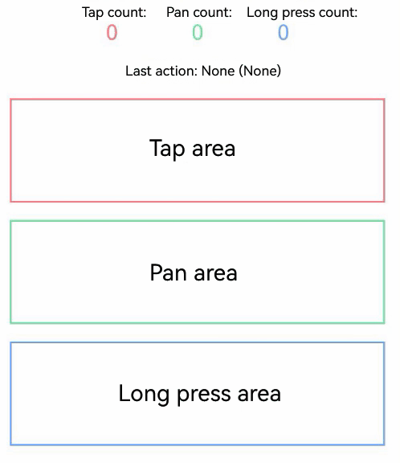

# Class (UIObserver)

<!--Kit: ArkUI-->
<!--Subsystem: ArkUI-->
<!--Owner: @piggyguy; @xiang-shouxing; @yangfan229-->
<!--Designer: @piggyguy; @xiang-shouxing; @yangfan229-->
<!--Tester: @fredyuan912-->
<!--Adviser: @HelloCrease-->

Provides APIs for listening for UI component behavior changes.

> **NOTE**
>
> - The initial APIs of this module are supported since API version 10. Updates will be marked with a superscript to indicate their earliest API version.
>
> - The initial APIs of this class are supported since API version 11.
>
> - In the following API examples, you must first use [getUIObserver()](arkts-apis-uicontext-uicontext.md#getuiobserver11) in **UIContext** to obtain a **UIObserver** instance, and then call the APIs using the obtained instance.
>
> - UIObserver can only listen for relevant information within the current process and does not support obtaining information in cross-process scenarios<!--Del--> such as [UIExtensionComponent](../../reference/apis-arkui/arkui-ts/ts-container-ui-extension-component-sys.md)<!--DelEnd-->.

## on('navDestinationUpdate')<sup>11+</sup>

on(type: 'navDestinationUpdate', callback: Callback\<observer.NavDestinationInfo\>): void

Subscribes to status changes of the **NavDestination** component.

**Atomic service API**: This API can be used in atomic services since API version 12.

**System capability**: SystemCapability.ArkUI.ArkUI.Full

**Parameters**

| Name  | Type                                                 | Mandatory| Description                                                        |
| -------- | ----------------------------------------------------- | ---- | ------------------------------------------------------------ |
| type     | string                                                | Yes  | Event type. The value is fixed at **'navDestinationUpdate'**, which indicates the status change event of the **NavDestination** component.|
| callback | Callback\<observer.[NavDestinationInfo](js-apis-arkui-observer.md#navdestinationinfo)\> | Yes  | Callback used to return the current state of the **NavDestination** component.                |

**Example**

<!--code_no_check-->
```ts
// Index.ets
// Example usage of uiObserver.on('navDestinationUpdate', callback)
// uiObserver.off('navDestinationUpdate', callback)

@Component
struct PageOne {
  build() {
    NavDestination() {
      Text("pageOne")
    }.title("pageOne")
  }
}

@Entry
@Component
struct Index {
  private stack: NavPathStack = new NavPathStack();

  @Builder
  PageBuilder(name: string) {
    PageOne()
  }

  aboutToAppear() {
    this.getUIContext().getUIObserver().on('navDestinationUpdate', (info) => {
      console.info('NavDestination state update', JSON.stringify(info));
    });
  }

  aboutToDisappear() {
    this.getUIContext().getUIObserver().off('navDestinationUpdate');
  }

  build() {
    Column() {
      Navigation(this.stack) {
        Button("push").onClick(() => {
          this.stack.pushPath({ name: "pageOne" });
        })
      }
      .title("Navigation")
      .navDestination(this.PageBuilder)
    }
    .width('100%')
    .height('100%')
  }
}
```

## off('navDestinationUpdate')<sup>11+</sup>

off(type: 'navDestinationUpdate', callback?: Callback\<observer.NavDestinationInfo\>): void

Unsubscribes from status changes of the **NavDestination** component.

**Atomic service API**: This API can be used in atomic services since API version 12.

**System capability**: SystemCapability.ArkUI.ArkUI.Full

**Parameters**

| Name  | Type                                                 | Mandatory| Description                                                        |
| -------- | ----------------------------------------------------- | ---- | ------------------------------------------------------------ |
| type     | string                                                | Yes  | Event type. The value is fixed at **'navDestinationUpdate'**, which indicates the status change event of the **NavDestination** component.|
| callback | Callback\<observer.[NavDestinationInfo](js-apis-arkui-observer.md#navdestinationinfo)\> | No  | Callback to unregister. If no callback is provided, all registered listener callbacks for the component will be unregistered.                |

**Example**

See the example for [uiObserver.on('navDestinationUpdate')](#onnavdestinationupdate11).

## on('navDestinationUpdate')<sup>11+</sup>

on(type: 'navDestinationUpdate', options: { navigationId: ResourceStr }, callback: Callback\<observer.NavDestinationInfo\>): void

Subscribes to status changes of the **NavDestination** component.

**Atomic service API**: This API can be used in atomic services since API version 12.

**System capability**: SystemCapability.ArkUI.ArkUI.Full

**Parameters**

| Name  | Type                                                        | Mandatory| Description                                                        |
| -------- | ------------------------------------------------------------ | ---- | ------------------------------------------------------------ |
| type     | string                                                       | Yes  | Event type. The value is fixed at **'navDestinationUpdate'**, which indicates the status change event of the **NavDestination** component.|
| options  | { navigationId: [ResourceStr](arkui-ts/ts-types.md#resourcestr) } | Yes  | ID of the **Navigation** component that contains the target **NavDestination** component.                                  |
| callback | Callback\<observer.[NavDestinationInfo](js-apis-arkui-observer.md#navdestinationinfo)\>        | Yes  | Callback used to return the current state of the **NavDestination** component.                |

**Example**

<!--code_no_check-->
```ts
// Index.ets
// Example usage of uiObserver.on('navDestinationUpdate', navigationId, callback)
// uiObserver.off('navDestinationUpdate', navigationId, callback)
@Component
struct PageOne {
  build() {
    NavDestination() {
      Text("pageOne")
    }.title("pageOne")
  }
}

@Entry
@Component
struct Index {
  private stack: NavPathStack = new NavPathStack();

  @Builder
  PageBuilder(name: string) {
    PageOne()
  }

  aboutToAppear() {
    this.getUIContext().getUIObserver().on('navDestinationUpdate', { navigationId: "testId" }, (info) => {
      console.info('NavDestination state update', JSON.stringify(info));
    });
  }

  aboutToDisappear() {
    this.getUIContext().getUIObserver().off('navDestinationUpdate', { navigationId: "testId" });
  }

  build() {
    Column() {
      Navigation(this.stack) {
        Button("push").onClick(() => {
          this.stack.pushPath({ name: "pageOne" });
        })
      }
      .id("testId")
      .title("Navigation")
      .navDestination(this.PageBuilder)
    }
    .width('100%')
    .height('100%')
  }
}
```

## off('navDestinationUpdate')<sup>11+</sup>

off(type: 'navDestinationUpdate', options: { navigationId: ResourceStr }, callback?: Callback\<observer.NavDestinationInfo\>): void

Unsubscribes from status changes of the **NavDestination** component.

**Atomic service API**: This API can be used in atomic services since API version 12.

**System capability**: SystemCapability.ArkUI.ArkUI.Full

**Parameters**

| Name  | Type                                                        | Mandatory| Description                                                        |
| -------- | ------------------------------------------------------------ | ---- | ------------------------------------------------------------ |
| type     | string                                                       | Yes  | Event type. The value is fixed at **'navDestinationUpdate'**, which indicates the status change event of the **NavDestination** component.|
| options  | { navigationId: [ResourceStr](arkui-ts/ts-types.md#resourcestr) } | Yes  | ID of the **Navigation** component that contains the target **NavDestination** component.                                  |
| callback | Callback\<observer.[NavDestinationInfo](js-apis-arkui-observer.md#navdestinationinfo)\>        | No  |Callback to unregister. If no callback is provided, all registered listener callbacks for the component will be unregistered.                |

**Example**

See the example for [uiObserver.on('navDestinationUpdate')](#onnavdestinationupdate11-1).

## on('navDestinationUpdateByUniqueId')<sup>20+</sup>

on(type: 'navDestinationUpdateByUniqueId', navigationUniqueId: number, callback: Callback\<observer.NavDestinationInfo\>): void

Subscribes to status changes of a **NavDestination** component using a **Navigation** component's unique ID, which can be obtained using [queryNavigationInfo](arkui-ts/ts-custom-component-api.md#querynavigationinfo12).

**Atomic service API**: This API can be used in atomic services since API version 20.

**System capability**: SystemCapability.ArkUI.ArkUI.Full

**Parameters**

| Name  | Type                                                                | Mandatory| Description                                                                    |
| -------- | -------------------------------------------------------------------- | ---- | ------------------------------------------------------------------------ |
| type     | string                                                               | Yes  | Event type. The value is fixed at **'navDestinationUpdateByUniqueId'**, which indicates the status change event of the **NavDestination** component.|
| navigationUniqueId  | number | Yes  | Unique ID of the target **Navigation** component, which can be obtained using [queryNavigationInfo](arkui-ts/ts-custom-component-api.md#querynavigationinfo12).                                              |
| callback | Callback\<observer.[NavDestinationInfo](js-apis-arkui-observer.md#navdestinationinfo)\>                | Yes  | Callback used to return the current state of the **NavDestination** component.                            |

**Example**

This example demonstrates how to trigger status change listening for a **NavDestination** component using a **Navigation** component's unique ID.

```ts
// Index.ets
// Demonstrate on('navDestinationUpdateByUniqueId', navigationUniqueId, callback)
// off('navDestinationUpdateByUniqueId', navigationUniqueId, callback)
@Component
struct PageOne {
  private text = '';
  private uniqueid = -1;
  aboutToAppear() {
    let navigationUniqueId = this.queryNavigationInfo()?.uniqueId;
    if (navigationUniqueId) {
      this.uniqueid = navigationUniqueId.valueOf();
    }
    this.text = JSON.stringify(this.uniqueid);
    this.getUIContext().getUIObserver().on('navDestinationUpdateByUniqueId', this.uniqueid, (info) => {
      console.info('NavDestination state update navigationId', JSON.stringify(info));
    });
  }
  aboutToDisappear() {
    this.getUIContext().getUIObserver().off('navDestinationUpdateByUniqueId', this.uniqueid);
  }
  build() {
    NavDestination() {
      Text("pageOne")
      Text('navigationUniqueId: ' + this.text)
        .width('80%')
        .height(50)
        .margin(50)
        .fontSize(20)
    }.title("pageOne")
  }
}

@Entry
@Component
struct Index {
  private stack: NavPathStack = new NavPathStack();

  @Builder
  PageBuilder(name: string) {
    PageOne()
  }

  build() {
    Column() {
      Navigation(this.stack) {
        Button("push").onClick(() => {
          this.stack.pushPath({ name: "pageOne" });
        })
      }
      .id("testId")
      .title("Navigation")
      .navDestination(this.PageBuilder)
    }
    .width('100%')
    .height('100%')
  }
}
```

## off('navDestinationUpdateByUniqueId')<sup>20+</sup>

off(type: 'navDestinationUpdateByUniqueId', navigationUniqueId: number, callback?: Callback\<observer.NavDestinationInfo\>): void

Unsubscribes from status changes of a **NavDestination** component, where the subscription was originally established using the unique ID of a specified **Navigation** component.

**Atomic service API**: This API can be used in atomic services since API version 20.

**System capability**: SystemCapability.ArkUI.ArkUI.Full

**Parameters**

| Name  | Type                                                                | Mandatory| Description                                                                    |
| -------- | -------------------------------------------------------------------- | ---- | ------------------------------------------------------------------------ |
| type     | string                                                               | Yes  | Event type. The value is fixed at **'navDestinationUpdateByUniqueId'**, which indicates the status change event of the **NavDestination** component.|
| navigationUniqueId  | number | Yes  | Unique ID of the target **Navigation** component, which can be obtained using [queryNavigationInfo](arkui-ts/ts-custom-component-api.md#querynavigationinfo12).                                              |
| callback | Callback\<observer.[NavDestinationInfo](js-apis-arkui-observer.md#navdestinationinfo)\>                | No  | Callback to unregister. If no callback is provided, all registered listener callbacks for the component will be unregistered.                            |

**Example**

See the example for [uiObserver.on('navDestinationUpdateByUniqueId')](#onnavdestinationupdatebyuniqueid20).

## on('scrollEvent')<sup>12+</sup>

on(type: 'scrollEvent', callback: Callback\<observer.ScrollEventInfo\>): void

Subscribes to the start and end of scroll events of all scrollable components, including [List](./arkui-ts/ts-container-list.md), [Grid](./arkui-ts/ts-container-grid.md), [Scroll](./arkui-ts/ts-container-scroll.md), [WaterFlow](./arkui-ts/ts-container-waterflow.md), and [ArcList](./arkui-ts/ts-container-arclist.md).

**Atomic service API**: This API can be used in atomic services since API version 12.

**System capability**: SystemCapability.ArkUI.ArkUI.Full

**Parameters**

| Name  | Type                                                 | Mandatory| Description                                                        |
| -------- | ----------------------------------------------------- | ---- | ------------------------------------------------------------ |
| type     | string                                                | Yes  | Event type. The value **'scrollEvent'** indicates the start and end of a scroll event.     |
| callback | Callback\<observer.[ScrollEventInfo](js-apis-arkui-observer.md#scrolleventinfo12)\> | Yes  | Callback used to return the Callback used to return the information about the scroll event.  |

**Example**

See the example for [off('scrollEvent')](#offscrollevent12-1).

## off('scrollEvent')<sup>12+</sup>

off(type: 'scrollEvent', callback?: Callback\<observer.ScrollEventInfo\>): void

Unsubscribes from the start and end of scroll events of all scrollable components, including [List](./arkui-ts/ts-container-list.md), [Grid](./arkui-ts/ts-container-grid.md), [Scroll](./arkui-ts/ts-container-scroll.md), [WaterFlow](./arkui-ts/ts-container-waterflow.md), and [ArcList](./arkui-ts/ts-container-arclist.md).

**Atomic service API**: This API can be used in atomic services since API version 12.

**System capability**: SystemCapability.ArkUI.ArkUI.Full

**Parameters**

| Name  | Type                                                 | Mandatory| Description                                                        |
| -------- | ----------------------------------------------------- | ---- | ------------------------------------------------------------ |
| type     | string                                                | Yes  | Event type. The value **'scrollEvent'** indicates the start and end of a scroll event.     |
| callback | Callback\<observer.[ScrollEventInfo](js-apis-arkui-observer.md#scrolleventinfo12)\> | No  | Callback used to return the Callback used to return the information about the scroll event.  |

**Example**

See the example for [off('scrollEvent')](#offscrollevent12-1).

## on('scrollEvent')<sup>12+</sup>

on(type: 'scrollEvent', options: observer.ObserverOptions, callback: Callback\<observer.ScrollEventInfo\>): void

Subscribes to the start and end of scroll events of a specific scrollable component identified by its ID. Supported components include [List](./arkui-ts/ts-container-list.md), [Grid](./arkui-ts/ts-container-grid.md), [Scroll](./arkui-ts/ts-container-scroll.md), [WaterFlow](./arkui-ts/ts-container-waterflow.md), and [ArcList](./arkui-ts/ts-container-arclist.md).

**Atomic service API**: This API can be used in atomic services since API version 12.

**System capability**: SystemCapability.ArkUI.ArkUI.Full

**Parameters**

| Name  | Type                                                        | Mandatory| Description                                                        |
| -------- | ------------------------------------------------------------ | ---- | ------------------------------------------------------------ |
| type     | string                                                       | Yes  | Event type. The value **'scrollEvent'** indicates the start and end of a scroll event.|
| options  | [observer.ObserverOptions](js-apis-arkui-observer.md#observeroptions12) | Yes  | Observer options, including the ID of the target scrollable component.                   |
| callback | Callback\<observer.[ScrollEventInfo](js-apis-arkui-observer.md#scrolleventinfo12)\>        | Yes  | Callback used to return the Callback used to return the information about the scroll event.                |

**Example**

See the example for [off('scrollEvent')](#offscrollevent12-1).

## off('scrollEvent')<sup>12+</sup>

off(type: 'scrollEvent', options: observer.ObserverOptions, callback?: Callback\<observer.ScrollEventInfo\>): void

Unsubscribes from the start and end of scroll events of a specific scrollable component identified by its ID. Supported components include [List](./arkui-ts/ts-container-list.md), [Grid](./arkui-ts/ts-container-grid.md), [Scroll](./arkui-ts/ts-container-scroll.md), [WaterFlow](./arkui-ts/ts-container-waterflow.md), and [ArcList](./arkui-ts/ts-container-arclist.md).

**Atomic service API**: This API can be used in atomic services since API version 12.

**System capability**: SystemCapability.ArkUI.ArkUI.Full

**Parameters**

| Name  | Type                                                        | Mandatory| Description                                                        |
| -------- | ------------------------------------------------------------ | ---- | ------------------------------------------------------------ |
| type     | string                                                       | Yes  | Event type. The value **'scrollEvent'** indicates the start and end of a scroll event.|
| options  | [observer.ObserverOptions](js-apis-arkui-observer.md#observeroptions12) | Yes  | Observer options, including the ID of the target scrollable component.                   |
| callback | Callback\<observer.[ScrollEventInfo](js-apis-arkui-observer.md#scrolleventinfo12)\>        | No  | Callback used to return the Callback used to return the information about the scroll event.                |

**Example**

```ts
import { UIObserver } from '@kit.ArkUI';

@Entry
@Component
struct Index {
  scroller: Scroller = new Scroller();
  observer: UIObserver = this.getUIContext().getUIObserver();
  private arr: number[] = [0, 1, 2, 3, 4, 5, 6, 7];

  build() {
    Column() {
      Column() {
        Scroll(this.scroller) {
          Column() {
            ForEach(this.arr, (item: number) => {
              Text(item.toString())
                .width('90%')
                .height(150)
                .backgroundColor(0xFFFFFF)
                .borderRadius(15)
                .fontSize(16)
                .textAlign(TextAlign.Center)
                .margin({ top: 10 })
            }, (item: string) => item)
          }.width('100%')
        }
        .id('testId')
        .height('80%')
      }
      .width('100%')

      Row() {
        Button('UIObserver on')
          .onClick(() => {
            this.observer.on('scrollEvent', (info) => {
              console.info('scrollEventInfo', JSON.stringify(info));
            });
          })
        Button('UIObserver off')
          .onClick(() => {
            this.observer.off('scrollEvent');
          })
      }

      Row() {
        Button('UIObserverWithId on')
          .onClick(() => {
            this.observer.on('scrollEvent', { id: 'testId' }, (info) => {
              console.info('scrollEventInfo', JSON.stringify(info));
            });
          })
        Button('UIObserverWithId off')
          .onClick(() => {
            this.observer.off('scrollEvent', { id: 'testId' });
          })
      }
    }
    .height('100%')
  }
}
```

## on('routerPageUpdate')<sup>11+</sup>

on(type: 'routerPageUpdate', callback: Callback\<observer.RouterPageInfo\>): void

Subscribes to state changes of the page during routing.

**Atomic service API**: This API can be used in atomic services since API version 12.

**System capability**: SystemCapability.ArkUI.ArkUI.Full

**Parameters**

| Name  | Type                                                        | Mandatory| Description                                                        |
| -------- | ------------------------------------------------------------ | ---- | ------------------------------------------------------------ |
| type     | string                                                       | Yes  | Event type. The value is fixed at **'routerPageUpdate'**, which indicates the state change event of the page during routing.|
| callback | Callback\<observer.[RouterPageInfo](js-apis-arkui-observer.md#routerpageinfo)\>        | Yes  | Callback used to return the If **pageInfo** is passed, the current page state is returned.                |

**Example**

See the example for [on('navDestinationUpdate')](#onnavdestinationupdate11).

<!--code_no_check-->
```ts
import { UIContext, UIObserver } from '@kit.ArkUI';

let observer:UIObserver = this.getUIContext().getUIObserver();
observer.on('routerPageUpdate', (info) => {
    console.info('RouterPage state updated, called by ' + `${info.name}`);
});
```

## off('routerPageUpdate')<sup>11+</sup>

off(type: 'routerPageUpdate', callback?: Callback\<observer.RouterPageInfo\>): void

Unsubscribes to state changes of the page during routing.

**Atomic service API**: This API can be used in atomic services since API version 12.

**System capability**: SystemCapability.ArkUI.ArkUI.Full

**Parameters**

| Name  | Type                                                        | Mandatory| Description                                                        |
| -------- | ------------------------------------------------------------ | ---- | ------------------------------------------------------------ |
| type     | string                                                       | Yes  | Event type. The value is fixed at **'routerPageUpdate'**, which indicates the state change event of the page during routing.|
| callback | Callback\<observer.[RouterPageInfo](js-apis-arkui-observer.md#routerpageinfo)\>        | No  | Callback to be unregistered.                |

**Example**

See the example for [on('navDestinationUpdate')](#onnavdestinationupdate11).

<!--code_no_check-->
```ts
import { UIContext, UIObserver } from '@kit.ArkUI';

let observer:UIObserver = this.getUIContext().getUIObserver();
function callbackFunc(info:observer.RouterPageInfo) {};
// callbackFunc is defined and used before
observer.off('routerPageUpdate', callbackFunc);
```

## on('densityUpdate')<sup>12+</sup>

on(type: 'densityUpdate', callback: Callback\<observer.DensityInfo\>): void

Subscribes to the pixel density changes of the screen.

**Atomic service API**: This API can be used in atomic services since API version 12.

**System capability**: SystemCapability.ArkUI.ArkUI.Full

**Parameters**

| Name  | Type                                                        | Mandatory| Description                                                        |
| -------- | ------------------------------------------------------------ | ---- | ------------------------------------------------------------ |
| type     | string                                                       | Yes  | Event type. The value **'densityUpdate'** indicates the pixel density changes of the screen.|
| callback | Callback\<observer.[DensityInfo](./js-apis-arkui-observer.md#densityinfo12)\>        | Yes  | Callback used to return the screen pixel density after the change.                |

```ts
import { uiObserver } from '@kit.ArkUI';

@Entry
@Component
struct Index {
  @State density: number = 0;
  @State message: string = 'Listener not registered';

  densityUpdateCallback = (info: uiObserver.DensityInfo) => {
    this.density = info.density;
    this.message = 'DPI after change:' + this.density.toString();
  }

  build() {
    Column() {
      Text(this.message)
        .fontSize(24)
        .fontWeight(FontWeight.Bold)
      Button ('Subscribe to Screen Pixel Density Changes')
        .onClick(() => {
          this.message = 'Listener registered';
          this.getUIContext().getUIObserver().on('densityUpdate', this.densityUpdateCallback);
        })
    }
  }
}
```

## off('densityUpdate')<sup>12+</sup>

off(type: 'densityUpdate', callback?: Callback\<observer.DensityInfo\>): void

Unsubscribes from the pixel density changes of the screen.

**Atomic service API**: This API can be used in atomic services since API version 12.

**System capability**: SystemCapability.ArkUI.ArkUI.Full

**Parameters**

| Name  | Type                                                                | Mandatory| Description                                                                                        |
| -------- | -------------------------------------------------------------------- | ---- | -------------------------------------------------------------------------------------------- |
| type     | string                                                               | Yes  | Event type. The value **'densityUpdate'** indicates the pixel density changes of the screen.                                       |
| callback | Callback\<observer.[DensityInfo](./js-apis-arkui-observer.md#densityinfo12)\> | No  | Callback to be unregistered. If this parameter is not specified, this API unregisters all callbacks for the **densityUpdate** event under the current UI context.|

```ts
import { uiObserver } from '@kit.ArkUI';

@Entry
@Component
struct Index {
  @State density: number = 0;
  @State message: string = 'Listener not registered';

  densityUpdateCallback = (info: uiObserver.DensityInfo) => {
    this.density = info.density;
    this.message = 'DPI after change:' + this.density.toString();
  }

  build() {
    Column() {
      Text(this.message)
        .fontSize(24)
        .fontWeight(FontWeight.Bold)
      Button ('Subscribe to Screen Pixel Density Changes')
        .margin({ bottom: 10 })
        .onClick(() => {
          this.message = 'Listener registered';
          this.getUIContext().getUIObserver().on('densityUpdate', this.densityUpdateCallback);
        })
      Button ('Unsubscribe from Screen Pixel Density Changes')
        .onClick(() => {
          this.message = 'Listener not registered';
          this.getUIContext().getUIObserver().off('densityUpdate', this.densityUpdateCallback);
        })
    }
  }
}
```

## on('willDraw')<sup>12+</sup>

on(type: 'willDraw', callback: Callback\<void\>): void

Subscribes to the dispatch of drawing instructions in each frame.

**Atomic service API**: This API can be used in atomic services since API version 12.

**System capability**: SystemCapability.ArkUI.ArkUI.Full

**Parameters**

| Name  | Type                                                        | Mandatory| Description                                                        |
| -------- | ------------------------------------------------------------ | ---- | ------------------------------------------------------------ |
| type     | string                                                       | Yes  | Event event. The value **'willDraw'** indicates whether drawing is about to occur.|
| callback | Callback\<void\>        | Yes  | Callback used to return the                |

```ts
import { uiObserver } from '@kit.ArkUI';

@Entry
@Component
struct Index {
  willDrawCallback = () => {
    console.info("willDraw instruction dispatched.");
  }
  build() {
    Column() {
      Button('Subscribe to Drawing Instruction Dispatch')
        .onClick(() => {
          this.getUIContext().getUIObserver().on('willDraw', this.willDrawCallback);
        })
    }
  }
}
```

## off('willDraw')<sup>12+</sup>

off(type: 'willDraw', callback?: Callback\<void\>): void

Unsubscribes from the dispatch of drawing instructions in each frame.

**Atomic service API**: This API can be used in atomic services since API version 12.

**System capability**: SystemCapability.ArkUI.ArkUI.Full

**Parameters**

| Name  | Type                                                        | Mandatory| Description                                                        |
| -------- | ------------------------------------------------------------ | ---- | ------------------------------------------------------------ |
| type     | string                                                       | Yes  | Event event. The value **'willDraw'** indicates whether drawing is about to occur.|
| callback | Callback\<void\>        | No  | Callback to be unregistered.                 |

```ts
import { uiObserver } from '@kit.ArkUI';

@Entry
@Component
struct Index {
  willDrawCallback = () => {
    console.info("willDraw instruction dispatched.")
  }

  build() {
    Column() {
      Button('Subscribe to Drawing Instruction Dispatch')
        .margin({ bottom: 10 })
        .onClick(() => {
          this.getUIContext().getUIObserver().on('willDraw', this.willDrawCallback);
        })
      Button('Unsubscribe from Drawing Instruction Dispatch')
        .onClick(() => {
          this.getUIContext().getUIObserver().off('willDraw', this.willDrawCallback);
        })
    }
  }
}
```

## on('didLayout')<sup>12+</sup>

on(type: 'didLayout', callback: Callback\<void\>): void

Subscribes to layout completion status in each frame.

**Atomic service API**: This API can be used in atomic services since API version 12.

**System capability**: SystemCapability.ArkUI.ArkUI.Full

**Parameters**

| Name  | Type                                                        | Mandatory| Description                                                        |
| -------- | ------------------------------------------------------------ | ---- | ------------------------------------------------------------ |
| type     | string                                                       | Yes  | Event type. The value **'didLayout'** indicates whether the layout has been completed.|
| callback | Callback\<void\>        | Yes  | Callback used to return the                |

```ts
import { uiObserver } from '@kit.ArkUI';

@Entry
@Component
struct Index {
  didLayoutCallback = () => {
    console.info("Layout completed.");
  }
  build() {
    Column() {
      Button('Subscribe to Layout Completion')
        .onClick(() => {
          this.getUIContext().getUIObserver().on('didLayout', this.didLayoutCallback);
        })
    }
  }
}
```

## off('didLayout')<sup>12+</sup>

off(type: 'didLayout', callback?: Callback\<void\>): void

Unsubscribes from layout completion status in each frame.

**Atomic service API**: This API can be used in atomic services since API version 12.

**System capability**: SystemCapability.ArkUI.ArkUI.Full

**Parameters**

| Name  | Type                                                        | Mandatory| Description                                                        |
| -------- | ------------------------------------------------------------ | ---- | ------------------------------------------------------------ |
| type     | string                                                       | Yes  | Event type. The value **'didLayout'** indicates whether the layout has been completed.|
| callback | Callback\<void\>        | No  | Callback to be unregistered.                 |

```ts
import { uiObserver } from '@kit.ArkUI';

@Entry
@Component
struct Index {
  didLayoutCallback = () => {
    console.info("Layout completed.");
  }

  build() {
    Column() {
      Button('Subscribe to Layout Completion')
        .margin({ bottom: 10 })
        .onClick(() => {
          this.getUIContext().getUIObserver().on('didLayout', this.didLayoutCallback);
        })
      Button('Unsubscribe from Layout Completion')
        .onClick(() => {
          this.getUIContext().getUIObserver().off('didLayout', this.didLayoutCallback);
        })
    }
  }
}
```

## on('navDestinationSwitch')<sup>12+</sup>

on(type: 'navDestinationSwitch', callback: Callback\<observer.NavDestinationSwitchInfo\>): void

Subscribes to the page switching event of the **Navigation** component.

**Atomic service API**: This API can be used in atomic services since API version 12.

**System capability**: SystemCapability.ArkUI.ArkUI.Full

**Parameters**

| Name  | Type                                                        | Mandatory| Description                                                        |
| -------- | ------------------------------------------------------------ | ---- | ------------------------------------------------------------ |
| type     | string                                                       | Yes  | Event type. The value **'navDestinationSwitch'** indicates the page switching event of the **Navigation** component.|
| callback | Callback\<observer.[NavDestinationSwitchInfo](js-apis-arkui-observer.md#navdestinationswitchinfo12)\>        | Yes  | Callback used to return the information about the page switching event.                |

**Example**

```ts
// Index.ets
// UIObserver.on('navDestinationSwitch', callback) demo
// UIObserver.off('navDestinationSwitch', callback)
import { uiObserver } from '@kit.ArkUI';

@Component
struct PageOne {
  build() {
    NavDestination() {
      Text("pageOne")
    }.title("pageOne")
  }
}

function callbackFunc(info: uiObserver.NavDestinationSwitchInfo) {
  console.info(`testTag navDestinationSwitch from: ${JSON.stringify(info.from)} to: ${JSON.stringify(info.to)}`);
}

@Entry
@Component
struct Index {
  private stack: NavPathStack = new NavPathStack();

  @Builder
  PageBuilder(name: string) {
    PageOne()
  }

  aboutToAppear() {
    let obs = this.getUIContext().getUIObserver();
    obs.on('navDestinationSwitch', callbackFunc);
  }

  aboutToDisappear() {
    let obs = this.getUIContext().getUIObserver();
    obs.off('navDestinationSwitch', callbackFunc);
  }

  build() {
    Column() {
      Navigation(this.stack) {
        Button("push").onClick(() => {
          this.stack.pushPath({name: "pageOne"});
        })
      }
      .title("Navigation")
      .navDestination(this.PageBuilder)
    }
    .width('100%')
    .height('100%')
  }
}
```

## off('navDestinationSwitch')<sup>12+</sup>

off(type: 'navDestinationSwitch', callback?: Callback\<observer.NavDestinationSwitchInfo\>): void

Unsubscribes from the page switching event of the **Navigation** component.

**Atomic service API**: This API can be used in atomic services since API version 12.

**System capability**: SystemCapability.ArkUI.ArkUI.Full

**Parameters**

| Name  | Type                                                        | Mandatory| Description                                                        |
| -------- | ------------------------------------------------------------ | ---- | ------------------------------------------------------------ |
| type     | string                                                       | Yes  | Event type. The value **'navDestinationSwitch'** indicates the page switching event of the **Navigation** component.|
| callback | Callback\<observer.[NavDestinationSwitchInfo](js-apis-arkui-observer.md#navdestinationswitchinfo12)\>        | No  | Callback to be unregistered.                |

For the sample code, see the example for **UIObserver.on('navDestinationSwitch')**.

## on('navDestinationSwitch')<sup>12+</sup>

on(type: 'navDestinationSwitch', observerOptions: observer.NavDestinationSwitchObserverOptions, callback: Callback\<observer.NavDestinationSwitchInfo\>): void

Subscribes to the page switching event of the **Navigation** component.

**Atomic service API**: This API can be used in atomic services since API version 12.

**System capability**: SystemCapability.ArkUI.ArkUI.Full

**Parameters**

| Name  | Type                                                        | Mandatory| Description                                                        |
| -------- | ------------------------------------------------------------ | ---- | ------------------------------------------------------------ |
| type     | string                                                       | Yes  | Event type. The value **'navDestinationSwitch'** indicates the page switching event of the **Navigation** component.|
| observerOptions | observer.[NavDestinationSwitchObserverOptions](js-apis-arkui-observer.md#navdestinationswitchobserveroptions12)        | Yes  | Observer options.  |
| callback | Callback\<observer.[NavDestinationSwitchInfo](js-apis-arkui-observer.md#navdestinationswitchinfo12)\>        | Yes  | Callback used to return the information about the page switching event.                |

**Example**

```ts
// Index.ets
// Demo UIObserver.on('navDestinationSwitch', NavDestinationSwitchObserverOptions, callback)
// UIObserver.off('navDestinationSwitch', NavDestinationSwitchObserverOptions, callback)
import { uiObserver } from '@kit.ArkUI';

@Component
struct PageOne {
  build() {
    NavDestination() {
      Text("pageOne")
    }.title("pageOne")
  }
}

function callbackFunc(info: uiObserver.NavDestinationSwitchInfo) {
  console.info(`testTag navDestinationSwitch from: ${JSON.stringify(info.from)} to: ${JSON.stringify(info.to)}`);
}

@Entry
@Component
struct Index {
  private stack: NavPathStack = new NavPathStack();

  @Builder
  PageBuilder(name: string) {
    PageOne()
  }

  aboutToAppear() {
    let obs = this.getUIContext().getUIObserver();
    obs.on('navDestinationSwitch', { navigationId: "myNavId" }, callbackFunc);
  }

  aboutToDisappear() {
    let obs = this.getUIContext().getUIObserver();
    obs.off('navDestinationSwitch', { navigationId: "myNavId" }, callbackFunc);
  }

  build() {
    Column() {
      Navigation(this.stack) {
        Button("push").onClick(() => {
          this.stack.pushPath({name: "pageOne"});
        })
      }
      .id("myNavId")
      .title("Navigation")
      .navDestination(this.PageBuilder)
    }
    .width('100%')
    .height('100%')
  }
}
```

## off('navDestinationSwitch')<sup>12+</sup>

off(type: 'navDestinationSwitch', observerOptions: observer.NavDestinationSwitchObserverOptions, callback?: Callback\<observer.NavDestinationSwitchInfo\>): void

Unsubscribes from the page switching event of the **Navigation** component.

**Atomic service API**: This API can be used in atomic services since API version 12.

**System capability**: SystemCapability.ArkUI.ArkUI.Full

**Parameters**

| Name  | Type                                                        | Mandatory| Description                                                        |
| -------- | ------------------------------------------------------------ | ---- | ------------------------------------------------------------ |
| type     | string                                                       | Yes  | Event type. The value **'navDestinationSwitch'** indicates the page switching event of the **Navigation** component.|
| observerOptions | observer.[NavDestinationSwitchObserverOptions](js-apis-arkui-observer.md#navdestinationswitchobserveroptions12)        | Yes  | Observer options.  |
| callback | Callback\<observer.[NavDestinationSwitchInfo](js-apis-arkui-observer.md#navdestinationswitchinfo12)\>        | No  | Callback to be unregistered.                |

For the sample code, see the example for **UIObserver.on('navDestinationSwitch')**.

## on('willClick')<sup>12+</sup>

on(type: 'willClick', callback: GestureEventListenerCallback): void

Subscribes to the dispatch of click event instructions. The callback type is [GestureEventListenerCallback](arkts-apis-uicontext-t.md#gestureeventlistenercallback12). The screen reader touch exploration mode is supported since API version 20.

**Atomic service API**: This API can be used in atomic services since API version 12.

**System capability**: SystemCapability.ArkUI.ArkUI.Full

**Parameters**

| Name  | Type                                                        | Mandatory| Description                                                        |
| -------- | ------------------------------------------------------------ | ---- | ------------------------------------------------------------ |
| type     | string                                                       | Yes  | Event type. The value **'willClick'** indicates the dispatch of click event instructions. The registered callback is triggered when the click event is about to occur.|
| callback | [GestureEventListenerCallback](arkts-apis-uicontext-t.md#gestureeventlistenercallback12) | Yes  | Callback used to return the **GestureEvent** object of the click event and the FrameNode of the component. |

**Example**

```ts
// Define callbacks for event listeners.
function willClickGestureCallback(event: GestureEvent, node?: FrameNode) {
  console.info('Example willClickCallback GestureEvent is called');
}

function willClickCallback(event: ClickEvent, node?: FrameNode) {
  console.info('Example willClickCallback ClickEvent is called');
}

function didClickGestureCallback(event: GestureEvent, node?: FrameNode) {
  console.info('Example didClickCallback GestureEvent is called');
}

function didClickCallback(event: ClickEvent, node?: FrameNode) {
  console.info('Example didClickCallback ClickEvent is called');
}

@Entry
@Component
struct ClickExample {
  @State clickCount: number = 0;
  @State tapGestureCount: number = 0;

  aboutToAppear(): void {
    // Add event listeners.
    let observer = this.getUIContext().getUIObserver();
    observer.on('willClick', willClickGestureCallback);
    observer.on('willClick', willClickCallback);
    observer.on('didClick', didClickGestureCallback);
    observer.on('didClick', didClickCallback);
  }

  aboutToDisappear(): void {
    // Remove event listeners.
    let observer = this.getUIContext().getUIObserver();
    observer.off('willClick', willClickGestureCallback);
    observer.off('willClick', willClickCallback);
    // If no callback is specified, all callbacks for this event will be removed.
    observer.off('didClick');
  }

  build() {
    Column() {
      /**
       * onClick and TapGesture are handled in the same way in the backend.
       * Therefore, whether onClick or TapGesture is triggered,
       * both callback types (GestureEvent and ClickEvent) registered with on('willClick') will be triggered.
       * Similarly, both callback types registered with on('didClick') will be triggered.
       */
      Column() {
        Text('Click Count: ' + this.clickCount)
      }
      .height(200)
      .width(300)
      .padding(20)
      .border({ width: 3 })
      .margin(50)
      .onClick((event: ClickEvent) => {
        this.clickCount++;
        console.info('Example Click event is called');
      })

      Column() {
        Text('TapGesture Count: ' + this.tapGestureCount)
      }
      .height(200)
      .width(300)
      .padding(20)
      .border({ width: 3 })
      .margin(50)
      .gesture(TapGesture({ count: 2 }).onAction((event: TapGestureEvent) => {
        this.tapGestureCount++;
        console.info('Example Click event is called');
      }))
    }
  }
}
```

## off('willClick')<sup>12+</sup>

off(type: 'willClick', callback?: GestureEventListenerCallback): void

Unsubscribes from the dispatch of click event instructions. The screen reader touch exploration mode is supported since API version 20.

**Atomic service API**: This API can be used in atomic services since API version 12.

**System capability**: SystemCapability.ArkUI.ArkUI.Full

**Parameters**

| Name  | Type                                                        | Mandatory| Description                                                 |
| -------- | ------------------------------------------------------------ | ---- | ----------------------------------------------------- |
| type     | string                                                       | Yes  | Event type. The value **'willClick'** indicates the dispatch of click event instructions.|
| callback | [GestureEventListenerCallback](arkts-apis-uicontext-t.md#gestureeventlistenercallback12) | No  | Callback to be unregistered.                               |

**Example**

See the example for [on('willClick')](#onwillclick12).

## on('didClick')<sup>12+</sup>

on(type: 'didClick', callback: GestureEventListenerCallback): void

Subscribes to the dispatch of click event instructions. The callback type is [GestureEventListenerCallback](arkts-apis-uicontext-t.md#gestureeventlistenercallback12). The screen reader touch exploration mode is supported since API version 20.

**Atomic service API**: This API can be used in atomic services since API version 12.

**System capability**: SystemCapability.ArkUI.ArkUI.Full

**Parameters**

| Name  | Type                                                        | Mandatory| Description                                                        |
| -------- | ------------------------------------------------------------ | ---- | ------------------------------------------------------------ |
| type     | string                                                       | Yes  | Event type. The value **'didClick'** indicates the dispatch of click event instructions. The registered callback is triggered after the click event is about to occur.|
| callback | [GestureEventListenerCallback](arkts-apis-uicontext-t.md#gestureeventlistenercallback12) | Yes  | Callback used to return the **GestureEvent** object of the click event and the FrameNode of the component. |

**Example**

See the example for [on('willClick')](#onwillclick12).

## off('didClick')<sup>12+</sup>

off(type: 'didClick', callback?: GestureEventListenerCallback): void

Unsubscribes from the dispatch of click event instructions. The screen reader touch exploration mode is supported since API version 20.

**Atomic service API**: This API can be used in atomic services since API version 12.

**System capability**: SystemCapability.ArkUI.ArkUI.Full

**Parameters**

| Name  | Type                                                        | Mandatory| Description                                                |
| -------- | ------------------------------------------------------------ | ---- | ---------------------------------------------------- |
| type     | string                                                       | Yes  | Event type. The value **'didClick'** indicates the dispatch of click event instructions.|
| callback | [GestureEventListenerCallback](arkts-apis-uicontext-t.md#gestureeventlistenercallback12) | No  | Callback to be unregistered.                              |

**Example**

See the example for [on('willClick')](#onwillclick12).

## on('willClick')<sup>12+</sup>

on(type: 'willClick', callback: ClickEventListenerCallback): void

Subscribes to the dispatch of click event instructions. The callback type is [ClickEventListenerCallback](arkts-apis-uicontext-t.md#clickeventlistenercallback12). The screen reader touch exploration mode is supported since API version 20.

**Atomic service API**: This API can be used in atomic services since API version 12.

**System capability**: SystemCapability.ArkUI.ArkUI.Full

**Parameters**

| Name  | Type                                                       | Mandatory| Description                                                        |
| -------- | ----------------------------------------------------------- | ---- | ------------------------------------------------------------ |
| type     | string                                                      | Yes  | Event type. The value **'willClick'** indicates the dispatch of click event instructions. The registered callback is triggered when the click event is about to occur.|
| callback | [ClickEventListenerCallback](arkts-apis-uicontext-t.md#clickeventlistenercallback12) | Yes  | Callback used to return the **ClickEvent** object and the FrameNode of the component.   |

**Example**

See the example for [on('willClick')](#onwillclick12).

## off('willClick')<sup>12+</sup>

off(type: 'willClick', callback?: ClickEventListenerCallback): void

Unsubscribes from the dispatch of click event instructions. The screen reader touch exploration mode is supported since API version 20.

**Atomic service API**: This API can be used in atomic services since API version 12.

**System capability**: SystemCapability.ArkUI.ArkUI.Full

**Parameters**

| Name  | Type                                                       | Mandatory| Description                                                 |
| -------- | ----------------------------------------------------------- | ---- | ----------------------------------------------------- |
| type     | string                                                      | Yes  | Event type. The value **'willClick'** indicates the dispatch of click event instructions.|
| callback | [ClickEventListenerCallback](arkts-apis-uicontext-t.md#clickeventlistenercallback12) | No  | Callback to be unregistered.                               |

**Example**

See the example for [on('willClick')](#onwillclick12).

## on('didClick')<sup>12+</sup>

on(type: 'didClick', callback: ClickEventListenerCallback): void

Subscribes to the dispatch of click event instructions. The callback type is [ClickEventListenerCallback](arkts-apis-uicontext-t.md#clickeventlistenercallback12). The screen reader touch exploration mode is supported since API version 20.

**Atomic service API**: This API can be used in atomic services since API version 12.

**System capability**: SystemCapability.ArkUI.ArkUI.Full

**Parameters**

| Name  | Type                                                       | Mandatory| Description                                                        |
| -------- | ----------------------------------------------------------- | ---- | ------------------------------------------------------------ |
| type     | string                                                      | Yes  | Event type. The value **'didClick'** indicates the dispatch of click event instructions. The registered callback is triggered after the click event is about to occur.|
| callback | [ClickEventListenerCallback](arkts-apis-uicontext-t.md#clickeventlistenercallback12) | Yes  | Callback used to return the **ClickEvent** object and the FrameNode of the component.   |

**Example**

See the example for [on('willClick')](#onwillclick12).

## off('didClick')<sup>12+</sup>

off(type: 'didClick', callback?: ClickEventListenerCallback): void

Unsubscribes from the dispatch of click event instructions. The screen reader touch exploration mode is supported since API version 20.

**Atomic service API**: This API can be used in atomic services since API version 12.

**System capability**: SystemCapability.ArkUI.ArkUI.Full

**Parameters**

| Name  | Type                                                       | Mandatory| Description                                                |
| -------- | ----------------------------------------------------------- | ---- | ---------------------------------------------------- |
| type     | string                                                      | Yes  | Event type. The value **'didClick'** indicates the dispatch of click event instructions.|
| callback | [ClickEventListenerCallback](arkts-apis-uicontext-t.md#clickeventlistenercallback12) | No  | Callback to be unregistered.                              |

**Example**

See the example for [on('willClick')](#onwillclick12).

## on('tabContentUpdate')<sup>12+</sup>

on(type: 'tabContentUpdate', callback: Callback\<observer.TabContentInfo\>): void

Subscribes to the **TabContent** switching event.

**Atomic service API**: This API can be used in atomic services since API version 12.

**System capability**: SystemCapability.ArkUI.ArkUI.Full

**Parameters**

| Name  | Type                                                        | Mandatory| Description                                                        |
| -------- | ------------------------------------------------------------ | ---- | ------------------------------------------------------------ |
| type     | string                                                       | Yes  | Event type. The value **'tabContentUpdate'** indicates the **TabContent** switching event.|
| callback | Callback\<observer.[TabContentInfo](js-apis-arkui-observer.md#tabcontentinfo12)\> | Yes  | Callback used to return the information about the **TabContent** switching event.|

**Example**

```ts
import { uiObserver } from '@kit.ArkUI';

function callbackFunc(info: uiObserver.TabContentInfo) {
  console.info('tabContentUpdate', JSON.stringify(info));
}

@Entry
@Component
struct TabsExample {

  aboutToAppear(): void {
    let observer = this.getUIContext().getUIObserver();
    observer.on('tabContentUpdate', callbackFunc);
  }

  aboutToDisappear(): void {
    let observer = this.getUIContext().getUIObserver();
    observer.off('tabContentUpdate', callbackFunc);
  }

  build() {
    Column() {
      Tabs() {
        TabContent() {
          Column().width('100%').height('100%').backgroundColor('#00CB87')
        }.tabBar('green').id('tabContentId0')

        TabContent() {
          Column().width('100%').height('100%').backgroundColor('#007DFF')
        }.tabBar('blue').id('tabContentId1')

        TabContent() {
          Column().width('100%').height('100%').backgroundColor('#FFBF00')
        }.tabBar('yellow').id('tabContentId2')

        TabContent() {
          Column().width('100%').height('100%').backgroundColor('#E67C92')
        }.tabBar('pink').id('tabContentId3')
      }
      .width(360)
      .height(296)
      .backgroundColor('#F1F3F5')
      .id('tabsId')
    }.width('100%')
  }
}
```

## off('tabContentUpdate')<sup>12+</sup>

off(type: 'tabContentUpdate', callback?: Callback\<observer.TabContentInfo\>): void

Unsubscribes from the **TabContent** switching event.

**Atomic service API**: This API can be used in atomic services since API version 12.

**System capability**: SystemCapability.ArkUI.ArkUI.Full

**Parameters**

| Name  | Type                                                        | Mandatory| Description                                                        |
| -------- | ------------------------------------------------------------ | ---- | ------------------------------------------------------------ |
| type     | string                                                       | Yes  | Event type. The value **'tabContentUpdate'** indicates the **TabContent** switching event.|
| callback | Callback\<observer.[TabContentInfo](js-apis-arkui-observer.md#tabcontentinfo12)\> | No  | Callback to be unregistered.|

**Example**

See the example of [on('tabContentUpdate')](#ontabcontentupdate12).

## on('tabContentUpdate')<sup>12+</sup>

on(type: 'tabContentUpdate', options: observer.ObserverOptions, callback: Callback\<observer.TabContentInfo\>): void

Subscribes to the **TabContent** switching event.

**Atomic service API**: This API can be used in atomic services since API version 12.

**System capability**: SystemCapability.ArkUI.ArkUI.Full

**Parameters**

| Name  | Type                                                        | Mandatory| Description                                                        |
| -------- | ------------------------------------------------------------ | ---- | ------------------------------------------------------------ |
| type     | string                                                       | Yes  | Event type. The value **'tabContentUpdate'** indicates the **TabContent** switching event.|
| options  | observer.[ObserverOptions](js-apis-arkui-observer.md#observeroptions12) | Yes  | ID of the target **Tabs** component.|
| callback | Callback\<observer.[TabContentInfo](js-apis-arkui-observer.md#tabcontentinfo12)\> | Yes  | Callback used to return the information about the **TabContent** switching event.|

**Example**

```ts
import { uiObserver } from '@kit.ArkUI';

function callbackFunc(info: uiObserver.TabContentInfo) {
  console.info('tabContentUpdate', JSON.stringify(info));
}

@Entry
@Component
struct TabsExample {

  aboutToAppear(): void {
    let observer = this.getUIContext().getUIObserver();
    observer.on('tabContentUpdate', { id: 'tabsId' }, callbackFunc);
  }

  aboutToDisappear(): void {
    let observer = this.getUIContext().getUIObserver();
    observer.off('tabContentUpdate', { id: 'tabsId' }, callbackFunc);
  }

  build() {
    Column() {
      Tabs() {
        TabContent() {
          Column().width('100%').height('100%').backgroundColor('#00CB87')
        }.tabBar('green').id('tabContentId0')

        TabContent() {
          Column().width('100%').height('100%').backgroundColor('#007DFF')
        }.tabBar('blue').id('tabContentId1')

        TabContent() {
          Column().width('100%').height('100%').backgroundColor('#FFBF00')
        }.tabBar('yellow').id('tabContentId2')

        TabContent() {
          Column().width('100%').height('100%').backgroundColor('#E67C92')
        }.tabBar('pink').id('tabContentId3')
      }
      .width(360)
      .height(296)
      .backgroundColor('#F1F3F5')
      .id('tabsId')
    }.width('100%')
  }
}
```

## off('tabContentUpdate')<sup>12+</sup>

off(type: 'tabContentUpdate', options: observer.ObserverOptions, callback?: Callback\<observer.TabContentInfo\>): void

Unsubscribes from the **TabContent** switching event.

**Atomic service API**: This API can be used in atomic services since API version 12.

**System capability**: SystemCapability.ArkUI.ArkUI.Full

**Parameters**

| Name  | Type                                                        | Mandatory| Description                                                        |
| -------- | ------------------------------------------------------------ | ---- | ------------------------------------------------------------ |
| type     | string                                                       | Yes  | Event type. The value **'tabContentUpdate'** indicates the **TabContent** switching event.|
| options  | observer.[ObserverOptions](js-apis-arkui-observer.md#observeroptions12) | Yes  | ID of the target **Tabs** component.|
| callback | Callback\<observer.[TabContentInfo](js-apis-arkui-observer.md#tabcontentinfo12)\> | No  | Callback to be unregistered.|

**Example**

See the example of [on('tabContentUpdate')](#ontabcontentupdate12-1).

## on('beforePanStart')<sup>19+</sup>

on(type: 'beforePanStart', callback: PanListenerCallback): void

Subscribes to the [onActionStart](arkui-ts/ts-basic-gestures-pangesture.md#events) event for the pan gesture, executing the callback before the **onActionStart** event is triggered. It works for finger swiping, mouse dragging, mouse wheel scrolling, and touchpad movements, but not for screen reader touch mode.

**Atomic service API**: This API can be used in atomic services since API version 19.

**System capability**: SystemCapability.ArkUI.ArkUI.Full

**Parameters**

| Name  | Type                                                       | Mandatory| Description                                                        |
| -------- | ----------------------------------------------------------- | ---- | ------------------------------------------------------------ |
| type     | string                                                      | Yes  | Event type. The value is fixed at **'beforePanStart'**, which triggers the callback before the **onActionStart** event of the pan gesture.|
| callback | [PanListenerCallback](arkts-apis-uicontext-t.md#panlistenercallback19) | Yes  | Callback used to return the **GestureEvent** and **GestureRecognizer** of the pan gesture event and the FrameNode of the component.  |

**Example**

```ts
// Used in page components.
let TEST_TAG: string = 'node';

function callbackFunc() {
  console.info('on == beforePanStart');
}

function afterPanCallBack() {
  console.info('on == afterPanStart');
}

function beforeEndCallBack() {
  console.info('on == beforeEnd');
}

function afterEndCallBack() {
  console.info('on == afterEnd');
}

function beforeStartCallBack() {
  console.info('on == beforeStartCallBack');
}

function panGestureCallBack(event: GestureEvent, current: GestureRecognizer, node?: FrameNode) {
  TEST_TAG = 'panGestureEvent';
  console.info('===' + TEST_TAG + '=== event.repeat is ' + event.repeat);
  console.info('===' + TEST_TAG + '=== event target is ' + event.target.id);
  TEST_TAG = 'panGestureCurrent';
  console.info('===' + TEST_TAG + '=== current.getTag() is ' + current.getTag());
  TEST_TAG = 'panGestureNode';
  console.info('===' + TEST_TAG + '=== node?.getId() is ' + node?.getId());
}


@Entry
@Component
struct PanExample {
  @State offsetX: number = 0;
  @State offsetY: number = 0;
  @State positionX: number = 0;
  @State positionY: number = 0;
  private panOption: PanGestureOptions = new PanGestureOptions({direction: PanDirection.All });

  aboutToAppear(): void {
    let observer = this.getUIContext().getUIObserver();
    observer.on('beforePanStart', callbackFunc);
    observer.on('beforePanStart', panGestureCallBack);
    observer.on('beforePanStart', beforeStartCallBack);
    observer.on('afterPanStart', afterPanCallBack);
    observer.on('beforePanEnd', beforeEndCallBack);
    observer.on('afterPanEnd', afterEndCallBack);
  }

  aboutToDisappear(): void {
    let observer = this.getUIContext().getUIObserver();
    observer.off('beforePanStart', callbackFunc);
    observer.off('beforePanStart');
    observer.off('afterPanStart', afterPanCallBack);
    observer.off('beforePanEnd');
    observer.off('afterPanEnd');
  }
  build() {
    Column(){
      Column(){
        Text('PanGesture :\nX: ' + this.offsetX + '\n' + 'Y: ' + this.offsetY)
      }
      .height(200)
      .width(300)
      .padding(20)
      .border({ width: 3 })
      .margin(50)
      .translate({ x: this.offsetX, y: this.offsetY, z: 0 })
      .id('columnOuter')
      .gesture(
        PanGesture(this.panOption)
          .onActionStart((event: GestureEvent) => {
            console.info('Pan start');
          })
          .onActionUpdate((event: GestureEvent) => {
            if (event) {
              this.offsetX = this.positionX + event.offsetX;
              this.offsetY = this.positionY + event.offsetY;
            }
          })
          .onActionEnd((event: GestureEvent) => {
            this.positionX = this.offsetX;
            this.positionY = this.offsetY;
            console.info('Pan end');
            }))
          }
  }
}
```

## off('beforePanStart')<sup>19+</sup>

off(type: 'beforePanStart', callback?: PanListenerCallback): void

Unsubscribes from the [onActionStart](arkui-ts/ts-basic-gestures-pangesture.md#events) event for the pan gesture. This cancels the callback registered using [on('beforePanStart')](#onbeforepanstart19).

**Atomic service API**: This API can be used in atomic services since API version 19.

**System capability**: SystemCapability.ArkUI.ArkUI.Full

**Parameters**

| Name  | Type                                                       | Mandatory| Description                                                |
| -------- | ----------------------------------------------------------- | ---- | ---------------------------------------------------- |
| type     | string                                                      | Yes  | Event type. The value is fixed at **'beforePanStart'**.|
| callback | [PanListenerCallback](arkts-apis-uicontext-t.md#panlistenercallback19) | No  | Callback to be unregistered.                              |

**Example**

See the example for [on('beforePanStart')](#onbeforepanstart19).

## on('afterPanStart')<sup>19+</sup>

on(type: 'afterPanStart', callback: PanListenerCallback): void

Subscribes to the [onActionStart](arkui-ts/ts-basic-gestures-pangesture.md#events) event for the pan gesture, executing the callback after the **afterPanStart** event is triggered. It works for finger swiping, mouse dragging, mouse wheel scrolling, and touchpad movements, but not for screen reader touch mode.

**Atomic service API**: This API can be used in atomic services since API version 19.

**System capability**: SystemCapability.ArkUI.ArkUI.Full

**Parameters**

| Name  | Type                                                       | Mandatory| Description                                                        |
| -------- | ----------------------------------------------------------- | ---- | ------------------------------------------------------------ |
| type     | string                                                      | Yes  | Event type. The value is fixed at **'afterPanStart'**, which triggers the callback after the **onActionStart** event of the pan gesture.|
| callback | [PanListenerCallback](arkts-apis-uicontext-t.md#panlistenercallback19) | Yes  | Callback used to return the **GestureEvent** and **GestureRecognizer** of the pan gesture event and the FrameNode of the component.  |

**Example**

See the example for [on('beforePanStart')](#onbeforepanstart19).

## off('afterPanStart')<sup>19+</sup>

off(type: 'afterPanStart', callback?: PanListenerCallback): void

Unsubscribes from the [onActionStart](arkui-ts/ts-basic-gestures-pangesture.md#events) event for the pan gesture. This cancels the callback registered using [on('afterPanStart')](#onafterpanstart19).

**Atomic service API**: This API can be used in atomic services since API version 19.

**System capability**: SystemCapability.ArkUI.ArkUI.Full

**Parameters**

| Name  | Type                                                       | Mandatory| Description                                                |
| -------- | ----------------------------------------------------------- | ---- | ---------------------------------------------------- |
| type     | string                                                      | Yes  | Event type. The value is fixed at **'afterPanStart'**.|
| callback | [PanListenerCallback](arkts-apis-uicontext-t.md#panlistenercallback19) | No  | Callback to be unregistered.                              |

**Example**

See the example for [on('beforePanStart')](#onbeforepanstart19).

## on('beforePanEnd')<sup>19+</sup>

on(type: 'beforePanEnd', callback: PanListenerCallback): void

Subscribes to the [onActionEnd](arkui-ts/ts-basic-gestures-pangesture.md#events) event for the pan gesture, executing the callback before the **onActionEnd** event is triggered. It works for finger swiping, mouse dragging, mouse wheel scrolling, and touchpad movements, but not for screen reader touch mode.

**Atomic service API**: This API can be used in atomic services since API version 19.

**System capability**: SystemCapability.ArkUI.ArkUI.Full

**Parameters**

| Name  | Type                                                       | Mandatory| Description                                                        |
| -------- | ----------------------------------------------------------- | ---- | ------------------------------------------------------------ |
| type     | string                                                      | Yes  | Event type. The value is fixed at **'beforePanEnd'**, which triggers the callback before the **onActionEnd** event of the pan gesture.|
| callback | [PanListenerCallback](arkts-apis-uicontext-t.md#panlistenercallback19) | Yes  | Callback used to return the **GestureEvent** and **GestureRecognizer** of the pan gesture event and the FrameNode of the component.  |

**Example**

See the example for [on('beforePanStart')](#onbeforepanstart19).

## off('beforePanEnd')<sup>19+</sup>

off(type: 'beforePanEnd', callback?: PanListenerCallback): void

Unsubscribes from the [onActionEnd](arkui-ts/ts-basic-gestures-pangesture.md#events) for the pan gesture. This cancels the callback registered using [on('beforePanEnd')](#onbeforepanend19).

**Atomic service API**: This API can be used in atomic services since API version 19.

**System capability**: SystemCapability.ArkUI.ArkUI.Full

**Parameters**

| Name  | Type                                                       | Mandatory| Description                                                |
| -------- | ----------------------------------------------------------- | ---- | ---------------------------------------------------- |
| type     | string                                                      | Yes  | Event type. The value is fixed at **'beforePanEnd'**.|
| callback | [PanListenerCallback](arkts-apis-uicontext-t.md#panlistenercallback19) | No  | Callback to be unregistered.                              |

**Example**

See the example for [on('beforePanStart')](#onbeforepanstart19).

## on('afterPanEnd')<sup>19+</sup>

on(type: 'afterPanEnd', callback: PanListenerCallback): void

Subscribes to the [onActionEnd](arkui-ts/ts-basic-gestures-pangesture.md#events) event for the pan gesture, executing the callback after the **onActionEnd** event is triggered. It works for finger swiping, mouse dragging, mouse wheel scrolling, and touchpad movements, but not for screen reader touch mode.

**Atomic service API**: This API can be used in atomic services since API version 19.

**System capability**: SystemCapability.ArkUI.ArkUI.Full

**Parameters**

| Name  | Type                                                       | Mandatory| Description                                                        |
| -------- | ----------------------------------------------------------- | ---- | ------------------------------------------------------------ |
| type     | string                                                      | Yes  | Event type. The value is fixed at **'beforePanEnd'**, which triggers the callback after the **onActionEnd** event of the pan gesture.|
| callback | [PanListenerCallback](arkts-apis-uicontext-t.md#panlistenercallback19) | Yes  | Callback used to return the **GestureEvent** and **GestureRecognizer** of the pan gesture event and the FrameNode of the component.  |

**Example**

See the example for [on('beforePanStart')](#onbeforepanstart19).

## off('afterPanEnd')<sup>19+</sup>

off(type: 'afterPanEnd', callback?: PanListenerCallback): void

Unsubscribes from the [onActionEnd](arkui-ts/ts-basic-gestures-pangesture.md#events) for the pan gesture. This cancels the callback registered using [on('afterPanEnd')](#onafterpanend19).

**Atomic service API**: This API can be used in atomic services since API version 19.

**System capability**: SystemCapability.ArkUI.ArkUI.Full

**Parameters**

| Name  | Type                                                       | Mandatory| Description                                                |
| -------- | ----------------------------------------------------------- | ---- | ---------------------------------------------------- |
| type     | string                                                      | Yes  | Event type. The value is fixed at **'afterPanEnd'**.|
| callback | [PanListenerCallback](arkts-apis-uicontext-t.md#panlistenercallback19) | No  | Callback to be unregistered.                              |

**Example**

See the example for [on('beforePanStart')](#onbeforepanstart19).

## on('nodeRenderState')<sup>20+</sup>

on(type: 'nodeRenderState', nodeIdentity: NodeIdentity, callback: NodeRenderStateChangeCallback): void

Registers a callback to be invoked when the rendering state of a specific node changes. This callback is executed immediately once upon successful registration.

Be mindful of node quantity limitations. For performance reasons, registering too many nodes within a single UI instance will throw an exception.

Typically, a **RENDER_OUT** notification is received when a component moves off-screen. However, in certain scenarios, a **RENDER_OUT** notification might not be triggered even if a component has moved off-screen. For example, components with caching capabilities like [Swiper](./arkui-ts/ts-container-swiper.md) will not trigger **RENDER_OUT** notifications even when the **isShown** parameter in the [cachedCount](./arkui-ts/ts-container-swiper.md#cachedcount15) attribute is set to **true**.

**Atomic service API**: This API can be used in atomic services since API version 20.

**System capability**: SystemCapability.ArkUI.ArkUI.Full

**Parameters**

| Name  | Type                                                       | Mandatory| Description                                                        |
| -------- | ----------------------------------------------------------- | ---- | ------------------------------------------------------------ |
| type     | string                                                      | Yes  | Event type. The value is fixed at **'nodeRenderState'**, indicating rendering state changes.|
| nodeIdentity | [NodeIdentity](arkts-apis-uicontext-t.md#nodeidentity20) | Yes  | Component ID.  |
| callback | [NodeRenderStateChangeCallback](arkts-apis-uicontext-t.md#noderenderstatechangecallback20) | Yes  | Callback used to return the It provides access to the **NodeRenderState** of the component rendering state change event and the component's FrameNode.  |

**Error codes**

For details about the error codes, see [Render State Listening Error Codes](errorcode-node-render-monitor.md).

| ID  | Error Message|
| --------- | ------- |
| 161001    | The count of nodes monitoring render state is over the limitation. |

**Example**

This example demonstrates how to add and remove listeners for a target component. When the user swipes left, the target component disappears from the screen, triggering a **RENDER_OUT** notification. When the user swipes right, the component reappears on the screen, triggering a **RENDER_IN** notification.

```ts
// Used in page components.
import { NodeRenderState } from '@ohos.arkui.UIContext';

@Entry
@Component
struct Index {
  @State fontColor: string = '#182431'
  @State selectedFontColor: string = '#007DFF'
  @State currentIndex: number = 0
  @State selectedIndex: number = 0
  @State notice: string = ""
  private controller: TabsController = new TabsController()

  @Builder
  tabBuilder(index: number, name: string) {
    Column() {
      Text(name)
        .fontColor(this.selectedIndex === index ? this.selectedFontColor : this.fontColor)
        .fontSize(16)
        .fontWeight(this.selectedIndex === index ? 500 : 400)
        .lineHeight(22)
        .margin({ top: 17, bottom: 7 })
      Divider()
        .strokeWidth(2)
        .color('#007DFF')
        .opacity(this.selectedIndex === index ? 1 : 0)
    }.width('100%')
  }

  build() {
    Column() {
      Tabs({ barPosition: BarPosition.Start, index: this.currentIndex, controller: this.controller }) {
        TabContent() {
          Column() {
            Column() {
              Button("Listened Node").margin({ top: 5 }).id("button_1")
              Button("Add Listener").margin({ top: 5 }).onClick(() => {
                let node: FrameNode | null = this.getUIContext().getFrameNodeById("button_1");
                if (node) {
                  let observer = this.getUIContext().getUIObserver();
                  observer.on("nodeRenderState", node?.getUniqueId(), (state: NodeRenderState, node?: FrameNode) => {
                    if (state === 0)
                    {
                      this.notice = "RENDER_IN";
                    }
                    else
                    {
                      this.notice = "RENDER_OUT";
                    }
                    console.log("Node state changed, current state:", state)
                  })
                }
              })
              Button("Remove Listener").margin({ top: 5 }).onClick(() => {
                let node: FrameNode | null = this.getUIContext().getFrameNodeById("button_1");
                if (node) {
                  let observer = this.getUIContext().getUIObserver();
                  observer.off("nodeRenderState", node?.getUniqueId())
                }
                this.notice = "";
              })
            }
          }.width('100%').height('100%').backgroundColor('#00CB87')
        }.tabBar(this.tabBuilder(0, 'green'))

        TabContent() {
          Column().width('100%').height('100%').backgroundColor('#FFBF00')
        }.tabBar(this.tabBuilder(1, 'blue'))

        TabContent() {
          Column().width('100%').height('100%').backgroundColor('#FFBF00')
        }.tabBar(this.tabBuilder(2, 'yellow'))

        TabContent() {
          Column().width('100%').height('100%').backgroundColor('#E67C92')
        }.tabBar(this.tabBuilder(3, 'pink'))
      }
      .vertical(false)
      .barMode(BarMode.Fixed)
      .barWidth(360)
      .barHeight(56)
      .animationDuration(400)
      .onChange((index: number) => {
        this.currentIndex = index
        this.selectedIndex = index
      })
      .onAnimationStart((index: number, targetIndex: number, event: TabsAnimationEvent) => {
        if (index === targetIndex) {
          return
        }
        this.selectedIndex = targetIndex
      })
      .width(360)
      .height(296)
      .margin({ top: 52 })
      .backgroundColor('#F1F3F5')

      Text(`Notification received: ${this.notice}`)
        .fontSize(20)
        .margin(10)
    }.width('100%')
  }
}
```


## off('nodeRenderState')<sup>20+</sup>

off(type: 'nodeRenderState', nodeIdentity: NodeIdentity, callback?: NodeRenderStateChangeCallback): void

Unregisters the callback for listening for node rendering state changes.

**Atomic service API**: This API can be used in atomic services since API version 20.

**System capability**: SystemCapability.ArkUI.ArkUI.Full

**Parameters**

| Name  | Type                                                       | Mandatory| Description                                                |
| -------- | ----------------------------------------------------------- | ---- | ---------------------------------------------------- |
| type     | string                                                      | Yes  | Event type. The value is fixed at **'nodeRenderState'**.|
| nodeIdentity | [NodeIdentity](arkts-apis-uicontext-t.md#nodeidentity20) | Yes  | Component ID.  |
| callback | [NodeRenderStateChangeCallback](arkts-apis-uicontext-t.md#noderenderstatechangecallback20) | No  | Callback to be unregistered.  |                               |

**Example**

See the example for [on('nodeRenderState')](#onnoderenderstate20).

## addGlobalGestureListener<sup>20+</sup>

addGlobalGestureListener(type: GestureListenerType, option: GestureObserverConfigs, callback: GestureListenerCallback): void

Registers a callback to listen for gesture triggerring information.

**Atomic service API**: This API can be used in atomic services since API version 20.

**System capability**: SystemCapability.ArkUI.ArkUI.Full

**Parameters**

| Name  | Type        | Mandatory| Description         |
| -------- | ----------- | ---- | ----------- |
| type     | [GestureListenerType](arkts-apis-uicontext-e.md#gesturelistenertype20)     | Yes  |Type of gesture to listen for. |
| option | [GestureObserverConfigs](arkts-apis-uicontext-i.md#gestureobserverconfigs20) | Yes  |  Configuration options for binding the global listener. |
| callback | [GestureListenerCallback](arkts-apis-uicontext-t.md#gesturelistenercallback20) | Yes  |  Callback triggered when the gesture state updates. |  

## removeGlobalGestureListener<sup>20+</sup>

removeGlobalGestureListener(type: GestureListenerType, callback?: GestureListenerCallback): void

Unregisters the callback for a specific gesture listener type.

**Atomic service API**: This API can be used in atomic services since API version 20.

**System capability**: SystemCapability.ArkUI.ArkUI.Full

**Parameters**

| Name  | Type    | Mandatory| Description      |
| -------- | ---------- | ---- | --------- |
| type     | [GestureListenerType](arkts-apis-uicontext-e.md#gesturelistenertype20)    | Yes  | Event type.|
| callback | [GestureListenerCallback](arkts-apis-uicontext-t.md#gesturelistenercallback20) | No  | Callback to unregister. If this parameter is not specified, this API unregisters all callbacks for this gesture type.  |  

**Example**

This example uses global gesture listeners to track the trigger status of three independent areas (**Tap**, **Pan**, and **LongPress**) in real-time, records the trigger count and last operation information for each gesture, and automatically manages the registration and unregistration of listeners during the component's lifecycle.

```ts

// xxx.ets

import { GestureListenerType, GestureActionPhase, GestureTriggerInfo, GestureListenerCallback } from '@kit.ArkUI';

@Entry
@Component
struct Index {
  @State message: string = 'Global Gesture Listening';
  @State tapCount: number = 0;
  @State panCount: number = 0;
  @State longPressCount: number = 0;
  @State lastAction: string = 'None';
  @State lastArea: string = 'None';

  // Store listener callback references.
  private tapCallback?: GestureListenerCallback;
  private panCallback?: GestureListenerCallback;
  private longPressCallback?: GestureListenerCallback;

  // Enable global listeners.
  aboutToAppear() {
    this.addGlobalListeners();
  }
  // Disable global listeners.
  aboutToDisappear() {
    this.removeGlobalListeners();
  }

  private addGlobalListeners() {
    const observer = this.getUIContext().getUIObserver();

    // Tap listener.
    this.tapCallback = (info: GestureTriggerInfo) => {
      if (info.event?.target?.id === 'tap-area') {
        this.tapCount++;
        this.lastAction = 'Tap';
        this.lastArea = 'Tap area';
      }
    };
    observer.addGlobalGestureListener(
      GestureListenerType.TAP,
      { actionPhases: [GestureActionPhase.WILL_START, GestureActionPhase.WILL_END] },
      this.tapCallback
    );

    // Pan listener.
    this.panCallback = (info: GestureTriggerInfo) => {
      if (info.event?.target?.id === 'pan-area') {
        this.panCount++;
        this.lastAction = 'Pan';
        this.lastArea = 'Pan area';
      }
    };
    observer.addGlobalGestureListener(
      GestureListenerType.PAN,
      {
        actionPhases: [GestureActionPhase.WILL_START, GestureActionPhase.WILL_END]
      },
      this.panCallback
    );

    // LongPress listener.
    this.longPressCallback = (info: GestureTriggerInfo) => {
      if (info.event?.target?.id === 'longpress-area') {
        this.longPressCount++;
        this.lastAction = 'Long press';
        this.lastArea = 'Long press area';
      }
    };
    observer.addGlobalGestureListener(
      GestureListenerType.LONG_PRESS,
      {
        actionPhases: [GestureActionPhase.WILL_START, GestureActionPhase.WILL_END]
      },
      this.longPressCallback
    );
  }

  private removeGlobalListeners() {
    const observer = this.getUIContext().getUIObserver();
    if (this.tapCallback) {
      observer.removeGlobalGestureListener(0, this.tapCallback);
    }
    if (this.panCallback) {
      observer.removeGlobalGestureListener(2, this.panCallback);
    }
    if (this.longPressCallback) {
      observer.removeGlobalGestureListener(1, this.longPressCallback);
    }
  }

  build() {
    Column() {
      // Gesture data statistics panel.
      Row({ space: 30 }) {
        Column() {
          Text('Tap count:').fontSize(16)
          Text(`${this.tapCount}`).fontSize(24).fontColor('#FF6B81')
        }
        Column() {
          Text('Pan count:').fontSize(16)
          Text(`${this.panCount}`).fontSize(24).fontColor('#7BED9F')
        }
        Column() {
          Text('Long press count:').fontSize(16)
          Text(`${this.longPressCount}`).fontSize(24).fontColor('#70A1FF')
        }
      }
      .margin(10)

      Text(`Last action: ${this.lastAction} (${this.lastArea})`)
        .fontSize(18)
        .margin(10)

      // Gesture areas.
      Row() {
        Text('Tap area').fontSize(18)
      }
      .id('tap-area')
      .width('90%')
      .height(120)
      .margin(10)
      .border({ width: 2, color: '#FF6B81' })
      .justifyContent(FlexAlign.Center)
      .gesture(TapGesture().onAction((event: GestureEvent)=>{
        // Implementation details.
      }))

      Row() {
        Text('Pan area').fontSize(18)
      }
      .id('pan-area')
      .width('90%')
      .height(120)
      .margin(10)
      .border({ width: 2, color: '#7BED9F' })
      .justifyContent(FlexAlign.Center)
      .gesture(
        PanGesture()
          .onActionStart((event: GestureEvent) => {
            // Implementation details.
          })
          .onActionEnd((event: GestureEvent) => {
            // Implementation details.
          })
      )

      Row() {
        Text('LongPress area').fontSize(18)
      }
      .id('longpress-area')
      .width('90%')
      .height(120)
      .margin(10)
      .border({ width: 2, color: '#70A1FF' })
      .justifyContent(FlexAlign.Center)
      .gesture(
        LongPressGesture()
          .onAction((event: GestureEvent)=>{
            // Implementation details.
          })
          .onActionEnd((event: GestureEvent) => {
            // Implementation details.
          })
      )
    }
    .width('100%')
    .height('100%')
  }
}
```

