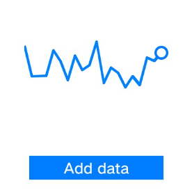

# chart

The **\<chart>** component displays line charts and bar charts.

> **NOTE**
>
> This component is supported since API version 4. Updates will be marked with a superscript to indicate their earliest API version.


## Child Components

Not supported


## Attributes

| Name      | Type                       | Mandatory  | Description                                      |
| -------- | ------------------------- | ---- | ---------------------------------------- |
| type     | string                    | No   | Chart type. Dynamic modification is not supported. Available values include:<br>- **bar**: bar chart<br>- **line**: line chart<br>Default value: **line**|
| options  | ChartOptions              | Yes   | Chart parameters. You can set the minimum value, maximum value, scale, and line width of the x-axis or y-axis, whether to display the x-axis and y-axis, and whether the line is smooth. Dynamic modification is not supported.|
| datasets | Array&lt;ChartDataset&gt; | Yes   | Data sets. You can set multiple datasets and their background colors.    |
| id       | string                    | No   | Unique ID of the component.                                |
| style    | string                    | No   | Style declaration of the component.                                |
| class    | string                    | No   | Style class of the component, which is used to refer to a style table.                         |
| ref      | string                    | No   | Reference information of child elements, which is registered with the parent component on **$refs**.|

  **Table 1** ChartOptions

| Name    | Type         | Mandatory  | Description                                      |
| ------ | ----------- | ---- | ---------------------------------------- |
| xAxis  | ChartAxis   | Yes   | X-axis parameters. You can set the minimum value, maximum value, and scale of the x-axis, and whether to display the x-axis.         |
| yAxis  | ChartAxis   | Yes   | Y-axis parameters. You can set the minimum value, maximum value, and scale of the y-axis, and whether to display the y-axis.         |
| series | ChartSeries | No   | Data series parameters which cover the following:<br>- Line style, such as the line width and whether the line is smooth.<br>- Style and size of the white point at the start of the line.<br>**NOTE**<br>Only line charts support this attribute.|

  **Table 2** ChartDataset

| Name                         | Type                 | Default Value     | Mandatory  | Description                  |
| --------------------------- | ------------------- | -------- | ---- | -------------------- |
| backgroundColor(deprecated) | &lt;color&gt;       | \#ff6384 | No   | Color of a line or bar. This attribute is not recommended.    |
| strokeColor                 | &lt;color&gt;       | \#ff6384 | No   | Line color. Only line charts support this attribute.        |
| fillColor                   | &lt;color&gt;       | \#ff6384 | No   | Fill color. For line charts, the value indicates the gradient color to fill.  |
| data                        | Array&lt;number&gt; | -        | Yes   | Data of the drawn line or bar.        |
| gradient                    | boolean             | false    | No   | Whether to display the gradient color. Only line charts support this attribute.|

  **Table 3** ChartAxis

| Name      | Type           | Default Value     | Mandatory  | Description                                      |
| -------- | ------------- | -------- | ---- | ---------------------------------------- |
| min      | number        | 0        | No   | Minimum value of the axis.<br>Negative numbers are not supported. Only line charts support this attribute.                |
| max      | number        | 100      | No   | Maximum value of the axis.<br>Negative numbers are not supported. Only line charts support this attribute.                |
| axisTick | number        | 10       | No   | Number of scales displayed on the axis.<br>**NOTE**<br>The value ranges from 1 to 20. The display effect depends on the calculation result of Number of pixels occupied by the image width/(**max**-**min**).<br>Lite wearables support integer calculation, and an error may occur in the case of inexhaustible division. Specifically, a segment of space may be left at the end of the x-axis.<br>In the bar chart, the number of bars in each group of data is the same as the number of scales, and the bars are displayed at the scales.|
| display  | boolean       | false    | No   | Whether to display the axis.                                  |
| color    | &lt;color&gt; | \#c0c0c0 | No   | Axis color.                                    |

  **Table 4** ChartSeries

| Name         | Type            | Mandatory  | Description                  |
| ----------- | -------------- | ---- | -------------------- |
| lineStyle   | ChartLineStyle | No   | Line style, such as the line width and whether the line is smooth.     |
| headPoint   | PointStyle     | No   | Style and size of the white point at the start of the line.     |
| topPoint    | PointStyle     | No   | Style and size of the top point.          |
| bottomPoint | PointStyle     | No   | Style and size of the bottom point.          |
| loop        | ChartLoop      | No   | Whether to start drawing again when the screen is looped.|

  **Table 5** ChartLineStyle

| Name    | Type            | Default Value  | Mandatory  | Description   |
| ------ | -------------- | ----- | ---- | ----- |
| width  | &lt;length&gt; | 1px   | No   | Line width.|
| smooth | boolean        | false | No   | Whether the line is smooth.|

  **Table 6** PointStyle

| Name         | Type            | Default Value     | Mandatory  | Description                                |
| ----------- | -------------- | -------- | ---- | ---------------------------------- |
| shape       | string         | circle   | No   | Shape of the highlight point. Available values are as follows:<br>- circle|
| size        | &lt;length&gt; | 5px      | No   | Size of the highlight point.                           |
| strokeWidth | &lt;length&gt; | 1px      | No   | Stroke width.                              |
| strokeColor | &lt;color&gt;  | \#ff0000 | No   | Stroke color.                             |
| fillColor   | &lt;color&gt;  | \#ff0000 | No   | Fill color.                             |
| display     | boolean        | true     | No   | Whether to display the highlight spot.                           |

  **Table 7** ChartLoop

| Name    | Type            | Default Value | Mandatory  | Description                                      |
| ------ | -------------- | ---- | ---- | ---------------------------------------- |
| margin | &lt;length&gt; | 1    | No   | Number of erased points (horizontal distance between the latest drawn point and the earliest point). You are not advised to use **margin** together with **topPoint**, **bottomPoint**, or **headPoint** for mini-, small- and standard-system devices. If you do so, there is a possibility that the point is in the erase area and invisible.|


## Methods

| Methods    | Parameter                                      | Description                                      |
| ------ | ---------------------------------------- | ---------------------------------------- |
| append | {<br>serial: number, // Set the data subscript of the line chart to be updated.<br>data: Array&lt;number&gt;, // Set the new data.<br>} | Dynamically add data to an existing data series. The target series is specified based on **serial**, which is the subscript of the datasets array and starts from 0. **datasets[index].data** is not updated. Only line charts support this attribute. The value is incremented by 1 based on the horizontal coordinate and is related to the **xAxis min/max** setting.|


## Events

| Name                | Parameter                               | Description         |
| ------------------ | --------------------------------- | ----------- |
| click              | -                                 | Triggered when the component is clicked. |
| longpress          | -                                 | Triggered when the component is long pressed. |
| swipe<sup>5+</sup> | [SwipeEvent](js-lite-common-events.md) | Triggered when a user quickly swipes on the component.|


## Styles

| Name                                | Type                                      | Default Value  | Mandatory  | Description                                      |
| ---------------------------------- | ---------------------------------------- | ----- | ---- | ---------------------------------------- |
| width                              | &lt;length&gt; \| &lt;percentage&gt;<sup>5+</sup> | -     | No   | Component width.<br><br>If this attribute is not set, the default value **0** is used.       |
| height                             | &lt;length&gt; \| &lt;percentage&gt;<sup>5+</sup> | -     | No   | Component height.<br><br>If this attribute is not set, the default value **0** is used.       |
| padding                            | &lt;length&gt;                           | 0     | No   | Shorthand attribute to set the padding for all sides.<br>The attribute can have one to four values:<br>- If you set only one value, it specifies the padding for all the four sides.<br>- If you set two values, the first value specifies the top and bottom padding, and the second value specifies the left and right padding.<br>- If you set three values, the first value specifies the top padding, the second value specifies the left and right padding, and the third value specifies the bottom padding.<br>- If you set four values, they respectively specify the padding for top, right, bottom, and left sides (in clockwise order).|
| padding-[left\|top\|right\|bottom] | &lt;length&gt;                           | 0     | No   | Left, top, right, and bottom padding.                         |
| margin                             | &lt;length&gt; \| &lt;percentage&gt;<sup>5+</sup> | 0     | No   | Shorthand attribute to set the margin for all sides. The attribute can have one to four values:<br>- If you set only one value, it specifies the margin for all the four sides.<br>- If you set two values, the first value specifies the top and bottom margins, and the second value specifies the left and right margins.<br>- If you set three values, the first value specifies the top margin, the second value specifies the left and right margins, and the third value specifies the bottom margin.<br>- If you set four values, they respectively specify the margin for top, right, bottom, and left sides (in clockwise order).|
| margin-[left\|top\|right\|bottom]  | &lt;length&gt; \| &lt;percentage&gt;<sup>5+</sup> | 0     | No   | Left, top, right, and bottom margins.                         |
| border-width                       | &lt;length&gt;                           | 0     | No   | Shorthand attribute to set the border width for all sides.                      |
| border-color                       | &lt;color&gt;                            | black | No   | Shorthand attribute to set the color for all borders.                      |
| border-radius                      | &lt;length&gt;                           | -     | No   | Radius of round-corner borders.           |
| background-color                   | &lt;color&gt;                            | -     | No   | Background color.                                 |
| display                            | string                                   | flex  | No   | How and whether to display the box containing an element. Available values are as follows:<br>- **flex**: flexible layout<br>- **none**: not rendered|
| [left\|top]                        | &lt;length&gt; \| &lt;percentage&gt;<sup>6+</sup> | -     | No   | Edge of the element.<br>- **left**: left edge position of the element. This attribute defines the offset between the left edge of the margin area of a positioned element and left edge of its containing block.<br>- **top**: top edge position of the element. This attribute defines the offset between the top edge of a positioned element and that of a block included in the element.|

## Example

1. Line chart

   ```html
   <!-- xxx.hml -->
   <div class="container">
     <chart class="chart" type="line" ref="linechart" options="{{lineOps}}" datasets="{{lineData}}"></chart>
     <input class="button" type="button" value="Add data" onclick="addData"/>
   </div>
   ```


   ```css
   /* xxx.css */
   .container {
     flex-direction: column;
     justify-content: center;
     align-items: center;
     width: 454px;
     height: 454px;
     background-color: white;
   }
   .chart {
     width: 300px;
     height: 300px;
   }
   .button {
     width: 280px;
     border-radius: 0px;
   }
   ```


   ```js
   // xxx.js
   export default {
     data: {
       lineData: [
         {
           strokeColor: '#0081ff',
           fillColor: '#cce5ff',
           data: [763, 550, 551, 554, 731, 654, 525, 696, 595, 628, 791, 505, 613, 575, 475, 553, 491, 680, 657, 716],
           gradient: false,
         }
       ],
       lineOps: {
         xAxis: {
           min: 0,
           max: 20,
           display: false,
         },
         yAxis: {
           min: 0,
           max: 1000,
           display: false,
         },
         series: {
           lineStyle: {
             width: "5px",
             smooth: true,
           },
           headPoint: {
             shape: "circle",
             size: 10,
             strokeWidth: 5,
             fillColor: '#ffffff',
             strokeColor: '#007aff',
             display: true,
           },
           loop: {
             margin: 2,
             gradient: true,
           }
         }
       },
     },
     addData() {
       this.$refs.linechart.append({
         serial: 0,
         data: [Math.floor(Math.random() * 400) + 400]
       })
     }
   }
   ```

   

2. Bar chart

   ```html
   <!-- xxx.hml -->
   <div class="container">
     <chart class="chart" type="bar" id="bar-chart" options="{{barOps}}" datasets="{{barData}}"></chart>
   </div>
   ```


   ```css
   /* xxx.css */
   .container {
     flex-direction: column;
     justify-content: center;
     align-items: center;
     width: 454px;
     height: 454px;
     background-color: white;
   }
   .chart {
     width: 300px;
     height: 300px;
   }
   ```


   ```js
   // xxx.js
   export default {
     data: {
       barData: [
         {
           fillColor: '#f07826',
           data: [763, 550, 551, 554, 731, 654, 525, 696, 595, 628],
         },
         {
           fillColor: '#cce5ff',
           data: [535, 776, 615, 444, 694, 785, 677, 609, 562, 410],
         },
         {
           fillColor: '#ff88bb',
           data: [673, 500, 574, 483, 702, 583, 437, 506, 693, 657],
         },
       ],
       barOps: {
         xAxis: {
           min: 0,
           max: 20,
           display: false,
           axisTick: 10
         },
         yAxis: {
           min: 0,
           max: 1000,
           display: false,
         },
       },
     }
   }
   ```

   
