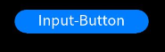
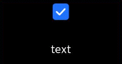
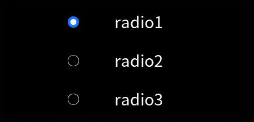

# input

The **\<input>** component provides an interactive interface to receive user input. It can be a radio button, check box, or button.

> **NOTE**
>
> This component is supported since API version 4. Updates will be marked with a superscript to indicate their earliest API version.


## Child Components

Not supported


## Attributes

| Name| Type| Default Value| Mandatory| Description|
| -------- | -------- | -------- | -------- | -------- |
| type | string | <br>button | No| Type of the component, which cannot be dynamically modified. The options are as follows:<br>- **button**: a button that can be clicked.<br>- **checkbox**: a check box.<br>- **radio**: a radio button that allows users to select one from multiple others with the same name. |
| checked | boolean | false | No| Whether the component is selected. This attribute is valid only when **type** is set to **checkbox** or **radio**.|
| name | string | - | No| Name of the component.|
| value | string | - | No| Value of the component. When **type** is **radio**, this attribute is mandatory and the value must be unique for radio buttons with the same name.|
| id | string | - | No| Unique ID of the component.|
| style | string | - | No| Style declaration of the component.|
| class | string | - | No| Style class of the component, which is used to refer to a style table.|
| ref | string | - | No| Reference information of child elements, which is registered with the parent component on **$refs**.|


## Events

- When **type** is set to **checkbox** or **radio**, the following events are supported.
    | Name| Parameter| Description|
  | -------- | -------- | -------- |
  | change | { checked:true \| false } | Triggered when the checked status of the **checkbox** or **radio** button changes.|
  | click | - | Triggered when the component is clicked. |
  | longpress | - | Triggered when the component is long pressed. |
  | swipe<sup>5+</sup> | [SwipeEvent](js-lite-common-events.md) | Triggered when a user quickly swipes on the component. |

- When **type** is set to **button**, the following events are supported.
    | Name| Parameter| Description|
  | -------- | -------- | -------- |
  | click | - | Triggered when the component is clicked. |
  | longpress | - | Triggered when the component is long pressed. |
  | swipe<sup>5+</sup> | [SwipeEvent](js-lite-common-events.md) | Triggered when a user quickly swipes on the component. |


## Styles

| Name| Type| Default Value| Mandatory| Description|
| -------- | -------- | -------- | -------- | -------- |
| color | &lt;color&gt; | \#ffffff | No| Text color of the component.|
| font-size | &lt;length&gt; | 30px | No| Font size of the component.|
| width | &lt;length&gt; | - | No| Width of the component. The default value for a button is **100px**.|
| height | &lt;length&gt; | - | No| Height of the component. The default value for a button is **50px**.|
| font-family | string | SourceHanSansSC-Regular | No| Font. Only the **SourceHanSansSC-Regular** font is supported.|
| padding | &lt;length&gt; | 0 | No| Shorthand attribute to set the padding for all sides.<br>The attribute can have one to four values:<br>- If you set only one value, it specifies the padding for all the four sides.<br>- If you set two values, the first value specifies the top and bottom padding, and the second value specifies the left and right padding.<br>- If you set three values, the first value specifies the top padding, the second value specifies the left and right padding, and the third value specifies the bottom padding.<br>- If you set four values, they respectively specify the padding for top, right, bottom, and left sides (in clockwise order).|
| padding-[left\|top\|right\|bottom] | &lt;length&gt; | 0 | No| Left, top, right, and bottom padding.|
| margin | &lt;length&gt; \| &lt;percentage&gt;<sup>5+</sup> | 0 | No| Shorthand attribute to set the margin for all sides. The attribute can have one to four values:<br>- If you set only one value, it specifies the margin for all the four sides.<br>- If you set two values, the first value specifies the top and bottom margins, and the second value specifies the left and right margins.<br>- If you set three values, the first value specifies the top margin, the second value specifies the left and right margins, and the third value specifies the bottom margin.<br>- If you set four values, they respectively specify the margin for top, right, bottom, and left sides (in clockwise order).|
| margin-[left\|top\|right\|bottom] | &lt;length&gt; \| &lt;percentage&gt;<sup>5+</sup> | 0 | No| Left, top, right, and bottom margins.|
| border-width | &lt;length&gt; | 0 | No| Shorthand attribute to set the margin for all sides.|
| border-color | &lt;color&gt; | black | No| Shorthand attribute to set the color for all borders.|
| border-radius | &lt;length&gt; | - | No| Radius of round-corner borders. |
| background-color | &lt;color&gt; | - | No| Background color.|
| display | string | flex | No| How and whether to display the box containing an element. Available values are as follows:<br>- **flex**: flexible layout<br>- **none**: not rendered|
| [left\|top] | &lt;length&gt; \| &lt;percentage&gt;<sup>6+</sup> | - | No| Edge of the element.<br>- **left**: left edge position of the element. This attribute defines the offset between the left edge of the margin area of a positioned element and left edge of its containing block.<br>- **top**: top edge position of the element. This attribute defines the offset between the top edge of a positioned element and that of a block included in the element. |

## Example

1. Common button

   ```html
   <!-- xxx.hml -->
   <div class="div-button">
     <input class="button" type="button" value="Input-Button"></input>
   </div>
   ```

   ```css
   /* xxx.css */
   .div-button {
     flex-direction: column;
     align-items: center;
     width: 100%;
     height: 100%;
   }
   .button {
     margin-top: 30px;
     width: 280px;
   }
   ```

   

   

2. Check box

   ```html
   <!-- xxx.hml -->
   <div class="content">
     <input onchange="checkboxOnChange" checked="true" type="checkbox"></input>
     <text class="text">{{text}}</text>
   </div>
   ```

   ```css
   /* xxx.css */
   .content{
     width: 100%;
     height: 100%;
     flex-direction: column;
     align-items: center; 
     justify-content: center;   
   }
   .text{
     font-size: 30px;
     text-align: center;
     width: 200px;
     margin-top: 20px;
     height: 100px;
   }
   ```

   ```javascript
   // xxx.js
   export default {
     data: {
       text: "text"
     },
     checkboxOnChange(e) {
       this.text = e.checked;
     }
   }
   ```

   

3. Radio button

   ```html
   <!-- xxx.hml -->
   <div class="container">
     <div class="item">
       <input type="radio" checked="true" name="radioSample" value="radio1" onchange="onRadioChange"></input>
       <text class="text">radio1</text>
     </div>
     <div class="item">
       <input type="radio" checked="false" name="radioSample" value="radio2" onchange="onRadioChange"></input>
       <text class="text">radio2</text>
     </div>
     <div class="item">
       <input type="radio" checked="false" name="radioSample" value="radio3" onchange="onRadioChange"></input>
       <text class="text">radio3</text>
     </div>
   </div>
   ```

   ```css
   /* xxx.css */
   .container {
     width: 100%;
     height: 100%;
     justify-content: center;
     align-items: center;
     flex-direction: column;
   }
   .item {
     width: 50%;
     height: 30%;
     justify-content: center;
   }
   .text {
     margin-top: 25%;
     font-size: 30px;
     text-align: center;
     width: 200px;
     height: 100px;
   }
   ```

   
