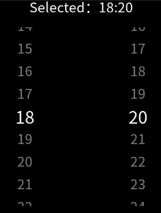

# picker-view

<!--Kit: ArkUI-->
<!--Subsystem: ArkUI-->
<!--Owner: @luoying_ace_admin-->
<!--Designer: @weixin_52725220-->
<!--Tester: @xiong0104-->
<!--Adviser: @Brilliantry_Rui-->
<!-- md-trans-meta sourceCommit=dfb15c325281e5e789ea7ade45dfdd45876606ad translatedAt=2026-07-27T02:26:28.744Z pushedAt=2026-07-27T09:23:36.724Z -->

The **\<picker-view>** component provides the view that shows an embedded scrollable selector on the screen.

> **NOTE**
>
> This component is supported since API version 4. Updates will be marked with a superscript to indicate their earliest API version.

## Child Components

Not supported.

## Attributes

| Name| Type| Default Value| Mandatory| Description|
| -------- | -------- | -------- | -------- | -------- |
| type | string | text | No| Type of the scrollable selector, which cannot be changed dynamically. Available values are as follows:<br>- **text**: text selector.<br>- **time**: time selector.|
| id | string | - | No| Unique ID of the component.|
| style | string | - | No| Style declaration of the component.|
| class | string | - | No| Style class of the component, which is used to refer to a style table.|
| ref | string | - | No| Reference information of child elements, which is registered with the parent component on **$refs**.|

Text selector (**type** is **text**)

| Name| Type| Default Value| Mandatory| Description|
| -------- | -------- | -------- | -------- | -------- |
| range | Array | - | No| Value range of the text selector.<br>Use the data binding mode, for example, range = {{data}}. Declare the corresponding variable **data: ["15", "20", "25"]** in JavaScript.|
| selected | number | 0 | No| Default value of the text selector. The value is the index of **range**.|

Time selector (**type** is **time**)

| Name| Type| Default Value| Mandatory| Description|
| -------- | -------- | -------- | -------- | -------- |
| selected | string | 00:00 | No| Default value of the time selector, in the format of HH:mm.<br>|

## Events

Text selector (**type** is **text**)

| Name| Parameter| Description|
| -------- | -------- | -------- |
| change | {&nbsp;newValue:&nbsp;newValue,&nbsp;newSelected:&nbsp;newSelected&nbsp;} | Triggered when a value is specified for the text selector.|

Time selector (**type** is **time**)

| Name| Parameter| Description|
| -------- | -------- | -------- |
| change | {&nbsp;hour:&nbsp;hour,&nbsp;minute:&nbsp;minute} | Triggered when a value is specified for the time selector.<br>|

## Styles

| Name| Type| Default Value| Mandatory| Description|
| -------- | -------- | -------- | -------- | -------- |
| color | &lt;color&gt; | \#808080<br>| No| Font color of a candidate item.|
| font-size | &lt;length&gt; | 30px<br>| No| Font size of a candidate item. The value is of the length type, in pixels.|
| selected-color | &lt;color&gt; | \#ffffff<br>| No| Font color of the selected item.|
| selected-font-size | &lt;length&gt; | 38px<br>| No| Font size of the selected item. The value is of the length type, in pixels.|
| selected-font-family | string | HYQiHei-65S | No| Font type of the selected item.|
| font-family | string | <br/>HYQiHe-65S | No | Font type of a candidate item. |
| width | &lt;length&gt;&nbsp;\|&nbsp;&lt;percentage&gt;<sup>5+</sup> | - | No| Component width.<br>If this attribute is not set, the default value **0** is used.|
| height | &lt;length&gt;&nbsp;\|&nbsp;&lt;percentage&gt;<sup>5+</sup> | - | No| Component height.<br>If this attribute is not set, the default value **0** is used.|
| padding | &lt;length&gt; | 0 | No| Shorthand attribute to set the padding for all sides.<br>The attribute can have one to four values:<br>- If you set only one value, it specifies the padding for all the four sides.<br>- If you set two values, the first value specifies the top and bottom padding, and the second value specifies the left and right padding.<br>- If you set three values, the first value specifies the top padding, the second value specifies the left and right padding, and the third value specifies the bottom padding.<br>- If you set four values, they respectively specify the padding for top, right, bottom, and left sides (in clockwise order).|
| padding-[left\|top\|right\|bottom] | &lt;length&gt; | 0 | No| Left, top, right, and bottom padding.|
| margin | &lt;length&gt;&nbsp;\|&nbsp;&lt;percentage&gt;<sup>5+</sup> | 0 | No | Shorthand attribute to set the margin for all sides. The attribute can have one to four values:<br/>-&nbsp;If you set only one value, it specifies the margin for all the four sides.<br/>-&nbsp;If you set two values, the first value specifies the top and bottom margins, and the second value specifies the left and right margins.<br/>-&nbsp;If you set three values, the first value specifies the top margin, the second value specifies the left and right margins, and the third value specifies the bottom margin.<br/>-&nbsp;If you set four values, they respectively specify the margin for top, right, bottom, and left sides (in clockwise order). |
| margin-[left\|top\|right\|bottom] | &lt;length&gt;&nbsp;\|&nbsp;&lt;percentage&gt;<sup>5+</sup> | 0 | No| Left, top, right, and bottom margins.|
| border-width | &lt;length&gt; | 0 | No| Shorthand attribute to set the border width for all sides.|
| border-color | &lt;color&gt; | black | No| Shorthand attribute to set the color for all borders.|
| border-radius | &lt;length&gt; | - | No| Radius of round-corner borders.|
| background-color | &lt;color&gt; | - | No| Background color.|
| display | string | flex | No| Whether to display a box containing the element and the layout for its child elements. Available values are as follows:<br>- **flex**: flexible layout<br>- **none**: not rendered|
| [left\|top] | &lt;length&gt;&nbsp;\|&nbsp;&lt;percentage&gt;<sup>6+</sup> | - | No| Edge of the element.<br>- The **left** attribute specifies the left edge position of the element. This attribute defines the offset between the left edge of the margin area of a positioned element and left edge of its containing block.<br>- The **top** attribute specifies the top edge position of the element. This attribute defines the offset between the top edge of a positioned element and that of a block included in the element.|

## Methods

| Name| Parameter| Description|
| -------- | -------- | -------- |
| rotation | {&nbsp;focus:&nbsp;boolean&nbsp;} | Specifies whether to request focus for crown rotation. **focus: true**: acquires focus, allowing users to scroll options by rotating the crown (only works for single-column pickers). **focus: false**: releases focus. Note: This method has effect only for single-column pickers. For multi-column pickers, users must click to acquire focus before rotating the crown.|

## Example

```html
<!-- xxx.hml -->
  <div class="container">
  <text class="title">
    Selected: {{time}}
  </text>
  <picker-view class="time-picker" type="time" columns="2" ref="pickerViewObj" selected="{{defaultTime}}" @change="handleChange"></picker-view>
</div>
```

```css
/* xxx.css */
.container {
  flex-direction: column;
  justify-content: center;
  align-items: center;
  left: 0px;
  top: 0px;
  width: 454px;
  height: 454px;
}
.title {
  font-size: 30px;
  text-align: center;
}
.time-picker {
  width: 500px;
  height: 400px;
  margin-top: 20px;
}
```

```js
/* xxx.js */
export default {
  data: {
    defaultTime: "",
    time: "",
  },
  onInit() {
    this.defaultTime = this.now();
    this.time = this.defaultTime;
  },
  handleChange(data) {
    this.time = this.concat(data.hour, data.minute);
  },
  now() {
    const date = new Date();
    const hours = date.getHours();
    const minutes = date.getMinutes();
    return this.concat(hours, minutes);
  },
  fill(value) {
    return (value > 9 ? "" : "0") + value;
  },
  concat(hours, minutes) {
    return `${this.fill(hours)}:${this.fill(minutes)}`;
  },
  onShow() {
    this.$refs.pickerViewObj.rotation({focus: true})
  },
  onHide() {
    this.$refs.pickerViewObj.rotation({focus: false})
  }
}
```

