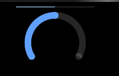

# progress

The **\<Progress>** component is used to provide a progress bar that displays the progress of content loading or an operation.

> **NOTE**
>
> This component is supported since API version 4. Updates will be marked with a superscript to indicate their earliest API version.


## Child Components

Not supported


## Attributes

| Name| Type| Default Value| Mandatory| Description|
| -------- | -------- | -------- | -------- | -------- |
| type | string | horizontal | No| Type of the progress bar, which cannot be changed dynamically. Available values are as follows:<br>- **horizontal**: linear progress bar.<br>- **arc**: arc progress bar.|
| id | string | - | No| Unique ID of the component.|
| style | string | - | No| Style declaration of the component.|
| class | string | - | No| Style class of the component, which is used to refer to a style table.|
| ref | string | - | No| Reference information of child elements, which is registered with the parent component on **$refs**.|

Different types of progress bars support different attributes.

- When **type** is set to **horizontal**, the following attributes are supported.
    | Name| Type| Default Value| Mandatory| Description|
  | -------- | -------- | -------- | -------- | -------- |
  | percent | number | 0 | No| Current progress. The value ranges from 0 to 100.|

- When **type** is set to **arc**, the following attributes are supported.
    | Name| Type| Default Value| Mandatory| Description|
  | -------- | -------- | -------- | -------- | -------- |
  | percent | number | 0 | No| Current progress. The value ranges from 0 to 100.|


## Events

| Name| Parameter| Description|
| -------- | -------- | -------- |
| click | - | Triggered when the component is clicked. |
| longpress | - | Triggered when the component is long pressed. |
| swipe<sup>5+</sup> | [SwipeEvent](js-lite-common-events.md) | Triggered when a user quickly swipes on the component. |


## Styles

- When **type** is set to **horizontal**, the following styles are supported.

  | Name        | Type          | Default Value                                        | Mandatory| Description              |
  | ------------ | -------------- | ---------------------------------------------- | ---- | ------------------ |
  | color        | &lt;color&gt;  | \#6b9ac7                                       | No  | Color of the progress bar.|
  | stroke-width | &lt;length&gt; | 32<sup>1-4 </sup>\| 4<sup>5+</sup>px | No  | Stroke width of the progress bar.|

- When **type** is set to **arc**, the following styles are supported.

  | Name            | Type          | Default Value| Mandatory| Description                                                        |
  | ---------------- | -------------- | ------ | ---- | ------------------------------------------------------------ |
  | color            | &lt;color&gt;  | -      | No  | Color of the arc progress bar.                                          |
  | background-color | &lt;color&gt;  | -      | No  | Background color of the arc progress bar.                                        |
  | stroke-width     | &lt;length&gt; | -      | No  | Width of the arc progress bar.<br>A larger width value means that the progress bar is closer to the center of the circle. The width is always within the radius range.|
  | start-angle      | &lt;deg&gt;    | 240    | No  | Start angle of the arc progress bar, which starts from the direction of zero o'clock. The value ranges from 0 to 360 degrees (clockwise).|
  | total-angle      | &lt;deg&gt;    | 240    | No  | Total length of the arc progress bar. The value ranges from –360 to 360. A negative number indicates anticlockwise.|
  | center-x         | &lt;length&gt; | -      | No  | Center of the arc progress bar (with the upper left corner of this widget as the coordinate origin). This style must be used together with **center-y** and **radius**.|
  | center-y         | &lt;length&gt; | -      | No  | Center of the arc progress bar (with the upper left corner of this widget as the coordinate origin). This style must be used together with **center-x** and **radius**.|
  | radius           | &lt;length&gt; | -      | No  | Radius of the arc progress bar. This style must be used together with **center-x** and **center-y**.        |

In addition to the preceding styles, the following styles are supported.

| Name| Type| Default Value| Mandatory| Description|
| -------- | -------- | -------- | -------- | -------- |
| width | &lt;length&gt; \| &lt;percentage&gt;<sup>5+</sup> | - | No| Component width.<br>If this attribute is not set, the default value **0** is used.|
| height | &lt;length&gt; \| &lt;percentage&gt;<sup>5+</sup> | - | No| Component height.<br>If this attribute is not set, the default value **0** is used.|
| padding | &lt;length&gt; | 0 | No| Shorthand attribute to set the padding for all sides.<br>The attribute can have one to four values:<br>- If you set only one value, it specifies the padding for all the four sides.<br>- If you set two values, the first value specifies the top and bottom padding, and the second value specifies the left and right padding.<br>- If you set three values, the first value specifies the top padding, the second value specifies the left and right padding, and the third value specifies the bottom padding.<br>- If you set four values, they respectively specify the padding for top, right, bottom, and left sides (in clockwise order).|
| padding-[left\|top\|right\|bottom] | &lt;length&gt; | 0 | No| Left, top, right, and bottom padding.|
| margin | &lt;length&gt; \| &lt;percentage&gt;<sup>5+</sup> | 0 | No| Shorthand attribute to set the margin for all sides. The attribute can have one to four values:<br>- If you set only one value, it specifies the margin for all the four sides.<br>- If you set two values, the first value specifies the top and bottom margins, and the second value specifies the left and right margins.<br>- If you set three values, the first value specifies the top margin, the second value specifies the left and right margins, and the third value specifies the bottom margin.<br>- If you set four values, they respectively specify the margin for top, right, bottom, and left sides (in clockwise order).|
| margin-[left\|top\|right\|bottom] | &lt;length&gt; \| &lt;percentage&gt;<sup>5+</sup> | 0 | No| Left, top, right, and bottom margins.|
| border-width | &lt;length&gt; | 0 | No| Shorthand attribute to set the margin for all sides.|
| border-color | &lt;color&gt; | black | No| Shorthand attribute to set the color for all borders.|
| border-radius | &lt;length&gt; | - | No| Radius of round-corner borders.|
| display | string | flex | No| How and whether to display the box containing an element. Available values are as follows:<br>- **flex**: flexible layout<br>- **none**: not rendered|
| [left\|top] | &lt;length&gt; \| &lt;percentage&gt;<sup>6+</sup> | - | No| Edge of the element.<br>- **left**: left edge position of the element. This attribute defines the offset between the left edge of the margin area of a positioned element and left edge of its containing block.<br>- **top**: top edge position of the element. This attribute defines the offset between the top edge of a positioned element and that of a block included in the element. |

## Example

```html
<!-- xxx.hml -->
<div class="container">
  <progress type="horizontal" percent="{{horizontalVal}}" style="height: 10%;width: 40%;" onclick = "changeHorizontal"></progress>
  <progress type="arc" class="min-progress" percent="{{arcVal}}" on:click="changeArc"></progress>
</div>
```

```css
/* xxx.css */
.container {
  flex-direction: column;
  height: 100%;
  width: 100%;
  align-items: center;
}
.min-progress {
  width: 300px;
  height: 300px;
}
```

```javascript
// xxx.js
export default {
  data: {
    arcVal: 0,
    horizontalVal: 0
  },
  changeArc() {
    this.arcVal+= 10;
  },
  changeHorizontal() {
    this.horizontalVal+= 10;
  }
}
```


