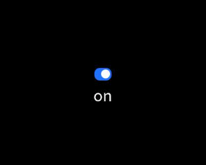

# switch

<!--Kit: ArkUI-->
<!--Subsystem: ArkUI-->
<!--Owner: @houguobiao-->
<!--Designer: @houguobiao-->
<!--Tester: @lxl007-->
<!--Adviser: @Brilliantry_Rui-->
<!-- md-trans-meta sourceCommit=dfb15c325281e5e789ea7ade45dfdd45876606ad translatedAt=2026-07-27T02:26:36.679Z pushedAt=2026-07-27T09:23:36.728Z -->

The **\<switch>** component is used to enable or disable a function.

> **NOTE**
>
> This component is supported since API version 4. Updates will be marked with a superscript to indicate their earliest API version.

## Child Components

Not supported.

## Attributes

| Name| Type| Default Value| Mandatory| Description|
| -------- | -------- | -------- | -------- | -------- |
| checked | boolean | false | No| Whether the component is selected. The value **true** indicates that the component is selected, and **false** indicates the opposite.|
| id | string | - | No| Unique ID of the component.|
| style | string | - | No| Style declaration of the component.|
| class | string | - | No| Style class of the component, which is used to refer to a style table.|
| ref | string | - | No| Reference information of child elements, which is registered with the parent component on **$refs**.|

## Events

| Name| Parameter| Description|
| -------- | -------- | -------- |
| change | {&nbsp;checked:&nbsp;checkedValue&nbsp;} | Triggered when the **checked** state changes.|
| click | - | Triggered when the component is clicked.|
| longpress | - | Triggered when the component is long pressed.|
| swipe<sup>5+</sup> | [SwipeEvent](js-lite-common-events.md#swipeevent) | Triggered when a user quickly swipes on the component. |

## Styles

| Name| Type| Default Value| Mandatory| Description|
| -------- | -------- | -------- | -------- | -------- |
| width | &lt;length&gt;&nbsp;\|&nbsp;&lt;percentage&gt;<sup>5+</sup> | - | No| Component width.<br>If this attribute is not set, the default value **0** is used.|
| height | &lt;length&gt;&nbsp;\|&nbsp;&lt;percentage&gt;<sup>5+</sup> | - | No| Component height.<br>If this attribute is not set, the default value **0** is used.|
| padding | &lt;length&gt; | 0 | No| Shorthand attribute to set the padding for all sides.<br>The attribute can have one to four values:<br>- If you set only one value, it specifies the padding for all the four sides.<br>- If you set two values, the first value specifies the top and bottom padding, and the second value specifies the left and right padding.<br>- If you set three values, the first value specifies the top padding, the second value specifies the left and right padding, and the third value specifies the bottom padding.<br>- If you set four values, they respectively specify the padding for top, right, bottom, and left sides (in clockwise order).|
| padding-[left\|top\|right\|bottom] | &lt;length&gt; | 0 | No| Left, top, right, and bottom padding.|
| margin | &lt;length&gt;&nbsp;\|&nbsp;&lt;percentage&gt;<sup>5+</sup> | 0 | No | Shorthand attribute to set the margin for all sides. The attribute can have one to four values:<br/>-&nbsp;If you set only one value, it specifies the margin for all the four sides.<br/>-&nbsp;If you set two values, the first value specifies the top and bottom margins, and the second value specifies the left and right margins.<br/>-&nbsp;If you set three values, the first value specifies the top margin, the second value specifies the left and right margins, and the third value specifies the bottom margin.<br/>-&nbsp;If you set four values, they respectively specify the margin for top, right, bottom, and left sides (in clockwise order). |
| margin-[left\|top\|right\|bottom] | &lt;length&gt;&nbsp;\|&nbsp;&lt;percentage&gt;<sup>5+</sup> | 0 | No| Left, top, right, and bottom margins.|
| border-width | &lt;length&gt; | 0 | No| Shorthand attribute to set the border width for all sides.|
| border-color | &lt;color&gt; | black | No| Shorthand attribute to set the color for all borders.|
| border-radius | &lt;length&gt; | - | No| Radius of border corners.|
| background-color | &lt;color&gt; | - | No| Background color.|
| display | string | flex | No| Whether to display a box containing the element and the layout for its child elements. Available values are as follows:<br>- **flex**: flexible layout<br>- **none**: not rendered|
| [left\|top] | &lt;length&gt;&nbsp;\|&nbsp;&lt;percentage&gt;<sup>6+</sup> | - | No| Edge of the element.<br>- **left**: left edge position of the element. This attribute defines the offset between the left edge of the margin area of a positioned element and left edge of its containing block.<br>- **top**: top edge position of the element. This attribute defines the offset between the top edge of a positioned element and that of a block included in the element.|

## Example

```html
<!-- xxx.hml -->
<div class="container">
  <div class="box">
    <switch checked="true" @change="switchChange"></switch>
    <text>{{title}}</text>
  </div>
</div>
```

```css
/* xxx.css */
.container {
  width: 100%;
  height: 100%;
  justify-content: center;
  align-items: center;
}
.box{
  width: 18%;
  height: 25%;
  flex-direction:column;
  justify-content: center;
  align-items: center;
}
```

```javascript
// xxx.js
export default {
  data: {
      title: 'on'
  },
  switchChange(e){
      console.info(e.checked);
      if(e.checked){
          this.title="on"
      }else{
          this.title="off"
      }
  }
}
```

