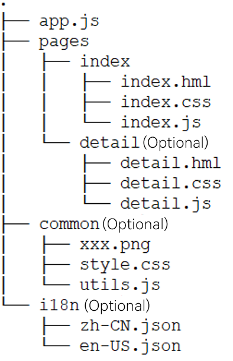

# File Organization

## Directory Structure

The following figure shows the typical directory structure of the JavaScript module (**entry/src/main/js/module**) for an application with feature abilities (FA) using JavaScript APIs.

  **Figure 1** Directory structure 

Functions of the files are as follows:

- **.hml** files describe the page layout.

- **.css** files describe the page style.

- **.js** files process the interactions between pages and users.

Functions of the folders are as follows:

- The **app.js** file manages global JS logics and application lifecycle.
- The **pages** directory stores all component pages.
- The **common** directory stores public resource files, such as media resources and **.js** files.
- The **i18n** folder stores resources in different languages, for example, UI strings and image paths.

>  **NOTE**
>
>  - The **i18n** folder is a reserved one and cannot be renamed.
>
>
>  - The folders marked as optional in the directory structure can be created as needed after you create the project in DevEco Studio.

## File Access Rules

Application resources can be accessed via an absolute or relative path. In this development framework, an absolute path starts with a slash (/), and a relative path starts with **./** or **../**. The rules are as follows:

- To reference a code file, use a relative path, for example, **../common/utils.js**.

- To reference a resource file, use an absolute path, for example: **/common/xxx.png**.

- Store code files and resource files in the **common** directory and access the files in a required fashion.

- In a **.css** file, use the **url()** function to create a URL, for example, **url(/common/xxx.png)**.

>  **NOTE**
>
>  When code file A needs to reference code file B:
>
>  - If code files A and B are in the same directory, you can use either a relative or absolute path in code file B to reference resource files.
>
>  - If code files A and B are in different directories, you must use an absolute path in code file B to reference resource files, because the directory of code file B changes during Webpack packaging.
>

## Media File Formats

  **Table 1** Supported image formats

| Format  | Supported Version                    | File Name Extension|
| ---- | ------------------------ | ------- |
| BMP  | API version 4+ | .bmp    |
| JPEG | API version 4+ | .jpg    |
| PNG  | API version 4+ | .png    |

## Storage Directory

Since API version 5, the [\<image>](js-lite-components-basic-image.md) component supports access to images in the private directory of an application.

| Directory Type  | Prefix           | Access Visibility | Description                         |
| ------ | --------------- | ------ | --------------------------- |
| Private directory of the application| internal://app/ | Current application only| The directory is deleted when the application is uninstalled. Access to the parent directory using **../** is prohibited.|
