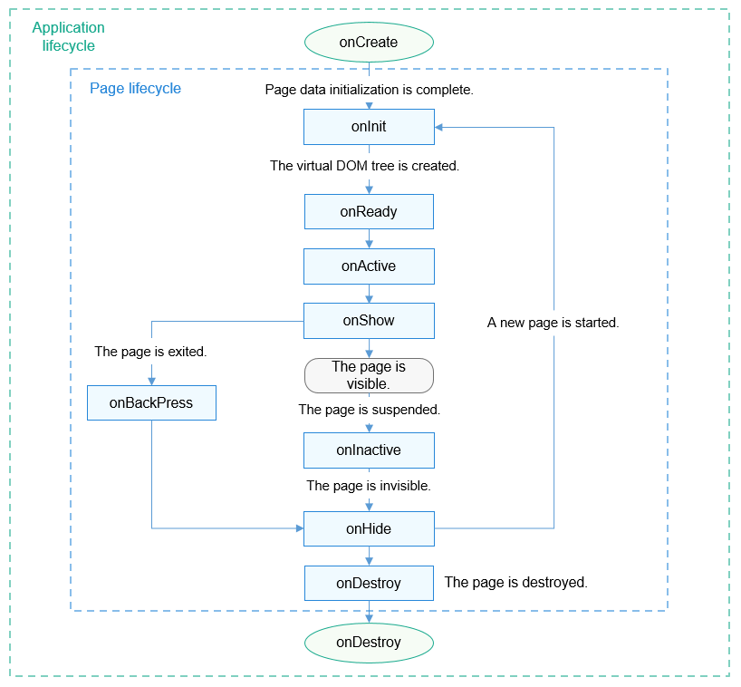

# Lifecycle

<!--Kit: ArkUI-->
<!--Subsystem: ArkUI-->
<!--Owner: @huangxiaolinabc-->
<!--Designer: @fangzhiyuan1-->
<!--Tester: @Giacinta-->
<!--Adviser: @Brilliantry_Rui-->
<!-- md-trans-meta sourceCommit=dfb15c325281e5e789ea7ade45dfdd45876606ad translatedAt=2026-07-27T02:27:31.344Z pushedAt=2026-07-27T09:23:36.747Z -->

The **Lifecycle** module describes state changes of an app or a page from creation, display, and hiding to destruction. Developers can use the app lifecycle and page lifecycle function to handle initialization, page show/hide responses, destruction, and clearing at the corresponding stages. This module is applicable to scenarios such as managing app startup and exit, page switching, and foreground-background state changes, facilitating service logic and resource management by stage.

## Application Lifecycle

You can define the following app lifecycle methods in the **app.js** file.

| Attribute     | Type      | Description    | Called When          |
| --------- | ---------- | -------- | ------------------ |
| onCreate  | () => void | Listens for app creation. | The app is created. |
| onDestroy | () => void | Listens for app uninstallation.| The app exits.|

## Page Lifecycle

You can define the following page lifecycle functions in the **.js** file of the page.

> **NOTE**
>
> To prevent affecting the page switching performance, do not perform complex, time-consuming operations in a lifecycle function.

| Attribute     | Type      | Description        | Called When                              |
| --------- | ---------- | ------------ | -------------------------------------- |
| onInit    | () => void | Listens for page initialization.  | Page initialization is complete. This function is called only once in the page lifecycle.|
| onReady   | () => void | Listens for page creation.| A page is created. This function is called only once in the page lifecycle.      |
| onShow    | () => void | Listens for page display.    | The page is displayed.                      |
| onHide    | () => void | Listens for page hiding.    | The page is hidden.                      |
| onDestroy | () => void | Listens for page destruction.    | The page is destroyed.                      |

The lifecycle functions of page A are called in the following sequence:

- Open page A: **onInit()** -> **onReady()** -> **onShow()**

- Open page B on page A: **onHide()** -> **onDestroy()**

- Go back to page A from page B: **onInit()** -> **onReady()** -> **onShow()**

- Exit page A: **onHide()** -> **onDestroy()**

- Hide page A: **onHide()**

- Show background page A on the foreground: **onShow()**

