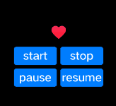

# image-animator

>  **NOTE**
>
>  This component is supported since API version 4. Updates will be marked with a superscript to indicate their earliest API version.

The **\<image-animator>** component is used to provide an image frame animator.


## Child Components

Not supported


## Attributes

In addition to the [universal attributes](js-components-common-attributes.md), the following attributes are supported.

| Name                    | Type                        | Default Value     | Mandatory  | Description                                      |
| ---------------------- | -------------------------- | -------- | ---- | ---------------------------------------- |
| images                 | Array&lt;ImageFrame&gt;    | -        | Yes   | Image frame information. The frame information includes the image path, size, and location. The supported image formats include PNG and JPG.  <br>Set this attribute using data binding.<br>- Reference image resources in the HML file: **images = {{images}}**.<br>- Declare the corresponding variables in the JS file:<br>**images: [{src: "/common/heart-rate01.png",duration:"100"}]** Since API version 6,the duration (in milliseconds) per image frame can be set.|
| predecode<sup>6+</sup> | number                     | 0        | No   | Whether to enable pre-decoding. The default value **0** indicates that pre-decoding is disabled. The value **2** indicates that two images following the currently playing frame will be cached in advance to improve performance.|
| iteration              | number \| string | infinite | No   | Number of times that the frame animation is played. **number** indicates a fixed number of playback operations, and **infinite** indicates an unlimited number of playback operations.|
| reverse                | boolean                    | false    | No   | Playback sequence. The value **false** indicates that images are played from the first one to the last one, and **true** indicates that images are played from the last one to the first one.|
| fixedsize              | boolean                    | true     | No   | Whether the image size is the same as the component size.<br> **true**: The image size is the same as the component size. In this case, the width, height, top, and left attributes of the image are invalid. **false**: The width, height, top, and left attributes of each image must be set separately.|
| duration               | string                     | -        | Yes   | Single video playback duration. The unit can be s (standing for seconds) or ms. The default unit is ms. If the value is **0**, no image is played. The value change takes effect only at the start of the next cycle. If image-specific durations have been set, the settings of this attribute do not take effect. |
| fillmode<sup>5+</sup>  | string                     | forwards | No   | Status of the frame animation after its playback is complete. Available values are as follows:<br>- **none**: Restores to the initial status.<br>- **forwards**: Retains the ending status defined for the last key frame.|

**Table 1** ImageFrame

| Name                   | Type            | Default Value | Mandatory  | Description                    |
| --------------------- | -------------- | ---- | ---- | ---------------------- |
| src                   | &lt;uri&gt;    | -    | Yes   | Image path. The image format can be SVG, PNG, JPG, or HEIF.|
| width                 | &lt;length&gt; | 0    | No   | Image width.                 |
| height                | &lt;length&gt; | 0    | No   | Image height.                 |
| top                   | &lt;length&gt; | 0    | No   | Vertical coordinate of the image relative to the upper left corner of the component.      |
| left                  | &lt;length&gt; | 0    | No   | Horizontal coordinate of the image relative to the upper left corner of the component.      |
| duration<sup>6+</sup> | number         | -    | No   | Playback duration of each image frame, in milliseconds.      |


## Styles

The [universal styles](js-components-common-styles.md) are supported.


## Events

In addition to the [universal events](js-components-common-events.md), the following events are supported.

| Name    | Parameter  | Description       |
| ------ | ---- | --------- |
| start  | -    | Triggered when the frame animation starts.|
| pause  | -    | Triggered when the frame animation pauses.|
| stop   | -    | Triggered when the frame animation stops.|
| resume | -    | Triggered when the frame animation resumes.|


## Methods

In addition to the [universal methods](js-components-common-methods.md), the following methods are supported.

| Name      | Parameter  | Description                                      |
| -------- | ---- | ---------------------------------------- |
| start    | -    | Starts to play the frame animation of an image. If this method is called again, the playback starts from the first frame.              |
| pause    | -    | Pauses the frame animation playback of an image.                              |
| stop     | -    | Stops the frame animation playback of an image.                              |
| resume   | -    | Resumes the frame animation playback of an image.                                |
| getState | -    | Obtains the playback state. Available values are as follows:<br>- playing<br>- paused<br>- stopped|


## Example

```html
<!-- xxx.hml -->
<div class="container">
  <image-animator class="animator" ref="animator" images="{{frames}}" duration="1s" />
  <div class="btn-box">
    <input class="btn" type="button" value="start" @click="handleStart" />
    <input class="btn" type="button" value="stop" @click="handleStop" />
    <input class="btn" type="button" value="pause" @click="handlePause" />
    <input class="btn" type="button" value="resume" @click="handleResume" />
  </div>
</div>
```

```css
/* xxx.css */
.container {
  flex-direction: column;
  justify-content: center;
  align-items: center;
  left: 0px;
  top: 0px;
  width: 454px;
  height: 454px;
}
.animator {
  width: 70px;
  height: 70px;
}
.btn-box {
  width: 264px;
  height: 120px;
  flex-wrap: wrap;
  justify-content: space-around;
  align-items: center;
}
.btn {
  border-radius: 8px;
  width: 120px;
  margin-top: 8px;
}
```

```js
//xxx.js
export default {
  data: {
    frames: [
      {
        src: "/common/assets/heart78.png",
      },
      {
        src: "/common/assets/heart79.png",
      },
      {
        src: "/common/assets/heart80.png",
      },
      {
        src: "/common/assets/heart81.png",
      },
      {
        src: "/common/assets/heart82.png",
      },
      {
        src: "/common/assets/heart83.png",
      },
      {
        src: "/common/assets/heart84.png",
      },
      {
        src: "/common/assets/heart85.png",
      },
      {
        src: "/common/assets/heart86.png",
      },
      {
        src: "/common/assets/heart87.png",
      },
      {
        src: "/common/assets/heart88.png",
      },
      {
        src: "/common/assets/heart89.png",
      },
      {
        src: "/common/assets/heart90.png",
      },
      {
        src: "/common/assets/heart91.png",
      },
      {
        src: "/common/assets/heart92.png",
      },
      {
        src: "/common/assets/heart93.png",
      },
      {
        src: "/common/assets/heart94.png",
      },
      {
        src: "/common/assets/heart95.png",
      },
      {
        src: "/common/assets/heart96.png",
      },
    ],
  },
  handleStart() {
    this.$refs.animator.start();
  },
  handlePause() {
    this.$refs.animator.pause();
  },
  handleResume() {
    this.$refs.animator.resume();
  },
  handleStop() {
    this.$refs.animator.stop();
  },
};
```


