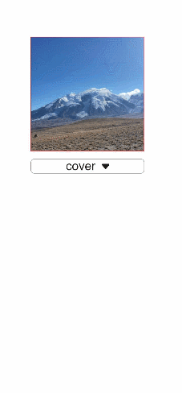

# image

>  **NOTE**
>
>  This component is supported since API version 4. Updates will be marked with a superscript to indicate their earliest API version.

The **\<image>** component is used to render and display images.


## Child Components

Not supported


## Attributes

In addition to the [universal attributes](js-components-common-attributes.md), the following attributes are supported.

| Name  | Type    | Default Value | Mandatory  | Description                                      |
| ---- | ------ | ---- | ---- | ---------------------------------------- |
| src  | string | -    | No   | Image path, which supports local paths. The supported image formats include PNG, JPG, BMP, SVG, and GIF.<br>- The Base64 string<sup>6+</sup> is supported in the following format: data:image/[png \| jpeg \| bmp \| webp];base64, [base64 data], where **[base64 data]** is a Base64 string.<br>- The path prefix of **dataability://** is supported, which allows access to the image path provided by the Data ability.<sup>6+</sup>|
| alt  | string | -    | No   | Alternative information for the image, which is displayed during image loading.                       |


## Styles

In addition to the [universal styles](js-components-common-styles.md), the following styles are supported.

| Name                          | Type     | Default Value         | Mandatory  | Description                                      |
| ---------------------------- | ------- | ------------ | ---- | ---------------------------------------- |
| object-fit                   | string  | cover        | No   | Image scale type. This style is not supported for SVG images. For details about available values, see **object-fit**.|
| match-text-direction         | boolean | false        | No   | Whether image orientation changes with the text direction. This style is not supported for SVG images.                    |
| fit-original-size            | boolean | false        | No   | Whether the **\<image>** component adapts to the image source size when its width and height are not set. If this style is set to **true**, **object-fit** will not take effect. This style is not supported for SVG images.|
| object-position<sup>7+</sup> | string  | 0px 0px | No   | Position of the image in the component.<br>The options are as follows:<br>1. Pixels, in px. For example, **15px 15px** indicates the position to move along the x-axis or y-axis.<br>2. Characters. Optional values are as follows:<br>- **left**: The image is displayed on the left of the component.<<br>- **top**: The image is displayed on the top of the component.<br>- **right**: The image is displayed on the right of the component.<br>- **bottom**: The image is displayed at the bottom of the component.|

**Table 1** object-fit

| Type        | Description                                  |
| ---------- | ------------------------------------ |
| cover      | The image is scaled with its aspect ratio retained for both sides to be greater than or equal to the display boundaries and displayed in the middle.|
| contain    | The image is scaled with the aspect ratio retained for the image to be completely displayed within the display boundaries and displayed in the middle.  |
| fill       | The image is scaled to fill the display area, and its aspect ratio is not retained.           |
| none       | The image is displayed in the middle with its aspect ratio and size retained.                       |
| scale-down | The image is displayed in the middle with its aspect ratio retained. The size is equal to or smaller than the original size.               |

>  **NOTE**
>
>  When using an SVG image, note that:
>
>  - The SVG image will not be drawn if the length or width of the **\<image>** component is infinity.
>
>  - If the image length and width are not specified in the SVG description, the SVG image fills the **\<image>** component area.
>
>  - If the image length and width are specified in the SVG description, the following rules are adopted to decide the final display effect:
>
>  1. If the **\<image>** component is too small to afford the SVG image, the SVG image is cropped and only its upper left part is displayed in the component.
>
>  2. If the **\<image>** component is big enough to afford the SVG image, this SVG image is displayed in the upper left corner of the component.
>
>  - For SVG images, only the following tags are included in the supported list: **svg**, **rect**, **circle**, **ellipse**, **path**, **line**, **polyline**, **polygon**, **animate**, **animateMotion**, and **animateTransform**.


## Events

In addition to the [universal events](js-components-common-events.md), the following events are supported.

| Name      | Parameter                                      | Description                       |
| -------- | ---------------------------------------- | ------------------------- |
| complete | {<br> width: width,<br> height: height<br> } | Triggered when an image is successfully loaded. The loaded image size is returned.|
| error    | {<br> width: width,<br> height: height<br> } | Triggered when an exception occurs during image loading. In this case, the width and height are **0**.  |

## Methods

The [universal methods](js-components-common-methods.md) are supported.


## Example

```html
<!-- xxx.hml -->
<div class="container">
  <image src="common/images/example.png" style="width: 300px; height: 300px; object-fit:{{fit}}; object-position: center center; border: 1px solid red;">
  </image>
  <select class="selects" onchange="change_fit"><option for="{{fits}}" value="{{$item}}">{{$item}}</option></select>
</div>
```

```css
/* xxx.css */
.container {
  justify-content: center;
  align-items: center;
  flex-direction: column;
}
.selects{
  margin-top: 20px;
  width:300px;
  border:1px solid #808080;
  border-radius: 10px;
}
```

```js
// xxx.js
export default {
  data: {
    fit:"cover",
    fits: ["cover", "contain", "fill", "none", "scale-down"],
  },
  change_fit(e) {
    this.fit = e.newValue;
  },
}
```


