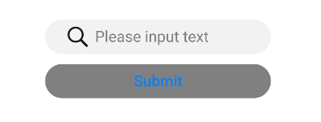
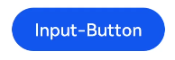
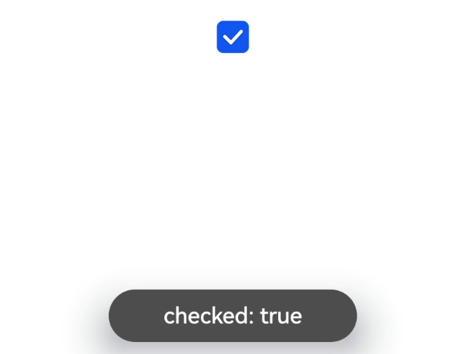

# input

>  **NOTE**
>
>  This component is supported since API version 4. Updates will be marked with a superscript to indicate their earliest API version.

The **\<input>** component provides an interactive interface to receive user input. It can be a radio button, check box, button, single-line text box, and more.

## Required Permissions

None


## Child Components

Not supported


## Attributes

In addition to the [universal attributes](js-components-common-attributes.md), the following attributes are supported.

| Name                              | Type                     | Default Value      | Mandatory  | Description                                      |
| -------------------------------- | ----------------------- | --------- | ---- | ---------------------------------------- |
| type                             | string                  | text<br>| No   | Type of the input component. Available values include **text**, **email**, **date**, **time**, **number**, **password**, **button**, **checkbox**, and **radio**.<br>The **text**, **email**, **date**, **time**, **number**, and **password** types can be dynamically switched and modified.<br>The **button**, **checkbox**, and **radio** types cannot be dynamically modified.  <br>- **button**: a button that can be clicked.<br>- **checkbox**: a check box.<br>- **radio**: a radio button that allows users to select one from multiple others with the same name.<br>- **text**: a single-line text field.<br>- **email**: a field used for an email address.<br>- **date**: date component, including the year, month, and day, but excluding time.<br>- **time**: time component, without the time zone.<br>- **number**: field for entering digits.<br>- **password**: password field, in which characters will be shielded.|
| checked                          | boolean                 | false     | No   | Whether the **\<input>** component is selected. This attribute is valid only when **type** is set to **checkbox** or **radio**.        |
| name                             | string                  | -         | No   | Name of the **\<input>** component.<br>This attribute is mandatory when **type** is set to **radio**.     |
| value                            | string                  | -         | No   | Value of the **\<input>** component. When **type** is **radio**, this attribute is mandatory and the value must be unique for radio buttons with the same name.|
| placeholder                      | string                  | -         | No   | Content of the hint text. This attribute is available only when the component type is set to **text** \|email\|date\|time\|number\|**password**.|
| maxlength                        | number                  | -         | No   | Maximum number of characters that can be entered in the input box. The empty value indicates no limit.          |
| enterkeytype                     | string                  | default   | No   | Type of the **Enter** key on the soft keyboard. The value cannot be dynamically updated.<br>Available values include:<br>- default<br>- next<br>- go<br>- done<br>- send<br>- search<br>Except for the **next** type, clicking the Enter key hides the soft keyboard.|
| headericon                       | string                  | -         | No   | Icon resource path before text input. This icon does not support click events and is unavailable for **button**, **checkbox**, and **radio** types. The supported icon image formats are JPG, PNG, and SVG.|
| showcounter<sup>5+</sup>         | boolean                 | false     | No   | Whether to display the character counter for an input box. This attribute takes effect only when **maxlength** is set.        |
| menuoptions<sup>5+</sup>         | Array&lt;MenuOption&gt; | -         | No   | Menu options displayed after users click the **More** button.                 |
| autofocus<sup>6+</sup>           | boolean                 | false     | No   | Whether to automatically obtain focus.<br>This attribute setting does not take effect on the application home page. You can enable a text box on the home page to automatically obtain focus, by delaying the **focus** method call (for about 100–500 ms) in **onActive**.|
| selectedstart<sup>6+</sup>       | number                  | -1        | No   | Start position for text selection.                          |
| selectedend<sup>6+</sup>         | number                  | -1        | No   | End position for text selection.                          |
| softkeyboardenabled<sup>6+</sup> | boolean                 | true      | No   | Whether to display the soft keyboard during editing.                           |
| showpasswordicon<sup>6+</sup>    | boolean                 | true      | No   | Whether to display the icon at the end of the password text box. This attribute is available only when **type** is set to **password**.        |

**Table 1** MenuOption<sup>5+</sup>

| Name     | Type    | Description         |
| ------- | ------ | ----------- |
| icon    | string | Path of the icon for a menu option.|
| content | string | Text content of a menu option.|


## Styles

In addition to the [universal styles](js-components-common-styles.md), the following styles are supported.

| Name                      | Type                        | Default Value       | Mandatory  | Description                                      |
| ------------------------ | -------------------------- | ---------- | ---- | ---------------------------------------- |
| color                    | &lt;color&gt;              | \#e6000000 | No   | Font color of the single-line text box or button.                         |
| font-size                | &lt;length&gt;             | 16px       | No   | Font size of the single-line text box or button.                         |
| allow-scale              | boolean                    | true       | No   | Whether the font size changes with the system's font size settings.<br>If the **config-changes** tag of **fontSize** is configured for abilities in the **config.json** file, the setting takes effect without application restart.|
| placeholder-color        | &lt;color&gt;              | \#99000000 | No   | Color of the hint text in the single-line text box. This attribute is available only when the component type is set to **text**, **email**, **date**, **time**, **number**, or **password**. |
| font-weight              | number \| string | normal     | No   | Font weight of the single-line text box or button. For details, see **font-weight** of the [**\<text>**](js-components-basic-text.md) component. |
| caret-color<sup>6+</sup> | &lt;color&gt;              | -          | No   | Color of the caret.                              |


## Events

In addition to the [universal events](js-components-common-events.md), the following events are supported.

- When **type** is set to **text**, **email**, **date**, **time**, **number**, or **password**, the following events are supported.

  | Name                       | Parameter                                      | Description                                      |
  | ------------------------- | ---------------------------------------- | ---------------------------------------- |
  | change                    | {<br> value: inputValue<br> }  | Triggered when the content entered in the input box changes. The most recent content entered by the user is returned.<br>If you change the **value** attribute directly, this event will not be triggered.|
  | enterkeyclick             | {<br> value: enterKey<br> }    | Triggered when the **Enter** key on the soft keyboard is clicked. The type of the **Enter** key is returned, which is of the number type. Available values are as follows:<br>- **2**: returned if **enterkeytype** is **go**.<br>- **3**: returned if **enterkeytype** is **search**.<br>- **4**: returned if **enterkeytype** is **send**.<br>- **5**: returned if **enterkeytype** is **next**.<br>- **6**: returned if **enterkeytype** is **default**, **done**, or is not set.|
  | translate<sup>5+</sup>    | {<br> value: selectedText<br> } | Triggered when users click the translate button in the menu displayed after they select a text segment. The selected text content is returned.|
  | share<sup>5+</sup>        | {<br> value: selectedText<br> } | Triggered when users click the share button in the menu displayed after they select a text segment. The selected text content is returned.|
  | search<sup>5+</sup>       | {<br> value: selectedText<br> } | Triggered when users click the search button in the menu displayed after they select a text segment. The selected text content is returned.|
  | optionselect<sup>5+</sup> | {<br> index: optionIndex,<br> value: selectedText<br> } | Triggered when users click a menu option in the menu displayed after they select a text segment. This event is valid only when the **menuoptions** attribute is set. The option index and selected text content are returned.|
  | selectchange<sup>6+</sup> | {<br>start: number,<br>end: number<br> } | Triggered when the text selection changes.                            |

- When **type** is set to **checkbox** or **radio**, the following events are supported.

  | Name    | Parameter                                      | Description                                      |
  | ------ | ---------------------------------------- | ---------------------------------------- |
  | change | {<br> checked:true \| false <br>} | Triggered when the checked status of the **checkbox** or **radio** button changes.|

## Methods

In addition to the [universal methods](js-components-common-methods.md), the following methods are supported.

| Name                 | Parameter                                      | Description                                      |
| ------------------- | ---------------------------------------- | ---------------------------------------- |
| focus               | {<br> focus: true\|false<br> }:<br>If **focus** is not passed, the default value **true** is used. | Obtains or loses focus. When **type** is set to **text**, **email**, **date**, **time**, **number**, or **password**, the input method can be displayed or collapsed. |
| showError           | {<br> error: string <br>}                | Displays the error message. This method is available when **type** is set to **text**, **email**, **date**, **time**, **number**, or **password**. |
| delete<sup>6+</sup> | -                                        | Deletes text based on the current caret position when **type** is set to **text**, **email**, **date**, **time**, **number**, or **password**; deletes the last character and displays the caret if the current input component does not have a caret. |

## Example

1. Single-line text box
   ```html
   <!-- xxx.hml -->
   <div class="content">
     <input id="input" class="input" type="text" value="" maxlength="20" enterkeytype="send"
       headericon="/common/search.svg" placeholder="Please input text" onchange="change"
       onenterkeyclick="enterkeyClick">
     </input>
     <input class="button" type="button" value="Submit" onclick="buttonClick" style="color: blue"></input>
   </div>
   ```

   ```css
   /* xxx.css */
   .content {
     width: 100%;
     flex-direction: column;
     align-items: center;
   }
   .input {
     width: 60%;
     placeholder-color: gray;
   }
   .button {
     width: 60%;
     background-color: gray;
     margin-top: 20px;
    }
   ```
   
   ```js
   // xxx.js
   import promptAction from '@ohos.promptAction'
   export default {
     change(e){
       promptAction.showToast({
         message: "value: " + e.value,
         duration: 3000,
       });
     },
     enterkeyClick(e){
       promptAction.showToast({
         message: "enterkey clicked",
         duration: 3000,
       });
     },
     buttonClick(e){
       this.$element("input").showError({
         error: 'error text'
       });
     },
    }
   ```

   
   
2. Common button
   ```html
   <!-- xxx.hml -->
   <div class="div-button">
     <input class="button" type="button" value="Input-Button"></input>
   </div>
   ```

   ```css
   /* xxx.css */
   .div-button {
     flex-direction: column;
     align-items: center;
   }
   .button {
     margin-top: 30px;
     width: 280px;
   }
   ```

   

3. Check box
   ```html
   <!-- xxx.hml -->
   <div class="content">
     <input onchange="checkboxOnChange" checked="true" type="checkbox"></input>
   </div>
   ```

   ```css
   /* xxx.css */
   .content{
     width: 100%;
     height: 200px;
     align-items: center; 
     justify-content: center;   
   }
   ```

   ```js
   // xxx.js
   import promptAction from '@ohos.promptAction'
   export default {
     checkboxOnChange(e) {
       promptAction.showToast({
         message:'checked: ' + e.checked,
         duration: 3000,
       });
     }
   }
   ```

   

4. Radio button
   ```html
   <!-- xxx.hml -->
   <div class="content">
     <input type="radio" checked='true' name="radioSample" value="radio1" onchange="onRadioChange('radio1')"></input>
     <input type="radio" checked='false' name="radioSample" value="radio2" onchange="onRadioChange('radio2')"></input>
     <input type="radio" checked='false' name="radioSample" value="radio3" onchange="onRadioChange('radio3')"></input>
   </div>
   ```

   ```css
   /* xxx.css */
   .content{
     width: 100%;
     height: 200px;
     justify-content: center;
     align-items: center;
   }
   ```

   ```js
   // xxx.js
   import promptAction from '@ohos.promptAction'
   export default {
     onRadioChange(inputValue, e) {
       if (inputValue === e.value) {
         promptAction.showToast({
           message: 'The chosen radio is ' + e.value,
           duration: 3000,
         });
       }
     }
   }
   ```

   
