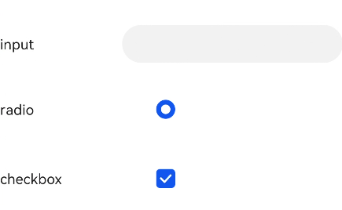

# label

>  **NOTE**
>
>  This component is supported since API version 4. Updates will be marked with a superscript to indicate their earliest API version.

The **\<label>** component defines labels for the **\<input>**, **\<button>**, and **\<textarea>** components. When a label is clicked, the click effect of the component associated with the label will be triggered.

## Required Permissions

None


## Child Components

Not supported


## Attributes

In addition to the [universal attributes](js-components-common-attributes.md), the following attributes are supported.

| Name    | Type    | Default Value | Mandatory  | Description         |
| ------ | ------ | ---- | ---- | ----------- |
| target | string | -    | No   | Attribute ID of the target component.|


## Styles

In addition to the [universal styles](js-components-common-styles.md), the following styles are supported.

| Name               | Type                        | Default Value       | Mandatory  | Description                                      |
| ----------------- | -------------------------- | ---------- | ---- | ---------------------------------------- |
| color             | &lt;color&gt;              | #e5000000  | No   | Font color.                                |
| font-size         | &lt;length&gt;             | 30px       | No   | Font size.                                |
| allow-scale       | boolean                    | true       | No   | Whether the font size changes with the system's font size settings.<br>For details about how to make the configuration take effect dynamically, see the **config-changes** attribute in the **config.json** file.|
| letter-spacing    | &lt;length&gt;             | 0px        | No   | Character spacing (px).                              |
| font-style        | string                     | normal     | No   | Font style. Available values are as follows:<br>- **normal**: standard font style.<br>- **italic**: italic font style.|
| font-weight       | number \| string | normal     | No   | Font weight. For the number type, the value ranges from 100 to 900. The default value is 400. A larger value indicates a heavier font weight.<br>The value of the number type must be an integer multiple of 100.<br>The value of the string type can be **lighter**, **normal**, **bold**, or **bolder**.|
| text-decoration   | string                     | none       | No   | Text decoration. Available values are as follows:<br>- **underline**: An underline is used.<br>- **line-through**: A strikethrough is used.<br>- **none**: The standard text is used.|
| text-align        | string                     | start<br>| No   | Text alignment mode. Available values are as follows:<br>- **left**: The text is left-aligned.<br>- **center**: The text is center-aligned.<br>- **right**: The text is right-aligned.<br>- **start**: The text is aligned with the direction in which the text is written.<br>- **end**: The text is aligned with the opposite direction in which the text is written.<br>If the text width is not specified, the alignment effect may not be obvious when the text width is the same as the width of the parent container.|
| line-height       | &lt;length&gt;             | 0px        | No   | Text line height. When this parameter is set to **0px**, the text line height is not limited and the font size is adaptive.      |
| text-overflow     | string                     | clip       | No   | Takes effect when the maximum number of lines is specified. Available values are as follows:<br>- **clip**: The text is clipped and displayed based on the size of the parent container.<br>- **ellipsis**: The text is displayed based on the size of the parent container. The text that cannot be displayed is replaced with ellipsis. This style must be used together with **max-lines**.|
| font-family       | string                     | sans-serif | No   | Font family, in which fonts are separated by commas (,). Each font is set using a font name or font family name. The first font in the family or the specified [custom font](js-components-common-customizing-font.md) is used for the text.|
| max-lines         | number                     | -          | No   | Maximum number of lines in the text.                              |
| min-font-size     | &lt;length&gt;             | -          | No   | Minimum font size in the text. This style must be used together with **max-font-size**. The font size can be changed dynamically. After the maximum and minimum font sizes are set, **font-size** does not take effect.|
| max-font-size     | &lt;length&gt;             | -          | No   | Maximum font size in the text. This style must be used together with **min-font-size**. The font size can be changed dynamically. After the maximum and minimum font sizes are set, **font-size** does not take effect.|
| font-size-step    | &lt;length&gt;             | 1px        | No   | Step for dynamically adjusting the font size in the text. The minimum and maximum font sizes must be set.           |
| prefer-font-sizes | &lt;array&gt;              | -          | No   | Preset preferred font sizes. For dynamic font size adjustment, the preset sizes are used to match the maximum number of lines in the text. If the preferred font sizes were not set, the font size will be adjusted based on the maximum and minimum font sizes and the step you have set. If the maximum number of lines in the text cannot be met, **text-overflow** is used to truncate the text. If this parameter is set, **font-size**, **max-font-size**, **min-font-size**, and **font-size-step** do not take effect.<br>Example: prefer-font-sizes: 12px,14px,16px|


## Events

Not supported


## Methods

Not supported


## Example

```html
<!--xxx.hml -->
<div class="container">
  <div class="row">
    <label class="label" target="textId">input</label>
    <input class="input" id="textId" type="text"></input>
  </div>
  <div class="row">
    <label class="label" target="radioId">radio</label>
    <input class="input" id="radioId" type="radio" name="group" value="group"></input>
  </div>
  <div class="row">
    <label class="label" target="checkboxId">checkbox</label>
    <input class="input" id="checkboxId" type="checkbox"></input>
  </div>
</div>
```

```css
/*xxx.css */
.container {
  flex-direction: column;
  margin-left: 20px;
}
.row {
  flex-direction: row;
}
.label {
  width: 200px;
  margin-top: 50px;
}
.input {
  margin-left: 100px;
  margin-top: 50px;
}
```


