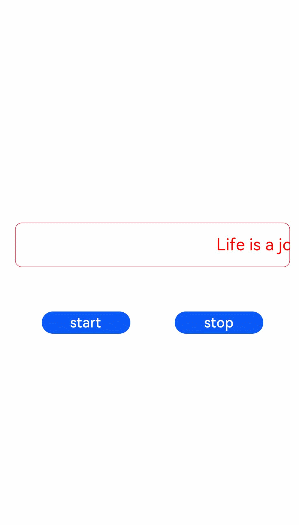

# marquee

>  **NOTE**
>
>  This component is supported since API version 4. Updates will be marked with a superscript to indicate their earliest API version.
>  Since API version 6, the text scrolls only when its width exceeds the width of the **\<marquee>** component.

The **\<marquee>** component is used to display a scrolling piece of text.

## Required Permissions

None


## Child Components

Not supported


## Attributes

In addition to the [universal attributes](js-components-common-attributes.md), the following attributes are supported.

| Name          | Type    | Default Value | Mandatory  | Description                                      |
| ------------ | ------ | ---- | ---- | ---------------------------------------- |
| scrollamount | number | 6    | No   | Maximum length of each scroll.                        |
| loop         | number | -1   | No   | Number of rolling times. If this parameter is not set, the default value **-1** is used. When the value is less than or equal to **0**, the marquee scrolls continuously.|
| direction    | string | left | No   | Direction in which the marquee scrolls, which can be **left** or **right**.            |


## Styles

In addition to the [universal styles](js-components-common-styles.md), the following styles are supported.

| Name         | Type                        | Default Value       | Mandatory  | Description                                      |
| ----------- | -------------------------- | ---------- | ---- | ---------------------------------------- |
| color       | &lt;color&gt;              | \#e5000000 | No   | Font color of the scrolling text.                          |
| font-size   | &lt;length&gt;             | 37.5       | No   | Font size of the scrolling text.                          |
| allow-scale | boolean                    | true       | No   | Whether the font size changes with the system's font size settings.<br>If the **config-changes** tag of **fontSize** is configured for abilities in the **config.json** file, the setting takes effect without application restart.|
| font-weight | number \| string | normal     | No   | Font weight of the scrolling text. For details, see **font-weight** of the **[\<text> component](js-components-basic-text.md#styles)**.|
| font-family | string                     | sans-serif | No   | Font family, in which fonts are separated by commas (,). Each font is set using a font name or font family name. The first font in the family or the specified [custom font](js-components-common-customizing-font.md) is used for the text.|


## Events

In addition to the [universal events](js-components-common-events.md), the following events are supported.

| Name    | Parameter  | Description                                      |
| ------ | ---- | ---------------------------------------- |
| bounce | -    | Triggered when the marquee scrolls to the end.                         |
| finish | -    | Triggered when the marquee finishes the specified number of scrollings (value of the **loop** attribute). It can be triggered only when the **loop** attribute is set to a number greater than 0.|
| start  | -    | Triggered when the marquee starts to scroll.                          |

## Methods

In addition to the [universal methods](js-components-common-methods.md), the following methods are supported.

| Name   | Parameter  | Description   |
| ----- | ---- | ----- |
| start | -    | Starts scrolling.|
| stop  | -    | Stops scrolling.|


## Example

```html
<!-- xxx.hml -->
<div class="tutorial-page">
  <div class="mymarquee">
    <marquee  style="color: {{color1}}" loop="{{loopval}}" scrollamount="{{scroll}}" direction="{{isleft}}" class="marqueetext" 
    id="testmarquee" onfinish="setfinish">
      Life is a journey, not the destination.
    </marquee>
  </div>
  <div style="width: 600px;height: 150px;flex-direction: row;justify-content: space-around;">
    <button onclick="makestart"  value="start"></button>
    <button onclick="makestop" value="stop"></button>
  </div>
</div>
```

```css
/* xxx.css */
.tutorial-page {
  width: 750px;
  height: 100%;
  flex-direction: column;
  align-items: center;
  justify-content: center;
}
.marqueetext {
  font-size: 37px;
}
.mymarquee {
  margin-top: 20px;
  width:100%;
  height: 100px;
  margin-left: 50px;
  margin-right: 50px;
  border: 1px solid #dc0f27;
  border-radius: 15px;
  align-items: center;
}
button{
  width: 200px;
  height: 80px;
  margin-top: 100px;
}
```

```js
// xxx.js
export default {
  private: {
    loopval: 1,
    scroll: 8,
    color1: 'red'
  },
  onInit(){
  },
  setfinish(e) {
    this.loopval=  this.loopval + 1,
    this.r = Math.floor(Math.random()*255),
    this.g = Math.floor(Math.random()*255),
    this.b = Math.floor(Math.random()*255),
    this.color1 = 'rgba('+ this.r +','+ this.g +','+ this.b +',0.8)',
    this.$element('testmarquee').start(),
    this.loopval=  this.loopval - 1
  },
  makestart(e) {
    this.$element('testmarquee').start()
  },
  makestop(e) {
    this.$element('testmarquee').stop()
  }
}
```


