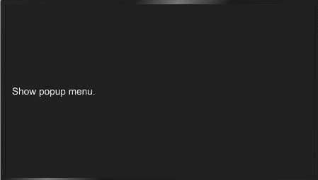

# menu

>  **NOTE**
>
>  This component is supported since API version 4. Updates will be marked with a superscript to indicate their earliest API version.

The **\<menu>** component provides menus as temporary pop-up windows to display operations that can be performed by users.

## Required Permissions

None


## Child Components

Only the **[\<option>](js-components-basic-option.md)** component is supported.


## Attributes

In addition to the [universal attributes](js-components-common-attributes.md), the following attributes are supported.

| Name    | Type    | Default Value  | Mandatory  | Description                                      |
| ------ | ------ | ----- | ---- | ---------------------------------------- |
| target | string | -     | No   | Target element to which the menu is attached. When the target element is clicked, the menu is automatically displayed. The menu is preferentially displayed in the lower right corner of the target element. If the visible space on the right is insufficient, the menu is moved leftward. If the visible space in the lower part is insufficient, the menu is moved upward.|
| type   | string | click | No   | Mode in which the target element triggers the pop-up menu. Available values are as follows:<br>- **click**: The pop-up menu is triggered by clicking the target element.<br>- **longpress**: The pop-up menu is triggered by long pressing the target element.|
| title  | string | -     | No   | Title of the menu.                                 |

>  **NOTE**
>
>  The **focusable** and **disabled** attributes are not supported.


## Styles

The following styles are supported.

| Name            | Type                        | Default Value       | Mandatory  | Description                                      |
| -------------- | -------------------------- | ---------- | ---- | ---------------------------------------- |
| text-color     | &lt;color&gt;              | -          | No   | Font color of the menu.                              |
| font-size      | &lt;length&gt;             | 30px       | No   | Font size of the menu.                              |
| allow-scale    | boolean                    | true       | No   | Whether the font size changes with the system's font size settings.<br>If the **config-changes** tag of **fontSize** is configured for abilities in the **config.json** file, the setting takes effect without application restart.|
| letter-spacing | &lt;length&gt;             | 0          | No   | Character spacing of the menu.                              |
| font-style     | string                     | normal     | No   | Font style of the menu. For details, see **font-weight** of the [**\<text>**](js-components-basic-text.md#styles) component.|
| font-weight    | number \| string           | normal     | No   | Font weight of the menu. For details, see **font-weight** of the [**\<text>**](js-components-basic-text.md#styles) component.|
| font-family    | string                     | sans-serif | No   | Font family, in which fonts are separated by commas (,). Each font is set using a font name or font family name. The first font in the family or the specified [custom font](js-components-common-customizing-font.md) is used for the text.|


## Events

The following events are supported.

| Name      | Parameter                       | Description                                      |
| -------- | ------------------------- | ---------------------------------------- |
| selected | { value:value } | Triggered when a value in the menu is selected. The return value is the **value** attribute of the **\<option>** component.|
| cancel   | -                         | Triggered when an operation is canceled by the user.                                   |


## Methods

The following methods are supported.

| Name  | Parameter                               | Description                                      |
| ---- | --------------------------------- | ---------------------------------------- |
| show | { x:x,  y:y } | Displays the menu. **x** and **y** specify the position of the displayed menu. **x** indicates the x coordinate from the left edge of the visible area, and does not include any scrolling offset. **y** indicates the y coordinate from the upper edge of the visible area, and does not include any scrolling offset or a status bar. The menu is preferentially displayed in the lower right corner of the target element. If the visible space on the right is insufficient, the menu is moved leftward. If the visible space in the lower part is insufficient, the menu is moved upward.|

## Example

```html
<!-- xxx.hml -->
<div class="container">
  <text onclick="onTextClick" class="title-text">Show popup menu.</text>
  <menu id="apiMenu" onselected="onMenuSelected">
    <option value="Item 1">Item 1</option>
    <option value="Item 2">Item 2</option>
    <option value="Item 3">Item 3</option>
  </menu>
</div>
```

```css
/* xxx.css */
.container {
  flex-direction: column;
  align-items: flex-start;
  justify-content: center;
}
.title-text {
  margin: 20px;
}
```

```js
// xxx.js
import promptAction from '@ohos.promptAction';
export default {
  onMenuSelected(e) {
    promptAction.showToast({
      message: e.value
    })
  },
  onTextClick() {
    this.$element("apiMenu").show({x:280,y:120});
  }
}
```


