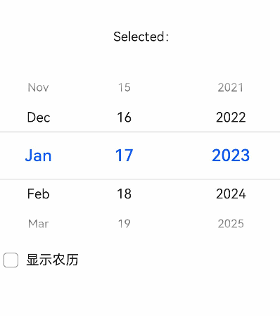
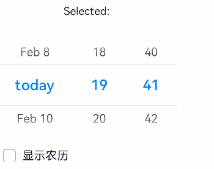
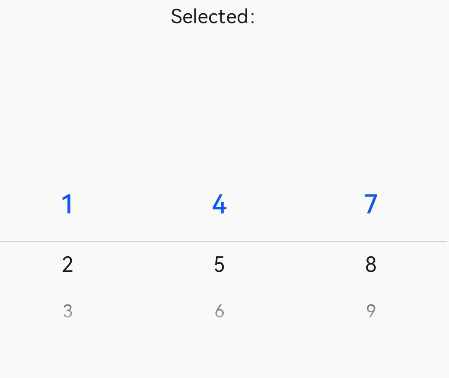

# picker-view

>  **NOTE**
>  This component is supported since API version 4. Updates will be marked with a superscript to indicate their earliest API version.

The **\<picker-view>** component provides the view that shows an embedded scrollable selector on the screen.


## Child Components

Not supported


## Attributes

In addition to the [universal attributes](js-components-common-attributes.md), the following attributes are supported.

| Name  | Type    | Default Value | Mandatory  | Description                                      |
| ---- | ------ | ---- | ---- | ---------------------------------------- |
| type | string | text | No   | Type of the scrollable selector, which cannot be changed dynamically. Available values are as follows:<br>- **text**: text selector.<br>- **time**: time selector.<br>- **date**: date selector.<br>- **datetime**: date and time selector.<br>- **multi-text**: multi-column text selector.|

### Text Selector

| Name             | Type    | Default Value | Mandatory  | Description                                      |
| --------------- | ------ | ---- | ---- | ---------------------------------------- |
| range           | Array  | -    | No   | Value range of the text selector.<br>Use the data binding mode, for example, `range = {{data}}`. Declare the corresponding variable `data: ["15", "20", "25"]` in JavaScript.|
| selected        | string | 0    | No   | Default value of the text selector. The value is the index of **range**.            |
| indicatorprefix | string | -    | No   | Prefix field added when a value is specified for the text selector.                        |
| indicatorsuffix | string | -    | No   | Suffix field added when a value is specified for the text selector.                        |

### Time Selector

| Name           | Type     | Default Value                                | Mandatory  | Description                                      |
| ------------- | ------- | ----------------------------------- | ---- | ---------------------------------------- |
| containsecond | boolean | false                               | No   | Whether seconds are contained.                             |
| selected      | string  | Current time                               | No   | Default value of the time selector, in the format of HH:mm.<br>If seconds are contained, the format is HH:mm:ss.|
| hours         | number  | 24<sup>1-4</sup><br>-<sup>5+</sup> | No   | Time format used by the time selector. Available values are as follows:<br>- **12**: displayed in 12-hour format and distinguished by a.m. and p.m.<br>- **24**: displayed in 24-hour format.<br>Since API version 5, the default value is the most commonly-used hour format in the current locale.|

### Date Selector

| Name                | Type          | Default Value       | Mandatory  | Description                                      |
| ------------------ | ------------ | ---------- | ---- | ---------------------------------------- |
| start              | &lt;time&gt; | 1970-1-1   | No   | Start date of the date selector, in the format of YYYY-MM-DD.       |
| end                | &lt;time&gt; | 2100-12-31 | No   | End date of the date selector, in the format of YYYY-MM-DD.       |
| selected           | string       | Current date      | No   | Default value of the date selector, in the format of YYYY-MM-DD.      |
| lunar<sup>5+</sup> | boolean      | false      | No   | Whether the pop-up window displays the lunar calendar.                     |
| lunarswitch        | boolean      | false      | No   | Whether to display the lunar calendar switch in the date selector. When this switch is displayed, the user can switch between the lunar calendar and Gregorian calendar. Turn on the switch to display the lunar calendar, and turn off the switch to hide the lunar calendar.|

### Date and Time Selector

| Name                | Type     | Default Value                                | Mandatory  | Description                                      |
| ------------------ | ------- | ----------------------------------- | ---- | ---------------------------------------- |
| selected           | string  | Current date and time                             | No   | Default value of the date and time selector. The value can be in the format of MM-DD-HH-mm or YYYY-MM-DD-HH-mm. If the year is not set, the current year is used by default. The value you set is the date selected by default in the pop-up window.|
| hours              | number  | 24<sup>1-4</sup><br>-<sup>5+</sup> | No   | Time format used by the date and time selector. Available values are as follows:<br>- **12**: displayed in 12-hour format and distinguished by a.m. and p.m.<br>- **24**: displayed in 24-hour format.<br>Since API version 5, the default value is the most commonly-used hour format in the current locale.|
| lunar<sup>5+</sup> | boolean | false                               | No   | Whether the pop-up window displays the lunar calendar.                   |
| lunarswitch        | boolean | false                               | No   | Whether to display the lunar calendar switch in the date and time selector. When this switch is displayed, the user can switch between the lunar calendar and Gregorian calendar. Turn on the switch to display the lunar calendar, and turn off the switch to hide the lunar calendar.|

### Multi-Column Text Selector

| Name      | Type     | Default Value      | Mandatory  | Description                                      |
| -------- | ------- | --------- | ---- | ---------------------------------------- |
| columns  | number  | -         | Yes   | Number of columns in the multi-column text selector.                           |
| range    | Two-dimensional array| -         | No   | Items of the multi-column text selector. The value is a two-dimensional array that indicates the number of columns. Each item in the array indicates the data of each column, for example, **[["a", "b"], ["c", "d"]]**.<br>Use the data binding mode, for example, `range = {{data}}`. Declare the corresponding variable `data: ["15", "20", "25"]` in JavaScript.|
| selected | Array   | [0,0,0,…]| No   | Default value of the multi-column text selector, which is an array consisting of the indexes of the selected items in each column.|


## Styles

In addition to the [universal styles](js-components-common-styles.md), the following styles are supported.

| Name                              | Type            | Default Value       | Mandatory  | Description                                      |
| -------------------------------- | -------------- | ---------- | ---- | ---------------------------------------- |
| color                            | &lt;color&gt;  | \#ffffff   | No   | Font color of a candidate item.                                |
| font-size                        | &lt;length&gt; | 16px       | No   | Font size of a candidate item. The value is of the length type, in pixels.                  |
| selected-color                   | &lt;color&gt;  | #ff0a69f7  | No   | Font color of the selected item.                                |
| selected-font-size               | &lt;length&gt; | 20px       | No   | Font size of the selected item. The value is of the length type, in pixels.                  |
| disappear-color<sup>5+</sup>     | &lt;color&gt;  | \#ffffff   | No   | Font color of the items that gradually disappear. Disappearing items are the top option and bottom option of a column containing five options in total.  |
| disappear-font-size<sup>5+</sup> | &lt;length&gt; | 14px       | No   | Font size of the items that gradually disappear. Disappearing items are the top option and bottom option of a column containing five options in total.  |
| font-family                      | string         | sans-serif | No   | Font family of the selector, in which fonts are separated by commas (,). Each font is set using a font name or font family name. The first font in the family or the specified [custom font](js-components-common-customizing-font.md) is used for the text.|


## Events

The following events are supported.

### Text Selector

| Name    | Parameter                                      | Description             |
| ------ | ---------------------------------------- | --------------- |
| change | { newValue: newValue, newSelected: newSelected } | Triggered when a value is specified for the text selector.|

### Time Selector

| Name    | Parameter                                      | Description                             |
| ------ | ---------------------------------------- | ------------------------------- |
| change | { hour: hour, minute: minute, [second:second]} | Triggered when a value is specified for the time selector.<br>If seconds are contained, the value contains hour, minute, and second.|

### Date Selector

| Name    | Parameter                                      | Description             |
| ------ | ---------------------------------------- | --------------- |
| change | { year:year, month:month, day:day } | Triggered when a value is specified for the date selector.|

### Date and Time Selector

| Name    | Parameter                                      | Description               |
| ------ | ---------------------------------------- | ----------------- |
| change | { year:year, month:month, day:day,  hour:hour, minute:minute } | Triggered when a value is specified for the date and time selector.|

### Multi-Column Text Selector

| Name          | Parameter                                      | Description                                      |
| ------------ | ---------------------------------------- | ---------------------------------------- |
| columnchange | { column:column, newValue:newValue, newSelected:newSelected } | Triggered when the value of a column in the multi-column selector changes. <br>**column**: column whose value has changed. <br>**newValue**: selected value. <br>**newSelected**: index of the selected value.|


## Methods

Not supported


## Example
### Text Selector

```html
<!-- xxx.hml -->
<div class="container">
    <text class="title">
        Selected value: {{value}} Selected index: {{index}}
    </text>
    <picker-view class="text-picker" type="text" range="{{options}}" selected="0" indicatorprefix="prefix" indicatorsuffix="suffix" @change="handleChange"></picker-view>
</div>
```

```css
/* xxx.css */
.container {
    flex-direction: column;
    justify-content: center;
    align-items: center;
    width: 100%;
    height: 50%;
}
.title {
    font-size: 30px;
    text-align: center;
    margin-top: 50%;
}
```

```js
/* xxx.js */
export default {
    data: {
        options: ['Option 1','Option 2','Option 3'],
        value: "Option 1",
        index: 0
    },
    handleChange(data) {
        this.value = data.newValue;
        this.index = data.newSelected;
    },
}
```


### Time Selector

```html
<!-- xxx.hml -->
<div class="container">
  <text class="title">
    Selected: {{time}}
  </text>
  <picker-view class="time-picker" type="time" selected="{{defaultTime}}" @change="handleChange"></picker-view>
</div>
```

```css
/* xxx.css */
.container {
    flex-direction: column;
    justify-content: center;
    align-items: center;
    width: 100%;
    height: 50%;
}
.title {
    font-size: 31px;
    text-align: center;
    margin-top: 50%;
}
```

```js
/* xxx.js */
export default {
  data: {
    defaultTime: "",
    time: "",
  },
  onInit() {
    this.defaultTime = this.now();
  },
  handleChange(data) {
    this.time = this.concat(data.hour, data.minute);
  },
  now() {
    const date = new Date();
    const hours = date.getHours();
    const minutes = date.getMinutes();
    return this.concat(hours, minutes);
  },
  fill(value) {
    return (value > 9 ? "" : "0") + value;
  },
  concat(hours, minutes) {
    return `${this.fill(hours)}:${this.fill(minutes)}`;
  },
}
```


### Date Selector

```html
<!-- xxx.hml -->
<div class="container">
    <text class="title">
        Selected: {{date}}
    </text>
    <picker-view class="time-picker" type="date" selected="{{defaultTime}}" @change="handleChange" lunarswitch="true"></picker-view>
</div>
```

```css
/* xxx.css */
.container {
    flex-direction: column;
    justify-content: center;
    align-items: center;
    width: 100%;
    height: 50%;
}
.title {
    font-size: 31px;
    text-align: center;
    margin-top: 50%;
}
```

```js
/* xxx.js */
export default {
    data: {
        date: "",
    },
    handleChange(data) {
        this.date = data.year + "/" + data.month + "/" + data.day + "";
    },
}
```


### Date and Time Selector

```html
<!-- xxx.hml -->
<div class="container">
    <text class="title">
        Selected: {{datetime}}
    </text>
    <picker-view class="date-picker" type="datetime"  hours="24" lunarswitch="true" @change="handleChange"></picker-view>
</div>
```

```css
/* xxx.css */
.container {
    flex-direction: column;
    justify-content: center;
    align-items: center;
    width: 100%;
    height: 50%;
}
.title {
    font-size: 31px;
    text-align: center;
    margin-top: 50%;
}
```

```js
/* xxx.js */
export default {
    data: {
        datetime: "",
    },
    handleChange(data) {
        this.datetime = data.year + "/" + data.month + "/" + data.day + "" + data.hour + ":" + data.minute + "";
    },
}
```


### Multi-Column Text Selector

```html
<!-- xxx.hml -->
<div class="container">
    <text class="title">
        Selected: {{ value }}
    </text>
    <picker-view class="multitype-picker" type="multi-text" columns="3" range="{{ multitext }}" @columnchange="handleChange"></picker-view>
</div>
```

```css
/* xxx.css */
.container {
    flex-direction: column;
    justify-content: center;
    align-items: center;
    width: 100%;
    height: 50%;
}
.title {
    font-size: 31px;
    text-align: center;
    margin-top: 50%;
}
```

```js
/* xxx.js */
export default {
    data: {
        multitext: [
            [1, 2, 3],
            [4, 5, 6],
            [7, 8, 9],
        ],
        value: ""
    },
    handleChange(data) {
        this.value = "Column: " + data.column + "," + "Value: " + data.newValue + ", Index:" + data.newSelected;
    },
}
```

