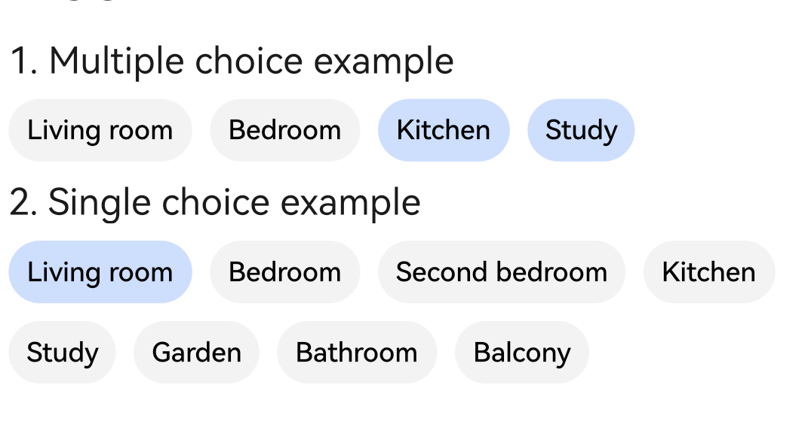

# toggle

>  **NOTE**
>
>  This component is supported since API version 5. Updates will be marked with a superscript to indicate their earliest API version.

The **\<toggle>** component allows your user to select from a group of options and may display the selection result in real time. Generally, the option group consists of many toggles.


## Required Permissions

None


## Child Components

Not supported


## Attributes

In addition to the [universal attributes](js-components-common-attributes.md), the following attributes are supported.

| Name     | Type     | Default Value  | Mandatory  | Description        |
| ------- | ------- | ----- | ---- | ---------- |
| value   | string  | -     | Yes   | Text value of the toggle. |
| checked | boolean | false | No   | Whether the toggle is selected.|


## Styles

In addition to the [universal styles](js-components-common-styles.md), the following styles are supported.

| Name         | Type                        | Default Value       | Mandatory  | Description                                      |
| ----------- | -------------------------- | ---------- | ---- | ---------------------------------------- |
| text-color  | &lt;color&gt;              | \#E5000000 | No   | Text color of the toggle.                              |
| font-size   | &lt;length&gt;             | 16px       | No   | Font size of the toggle.                              |
| allow-scale | boolean                    | true       | No   | Whether the font size changes with the system's font size settings.<br>If the **config-changes** tag of **fontSize** is configured for abilities in the **config.json** file, the setting takes effect without application restart.|
| font-style  | string                     | normal     | No   | Font style of the toggle.                              |
| font-weight | number \| string | normal     | No   | Font weight of the toggle. For details, see **font-weight** of the [**\<text>**](js-components-basic-text.md#styles) component.|
| font-family | &lt;string&gt;             | sans-serif | No   | Font family, in which fonts are separated by commas (,). Each font is set using a font name or font family name. The first font in the family or the specified [custom font](js-components-common-customizing-font.md) is used for the text.|


## Events

In addition to the [universal events](js-components-common-events.md), the following events are supported.

| Name    | Parameter                             | Description            |
| ------ | ------------------------------- | -------------- |
| change | { checked: isChecked } | Triggered when the toggle is selected or unselected.|


## Methods

The [universal methods](js-components-common-methods.md) are supported.


## Example

```html
<!-- xxx.hml -->
<div style="flex-direction: column;">
  <text class="margin">1. Multiple choice example</text>
  <div style="flex-wrap: wrap">
    <toggle class="margin" for="{{toggles}}">{{$item}}</toggle>
  </div>
  <text class="margin">2. Single choice example</text>
  <div style="flex-wrap: wrap">
    <toggle class="margin" for="{{toggle_list}}" id="{{$item.id}}" checked="{{$item.checked}}" 
      value="{{$item.name}}" @change="allchange" @click="allclick({{$item.id}})"></toggle>
  </div>
</div>
```

```css
/* xxx.css */
.margin {
  margin: 7px;
}
```

```js
// xxx.js
export default {
    data: {
        toggle_list: [
            {
                "id": "1001", "name": "Living room", "checked": true
            },
            {
                "id": "1002", "name": "Bedroom", "checked": false
            },
            {
                "id": "1003", "name": "Second bedroom", "checked": false
            },
            {
                "id": "1004", "name": "Kitchen", "checked": false
            },
            {
                "id": "1005", "name": "Study", "checked": false
            },
            {
                "id": "1006", "name": "Garden", "checked": false
            },
            {
                "id": "1007", "name": "Bathroom", "checked": false
            },
            {
                "id": "1008", "name": "Balcony", "checked": false
            },
        ],
        toggles: ["Living room", "Bedroom", "Kitchen", "Study"],
        idx: ""
    },
    allclick(arg) {
        this.idx = arg;
    },
    allchange(e) {
        if (e.checked != true) {
            return;
        }
        for (var i = 0; i < this.toggle_list.length; i++) {
            if (this.toggle_list[i].id === this.idx) {
                this.toggle_list[i].checked = true;
            } else {
                this.toggle_list[i].checked = false;
            }
        }
    }
}
```


