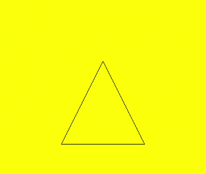
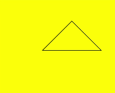
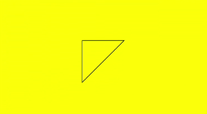
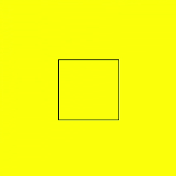
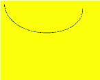
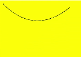
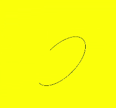

# Path2D

>  **NOTE**
>
>  This component is supported since API version 6. Updates will be marked with a superscript to indicate their earliest API version.

**Path2D** allows you to describe a path through an existing path. This path can be drawn through the **stroke** API of **Canvas**.


## addPath

addPath(path: Object): void

Adds a path to this path.

**Parameters**

| Name  | Type    | Description            |
| ---- | ------ | -------------- |
| path | Object | Path to be added to this path.|

**Example**

  ```html
<!-- xxx.hml -->
<div>
    <canvas ref="canvas" style="width: 500px; height: 500px; background-color: #ffff00;"></canvas>
</div>
  ```

  ```js
// xxx.js
export default {
    onShow() {
        const el = this.$refs.canvas;
        const ctx = el.getContext('2d');
        var path1 = ctx.createPath2D("M250 150 L150 350 L350 350 Z");
        var path2 = ctx.createPath2D();
        path2.addPath(path1);
        ctx.stroke(path2);
    }
}
  ```

  

## setTransform

setTransform(scaleX: number, skewX: number, skewY: number, scaleY: number, translateX: number, translateY: number): void

Sets the path transformation matrix.

**Parameters**

| Name        | Type    | Description     |
| ---------- | ------ | ------- |
| scaleX     | number | Scale ratio of the x-axis.|
| skewX      | number | Skew angle of the x-axis.|
| skewY      | number | Skew angle of the y-axis.|
| scaleY     | number | Scale ratio of the y-axis.|
| translateX | number | Translation distance along the x-axis.|
| translateY | number | Translation distance along the y-axis.|

**Example** 

  ```html
<!-- xxx.hml -->
<div>
    <canvas ref="canvas" style="width: 300px; height: 250px; background-color: #ffff00;"></canvas>
</div>
  ```

  ```js
// xxx.js
export default {
    onShow() {
        const el = this.$refs.canvas;
        const ctx = el.getContext('2d');
        var path = ctx.createPath2D("M250 150 L150 350 L350 350 Z");
        path.setTransform(0.8, 0, 0, 0.4, 0, 0);
        ctx.stroke(path);
    }
}
  ```

  


## closePath

closePath(): void

Moves the current point of the path back to the start point of the path, and draws a straight line between the current point and the start point. If the shape has already been closed or has only one point, this method does nothing.

**Example** 

  ```html
<!-- xxx.hml -->
<div>
    <canvas ref="canvas" style="width: 500px; height: 500px; background-color: #ffff00;"></canvas>
</div>
  ```

  ```js
// xxx.js
export default {
    onShow() {
        const el = this.$refs.canvas;
        const ctx = el.getContext('2d');
        var path = ctx.createPath2D();
        path.moveTo(200, 100);
        path.lineTo(300, 100);
        path.lineTo(200, 200);
        path.closePath();
        ctx.stroke(path);
    }
}
  ```

  


## moveTo

moveTo(x: number, y: number): void

Moves the current coordinate point of the path to the target point, without drawing a line during the movement.

**Parameters**

| Parameter  | Type    | Description     |
| ---- | ------ | ------- |
| x    | number | X-coordinate of the target point.|
| y    | number | Y-coordinate of the target point.|

**Example** 

  ```html
<!-- xxx.hml -->
<div>
    <canvas ref="canvas" style="width: 300px; height: 250px; background-color: #ffff00;"></canvas>
</div>
  ```

  ```js
// xxx.js
export default {
    onShow() {
        const el = this.$refs.canvas;
        const ctx = el.getContext('2d');
        var path = ctx.createPath2D();
        path.moveTo(50, 100);
        path.lineTo(250, 100);
        path.lineTo(150, 200);
        path.closePath();
        ctx.stroke(path);
    }
}
  ```

  


## lineTo

lineTo(x: number, y: number): void

Draws a straight line from the current point to the target point.

**Parameters**

| Name  | Type    | Description     |
| ---- | ------ | ------- |
| x    | number | X-coordinate of the target point.|
| y    | number | Y-coordinate of the target point.|

**Example**

  ```html
<!-- xxx.hml -->
<div>
    <canvas ref="canvas" style="width: 400px; height: 450px; background-color: #ffff00;"></canvas>
</div>
  ```

  ```js
// xxx.js
export default {
    onShow() {
        const el = this.$refs.canvas;
        const ctx = el.getContext('2d');
        var path = ctx.createPath2D();
        path.moveTo(100, 100);
        path.lineTo(100, 200);
        path.lineTo(200, 200);
        path.lineTo(200, 100);
        path.closePath();
        ctx.stroke(path);
    }
}
  ```

  


## bezierCurveTo

bezierCurveTo(cp1x: number, cp1y: number, cp2x: number, cp2y: number, x: number, y: number): void

Draws a cubic bezier curve on the canvas.

**Parameters**

| Name  | Type    | Description            |
| ---- | ------ | -------------- |
| cp1x | number | X-coordinate of the first parameter of the bezier curve.|
| cp1y | number | Y-coordinate of the first parameter of the bezier curve.|
| cp2x | number | X-coordinate of the second parameter of the bezier curve.|
| cp2y | number | Y-coordinate of the second parameter of the bezier curve.|
| x    | number | X-coordinate of the end point on the bezier curve.   |
| y    | number | Y-coordinate of the end point on the bezier curve.   |

**Example** 

  ```html
<!-- xxx.hml -->
<div>
    <canvas ref="canvas" style="width: 300px; height: 250px; background-color: #ffff00;"></canvas>
</div>
  ```

  ```js
// xxx.js
export default {
    onShow() {
        const el = this.$refs.canvas;
        const ctx = el.getContext('2d');
        var path = ctx.createPath2D();
        path.moveTo(10, 10);
        path.bezierCurveTo(20, 100, 200, 100, 200, 20);
        ctx.stroke(path);
    }
}
  ```

  


## quadraticCurveTo

quadraticCurveTo(cpx: number, cpy: number, x: number, y: number): void

Draws a quadratic curve on the canvas.

**Parameters** 

| Name  | Type    | Description         |
| ---- | ------ | ----------- |
| cpx  | number | X-coordinate of the bezier curve parameter.|
| cpy  | number | Y-coordinate of the bezier curve parameter.|
| x    | number | X-coordinate of the end point on the bezier curve.|
| y    | number | Y-coordinate of the end point on the bezier curve.|

**Example**

  ```html
<!-- xxx.hml -->
<div>
    <canvas ref="canvas" style="width: 300px; height: 250px; background-color: #ffff00;"></canvas>
</div>
  ```

  ```js
// xxx.js
export default {
    onShow() {
        const el = this.$refs.canvas;
        const ctx = el.getContext('2d');
        var path = ctx.createPath2D();
        path.moveTo(10, 10);
        path.quadraticCurveTo(100, 100, 200, 20);
        ctx.stroke(path);
    }
}
  ```

  


## arc

arc(x: number, y: number, radius: number, startAngle: number, endAngle: number, anticlockwise: number): void

Draws an arc on the canvas.

**Parameters** 

| Name           | Type     | Description        |
| ------------- | ------- | ---------- |
| x             | number  | X-coordinate of the center point of the arc.|
| y             | number  | Y-coordinate of the center point of the arc.|
| radius        | number  | Radius of the arc.   |
| startAngle    | number  | Start radian of the arc.  |
| endAngle      | number  | End radian of the arc.  |
| anticlockwise | boolean | Whether to draw the arc counterclockwise.|

**Example** 

  ```html
<!-- xxx.hml -->
<div>
    <canvas ref="canvas" style="width: 300px; height: 250px; background-color: #ffff00;"></canvas>
</div>
  ```

  ```js
// xxx.js
export default {
    onShow() {
        const el = this.$refs.canvas;
        const ctx = el.getContext('2d');
        var path = ctx.createPath2D();
        path.arc(100, 75, 50, 0, 6.28);
        ctx.stroke(path);
    }
}
  ```

  


## arcTo

arcTo(x1: number, y1: number, x2: number, y2: number, radius: number): void

Draws an arc based on the radius and points on the arc.

**Parameters**

| Parameter    | Type    | Description             |
| ------ | ------ | --------------- |
| x1     | number | X-coordinate of the first point on the arc.|
| y1     | number | Y-coordinate of the first point on the arc.|
| x2     | number | X-coordinate of the second point on the arc.|
| y2     | number | Y-coordinate of the second point on the arc.|
| radius | number | Radius of the arc.       |

**Example** 

  ```html
<!-- xxx.hml -->
<div>
    <canvas ref="canvas" style="width: 300px; height: 250px; background-color: #ffff00;"></canvas>
</div>
  ```

  ```js
// xxx.js
export default {
    onShow() {
        const el = this.$refs.canvas;
        const ctx = el.getContext('2d');
        var path = ctx.createPath2D();
        path.arcTo(150, 20, 150, 70, 50);
        ctx.stroke(path);
    }
}
  ```

  


## ellipse

ellipse(x: number, y: number, radiusX: number, radiusY: number, rotation: number, startAngle: number, endAngle: number, anticlockwise: number): void

Draws an ellipse in the specified rectangular region on the canvas.

**Parameters**

| Name           | Type    | Description                                  |
| ------------- | ------ | ------------------------------------ |
| x             | number | X-coordinate of the ellipse center.                          |
| y             | number | Y-coordinate of the ellipse center.                          |
| radiusX       | number | Ellipse radius on the x-axis.                          |
| radiusY       | number | Ellipse radius on the y-axis.                          |
| rotation      | number | Rotation angle of the ellipse, in radians.                      |
| startAngle    | number | Angle of the start point for drawing the ellipse, in radians.                   |
| endAngle      | number | Angle of the end point for drawing the ellipse, in radians.                   |
| anticlockwise | number | Whether to draw the ellipse counterclockwise. The value **0** means clockwise, and **1** means counterclockwise. This parameter is optional. The default value is **0**.|

**Example** 

  ```html
<!-- xxx.hml -->
<div>
    <canvas ref="canvas" style="width: 500px; height: 450px; background-color: #ffff00;"></canvas>
</div>
  ```

  ```js
// xxx.js
export default {
    onShow() {
        const el = this.$refs.canvas;
        const ctx = el.getContext('2d');
        var path = ctx.createPath2D();
        path.ellipse(200, 200, 50, 100, Math.PI * 0.25, Math.PI * 0.5, Math.PI, 1);
        ctx.stroke(path);
    }
}
  ```

  


## rect

rect(x: number, y: number, width: number, height: number): void

Creates a rectangle on the canvas.

**Parameters**

| Name    | Type    | Description           |
| ------ | ------ | ------------- |
| x      | number | X-coordinate of the upper left corner of the rectangle.|
| y      | number | Y-coordinate of the upper left corner of the rectangle.|
| width  | number | Width of the rectangle.     |
| height | number | Height of the rectangle.     |

**Example** 

  ```html
<!-- xxx.hml -->
<div>
    <canvas ref="canvas" style="width: 500px; height: 450px; background-color: #ffff00;"></canvas>
</div>
  ```

  ```js
// xxx.js
export default {
    onShow() {
        const el = this.$refs.canvas;
        const ctx = el.getContext('2d');
        var path = ctx.createPath2D();
        path.rect(20, 20, 100, 100);
        ctx.stroke(path);
    }
}
  ```

  
