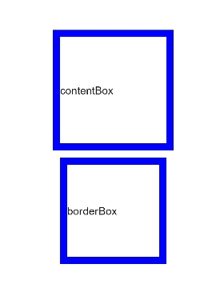

# Universal Styles

>  **NOTE**
>
>  Universal styles are supported since API version 4. Updates will be marked with a superscript to indicate their earliest API version.

You can set universal styles for components in the **style** attribute or **.css** files.


| Name                                      | Type                                      | Default Value         | Description                                      |
| ---------------------------------------- | ---------------------------------------- | ------------ | ---------------------------------------- |
| width                                    | &lt;length&gt; \| &lt;percentage&gt; | -            | Component width.<br>If this attribute is not set, the width required for the element content is used.   |
| height                                   | &lt;length&gt; \| &lt;percentage&gt; | -            | Component height.<br>If this attribute is not set, the height required for the element content is used.   |
| min-width<sup>5+</sup>                   | &lt;length&gt; \| &lt;percentage&gt;<sup>6+</sup> | 0            | Minimum component width.                              |
| min-height<sup>5+</sup>                  | &lt;length&gt; \| &lt;percentage&gt;<sup>6+</sup> | 0            | Minimum component height.                              |
| max-width<sup>5+</sup>                   | &lt;length&gt; \| &lt;percentage&gt;<sup>6+</sup> | -            | Maximum component width, which has no restriction by default.                        |
| max-height<sup>5+</sup>                  | &lt;length&gt; \| &lt;percentage&gt;<sup>6+</sup> | -            | Maximum component height, which has no restriction by default.                        |
| padding                                  | &lt;length&gt; \| &lt;percentage&gt;<sup>5+</sup> | 0            | Shorthand attribute to set the padding for all sides in a declaration.<br>The attribute can have one to four values:<br>- If you set only one value, it specifies the padding for all the four sides.<br>- If you set two values, the first value specifies the top and bottom padding, and the second value specifies the left and right padding.<br>- If you set three values, the first value specifies the top padding, the second value specifies the left and right padding, and the third value specifies the bottom padding.<br>- If you set four values, they respectively specify the padding for top, right, bottom, and left sides (in clockwise order).|
| padding-[left\|top\|right\|bottom]       | &lt;length&gt; \| &lt;percentage&gt;<sup>5+</sup> | 0            | Left, top, right, and bottom padding.                         |
| padding-[start\|end]                     | &lt;length&gt; \| &lt;percentage&gt;<sup>5+</sup> | 0            | Start and end padding.                           |
| margin                                   | &lt;length&gt; \| &lt;percentage&gt;<sup>5+</sup> | 0            | Shorthand attribute to set the margin for all sides in a declaration. The attribute can have one to four values:<br>- If you set only one value, it specifies the margin for all the four sides.<br>- If you set two values, the first value specifies the top and bottom margins, and the second value specifies the left and right margins.<br>- If you set three values, the first value specifies the top margin, the second value specifies the left and right margins, and the third value specifies the bottom margin.<br>- If you set four values, they respectively specify the margin for top, right, bottom, and left sides (in clockwise order).|
| margin-[left\|top\|right\|bottom]        | &lt;length&gt; \| &lt;percentage&gt;<sup>5+</sup> | 0            | Left, top, right, and bottom margins.                         |
| margin-[start\|end]                      | &lt;length&gt; \| &lt;percentage&gt;<sup>5+</sup> | 0            | Start and end margins.                           |
| border                                   | -                                        | 0            | Shorthand attribute to set all borders. Set **border-width**, **border-style**, and **border-color** in sequence. Default values are used for attributes that are not set.|
| border-style                             | string                                   | solid        | Shorthand attribute to set the style for all borders. Available values are as follows:<br>- **dotted**: dotted border. The radius of a dot is half of **border-width**.<br>- **dashed**: dashed border.<br>- **solid**: solid border.|
| border-[left\|top\|right\|bottom]-style  | string                                   | solid        | Styles of the left, top, right, and bottom borders. The available values are **dotted**, **dashed**, and **solid**.|
| border-[left\|top\|right\|bottom]        | -                                        | -            | Shorthand attribute to set the borders for every side respectively. Set **border-width**, **border-style**, and **border-color** in sequence. Default values are used for attributes that are not set.|
| border-width                             | &lt;length&gt;                           | 0            | Shorthand attribute to set the width for all borders, or separately set the width for each border.        |
| border-[left\|top\|right\|bottom]-width  | &lt;length&gt;                           | 0            | Attribute to set widths of left, top, right, and bottom borders.                     |
| border-color                             | &lt;color&gt;                            | black        | Shorthand attribute to set the color for all borders, or separately set the color for each border.        |
| border-[left\|top\|right\|bottom]-color  | &lt;color&gt;                            | black        | Attribute to set colors for left, top, right, and bottom borders.                     |
| border-radius                            | &lt;length&gt;                           | -            | Attribute to set the radius for round borders of an element. This attribute cannot be used to set the width, color, or style of a specific border. To set the width or color, you need to set **border-width**, **border-color**, or **border-style** for all the borders at the same time.<br>In the four-value syntax, the values apply to lower-left corner, lower-right corner, upper-left corner, and upper-right corner, respectively.|
| border-[top\|bottom]-[left\|right]-radius | &lt;length&gt;                           | -            | Attribute to respectively set the radii of upper-left, upper-right, lower-right, and lower-left rounded corners                |
| background                               | &lt;linear-gradient&gt;                  | -            | Background. This attribute supports [gradient styles](js-components-common-gradient.md) only and is not compatible with **background-color** or **background-image**.|
| background-color                         | &lt;color&gt;                            | -            | Background color.                                 |
| background-image                         | string                                   | -            | Background image. Both online and local image resources are supported. Currently, this attribute is not compatible with **background-color** or **background**.<br>Example:<br>- background-image: url("/common/background.png")<br>The SVG format is not supported.|
| background-size                          | - string<br>- &lt;length&gt; &lt;length&gt;<br>- &lt;percentage&gt; &lt;percentage&gt; | auto         | Background image size.<br>- The available values of the **string** type are as follows:<br>  - **contain**: extends the image to the maximum size so that its height and width are fully applicable to the content area.<br>  - **cover**: extends the background image to a large enough size so that it completely covers the background area. Some parts of the image may not be displayed in the background area.<br>  - **auto**: retains the original aspect ratio of the image.<br>- Values of the **\<length>** type:<br>The two values are width and height of the background image. The first value indicates the width, and the second value indicates the height. If you only set one value, the other value is set to **auto** by default.<br>- Values of the **\<percentage>** type:<br>The two values are width and height of the background image in percentage of the parent element. The first value indicates the width, and the second value indicates the height. If you only set one value, the other value is set to **auto** by default.|
| background-repeat                        | string                                   | repeat       | How a background image is repeatedly drawn. By default, a background image is repeated both horizontally and vertically.<br>- **repeat**: The image is repeated along both the x-axis and y-axis.<br>- **repeat-x**: The image is repeated along the x-axis.<br>- **repeat-y**: The image is repeated along the y-axis.<br>- **no-repeat**: The image is not repeated.|
| background-position                      | - string string<br>- &lt;length&gt; &lt;length&gt;<br>- &lt;percentage&gt; &lt;percentage&gt; | 0px 0px | - Values of the **string** type: If only one value is specified, the other value is **center** by default. The two values define the horizontal position and vertical position, respectively.<br>  - **left**: leftmost in the horizontal direction.<br>  - **right**: rightmost in the horizontal direction.<br>  - **top**: top in the vertical direction.<br>  - **bottom**: bottom in the vertical direction.<br>  - **center**: center in the horizontal or vertical direction.<br>- Values of the **\<length>** type: The first value indicates the horizontal position, and the second value indicates the vertical position. For the upper left corner, the value is 0 0 in px (**0px 0px**). If only one value is specified, the other one is **50%**.<br>- Values of the **\<percentage>** type: The first value indicates the horizontal position, and the second value indicates the vertical position. For the upper left corner, the value is 0% 0%. For the lower right corner, the value is **100% 100%**. If only one value is specified, the other one is **50%**.<br>- Values of the **\<percentage>** type and **\<length>** type can be used together.|
| box-shadow<sup>5+</sup>                  | string                                   | 0            | Syntax: box-shadow: h-shadow v-shadow blur spread color<br>Shadow style of the current component. The value includes the horizontal position (mandatory), vertical position (mandatory), fuzzy radius (optional, default value: **0**), extension distance (optional, default value: **0**), and color (optional, default value: **black**) of the shadow.<br>Example:<br>- box-shadow :10px 20px 5px 10px \#888888<br>- box-shadow :100px 100px 30px red<br>- box-shadow :-100px -100px 0px 40px |
| filter<sup>5+</sup>                      | string                                   | -            | Syntax: filter: blur(px)<br>Radius of the blur area within the component layout. If this style is not set, the default value **0** (no blur) is used. Percentage values are not supported.<br>Example:<br>- filter: blur(10px) |
| backdrop-filter<sup>5+</sup>             | string                                   | -            | Syntax: backdrop-filter: blur(px)<br>Radius of the background blur area within the component layout. If this style is not set, the default value **0** (no blur) is used. Percentage values are not supported.<br>Example:<br>- backdrop-filter: blur(10px) |
| window-filter<sup>5+</sup>               | string                                   | -            | Syntax: window-filter: blur(percent), style<sup>5+</sup><br>Blur degree and style for windows within the component layout. If this style is not set, the default value **0%** (no blur area) is used. Different blur degrees and styles for multiple blur areas are not supported. Available values of **style** are as follows: small_light (default value), medium_light, large_light, xlarge_light, small_dark, medium_dark, large_dark, xlarge_dark<br>Example:<br>- window-filter: blur(50%)<br>- window-filter: blur(10%), large_light |
| opacity                                  | number                                   | 1            | Opacity of an element. The value ranges from **0** to **1**. The value **1** means opaque, and **0** means completely transparent.       |
| display                                  | string                                   | flex         | Type of the box containing an element. Available values are as follows:<br>- **flex**: flexible layout<br>- **none**: not rendered<br>- **grid**: grid layout (available only for the **\<div>** component) |
| visibility                               | string                                   | visible      | Whether to display the box containing an element. The invisible box occupies layout space. (To remove the box, set the **display** attribute to **none**.) Available values are as follows:<br>- **visible**: The element is visible.<br>- **hidden**: The box is hidden but still takes up space.<br>If both **visibility** and **display** are set, only **display** takes effect.|
| flex                                     | number \| string               | -            | How to divide available space of the parent component for each child component.<br>You can set one, two<sup>5+</sup>, or three<sup>5+</sup> values for this style.<br>Set one value in either of the following ways:<br>- A unitless number to set **flex-grow**.<br>- A valid width value<sup>5+</sup> to set **flex-basis**.<br>Set two values<sup>5+</sup> in the following ways:<br>The first value must be a unitless number used to set **flex-grow**. The second value must be either of the following:<br>- A unitless number to set **flex-shrink**.<br>- A valid width value to set **flex-basis**.<br>Set three values<sup>5+</sup> in the following ways:<br>The first value must be a unitless number used to set **flex-grow**. The second value must be a unitless number used to set **flex-shrink**. The third value must be a valid width value used to set **flex-basis**.<br>This style takes effect only when the container is any of the following components: **\<div>**, **\<list-item>**, **\<tabs>**, **\<refresh>**, and **\<stepper-item><sup>5+</sup>**.|
| flex-grow                                | number                                   | 0            | How much a child component will grow. The value specifies allocation of the remaining space on the main axis of the parent component. Size of available space = Container size - Total size of all child components. Value **0** indicates that the child component does not grow.<br>This style takes effect only when the container is any of the following components: **\<div>**, **\<list-item>**, **\<tabs>**, **\<refresh>**, and **\<stepper-item><sup>5+</sup>**.|
| flex-shrink                              | number                                   | 1            | How much a child component will shrink. The shrink occurs only when the sum of default child component widths is greater than that of the parent component. Value **0** indicates that the child component does not shrink.<br>This style takes effect only when the container is any of the following components: **\<div>**, **\<list-item>**, **\<tabs>**, **\<refresh>**, and **\<stepper-item><sup>5+</sup>**.|
| flex-basis                               | &lt;length&gt;                           | -            | Initial length of the flex item on the main axis.<br>This style takes effect only when the container is any of the following components: **\<div>**, **\<list-item>**, **\<tabs>**, **\<refresh>**, and **\<stepper-item><sup>5+</sup>**.|
| align-self<sup>6+</sup>                  | string                                   | -            | How items are aligned along the main axis of the container. The setting overwrites the **align-items** setting of the container and is valid only when the container is **\<div>** or **\<list>**. Available values are as follows:<br>- **stretch**: Items are stretched to the same height or width as the container along the cross axis.<br>- **flex-start**: Items are packed toward the start edge of the cross axis.<br>- **flex-end**: Items are packed toward the end edge of the cross axis.<br>- **center**: Items are packed toward the center of the cross axis.<br>- **baseline**: Items are packed toward the baseline of the cross axis.|
| position                                 | string                                   | relative     | Positioning type of an element. Dynamic changes are not supported.<br>- **fixed**: The element is positioned relative to the entire UI.<br>- **absolute**: The element is positioned relative to the container. The setting is valid only when the container is **\<div>** or **\<stack>**.<br>- **relative**: The element is positioned relative to its normal position.|
| [left \| top \| right \| bottom]               | &lt;length&gt; \| &lt;percentage&gt;<sup>6+</sup> | -            | Edge of the element. This style must be used together with **position** to determine the offset of an element.<br>- **left**: left edge position of the element. This attribute defines the offset between the left edge of the margin area of a positioned element and left edge of its containing block.<br>- **top**: top edge position of the element. This attribute defines the offset between the top edge of a positioned element and that of a block included in the element.<br>- **right**: right edge position of the element. This attribute defines the offset between the right edge of a positioned element and that of a block included in the element.<br>- **bottom**: bottom edge position of the element. This attribute defines the offset between the bottom edge of a positioned element and that of a block included in the element. |
| [start \| end]<sup>6+</sup>    | &lt;length&gt; \| &lt;percentage&gt; | -            | start \| end must be used together with **position** to determine the offset of an element.<br>- **start**: start edge position of the element. This attribute defines the offset between the start edge of a positioned element and that of a block included in the element.<br>- **end**: end edge position of the element. This attribute defines the offset between the end edge of a positioned element and that of a block included in the element.|
| z-index<sup>6+</sup>                     | number                                   | -            | Rendering sequence of child nodes under the same parent node. A child node with a larger value will be rendered later.<br>z-index does not support auto, and other styles such as opacity do not affect the rendering sequence of z-index.|
| image-fill<sup>6+</sup>                  | &lt;color&gt;                            | -            | Fill color for SVG images. The following components are supported: **\<button>** (**icon** attribute), **\<piece>** (**icon** attribute), **\<search>** (**icon** attribute), **\<input>** (**headericon** attribute), **\<textarea>** (**headericon** attribute), **\<image** (**src** attribute), and **\<toolbar-item>** (**icon** attribute)<br>The **fill** color value in the SVG image file is replaced with the value of **image-fill** during rendering, and is valid only for the fill attribute that is declared in the SVG image.|
| clip-path<sup>6+</sup>                   | [ &lt;geometry-box&gt; \| &lt;basic-shape&gt; ] \| none | -            | Clip area of a component. Only the content within this area is displayed.<br>**\<geometry-box>**: applicable scope of the clip area's width and height. The default value is **border-box**. Available values are as follows:<br>- **margin-box**: The width and height includes the margin.<br>- **border-box**: The width and height includes the border.<br>- **padding-box**: The width and height includes the padding.<br>- **content-box**: The width and height does not include any margin, border, or padding.<br>**\<basic-shape>**: shape of the clip area. Available values include:<br>- **inset**, in the format of inset( &lt;percentage&gt;{1,4} [ round &lt;'border-radius'&gt; ]? ).<br>- **circle**, in the format of circle( [ &lt;percentage&gt; ]? [ at &lt;percentage&gt; &lt;percentage&gt; ]? ).<br>- **ellipse**, in the format of ellipse( [ &lt;percentage&gt;{2} ]? [ at &lt;percentage&gt; &lt;percentage&gt; ]? ).<br>- **polygon**, in the format of polygon( [ &lt;percentage&gt; &lt;percentage&gt; ]\# ).<br>- **path**, in the format of path( &lt;string&gt; ). |
| mask-image<sup>6+</sup>                  | - &lt;linear-gradient&gt;<br>- string | -            | Image used for the mask of a component:<br>Gradient color mask, for example:<br>linear-gradient(to left, black, white)<br>Solid color mask, for example:<br>linear-gradient(to right, grey , grey)<br>Mask filled by a local SVG image, for example, **url(common/mask.svg)**|
| mask-size<sup>6+</sup>                   | - string<br>- &lt;length&gt;&lt;length&gt;<br>- &lt;percentage&gt; &lt;percentage&gt; | auto         | Display size of the mask image. The setting is valid only when **mask-image** is set to an image source.<br>Values of the **string** type:<br>- **contain**: extends the image to the maximum size so that its height and width are fully applicable to the content area.<br>**cover**: extends the background image to a large enough size so that it completely covers the background area. Some parts of the image may not be displayed in the background area.<br>- **auto**: retains the original aspect ratio of the image.<br>Values of the **\<length>** type: The first value indicates the width, and the second value indicates the height. If you only set one value, the other value is set to **auto** by default.<br>Values of the **\<percentage>** type indicate the image size relative to the original image size. The first value indicates the width, and the second value indicates the height. If you only set one value, the other value is set to **auto** by default.|
| mask-position<sup>6+</sup>               | - string string<br>- &lt;length&gt; &lt;length&gt;<br>- &lt;percentage&gt; &lt;percentage&gt; | 0px 0px | Display position of the mask image. The setting is valid only when **mask-image** is set to an image source. Values of the **string** type: If only one value is specified, the other value is **center** by default. The two values define the horizontal position and vertical position, respectively.<br>Values of the **string** type:<br>- **left**: leftmost in the horizontal direction.<br>- **right**: rightmost in the horizontal direction.<br>- **top**: top in the vertical direction.<br>- **bottom**: bottom in the vertical direction.<br>- **center**: center position.<br>Values of the **\<length>** type: The first value indicates the horizontal position, and the second value indicates the vertical position. For the upper left corner, the value is 0 0 in px (**0px 0px**). If only one value is specified, the other one is **50%**.<br>Values of the **\<percentage>** type: The first value indicates the horizontal position, and the second value indicates the vertical position. For the upper left corner, the value is 0% 0%. For the lower right corner, the value is **100% 100%**. If only one value is specified, the other one is **50%**.<br>Values of the **\<percentage>** type and **\<length>** type can be used together. |
| border-image-source<sup>7+</sup>         | string                                   | -            | Border image of the specified element.<br>Example:<br>border-image-source: url("/common/images/border.png") |
| border-image-slice<sup>7+</sup>          | &lt;length&gt; \| &lt;percentage&gt; | 0            | Padding of the image.<br>The attribute can have one to four values:<br>If you set only one value, it specifies the padding for four sides.<br>If you set two values, the first value specifies the top and bottom padding, and the second value specifies the left and right padding.<br>If you set three values, the first value specifies the top padding, the second value specifies the left and right padding, and the third value specifies the bottom padding.<br>If you set four values, they respectively specify the padding for top, right, bottom, and left sides (in clockwise order).|
| border-image-width<sup>7+</sup>          | &lt;length&gt; \| &lt;percentage&gt; | 0            | Width of the border image.<br>If you set only one value, it specifies the width for four sides.<br>If you set two values, the first value specifies the top and bottom width, and the second value specifies the left and right width.<br>If you set three values, the first value specifies the top width, the second value specifies the left and right width, and the third value specifies the bottom width.<br>If you set four values, they respectively specify the width for top, right, bottom, and left sides (in clockwise order).|
| border-image-outset<sup>7+</sup>         | &lt;length&gt; \| &lt;percentage&gt; | 0            | How far the border image can extend beyond the border box.<br>If you set only one value, it specifies the distance of the boarder image beyond the border on four sides.<br>If you set two values, the first value specifies the distance of the boarder image's top and bottom sides beyond the boarder, and the second value specifies the distance of the boarder image's left and right sides beyond the boarder.<br>When three values are specified, the first value specifies the distance between the upper border image and the border, the second value specifies the distance between the left and right border images and the border, and the third value specifies the distance between the lower border image and the border.<br>If you set four values, they respectively specify the distance of the boarder image's top, right, bottom, and left sides beyond the boarder (in clockwise order).|
| border-image-repeat<sup>7+</sup>         | string                                   | stretch      | How the border image fills the border box.<br>**stretch**: Stretches the image to fill the border box<br>**repeat**: Tiles the image to fill the border box.<br>**round**: Tiles the image to fill the border box. When the image cannot be tiled for an integer number of times, it can be scaled based on the site requirements.<br>|
| border-image<sup>7+</sup>                | string                                   | -            | Shorthand attribute. The options are as follows:<br>- Attributes of the image border. The parameters include **border-image-source**, **border-image-slice**, **border-image-width**, **border-image-outset**, and **border-image-repeat**, which respectively indicate the padding, width of the border image, how far the border image can extend beyond the border box, and how the border image fills the border box. The default values are used if the parameters are not set.<br>- Gradient color border.<br>  Example:<br>  border-image: linear-gradient(red, yellow) 10px |
| box-sizing<sup>9+</sup>                  | string                                   | border-box   | Border type of the component.<br>**content-box**: standard box. Its width and height contain only the width and height of the content, and does not include the border and padding.<br>**border-box**: The width and height include the content, border, and padding, that is, the actual width of the component content area = width - (border + padding).|


>  **NOTE**
>
>  The aforementioned universal styles are not mandatory.

## Example

### box-sizing 

```html
<div class="container" onswipe="touchMove">
	<text style="margin: 10px; box-sizing: content-box; width: 300px;height: 300px; border-color: blue; border-width: 20px;">
		contentBox
	</text>
	<text style="margin: 10px; box-sizing: border-box; width: 300px;height: 300px;border-color: blue; border-width: 20px;">
		borderBox
	</text>
</div>
```


