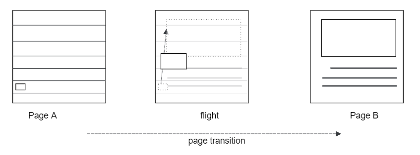
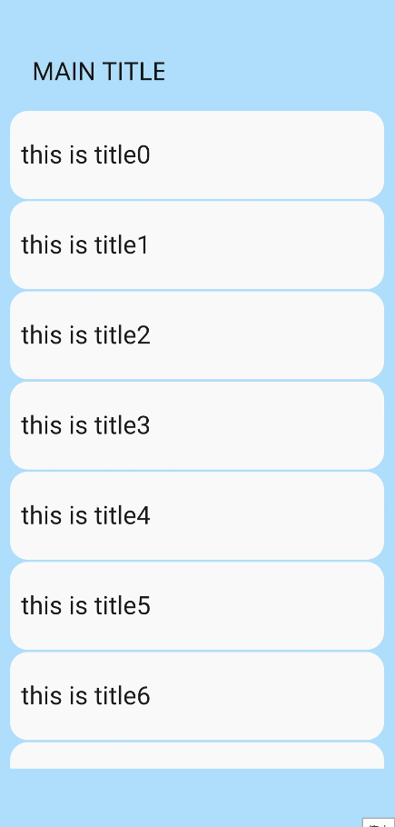
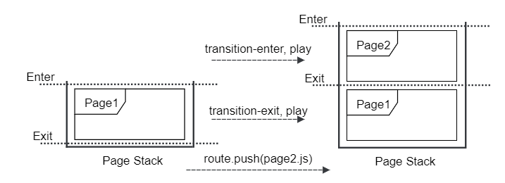
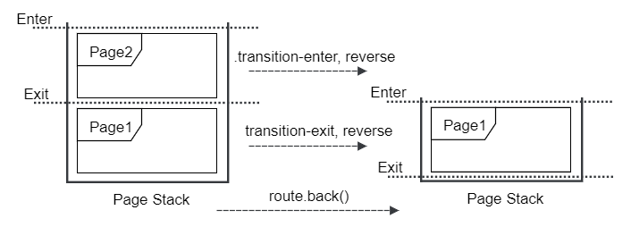
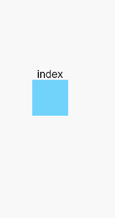

# Transition Styles

>  **NOTE**
>
>  Supported since API version 4. Updates will be marked with a superscript to indicate their earliest API version.

## Transition of Shared Elements


### Attributes

| Name     | Type    | Default Value | Description                                      |
| ------- | ------ | ---- | ---------------------------------------- |
| shareid | string | -   | Used for the transition of shared elements, which takes effect only when this attribute is set. **\<list-item>**, **\<image>**, **\<text>**, **\<button>**, and **\<label>** components are supported for the transition of shared elements.|


### Styles

| Name                               | Type    | Default Value     | Description                                      |
| --------------------------------- | ------ | -------- | ---------------------------------------- |
| shared-transition-effect          | string | exchange | Entry style of a shared element during transition.<br>- **exchange** (default): The source page element is moved to the position of the target page element and is zoomed in or out properly.<br>- **static**: The position of the target page element remains unchanged. You can configure the opacity animation. Currently, only the static effect configured on the target page takes effect.|
| shared-transition-name            | string | -        | During the transition, the style configured on the target page takes effect preferentially. This style is used to configure the animation effect of shared elements. The animation effect is an animation sequence defined by **@keyframes** supporting transform and opacity animations. If the effect of shared elements conflicts with the custom animation, the latter is used.|
| shared-transition-timing-function | string | friction | During the transition, the style configured on the target page takes effect preferentially. This style defines the difference curve during the transition of shared elements. If it is not configured, the friction curve is used.|


### Important Notes

1. If the shared element transition style and custom page transition style are both configured, the latter is used.

2. The exchange effect of shared elements is similar to the transition shown below.

**Figure 1** Default transition effect of shared elements


3. The animation of a shared element does not take effect for the border and background color of the element.

4. During the transition of a shared element, the page element is hidden. Therefore, the animation style and function set for the page element are invalid.

5. During the dynamic change of **shareid**<sup>5+</sup>, if the **shareid** value in component A is overwritten by that in component B, the shared element effect of component A becomes ineffective and will not be restored even if the **shareid** value is changed in component B.


### Example

In the example below, where **PageA** jumps to **PageB**, the shared element is **image**, and the **shareid** is "shareImage".

```html
<!-- PageA -->
<!-- xxx.hml -->
<div>
  <list>
    <list-item type="description">
      <image src="item.jpg" shareid="shareImage" onclick="jump" class="shared-transition-style"></image>
    </list-item>
    <list-item>
      <text onclick="jump">Click on picture to jump to the details</text>
    </list-item>
  </list>
</div>
```

```js
// xxx.js
import router from '@ohos.router';
export default {
  jump() {
    router.push({
      // The path must be the same as that in the config.json file.
      url: 'pages/detailpage',
    });
  },
}
```

```css
/* xxx.css */
.shared-transition-style {
  shared-transition-effect: exchange;
  shared-transition-name: shared-transition;
}
@keyframes shared-transition {
  from { opacity: 0; }
  to { opacity: 1; }
}
```

```html
<!-- PageB -->
<!-- xxx.hml -->
<div>
  <image src="itemDetail.jpg" shareid="shareImage" onclick="jumpBack" class="shared-transition-style"></image>
</div>
```

```js
// xxx.js
import router from '@ohos.router';
export default {
  jumpBack() {
    router.back();
  },
}
```

```css
/* xxx.css */
.shared-transition-style {
  shared-transition-effect: exchange;
  shared-transition-name: shared-transition;
}
@keyframes shared-transition {
  from { opacity: 0; }
  to { opacity: 1; }
}
```


## Widget Transition

>  **NOTE**
>  Widget transitions are not available when other transitions (including shared element transitions and custom transitions) are used.


### Styles

| Name               | Type    | Default Value | Description                                      |
| ----------------- | ------ | ---- | ---------------------------------------- |
| transition-effect | string | -    | Whether a component on the current page displays the transition effect during a widget transition. Available values are as follows:<br>- **unfold**: The component will move upwards by one widget height if the component is located above the widget tapped by the user, or move downwards by one widget height if the component is located below the widget.<br>- **none**: No transition effect is displayed.|


### Example

The **source_page** has a title area on the top and a widget list. Users can tap a widget to switch to the **target_page**.

```html
<!-- source_page -->
<!-- xxx.hml -->
<div class="container">
  <div class="outer">
    <text style="font-size: 23px; margin-bottom: 20px" >MAIN TITLE</text>
  </div>
  <list style="width:340px;height:600px;flex-direction:column;justify-content:center;align-items:center">
    <list-item type="listItem" class="item" card="true" for="list" id="{{$item.id}}" onclick="jumpPage({{$item.id}}, {{$item.url}})">
      <text style="margin-left: 10px; font-size: 23px;">{{$item.title}}</text>
    </list-item>
  </list>
</div>
```

```js
// xxx.js
import router from '@ohos.router'
export default {
  data: { list: [] },
  onInit() {
    for(var i = 0; i < 10; i++) {
      var item = { url: "pages/card_transition/target_page/index", 
                   title: "this is title" + i, id: "item_" + i }
      this.list.push(item);
    }
  },
  jumpPage(id, url) {
    var cardId = this.$element(id).ref;
    router.push({ url: url, params : { ref : cardId } });
  }
}
```

```css
/* xxx.css */
.container {
  width: 100%;
  height: 100%;
  flex-direction: column;
  align-items: center;
  background-color: #ABDAFF;
}
.item {
  height: 80px;
  background-color: #FAFAFA;
  margin-top: 2px;
}
.outer {
  width: 300px;
  height: 100px;
  align-items: flex-end;
  transition-effect: unfold;
}
```

```html
<!-- target_page -->
<!-- xxx.hml -->
<div class="container">
  <div class="div">
    <text style="font-size: 30px">this is detail</text>
  </div>
</div>
```

```css
/* xxx.css */
.container {
  width: 100%;
  height: 100%; 
  flex-direction: column;
  align-items: center;
  background-color: #EBFFD7;
}
.div {
  height: 600px;
  flex-direction: column;
  align-items: center;
  justify-content: center;
}
```




## Page Transition


### Styles

| Name                        | Type    | Default Value          | Description                                      |
| -------------------------- | ------ | ------------- | ---------------------------------------- |
| transition-enter           | string | -             | Works with **@keyframes** and supports transform and opacity animations. For details, see [Attributes available for the @keyframes rule](js-components-common-animation.md).|
| transition-exit            | string | -             | Works with **@keyframes** and supports transform and opacity animations. For details, see [Attributes available for the @keyframes rule](js-components-common-animation.md).|
| transition-duration        | string | Follows the default page transition time of the device| The unit can be s|or ms. The default unit is ms. If no value is specified, the default value is used.|
| transition-timing-function | string | friction      | Speed curve of the transition animation, which makes the animation more fluent. For details, see the description of **animation-timing-function **in [Animation Styles](js-components-common-animation.md).|


### Important Notes

1. When defining a custom transition, set the page background color to an opaque color. Otherwise, the transition effect can be harsh.

2. The **transition-enter** and **transition-exit** styles can be configured separately. The default settings are used if they are not configured.

3. Notes on the **transition-enter** and **transition-exit** styles:

   a. In the push scenario, the animation defined by **transition-enter** is used for entering the **Page2.js** in the page stack; the animation defined by **transition-exit** is used for entering the **Page1.js** in the page stack.
   

   b. In the back scenario, the animation defined by **transition-enter** is used for exiting the **Page2.js** in the page stack, with the animation played in reverse sequence; the animation defined by **transition-exit** is used for exiting the **Page1.js** in the page stack, with the animation played in reverse sequence.
   

### Example

**Page1** has an opaque box. When you tap the box, **Page2** is displayed. When you tap the box on **Page2**, **Page1** is displayed.

1. Page1

   ```html
   <!-- xxx.hml -->
   <div class="container">
       <text>index</text>
       <div class="move_page" onclick="jump"></div>
   </div>
   ```

   ```js
   // xxx.js
   import router from '@ohos.router';
   export default {
       data: {
   
       },
       jump() {
           router.push({
               url:'pages/transition2/transition2'
           })
       }
   }
   ```

   ```css
   /* xxx.css */
   .container {
       flex-direction: column;
       justify-content: center;
       align-items: center;
       width: 100%;
       height: 100%;
   }
   .move_page {
       width: 100px;
       height: 100px;
       background-color: #72d3fa;
       transition-enter: go_page;
       transition-exit: exit_page;
       transition-duration: 5s;
       transition-timing-function: friction;
   }
   
   @keyframes go_page {
       from {
           opacity: 0;
           transform: translate(0px) rotate(60deg) scale(1.0);
       }
   
       to {
           opacity: 1;
           transform: translate(100px) rotate(360deg) scale(1.0);
       }
   }
   @keyframes exit_page {
       from {
           opacity: 1;
           transform: translate(200px) rotate(60deg) scale(2);
       }
   
       to {
           opacity: 0;
           transform: translate(200px) rotate(360deg) scale(2);
       }
   }
   ```


2. Page2

   ```html
   <!-- xxx.hml -->
   <div class="container">
       <text>transition</text>
       <div class="move_page" onclick="jumpBack"></div>
   </div>
   ```

   ```js
   // xxx.js
   import router from '@ohos.router';
   export default {
       data: {
   
       },
       jumpBack() {
           router.back()
       }
   }
   ```

   ```css
   /* xxx.css */
   .container {
       flex-direction: column;
       justify-content: center;
       align-items: center;
       width: 100%;
       height: 100%;
   }
   
   .move_page {
       width: 100px;
       height: 100px;
       background-color: #f172fa;
       transition-enter: go_page;
       transition-exit: exit_page;
       transition-duration: 5s;
       transition-timing-function: ease;
   }
   
   @keyframes go_page {
       from {
           opacity: 0;
           transform:translate(100px) rotate(0deg) scale(1.0);
       }
       to {
           opacity: 1;
           transform:translate(100px) rotate(180deg) scale(2.0);
       }
   }
   
   @keyframes exit_page {
       from {
           opacity: 1;
           transform: translate(0px) rotate(60deg) scale(1);
       }
       to {
           opacity: 0;
           transform: translate(0px) rotate(360deg) scale(1);
       }
   }
   ```

   
