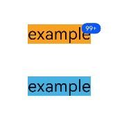

# badge

>  **NOTE**
>
>  This component is supported since API version 5. Updates will be marked with a superscript to indicate their earliest API version.

The **\<badge>** component is used to mark new events that require user attention in your application.


## Required Permissions

None


## Child Components

This component supports only one child component.

>  **NOTE**
>
>  If multiple child components are used, only the first one takes effect by default.


## Attributes

In addition to the [universal attributes](js-components-common-attributes.md), the following attributes are supported.

| Name              | Type       | Default Value  | Mandatory| Description                                                        |
| ------------------ | ----------- | -------- | ---- | ------------------------------------------------------------ |
| placement          | string      | rightTop | No  | Position of a number or dot badge. Available values are as follows:<br>- **right**: on the right border of the component.<br>- **rightTop**: in the upper right corner of the component border.<br>- **left**: on the left border of the component.|
| count              | number      | 0        | No  | Number of notifications displayed via the badge. If the value is 0 (default value), the badge is not displayed. If the value is greater than 0, the badge is a number badge.<br>When the **count** value is greater than the **maxcount** value, *maxcount***+** is displayed. The largest integer value supported for **count** is **2147483647**.|
| visible            | boolean     | false    | No  | Whether to display the badge. The value **true** means that the badge shows up when a new notification is received. To use a number badge, also set the **count** attribute.|
| maxcount           | number      | 99       | No  | Maximum number of notifications. When the number of new notifications exceeds the value of this attribute, *maxcount***+** is displayed, for example, **99+**.<br>The largest integer value supported for **maxcount** is **2147483647**.|
| config             | BadgeConfig | -        | No  | Configuration of the badge.                                |
| label<sup>6+</sup> | string      | -        | No  | Text of the new notification displayed via the badge.<br>When this attribute is set, attributes **count** and **maxcount** do not take effect.|

**Table 1** BadgeConfig

| Name        | Type            | Default Value     | Mandatory  | Description          |
| ---------- | -------------- | -------- | ---- | ------------ |
| badgeColor | &lt;color&gt;  | \#fa2a2d | No   | Background color of the badge.   |
| textColor  | &lt;color&gt;  | \#ffffff | No   | Text color of the number badge.|
| textSize   | &lt;length&gt; | 10px     | No   | Text size of the number badge.|
| badgeSize  | &lt;length&gt; | 6px      | No   | Default size of the dot badge.   |


## Styles

The [universal styles](js-components-common-styles.md) are supported.

>  **NOTE**
>
>  The total size of child components must be smaller than or equal to that of the **\<badge>** component. Otherwise, the child components cannot be displayed.


## Events

The [universal events](js-components-common-events.md) are supported.


## Methods

The [universal methods](js-components-common-methods.md) are supported.


## Example

```html
<!-- xxx.hml -->
<div class="container">
  <badge class="badge" config="{{badgeconfig}}" visible="true" count="100" maxcount="99">
    <text class="text1">example</text>
  </badge>
  <badge class="badge" visible="true" count="0">
    <text class="text2">example</text>
  </badge>
</div>
```

```css
/* xxx.css */
.container {
  flex-direction: column;
  width: 100%;
  align-items: center;
}
.badge {
  width: 50%;
  margin-top: 100px;
}
.text1 {
  background-color: #f9a01e;
  font-size: 50px;
}
.text2 {
  background-color: #46b1e3;
  font-size: 50px;
}
```

```js
// xxx.js
export default {
  data:{
    badgeconfig:{
      badgeColor:"#0a59f7",
      textColor:"#ffffff",
    }
  }
}
```


