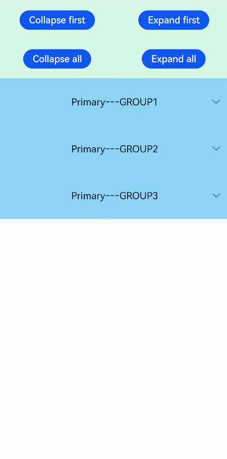

# list-item-group

>  **NOTE**
>
>  This component is supported since API version 4. Updates will be marked with a superscript to indicate their earliest API version.

**\<list-item-group>** is a child component of [\<list>](js-components-container-list.md) and is used to group items in a list. By default, the width of **\<list-item-group>** is equal to that of **\<list>**.


- To use this component, you must set the **columns** attribute of the parent component **\<list>** to **1**. Otherwise, this component is not displayed.

- You can customize the width of each **\<list-item-group>**. However, if you retain the default value **stretch** of **align-items** for the parent component **\<list>**, the width of **\<list-item-group>** is equal to that of **\<list>**. To make the customized **\<list-item-group>** width take effect, set **align-items** to other values rather than **stretch**.

## Required Permissions

None


## Child Components

Only the [\<list-item>](js-components-container-list-item.md) child component is supported.


## Attributes

In addition to the [universal attributes](js-components-common-attributes.md), the following attributes are supported.

| Name  | Type    | Default Value    | Mandatory  | Description                                      |
| ---- | ------ | ------- | ---- | ---------------------------------------- |
| type | string | default | No   | Type of the list-item-group. A list supports multiple list-item-group types. The same type of list-item-groups must have the same view layout after being rendered. If the type is fixed, replace the **if** attribute with the **show** attribute to ensure that the view layout remains unchanged.|

>  **NOTE**
>
>  The universal attribute **id** is used to identify a group. The input parameters of related functions and event information in the list also use **id** to uniquely identify a group.


## Styles

In addition to the [universal styles](js-components-common-styles.md), the following styles are supported.

| Name             | Type    | Default Value       | Mandatory  | Description                                      |
| --------------- | ------ | ---------- | ---- | ---------------------------------------- |
| flex-direction  | string | row        | No   | Main axis direction of the flex container, which defines how items are placed in the container. Available values are as follows:<br>- **column**: Items are placed vertically from top to bottom.<br>- **row**: Items are placed horizontally from left to right.|
| justify-content | string | flex-start | No   | How items are aligned along the main axis of the flex container. Available values are as follows:<br>- **flex-start**: Items are packed toward the start edge of the container along the main axis.<br>- **flex-end**: Items are packed toward the end edge of the container along the main axis.<br>- **center**: Items are packed toward the center of the container along the main axis.<br>- **space-between**: Items are positioned with space between the rows.<br>- **space-around**: Items are positioned with space before, between, and after the rows.<br>- **space-evenly**<sup>5+</sup>: Items are distributed within the container along the main axis, with even space between each two.|


## Events

In addition to the [universal events](js-components-common-events.md), the following events are supported.

| Name           | Parameter                                | Description                                      |
| ------------- | ---------------------------------- | ---------------------------------------- |
| groupclick    | { groupid: string } | Triggered when a group is clicked.<br>**groupid**: ID of the group that is clicked.    |
| groupcollapse | { groupid: string } | Triggered when a group is collapsed.<br>**groupid**: ID of the group collapsed.<br>If the parameter is not carried or **groupid** is left empty, all groups are collapsed.|
| groupexpand   | { groupid: string } | Triggered when a group is expanded.<br>**groupid**: ID of the group expanded.<br>If the parameter is not carried or **groupid** is left empty, all groups are expanded.|


## Methods

The [universal methods](js-components-common-methods.md) are supported.


## Example

```html
<!-- xxx.hml -->
<div class="doc-page">
  <list style="width: 100%;" id="mylist">
    <list-item class="top-list-item" clickeffect="false">
      <div class="item-div">
        <div class="item-child">
          <button type="capsule" value="Collapse first" onclick="collapseOne"></button>
          <button type="capsule" value="Expand first" onclick="expandOne"></button>
        </div>
        <div class="item-child">
          <button type="capsule" value="Collapse all" onclick="collapseAll"></button>
          <button type="capsule" value="Expand all" onclick="expandAll"></button>
        </div>
      </div>
    </list-item>
    <list-item-group for="listgroup in list" id="{{listgroup.value}}" ongroupcollapse="collapse" ongroupexpand="expand">
      <list-item type="item" style="background-color:#FFF0F5;height:95px;">
        <div class="item-group-child">
          <text>One---{{listgroup.value}}</text>
        </div>
      </list-item>
      <list-item type="item" style="background-color: #87CEFA;height:145px;" primary="true">
        <div class="item-group-child">
          <text>Primary---{{listgroup.value}}</text>
        </div>
      </list-item>
    </list-item-group>
  </list>
</div>
```

```css
/* xxx.css */
.doc-page {
  flex-direction: column;
}
.top-list-item {
  width:100%;
  background-color:#D4F2E7;
}
.item-div {
  flex-direction:column;
  align-items:center;
  justify-content:space-around;
  height:240px;
}
.item-child {
  width:100%;
  height:60px;
  justify-content:space-around;
  align-items:center;
}
.item-group-child {
  justify-content: center;
  align-items: center;
  width:100%;
}
```

```js
// xxx.js
import promptAction from '@ohos.promptAction';
export default {
    data: {
        direction: 'column',
        list: [],
        listAdd: []
    },
    onInit() {
        this.list = []
        this.listAdd = []
        for (var i = 1; i <= 3; i++) {
            var dataItem = {
                value: 'GROUP' + i,
            };
            this.list.push(dataItem);
        }
    },
    collapseOne(e) {
        this.$element('mylist').collapseGroup({
            groupid: 'GROUP1'
        })
    },
    expandOne(e) {
        this.$element('mylist').expandGroup({
            groupid: 'GROUP1'
        })
    },
    collapseAll(e) {
        this.$element('mylist').collapseGroup({
            groupid: ''
        })
    },
    expandAll(e) {
        this.$element('mylist').expandGroup({
            groupid: ''
        })
    },
    collapse(e) {
        promptAction.showToast({
            message: 'Close ' + e.groupid
        })
    },
    expand(e) {
        promptAction.showToast({
            message: 'Open ' + e.groupid
        })
    }
}


```


