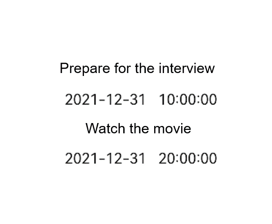

# list

>  **NOTE**
>
>  This component is supported since API version 4. Updates will be marked with a superscript to indicate their earliest API version.

The **\<list>** component provides a list container that presents a series of list items arranged in a column with the same width. It supports presentations of the same type of data in a multiple and coherent row style, for example, images or text.

## Required Permissions

None


## Child Components

The **[\<list-item-group>](js-components-container-list-item-group.md)** and **[\<list-item>](js-components-container-list-item.md)** components are supported.


## Attributes

In addition to the [universal attributes](js-components-common-attributes.md), the following attributes are supported.

| Name                         | Type                                      | Default Value    | Mandatory  | Description                                      |
| --------------------------- | ---------------------------------------- | ------- | ---- | ---------------------------------------- |
| scrollpage                  | boolean                                  | false   | No   | Whether to scroll the non-list part on the top of the list page out of the visible area with the list. The value can be **true** (scrolls the non-list part out) or **false** (does not scroll the non-list part out). This attribute is not available when the direction is **row**.|
| cachedcount                 | number                                   | 0       | No   | Minimum number of cached list items when a long list is loaded with delay.<br>When the number of list items cached outside the visible area is less than the value of this attribute, a **requestitem** event is triggered.|
| scrollbar                   | string                                   | off     | No   | Display mode of the side scrollbar. (Currently, only the vertical scrollbar is supported.)<br>- **off**: no display.<br>- **auto**: displayed on demand (The side scrollbar is displayed when touched and disappears 2s later.).<br>- **on**: always displayed.|
| scrolleffect                | string                                   | spring  | No   | Scroll effect. Available values are as follows:<br>- **spring**: Similar to the physical dynamic effect of a spring. After scrolling to the edge, you can continue to scroll for a distance based on the initial speed or by touching the knob of the scrollbar. After you release your hand, the knob is rebounded.<br>- **fade**: Similar to the physical dynamic effect of fade. When you scroll to the edge, a wave shape fades. The fade changes according to the speed and scrolling distance.<br>- **no**: No effect after the scrollbar is moved to the edge.|
| indexer                     | boolean \| Array&lt;string&gt; | false   | No   | Whether to display the alphabetical index bar on the sidebar. If this attribute is set to **true** or a customized indexer, the index bar is displayed at the right boundary of the list. Example:<br>**"indexer" : "true"** indicates the default alphabetical indexer.<br>**"indexer" : "false"** indicates no indexer.<br>"indexer": ['#', '1', '2', '3', '4', '5', '6', '7', '8'] indicates a customized index. You must include **"#"** when using a customized indexer.<br>This **indexer** attribute is valid only when **flex-direction** is set to **column** and **columns** is set to **1**.<br>This attribute must be used together with the **[section](js-components-container-list-item.md#attributes)** attribute of **\<list-item>**.|
| indexercircle<sup>5+</sup>  | boolean                                  | -       | No   | Whether to use a circle indexer.<br>The default value is **true** for wearables and **false** for other device types. This attribute is invalid if **indexer** is set to **false**.|
| indexermulti<sup>5+</sup>   | boolean                                  | false   | No   | Whether to use a multi-language indexer.<br>This attribute is invalid if **indexer** is set to **false**.    |
| indexerbubble<sup>5+</sup>  | boolean                                  | true    | No   | Whether to display the bubble effect when switching among indexes.<br>This attribute is invalid if **indexer** is set to **false**.   |
| divider<sup>5+</sup>        | boolean                                  | false   | No   | Whether list items are separated by dividers.<br>For details about divider styles, see **divider-color**, **divider-height**, **divider-length**, and **divider-origin** in the **Styles** table.|
| shapemode                   | string                                   | default | No   | Shape of the side scrollbar.<br>- **default**: not specified (following the theme).<br>- **rect**: rectangle.<br>- **round**: circle.|
| updateeffect                | boolean                                  | false   | No   | Whether a dynamic effect is displayed when an item in the list is deleted or added.<br>- **false**: No dynamic effect is displayed.<br>- **true**: A dynamic effect is displayed when an item is added or deleted.|
| chainanimation<sup>5+</sup> | boolean                                  | false   | No   | Whether to display chained animations on this list when it slides or its top and bottom are dragged. The list items are separated with even space, and one item animation starts after the previous animation during basic sliding interactions. The chained animation effect is similar with spring physics.<br>- **false**: Chained animations are displayed.<br>- **true**: No chained animation is displayed.<br>Type of the **Enter** key on the soft keyboard. The value cannot be dynamically updated.<br>This attribute does not take effect if an indexer is used.<br>If this attribute is **true**, the **sticky** attributes set for **\<list-item>** components do not take effect.|
| initialindex                | number                                   | 0       | No   | Item displayed at the start position of the viewport when the current list is loaded for the first time. The default value is **0**, indicating that the first item is displayed. If the number you set is greater than the index of the last item, the setting does not take effect. When the **initialoffset** attribute is set, this attribute does not take effect. This attribute does not take effect if **indexer** or **scrollpage** is set to **true**.|
| initialoffset               | &lt;length&gt;                           | 0       | No   | Start offset of the viewport when the current list is loaded for the first time. The offset must not exceed the scrolling range of the current list. If exceeded, the offset is truncated to the maximum value of the scrolling range. This attribute does not take effect if **indexer** or **scrollpage** is set to **true**.|
| selected<sup>5+</sup>       | string                                   | -       | No   | Selected item in the current list. The value can be a **section** value of any list items.|


## Styles

In addition to the [universal styles](js-components-common-styles.md), the following styles are supported.

| Name                           | Type                                      | Default Value        | Mandatory  | Description                                      |
| ----------------------------- | ---------------------------------------- | ----------- | ---- | ---------------------------------------- |
| divider-color<sup>5+</sup>    | &lt;color&gt;                            | transparent | No   | Item divider color. This style is valid only when the **divider** attribute of **\<list>** is set to **true**.     |
| divider-height<sup>5+</sup>   | &lt;length&gt;                           | 1           | No   | Item divider height. This style is valid only when the **divider** attribute of **\<list>** is set to **true**.     |
| divider-length<sup>5+</sup>   | &lt;length&gt;                           | Main axis width       | No   | Item divider length. If this style is not set, the maximum length is the width of the main axis, and the actual length depends on the **divider-origin** parameter. This style is valid only when the **divider** attribute of **\<list>** is set to **true**.|
| divider-origin<sup>5+</sup>   | &lt;length&gt;                           | 0           | No   | Item divider offset relative to the start point of the main axis. This style is valid only when the **divider** attribute of **\<list>** is set to **true**.|
| flex-direction                | string                                   | column      | No   | Main axis direction of the flex container. It specifies how items are placed in the flex container.<br>- **column**: The y-axis is the main axis.<br>- **row**: The x-axis is the main axis.<br>For the **\<list>** component, the default value is **column**. For other components, the default value is **row**.|
| columns                       | number                                   | 1           | No   | Number of columns displayed in the cross axis direction of the list. The default value is **1**.<br>When multiple columns are set, the columns are evenly distributed on the cross axis of the **\<list>** component. The size of each column is the same.|
| align-items                   | string                                   | stretch     | No   | Alignment of items in each column on the cross axis. Available values are as follows:<br>- **stretch**: Items are stretched to the same height or width as the container in the cross axis direction.<br>- **flex-start**: Items are aligned to the start of the cross axis.<br>- **flex-end**: Items are aligned to the end of the cross axis.<br>- **center**: Items are aligned in the center of the cross axis.<br>This style takes effect only on items of each column. Columns are evenly distributed.|
| item-extent                   | &lt;length&gt; \| &lt;percentage&gt; | -           | No   | Size of an internal item. When a percentage is set, the value indicates the percentage of the length in the main axis direction relative to the list viewpoint.|
| fade-color                    | &lt;color&gt;                            | grey        | No   | Color of the physical dynamic effect. This attribute is valid only when **scrolleffect** is set to **fade**.          |
| scrollbar-color<sup>6+</sup>  | &lt;color&gt;                            | -           | No   | Color of the scrollbar.                               |
| scrollbar-width<sup>6+</sup>  | &lt;length&gt;                           | -           | No   | Width of the scrollbar.                               |
| scrollbar-offset<sup>6+</sup> | &lt;length&gt;                           | 0           | No   | Offset between the scrollbar and the default position of the list. The value must be a positive number. The default position is on the right edge of the list. You can adjust the horizontal position of the scrollbar by setting this offset. If the scrollbar is drawn outside the list and the parent component of the list is capable of cropping, the scrollbar will be cropped.|


## Events

In addition to the [universal events](js-components-common-events.md), the following events are supported.

| Name                        | Parameter                                      | Description                                      |
| -------------------------- | ---------------------------------------- | ---------------------------------------- |
| indexerchange<sup>5+</sup> | { local: booleanValue }   | Triggered when the indexer switches between local and alphabetic indexers. This parameter takes effect only when both **indexer** and **indexermulti** are set to **true**. The values of **booleanValue** can be:<br>- **true**: The local index is displayed.<br>- **false**: The alphabetic index is displayed.|
| scroll                     | { scrollX: scrollXValue, scrollY: scrollYValue, scrollState: stateValue } | Triggered to indicate the offset and status of list scrolling.<br>**stateValue: 0**: The list is not scrolling.<br>**stateValue: 1**: The list is scrolling along with user's touches.<br>**stateValue: 2**: The list is scrolling after the touches stop.|
| scrollbottom               | -                                        | Triggered when the list is scrolled to the bottom.                           |
| scrolltop                  | -                                        | Triggered when the list is scrolled to the top.                           |
| scrollend                  | -                                        | Triggered when the list stops scrolling.                               |
| scrolltouchup              | -                                        | Triggered when the list continues scrolling after the user lifts their fingers.                        |
| requestitem                | -                                        | Triggered for a request to create a list-item.<br>This event is triggered when the number of cached list-items outside the visible area is less than the value of **cachedcount** during long list loading with delay.|
| rotation<sup>7+</sup> | { rotateValue: number }   | Triggered to indicate the incremental value of the rotation angle of the watch crown. This parameter is only supported by wearables.                    |


## Methods

In addition to the [universal methods](js-components-common-methods.md), the following methods are supported.

| Name           | Parameter                                      | Description                                      |
| ------------- | ---------------------------------------- | ---------------------------------------- |
| scrollTo      | { index: number(specified position) }  | Scrolls the list to the position of the item at the specified index.                  |
| scrollTop     | { smooth: boolean }       | If **smooth** is set to **false** (default value), the list is directly scrolled to the top.<br>If **smooth** is set to **true**, the list is smoothly scrolled to the top.|
| scrollBottom  | { smooth: boolean }       | If **smooth** is set to **false** (default value), the list is directly scrolled to the bottom.<br>If **smooth** is set to **true**, the list is smoothly scrolled to the bottom.|
| scrollPage    | { reverse: boolean, smooth: boolean } | If **reverse** is set to **false** (default value), the next page is displayed. If there is no next page, the list scrolls to the bottom.<br>If **reverse** is set to **true**, the previous page is displayed. If there is no previous page, the list scrolls to the top.<br>If **smooth** is set to **false** (default value), the list is directly scrolled to another page.<br>If **smooth** is set to **true**, the list is smoothly scrolled to another page.|
| scrollArrow   | { reverse: boolean, smooth: boolean } | If **reverse** is set to **false** (default value), the list scrolls towards the bottom for a certain distance. If there is no sufficient distance, the list scrolls to the bottom.<br>If **reverse** is set to **true**, the list scrolls towards the top for a certain distance. If there is no sufficient distance, the list scrolls to the top.<br>If **smooth** is set to **false** (default value), the list is directly scrolled.<br>If **smooth** is set to **true**, the list is smoothly scrolled.|
| collapseGroup | { groupid: string }       | Collapses a group.<br>**groupid**: ID of the group to collapse.<br>All groups are collapsed when **groupid** is not specified.|
| expandGroup   | { groupid: string }       | Expands a group.<br>**groupid**: ID of the group to expand.<br>All groups are expanded when **groupid** is not specified.|
| currentOffset | -                                        | Returns the offset of the current scrolling. The return value type is Object. For details, see **currentOffset**.|

**Table 1** currentOffset

| Name  | Type    | Remarks              |
| ---- | ------ | ---------------- |
| x    | number | Scrolling offset in the x-axis, in px|
| y    | number | Scrolling offset in the y-axis, in px|

## Example

```html
<!-- index.hml -->
<div class="container">
  <list class="todo-wrapper">
    <list-item for="{{todolist}}" class="todo-item">
      <div style="flex-direction: column;align-items: center;justify-content: center;">
        <text class="todo-title">{{$item.title}}</text>
        <text class="todo-title">{{$item.date}}</text>
      </div>
    </list-item>
  </list>
</div>
```
```css
/* index.css */
.container {
  display: flex;
  justify-content: center;
  align-items: center;
  width: 100%;
  height: 100%;
}
.todo-wrapper {
  width: 100%;
  height: 300px;
}
.todo-item {
  width: 100%;
  height: 120px;
  justify-content:center;
}
.todo-title {
  width: 100%;
  height: 80px;
  text-align: center;
}
```

```js
// index.js
export default {
  data: {
    todolist: [{
      title: 'Prepare for the interview',
      date: '2021-12-31 10:00:00'
    }, {
      title: 'Watch the movie',
      date: '2021-12-31 20:00:00'
    }],
  },
}
```



