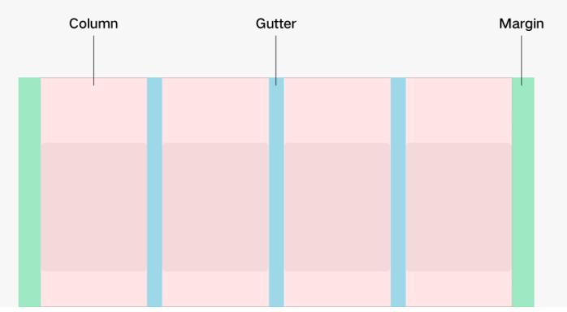

# Basic Concepts

Grid components layout elements in a grid system which is built based on  **<grid-container\>**,  **<grid-row\>**, and  **<grid-col\>**  containers.

As a layout-auxiliary positioning tool, the grid system plays an essential role in graphic design, website design, and the UI design of mobile devices. The grid system offers the following advantages for mobile devices:

1.  Provides rules for layout design and resolves issues of dynamic layout across devices with different sizes.

2.  Provides a unified positioning method for the system to ensure layout consistency among modules on different devices.

3.  Provides a flexible spacing adjustment method for applications to keep up with layout in special scenarios.

## Concepts

A column system consists of three attributes: margins, gutters, and columns.

1.  **Margin**

    Margins are used to control the distances between elements and edges of a screen. You can define different margins based on the screen sizes to serve as the unified specifications for breakpoints.

2.  **Gutter**

    Gutters are used to control the distances between elements. You can define different gutter values based on the screen sizes to serve as the unified specifications for breakpoints. To achieve a good visual effect, set the values of gutters not greater than the margins values.

3.  **Column**

    Columns are used for positioning in the layout. The positioning for different screen sizes is determined by the numbers of columns. The column width is automatically calculated based on the actual device width and the number of columns when the margins and gutters meet the specifications.  

    **Breakpoint System**

    The grid system defines the mapping between the number of columns and the width of devices, which is known as the rules in the breakpoint system.

    The grid system uses the horizontal virtual pixels \(vps\) to determine the breakpoints. Different devices display different numbers of columns based on their horizontal vps within different breakpoint ranges.

    **xs**: 2 columns for 0 < horizontal vp < 320

    **sm**: 4 columns for 320 ≤ horizontal vp < 600

    **md**: 8 columns for 600 ≤ horizontal vp < 840

    **lg**: 12 columns for 840 ≤ horizontal vp

