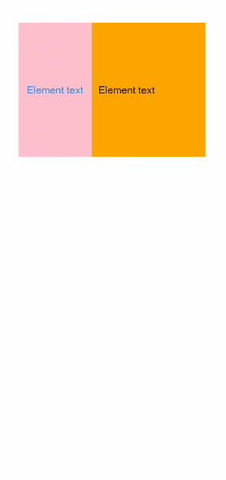

# grid-col

>  **NOTE**
>
>  This component is supported since API version 5. Updates will be marked with a superscript to indicate their earliest API version.

The **\<grid-col>** is the child component of the **\<grid-row>** container.

## Required Permissions

None


## Child Components

Supported


## Attributes

In addition to the [universal attributes](js-components-common-attributes.md), the following attributes are supported.

| Name    | Type            | Default Value | Mandatory  | Description                                      |
| ------ | -------------- | ---- | ---- | ---------------------------------------- |
| xs     | number\|object | -    | No   | Number of columns occupied by this item and its offset when **sizetype** is **xs**. If you set the value of the number type, you only set the number of columns. You can set a value of the object type for both the number of occupied columns and the offset, for example, **{"span": 1, "offset": 0}**. |
| sm     | number\|object | -    | No   | Number of columns occupied by this item and its offset when **sizetype** is **sm**. If you set the value of the number type, you only set the number of columns. You can set a value of the object type for both the number of occupied columns and the offset, for example, **{"span": 1, "offset": 0}**. |
| md     | number\|object | -    | No   | Number of columns occupied by this item and its offset when **sizetype** is **md**. If you set the value of the number type, you only set the number of columns. You can set a value of the object type for both the number of occupied columns and the offset, for example, **{"span": 1, "offset": 0}**. |
| lg     | number\|object | -    | No   | Number of columns occupied by this item and its offset when **sizetype** is **lg**. If you set the value of the number type, you only set the number of columns. You can set a value of the object type for both the number of occupied columns and the offset, for example, **{"span": 1, "offset": 0}**. |
| span   | number         | 1    | No   | Default number of columns occupied by the item when no breakpoint is set.                        |
| offset | number         | 0    | No   | Default number of offset columns in the container layout direction when **"offset"** is not set for a specific **sizetype**.      |


## Styles

In addition to the [universal styles](js-components-common-styles.md), the following styles are supported.

| Name                           | Type            | Default Value       | Mandatory  | Description                                      |
| ----------------------------- | -------------- | ---------- | ---- | ---------------------------------------- |
| flex-direction                | string         | row        | No   | Main axis direction of the flex container, which defines how items are placed in the container. Available values are as follows:<br>- **column**: Items are placed vertically from top to bottom.<br>- **row**: Items are placed horizontally from left to right.|
| flex-wrap                     | string         | nowrap     | No   | Whether items in the flex container are displayed in a single line or multiple lines. The value cannot be dynamically updated. Available values are as follows:<br>- **nowrap**: Items are displayed on a single axis.<br>- **wrap**: Items are displayed on multiple axes.|
| justify-content               | string         | flex-start | No   | How items are aligned along the main axis of the flex container. Available values are as follows:<br>- **flex-start**: Items are packed towards the start row.<br>- **flex-end**: Items are packed towards the end row.<br>- **center**: Items are centered along the row.<br>- **space-between**: Items are positioned with space between the rows.<br>- **space-around**: Items are positioned with space before, between, and after the rows.|
| align-items                   | string         | stretch    | No   | How items are aligned along the cross axis in a flex container. Available values are as follows:<br>- **stretch**: Items are stretched to the same height or width as the container in the cross axis direction.<br>- **flex-start**: Items are aligned to the start of the cross axis.<br>- **flex-end**: Items are aligned to the end of the cross axis.<br>- **center**: Items are aligned in the center of the cross axis.|
| align-content                 | string         | flex-start | No   | Multi-row alignment mode when there is extra space in the cross axis. Available values are as follows:<br>- **flex-start**: All rows are packed towards the start of the cross axis. The start edge of the cross axis of the first row is aligned with the start edge of the cross axis of the container. All subsequent rows are aligned with the previous row.<br>- **flex-end**: All rows are packed towards the end of the cross axis. The end of the cross axis of the last row is aligned with the end of the cross axis of the container. All subsequent rows are aligned with the previous row.<br>- **center**: All rows are packed towards the center of the container. Rows are close to each other and aligned with the center of the container. The spacing between the start edge of the container's cross axis and the first row is equal to the spacing between the end edge of the container's cross axis and the last row.<br>- **space-between**: All rows are evenly distributed in the container. The spacing between two adjacent rows is the same. The start and end edges of the container's cross axis are aligned with the edges of the first and last rows, respectively.<br>- **space-around**: All rows are evenly distributed in the container, and the spacing between two adjacent lines is the same. The spacing between the start edge of the container's cross axis and the first row and that between the end edge and the last row are half of the spacing between two adjacent rows.|
| display                       | string         | flex       | No   | Type of the view box of the item. The value cannot be dynamically updated. Available values are as follows:<br>- **flex**: flexible layout.<br>- **grid**: grid layout.<br>- **none**: The box is disabled.|
| grid-template-[columns\|rows] | string         | 1 row, 1 column      | No   | Number of rows and columns in the current grid layout. If this attribute is not set, one row and one column are displayed by default. This attribute is valid only when **display** is set to **grid**.<br>Below are some example values of **grid-template-columns**:<br>- **50px 100px 60px**: There are three columns. The first column is 50 px, the second column is 100 px, and the third column is 60 px.<br>- **1fr 1fr 2fr**: There are three columns, and the width allowed by the parent component is divided into four equal shares. The first column occupies one share, the second column occupies one share, and the third column occupies two shares.<br>- **30% 20% 50%**: There are three columns. The first column occupies 30% of the total width allowed by the parent component, the second column occupies 20%, and the third column occupies 50%.<br>- **repeat (2,100px)**: There are two columns. The first column is 100 px, and the second column is 100 px.<br>- **auto 1fr 1fr**: There are three columns. The first column is adaptive to the width required by its child components. The remaining space is divided into two equal shares, one share occupied by each of the rest two columns.|
| grid-[columns\|rows]-gap      | &lt;length&gt; | 0          | No   | Size of the gap between two consecutive rows or columns in a grid layout. You can also use **grid-gap** to set the same size of the gap between rows and columns. This attribute is valid only when **display** is set to **grid**.|
| grid-row-[start\|end]         | number         | -          | No   | Start and end row numbers of the current item in the grid layout. This attribute is valid only when the item's parent component is a **\<div>** container whose **display** style is set to **grid**.|
| grid-column-[start\|end]      | number         | -          | No   | Start and end column numbers of the current item in the grid layout. This attribute is valid only when the item's parent component is a **\<div>** container whose **display** style is set to **grid**.|

>  **NOTE**
>
>  Width-related styles are not supported.


## Events

The [universal events](js-components-common-events.md) are supported.


## Methods

The [universal methods](js-components-common-methods.md) are supported.


## Example

```html
<!-- index.hml -->
<div class="container">
  <grid-container id="mygrid" columns="5" gutter="20px" style="background-color: pink;">
    <grid-row style="height:400px;justify-content:space-around;">
      <grid-col span="2">
        <div style="align-items: center;justify-content: center;height: 100%;width: 100%;">
          <text style="color: dodgerblue;" onclick="getCol">Element text</text>
        </div>
      </grid-col>
      <grid-col span="3" style="background-color:orange;">
        <div style="width: 100%;height: 100%;padding: 20px;align-items: center;">
          <text onclick="getColWidth">Element text</text>
        </div>
      </grid-col>
    </grid-row>
  </grid-container>
</div>
```

```css
/* index.css */
.container {
  flex-direction: column;
  padding-top: 80px;
}
```

```js
// index.js
import prompt from '@system.prompt';
export default {
  getCol(e) {
    this.$element('mygrid').getColumns(function (result) {
      prompt.showToast({
        message: e.target.id + ' result = ' + result,
        duration: 3000,
      });
    })
  },
  getColWidth(e) {
    this.$element('mygrid').getColumnWidth(function (result) {
      prompt.showToast({
        message: e.target.id + ' result = ' + result,
        duration: 3000,
      });
    })
  }
}
```


