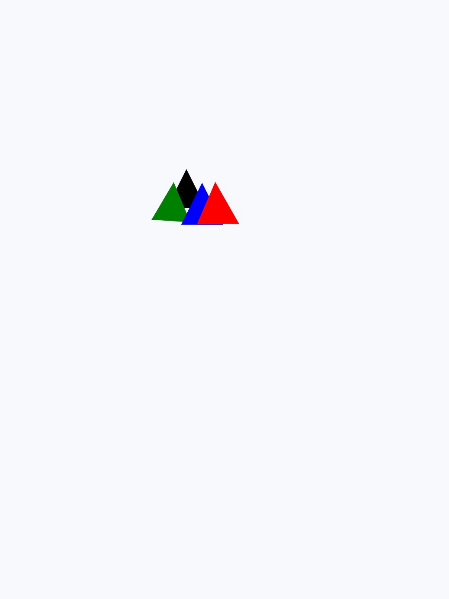

# animateTransform


>  **NOTE**
>
>  This component is supported since API version 7. Updates will be marked with a superscript to indicate their earliest API version.

The **\<animateTransform>** component is used to apply a transform animation and supports the following components:


&lt;circle&gt;, &lt;ellipse&gt;, &lt;line&gt;, &lt;path&gt;, &lt;polygon&gt;, &lt;polyline&gt;, &lt;rect&gt;, &lt;text&gt;

## Required Permissions

None


## Child Components

Not supported


## Attributes

The **animate** attributes and the attributes in the following table are supported.

| Name| Type| Default Value| Mandatory| Description|
| -------- | -------- | -------- | -------- | -------- |
| type | [translate \| scale \| rotate \| skewX \| skewY] | - | Yes| Transform animation type.|


## Example

```html
<!-- xxx.hml -->
<div class="container">
  <div class="back_container">
    <svg>
      <polygon points="60,30 90,90 30,90" fill="red">
        <animateTransform attributeName="transform" attributeType="XML" type="rotate" from="0 120 140" to="360 360 420" dur="3s" repeatCount="indefinite"></animateTransform>
      </polygon>
      <polygon points="60,30 90,90 30,90" fill="red">
        <animateTransform attributeName="transform" attributeType="XML" type="rotate" from="0" to="360" dur="3s" repeatCount="indefinite"></animateTransform>
      </polygon>
      <polygon points="60,30 90,90 30,90" fill="green">
        <animateTransform attributeName="transform" attributeType="XML" type="scale" from="1" to="2" dur="3s" repeatCount="indefinite"></animateTransform>
      </polygon>
      <polygon points="60,30 90,90 30,90" fill="green">
        <animateTransform attributeName="transform" attributeType="XML" type="scale" from="1 1" to="2 4" dur="3s" repeatCount="indefinite"></animateTransform>
      </polygon>
      <polygon points="60,30 90,90 30,90" fill="#D2691E">
        <animateTransform attributeName="transform" attributeType="XML" type="skewX" from="10" to="100" dur="3s" repeatCount="indefinite"></animateTransform>
      </polygon>
      <polygon points="60,30 90,90 30,90" fill="#D2691E">
        <animateTransform attributeName="transform" attributeType="XML" type="skewY" from="10" to="100" dur="3s" repeatCount="indefinite"></animateTransform>
      </polygon>
      <polygon points="60,30 90,90 30,90" fill="#D2691E">
        <animateTransform attributeName="transform" attributeType="XML" type="skewX" from="10" to="100" dur="3s" repeatCount="indefinite"></animateTransform>
        <animateTransform attributeName="transform" attributeType="XML" type="skewY" from="10" to="100" dur="3s" repeatCount="indefinite"></animateTransform>
      </polygon>
      <polygon points="60,30 90,90 30,90" fill="blue">
        <animateTransform attributeName="transform" attributeType="XML" type="translate" from="0" to="300" dur="3s" repeatCount="indefinite"></animateTransform>
      </polygon>
      <polygon points="60,30 90,90 30,90" fill="blue">
        <animateTransform attributeName="transform" attributeType="XML" type="translate" from="0 0" to="0 300" dur="3s" repeatCount="indefinite"></animateTransform>
      </polygon>
      <polygon points="60,30 90,90 30,90" fill="blue">
        <animateTransform attributeName="transform" attributeType="XML" type="translate" from="0 0" to="300 300" dur="3s" repeatCount="indefinite"></animateTransform>
      </polygon>
    </svg>
  </div>
</div>
```

```css
/* xxx.css */
.container {
  flex-direction: column;
  justify-content: flex-start;
  align-items: flex-start;
  background-color: #f8f8ff;
}

.back_container {
  flex-direction: row;
  justify-content: flex-start;
  align-items: flex-start;
  height: 1000px;
  width: 1080px;
}
```


Animation overlay


```html
<!-- xxx.hml -->
<div class="container">
  <div class="back_container">
    <svg>
      <polygon points="60,30 90,90 30,90" fill="black">
        <animateTransform attributeName="transform" attributeType="XML" type="translate" values="0 0; 200 200; 400 0;
          600 200" keyTimes="0; 0.4; 0.8;1.0" dur="3s" repeatCount="indefinite"></animateTransform>
      </polygon>
      <polygon points="60,30 90,90 30,90" fill="green">
        <animateTransform attributeName="transform" attributeType="XML" type="translate" values="0 0; 200 200; 400 0;
          600 200" keyTimes="0; 0.4; 0.8;1.0" dur="3s" repeatCount="indefinite"></animateTransform>
        <animateTransform attributeName="transform" attributeType="XML" type="rotate" values="0; 5; 0; 10" keyTimes="0;
          0.4; 0.8; 1.0" dur="3s" repeatCount="indefinite"></animateTransform>
      </polygon>
      <polygon points="60,30 90,90 30,90" fill="blue">
        <animateTransform attributeName="transform" attributeType="XML" type="translate" values="0 0; 200 200; 400 0;
          600 200" keyTimes="0; 0.4; 0.8;1.0" dur="3s" repeatCount="indefinite"></animateTransform>
        <animateTransform attributeName="transform" attributeType="XML" type="scale" values="1; 1.2; 1; 1.2"
          keyTimes="0; 0.4; 0.8; 1.0" dur="3s" repeatCount="indefinite"></animateTransform>
      </polygon>
      <polygon points="60,30 90,90 30,90" fill="red">
        <animateTransform attributeName="transform" attributeType="XML" type="translate" values="0 0; 200 200; 400 0;
          600 200" keyTimes="0; 0.4; 0.8;1.0" dur="3s" repeatCount="indefinite"></animateTransform>
        <animateTransform attributeName="transform" attributeType="XML" type="scale" values="1; 1.2; 1; 1.2"
          keyTimes="0; 0.4; 0.8; 1.0" dur="3s" repeatCount="indefinite"></animateTransform>
        <animateTransform attributeName="transform" attributeType="XML" type="skewX" values="0; 10; 0; 10"
          keyTimes="0; 0.4; 0.8; 1.0" dur="3s" repeatCount="indefinite"></animateTransform>
      </polygon>
    </svg>
  </div>
</div>
```


```css
/* xxx.css */
.container {
  flex-direction: column;
  justify-content: flex-start;
  align-items: flex-start;
  background-color: #f8f8ff;
}
.back_container {
  flex-direction: row;
  justify-content: flex-start;
  align-items: flex-start;
  height: 1000px;
  width: 1080px;
}
```





Example of involved components


```html
<!-- xxx.hml -->
<div class="container">
  <div class="back_container">
    <svg>
      <svg fill="white" width="600" height="600" viewBox="0 0 50 50">
        <path stroke="black" fill="none" stroke-linejoin="miter" stroke-miterlimit="1" id="p2"
          d="M1,19 l7,-3 l7,3 m2,0 l3.5,-3 l3.5 ,3 m2,0 l2 ,-3 l2 ,3 m2,0 l0.75,-3 l0.75,3 m2,0 l0.5 ,-3 l0.5,3">
          <animateTransform attributeName="transform" attributeType="XML" type="translate" from="0" to="25"
            dur="3s" repeatCount="indefinite"></animateTransform>
        </path>
      </svg>
      <polygon points="60,20 90,80 30,80" fill="black">
        <animateTransform attributeName="transform" attributeType="XML" type="translate" from="0" to="300"
          dur="3s" repeatCount="indefinite"></animateTransform>
      </polygon>
      <circle cx="60" cy="130" r="40" stroke-width="4" fill="white" stroke="blue">
        <animateTransform attributeName="transform" attributeType="XML" type="translate" from="0" to="300"
          dur="3s" repeatCount="indefinite"></animateTransform>
      </circle>
      <line x1="10" x2="300" y1="280" y2="280" stroke-width="10" stroke="black" stroke-linecap="square">
        <animateTransform attributeName="transform" attributeType="XML" type="translate" from="0" to="300"
          dur="3s" repeatCount="indefinite"></animateTransform>
      </line>
      <polyline points="10,380 50,335 50,385 100,310" fill="white" stroke="black">
        <animateTransform attributeName="transform" attributeType="XML" type="translate" from="0" to="300"
          dur="3s" repeatCount="indefinite"></animateTransform>
      </polyline>
      <ellipse cx="100" cy="450" rx="70" ry="50" fill="blue">
        <animateTransform attributeName="transform" attributeType="XML" type="translate" from="0" to="300"
          dur="3s" repeatCount="indefinite"></animateTransform>
      </ellipse>
      <rect width="100" height="100" x="50" y="540" stroke-width="10" stroke="red" rx="10" ry="10"
        stroke-dasharray="5 3" stroke-dashoffset="3">
        <animateTransform attributeName="transform" attributeType="XML" type="translate" from="0" to="300"
          dur="3s" repeatCount="indefinite"></animateTransform>
      </rect>
      <text x="20" y="700" fill="#D2691E" font-size="40">
        animate-transform
        <animateTransform attributeName="transform" attributeType="XML" type="translate" from="0" to="300"
          dur="3s" repeatCount="indefinite"></animateTransform>
      </text>
    </svg>
  </div>
</div>
```


```css
/* xxx.css */
.container {
  flex-direction: column;
  justify-content: flex-start;
  align-items: flex-start;
  background-color: #f8f8ff;
}
.back_container {
  flex-direction: row;
  justify-content: flex-start;
  align-items: flex-start;
  height: 1000px;
  width: 1080px;
}
```


